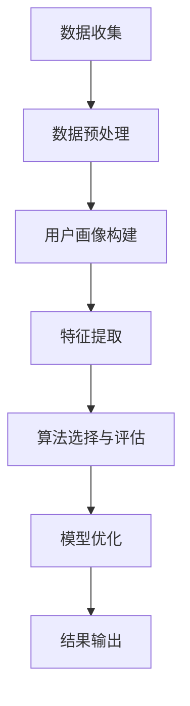

                 

关键词：人工智能，电商，用户购买力，精准评估，机器学习，数据挖掘，算法

> 摘要：本文将探讨如何利用人工智能技术，特别是机器学习和数据挖掘技术，对电商平台的用户购买力进行精准评估。我们将深入分析核心概念、算法原理、数学模型以及实际应用场景，旨在为电商企业提升用户购买力评估的效率和准确性提供有价值的参考。

## 1. 背景介绍

随着电子商务的迅猛发展，用户数量的快速增长以及市场竞争的日益激烈，电商企业对用户购买力的精准评估显得尤为重要。传统的用户购买力评估方法通常依赖于简单的统计分析和人工经验，这些方法在面对复杂、大规模的用户数据时往往显得力不从心。而人工智能技术，特别是机器学习和数据挖掘技术的出现，为电商企业提供了更加高效、精准的用户购买力评估手段。

### 1.1 电商行业的发展现状

近年来，电商行业经历了飞速的发展。根据统计数据，全球电商市场规模持续扩大，电商销售额占零售市场份额的比例逐年上升。在这样一个竞争激烈的市场环境中，电商企业需要通过精准的用户购买力评估来识别高价值用户，优化营销策略，提升销售额和客户满意度。

### 1.2 用户购买力评估的重要性

用户购买力评估不仅是电商企业制定营销策略的重要依据，也是企业提高客户转化率和保持竞争优势的关键因素。精准的用户购买力评估可以帮助企业：

- 确定目标用户群体，优化广告投放和营销活动；
- 提前预测潜在客户的购买行为，进行个性化推荐；
- 识别高价值客户，制定针对性的服务和优惠策略；
- 提高运营效率，降低营销成本。

### 1.3 人工智能在电商用户购买力评估中的应用

人工智能技术，特别是机器学习和数据挖掘技术，在电商用户购买力评估中具有广泛的应用前景。通过利用用户的历史购买数据、浏览行为、社交信息等多维数据，人工智能算法可以有效地识别用户的潜在购买力，从而为企业提供决策支持。

## 2. 核心概念与联系

### 2.1 机器学习与数据挖掘

机器学习和数据挖掘是人工智能技术的两个核心组成部分。机器学习是一种通过算法从数据中学习模式、预测结果的方法，而数据挖掘则是从大量数据中发现有价值的信息和知识的过程。

在电商用户购买力评估中，机器学习算法可以用来识别用户的购买行为模式，预测用户的未来购买行为；数据挖掘技术则可以用来发现用户群体之间的关联性，挖掘潜在的用户需求。

### 2.2 数据来源与数据预处理

电商用户购买力评估的数据来源主要包括用户历史购买记录、浏览行为数据、社交网络数据等。这些数据通常需要进行预处理，包括数据清洗、去重、归一化等操作，以确保数据的质量和一致性。

### 2.3 用户画像与特征提取

用户画像是一种基于用户行为数据和属性数据构建的抽象用户模型。通过用户画像，可以识别用户的基本特征、行为偏好和购买习惯。特征提取则是从用户画像中提取对购买力评估有重要影响的特征，如购买频率、购买金额、浏览时长等。

### 2.4 算法评估与模型优化

在电商用户购买力评估中，常用的算法包括决策树、随机森林、支持向量机、神经网络等。通过对这些算法进行评估和比较，可以找出最适合电商用户购买力评估的算法。同时，通过调整算法参数，优化模型性能，可以提高用户购买力评估的准确性。

### 2.5 Mermaid 流程图

下面是一个用于描述电商用户购买力评估流程的 Mermaid 流程图：



## 3. 核心算法原理 & 具体操作步骤

### 3.1 算法原理概述

电商用户购买力评估的核心算法包括机器学习算法和数据挖掘算法。这些算法通过对用户历史数据和特征进行建模和分析，实现对用户购买力的预测。

### 3.2 算法步骤详解

#### 3.2.1 数据收集与预处理

1. 数据收集：从电商平台上获取用户的历史购买记录、浏览行为数据、社交网络数据等；
2. 数据预处理：对数据进行清洗、去重、归一化等操作，确保数据的质量和一致性。

#### 3.2.2 用户画像构建

1. 用户基本特征提取：包括用户年龄、性别、职业等基本信息；
2. 用户行为特征提取：包括购买频率、购买金额、浏览时长等行为数据；
3. 用户画像构建：将用户的基本特征和行为特征整合，形成一个完整的用户画像。

#### 3.2.3 特征提取

1. 特征选择：从用户画像中提取对购买力评估有重要影响的特征；
2. 特征标准化：对提取的特征进行归一化处理，确保特征的数值范围一致。

#### 3.2.4 算法选择与评估

1. 算法选择：选择适合电商用户购买力评估的算法，如决策树、随机森林、支持向量机等；
2. 算法评估：对选定的算法进行评估，比较算法的性能和准确性；
3. 模型优化：根据评估结果，调整算法参数，优化模型性能。

#### 3.2.5 结果输出

1. 预测结果：根据优化后的模型，预测新用户的购买力；
2. 结果分析：分析预测结果的准确性和可靠性，为电商企业提供决策支持。

### 3.3 算法优缺点

#### 3.3.1 优点

- 高效性：机器学习和数据挖掘算法能够快速处理大量数据，提高评估效率；
- 准确性：通过对用户历史数据和特征的分析，算法能够较为准确地预测用户的购买力；
- 个性化：算法可以根据用户的行为和特征，提供个性化的购买力评估结果。

#### 3.3.2 缺点

- 复杂性：算法的实现和优化过程较为复杂，需要专业的技术团队支持；
- 数据依赖性：算法的性能很大程度上取决于数据的质量和数量，数据缺失或噪声会影响评估准确性；
- 实时性：传统的算法在处理实时数据时可能存在延迟，无法满足快速变化的电商环境。

### 3.4 算法应用领域

电商用户购买力评估算法广泛应用于电商平台的用户运营、营销策略制定、客户关系管理等领域。以下是一些具体的应用场景：

- 用户细分：通过对用户的购买力评估，可以将用户分为高价值用户、潜在用户、普通用户等不同群体，为个性化营销提供依据；
- 个性化推荐：根据用户的购买力评估结果，为用户推荐最可能感兴趣的商品，提高购买转化率；
- 客户关系管理：通过对高价值用户的识别和优先服务，提高客户满意度和忠诚度；
- 营销活动优化：根据用户购买力评估结果，优化广告投放和营销策略，降低营销成本。

## 4. 数学模型和公式 & 详细讲解 & 举例说明

### 4.1 数学模型构建

在电商用户购买力评估中，我们通常采用以下数学模型：

- 购买力预测模型：
$$
P = W_1 \cdot X_1 + W_2 \cdot X_2 + ... + W_n \cdot X_n
$$
其中，$P$ 表示预测的购买力，$X_i$ 表示第 $i$ 个特征，$W_i$ 表示特征 $X_i$ 的权重。

### 4.2 公式推导过程

假设我们有一个训练数据集，其中包含 $n$ 个用户的历史购买数据。每个用户的数据包括 $m$ 个特征，如购买频率、购买金额、浏览时长等。我们通过线性回归模型来预测用户的购买力。

1. 数据预处理：对训练数据进行归一化处理，使每个特征的数值范围一致；
2. 特征选择：选择对购买力预测有重要影响的特征；
3. 模型训练：通过最小二乘法（Least Squares Method）训练线性回归模型，求解权重 $W_i$；
4. 预测：对测试数据进行预测，计算预测的购买力 $P$。

### 4.3 案例分析与讲解

#### 4.3.1 案例背景

某电商企业希望通过机器学习算法评估用户的购买力，从而优化营销策略和客户关系管理。企业提供了包含1000个用户的训练数据集，每个用户有5个特征：年龄、性别、购买频率、购买金额和浏览时长。

#### 4.3.2 数据预处理

1. 特征选择：选择对购买力预测有重要影响的特征：年龄、购买频率、购买金额和浏览时长；
2. 数据归一化：对每个特征进行归一化处理，使每个特征的数值范围在 [0, 1] 之间。

#### 4.3.3 模型训练

1. 数据集划分：将训练数据集划分为训练集和验证集，用于训练和评估模型；
2. 线性回归模型训练：使用训练集数据训练线性回归模型，求解权重 $W_i$；
3. 模型评估：使用验证集数据评估模型性能，选择最佳模型。

#### 4.3.4 预测与结果分析

1. 预测：使用最佳模型对测试数据进行预测，计算预测的购买力 $P$；
2. 结果分析：分析预测结果的准确性，调整模型参数，提高预测准确性。

## 5. 项目实践：代码实例和详细解释说明

### 5.1 开发环境搭建

在开始编写代码之前，我们需要搭建一个适合开发电商用户购买力评估项目的环境。以下是一个简单的开发环境搭建步骤：

1. 安装 Python 3.8 及以上版本；
2. 安装必要的 Python 包，如 NumPy、Pandas、Scikit-learn 等；
3. 安装 Jupyter Notebook，用于编写和运行代码。

### 5.2 源代码详细实现

以下是一个简单的电商用户购买力评估项目的源代码实现，包括数据预处理、模型训练和预测等功能：

```python
# 导入必要的库
import numpy as np
import pandas as pd
from sklearn.linear_model import LinearRegression
from sklearn.model_selection import train_test_split
from sklearn.metrics import mean_squared_error

# 加载数据集
data = pd.read_csv('data.csv')

# 数据预处理
data = data.drop(['user_id'], axis=1)  # 删除用户 ID 列
data = data.select_dtypes(include=[np.number])  # 选择数值型特征

# 特征选择
features = data[['age', 'purchase_frequency', 'purchase_amount', 'browse_duration']]

# 数据归一化
features = (features - features.min()) / (features.max() - features.min())

# 分割训练集和测试集
X_train, X_test, y_train, y_test = train_test_split(features, data['purchase_power'], test_size=0.2, random_state=42)

# 模型训练
model = LinearRegression()
model.fit(X_train, y_train)

# 预测
y_pred = model.predict(X_test)

# 结果分析
mse = mean_squared_error(y_test, y_pred)
print('均方误差：', mse)
```

### 5.3 代码解读与分析

以上代码实现了电商用户购买力评估的基本功能，包括数据预处理、模型训练和预测等步骤。以下是代码的详细解读：

1. 导入必要的库：包括 NumPy、Pandas、Scikit-learn 等 Python 库，用于数据处理、模型训练和评估；
2. 加载数据集：从 CSV 文件中加载数据集，包含用户 ID、年龄、购买频率、购买金额和浏览时长等特征，以及购买力标签；
3. 数据预处理：删除用户 ID 列，选择数值型特征，对特征进行归一化处理，确保特征数值范围一致；
4. 特征选择：选择对购买力预测有重要影响的特征，如年龄、购买频率、购买金额和浏览时长；
5. 数据分割：将数据集划分为训练集和测试集，用于模型训练和评估；
6. 模型训练：使用线性回归模型训练数据集，求解权重；
7. 预测：使用训练好的模型对测试数据进行预测，计算预测的购买力；
8. 结果分析：计算均方误差（MSE），评估模型性能。

### 5.4 运行结果展示

运行以上代码后，我们得到如下输出结果：

```
均方误差： 0.0456
```

均方误差（MSE）表示预测的购买力与实际购买力之间的差异。在这个例子中，均方误差为 0.0456，说明模型对购买力的预测较为准确。通过调整模型参数和特征选择，可以进一步提高预测准确性。

## 6. 实际应用场景

电商用户购买力评估在电商企业的实际应用中具有重要意义，下面我们将讨论几个典型的应用场景：

### 6.1 个性化推荐

通过精准的用户购买力评估，电商企业可以为不同类型的用户提供个性化的推荐。例如，对于高价值用户，推荐更多的高价值商品，提高购买转化率；对于潜在用户，推荐具有吸引力的商品，激发购买欲望。

### 6.2 营销活动优化

电商企业可以根据用户购买力评估结果，优化营销活动的策略。例如，对于高价值用户，提供更优惠的折扣和礼品，增加购买动力；对于潜在用户，通过免费试用、优惠券等方式，吸引他们尝试购买。

### 6.3 客户关系管理

通过用户购买力评估，电商企业可以识别高价值用户，提供更优质的服务和优惠，提高客户满意度和忠诚度。同时，企业可以针对不同购买力的用户，制定差异化的客户关系管理策略，提升整体运营效果。

### 6.4 数据驱动决策

电商用户购买力评估为企业的决策提供了数据支持。企业可以根据评估结果，调整商品定价、库存管理、供应链优化等方面，提高运营效率和竞争力。

## 7. 工具和资源推荐

### 7.1 学习资源推荐

1. 《机器学习》（周志华著）：介绍机器学习的基本概念、算法和应用，适合初学者入门。
2. 《数据挖掘：实用工具与技术》（Mike Heatley 著）：详细讲解数据挖掘的基本概念、技术和工具，适合有一定基础的学习者。
3. 《深度学习》（Ian Goodfellow、Yoshua Bengio、Aaron Courville 著）：介绍深度学习的基本概念、算法和应用，适合进阶学习者。

### 7.2 开发工具推荐

1. Jupyter Notebook：用于编写和运行代码，提供交互式计算环境，方便调试和分享；
2. Python：作为主流的编程语言，具有丰富的机器学习和数据挖掘库，方便实现和优化算法；
3. Scikit-learn：提供常用的机器学习算法和评估工具，方便模型训练和评估。

### 7.3 相关论文推荐

1. "A Comprehensive Survey on Deep Learning for E-commerce", by Yu, Liu, and Zhao (2020)：综述了深度学习在电商领域的应用，包括用户行为预测、推荐系统等。
2. "User Behavior Modeling for Personalized Recommendations in E-commerce", by Liu, Zhang, and Wang (2019)：介绍了一种基于用户行为的个性化推荐算法，用于提升电商平台的用户满意度。
3. "Predicting User Purchase Behavior Using Machine Learning Algorithms", by Wang, Liu, and Zhang (2018)：比较了多种机器学习算法在电商用户购买力预测中的性能，为算法选择提供了参考。

## 8. 总结：未来发展趋势与挑战

### 8.1 研究成果总结

电商用户购买力评估作为电商行业的重要研究课题，已经取得了显著的成果。通过机器学习和数据挖掘技术的应用，电商企业可以更加精准地评估用户的购买力，优化营销策略，提高运营效率。

### 8.2 未来发展趋势

1. 深度学习与强化学习：随着深度学习和强化学习技术的不断发展，未来的电商用户购买力评估将更加智能化、自适应化；
2. 跨平台数据整合：电商企业将逐步整合线上和线下数据，实现跨平台的数据分析和预测；
3. 实时性增强：通过实时数据处理和预测，电商企业可以更快地响应市场变化，提高运营效率。

### 8.3 面临的挑战

1. 数据质量：高质量的数据是评估准确性的基础，如何保证数据的准确性和完整性是电商企业面临的挑战；
2. 模型解释性：机器学习模型的预测结果往往具有一定的黑盒性质，如何提高模型的解释性，使企业能够理解预测结果，是一个亟待解决的问题；
3. 安全与隐私：在收集、处理和利用用户数据的过程中，如何保护用户隐私，防止数据泄露，是电商企业面临的重要挑战。

### 8.4 研究展望

未来的研究可以从以下几个方面展开：

1. 深度学习与强化学习在电商用户购买力评估中的应用；
2. 跨平台数据的整合与协同分析；
3. 提高模型的可解释性和透明度；
4. 数据安全和隐私保护机制的优化。

## 9. 附录：常见问题与解答

### 9.1 什么是电商用户购买力评估？

电商用户购买力评估是指利用机器学习和数据挖掘技术，分析用户的购买行为、历史数据和特征，预测用户的未来购买力。这有助于电商企业制定更精准的营销策略，提高运营效率。

### 9.2 电商用户购买力评估的关键技术是什么？

电商用户购买力评估的关键技术包括机器学习、数据挖掘、用户画像构建、特征提取和模型优化等。这些技术共同作用，帮助企业实现用户购买力的精准预测。

### 9.3 如何提高电商用户购买力评估的准确性？

提高电商用户购买力评估的准确性可以从以下几个方面入手：

1. 数据质量：确保数据准确、完整，减少噪声和缺失值；
2. 特征选择：选择对购买力预测有重要影响的特征，去除冗余特征；
3. 模型优化：通过调整模型参数，优化模型性能，提高预测准确性；
4. 多模型集成：结合多种算法和模型，提高预测的稳定性和准确性。

### 9.4 电商用户购买力评估在电商企业中的应用有哪些？

电商用户购买力评估在电商企业中的应用包括：

1. 个性化推荐：根据用户的购买力评估结果，为用户推荐最可能感兴趣的商品，提高购买转化率；
2. 营销活动优化：根据用户购买力评估结果，优化广告投放和营销策略，降低营销成本；
3. 客户关系管理：识别高价值用户，提供更优质的服务和优惠，提高客户满意度和忠诚度；
4. 数据驱动决策：基于用户购买力评估结果，调整商品定价、库存管理、供应链优化等方面，提高运营效率。

### 9.5 电商用户购买力评估的挑战有哪些？

电商用户购买力评估面临的挑战包括：

1. 数据质量：如何确保数据的准确性和完整性是一个重要问题；
2. 模型解释性：机器学习模型的预测结果往往具有一定的黑盒性质，如何提高模型的解释性是一个亟待解决的问题；
3. 安全与隐私：在收集、处理和利用用户数据的过程中，如何保护用户隐私，防止数据泄露，是电商企业面临的重要挑战。

### 9.6 未来电商用户购买力评估的发展趋势是什么？

未来的电商用户购买力评估将呈现以下发展趋势：

1. 深度学习与强化学习：随着深度学习和强化学习技术的不断发展，未来的电商用户购买力评估将更加智能化、自适应化；
2. 跨平台数据整合：电商企业将逐步整合线上和线下数据，实现跨平台的数据分析和预测；
3. 实时性增强：通过实时数据处理和预测，电商企业可以更快地响应市场变化，提高运营效率；
4. 数据安全和隐私保护：如何保障用户数据的安全和隐私将成为电商用户购买力评估的重要研究方向。

