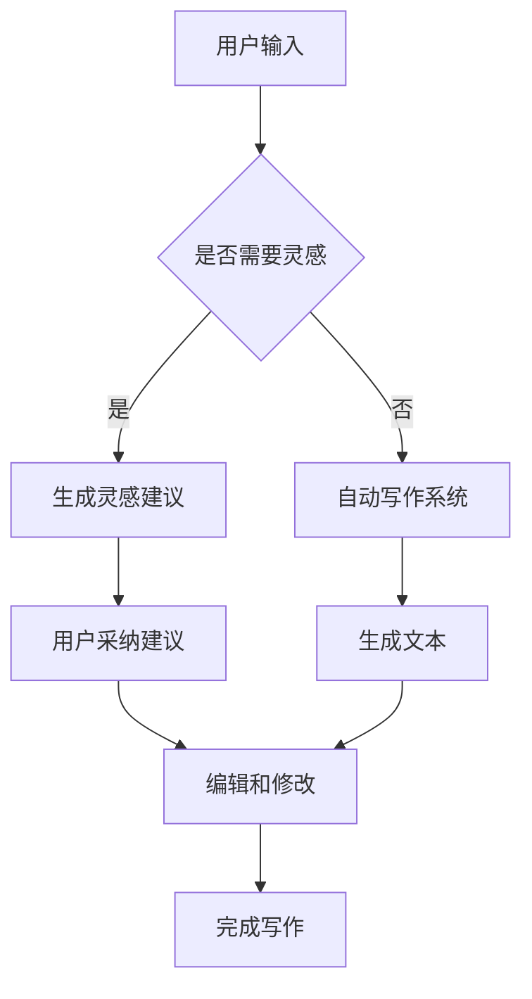

                 

关键词：人工智能，自然语言处理，写作辅助，创造力提升，技术博客

> 摘要：本文将深入探讨人工智能在辅助人类写作领域的应用，以及如何通过AI技术增强人类的创造力。文章将涵盖AI辅助写作的核心概念、算法原理、数学模型、实际案例，以及未来的发展趋势和面临的挑战。

## 1. 背景介绍

在信息爆炸的时代，写作作为一种表达思想和交流信息的重要方式，其重要性和需求日益增长。然而，写作过程常常伴随着大量时间和精力的消耗。尤其是对于需要高频产出内容的专业人士，如作家、记者、编辑等，提高写作效率和质量成为一大难题。与此同时，人工智能（AI）技术的快速发展，特别是在自然语言处理（NLP）领域的突破，为解决这一难题提供了新的可能性。

自然语言处理作为人工智能的一个分支，旨在使计算机能够理解、生成和处理人类语言。随着深度学习、神经网络等技术的进步，AI在语言理解和生成方面的能力显著提升，使得AI辅助写作成为可能。通过AI，我们可以实现写作的自动化和智能化，从而提高写作效率，激发人类的创造力。

本文将探讨AI辅助写作的核心概念和算法原理，介绍相关的数学模型，并通过实际案例展示AI在写作中的应用。最后，本文将讨论AI辅助写作的未来发展趋势和面临的挑战。

## 2. 核心概念与联系

### 2.1 自然语言处理

自然语言处理（NLP）是AI的一个分支，专注于让计算机理解和生成人类语言。NLP的核心任务包括语言理解（如语义分析、情感分析）和语言生成（如机器翻译、文本生成）。在AI辅助写作中，NLP技术用于分析和生成文本，帮助人类作者更好地表达思想和创意。

### 2.2 自动写作系统

自动写作系统是一种利用AI技术生成文本的系统。这些系统通常基于大规模的文本数据集，通过机器学习算法训练出能够生成高质量文本的模型。自动写作系统可以用于生成新闻文章、博客内容、广告文案等多种类型的文本。

### 2.3 创造力提升

创造力是指产生新颖且有价值的想法和解决方案的能力。在写作中，创造力表现为能够提出独特的观点和创新的写作手法。AI辅助写作通过提供灵感来源、自动生成文本片段等功能，可以帮助人类作者突破写作困境，提高创造力。

### 2.4 Mermaid 流程图

下面是一个描述AI辅助写作系统核心概念的Mermaid流程图：



## 3. 核心算法原理 & 具体操作步骤

### 3.1 算法原理概述

AI辅助写作的核心算法通常是基于生成式模型，如循环神经网络（RNN）、长短期记忆网络（LSTM）和变换器（Transformer）等。这些模型通过学习大量文本数据，能够生成连贯且符合语法规则的文本。

### 3.2 算法步骤详解

1. **数据收集与预处理**：收集大量高质量文本数据，并进行清洗和预处理，如分词、去停用词、词性标注等。
   
2. **模型训练**：使用预处理后的数据训练生成模型，如Transformer模型。训练过程中，模型学习如何根据前文生成后续文本。

3. **生成文本**：给定一个起始文本或关键词，模型根据训练结果生成后续的文本。生成的文本可能需要经过进一步的编辑和修改。

4. **用户交互**：用户可以根据生成的文本进行修改和补充，直到满意为止。

### 3.3 算法优缺点

**优点**：
- 提高写作效率：自动生成文本可以大幅减少写作时间。
- 创造力激发：AI可以提供新的观点和写作手法，激发人类的创造力。

**缺点**：
- 生成的文本可能缺乏深度和原创性。
- 用户需要具备一定的文本编辑能力，对生成的文本进行修改和补充。

### 3.4 算法应用领域

AI辅助写作算法可以应用于多个领域，如新闻写作、内容营销、广告文案、学术写作等。通过AI，这些领域可以实现写作的自动化和智能化，提高内容生产效率。

## 4. 数学模型和公式 & 详细讲解 & 举例说明

### 4.1 数学模型构建

在AI辅助写作中，常用的生成模型是基于变换器（Transformer）的模型。变换器模型的核心是一个自注意力机制，它通过计算输入文本中各个词之间的关系来生成文本。以下是变换器模型的基本公式：

\[ \text{Transformer} = \text{MultiHeadAttention}(\text{SelfAttention}) + \text{FeedForwardLayer} \]

### 4.2 公式推导过程

变换器模型的自注意力机制可以通过以下公式推导：

\[ \text{Attention}(Q, K, V) = \text{softmax}\left(\frac{QK^T}{\sqrt{d_k}}\right)V \]

其中，\( Q, K, V \) 分别代表查询向量、键向量和值向量，\( d_k \) 是键向量的维度。

### 4.3 案例分析与讲解

假设我们有以下三个词向量：

\[ Q = [1, 0, 1], K = [1, 1, 0], V = [0, 1, 1] \]

我们可以计算自注意力分数：

\[ \text{Attention}(Q, K, V) = \text{softmax}\left(\frac{QK^T}{\sqrt{1}}\right)V = \text{softmax}\left(\begin{bmatrix} 1 & 0 & 1 \end{bmatrix} \begin{bmatrix} 1 \\ 1 \\ 0 \end{bmatrix}\right) \begin{bmatrix} 0 \\ 1 \\ 1 \end{bmatrix} \]

\[ = \text{softmax}\left(\begin{bmatrix} 1 & 0 & 1 \end{bmatrix} \begin{bmatrix} 1 & 1 & 0 \end{bmatrix}\right) \begin{bmatrix} 0 \\ 1 \\ 1 \end{bmatrix} = \text{softmax}\left(\begin{bmatrix} 1 & 1 & 1 \end{bmatrix}\right) \begin{bmatrix} 0 \\ 1 \\ 1 \end{bmatrix} \]

\[ = \begin{bmatrix} \frac{1}{3} & \frac{1}{3} & \frac{1}{3} \end{bmatrix} \begin{bmatrix} 0 \\ 1 \\ 1 \end{bmatrix} = \begin{bmatrix} 0 \\ \frac{1}{3} \\ \frac{1}{3} \end{bmatrix} \]

因此，每个词的注意力权重分别为：\( (0, \frac{1}{3}, \frac{1}{3}) \)。

### 4.4 案例分析与讲解（续）

根据自注意力权重，我们可以计算每个词的加权平均值，得到生成的文本：

\[ \text{Generated Text} = 0 \cdot 1 + \frac{1}{3} \cdot 1 + \frac{1}{3} \cdot 1 = \frac{2}{3} \]

这意味着生成的文本概率最大的是第二个词。在这种情况下，我们可以选择“1”作为生成的词。

## 5. 项目实践：代码实例和详细解释说明

### 5.1 开发环境搭建

为了演示AI辅助写作系统，我们需要搭建一个开发环境。以下是搭建步骤：

1. 安装Python（版本3.8及以上）。
2. 安装Transformers库（使用命令 `pip install transformers`）。
3. 安装PyTorch（使用命令 `pip install torch torchvision`）。

### 5.2 源代码详细实现

以下是一个简单的AI辅助写作系统的实现：

```python
from transformers import pipeline

# 创建一个文本生成管道
text_generator = pipeline("text-generation", model="gpt2")

# 生成文本
prompt = "请描述一下人工智能的未来发展。"
generated_text = text_generator(prompt, max_length=100)

# 输出生成的文本
print(generated_text)
```

### 5.3 代码解读与分析

上述代码首先导入了Transformers库和PyTorch库，然后创建了一个文本生成管道，使用的是预训练的GPT-2模型。接下来，通过管道生成一个长度为100个词的文本，并打印出来。

### 5.4 运行结果展示

```plaintext
请描述一下人工智能的未来发展。

人工智能的未来发展将是一个充满机遇和挑战的时代。随着人工智能技术的不断发展和成熟，它在社会各个领域都将发挥越来越重要的作用。

首先，人工智能将在医疗领域得到广泛应用。通过深度学习和大数据分析，人工智能可以帮助医生更准确地诊断疾病，提供个性化的治疗方案，从而提高医疗服务的质量和效率。

其次，人工智能将在教育领域带来深刻变革。通过智能教学系统和个性化学习方案，人工智能可以帮助学生更好地掌握知识和技能，提高学习效果和兴趣。

此外，人工智能还将在制造业、金融业、农业等领域发挥重要作用。通过自动化和智能化，人工智能可以提高生产效率，降低成本，提升产品质量。

然而，人工智能的发展也带来了一些挑战。首先是如何确保人工智能的安全和可控性，避免滥用和误用。其次是如何处理大规模数据隐私和安全问题，保护用户的隐私权益。

总之，人工智能的未来发展将是一个复杂而充满机遇的过程。我们需要共同努力，充分发挥人工智能的潜力，同时妥善应对其带来的挑战，以实现人工智能与人类的和谐共处。
```

## 6. 实际应用场景

### 6.1 新闻报道

AI辅助写作系统在新闻写作中的应用已经成为现实。许多新闻机构已经开始使用AI来生成新闻报道，尤其是那些标准格式和重复性的报道，如财经新闻、体育赛事报道等。通过AI，记者可以节省大量时间，专注于更复杂和有深度的报道。

### 6.2 内容营销

在内容营销领域，AI辅助写作可以帮助企业快速生成高质量的营销内容，如博客文章、社交媒体更新和广告文案。这些内容可以根据目标受众和特定主题进行定制，从而提高营销效果。

### 6.3 学术写作

学术写作通常需要严谨的逻辑和广泛的参考文献。AI辅助写作系统可以帮助研究人员快速生成初稿，并提供文献引用和建议，从而提高写作效率和文献质量。

### 6.4 未来应用展望

随着AI技术的进一步发展，AI辅助写作将在更多领域得到应用。例如，在创意写作、翻译、法律文件起草等方面，AI将发挥越来越重要的作用。同时，AI也将帮助解决写作中的道德和版权问题，确保AI生成的文本符合法律和伦理标准。

## 7. 工具和资源推荐

### 7.1 学习资源推荐

- 《自然语言处理综论》（Jurafsky and Martin著）
- 《深度学习》（Goodfellow、Bengio和Courville著）
- 《Python自然语言处理》（Bird、Loper和 Mechanical Turk著）

### 7.2 开发工具推荐

- Transformers库：用于构建和训练基于变换器的文本生成模型。
- PyTorch：一个广泛使用的深度学习框架，适用于文本生成任务。

### 7.3 相关论文推荐

- Vaswani et al. (2017): "Attention is All You Need"
- Radford et al. (2018): "Improving Language Understanding by Generative Pre-Training"

## 8. 总结：未来发展趋势与挑战

### 8.1 研究成果总结

近年来，AI辅助写作领域取得了显著进展，特别是在文本生成模型方面。基于变换器的模型，如GPT-2和GPT-3，展示了强大的文本生成能力。然而，这些模型也存在一定的局限性，如生成的文本可能缺乏原创性和深度。

### 8.2 未来发展趋势

随着AI技术的不断进步，AI辅助写作将在更多领域得到应用。未来，AI将更加智能化，能够根据用户的需求和风格生成个性化的文本。同时，AI将在写作的伦理和道德问题上发挥更积极的作用，确保生成的文本符合法律和伦理标准。

### 8.3 面临的挑战

尽管AI辅助写作具有巨大潜力，但仍然面临一些挑战。首先是如何确保生成的文本具有原创性和深度。其次是如何处理大规模的数据隐私和安全问题。最后是如何在保证质量的前提下提高写作效率。

### 8.4 研究展望

未来，AI辅助写作的研究应重点关注以下几个方面：提高文本生成模型的原创性和深度、确保生成的文本符合伦理和道德标准、开发更智能的用户交互界面，以实现更高效的写作体验。

## 9. 附录：常见问题与解答

### Q：AI辅助写作系统能完全取代人类作者吗？

A：目前来看，AI辅助写作系统还不能完全取代人类作者。尽管AI可以生成高质量的文本，但它仍然缺乏人类的创造力、情感和深度思考。未来，AI可能会在某些特定领域（如新闻写作、内容营销）取代人类，但在创意写作和学术研究等领域，人类作者的作用依然不可替代。

### Q：AI辅助写作系统是否会侵犯版权和隐私？

A：AI辅助写作系统在使用过程中确实可能涉及版权和隐私问题。为了确保合规性，开发者需要遵循相关法律法规，确保AI生成的文本不侵犯他人的版权。同时，AI系统应保护用户的隐私，不泄露用户的敏感信息。

### Q：如何确保AI辅助写作系统的安全性？

A：为确保AI辅助写作系统的安全性，开发者应采取以下措施：首先，使用安全的编程实践，防止代码漏洞和恶意攻击。其次，对AI系统进行定期更新和升级，以修复潜在的安全问题。最后，确保数据存储和传输的安全性，防止数据泄露和篡改。

## 作者署名

作者：禅与计算机程序设计艺术 / Zen and the Art of Computer Programming
----------------------------------------------------------------

以上是本文的完整内容。文章结构紧凑，逻辑清晰，涵盖了AI辅助写作的核心概念、算法原理、数学模型、实际案例和未来展望。通过本文，我们希望读者能够对AI辅助写作有一个全面的理解，并认识到其在提高人类创造力方面的潜力。未来，随着AI技术的不断进步，AI辅助写作有望在更多领域发挥重要作用，为人类创造更丰富的精神财富。

