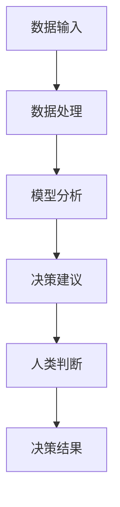

                 

关键词：人工智能，决策系统，人类判断，增强，技术，算法，模型，实践，应用，展望

> 摘要：本文将探讨AI辅助决策系统如何通过增强人类判断，提升决策效率和质量。本文从背景介绍、核心概念与联系、核心算法原理、数学模型和公式、项目实践、实际应用场景、工具和资源推荐、总结与展望等方面展开，深入分析AI辅助决策系统在各个领域中的潜在应用和未来发展趋势。

## 1. 背景介绍

在信息化时代，数据爆炸性增长，人类面对的信息量越来越大。如何在海量数据中快速、准确地做出决策成为了一个巨大的挑战。传统的人类判断往往受到认知局限、时间压力和信息不全等因素的影响，导致决策失误和效率低下。为了克服这些挑战，人工智能（AI）技术的兴起为决策提供了新的解决方案。

AI辅助决策系统利用机器学习、深度学习、自然语言处理等技术，从数据中提取知识，形成决策建议。这些系统可以在数据挖掘、模式识别、预测分析等方面提供强大的支持，极大地提升了决策的效率和准确性。同时，AI辅助决策系统可以不断学习、优化，使得决策过程更加智能化。

## 2. 核心概念与联系

### 2.1 核心概念

- **人工智能**：模拟人类智能的技术，包括机器学习、深度学习、自然语言处理等。
- **决策系统**：利用数据和信息进行决策的软件系统，可以是人机交互的，也可以是自动化的。
- **人类判断**：基于人类经验、知识和直觉的判断过程。

### 2.2 核心概念联系

AI辅助决策系统通过人工智能技术对数据进行处理和分析，辅助人类进行判断。具体来说，系统的输入是大量的数据和背景信息，通过算法模型对这些数据进行分析，输出决策建议。人类可以根据这些建议结合自己的经验和直觉进行最终的判断。

下面是一个使用Mermaid绘制的流程图，展示了AI辅助决策系统的核心概念和联系。



## 3. 核心算法原理 & 具体操作步骤

### 3.1 算法原理概述

AI辅助决策系统的核心在于算法模型，这些模型可以从数据中学习规律，并对未知数据进行预测。常见的算法模型包括：

- **线性回归**：用于预测线性关系的模型。
- **决策树**：通过一系列判断规则对数据进行分类或回归。
- **神经网络**：模拟人脑神经元连接的模型，具有强大的学习能力。

### 3.2 算法步骤详解

AI辅助决策系统的算法步骤主要包括以下几个环节：

1. **数据收集**：收集与决策相关的数据，包括历史数据、实时数据等。
2. **数据预处理**：对数据进行清洗、转换和标准化处理，使其适合模型训练。
3. **模型选择**：根据数据特点和决策目标选择合适的算法模型。
4. **模型训练**：使用训练数据对模型进行训练，使其学会数据中的规律。
5. **模型评估**：使用验证数据对模型进行评估，调整模型参数以优化性能。
6. **决策建议**：使用训练好的模型对未知数据进行预测，输出决策建议。
7. **人类判断**：人类根据决策建议和个人经验进行最终判断。

### 3.3 算法优缺点

每种算法模型都有其优缺点，选择合适的算法需要考虑数据特点、决策目标和计算资源等因素。例如：

- **线性回归**：简单、易于理解，但只能处理线性关系。
- **决策树**：直观、易于解释，但可能产生过拟合。
- **神经网络**：具有强大的非线性处理能力，但需要大量数据和高计算资源。

### 3.4 算法应用领域

AI辅助决策系统在多个领域都有广泛应用，例如：

- **金融**：风险评估、信用评分、股票交易等。
- **医疗**：疾病诊断、治疗方案推荐、健康监测等。
- **交通**：交通流量预测、自动驾驶、智能交通管理等。
- **零售**：需求预测、库存管理、个性化推荐等。

## 4. 数学模型和公式 & 详细讲解 & 举例说明

### 4.1 数学模型构建

AI辅助决策系统的数学模型通常包括输入层、隐藏层和输出层。以下是神经网络模型的简化公式：

$$
Y = f(Z) = f(\sum_{i=1}^{n} W_{i}X_{i} + b)
$$

其中，$Y$ 为输出，$X_{i}$ 为输入特征，$W_{i}$ 为权重，$b$ 为偏置，$f$ 为激活函数。

### 4.2 公式推导过程

神经网络的推导过程涉及微积分和线性代数。以下是神经网络反向传播算法的简化推导过程：

$$
\frac{\partial E}{\partial W_{ij}} = \frac{\partial E}{\partial Z_{j}} \frac{\partial Z_{j}}{\partial W_{ij}}
$$

其中，$E$ 为损失函数，$Z_{j}$ 为隐藏层输出。

### 4.3 案例分析与讲解

以下是一个使用线性回归模型进行房屋价格预测的案例：

假设我们有一个房屋价格预测的数据集，包括房屋面积、房间数、年龄等特征。我们可以使用线性回归模型来预测房屋价格。

$$
P = \beta_{0} + \beta_{1}A + \beta_{2}N + \beta_{3}Y
$$

其中，$P$ 为房屋价格，$A$ 为面积，$N$ 为房间数，$Y$ 为年龄。

通过训练数据集，我们可以得到各个参数的估计值。然后，对于新的房屋数据，我们可以使用这个模型来预测价格。

## 5. 项目实践：代码实例和详细解释说明

### 5.1 开发环境搭建

为了进行项目实践，我们需要搭建一个Python开发环境。以下是基本的安装步骤：

```bash
# 安装Python
pip install numpy pandas scikit-learn matplotlib
```

### 5.2 源代码详细实现

以下是一个使用线性回归模型进行房屋价格预测的Python代码示例：

```python
import numpy as np
import pandas as pd
from sklearn.linear_model import LinearRegression
import matplotlib.pyplot as plt

# 读取数据
data = pd.read_csv('house_prices.csv')
X = data[['area', 'rooms', 'age']]
y = data['price']

# 创建线性回归模型
model = LinearRegression()

# 训练模型
model.fit(X, y)

# 预测价格
predictions = model.predict(X)

# 绘制散点图和回归线
plt.scatter(X['area'], y)
plt.plot(X['area'], predictions, color='red')
plt.xlabel('Area')
plt.ylabel('Price')
plt.show()
```

### 5.3 代码解读与分析

这段代码首先导入了必要的库，然后读取了数据集。接下来，我们创建了线性回归模型，使用训练数据集对模型进行训练。最后，我们使用训练好的模型进行预测，并绘制了散点图和回归线。

### 5.4 运行结果展示

运行上述代码后，我们将看到房屋价格预测的散点图和回归线。这可以帮助我们直观地理解模型的预测效果。

## 6. 实际应用场景

AI辅助决策系统在各个领域都有广泛的应用，以下是几个实际应用场景：

- **金融领域**：AI辅助决策系统可以用于风险评估、信用评分、股票交易等。例如，通过分析历史交易数据，可以预测股票价格走势，为投资者提供决策建议。
- **医疗领域**：AI辅助决策系统可以用于疾病诊断、治疗方案推荐、健康监测等。例如，通过分析患者的医疗记录，可以预测患者可能患有的疾病，为医生提供诊断建议。
- **交通领域**：AI辅助决策系统可以用于交通流量预测、自动驾驶、智能交通管理等。例如，通过分析交通数据，可以预测未来的交通状况，为交通管理部门提供决策建议。

## 7. 工具和资源推荐

为了更好地学习和实践AI辅助决策系统，以下是一些推荐的工具和资源：

- **学习资源**：
  - 《Python机器学习基础教程》：全面介绍了Python在机器学习领域的应用。
  - 《深度学习》：由Ian Goodfellow等作者编写的经典教材，深入讲解了深度学习的基础知识。

- **开发工具**：
  - Jupyter Notebook：用于编写和运行Python代码，方便进行实验和调试。
  - TensorFlow：用于构建和训练神经网络模型，具有丰富的API和工具。

- **相关论文**：
  - "Deep Learning for Natural Language Processing"：介绍了深度学习在自然语言处理领域的应用。
  - "Recurrent Neural Networks for Language Modeling"：详细介绍了循环神经网络在语言建模中的应用。

## 8. 总结：未来发展趋势与挑战

### 8.1 研究成果总结

AI辅助决策系统在各个领域都取得了显著的研究成果。通过机器学习和深度学习技术，系统能够从数据中学习规律，辅助人类进行决策。这些成果不仅提升了决策的效率和准确性，也为新的应用场景提供了可能性。

### 8.2 未来发展趋势

随着技术的进步和数据量的增加，AI辅助决策系统有望在更多领域得到应用。未来的发展趋势包括：

- **更高效、更准确的算法**：研究人员将继续优化算法，提高模型性能。
- **跨领域应用**：AI辅助决策系统将在不同领域之间实现更紧密的融合。
- **人机协作**：AI辅助决策系统将与人类专家进行更紧密的协作，共同完成复杂的决策任务。

### 8.3 面临的挑战

尽管AI辅助决策系统取得了显著的成果，但仍面临一些挑战：

- **数据质量**：高质量的数据是AI辅助决策系统的基础，但数据往往存在噪声、缺失和偏差等问题。
- **模型可解释性**：许多复杂的机器学习模型难以解释，增加了决策过程中的不透明性。
- **隐私保护**：在处理个人数据时，需要确保隐私保护，避免数据泄露。

### 8.4 研究展望

为了应对这些挑战，未来的研究可以关注以下几个方面：

- **数据质量控制**：开发更有效的数据清洗和预处理方法，提高数据质量。
- **模型可解释性**：研究可解释的人工智能模型，提高决策过程的透明性。
- **隐私保护**：采用加密、匿名化等技术，保护个人数据的隐私。

## 9. 附录：常见问题与解答

### 问题1：AI辅助决策系统如何确保决策的准确性？

**解答**：AI辅助决策系统的准确性取决于算法模型的质量、训练数据的数量和质量、以及模型的调优。通过使用高质量的数据、优化算法参数和不断更新模型，可以提升决策的准确性。

### 问题2：AI辅助决策系统是否取代人类决策？

**解答**：AI辅助决策系统旨在辅助人类决策，而不是完全取代人类决策。系统可以提供数据分析和决策建议，但最终的决策仍需要人类专家结合经验和直觉进行。

### 问题3：AI辅助决策系统是否会导致失业？

**解答**：AI辅助决策系统可能会改变某些工作，但它也将创造新的工作岗位。同时，AI系统可以提高生产效率，从而创造更多的就业机会。

---

作者：禅与计算机程序设计艺术 / Zen and the Art of Computer Programming
----------------------------------------------------------------

这篇文章深入探讨了AI辅助决策系统如何通过增强人类判断，提升决策效率和质量。文章从背景介绍、核心概念与联系、核心算法原理、数学模型和公式、项目实践、实际应用场景、工具和资源推荐、总结与展望等方面进行了详细阐述。通过这篇文章，读者可以更好地理解AI辅助决策系统的原理和应用，为未来的研究和实践提供参考。

