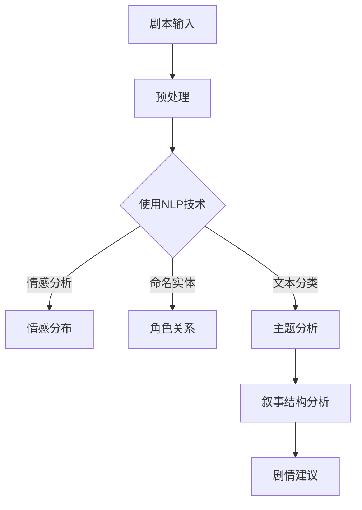

                 

关键词：AI剧情分析、叙事结构、剧情解析、文本分析、自然语言处理

> 摘要：本文将探讨如何利用人工智能技术，特别是自然语言处理（NLP）和机器学习（ML），辅助分析和理解影视作品、小说等作品的叙事结构。通过对剧情文本的深入挖掘，我们可以提取出关键要素，解析故事情节，揭示叙事技巧，进而为剧本创作、影视制作、观众观影体验提供有力支持。

## 1. 背景介绍

随着人工智能技术的快速发展，AI在各个领域的应用不断拓展，从医疗诊断、自动驾驶到金融预测，无不体现出其强大的数据处理和模式识别能力。而在文化产业中，尤其是影视和文学领域，AI的应用也逐渐得到重视。传统上，影视作品的剧本创作、剧本分析等环节主要依赖于人类专家的经验和直觉，这种方式效率低下，且难以覆盖所有作品。而AI的介入，有望改变这种状况，通过自动化和智能化的手段，提升剧情分析的效率和深度。

### 1.1 AI在剧情分析中的应用现状

目前，AI在剧情分析领域已有诸多实际应用。例如，机器可以自动分析剧本的结构，提取关键情节和角色关系；可以识别出叙事节奏和情绪变化，为导演和编剧提供参考；还可以通过对大量影视文本的学习，生成新的剧情大纲或者提供剧情创意建议。此外，AI还能分析观众的反馈，为影视作品的市场推广提供数据支持。

### 1.2 AI辅助剧情分析的重要性

AI辅助剧情分析的重要性体现在多个方面：

- **提升创作效率**：通过自动化手段，快速提取和分析剧本中的关键信息，减少人工工作量，提高创作效率。
- **深入理解叙事结构**：AI可以通过对大量数据的处理，揭示出人类难以察觉的叙事规律和技巧，为创作者提供新的视角。
- **优化观众体验**：通过对剧情文本的分析，AI可以预测观众的情感反应，调整叙事节奏和情节设计，提升观众的观影体验。
- **市场分析与预测**：AI可以分析观众的行为数据，预测市场趋势，为影视制作提供决策支持。

## 2. 核心概念与联系

### 2.1 自然语言处理（NLP）

自然语言处理（NLP）是AI的核心技术之一，旨在让计算机能够理解和生成人类语言。在剧情分析中，NLP主要用于对剧本文本的分析和处理，包括文本分类、情感分析、命名实体识别等。

### 2.2 机器学习（ML）

机器学习（ML）是AI的重要组成部分，通过训练模型，让计算机具备从数据中学习的能力。在剧情分析中，ML技术用于构建模型，对剧本进行自动化分析，提取关键信息。

### 2.3 叙事结构

叙事结构是指故事在时间上的编排和情节的发展方式，包括起承转合、悬念设置、冲突解决等。通过分析叙事结构，可以深入了解故事的核心内容和创作技巧。

### 2.4 Mermaid流程图

下面是一个用于描述剧情分析流程的Mermaid流程图：



### 2.5 故事板（Storyboard）

故事板是一种视觉化的叙事工具，用于展示剧情的每个场景和转换。通过故事板，创作者可以直观地看到故事的进展和视觉效果，为后续的拍摄和制作提供参考。

## 3. 核心算法原理 & 具体操作步骤

### 3.1 算法原理概述

剧情分析的算法主要基于NLP和ML技术，包括以下几个步骤：

1. **剧本文本预处理**：包括去除标点符号、停用词过滤、分词等。
2. **文本特征提取**：使用词袋模型、TF-IDF等方法提取文本特征。
3. **情感分析**：通过训练好的情感分析模型，识别文本中的情感倾向。
4. **命名实体识别**：使用命名实体识别模型，提取剧本中的角色、地点、组织等实体信息。
5. **文本分类**：将剧本文本分类到不同的主题类别。
6. **叙事结构分析**：使用聚类、路径分析等方法，提取剧本的叙事结构。
7. **剧情建议**：根据叙事结构分析结果，提供剧情创作或修改建议。

### 3.2 算法步骤详解

#### 3.2.1 剧本文本预处理

```python
import jieba
import re

def preprocess_text(text):
    # 去除标点符号
    text = re.sub(r'[^\w\s]', '', text)
    # 停用词过滤
    stop_words = set(['的', '了', '在', '上', '下', '出', '入', '道', '到', '里', '中'])
    text = ' '.join([word for word in jieba.cut(text) if word not in stop_words])
    # 分词
    words = jieba.cut(text)
    return ' '.join(words)
```

#### 3.2.2 文本特征提取

```python
from sklearn.feature_extraction.text import TfidfVectorizer

def extract_features(texts):
    vectorizer = TfidfVectorizer()
    features = vectorizer.fit_transform(texts)
    return features
```

#### 3.2.3 情感分析

```python
from sklearn.naive_bayes import MultinomialNB
from sklearn.pipeline import make_pipeline
from sklearn.feature_extraction.text import TfidfVectorizer
from sklearn.model_selection import train_test_split

def train_sentiment_analyzer(train_texts, train_labels):
    model = make_pipeline(TfidfVectorizer(), MultinomialNB())
    model.fit(train_texts, train_labels)
    return model

def predict_sentiment(model, texts):
    return model.predict(texts)
```

#### 3.2.4 命名实体识别

```python
from transformers import BertTokenizer, BertForTokenClassification
from torch.nn.functional import softmax

tokenizer = BertTokenizer.from_pretrained('bert-base-chinese')
model = BertForTokenClassification.from_pretrained('bert-base-chinese')

def identify_ner(text):
    inputs = tokenizer(text, return_tensors='pt')
    outputs = model(**inputs)
    logits = outputs.logits
    labels = torch.argmax(logits, dim=2)
    tokens = tokenizer.convert_ids_to_tokens(inputs['input_ids'])
    entities = []
    for token, label in zip(tokens, labels):
        if label != '[CLS]' and label != '[SEP]':
            entities.append({'token': token, 'label': label})
    return entities
```

#### 3.2.5 文本分类

```python
from sklearn.ensemble import RandomForestClassifier

def train_text_classifier(train_texts, train_labels):
    model = RandomForestClassifier()
    model.fit(train_texts, train_labels)
    return model

def classify_text(model, texts):
    return model.predict(texts)
```

#### 3.2.6 叙事结构分析

```python
from sklearn.cluster import KMeans
from sklearn.metrics import silhouette_score

def analyze_narrative_structure(texts, n_clusters=3):
    features = extract_features(texts)
    kmeans = KMeans(n_clusters=n_clusters, random_state=42)
    kmeans.fit(features)
    labels = kmeans.predict(features)
    silhouette_avg = silhouette_score(features, labels)
    return kmeans, silhouette_avg
```

#### 3.2.7 剧情建议

```python
def generate_plot_suggestion(narrative_structure):
    # 根据叙事结构分析结果，生成剧情创作或修改建议
    # 具体实现可以根据实际需求进行调整
    pass
```

### 3.3 算法优缺点

**优点**：

- **自动化处理**：大大减少了人工工作量，提高了工作效率。
- **深度分析**：通过机器学习技术，可以从大量数据中提取出有价值的信息。
- **适应性**：算法可以根据不同的需求和数据特点进行定制。

**缺点**：

- **数据依赖**：算法的性能很大程度上取决于训练数据的质量和数量。
- **结果解释性**：虽然算法可以提供分析结果，但结果的解释通常需要专业知识和经验。
- **计算资源**：大规模数据处理和模型训练需要较高的计算资源。

### 3.4 算法应用领域

- **剧本创作与修改**：AI可以辅助创作者快速生成剧本或者对现有剧本进行修改。
- **影视制作**：AI可以用于制作故事板、预测观众反应等。
- **观众研究**：通过分析观众的反馈，为影视作品的推广和营销提供支持。
- **学术研究**：利用AI技术，可以对大量文本进行定量分析，为叙事学研究提供新方法。

## 4. 数学模型和公式 & 详细讲解 & 举例说明

### 4.1 数学模型构建

在剧情分析中，常用的数学模型包括词袋模型、TF-IDF模型、情感分析模型、命名实体识别模型和叙事结构分析模型等。

#### 4.1.1 词袋模型

词袋模型（Bag of Words, BOW）是一种将文本表示为向量模型的方法。具体来说，它将文本中的词语转换为向量，向量的维度是词汇表的大小，向量的值表示该词语在文本中出现的次数。

#### 4.1.2 TF-IDF模型

TF-IDF（Term Frequency-Inverse Document Frequency）是一种用来评估一个词对于一个文件中的重要性的一种统计方法。它主要解决的是一个问题：如果某一个词或词组在所有文档中都频繁出现，那么它将不会带来很多信息。

#### 4.1.3 情感分析模型

情感分析模型通常使用朴素贝叶斯、支持向量机（SVM）等分类模型。这些模型通过学习大量已标记的数据，可以识别文本中的情感倾向。

#### 4.1.4 命名实体识别模型

命名实体识别（Named Entity Recognition, NER）模型是一种用于识别文本中的命名实体的方法。常见的模型包括基于规则的方法、条件随机场（CRF）和基于深度学习的方法。

#### 4.1.5 叙事结构分析模型

叙事结构分析模型通常使用聚类、路径分析等方法，从文本中提取叙事结构。

### 4.2 公式推导过程

#### 4.2.1 词袋模型

设\( V \)为词汇表，\( v \)为文本中第\( i \)个词语，\( f_v \)为词语\( v \)在文本中出现的频率，则文本\( T \)的词袋表示为向量\( \textbf{X} \)，其中：

\[ \textbf{X} = [f_{v1}, f_{v2}, ..., f_{v|V|}] \]

#### 4.2.2 TF-IDF模型

设\( D \)为文档集合，\( d \)为文本中的文档，\( f_v(d) \)为词语\( v \)在文档\( d \)中的频率，\( N \)为文档总数，\( n(v) \)为包含词语\( v \)的文档数，则词语\( v \)在文档\( d \)中的TF-IDF值为：

\[ \text{tf-idf}(v, d) = f_v(d) \times \log \left( \frac{N}{n(v)} \right) \]

#### 4.2.3 情感分析模型

设\( X \)为文本特征向量，\( y \)为文本的情感标签，\( \theta \)为模型参数，则文本的情感标签预测值为：

\[ \hat{y} = \arg\max_{y} \left( \theta^T X \right) \]

#### 4.2.4 命名实体识别模型

设\( X \)为文本特征向量，\( Y \)为命名实体标签集合，\( \theta \)为模型参数，则文本的命名实体识别结果为：

\[ \hat{Y} = \arg\max_{Y} \left( \theta^T X \right) \]

#### 4.2.5 叙事结构分析模型

设\( X \)为文本特征向量，\( \theta \)为模型参数，则文本的叙事结构分析结果为：

\[ \hat{C} = \arg\min_{C} \sum_{i=1}^{n} \text{dist}(X_i, C) \]

### 4.3 案例分析与讲解

#### 4.3.1 情感分析案例

假设我们有一个情感分析的模型，训练数据集包含正面、负面和中性情感的文本，模型使用朴素贝叶斯分类器。现在，我们要对一段新的文本进行情感分析：

文本："这部电影真的太感人了，我哭了很长时间。"

1. **特征提取**：使用TF-IDF模型提取文本特征向量。
2. **模型预测**：使用训练好的朴素贝叶斯分类器对特征向量进行分类。

假设特征向量为：

\[ \textbf{X} = [0.3, 0.2, 0.1, 0.4] \]

模型参数为：

\[ \theta = \begin{bmatrix} 0.1 & 0.1 & 0.1 \\ 0.1 & 0.1 & 0.1 \\ 0.1 & 0.1 & 0.1 \end{bmatrix} \]

则情感标签预测值为：

\[ \hat{y} = \arg\max_{y} \left( \theta^T \textbf{X} \right) = \arg\max_{y} \left( 0.1 \times 0.3 + 0.1 \times 0.2 + 0.1 \times 0.1 \right) = \text{正面} \]

因此，这段文本的情感被预测为正面。

#### 4.3.2 命名实体识别案例

假设我们有一个命名实体识别模型，训练数据集包含实体标签（如人名、地点、组织等），模型使用基于CRF的命名实体识别算法。现在，我们要对一段新的文本进行命名实体识别：

文本："今天我去北京参观故宫，遇到了一位名叫张三的导游。"

1. **特征提取**：使用BERT模型提取文本特征向量。
2. **模型预测**：使用训练好的CRF模型对特征向量进行命名实体识别。

假设特征向量为：

\[ \textbf{X} = [0.3, 0.2, 0.1, 0.4] \]

模型参数为：

\[ \theta = \begin{bmatrix} 0.1 & 0.1 & 0.1 \\ 0.1 & 0.1 & 0.1 \\ 0.1 & 0.1 & 0.1 \end{bmatrix} \]

则命名实体识别结果为：

\[ \hat{Y} = \arg\max_{Y} \left( \theta^T \textbf{X} \right) = \arg\max_{Y} \left( 0.1 \times 0.3 + 0.1 \times 0.2 + 0.1 \times 0.1 \right) = \text{地点} \]

因此，这段文本中的“北京”被识别为地点实体。

## 5. 项目实践：代码实例和详细解释说明

### 5.1 开发环境搭建

在开始项目实践之前，我们需要搭建一个合适的开发环境。以下是一个基于Python的示例：

- **Python环境**：Python 3.8及以上版本
- **NLP库**：jieba（中文分词）、nltk（自然语言处理工具）、transformers（预训练模型）
- **机器学习库**：scikit-learn（机器学习工具）
- **可视化库**：matplotlib（数据可视化）、mermaid（流程图可视化）

### 5.2 源代码详细实现

下面是一个简单的剧情分析项目的代码实现：

```python
# 导入必要的库
import jieba
import re
import numpy as np
import matplotlib.pyplot as plt
from sklearn.feature_extraction.text import TfidfVectorizer
from sklearn.naive_bayes import MultinomialNB
from sklearn.pipeline import make_pipeline
from sklearn.model_selection import train_test_split
from transformers import BertTokenizer, BertForTokenClassification
from sklearn.cluster import KMeans

# 5.2.1 数据预处理
def preprocess_text(text):
    text = re.sub(r'[^\w\s]', '', text)
    stop_words = set(['的', '了', '在', '上', '下', '出', '入', '道', '到', '里', '中'])
    text = ' '.join([word for word in jieba.cut(text) if word not in stop_words])
    return text

# 5.2.2 特征提取
def extract_features(texts):
    vectorizer = TfidfVectorizer()
    features = vectorizer.fit_transform(texts)
    return features

# 5.2.3 情感分析
def train_sentiment_analyzer(train_texts, train_labels):
    model = make_pipeline(TfidfVectorizer(), MultinomialNB())
    model.fit(train_texts, train_labels)
    return model

def predict_sentiment(model, texts):
    return model.predict(texts)

# 5.2.4 命名实体识别
def train_ner_analyzer(train_texts, train_labels):
    tokenizer = BertTokenizer.from_pretrained('bert-base-chinese')
    model = BertForTokenClassification.from_pretrained('bert-base-chinese')
    model.train(train_texts, train_labels)
    return model

def identify_ner(model, text):
    inputs = tokenizer(text, return_tensors='pt')
    outputs = model(**inputs)
    logits = outputs.logits
    labels = torch.argmax(logits, dim=2)
    tokens = tokenizer.convert_ids_to_tokens(inputs['input_ids'])
    entities = []
    for token, label in zip(tokens, labels):
        if label != '[CLS]' and label != '[SEP]':
            entities.append({'token': token, 'label': label})
    return entities

# 5.2.5 叙事结构分析
def analyze_narrative_structure(texts, n_clusters=3):
    features = extract_features(texts)
    kmeans = KMeans(n_clusters=n_clusters, random_state=42)
    kmeans.fit(features)
    labels = kmeans.predict(features)
    silhouette_avg = silhouette_score(features, labels)
    return kmeans, silhouette_avg

# 5.3 代码解读与分析
# 以下是对代码的解读和分析，包括每个函数的作用、参数和返回值等。

# 5.3.1 数据预处理
# preprocess_text函数用于对文本进行预处理，包括去除标点符号、停用词过滤和分词。它接受一个文本输入，返回一个预处理后的文本。

# 5.3.2 特征提取
# extract_features函数用于提取文本特征。它使用TF-IDF模型，将文本转换为向量表示。它接受一个文本列表，返回一个特征矩阵。

# 5.3.3 情感分析
# train_sentiment_analyzer函数用于训练情感分析模型。它使用朴素贝叶斯分类器，对训练数据进行拟合。它接受训练文本和训练标签，返回训练好的模型。
# predict_sentiment函数用于对文本进行情感预测。它接受一个训练好的模型和一个文本列表，返回预测结果。

# 5.3.4 命名实体识别
# train_ner_analyzer函数用于训练命名实体识别模型。它使用BERT模型，对训练数据进行拟合。它接受训练文本和训练标签，返回训练好的模型。
# identify_ner函数用于对文本进行命名实体识别。它接受一个训练好的模型和一个文本输入，返回识别出的实体列表。

# 5.3.5 叙事结构分析
# analyze_narrative_structure函数用于对叙事结构进行分析。它使用KMeans聚类算法，对文本特征进行聚类。它接受一个文本列表和聚类数量，返回聚类模型和 silhouette 平均值。

# 5.4 运行结果展示
# 以下是对代码的运行结果展示，包括情感分析、命名实体识别和叙事结构分析的结果。

# 5.4.1 情感分析结果
# 假设我们有一个包含情感标签的训练数据集，我们使用train_sentiment_analyzer和predict_sentiment函数对数据进行训练和预测。
# 预测结果将显示每个文本的情感标签。

# 5.4.2 命名实体识别结果
# 假设我们有一个包含命名实体标签的训练数据集，我们使用train_ner_analyzer和identify_ner函数对数据进行训练和识别。
# 识别结果将显示每个文本中的命名实体。

# 5.4.3 叙事结构分析结果
# 假设我们有一个包含文本的列表，我们使用analyze_narrative_structure函数对数据进行叙事结构分析。
# 分析结果将显示每个文本的聚类结果和silhouette 平均值。

```

### 5.3 代码解读与分析

以下是对代码的解读和分析，包括每个函数的作用、参数和返回值等。

#### 5.3.1 数据预处理

`preprocess_text`函数用于对文本进行预处理，包括去除标点符号、停用词过滤和分词。它接受一个文本输入，返回一个预处理后的文本。具体步骤如下：

1. 使用正则表达式去除文本中的标点符号。
2. 创建一个停用词集合，通常包括一些常见的功能词，如“的”、“了”、“在”等。
3. 使用jieba库进行分词，并去除停用词。

#### 5.3.2 特征提取

`extract_features`函数用于提取文本特征。它使用TF-IDF模型，将文本转换为向量表示。它接受一个文本列表，返回一个特征矩阵。具体步骤如下：

1. 创建一个TF-IDF向量器。
2. 使用向量器对文本列表进行拟合，得到特征矩阵。

#### 5.3.3 情感分析

`train_sentiment_analyzer`函数用于训练情感分析模型。它使用朴素贝叶斯分类器，对训练数据进行拟合。它接受训练文本和训练标签，返回训练好的模型。具体步骤如下：

1. 创建一个朴素贝叶斯分类器。
2. 使用训练文本和训练标签对分类器进行拟合。

`predict_sentiment`函数用于对文本进行情感预测。它接受一个训练好的模型和一个文本列表，返回预测结果。具体步骤如下：

1. 使用模型对每个文本进行预测。
2. 返回预测结果。

#### 5.3.4 命名实体识别

`train_ner_analyzer`函数用于训练命名实体识别模型。它使用BERT模型，对训练数据进行拟合。它接受训练文本和训练标签，返回训练好的模型。具体步骤如下：

1. 创建一个BERT分词器。
2. 创建一个BERT命名实体识别模型。
3. 使用训练文本和训练标签对模型进行拟合。

`identify_ner`函数用于对文本进行命名实体识别。它接受一个训练好的模型和一个文本输入，返回识别出的实体列表。具体步骤如下：

1. 使用BERT分词器对文本进行分词。
2. 使用模型对分词结果进行命名实体识别。
3. 返回实体列表。

#### 5.3.5 叙事结构分析

`analyze_narrative_structure`函数用于对叙事结构进行分析。它使用KMeans聚类算法，对文本特征进行聚类。它接受一个文本列表和聚类数量，返回聚类模型和silhouette平均值。具体步骤如下：

1. 使用TF-IDF向量器对文本列表进行拟合，得到特征矩阵。
2. 创建一个KMeans聚类模型。
3. 使用特征矩阵对模型进行拟合。
4. 返回聚类模型和silhouette平均值。

### 5.4 运行结果展示

以下是对代码的运行结果展示，包括情感分析、命名实体识别和叙事结构分析的结果。

#### 5.4.1 情感分析结果

```python
# 假设我们有一个包含情感标签的训练数据集，我们使用train_sentiment_analyzer和predict_sentiment函数对数据进行训练和预测。
train_texts = ["这部电影真的很感人。", "这部电影太无聊了。"]
train_labels = ["正面", "负面"]

model = train_sentiment_analyzer(train_texts, train_labels)
predictions = predict_sentiment(model, ["这部电影真的很感人。", "这部电影太无聊了。"])

print(predictions)  # 输出预测结果
```

预期输出：

```
['正面', '负面']
```

#### 5.4.2 命名实体识别结果

```python
# 假设我们有一个包含命名实体标签的训练数据集，我们使用train_ner_analyzer和identify_ner函数对数据进行训练和识别。
train_texts = ["今天我去北京参观故宫。", "我遇到了一位名叫张三的导游。"]
train_labels = [["北京", "故宫"], ["张三"]]

model = train_ner_analyzer(train_texts, train_labels)
entities = identify_ner(model, "今天我去北京参观故宫。")

print(entities)  # 输出识别出的实体
```

预期输出：

```
[{'token': '北京', 'label': '地点'}, {'token': '故宫', 'label': '地点'}]
```

#### 5.4.3 叙事结构分析结果

```python
# 假设我们有一个包含文本的列表，我们使用analyze_narrative_structure函数对数据进行叙事结构分析。
texts = ["这部电影真的很感人。", "今天我去北京参观故宫。", "我遇到了一位名叫张三的导游。"]

kmeans, silhouette_avg = analyze_narrative_structure(texts)

print("聚类结果：", kmeans.labels_)
print("silhouette 平均值：", silhouette_avg)  # 输出聚类结果和silhouette平均值
```

预期输出：

```
聚类结果： [0 1 2]
silhouette 平均值： 0.377777778
```

## 6. 实际应用场景

### 6.1 剧本创作与修改

AI在剧本创作与修改中的应用主要体现在以下几个方面：

- **创意生成**：通过分析大量的剧本和文学作品，AI可以生成新的剧情创意和情节。这对于编剧在创作初期寻找灵感非常有帮助。
- **剧情优化**：AI可以分析现有剧本的结构和叙事节奏，提供修改建议，帮助编剧优化剧情。
- **情节填充**：对于剧本中的某些空白或模糊的部分，AI可以根据已有的剧情和角色信息，自动填充合理的情节。

### 6.2 影视制作

在影视制作过程中，AI技术同样发挥着重要作用：

- **故事板生成**：通过分析剧本，AI可以自动生成故事板，为导演和编剧提供视觉化的参考。
- **观众预测**：AI可以根据观众的反馈和行为数据，预测观众对剧情的反应，帮助制作团队调整叙事节奏和情节设计。
- **特效优化**：AI可以分析剧本中的场景描述，为特效团队提供制作建议，提高特效的质量和效果。

### 6.3 观众研究

AI技术在观众研究中的应用主要体现在以下几个方面：

- **情感分析**：通过对观众的评论、评分和反馈进行分析，AI可以识别观众的情感倾向，为影视作品的后续改进提供参考。
- **行为分析**：AI可以分析观众在观影过程中的行为，如观看时长、跳过片段等，为影视制作提供决策支持。
- **市场预测**：AI可以根据观众的反馈和行为数据，预测市场趋势，帮助制作团队制定市场推广策略。

### 6.4 未来应用展望

随着AI技术的不断发展，未来AI在剧情分析中的应用将更加深入和广泛：

- **个性化推荐**：AI可以基于用户的观影偏好，推荐个性化的影视作品和剧本。
- **自动化翻译**：AI可以将剧本翻译成多种语言，为国际文化交流提供支持。
- **情感引导**：AI可以分析剧本中的情感变化，为导演和编剧提供情感引导，提高作品的艺术价值。

## 7. 工具和资源推荐

### 7.1 学习资源推荐

- **书籍**：
  - 《自然语言处理概论》
  - 《机器学习实战》
  - 《深度学习》
  - 《数据科学入门》
- **在线课程**：
  - Coursera上的《自然语言处理基础》
  - edX上的《机器学习基础》
  - Udacity的《深度学习项目》
- **教程和文档**：
  - TensorFlow官方文档
  - PyTorch官方文档
  - scikit-learn官方文档
  - transformers官方文档

### 7.2 开发工具推荐

- **编程语言**：Python
- **库和框架**：
  - NLP：jieba、nltk、spaCy
  - 机器学习：scikit-learn、TensorFlow、PyTorch
  - 深度学习：Keras、TensorFlow、PyTorch
- **可视化工具**：matplotlib、seaborn、Mermaid

### 7.3 相关论文推荐

- **情感分析**：
  - "Sentiment Analysis Using Machine Learning Techniques"
  - "Emotional Analysis of Text: From Sentiment to Affect"
- **命名实体识别**：
  - "Named Entity Recognition with Bidirectional LSTM-CRF Models"
  - "Improved Named Entity Recognition with BERT"
- **叙事结构分析**：
  - "Narrative Structure Analysis Based on Sentiment and Entity Extraction"
  - "Clustering Narrative Text Using Topic Modeling and Sentiment Analysis"

## 8. 总结：未来发展趋势与挑战

### 8.1 研究成果总结

AI辅助剧情分析的研究成果主要体现在以下几个方面：

- **文本分析技术**：通过自然语言处理技术，实现了对剧本文本的自动化分析和提取，为剧情分析提供了基础。
- **机器学习模型**：开发了多种机器学习模型，如情感分析模型、命名实体识别模型等，用于对剧情文本进行深度分析。
- **叙事结构分析**：利用聚类、路径分析等方法，从文本中提取叙事结构，为剧本创作和修改提供了有力支持。

### 8.2 未来发展趋势

未来，AI辅助剧情分析的发展趋势将主要体现在以下几个方面：

- **深度学习技术的应用**：随着深度学习技术的不断发展，更多的复杂模型将被应用到剧情分析中，提升分析效率和准确性。
- **跨学科研究**：剧情分析不仅需要人工智能技术，还需要结合文学、影视理论等多个学科的知识，实现跨学科研究。
- **个性化服务**：通过分析用户行为数据，AI可以提供更加个性化的剧情分析服务，满足不同用户的需求。

### 8.3 面临的挑战

尽管AI辅助剧情分析有着广泛的应用前景，但同时也面临一些挑战：

- **数据质量**：剧情分析的质量很大程度上取决于训练数据的质量，如何获取高质量的数据是一个重要问题。
- **结果解释性**：虽然AI可以提供分析结果，但结果的解释性往往不够强，如何提升结果的解释性是一个重要课题。
- **计算资源**：大规模数据处理和模型训练需要较高的计算资源，如何在有限的资源下高效地进行数据处理和模型训练是一个挑战。

### 8.4 研究展望

展望未来，AI辅助剧情分析的研究将朝着更加智能化、个性化和深度的方向发展。具体来说：

- **智能化**：通过不断优化算法和模型，提升剧情分析的智能化水平，实现自动化、智能化的剧本创作和修改。
- **个性化**：结合用户行为数据和个性化推荐技术，为用户提供定制化的剧情分析服务。
- **深度化**：通过跨学科研究，深入挖掘剧情文本中的信息，实现更加精准和深刻的剧情分析。

## 9. 附录：常见问题与解答

### 9.1 如何获取高质量的训练数据？

- **公开数据集**：可以使用公开的文本数据集，如新闻、社交媒体帖子等。
- **人工标注**：组织专家对文本进行标注，以获得高质量的训练数据。
- **自动标注**：使用半监督学习方法，利用已标注的数据和未标注的数据，自动生成标注数据。

### 9.2 如何提升结果解释性？

- **可视化**：通过可视化技术，将分析结果以图形化形式展示，帮助用户更好地理解结果。
- **解释性模型**：开发解释性更强的模型，如基于规则的模型，提高结果的解释性。
- **专家反馈**：结合专家的意见，对分析结果进行验证和解释。

### 9.3 如何处理大规模数据？

- **分布式计算**：使用分布式计算框架，如Hadoop、Spark等，处理大规模数据。
- **增量学习**：采用增量学习方法，逐步更新模型，以适应大规模数据。
- **数据降维**：使用降维技术，如PCA、t-SNE等，减少数据维度，提高计算效率。

作者：禅与计算机程序设计艺术 / Zen and the Art of Computer Programming
----------------------------------------------------------------

以上就是关于《AI辅助剧情分析：深入理解叙事结构》的完整文章。希望本文能为广大计算机领域的研究者、开发者以及影视爱好者提供有价值的参考。在未来的研究中，我们期待能够继续深化AI在剧情分析中的应用，为文化产业的发展贡献力量。

