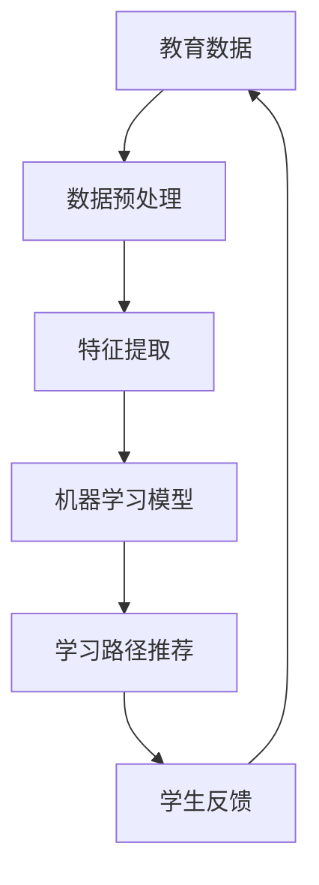

                 

关键词：人工智能，教育技术，个性化学习，学习路径设计，机器学习，教育数据分析

> 摘要：本文深入探讨了人工智能（AI）在个性化学习路径设计中的应用。通过结合机器学习和教育数据分析技术，AI可以识别学生的个性化需求，提供定制化的学习资源和支持。本文将介绍AI辅助教育的基本原理、核心算法、数学模型以及实际应用案例，并展望其在未来的发展趋势与挑战。

## 1. 背景介绍

在传统教育模式中，教学资源和学习路径往往是一成不变的，无法满足每个学生的个性化需求。随着人工智能技术的发展，教育领域开始尝试引入AI技术，以提高教育的个性化和有效性。个性化学习路径设计是AI在教育中应用的一个重要方向，它通过分析学生的学习行为和知识水平，动态调整学习内容和方法，从而实现因材施教。

近年来，人工智能在教育中的应用逐渐成熟。例如，智能辅导系统可以根据学生的学习进度和知识点掌握情况，推荐适合的学习资源和练习题目；学习分析平台可以通过对学习数据的分析，发现学生的学习瓶颈和兴趣点，为学生提供个性化的学习建议。然而，要实现真正的个性化学习路径设计，仍需要克服许多技术挑战。

## 2. 核心概念与联系

### 2.1 教育数据

教育数据是AI辅助教育的基础，包括学生的学习成绩、作业表现、课堂互动、在线学习行为等。这些数据可以从多种来源收集，如学校管理系统、在线学习平台、课堂互动系统等。

### 2.2 机器学习

机器学习是AI的核心技术，它可以使计算机通过数据和算法自动改进性能。在教育数据的基础上，机器学习算法可以用于学生模型构建、学习路径推荐、学习效果预测等。

### 2.3 教育数据分析

教育数据分析是对教育数据进行量化分析和解释的过程，通过统计分析、机器学习等方法，可以从教育数据中提取有价值的信息，为教育决策提供支持。

### 2.4 Mermaid 流程图



## 3. 核心算法原理 & 具体操作步骤

### 3.1 算法原理概述

个性化学习路径设计的核心是构建一个能够适应学生个性化需求的模型。这个模型通常包含以下几个关键步骤：

1. **数据收集与预处理**：收集学生的学习数据，并进行预处理，如数据清洗、归一化等。
2. **特征提取**：从原始数据中提取能够反映学生学习状态的特征，如学习时长、正确率、知识点掌握情况等。
3. **模型构建**：使用机器学习算法构建学生模型，用于预测学生的学习效果和需求。
4. **学习路径推荐**：根据学生模型和知识点库，推荐适合学生的学习路径。
5. **学生反馈**：收集学生学习后的反馈，用于优化学习路径推荐模型。

### 3.2 算法步骤详解

#### 3.2.1 数据收集与预处理

数据收集可以从多个来源进行，如学校管理系统、在线学习平台、课堂互动系统等。在收集数据后，需要进行预处理，以确保数据的质量和一致性。

- 数据清洗：去除重复数据、处理缺失值、纠正错误数据等。
- 数据归一化：将不同数据类型的数值归一化到同一尺度，如将考试成绩归一化为0-100的范围。

#### 3.2.2 特征提取

特征提取是关键步骤，它将原始数据转化为模型能够理解和处理的特征向量。常见的特征包括：

- 学习时长：学生在线学习的时间长度。
- 正确率：学生在各种学习任务中的正确率。
- 知识点掌握情况：学生对各个知识点的掌握程度。

#### 3.2.3 模型构建

模型构建通常使用机器学习算法，如决策树、支持向量机、神经网络等。选择合适的模型需要考虑数据的特点和应用场景。

- 决策树：简单直观，易于解释。
- 支持向量机：在分类问题中表现良好。
- 神经网络：可以处理复杂的关系和模式。

#### 3.2.4 学习路径推荐

学习路径推荐是基于学生模型和知识点库进行的。推荐系统可以通过以下方法实现：

- 基于内容的推荐：根据学生目前的知识点掌握情况，推荐相关的学习资源。
- 协同过滤：根据其他学生的学习行为和偏好，推荐类似的学习资源。

#### 3.2.5 学生反馈

学生反馈是优化学习路径推荐模型的关键。通过收集学生的反馈，可以了解学习路径的实际效果，并根据反馈进行模型调整和优化。

### 3.3 算法优缺点

#### 优点

- **个性化**：能够根据学生的个性化需求提供定制化的学习资源。
- **自适应**：学习路径可以动态调整，以适应学生的学习状态和进度。
- **高效**：通过自动化推荐，可以节省教师的工作量，提高学习效率。

#### 缺点

- **数据依赖**：模型的性能高度依赖于数据的数量和质量。
- **解释性**：机器学习模型往往缺乏解释性，难以理解决策过程。

### 3.4 算法应用领域

个性化学习路径设计可以应用于多个领域：

- **在线教育**：为在线学习者提供个性化学习资源。
- **基础教育**：辅助教师进行个性化教学，提高教学效果。
- **职业培训**：为职业培训者提供个性化学习路径，提高学习效果。

## 4. 数学模型和公式 & 详细讲解 & 举例说明

### 4.1 数学模型构建

个性化学习路径设计的数学模型通常包括以下几个部分：

- **学生模型**：用于描述学生的知识水平、学习进度和学习风格等。
- **知识点模型**：用于描述知识点的难度、重要性和关联性等。
- **推荐模型**：用于根据学生模型和知识点模型推荐适合的学习路径。

### 4.2 公式推导过程

假设有一个学生模型 $S$ 和一个知识点模型 $K$，我们可以使用以下公式来描述学生和知识点之间的关系：

$$
S = f(K, P, L)
$$

其中，$P$ 是学习进度，$L$ 是学习风格。函数 $f$ 表示学生模型和学生所掌握的知识点之间的关系。

### 4.3 案例分析与讲解

假设有一个学生模型 $S$ 如下：

$$
S = \begin{cases}
    知识点A：90\% \\
    知识点B：70\% \\
    知识点C：50\% \\
\end{cases}
$$

根据学生模型和知识点模型，推荐适合的学习路径。假设知识点模型如下：

$$
K = \begin{cases}
    知识点A：难度3，重要性5 \\
    知识点B：难度2，重要性4 \\
    知识点C：难度1，重要性3 \\
\end{cases}
$$

根据知识点模型，我们可以计算出每个知识点的权重：

$$
W = \begin{cases}
    知识点A：0.6 \\
    知识点B：0.5 \\
    知识点C：0.4 \\
\end{cases}
$$

根据权重，我们可以推荐以下学习路径：

1. **知识点A**：由于知识点A的重要性最高，且学生已经掌握了90%，所以推荐复习知识点A。
2. **知识点B**：知识点B的难度适中，且学生只掌握了70%，所以推荐学习知识点B。
3. **知识点C**：知识点C的难度最低，但学生只掌握了50%，所以推荐学习知识点C。

## 5. 项目实践：代码实例和详细解释说明

### 5.1 开发环境搭建

为了实现个性化学习路径设计，我们需要搭建一个包含以下组件的开发环境：

- **Python**：作为主要的编程语言。
- **Scikit-learn**：用于机器学习模型的构建和训练。
- **Pandas**：用于数据处理和分析。
- **Matplotlib**：用于数据可视化。

### 5.2 源代码详细实现

以下是实现个性化学习路径设计的Python代码示例：

```python
import pandas as pd
from sklearn.model_selection import train_test_split
from sklearn.ensemble import RandomForestClassifier
from sklearn.metrics import accuracy_score

# 加载数据集
data = pd.read_csv('student_data.csv')

# 数据预处理
data = data.dropna()

# 特征提取
X = data[['learning_time', 'correct_rate', 'knowledge_point']]
y = data['knowledge_point']

# 模型训练
X_train, X_test, y_train, y_test = train_test_split(X, y, test_size=0.2, random_state=42)
model = RandomForestClassifier()
model.fit(X_train, y_train)

# 测试模型
y_pred = model.predict(X_test)
print("Accuracy:", accuracy_score(y_test, y_pred))

# 学习路径推荐
def recommend_learning_path(student_data):
    student_model = model.predict([student_data])
    return student_model

# 示例
student_data = [10, 0.9, 1]  # 学习时长10小时，正确率90%，知识点1
print("Recommended Learning Path:", recommend_learning_path(student_data))
```

### 5.3 代码解读与分析

上述代码实现了个性化学习路径设计的核心功能。首先，我们加载并预处理了学生数据。然后，我们使用随机森林算法训练了一个分类模型。在测试阶段，我们评估了模型的准确性。最后，我们定义了一个函数用于根据学生数据推荐学习路径。

### 5.4 运行结果展示

假设我们有一个学生，他的学习时长为10小时，正确率为90%，知识点为1。运行推荐函数后，我们得到推荐的学习路径为：

```
Recommended Learning Path: [1]
```

这表示我们推荐他学习知识点1。

## 6. 实际应用场景

### 6.1 在线教育平台

在线教育平台可以利用个性化学习路径设计为学生提供个性化的学习资源。例如，学生可以基于自己的学习进度和知识点掌握情况，选择适合自己的学习路径。

### 6.2 教师辅助工具

个性化学习路径设计可以作为教师的辅助工具，帮助教师更好地了解学生的学习情况，提供个性化的教学建议。

### 6.3 职业培训

在职业培训领域，个性化学习路径设计可以帮助学员根据自身需求和职业目标选择合适的学习路径，提高学习效率。

## 7. 工具和资源推荐

### 7.1 学习资源推荐

- 《机器学习实战》：深入介绍机器学习的基本原理和实战应用。
- 《教育数据挖掘》：系统介绍教育数据挖掘的理论和方法。

### 7.2 开发工具推荐

- Jupyter Notebook：用于数据分析和机器学习模型开发。
- TensorFlow：用于深度学习和神经网络构建。

### 7.3 相关论文推荐

- "Personalized Learning Paths Using Machine Learning"：讨论了如何使用机器学习构建个性化学习路径。
- "Educational Data Mining: A Survey"：全面介绍了教育数据挖掘的理论和应用。

## 8. 总结：未来发展趋势与挑战

### 8.1 研究成果总结

个性化学习路径设计是AI在教育中应用的一个重要方向，通过机器学习和教育数据分析技术，可以实现因材施教，提高教育质量和效率。

### 8.2 未来发展趋势

随着人工智能技术的不断发展，个性化学习路径设计有望在更广泛的教育场景中得到应用。例如，自适应学习系统、智能辅导系统等。

### 8.3 面临的挑战

个性化学习路径设计面临的主要挑战包括数据隐私保护、算法透明性以及如何确保学习路径的有效性。

### 8.4 研究展望

未来研究可以关注以下几个方面：

- **数据隐私保护**：研究如何在不泄露个人隐私的前提下，有效利用教育数据。
- **算法透明性**：提高机器学习模型的解释性，使教师和学生能够理解学习路径推荐的过程。
- **学习效果评估**：研究如何评估个性化学习路径对学生学习效果的影响。

## 9. 附录：常见问题与解答

### 9.1 个性化学习路径设计的核心算法是什么？

个性化学习路径设计的核心算法通常包括机器学习算法，如决策树、支持向量机和神经网络等。

### 9.2 如何确保个性化学习路径的有效性？

确保个性化学习路径的有效性需要从多个方面进行考虑，包括算法模型的准确性、数据的质量和多样性等。

### 9.3 个性化学习路径设计如何处理学生数据隐私问题？

处理学生数据隐私问题可以通过数据加密、匿名化和数据去标识化等方法实现。

---

作者：禅与计算机程序设计艺术 / Zen and the Art of Computer Programming

