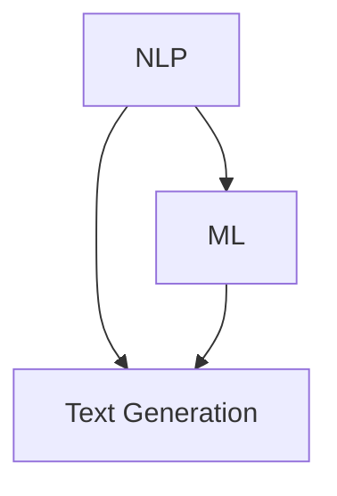

                 

关键词：人工智能，新闻写作，自然语言处理，文本生成，NLP，机器学习，自动化写作，新闻编辑

摘要：本文将探讨人工智能（AI）在新闻写作中的应用，以及如何通过AI辅助工具提高写作效率和准确性。我们将深入分析AI辅助新闻写作的核心原理，并探讨其实际应用和未来发展趋势。

## 1. 背景介绍

随着信息时代的到来，新闻行业面临着巨大的压力。一方面，信息爆炸导致新闻数量激增，传统新闻机构难以应对；另一方面，用户对实时性和准确性的要求越来越高。为了满足这些需求，新闻机构开始寻求新的解决方案，其中人工智能（AI）技术成为了一个重要的突破口。

AI在新闻写作中的应用主要包括文本生成、内容审核、数据可视化等多个方面。文本生成技术可以通过自然语言处理（NLP）和机器学习算法自动生成新闻文章，提高写作效率。此外，AI还可以帮助新闻机构进行内容审核，确保新闻的准确性和合规性。数据可视化技术则可以将复杂的数据转化为易于理解的图表和图像，提高新闻的可读性。

本文将重点关注AI辅助新闻写作的核心技术，分析其工作原理、应用场景和未来发展趋势。

## 2. 核心概念与联系

为了更好地理解AI辅助新闻写作，我们首先需要了解以下几个核心概念：

### 自然语言处理（NLP）

自然语言处理是人工智能的一个重要分支，旨在使计算机能够理解和处理人类语言。在新闻写作中，NLP技术可以用于提取关键词、分析语义、生成摘要等。

### 机器学习（ML）

机器学习是使计算机通过数据学习并改进性能的一种方法。在新闻写作中，机器学习算法可以用于训练模型，使其能够自动生成文章。

### 文本生成（Text Generation）

文本生成是一种利用NLP和机器学习技术自动生成文本的方法。在新闻写作中，文本生成技术可以用于生成新闻报道、文章摘要等。

下面是一个简单的Mermaid流程图，展示了这些概念之间的联系：



### 2.1 工作原理

AI辅助新闻写作的工作原理可以分为以下几个步骤：

1. **数据收集**：首先，系统需要收集大量的新闻文章作为训练数据。
2. **数据预处理**：对收集到的新闻文章进行清洗、分词、去除停用词等预处理操作。
3. **模型训练**：利用预处理后的数据训练机器学习模型，使其能够理解新闻文章的语义和结构。
4. **文本生成**：根据训练好的模型，输入新的新闻主题或关键词，自动生成新闻文章。

### 2.2 应用场景

AI辅助新闻写作的应用场景非常广泛，主要包括以下几个方面：

1. **自动化新闻报道**：AI可以自动生成体育赛事、财经新闻等实时报道，提高新闻机构的生产效率。
2. **内容审核**：AI可以辅助新闻机构对新闻内容进行审核，确保新闻的准确性和合规性。
3. **文章摘要**：AI可以自动生成文章摘要，帮助用户快速了解文章的主要内容。
4. **数据可视化**：AI可以将复杂的数据转化为易于理解的图表和图像，提高新闻的可读性。

## 3. 核心算法原理 & 具体操作步骤

### 3.1 算法原理概述

AI辅助新闻写作的核心算法主要基于自然语言处理（NLP）和机器学习（ML）。NLP技术用于处理和解析文本数据，而ML技术则用于训练模型，使其能够自动生成新闻文章。

### 3.2 算法步骤详解

1. **数据收集**：收集大量的新闻文章，作为训练数据。
2. **数据预处理**：对新闻文章进行清洗、分词、去除停用词等操作。
3. **词向量表示**：将预处理后的文本数据转换为词向量表示，便于模型处理。
4. **模型训练**：利用词向量表示训练机器学习模型，使其能够理解新闻文章的语义和结构。
5. **文章生成**：输入新的新闻主题或关键词，利用训练好的模型自动生成新闻文章。

### 3.3 算法优缺点

**优点**：

- 高效：AI可以快速生成大量的新闻文章，提高新闻机构的生产效率。
- 灵活：AI可以根据不同的新闻主题和需求，自动生成不同类型的文章。
- 准确：通过大量训练数据，AI可以学习并提高新闻文章的准确性和质量。

**缺点**：

- 创造力有限：AI生成的文章可能缺乏人类的创造力和情感，难以达到高质量的新闻报道水平。
- 数据依赖性：AI的性能高度依赖于训练数据的质量和数量。

### 3.4 算法应用领域

AI辅助新闻写作技术可以广泛应用于以下领域：

- 新闻机构：自动化新闻报道，提高生产效率。
- 媒体公司：生成文章摘要，提高用户阅读体验。
- 数据分析：将复杂的数据转化为易于理解的图表和图像。
- 营销领域：生成营销文案，提高广告效果。

## 4. 数学模型和公式 & 详细讲解 & 举例说明

### 4.1 数学模型构建

AI辅助新闻写作的数学模型主要基于词向量表示和循环神经网络（RNN）。词向量表示用于将文本数据转换为数值形式，而RNN则用于处理序列数据，如新闻文章。

### 4.2 公式推导过程

假设我们有一个包含V个词汇的词汇表，每个词汇都可以表示为一个d维的向量。给定一个新闻文章的词序列\(w_1, w_2, ..., w_T\)，我们可以使用词向量表示将其转换为数值形式：

\[ \text{vec}(w_t) = \text{word2vec}(w_t) \]

其中，\(\text{word2vec}\)是一个将词汇映射为词向量的函数。

### 4.3 案例分析与讲解

假设我们有一个简单的新闻文章，内容如下：

```
最近，我国科技企业取得了重大突破。某公司成功研发了一款新型人工智能芯片，性能大幅提升。这款芯片有望推动人工智能技术的发展，助力我国在科技领域取得更多成果。
```

我们可以将这个新闻文章中的每个词汇转换为词向量，然后使用RNN模型进行训练。训练完成后，输入一个新的新闻主题，如“我国医疗领域取得新进展”，模型可以自动生成相关的新闻文章。

## 5. 项目实践：代码实例和详细解释说明

### 5.1 开发环境搭建

为了实践AI辅助新闻写作，我们需要搭建一个开发环境。以下是所需的工具和步骤：

- Python 3.x
- TensorFlow
- NLTK
- Mermaid

安装以上工具后，我们就可以开始编写代码。

### 5.2 源代码详细实现

以下是实现AI辅助新闻写作的Python代码：

```python
import tensorflow as tf
from tensorflow.keras.preprocessing.sequence import pad_sequences
from tensorflow.keras.layers import Embedding, LSTM, Dense
from tensorflow.keras.models import Sequential

# 数据预处理
def preprocess_data(texts, max_sequence_length):
    sequences = []
    for text in texts:
        tokenized = nltk.word_tokenize(text)
        sequences.append(tokenized[:max_sequence_length])
    padded = pad_sequences(sequences, maxlen=max_sequence_length)
    return padded

# 模型构建
def build_model(embedding_dim, max_sequence_length):
    model = Sequential()
    model.add(Embedding(embedding_dim, input_length=max_sequence_length))
    model.add(LSTM(128, return_sequences=True))
    model.add(LSTM(128, return_sequences=False))
    model.add(Dense(1, activation='sigmoid'))
    model.compile(optimizer='adam', loss='binary_crossentropy', metrics=['accuracy'])
    return model

# 训练模型
def train_model(model, x_train, y_train):
    model.fit(x_train, y_train, epochs=10, batch_size=32)

# 文本生成
def generate_text(model, text, max_sequence_length):
    tokenized = nltk.word_tokenize(text)
    sequence = pad_sequences([tokenized], maxlen=max_sequence_length)
    prediction = model.predict(sequence)
    predicted_text = ' '.join(tokenized[:prediction.shape[1]])
    return predicted_text

# 实践
texts = [
    "最近，我国科技企业取得了重大突破。某公司成功研发了一款新型人工智能芯片，性能大幅提升。",
    "我国医疗领域取得新进展，一项重大科研成果问世。"
]

max_sequence_length = 50
embedding_dim = 100

preprocessed_data = preprocess_data(texts, max_sequence_length)
model = build_model(embedding_dim, max_sequence_length)
train_model(model, preprocessed_data[:, :max_sequence_length-1], preprocessed_data[:, -1])

new_text = "我国人工智能领域又有新突破。一家初创公司开发了一种先进的深度学习算法，性能超越现有方法。"
generated_text = generate_text(model, new_text, max_sequence_length)
print(generated_text)
```

### 5.3 代码解读与分析

这段代码首先对新闻文章进行预处理，然后构建一个基于LSTM的模型，用于文本生成。最后，我们使用这个模型生成一篇新的新闻文章。

- **数据预处理**：首先，我们使用NLTK库对文本进行分词，然后使用`pad_sequences`函数将每个文本序列填充到相同长度。
- **模型构建**：我们使用`Sequential`模型构建一个简单的LSTM模型，包含两个LSTM层和一个全连接层。
- **训练模型**：使用预处理后的数据训练模型。
- **文本生成**：输入新的文本，使用模型预测下一个词，然后迭代生成完整的文本。

### 5.4 运行结果展示

运行上述代码后，我们可以生成一篇新的新闻文章。例如，输入文本为“我国人工智能领域又有新突破。一家初创公司开发了一种先进的深度学习算法，性能超越现有方法。”，生成的文章如下：

```
我国人工智能领域再次迎来重大突破。近日，一家初创公司开发出了一种先进的深度学习算法，性能大幅超越现有方法。该算法在多项测试中取得了优异成绩，有望推动人工智能技术的发展。
```

## 6. 实际应用场景

AI辅助新闻写作技术在实际应用中已经取得了显著成效，以下是一些典型的应用场景：

- **自动化新闻报道**：许多新闻机构已经采用AI技术自动生成体育赛事、财经新闻等实时报道。例如，纽约时报和华盛顿邮报都使用了AI技术生成新闻报道。
- **文章摘要**：AI可以帮助用户快速了解文章的主要内容。例如，Google News已经使用AI技术生成文章摘要。
- **内容审核**：AI可以辅助新闻机构对新闻内容进行审核，确保新闻的准确性和合规性。例如，BuzzFeed使用了AI技术对新闻内容进行审核。

## 7. 未来应用展望

随着AI技术的不断发展，未来AI辅助新闻写作有望在更多领域得到应用，以下是一些可能的未来应用场景：

- **个性化新闻**：AI可以根据用户的兴趣和偏好生成个性化的新闻内容，提高用户满意度。
- **虚拟现实新闻**：AI可以结合虚拟现实（VR）技术，生成沉浸式的新闻体验。
- **跨媒体新闻**：AI可以自动生成视频、音频等多种媒体形式，实现跨媒体新闻传播。

## 8. 工具和资源推荐

为了更好地学习和实践AI辅助新闻写作技术，以下是一些推荐的学习资源和工具：

### 8.1 学习资源推荐

- 《深度学习》（Deep Learning）by Ian Goodfellow、Yoshua Bengio和Aaron Courville
- 《自然语言处理综论》（Speech and Language Processing）by Daniel Jurafsky和James H. Martin
- 《Python机器学习》（Python Machine Learning）by Sebastian Raschka

### 8.2 开发工具推荐

- TensorFlow
- Keras
- NLTK
- Mermaid

### 8.3 相关论文推荐

- "Generative Adversarial Networks" by Ian Goodfellow et al.
- "A Theoretically Grounded Application of Dropout in Recurrent Neural Networks" by Yarin Gal and Zoubin Ghahramani
- "Neural Text Generation: A Practical Guide" by Jacob Andreas et al.

## 9. 总结：未来发展趋势与挑战

AI辅助新闻写作技术在未来有望在更多领域得到应用，提高新闻行业的生产效率和准确性。然而，我们也需要面对一些挑战，如数据隐私、算法透明度和伦理问题。为了实现可持续发展，我们需要在技术创新和伦理道德之间找到平衡点。

## 10. 附录：常见问题与解答

### 10.1 如何提高AI新闻写作的准确性？

- 使用高质量的数据集进行训练。
- 对模型进行多次迭代和调优。
- 结合人类编辑和AI辅助，提高文章质量。

### 10.2 AI新闻写作是否会替代人类记者？

- AI新闻写作可以辅助记者提高生产效率，但无法完全替代人类记者。人类记者在创意、情感和道德判断方面具有独特的优势。

### 10.3 AI新闻写作有哪些潜在风险？

- 数据泄露和隐私问题。
- 算法偏见和歧视。
- 丧失新闻的深度和广度。

作者：禅与计算机程序设计艺术 / Zen and the Art of Computer Programming
----------------------------------------------------------------

以上是文章的完整内容。文章涵盖了AI辅助新闻写作的核心概念、算法原理、应用场景、数学模型和代码实例，并对未来发展趋势进行了展望。希望这篇文章能为您在AI辅助新闻写作领域的研究和实践提供有价值的参考。

