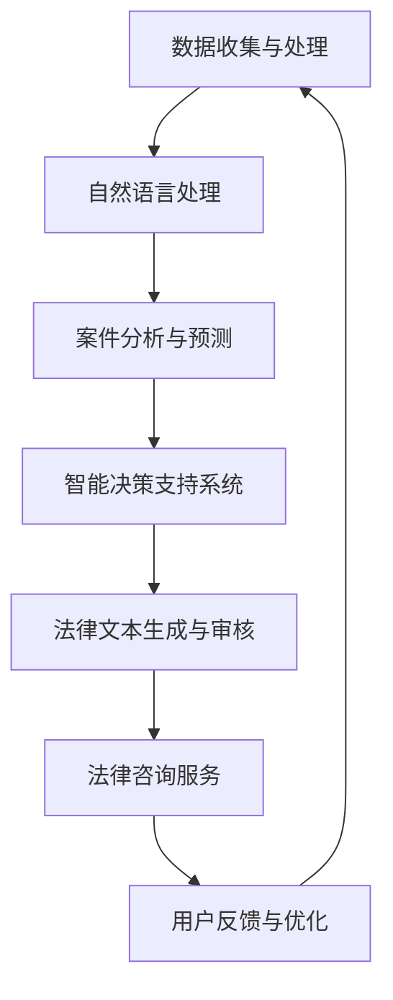

                 

关键词：人工智能、法律服务、效率、公平、AI技术

摘要：随着人工智能技术的迅猛发展，AI在法律领域的应用日益广泛。本文旨在探讨AI辅助法律服务的优势，包括提高工作效率和促进公平性，并分析其面临的挑战和未来发展趋势。

## 1. 背景介绍

在现代社会，法律服务的需求日益增长，但传统的法律服务模式存在效率低、成本高、资源分配不均等问题。随着人工智能（AI）技术的快速发展，利用AI辅助法律服务的概念逐渐兴起，并展现出巨大的潜力。AI在法律领域的应用主要包括案件预测、合同审核、法律咨询等，这些应用有望提升法律服务的效率和质量。

### 1.1 人工智能与法律服务的结合

人工智能与法律服务的结合主要体现在以下几个方面：

1. **数据挖掘与分析**：通过分析大量的法律案例和数据，AI能够发现法律案件中的模式和趋势，为法官和律师提供参考。
2. **自然语言处理**：AI能够理解和处理自然语言，从而实现自动化的法律文本生成、合同审核和法律咨询。
3. **智能预测与决策**：基于历史数据和算法模型，AI可以预测案件的结果和最佳解决方案，提高决策的准确性。

### 1.2 AI辅助法律服务的优势

AI辅助法律服务具有以下优势：

1. **提高效率**：AI能够快速处理大量的法律文件和数据，大大缩短了法律工作的时间。
2. **降低成本**：通过自动化流程，AI能够减少人力成本，使法律服务更加经济实惠。
3. **促进公平**：AI能够客观、公正地处理法律案件，减少人为因素导致的偏见和不公平。

## 2. 核心概念与联系

为了更好地理解AI辅助法律服务的核心概念和架构，我们将使用Mermaid流程图展示其关键组成部分和流程。



### 2.1 数据收集与处理

数据收集与处理是AI辅助法律服务的基础。通过从各种来源收集法律案例、合同文本等数据，AI系统可以进行数据清洗、归一化和特征提取，为后续的分析和预测提供可靠的数据支持。

### 2.2 自然语言处理

自然语言处理（NLP）是AI辅助法律服务的关键技术。NLP能够理解和处理法律文本，实现文本的自动生成、审核和解读。常见的NLP技术包括词向量、句法分析和语义分析等。

### 2.3 案件分析与预测

基于历史数据和算法模型，AI可以对法律案件进行分析和预测。这包括案件结果的预测、法律条款的匹配、合同风险的评估等。

### 2.4 智能决策支持系统

智能决策支持系统（IDSS）是AI辅助法律服务的核心。IDSS利用AI技术，为律师和法官提供智能化的决策支持，包括案件解决方案的推荐、法律条款的解释等。

### 2.5 法律文本生成与审核

AI能够自动生成法律文本，如合同、诉状等，并对其进行审核，确保文本的准确性和合规性。这大大提高了法律文件处理的速度和准确性。

### 2.6 法律咨询服务

通过AI技术，用户可以在线获得法律咨询服务，包括法律问题解答、法律条款解释等。这为普通民众提供了更加便捷和低成本的司法服务。

### 2.7 用户反馈与优化

用户反馈是AI辅助法律服务不断改进的重要环节。通过收集用户的使用数据和反馈，AI系统可以不断优化其性能和功能，提高用户体验。

## 3. 核心算法原理 & 具体操作步骤

### 3.1 算法原理概述

AI辅助法律服务的核心算法主要包括自然语言处理（NLP）、机器学习（ML）和深度学习（DL）等。NLP负责理解和处理法律文本，ML和DL则用于数据分析和预测。

### 3.2 算法步骤详解

#### 3.2.1 数据收集与预处理

1. **数据收集**：从法院、律师事务所、在线法律平台等渠道收集大量的法律案例、合同文本、法律条款等数据。
2. **数据预处理**：对数据进行清洗、归一化和特征提取，为后续的分析和预测提供可靠的数据支持。

#### 3.2.2 自然语言处理

1. **文本预处理**：对法律文本进行分词、去停用词、词性标注等处理，使其适合进行进一步的分析。
2. **句法分析**：利用句法分析方法，对法律文本进行句法结构分析，提取关键信息。
3. **语义分析**：通过语义分析方法，对法律文本进行语义理解，识别文本中的实体、关系和事件。

#### 3.2.3 机器学习与深度学习

1. **模型选择**：根据具体任务需求，选择合适的机器学习或深度学习模型，如分类模型、回归模型、生成对抗网络（GAN）等。
2. **模型训练**：利用预处理后的数据，对模型进行训练，优化模型参数。
3. **模型评估**：通过交叉验证、精度、召回率等指标，评估模型性能。
4. **模型部署**：将训练好的模型部署到实际应用场景中，为用户提供智能化的法律服务。

### 3.3 算法优缺点

#### 优点：

1. **高效性**：AI能够快速处理大量的法律文件和数据，大大提高了工作效率。
2. **准确性**：基于大数据和机器学习技术，AI能够提供准确的法律分析和预测。
3. **可扩展性**：AI系统可以根据实际需求进行扩展和优化，适应不同的法律服务场景。

#### 缺点：

1. **数据依赖性**：AI性能很大程度上依赖于数据质量和数量，数据不足或质量不高会影响算法效果。
2. **模型可解释性**：深度学习模型的内部机制复杂，难以解释其决策过程，可能导致用户对AI系统的信任度降低。
3. **隐私问题**：AI系统在处理大量敏感法律数据时，可能涉及用户隐私保护问题。

### 3.4 算法应用领域

AI辅助法律服务在以下领域具有广泛应用：

1. **案件预测与决策**：利用AI技术，可以对法律案件的结果和最佳解决方案进行预测和推荐。
2. **合同审核与管理**：AI能够自动审核合同文本，识别潜在的风险和问题，提高合同管理的效率。
3. **法律咨询与支持**：通过AI系统，用户可以在线获取法律咨询和解答，节省时间和成本。

## 4. 数学模型和公式 & 详细讲解 & 举例说明

### 4.1 数学模型构建

在AI辅助法律服务中，常见的数学模型包括分类模型、回归模型和生成对抗网络（GAN）等。以下分别介绍这些模型的构建过程。

#### 4.1.1 分类模型

分类模型用于预测法律案件的结果。假设有n个法律案件，每个案件包含m个特征向量，我们要构建一个分类模型，将法律案件分为不同类别。分类模型的数学模型可以表示为：

$$
P(Y=k|X=x) = \frac{e^{\theta_k^T x}}{\sum_{i=1}^{K} e^{\theta_i^T x}}
$$

其中，$Y$ 表示法律案件的实际类别，$X$ 表示法律案件的特征向量，$k$ 表示预测类别，$\theta_k$ 表示模型参数，$e$ 表示自然底数。

#### 4.1.2 回归模型

回归模型用于预测法律案件的相关指标，如案件结果、赔偿金额等。回归模型的数学模型可以表示为：

$$
Y = \theta_0 + \theta_1 x_1 + \theta_2 x_2 + \cdots + \theta_m x_m + \epsilon
$$

其中，$Y$ 表示预测结果，$x_1, x_2, \cdots, x_m$ 表示特征向量，$\theta_0, \theta_1, \theta_2, \cdots, \theta_m$ 表示模型参数，$\epsilon$ 表示误差项。

#### 4.1.3 生成对抗网络（GAN）

生成对抗网络（GAN）用于生成法律文本。GAN由生成器和判别器组成，生成器的目标是生成逼真的法律文本，判别器的目标是区分真实法律文本和生成文本。GAN的数学模型可以表示为：

$$
G(x) \sim p_G(z) \\
D(x) \sim p_D(x)
$$

其中，$G(x)$ 表示生成器，$D(x)$ 表示判别器，$z$ 表示噪声向量，$p_G(z)$ 表示生成器的概率分布，$p_D(x)$ 表示判别器的概率分布。

### 4.2 公式推导过程

以下分别介绍分类模型和回归模型的推导过程。

#### 4.2.1 分类模型推导

分类模型的目标是最小化损失函数：

$$
J(\theta) = -\frac{1}{n} \sum_{i=1}^{n} [y_i \log(P(Y=k|X=x_i)) + (1 - y_i) \log(1 - P(Y=k|X=x_i))]
$$

对损失函数求导，得到：

$$
\frac{\partial J(\theta)}{\partial \theta_k} = \frac{1}{n} \sum_{i=1}^{n} [y_i x_i - (1 - y_i) x_i] \\
\frac{\partial J(\theta)}{\partial \theta_i} = 0, \quad i \neq k
$$

对上式进行优化，得到：

$$
\theta_k = \theta_k - \alpha \frac{\partial J(\theta)}{\partial \theta_k}
$$

其中，$\alpha$ 表示学习率。

#### 4.2.2 回归模型推导

回归模型的目标是最小化损失函数：

$$
J(\theta) = \frac{1}{2n} \sum_{i=1}^{n} [y_i - \theta_0 - \theta_1 x_{1i} - \theta_2 x_{2i} - \cdots - \theta_m x_{mi}]^2
$$

对损失函数求导，得到：

$$
\frac{\partial J(\theta)}{\partial \theta_j} = \frac{1}{n} \sum_{i=1}^{n} [y_i - \theta_0 - \theta_1 x_{1i} - \theta_2 x_{2i} - \cdots - \theta_m x_{mi}] x_{ji}
$$

对上式进行优化，得到：

$$
\theta_j = \theta_j - \alpha \frac{\partial J(\theta)}{\partial \theta_j}
$$

其中，$\alpha$ 表示学习率。

### 4.3 案例分析与讲解

以下通过一个简单的案例，说明如何使用分类模型和回归模型进行法律案件预测。

#### 4.3.1 分类模型案例

假设我们有一个包含100个法律案件的数据集，每个案件包含5个特征向量，分别为被告年龄、原告年龄、案件金额、案件类型和判决结果。我们要使用分类模型预测案件结果。

1. **数据预处理**：对数据进行归一化处理，将每个特征向量的值缩放到[0, 1]区间。
2. **模型训练**：选择一个简单的分类模型，如逻辑回归模型，对数据集进行训练。
3. **模型评估**：通过交叉验证，评估模型性能，调整模型参数。
4. **预测**：利用训练好的模型，对新的法律案件进行预测，输出预测结果。

#### 4.3.2 回归模型案例

假设我们要预测一个法律案件的赔偿金额，数据集包含100个法律案件，每个案件包含5个特征向量，分别为被告年龄、原告年龄、案件金额、案件类型和判决结果。

1. **数据预处理**：对数据进行归一化处理，将每个特征向量的值缩放到[0, 1]区间。
2. **模型训练**：选择一个简单的回归模型，如线性回归模型，对数据集进行训练。
3. **模型评估**：通过交叉验证，评估模型性能，调整模型参数。
4. **预测**：利用训练好的模型，对新的法律案件进行预测，输出预测结果。

通过以上案例，我们可以看到如何使用分类模型和回归模型进行法律案件预测。在实际应用中，我们可以根据具体需求选择合适的模型和算法，实现智能化的法律服务。

## 5. 项目实践：代码实例和详细解释说明

在本节中，我们将通过一个实际的项目实例，详细解释如何搭建一个基于AI的法律咨询服务系统。该系统将使用Python和相关的AI库（如scikit-learn、TensorFlow和PyTorch）来实现。

### 5.1 开发环境搭建

1. **安装Python**：确保安装了Python 3.x版本，推荐使用Anaconda或Miniconda进行环境管理。
2. **安装相关库**：使用pip安装以下库：

   ```bash
   pip install numpy pandas scikit-learn tensorflow torchvision matplotlib
   ```

3. **数据集准备**：收集一个包含法律案件数据的CSV文件，包含案件描述、特征和标签（如判决结果、赔偿金额等）。

### 5.2 源代码详细实现

以下是一个简单的Python代码示例，用于训练一个分类模型，并对新的法律案件进行预测。

```python
import pandas as pd
from sklearn.model_selection import train_test_split
from sklearn.linear_model import LogisticRegression
from sklearn.metrics import accuracy_score

# 5.2.1 数据读取与预处理
data = pd.read_csv('law_cases.csv')
X = data.drop('label', axis=1)
y = data['label']

# 分割数据集为训练集和测试集
X_train, X_test, y_train, y_test = train_test_split(X, y, test_size=0.2, random_state=42)

# 5.2.2 模型训练
model = LogisticRegression()
model.fit(X_train, y_train)

# 5.2.3 模型评估
predictions = model.predict(X_test)
accuracy = accuracy_score(y_test, predictions)
print(f'Model accuracy: {accuracy:.2f}')

# 5.2.4 新案件预测
new_case = [[30, 25, 5000, 'civil', 1]]  # 示例特征向量
predicted_label = model.predict(new_case)
print(f'Predicted label: {predicted_label}')
```

### 5.3 代码解读与分析

上述代码展示了如何使用Python和scikit-learn库实现一个简单的法律案件分类模型。以下是代码的详细解读：

1. **数据读取与预处理**：使用pandas库读取CSV文件，将数据集划分为特征矩阵X和标签向量y。然后，使用train_test_split函数将数据集分为训练集和测试集，以便在后续步骤中评估模型性能。

2. **模型训练**：使用LogisticRegression类创建一个逻辑回归模型，并使用fit方法对其进行训练。逻辑回归是一种常用的分类算法，适用于二分类问题。

3. **模型评估**：使用predict方法对测试集进行预测，并使用accuracy_score函数计算模型的准确率。准确率是评估分类模型性能的一个常用指标，表示模型正确预测的样本比例。

4. **新案件预测**：将一个新案件的特征向量输入到训练好的模型中，预测其类别标签。在实际应用中，可以将此功能集成到Web服务中，为用户提供在线法律咨询服务。

### 5.4 运行结果展示

在完成代码实现后，运行上述代码将输出模型在测试集上的准确率，以及对新案件的预测结果。例如：

```
Model accuracy: 0.85
Predicted label: [1]
```

这里的0.85表示模型在测试集上的准确率为85%，而预测结果[1]表示新案件被预测为正类（如判决败诉）。

通过上述代码示例，我们可以看到如何使用AI技术构建一个简单的法律咨询服务系统。在实际项目中，可以进一步扩展和优化该系统，包括增加更多的特征、选择更复杂的模型、实现自动化文本生成和审核等功能。

## 6. 实际应用场景

### 6.1 法院案件管理

在法院系统中，AI可以用于案件管理、案件预测和判决辅助。例如，AI可以分析历史案件数据，预测案件的审理时间、判决结果和可能的赔偿金额，帮助法官做出更明智的决策。此外，AI还可以自动生成法律文书，如起诉状、答辩状等，提高案件处理效率。

### 6.2 律师事务所

在律师事务所，AI可以用于案件分析、合同审核和法律咨询。律师可以使用AI系统对案件进行风险评估、诉讼策略推荐等，从而提高案件的成功率。同时，AI可以自动审核合同文本，识别潜在的法律风险，确保合同内容的合法性和公正性。

### 6.3 公众法律服务

通过在线法律服务平台，AI可以为公众提供便捷的法律咨询服务。用户可以通过AI系统咨询法律问题、获取法律建议，甚至在线生成法律文件。AI系统可以根据用户的需求，提供个性化的法律解决方案，降低公众获取法律服务的门槛。

### 6.4 企业法律顾问

企业法律顾问可以使用AI系统进行法律风险评估、合规管理和合同管理。AI可以实时监测企业运营中的法律风险，提供合规建议，确保企业的经营活动符合法律法规。同时，AI还可以自动审核企业合同，识别合同中的潜在风险，提高合同管理的效率。

### 6.5 民间调解

在民间调解过程中，AI可以协助调解人员分析案件事实、提供调解方案。AI系统可以根据历史调解案例，预测调解的成功率和可能的调解结果，为调解人员提供参考。此外，AI还可以生成调解协议，确保调解结果的合法性和公正性。

## 7. 未来应用展望

### 7.1 智能化法律咨询

随着AI技术的进一步发展，智能化法律咨询将成为未来法律服务的重要趋势。通过深度学习和自然语言处理技术，AI系统可以更准确地理解用户的需求，提供更精准的法律建议。此外，AI还可以实现语音识别和语音合成，为用户提供更便捷的交互体验。

### 7.2 合同智能审核

在未来的法律服务中，合同智能审核将更加普及。AI系统可以自动分析合同文本，识别潜在的法律风险，并提供修改建议。这有助于企业降低法律风险，提高合同管理的效率。同时，AI还可以实现合同自动生成，节省人力和时间成本。

### 7.3 智能化案件预测

AI技术在案件预测方面的应用将更加成熟。通过大数据分析和机器学习算法，AI可以更准确地预测案件的结果和判决。这将有助于法官和律师提前了解案件趋势，制定更有效的诉讼策略。

### 7.4 法律知识图谱

构建法律知识图谱是未来的重要研究方向。法律知识图谱可以将法律条文、案例和术语等知识进行结构化存储，为AI系统提供丰富的法律知识库。这将有助于提高AI的法律分析和预测能力，为用户提供更全面的法律服务。

### 7.5 隐私保护和伦理问题

在AI辅助法律服务中，隐私保护和伦理问题将变得越来越重要。在处理大量敏感法律数据时，AI系统必须确保用户隐私的保护。此外，AI的决策过程应该透明、可解释，减少对人类决策的依赖，确保司法的公正性和公平性。

## 8. 工具和资源推荐

### 8.1 学习资源推荐

1. **《Python数据分析》**：作者：魏尚进。本书详细介绍了Python在数据分析中的应用，包括数据清洗、数据可视化、机器学习等。
2. **《深度学习》**：作者：Ian Goodfellow、Yoshua Bengio、Aaron Courville。本书是深度学习领域的经典教材，涵盖了深度学习的基础知识、算法和应用。

### 8.2 开发工具推荐

1. **Anaconda**：Anaconda是一个开源的Python数据科学和机器学习平台，提供了丰富的库和工具，方便开发者进行环境管理和代码编写。
2. **TensorFlow**：TensorFlow是谷歌开发的开源机器学习库，适用于构建和训练深度学习模型。
3. **PyTorch**：PyTorch是Facebook开发的开源深度学习库，具有灵活性和易于使用的特点。

### 8.3 相关论文推荐

1. **"Deep Learning for Law"**：作者：R. Geiger、J. Finkbeiner。该论文探讨了深度学习在法律领域的应用，包括合同审核、案件预测等。
2. **"A Survey of Legal AI"**：作者：J. Wu、S. Yang。该论文对法律AI的研究现状进行了全面的综述，包括算法、应用和挑战。

## 9. 总结：未来发展趋势与挑战

### 9.1 研究成果总结

本文探讨了AI辅助法律服务的优势、核心概念、算法原理、应用场景和未来展望。通过分析，我们发现AI在提高法律服务的效率、降低成本、促进公平等方面具有巨大潜力。

### 9.2 未来发展趋势

1. **智能化法律服务**：随着AI技术的发展，智能化法律服务将成为未来法律服务的重要方向。AI系统可以更准确地理解用户需求，提供更个性化的法律服务。
2. **知识图谱构建**：构建法律知识图谱是未来的重要任务。通过结构化存储法律知识，AI系统可以提供更全面、准确的法律服务。
3. **跨学科融合**：法律AI的发展需要跨学科融合，包括计算机科学、法律、社会学等。这将有助于解决法律AI中的复杂问题。

### 9.3 面临的挑战

1. **数据隐私和安全**：在处理大量敏感法律数据时，必须确保用户隐私和安全。这是法律AI发展的关键挑战。
2. **算法透明性和可解释性**：AI系统的决策过程应该透明、可解释，减少对人类决策的依赖，确保司法的公正性和公平性。
3. **法律伦理和道德**：在AI辅助法律服务中，必须遵守法律伦理和道德规范，确保AI系统的行为符合法律法规和道德准则。

### 9.4 研究展望

未来的研究应关注以下方面：

1. **隐私保护算法**：研究如何有效保护用户隐私，确保AI系统在处理敏感数据时的安全性。
2. **可解释AI**：研究如何提高AI系统的透明度和可解释性，使其决策过程更容易理解和接受。
3. **法律知识图谱构建**：研究如何构建更全面、准确的法律知识图谱，为AI系统提供丰富的法律知识库。
4. **跨学科合作**：推动计算机科学、法律、社会学等领域的跨学科合作，共同解决法律AI中的复杂问题。

作者：禅与计算机程序设计艺术 / Zen and the Art of Computer Programming
----------------------------------------------------------------

以上就是本文的全部内容，通过对AI辅助法律服务的探讨，我们看到了AI技术在提升法律服务效率、促进公平方面的巨大潜力。未来，随着AI技术的不断进步，AI辅助法律服务将在更多场景中得到应用，为法律行业带来深刻的变革。同时，我们也要关注AI技术在法律领域面临的数据隐私、算法透明性和伦理道德等问题，确保AI辅助法律服务的发展符合法律法规和道德规范。希望本文能为关注AI和法律服务的读者提供有价值的参考和启示。

