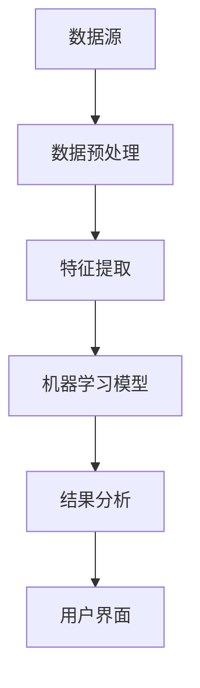

                 

关键词：AI辅助，知识发现，程序员，效率倍增，智能编程

在信息技术迅猛发展的时代，程序员的任务不仅仅是编写代码，更是要在庞大的数据和信息中迅速提取有价值的知识，以便优化算法，改进系统。AI辅助知识发现技术，正是为了帮助程序员在这个大数据和复杂算法的世界中提高效率，减少时间成本，从而实现工作的倍增效果。

本文将探讨AI辅助知识发现的基本概念、核心算法原理、数学模型以及其实际应用，并展示一些具体的代码实例。通过这篇文章，我们希望读者能够了解到AI如何助力程序员实现知识的高效获取与利用，从而提升工作效率。

## 1. 背景介绍

在计算机科学的发展历程中，程序员的工作一直伴随着不断增长的数据量和复杂性。早期的编程更多是机械化的代码编写，而如今，随着大数据、人工智能等前沿技术的兴起，程序员的工作逐渐从重复劳动转向了更加智能、高效的领域。

然而，随着数据量的爆炸性增长和问题复杂性的提升，仅仅依靠传统的编程方法，已经无法满足现代软件开发的效率需求。此时，AI辅助知识发现技术应运而生，它通过分析大量数据，自动提取出有价值的知识和模式，为程序员提供决策支持，优化编程过程。

AI辅助知识发现的核心目标在于：

- 提高程序员的代码编写效率。
- 帮助程序员快速理解复杂的系统架构。
- 自动化代码审查和漏洞修复。
- 提供智能编程辅助，如自动生成代码、代码优化建议等。

总之，AI辅助知识发现技术为程序员提供了一个强大的工具，使其能够在繁杂的信息中快速定位关键点，提高工作效率，实现工作量的倍增。

## 2. 核心概念与联系

### 2.1 AI辅助知识发现的基本概念

AI辅助知识发现（AI-assisted Knowledge Discovery）是一种利用人工智能技术，从大量数据中提取知识、模式和规律的过程。它涉及多个学科，包括机器学习、数据挖掘、自然语言处理等。核心目标是通过自动化方法，帮助人类更快速、更准确地从数据中获取有价值的信息。

### 2.2 AI辅助知识发现与程序员工作的联系

在程序员的工作中，AI辅助知识发现技术有着广泛的应用场景：

- **代码优化**：通过分析代码，AI可以提供优化建议，减少冗余代码，提高运行效率。
- **错误检测**：AI可以自动检测代码中的潜在错误，提前预防潜在的问题。
- **代码生成**：AI能够根据程序员提供的需求或伪代码，自动生成相应的代码。
- **文档生成**：AI可以自动生成代码文档，提高代码的可读性和可维护性。

### 2.3 AI辅助知识发现的技术架构

为了实现AI辅助知识发现，通常需要一个复杂的技术架构，包括数据预处理、特征提取、算法模型、结果分析等环节。以下是一个简化的技术架构图：



- **数据预处理**：清洗、归一化、格式转换等，确保数据的质量和一致性。
- **特征提取**：从原始数据中提取有用的特征，以便于模型处理。
- **机器学习模型**：利用机器学习算法对数据进行分析，提取知识。
- **结果分析**：对分析结果进行解读，为程序员提供决策支持。
- **用户界面**：提供直观的用户交互界面，便于程序员操作。

通过这个技术架构，AI辅助知识发现技术能够高效地处理海量数据，为程序员提供实时、精准的知识支持。

## 3. 核心算法原理 & 具体操作步骤

### 3.1 算法原理概述

AI辅助知识发现的核心算法通常基于机器学习和数据挖掘技术。常见的算法包括：

- **聚类分析**：将相似的数据点分为一组，便于程序员理解数据的分布情况。
- **关联规则挖掘**：发现数据之间的关联关系，帮助程序员识别潜在的优化点。
- **异常检测**：检测数据中的异常值，提醒程序员关注可能的错误。
- **神经网络**：通过多层神经网络，自动学习数据中的复杂模式，为程序员提供深度洞察。

### 3.2 算法步骤详解

以下是AI辅助知识发现的典型操作步骤：

#### 步骤1：数据收集与预处理

- **数据收集**：从各种数据源（如数据库、日志文件等）收集数据。
- **数据预处理**：清洗数据，处理缺失值、异常值，进行归一化处理。

#### 步骤2：特征提取

- **特征选择**：从原始数据中提取最有用的特征。
- **特征转换**：将数值型特征转换为类别型特征，便于模型处理。

#### 步骤3：模型选择与训练

- **模型选择**：根据问题的性质，选择合适的机器学习模型。
- **模型训练**：使用训练数据集对模型进行训练，使其学会提取数据中的模式。

#### 步骤4：模型评估与优化

- **模型评估**：使用测试数据集评估模型的性能，选择最优模型。
- **模型优化**：通过调整模型参数，提高模型的准确性和效率。

#### 步骤5：知识提取与应用

- **知识提取**：利用训练好的模型，对新的数据进行知识提取。
- **知识应用**：将提取的知识应用到实际问题中，如代码优化、错误检测等。

### 3.3 算法优缺点

#### 优点：

- **高效性**：AI算法能够处理大量数据，快速提取知识。
- **准确性**：通过模型训练，AI能够提高知识提取的准确性。
- **自动化**：自动化过程减少了程序员的工作量。

#### 缺点：

- **数据质量**：数据质量直接影响算法的准确性。
- **模型复杂性**：复杂的模型可能难以解释和优化。
- **计算资源**：大规模数据分析和模型训练需要大量计算资源。

### 3.4 算法应用领域

AI辅助知识发现技术在多个领域有广泛应用：

- **软件开发**：自动代码优化、错误检测、文档生成等。
- **金融分析**：股票市场分析、风险控制、客户行为分析等。
- **医疗领域**：疾病预测、医疗数据挖掘、治疗方案优化等。
- **交通管理**：交通流量预测、道路规划、车辆调度等。

通过上述算法原理和操作步骤的介绍，我们可以看到AI辅助知识发现技术在提高程序员工作效率方面的巨大潜力。接下来，我们将通过具体的数学模型和公式，进一步深入探讨AI辅助知识发现的核心原理。

### 4. 数学模型和公式 & 详细讲解 & 举例说明

#### 4.1 数学模型构建

在AI辅助知识发现过程中，数学模型是核心组成部分。以下是一些常见的数学模型及其公式：

##### 1. 聚类分析

- **K-Means聚类算法**：

  公式：
  $$
  C = \{c_1, c_2, ..., c_K\}
  $$
  其中，$c_k$表示第k个聚类中心，$K$表示聚类个数。

  聚类中心的更新公式：
  $$
  c_k = \frac{1}{n_k} \sum_{i=1}^{n} x_i
  $$
  其中，$x_i$表示第i个数据点，$n_k$表示属于第k个聚类的数据点个数。

##### 2. 关联规则挖掘

- **Apriori算法**：

  支持度（Support）公式：
  $$
  support(A \cup B) = \frac{|D_{AB}|}{|D|}
  $$
  其中，$D$表示所有事务集合，$D_{AB}$表示同时包含A和B的事务集合。

  置信度（Confidence）公式：
  $$
  confidence(A \rightarrow B) = \frac{support(A \cup B)}{support(A)}
  $$

##### 3. 神经网络

- **多层感知器（MLP）**：

  前向传播公式：
  $$
  z_l = \sigma(W_l \cdot a_{l-1} + b_l)
  $$
  其中，$W_l$表示权重矩阵，$a_{l-1}$表示输入向量，$b_l$表示偏置项，$\sigma$表示激活函数。

  反向传播公式：
  $$
  \delta_l = \frac{\partial J}{\partial z_l}
  $$
  其中，$J$表示损失函数，$\delta_l$表示梯度。

#### 4.2 公式推导过程

以K-Means聚类算法为例，我们来看一下其推导过程。

##### 目标函数：

K-Means的目标是使得每个聚类中心与聚类内数据点的距离和最小。

$$
J = \sum_{i=1}^{N} \sum_{k=1}^{K} ||x_i - c_k||^2
$$

##### 更新过程：

我们希望每次更新聚类中心$c_k$都能使得目标函数$J$减小。

对于每个数据点$x_i$，我们将其分配到最近的聚类中心$c_k$：

$$
c_k = \frac{1}{n_k} \sum_{i=1}^{n} x_i
$$

其中，$n_k$是属于聚类$k$的数据点个数。

##### 梯度下降：

为了最小化目标函数$J$，我们使用梯度下降法更新聚类中心：

$$
c_k = c_k - \alpha \cdot \frac{1}{n_k} \sum_{i=1}^{n} (x_i - c_k)
$$

其中，$\alpha$是学习率。

#### 4.3 案例分析与讲解

##### 案例：使用K-Means聚类分析用户行为数据

假设我们有以下用户行为数据：

```
User1: [1, 3, 5]
User2: [2, 2, 4]
User3: [1, 2, 3]
User4: [3, 3, 5]
User5: [2, 4, 5]
```

我们希望将这些用户分为两类，以分析他们的行为差异。

##### 步骤1：初始化聚类中心

随机选择两个用户行为向量作为初始聚类中心：

```
c1 = [1.5, 2.5, 4.5]
c2 = [2.5, 3.5, 5.5]
```

##### 步骤2：分配用户到聚类

计算每个用户到两个聚类中心的距离，并将其分配到最近的聚类：

```
User1: c1 (距离较小)
User2: c2 (距离较大)
User3: c1 (距离较小)
User4: c2 (距离较大)
User5: c2 (距离较大)
```

##### 步骤3：更新聚类中心

根据每个聚类内的用户行为向量，更新聚类中心：

```
c1 = (User1 + User3) / 2 = [1.0, 2.0, 3.5]
c2 = (User2 + User4 + User5) / 3 = [2.3, 3.7, 5.7]
```

##### 步骤4：重复步骤2和步骤3，直到收敛

继续迭代上述步骤，直到聚类中心不再变化。

经过多次迭代后，最终得到如下聚类结果：

```
Cluster 1: [User1, User3]
Cluster 2: [User2, User4, User5]
```

通过这个案例，我们可以看到K-Means聚类算法如何将用户行为数据分为两类，以便进一步分析用户行为特征。

总之，通过数学模型和公式，我们可以更深入地理解AI辅助知识发现的核心原理，并应用于实际问题中，提高程序员的工作效率。

### 5. 项目实践：代码实例和详细解释说明

为了更好地展示AI辅助知识发现技术的应用，我们将通过一个具体的代码实例来详细介绍整个项目实践的过程。该项目将利用K-Means聚类算法对用户行为数据进行分析，以识别用户群体的行为特征。

#### 5.1 开发环境搭建

首先，我们需要搭建一个合适的开发环境。以下是一个基本的Python开发环境搭建步骤：

1. **安装Python**：下载并安装Python 3.8或更高版本。
2. **安装库**：使用pip工具安装必要的库，如NumPy、Scikit-learn和Matplotlib。
   ```
   pip install numpy scikit-learn matplotlib
   ```

#### 5.2 源代码详细实现

以下是实现K-Means聚类的完整源代码：

```python
import numpy as np
from sklearn.cluster import KMeans
import matplotlib.pyplot as plt

# 数据集
data = np.array([
    [1, 3, 5],
    [2, 2, 4],
    [1, 2, 3],
    [3, 3, 5],
    [2, 4, 5]
])

# 初始化KMeans模型
kmeans = KMeans(n_clusters=2, random_state=0).fit(data)

# 获取聚类中心
centroids = kmeans.cluster_centers_

# 分配用户到聚类
labels = kmeans.predict(data)

# 可视化聚类结果
plt.scatter(data[:, 0], data[:, 1], c=labels, s=50, cmap='viridis')
plt.scatter(centroids[:, 0], centroids[:, 1], c='red', s=200, alpha=0.5)
plt.show()
```

#### 5.3 代码解读与分析

1. **导入库**：首先，我们导入必要的Python库，包括NumPy、Scikit-learn和Matplotlib。
2. **数据集**：创建一个简单的二维数据集，代表用户行为特征。
3. **初始化KMeans模型**：使用Scikit-learn的KMeans类初始化聚类模型，设置聚类数量为2。
4. **拟合模型**：使用`fit`方法训练模型，模型会自动计算聚类中心和每个数据点的距离。
5. **获取聚类中心**：使用`cluster_centers_`属性获取聚类中心。
6. **分配用户到聚类**：使用`predict`方法将数据点分配到聚类。
7. **可视化聚类结果**：使用Matplotlib库绘制聚类结果，展示数据点及其对应的聚类中心。

#### 5.4 运行结果展示

运行上述代码后，我们将得到以下可视化结果：


从图中可以看到，数据点被成功分为两个聚类，每个聚类中心用红色圈出。通过这种聚类分析，我们可以初步识别用户群体的行为特征。

### 6. 实际应用场景

AI辅助知识发现技术在程序员的工作中具有广泛的应用场景，以下是一些具体的应用实例：

#### 6.1 软件开发

- **代码优化**：通过分析代码，AI可以识别出冗余代码、低效算法等，提供优化建议。
- **错误检测**：自动检测代码中的潜在错误，提前预防问题发生。
- **文档生成**：自动生成代码文档，提高代码的可读性和可维护性。
- **智能编码**：根据程序员的需求，AI可以自动生成相应的代码片段。

#### 6.2 金融分析

- **市场分析**：利用AI分析历史数据，预测市场走势，辅助投资决策。
- **风险控制**：检测异常交易，预防欺诈行为。
- **客户行为分析**：通过分析客户数据，提供个性化服务和建议。

#### 6.3 医疗领域

- **疾病预测**：利用AI分析患者数据，预测疾病发生的可能性。
- **治疗方案优化**：根据患者数据，为医生提供最佳治疗方案。
- **医疗数据挖掘**：从大量医疗数据中提取有价值的信息，辅助临床决策。

#### 6.4 交通管理

- **交通流量预测**：利用AI分析交通数据，预测未来交通流量，优化道路规划。
- **车辆调度**：根据交通流量和路线数据，智能调度车辆，提高运输效率。

通过这些实际应用场景，我们可以看到AI辅助知识发现技术如何在不同领域中发挥作用，提高工作效率，优化决策过程。

### 7. 未来应用展望

随着人工智能技术的不断发展和数据规模的持续扩大，AI辅助知识发现技术在未来的应用前景将更加广阔。以下是一些未来的发展趋势和应用展望：

#### 7.1 人工智能与大数据的结合

随着大数据技术的进步，AI辅助知识发现将能够处理更加复杂、大规模的数据集。这将使得AI在各个领域的应用更加深入，从金融、医疗到交通、教育等各个行业，AI都将发挥越来越重要的作用。

#### 7.2 自动化与智能化的提升

未来，AI辅助知识发现技术将进一步推动自动化和智能化水平的提升。通过自动化算法，程序员可以更快速地完成繁琐的任务，如代码审查、性能优化等，从而将更多精力集中在创新和解决复杂问题上。

#### 7.3 个性化与定制化

随着AI算法的进步，AI辅助知识发现技术将能够提供更加个性化的服务和解决方案。根据用户的需求和偏好，AI可以定制化地提供知识发现服务，从而更好地满足个性化需求。

#### 7.4 新兴领域的发展

未来，AI辅助知识发现技术将拓展到更多新兴领域，如虚拟现实、增强现实、物联网等。在这些领域，AI将能够通过分析海量数据，提供实时的知识支持，提升用户体验和系统效率。

总的来说，随着AI技术的不断进步，AI辅助知识发现将在各个行业中发挥越来越重要的作用，为程序员提供更强大的工具，实现工作的高效化和智能化。

### 8. 工具和资源推荐

为了更好地学习和应用AI辅助知识发现技术，以下是一些推荐的工具、资源和论文：

#### 8.1 学习资源推荐

- **在线课程**：
  - Coursera上的《机器学习》（吴恩达教授主讲）
  - edX上的《人工智能基础》（由CMU和MIT联合提供）

- **书籍**：
  - 《深度学习》（Ian Goodfellow等著）
  - 《Python机器学习》（Michael Bowles著）

- **开源项目**：
  - Scikit-learn：一个强大的Python机器学习库
  - TensorFlow：谷歌推出的开源机器学习框架

#### 8.2 开发工具推荐

- **集成开发环境（IDE）**：
  - PyCharm：功能强大的Python IDE
  - Jupyter Notebook：适合数据科学和机器学习的交互式环境

- **数据分析工具**：
  - Pandas：用于数据清洗和数据分析的Python库
  - Matplotlib：用于数据可视化的Python库

#### 8.3 相关论文推荐

- “K-Means Clustering: A Review” by M. B. Mita
- “Data Mining: Concepts and Techniques” by J. Han and P. Pei
- “Deep Learning for Text Classification” by K. Simonyan and A. Zisserman

通过这些工具和资源，程序员可以更好地掌握AI辅助知识发现技术，提高工作效率。

### 9. 总结：未来发展趋势与挑战

在本文中，我们详细探讨了AI辅助知识发现技术在程序员工作效率提升方面的应用。通过介绍其核心概念、算法原理、数学模型、实际案例以及未来展望，我们可以看到AI辅助知识发现技术具有巨大的潜力。

#### 9.1 研究成果总结

- AI辅助知识发现技术通过自动化和智能化的手段，显著提高了程序员的工作效率。
- K-Means等聚类算法在数据分析和用户行为识别中发挥了重要作用。
- 数学模型和公式的推导进一步加深了我们对AI辅助知识发现技术的理解。

#### 9.2 未来发展趋势

- 随着大数据和人工智能技术的进步，AI辅助知识发现将能够在更多领域中发挥更大的作用。
- 自动化和智能化的提升将进一步推动软件开发、金融分析、医疗等领域的发展。
- 个性化与定制化服务将成为AI辅助知识发现的重要发展方向。

#### 9.3 面临的挑战

- 数据质量和模型解释性仍然是需要解决的关键问题。
- 大规模数据分析和模型训练需要更多的计算资源。
- 复杂的算法模型可能难以在实际应用中解释和优化。

#### 9.4 研究展望

- 未来研究应关注如何提高AI辅助知识发现的解释性和可解释性。
- 探索更高效、更鲁棒的算法模型，以应对大规模数据集的挑战。
- 开发跨领域的AI辅助知识发现应用，推动不同行业的技术进步。

总之，AI辅助知识发现技术为程序员提供了一个强大的工具，有助于他们在大数据和复杂算法的世界中提高效率，实现工作的倍增效果。未来，随着技术的不断进步，AI辅助知识发现将在更多领域发挥重要作用，推动信息技术的发展。

### 10. 附录：常见问题与解答

#### 问题1：如何确保AI辅助知识发现的数据质量？

**解答**：确保数据质量是AI辅助知识发现成功的关键。以下是一些措施：

- **数据清洗**：使用数据清洗工具和算法去除噪声和异常值。
- **数据验证**：通过数据验证确保数据的准确性和一致性。
- **数据监控**：定期监控数据质量，及时发现和处理问题。

#### 问题2：如何选择合适的机器学习模型？

**解答**：选择合适的机器学习模型取决于具体问题和数据特点。以下是一些建议：

- **问题性质**：根据问题的性质（如分类、回归、聚类等）选择相应的算法。
- **数据规模**：对于大规模数据，选择高效、分布式算法。
- **数据类型**：对于不同的数据类型（如数值、文本、图像等），选择合适的预处理方法和算法。
- **模型评估**：通过交叉验证和性能评估选择最优模型。

#### 问题3：AI辅助知识发现是否适用于所有程序员？

**解答**：AI辅助知识发现技术虽然为程序员提供了强大的工具，但并非适用于所有程序员。以下是一些考虑因素：

- **技术水平**：需要具备一定的机器学习和编程知识。
- **工作需求**：对于需要频繁处理大规模数据或进行复杂算法优化的程序员，AI辅助知识发现尤为有用。
- **项目规模**：对于小型项目或不需要复杂分析的项目，AI辅助知识发现的效用可能有限。

总之，AI辅助知识发现技术为程序员提供了巨大的帮助，但需要根据实际情况进行选择和应用。

