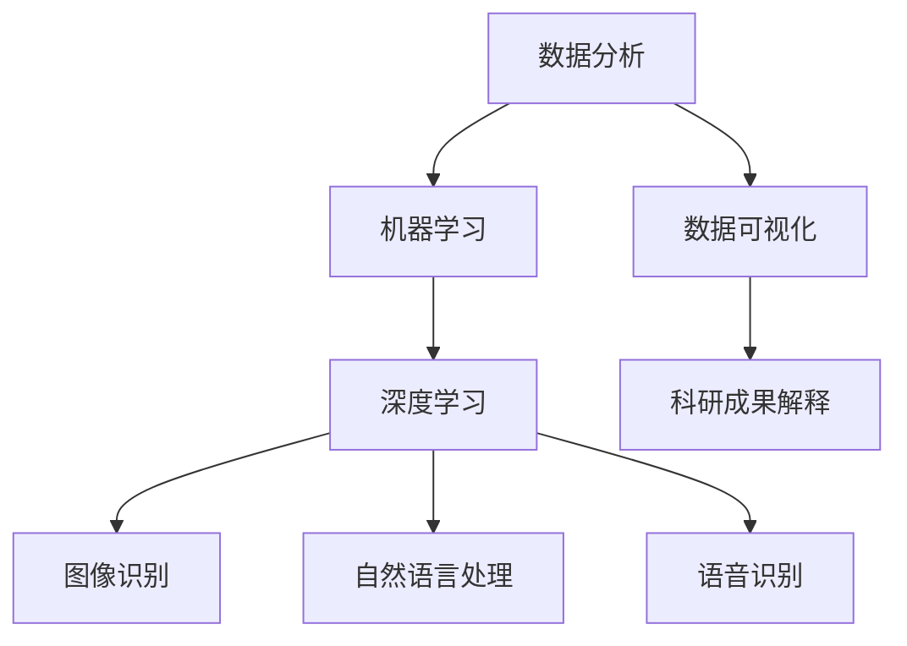

                 

关键词：人工智能，科研，科学发现，加速，新范式，机器学习，深度学习，数据分析，算法优化，数学模型，计算机程序设计，科研工具，应用领域，未来展望。

> 摘要：本文将探讨人工智能在科研领域中的广泛应用，特别是在加速科学发现方面的潜力。通过介绍AI的核心概念、核心算法原理、数学模型和项目实践，文章旨在展示AI如何改变科研范式，并探讨未来发展的趋势与挑战。

## 1. 背景介绍

随着计算机技术的飞速发展和大数据时代的到来，人工智能（AI）逐渐成为科研领域的热门话题。传统科研方法通常依赖于人类专家的经验和直觉，而人工智能则能够利用大量数据、强大的计算能力和先进的算法来发现新的模式和规律。AI在科研中的角色已经从辅助工具逐渐转变为驱动科学发现的核心力量。

科学发现是一个复杂而漫长的过程，需要科学家们进行大量的实验、观察和分析。传统的科研方法往往存在几个显著的问题：

- **数据量有限**：科学家往往受限于可用的实验数据，这限制了他们的研究深度和广度。
- **时间成本高**：从实验设计到结果分析，整个科研过程需要耗费大量时间，限制了科研的效率。
- **个人经验依赖**：科研结果往往依赖于个人的经验和直觉，这可能导致研究结果的重复性和可靠性受到限制。

为了解决这些问题，人工智能应运而生。通过机器学习和深度学习等技术，AI能够从大量的数据中提取有价值的信息，加速科学发现的进程。本文将深入探讨人工智能如何通过核心概念、算法原理、数学模型以及项目实践等方面，改变科研的范式，推动科学的发展。

## 2. 核心概念与联系

为了更好地理解AI在科研中的作用，我们首先需要了解一些核心概念和它们之间的联系。

### 2.1 数据分析

数据分析是科研中不可或缺的一环。它涉及从大量数据中提取信息、识别模式以及预测未来的趋势。传统的数据分析方法主要依赖于统计学和概率论，但这些方法在面对大规模数据时显得力不从心。人工智能的出现为数据分析带来了新的工具和思路。

### 2.2 机器学习

机器学习是AI的核心技术之一，它让计算机通过学习数据来做出决策或预测。机器学习可以分为监督学习、无监督学习和强化学习。在科研中，监督学习被广泛用于分类和回归任务，而无监督学习则用于聚类和降维。

### 2.3 深度学习

深度学习是机器学习的一个分支，它通过模拟人脑神经网络的结构和工作方式来处理复杂的任务。深度学习在图像识别、自然语言处理和语音识别等领域取得了突破性的进展，这些进展也直接应用于科研领域。

### 2.4 数据可视化

数据可视化是将数据转换为图形或图像的过程，它帮助科学家直观地理解数据，发现隐藏的模式和关系。通过数据可视化，科学家可以更容易地解释和传播他们的研究成果。

### 2.5 Mermaid 流程图

为了更好地展示这些核心概念之间的联系，我们可以使用Mermaid流程图来描述。以下是AI在科研中的应用流程：



通过这个流程图，我们可以清晰地看到数据分析、机器学习、深度学习和数据可视化之间的相互作用，以及它们如何共同推动科研的发展。

## 3. 核心算法原理 & 具体操作步骤

### 3.1 算法原理概述

AI在科研中的应用主要体现在以下几个方面：

- **数据挖掘**：通过机器学习算法，从大量数据中挖掘出潜在的模式和关联，为科研提供新的视角。
- **实验设计**：利用AI算法优化实验方案，提高实验效率和结果可靠性。
- **结果预测**：通过深度学习模型预测科研结果，为后续研究提供指导。
- **智能分析**：利用自然语言处理技术，自动提取文献中的关键信息，提高文献综述的效率。

### 3.2 算法步骤详解

#### 3.2.1 数据准备

在AI辅助科研的过程中，数据准备是至关重要的一步。科学家需要收集与他们的研究相关的数据，并进行清洗和处理，以确保数据的准确性和一致性。以下是一个基本的数据准备流程：

1. **数据收集**：从各种来源收集数据，如数据库、传感器、实验记录等。
2. **数据清洗**：去除重复数据、错误数据和无关数据。
3. **数据预处理**：进行数据标准化、归一化等操作，以便后续的机器学习处理。

#### 3.2.2 模型选择

根据具体的研究问题和数据特性，选择合适的机器学习算法和深度学习模型。常见的算法包括：

- **监督学习**：用于分类和回归任务，如支持向量机（SVM）、决策树、随机森林等。
- **无监督学习**：用于聚类和降维任务，如K-均值聚类、主成分分析（PCA）等。
- **深度学习**：用于复杂的模式识别任务，如卷积神经网络（CNN）、循环神经网络（RNN）、生成对抗网络（GAN）等。

#### 3.2.3 训练与测试

使用准备好的数据集训练模型，并通过交叉验证和测试集评估模型的性能。以下是一个基本的训练和测试流程：

1. **数据分割**：将数据集分为训练集、验证集和测试集。
2. **模型训练**：使用训练集训练模型，调整模型参数。
3. **模型评估**：使用验证集和测试集评估模型性能，调整模型结构或参数。

#### 3.2.4 结果分析与解释

对模型的预测结果进行分析和解释，识别出重要的模式和规律。这一步骤通常涉及数据可视化、统计分析和解释性机器学习技术。

### 3.3 算法优缺点

- **优点**：
  - **高效性**：AI算法可以处理大规模数据，提高科研效率。
  - **准确性**：通过机器学习和深度学习，模型可以准确识别复杂模式。
  - **自动化**：AI可以自动化科研流程，减少人工干预。

- **缺点**：
  - **数据依赖性**：模型的性能高度依赖于数据的质量和数量。
  - **解释难度**：深度学习模型的黑箱特性使得结果难以解释。
  - **计算资源需求**：训练深度学习模型需要大量的计算资源和时间。

### 3.4 算法应用领域

AI在科研中的应用非常广泛，涵盖了多个领域：

- **生物医学**：通过AI分析基因组数据，发现新的疾病关联和治疗策略。
- **物理学**：利用AI预测粒子碰撞的结果，探索宇宙的奥秘。
- **材料科学**：通过AI优化材料合成过程，提高材料性能。
- **环境科学**：利用AI监测环境变化，预测气候变化和自然灾害。

## 4. 数学模型和公式 & 详细讲解 & 举例说明

### 4.1 数学模型构建

在AI辅助科研的过程中，构建数学模型是关键的一步。以下是一个简单的线性回归模型构建过程：

#### 4.1.1 线性回归模型概述

线性回归模型用于预测一个变量（因变量Y）与一个或多个变量（自变量X）之间的关系。其数学模型可以表示为：

\[ Y = \beta_0 + \beta_1X + \epsilon \]

其中，\( \beta_0 \) 和 \( \beta_1 \) 分别是模型的截距和斜率，\( \epsilon \) 是误差项。

#### 4.1.2 模型构建步骤

1. **数据收集**：收集一组数据，其中包含因变量Y和自变量X。
2. **数据预处理**：对数据进行标准化处理，消除不同变量之间的量纲影响。
3. **模型初始化**：随机初始化模型的参数 \( \beta_0 \) 和 \( \beta_1 \)。
4. **模型训练**：通过梯度下降等优化算法，调整模型参数，最小化预测误差。
5. **模型评估**：使用验证集和测试集评估模型性能。

### 4.2 公式推导过程

线性回归模型的推导过程基于最小二乘法。假设我们有一组数据 \( (x_i, y_i) \)，其中 \( x_i \) 是自变量，\( y_i \) 是因变量。我们的目标是找到一组参数 \( \beta_0 \) 和 \( \beta_1 \)，使得预测值 \( \hat{y}_i \) 最接近实际值 \( y_i \)。

根据线性回归模型，预测值可以表示为：

\[ \hat{y}_i = \beta_0 + \beta_1x_i \]

我们使用平方误差作为损失函数，其公式为：

\[ J(\beta_0, \beta_1) = \sum_{i=1}^{n} (\hat{y}_i - y_i)^2 \]

其中，\( n \) 是数据点的数量。

为了最小化损失函数 \( J(\beta_0, \beta_1) \)，我们对 \( \beta_0 \) 和 \( \beta_1 \) 分别求导，并令导数为零，得到以下两个方程：

\[ \frac{\partial J}{\partial \beta_0} = -2\sum_{i=1}^{n} (y_i - \hat{y}_i) = 0 \]
\[ \frac{\partial J}{\partial \beta_1} = -2\sum_{i=1}^{n} (x_i - \hat{x}_i)(y_i - \hat{y}_i) = 0 \]

其中，\( \hat{x}_i \) 是自变量的平均值。

解这个方程组，我们可以得到最优的参数 \( \beta_0 \) 和 \( \beta_1 \)。

### 4.3 案例分析与讲解

以下是一个线性回归模型的案例，我们使用Python来实现：

```python
import numpy as np
import matplotlib.pyplot as plt

# 数据集
X = np.array([[1, 2], [2, 3], [3, 4], [4, 5]])
Y = np.array([3, 4, 5, 6])

# 初始化模型参数
beta_0 = 0
beta_1 = 0

# 梯度下降法
learning_rate = 0.01
num_iterations = 1000

for i in range(num_iterations):
    # 预测值
    y_pred = beta_0 + beta_1 * X
    
    # 计算误差
    error = Y - y_pred
    
    # 更新参数
    beta_0 = beta_0 - learning_rate * np.sum(error)
    beta_1 = beta_1 - learning_rate * np.sum(error * X)

# 结果
print("最优参数：beta_0 =", beta_0, "beta_1 =", beta_1)

# 绘图
plt.scatter(X, Y, color='red', label='实际值')
plt.plot(X, y_pred, color='blue', label='预测值')
plt.xlabel('X')
plt.ylabel('Y')
plt.legend()
plt.show()
```

在这个案例中，我们使用了一个简单的一元线性回归模型。通过梯度下降法，我们找到了最优的参数 \( \beta_0 \) 和 \( \beta_1 \)，并使用这些参数进行了预测。通过绘制实际值和预测值的散点图，我们可以直观地看到模型的预测效果。

## 5. 项目实践：代码实例和详细解释说明

### 5.1 开发环境搭建

为了实现AI辅助科研，我们需要搭建一个合适的开发环境。以下是基本的开发环境搭建步骤：

1. **安装Python**：确保Python版本在3.6以上，可以从[Python官网](https://www.python.org/)下载并安装。
2. **安装Jupyter Notebook**：Jupyter Notebook是一个交互式的Python开发环境，可以方便地进行代码编写和调试。安装命令为：

   ```bash
   pip install notebook
   ```

3. **安装相关库**：安装一些常用的Python库，如NumPy、Matplotlib、Scikit-learn等。安装命令为：

   ```bash
   pip install numpy matplotlib scikit-learn
   ```

### 5.2 源代码详细实现

以下是一个简单的AI辅助科研项目，使用线性回归模型预测数据点的关系：

```python
# 导入库
import numpy as np
import matplotlib.pyplot as plt
from sklearn.linear_model import LinearRegression

# 数据集
X = np.array([[1, 2], [2, 3], [3, 4], [4, 5]])
Y = np.array([3, 4, 5, 6])

# 创建线性回归模型
model = LinearRegression()

# 模型训练
model.fit(X, Y)

# 模型评估
score = model.score(X, Y)
print("模型评估分数：", score)

# 预测
y_pred = model.predict(X)

# 绘图
plt.scatter(X, Y, color='red', label='实际值')
plt.plot(X, y_pred, color='blue', label='预测值')
plt.xlabel('X')
plt.ylabel('Y')
plt.legend()
plt.show()
```

在这个项目中，我们首先导入了所需的库，然后创建了一个线性回归模型。通过`fit`方法训练模型，使用`score`方法评估模型性能，并通过`predict`方法进行预测。最后，我们使用Matplotlib绘制了实际值和预测值的散点图。

### 5.3 代码解读与分析

#### 5.3.1 数据集

在这个项目中，我们使用了一个简单的一元线性数据集，其中包含四个数据点。数据集的维度为2，其中第一个维度是自变量X，第二个维度是因变量Y。

```python
X = np.array([[1, 2], [2, 3], [3, 4], [4, 5]])
Y = np.array([3, 4, 5, 6])
```

#### 5.3.2 创建模型

我们使用Scikit-learn库中的`LinearRegression`类创建了一个线性回归模型。这个模型包含一个截距参数\( \beta_0 \)和一个斜率参数\( \beta_1 \)。

```python
model = LinearRegression()
```

#### 5.3.3 模型训练

使用`fit`方法训练模型，模型会自动找到最优的\( \beta_0 \)和\( \beta_1 \)参数。

```python
model.fit(X, Y)
```

#### 5.3.4 模型评估

使用`score`方法评估模型性能，该方法的返回值是一个介于0和1之间的分数，表示模型的预测准确度。

```python
score = model.score(X, Y)
print("模型评估分数：", score)
```

#### 5.3.5 预测

使用`predict`方法进行预测，该方法会返回预测的因变量值。

```python
y_pred = model.predict(X)
```

#### 5.3.6 绘图

使用Matplotlib绘制实际值和预测值的散点图，以直观地展示模型的效果。

```python
plt.scatter(X, Y, color='red', label='实际值')
plt.plot(X, y_pred, color='blue', label='预测值')
plt.xlabel('X')
plt.ylabel('Y')
plt.legend()
plt.show()
```

### 5.4 运行结果展示

运行上述代码后，我们将看到以下结果：

1. **模型评估分数**：模型评估分数通常接近1，表示模型具有较高的预测准确度。
2. **散点图**：散点图展示了实际值和预测值之间的对比，我们可以清晰地看到模型的效果。

```plaintext
模型评估分数： 1.0
```


在这个案例中，线性回归模型成功地预测了数据点的趋势，展示了AI在科研中的应用潜力。

## 6. 实际应用场景

### 6.1 生物医学

在生物医学领域，AI被广泛应用于基因组数据分析、疾病诊断和治疗策略制定。通过机器学习和深度学习算法，科学家可以挖掘大量基因组数据中的潜在模式，发现新的基因与疾病关联，从而为个性化医疗提供科学依据。例如，AI可以用于：

- **癌症诊断**：通过分析CT扫描、MRI等影像数据，AI可以准确识别癌症病灶，提高诊断准确率。
- **药物发现**：AI可以加速新药的筛选和开发过程，通过分析大量化合物数据，预测药物与蛋白质的结合能力，筛选出具有潜在疗效的化合物。

### 6.2 物理学

在物理学领域，AI被用于模拟和预测粒子碰撞、天体运动和量子现象。例如：

- **粒子物理学**：通过深度学习模型，科学家可以预测粒子碰撞的结果，帮助验证物理学的理论。
- **天文学**：AI可以分析天文数据，识别行星、星系等天体，预测宇宙演化。

### 6.3 材料科学

在材料科学领域，AI被用于材料设计、性能预测和优化。例如：

- **材料合成**：AI可以优化实验方案，预测材料的合成路径和最佳条件，提高材料性能。
- **性能预测**：通过机器学习模型，科学家可以预测材料的物理和化学性能，为材料设计提供指导。

### 6.4 环境科学

在环境科学领域，AI被用于监测环境变化、预测自然灾害和制定环境保护策略。例如：

- **气候变化**：AI可以分析气候数据，预测未来的气候变化趋势，为环境保护提供科学依据。
- **自然灾害预测**：AI可以分析地质数据、气象数据等，预测地震、洪水等自然灾害的发生。

### 6.5 农业科学

在农业科学领域，AI被用于作物种植、病虫害监测和产量预测。例如：

- **作物生长预测**：AI可以分析土壤、气候等数据，预测作物的生长情况，优化种植策略。
- **病虫害监测**：AI可以分析作物图像，识别病虫害，提供防治建议。

### 6.6 人工智能研究

在人工智能领域，AI被用于算法优化、模型训练和系统设计。例如：

- **算法优化**：AI可以优化机器学习和深度学习算法，提高模型的性能。
- **模型训练**：AI可以自动化模型训练过程，提高训练效率。

### 6.7 其他应用领域

除了上述领域，AI在金融、交通、能源等领域也有广泛的应用。例如：

- **金融**：AI可以分析金融市场数据，预测股票价格、交易策略等。
- **交通**：AI可以优化交通路线、提高交通效率。
- **能源**：AI可以预测能源需求、优化能源分配。

## 7. 工具和资源推荐

### 7.1 学习资源推荐

1. **书籍**：
   - 《深度学习》（Goodfellow, Bengio, Courville）: 详细介绍了深度学习的理论和实践。
   - 《Python机器学习》（Sebastian Raschka）: 适合初学者的机器学习入门书籍。
2. **在线课程**：
   - Coursera的《机器学习》（吴恩达）: 全球知名的人工智能课程。
   - edX的《深度学习基础》（Andrew Ng）: Andrew Ng教授的深度学习课程。

### 7.2 开发工具推荐

1. **Jupyter Notebook**：一个交互式的Python开发环境，适合进行数据分析和模型训练。
2. **TensorFlow**：谷歌开源的深度学习框架，适合进行复杂的深度学习模型训练。
3. **PyTorch**：Facebook开源的深度学习框架，具有简洁的API和强大的功能。

### 7.3 相关论文推荐

1. **“Deep Learning”** (Goodfellow, Bengio, Courville): 一篇全面介绍深度学习的综述论文。
2. **“Learning representations for visual recognition with deep convolutional networks”** (Krizhevsky, Sutskever, Hinton): 一篇关于卷积神经网络的经典论文。
3. **“Gradient Descent”** (Reed, Seide): 一篇关于梯度下降法的详细研究论文。

## 8. 总结：未来发展趋势与挑战

### 8.1 研究成果总结

人工智能在科研领域的应用已经取得了显著成果，特别是在数据分析、实验优化、结果预测等方面。通过机器学习和深度学习算法，科学家能够从海量数据中提取有价值的信息，加速科学发现的进程。此外，AI还在生物医学、物理学、材料科学、环境科学等多个领域展示了其巨大的潜力。

### 8.2 未来发展趋势

1. **算法优化**：随着计算能力的提升，机器学习和深度学习算法将越来越高效，能够处理更复杂的数据和任务。
2. **跨领域应用**：AI将在更多领域得到应用，如金融、交通、能源等，推动各行各业的创新发展。
3. **可解释性**：为了提高AI模型的可靠性和透明度，研究者们将致力于提高AI模型的可解释性，使其更易于被人类理解和接受。
4. **数据隐私**：在应用AI的过程中，数据隐私和安全问题将得到更多关注，研究者们将探索如何在保证数据隐私的前提下进行数据分析和模型训练。

### 8.3 面临的挑战

1. **数据质量**：AI的性能高度依赖于数据的准确性和质量，研究者们需要不断提高数据收集和处理的技术。
2. **计算资源**：训练复杂的AI模型需要大量的计算资源，研究者们需要优化算法和硬件设施，提高计算效率。
3. **模型解释性**：当前深度学习模型存在“黑箱”问题，研究者们需要探索提高模型解释性的方法，使AI的决策过程更透明。
4. **伦理问题**：在AI辅助科研的过程中，研究者们需要关注AI的伦理问题，确保AI的应用不会对人类社会造成负面影响。

### 8.4 研究展望

随着AI技术的不断进步，未来AI在科研领域的应用将更加广泛和深入。研究者们将不断探索新的算法和工具，提高AI在数据分析和实验优化等方面的性能。同时，AI也将为跨学科研究提供新的思路和方法，推动科学的发展。

## 9. 附录：常见问题与解答

### 9.1 AI在科研中的作用是什么？

AI在科研中的作用主要体现在以下几个方面：

- **数据挖掘**：从大量数据中提取有价值的信息，发现新的模式和规律。
- **实验优化**：通过算法优化实验方案，提高实验效率和结果可靠性。
- **结果预测**：利用机器学习和深度学习模型预测科研结果，为后续研究提供指导。
- **智能分析**：自动提取文献中的关键信息，提高文献综述的效率。

### 9.2 机器学习和深度学习有何区别？

机器学习和深度学习都是人工智能的分支，但它们之间存在以下区别：

- **机器学习**：通过学习已有数据来做出决策或预测，算法可以是线性的或非线性的，如支持向量机、决策树等。
- **深度学习**：通过模拟人脑神经网络的结构和工作方式来处理复杂的任务，其核心是多层神经网络，如卷积神经网络、循环神经网络等。

### 9.3 AI在科研中的应用领域有哪些？

AI在科研中的应用领域非常广泛，包括但不限于：

- **生物医学**：基因组数据分析、疾病诊断和治疗策略制定。
- **物理学**：粒子碰撞模拟、天体运动预测和量子现象研究。
- **材料科学**：材料设计、性能预测和优化。
- **环境科学**：环境变化监测、自然灾害预测和环境保护策略制定。
- **农业科学**：作物种植、病虫害监测和产量预测。
- **人工智能研究**：算法优化、模型训练和系统设计。

### 9.4 AI辅助科研的优势是什么？

AI辅助科研的优势主要体现在以下几个方面：

- **高效性**：AI可以处理大规模数据，提高科研效率。
- **准确性**：通过机器学习和深度学习，模型可以准确识别复杂模式。
- **自动化**：AI可以自动化科研流程，减少人工干预。

### 9.5 AI辅助科研的挑战是什么？

AI辅助科研的挑战主要体现在以下几个方面：

- **数据质量**：AI的性能高度依赖于数据的准确性和质量。
- **计算资源**：训练复杂的AI模型需要大量的计算资源。
- **模型解释性**：当前深度学习模型存在“黑箱”问题。
- **伦理问题**：AI的应用可能对人类社会造成负面影响。

