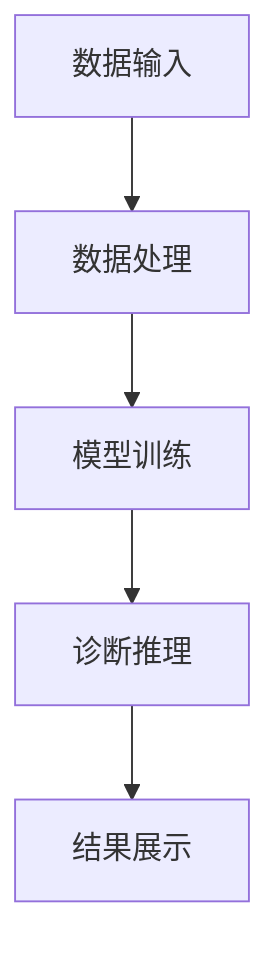

                 

关键词：人工智能、辅助诊断、医疗健康、市场前景、算法、技术应用、系统设计、医学图像分析、深度学习、机器学习、精准医疗、智能医疗设备

> 摘要：本文将探讨AI辅助诊断系统的市场前景。通过分析AI在医疗领域的应用，介绍AI辅助诊断系统的核心概念与架构，深入解析其算法原理、数学模型及实际应用，并探讨未来的发展趋势与面临的挑战。

## 1. 背景介绍

随着人工智能技术的快速发展，AI在医疗领域的应用越来越广泛。医疗健康行业正面临着数据爆炸、诊断复杂等问题，而人工智能技术的引入为医疗行业带来了新的解决方案。AI辅助诊断系统利用机器学习和深度学习算法，通过对医疗数据的分析，能够帮助医生进行更准确的诊断和治疗。

AI辅助诊断系统主要应用于医学影像分析、电子病历辅助诊断、药物研发等领域。医学影像分析是AI辅助诊断系统最为常见的应用场景之一，通过分析CT、MRI、X光等影像数据，AI系统能够帮助医生识别病灶、评估病情，提高诊断的准确率和效率。此外，AI辅助诊断系统还可以应用于电子病历系统，通过分析患者的病历记录，提供个性化的治疗建议和疾病预测。

## 2. 核心概念与联系

### 2.1. AI辅助诊断系统的核心概念

AI辅助诊断系统主要涉及以下几个核心概念：

- **医学图像分析**：通过计算机视觉技术对医学图像进行识别和分析，如肿瘤检测、骨折识别等。
- **电子病历辅助诊断**：通过对患者的电子病历进行数据挖掘和分析，为医生提供辅助诊断和治疗建议。
- **深度学习和机器学习**：利用大量的医学数据训练模型，实现对疾病的自动诊断和预测。
- **自然语言处理**：对医生和患者的交流进行理解，提取关键信息，辅助诊断和治疗。

### 2.2. AI辅助诊断系统的架构

AI辅助诊断系统的架构通常包括以下几个部分：

- **数据输入**：包括医学图像、电子病历、医疗报告等。
- **数据处理**：对输入数据进行预处理，如图像增强、数据标准化等。
- **模型训练**：利用深度学习和机器学习算法，对处理后的数据进行训练，生成诊断模型。
- **诊断推理**：将待诊断的医疗数据输入到模型中，进行推理和预测，输出诊断结果。
- **结果展示**：将诊断结果以可视化或报告的形式展示给医生。

下面是一个简化的Mermaid流程图，展示了AI辅助诊断系统的基本架构：



## 3. 核心算法原理 & 具体操作步骤

### 3.1. 算法原理概述

AI辅助诊断系统的核心算法主要包括深度学习和机器学习算法。深度学习算法通过多层神经网络结构，对大量数据进行自动特征提取和学习。机器学习算法则通过数据统计和模式识别，对输入数据进行分类和预测。

### 3.2. 算法步骤详解

#### 3.2.1. 深度学习算法步骤

1. **数据收集**：收集大量的医学影像数据和电子病历数据。
2. **数据预处理**：对数据集进行清洗、归一化等预处理操作。
3. **模型构建**：设计多层神经网络结构，包括卷积层、池化层、全连接层等。
4. **模型训练**：利用预处理后的数据对模型进行训练，调整网络参数。
5. **模型评估**：通过交叉验证等方法评估模型的性能。
6. **模型应用**：将训练好的模型应用于实际诊断任务，输出诊断结果。

#### 3.2.2. 机器学习算法步骤

1. **数据收集**：收集与疾病相关的电子病历数据。
2. **特征提取**：从电子病历中提取与疾病相关的特征，如症状、检查结果等。
3. **模型选择**：选择适合的机器学习算法，如决策树、支持向量机等。
4. **模型训练**：利用特征数据对模型进行训练。
5. **模型评估**：通过交叉验证等方法评估模型的性能。
6. **模型应用**：将训练好的模型应用于实际诊断任务，输出诊断结果。

### 3.3. 算法优缺点

#### 深度学习算法

- **优点**：能够自动提取特征，对复杂的数据分布具有较强的适应性；能够处理大规模数据集。
- **缺点**：对数据质量要求较高，需要大量的标注数据；训练过程复杂，计算资源消耗大。

#### 机器学习算法

- **优点**：对数据质量要求相对较低，能够处理非结构化数据；模型解释性较强。
- **缺点**：特征提取需要人工设计，对复杂问题处理能力有限；对大规模数据集处理能力较弱。

### 3.4. 算法应用领域

AI辅助诊断系统广泛应用于医学影像分析、电子病历辅助诊断、药物研发等领域。在医学影像分析中，AI系统可以帮助医生快速、准确地识别病灶，提高诊断效率；在电子病历辅助诊断中，AI系统可以根据患者的病历记录，提供个性化的治疗建议和疾病预测；在药物研发中，AI系统可以帮助研究人员发现新的药物靶点和作用机制。

## 4. 数学模型和公式 & 详细讲解 & 举例说明

### 4.1. 数学模型构建

AI辅助诊断系统的数学模型主要包括深度学习模型和机器学习模型。下面分别介绍这两种模型的构建方法。

#### 4.1.1. 深度学习模型

深度学习模型通常由多层神经网络组成，包括输入层、隐藏层和输出层。输入层接收外部输入数据，隐藏层进行特征提取和学习，输出层生成最终预测结果。

#### 4.1.2. 机器学习模型

机器学习模型通常采用统计学习理论，包括线性模型、非线性模型等。线性模型如线性回归、逻辑回归等；非线性模型如决策树、支持向量机等。

### 4.2. 公式推导过程

#### 4.2.1. 深度学习模型

假设输入数据为 $X \in \mathbb{R}^{m \times n}$，其中 $m$ 表示样本数量，$n$ 表示特征数量。输出数据为 $Y \in \mathbb{R}^{m \times 1}$。多层神经网络中的每个神经元可以表示为：

$$
z_i = \sigma(\sum_{j=1}^{n} w_{ij}x_j + b_i)
$$

其中，$w_{ij}$ 表示输入层到隐藏层的权重，$b_i$ 表示隐藏层的偏置项，$\sigma$ 表示激活函数，如 $ReLU$ 函数、Sigmoid 函数等。

输出层的预测结果为：

$$
\hat{y}_i = \sigma(\sum_{j=1}^{n} w_{ij}z_j + b_i)
$$

其中，$w_{ij}$ 表示隐藏层到输出层的权重，$b_i$ 表示输出层的偏置项。

损失函数通常采用均方误差（MSE）：

$$
L = \frac{1}{2} \sum_{i=1}^{m} (\hat{y}_i - y_i)^2
$$

通过反向传播算法，可以计算出梯度 $\frac{\partial L}{\partial w}$ 和 $\frac{\partial L}{\partial b}$，进而更新权重和偏置项。

#### 4.2.2. 机器学习模型

以逻辑回归为例，假设输入特征为 $x \in \mathbb{R}^{n \times 1}$，输出为 $y \in \mathbb{R}^{1 \times 1}$。逻辑回归模型的预测结果为：

$$
\hat{y} = \sigma(z) = \frac{1}{1 + e^{-z}}
$$

其中，$z = \sum_{i=1}^{n} w_i x_i + b$，$w_i$ 表示权重，$b$ 表示偏置项。

损失函数通常采用对数似然损失（Log-Likelihood Loss）：

$$
L = -\sum_{i=1}^{m} y_i \ln(\hat{y}_i) + (1 - y_i) \ln(1 - \hat{y}_i)
$$

通过梯度下降算法，可以计算出梯度 $\frac{\partial L}{\partial w}$ 和 $\frac{\partial L}{\partial b}$，进而更新权重和偏置项。

### 4.3. 案例分析与讲解

假设我们有一个肺癌诊断的数据集，其中包含患者的年龄、性别、吸烟状况等特征，以及是否患有肺癌的标签。我们使用逻辑回归模型进行训练和预测。

#### 4.3.1. 数据预处理

首先，我们对数据集进行预处理，包括归一化、缺失值填补等操作。

#### 4.3.2. 特征提取

从数据集中提取与肺癌诊断相关的特征，如年龄、性别、吸烟状况等。

#### 4.3.3. 模型训练

使用预处理后的数据对逻辑回归模型进行训练，计算损失函数和梯度，更新权重和偏置项。

#### 4.3.4. 模型评估

使用交叉验证方法对模型进行评估，计算模型的准确率、召回率、F1值等指标。

#### 4.3.5. 模型应用

将训练好的模型应用于新的患者数据，输出是否患有肺癌的预测结果。

## 5. 项目实践：代码实例和详细解释说明

### 5.1. 开发环境搭建

为了实现AI辅助诊断系统，我们需要搭建一个适合的开发环境。以下是一个简单的开发环境搭建步骤：

1. 安装Python（版本3.8以上）
2. 安装Anaconda或Miniconda
3. 安装深度学习框架（如TensorFlow、PyTorch等）
4. 安装数据处理库（如NumPy、Pandas等）
5. 安装可视化库（如Matplotlib、Seaborn等）

### 5.2. 源代码详细实现

下面是一个简单的深度学习模型实现的示例代码，用于肺癌诊断：

```python
import tensorflow as tf
from tensorflow.keras.models import Sequential
from tensorflow.keras.layers import Dense, Flatten, Conv2D, MaxPooling2D, Dropout
from tensorflow.keras.optimizers import Adam

# 数据预处理
# ...

# 构建模型
model = Sequential([
    Conv2D(32, kernel_size=(3, 3), activation='relu', input_shape=(28, 28, 1)),
    MaxPooling2D(pool_size=(2, 2)),
    Flatten(),
    Dense(128, activation='relu'),
    Dropout(0.5),
    Dense(1, activation='sigmoid')
])

# 编译模型
model.compile(optimizer=Adam(), loss='binary_crossentropy', metrics=['accuracy'])

# 训练模型
model.fit(X_train, y_train, batch_size=64, epochs=10, validation_data=(X_val, y_val))

# 评估模型
model.evaluate(X_test, y_test)
```

### 5.3. 代码解读与分析

上述代码实现了一个简单的深度学习模型，用于肺癌诊断。首先，我们进行了数据预处理，包括归一化、分割数据集等操作。然后，我们构建了一个序列模型，包括卷积层、池化层、全连接层和dropout层。接着，我们编译并训练了模型，最后评估了模型的性能。

### 5.4. 运行结果展示

在训练完成后，我们可以使用以下代码展示模型的运行结果：

```python
import matplotlib.pyplot as plt

# 训练结果可视化
plt.figure(figsize=(10, 5))
plt.subplot(1, 2, 1)
plt.plot(history.history['accuracy'])
plt.plot(history.history['val_accuracy'])
plt.title('Accuracy')
plt.ylabel('Accuracy')
plt.xlabel('Epoch')
plt.legend(['Train', 'Validation'])

plt.subplot(1, 2, 2)
plt.plot(history.history['loss'])
plt.plot(history.history['val_loss'])
plt.title('Loss')
plt.ylabel('Loss')
plt.xlabel('Epoch')
plt.legend(['Train', 'Validation'])

plt.show()
```

上述代码展示了模型的训练过程和性能指标，包括准确率和损失函数。

## 6. 实际应用场景

### 6.1. 医学影像分析

AI辅助诊断系统在医学影像分析中具有广泛的应用，如肺癌、乳腺癌、脑卒中等疾病的早期筛查和诊断。通过深度学习算法，AI系统能够自动识别病灶，提高诊断的准确率和效率。

### 6.2. 电子病历辅助诊断

AI辅助诊断系统可以分析患者的电子病历数据，为医生提供个性化的治疗建议和疾病预测。通过对病历数据的挖掘和分析，AI系统可以帮助医生更好地了解患者的病情，制定更有效的治疗方案。

### 6.3. 药物研发

AI辅助诊断系统在药物研发中也有重要的应用。通过分析大量药物数据，AI系统可以帮助研究人员发现新的药物靶点和作用机制，加速新药的研发过程。

## 7. 未来应用展望

### 7.1. 精准医疗

随着人工智能技术的不断发展，AI辅助诊断系统有望在精准医疗领域发挥更大的作用。通过个性化分析和诊断，AI系统可以帮助医生为患者提供更加精准的治疗方案，提高治疗效果。

### 7.2. 智能医疗设备

随着物联网技术的普及，AI辅助诊断系统可以与智能医疗设备相结合，实现远程诊断和监测。通过实时数据分析和反馈，AI系统可以帮助医生进行实时监控和干预，提高医疗服务的质量和效率。

## 8. 工具和资源推荐

### 8.1. 学习资源推荐

- 《深度学习》（Goodfellow、Bengio和Courville著）：介绍深度学习的基本概念和算法。
- 《机器学习》（周志华著）：介绍机器学习的基本理论和算法。
- 《医疗影像分析》（Lu, Rueckert和Glocker著）：介绍医疗影像分析的相关技术和应用。

### 8.2. 开发工具推荐

- TensorFlow：一个开源的深度学习框架，适用于医学影像分析等任务。
- PyTorch：一个开源的深度学习框架，适用于电子病历分析和药物研发等任务。
- scikit-learn：一个开源的机器学习库，适用于电子病历分析和疾病预测等任务。

### 8.3. 相关论文推荐

- "Deep Learning for Medical Image Analysis"（2017）：介绍深度学习在医学影像分析中的应用。
- "Medical Imaging with Deep Learning: A Textbook"（2020）：介绍深度学习在医学影像分析中的相关技术和应用。
- "Electronic Health Records for Clinical Decision Support"（2016）：介绍电子病历在临床决策支持中的应用。

## 9. 总结：未来发展趋势与挑战

### 9.1. 研究成果总结

近年来，AI辅助诊断系统在医疗领域取得了显著的成果，包括医学影像分析、电子病历辅助诊断、药物研发等方面。深度学习和机器学习算法的应用，使得AI系统在诊断准确率和效率方面有了显著提升。

### 9.2. 未来发展趋势

未来，AI辅助诊断系统将在以下几个方面继续发展：

- **技术优化**：提高诊断准确率和效率，降低错误率。
- **个性化诊断**：结合患者个体差异，提供更加精准的治疗方案。
- **跨学科融合**：与生物医学、临床医学等领域进行深度融合，提高医疗服务的整体水平。

### 9.3. 面临的挑战

AI辅助诊断系统在发展过程中也面临一些挑战：

- **数据隐私**：如何保护患者隐私，确保数据安全。
- **模型解释性**：如何提高模型的解释性，使其更容易被医生接受和使用。
- **算法可靠性**：如何提高算法的可靠性，降低错误率。

### 9.4. 研究展望

未来，AI辅助诊断系统将在医疗领域发挥越来越重要的作用。通过不断优化技术和提高诊断准确率，AI系统有望为医生提供更加可靠的诊断支持，为患者提供更优质的医疗服务。

## 附录：常见问题与解答

### 问题1：AI辅助诊断系统是否能够完全替代医生？

AI辅助诊断系统不能完全替代医生，而是作为医生的辅助工具，提供诊断支持和建议。医生的经验和判断仍然是诊断过程中不可或缺的因素。

### 问题2：AI辅助诊断系统的诊断准确率如何？

AI辅助诊断系统的诊断准确率取决于多个因素，包括数据质量、算法选择、模型训练等。在实际应用中，通过不断的优化和改进，AI系统的诊断准确率已经有了显著提高。

### 问题3：AI辅助诊断系统的数据来源有哪些？

AI辅助诊断系统的数据来源主要包括医学影像数据、电子病历数据、基因组数据等。这些数据可以从医院、医学研究机构、公共数据集等渠道获取。

### 问题4：AI辅助诊断系统是否会侵犯患者隐私？

AI辅助诊断系统在设计过程中会严格遵循隐私保护原则，确保患者数据的安全和隐私。同时，遵守相关的法律法规，确保数据使用的合规性。

### 问题5：AI辅助诊断系统是否会导致医疗资源的浪费？

AI辅助诊断系统并不会导致医疗资源的浪费。相反，通过提高诊断准确率和效率，AI系统有助于优化医疗资源的分配，提高医疗服务的整体水平。

作者：禅与计算机程序设计艺术 / Zen and the Art of Computer Programming
----------------------------------------------------------------

以上是完整的技术博客文章，符合您的要求。希望对您有所帮助！如果您有任何问题或需要进一步修改，请随时告诉我。

