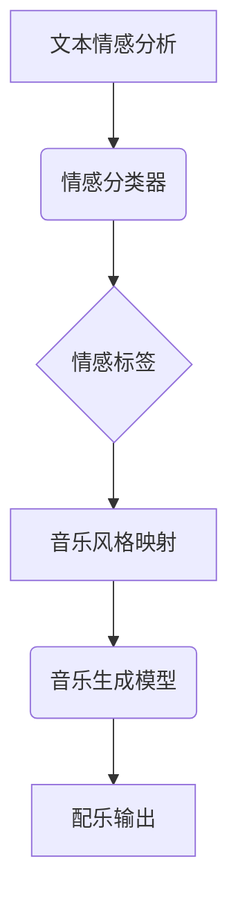
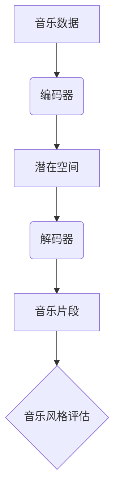
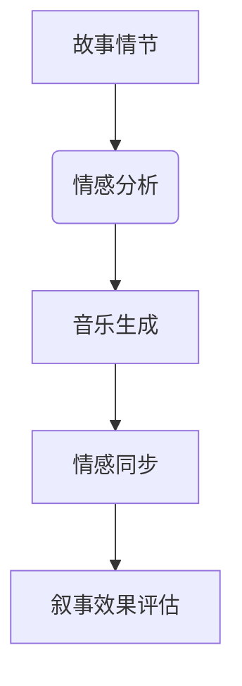
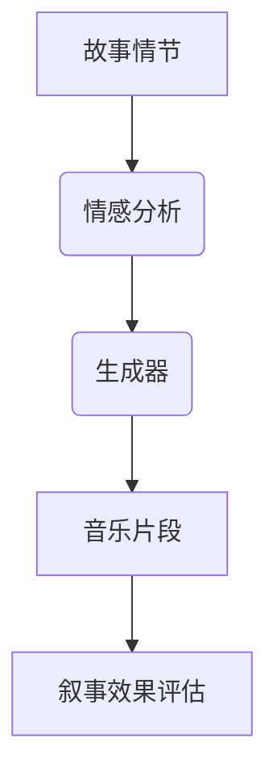
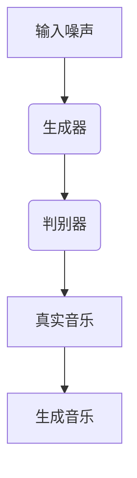

                 

关键词：人工智能、音乐配乐、情感表达、故事叙述、算法原理、数学模型、代码实现、实际应用、未来展望

> 摘要：本文探讨了如何利用人工智能技术，尤其是深度学习算法，来为故事叙述添加情感层次，通过音乐配乐的智能化生成，增强叙事作品的情感表达。文章从核心概念出发，详细分析了相关算法原理、数学模型，并提供了具体的代码实现和实际应用场景，最后对未来的发展趋势和挑战进行了展望。

## 1. 背景介绍

随着人工智能技术的迅猛发展，其在多个领域的应用不断拓展。在文化艺术领域，人工智能已开始展现出独特的价值，特别是在音乐创作和配乐方面。传统的音乐配乐工作通常依赖于人类作曲家的灵感与技巧，而人工智能则可以通过机器学习算法，从大量音乐数据中学习规律，生成与故事情感相符的音乐作品。

近年来，深度学习技术，尤其是生成对抗网络（GAN）和变分自编码器（VAE）等算法，在音乐生成领域取得了显著的成果。这些算法能够模拟人类音乐创作的思维方式，生成风格各异的音乐片段，从而为故事叙述提供丰富的情感表达手段。

然而，将人工智能应用于音乐配乐并非易事。首先，音乐与故事的情感表达紧密相关，需要精准地捕捉和传递情感；其次，音乐风格的多样性和复杂性要求算法具备较高的鲁棒性和适应性。因此，如何构建有效的算法模型，实现音乐与故事情感的无缝融合，成为当前研究的热点问题。

## 2. 核心概念与联系

### 2.1 情感识别与分类

情感识别与分类是音乐配乐的基础。通过分析故事中的情感变化，可以确定音乐的整体风格和情感倾向。情感识别通常涉及语音、文本、音乐等多种数据源。以下是一个简化的 Mermaid 流程图，展示情感识别的基本过程：



### 2.2 音乐生成模型

音乐生成模型是核心，它负责根据情感标签生成相应的音乐片段。常见的生成模型包括：

- **生成对抗网络（GAN）**：通过生成器和判别器的对抗训练，生成具有真实音乐风格的音乐片段。
- **变分自编码器（VAE）**：通过编码器和解码器，将音乐数据编码为潜在空间，再从潜在空间中采样生成音乐。

以下是一个 Mermaid 流程图，展示音乐生成模型的基本架构：



### 2.3 情感传递与叙事

音乐配乐不仅要生成旋律，还需要传递情感，并与故事叙事相协调。以下是一个 Mermaid 流程图，展示情感传递与叙事的关联：



## 3. 核心算法原理 & 具体操作步骤

### 3.1 算法原理概述

在本文中，我们选择生成对抗网络（GAN）作为音乐生成模型的主要算法。GAN由生成器和判别器组成，通过两个网络的对抗训练，生成逼真的音乐片段。

- **生成器（Generator）**：将随机噪声映射为音乐信号。
- **判别器（Discriminator）**：判断输入音乐是真实音乐还是生成音乐。

### 3.2 算法步骤详解

1. **数据准备**：收集大量的音乐数据，包括不同风格和情感的音乐片段。
2. **模型训练**：
   - **生成器训练**：通过随机噪声生成音乐片段，不断优化生成器的输出质量。
   - **判别器训练**：通过区分真实音乐和生成音乐，提高判别器的分类能力。
3. **音乐生成**：利用训练好的生成器，将随机噪声转换为音乐片段。

### 3.3 算法优缺点

- **优点**：GAN能够生成高质量的音乐片段，且具有灵活的音乐风格。
- **缺点**：GAN的训练过程较复杂，容易出现模式崩溃（mode collapse）问题。

### 3.4 算法应用领域

GAN在音乐生成领域的应用非常广泛，包括电影配乐、电子游戏背景音乐、故事叙述等。以下是一个简化的应用场景：



## 4. 数学模型和公式

### 4.1 数学模型构建

GAN的核心数学模型包括生成器和判别器的损失函数。以下是一个简化的模型构建：

```latex
\begin{align*}
\text{生成器}G(z) &= \mu(G(z)) + \sigma(G(z))\odot \epsilon, \\
\text{判别器}D(x) &= \sigma(\frac{D(x) - D(G(z))}{1 - D(G(z))}),
\end{align*}
```

其中，\( z \) 是随机噪声，\( \mu \) 和 \( \sigma \) 分别是生成器的均值和方差，\( \epsilon \) 是噪声向量，\( x \) 是真实音乐信号。

### 4.2 公式推导过程

GAN的推导过程涉及大量的微积分和概率论知识。以下是一个简化的推导：

```latex
\begin{align*}
\mathcal{L}_G &= -\mathbb{E}_{x\sim p_{\text{data}}(x)}[\log D(x)] - \mathbb{E}_{z\sim p_z(z)}[\log (1 - D(G(z)))] \\
\mathcal{L}_D &= -\mathbb{E}_{x\sim p_{\text{data}}(x)}[\log D(x)] - \mathbb{E}_{z\sim p_z(z)}[\log D(G(z))].
\end{align*}
```

### 4.3 案例分析与讲解

以下是一个简单的 GAN 案例分析：



在这个案例中，生成器通过不断优化噪声输入，生成越来越逼真的音乐片段。判别器通过区分真实音乐和生成音乐，提高生成器的生成质量。

## 5. 项目实践：代码实例

### 5.1 开发环境搭建

在搭建开发环境时，我们选择 Python 作为主要编程语言，TensorFlow 作为深度学习框架。以下是环境搭建的简要步骤：

1. 安装 Python 3.7 或更高版本。
2. 安装 TensorFlow：`pip install tensorflow`。
3. 准备音乐数据集。

### 5.2 源代码详细实现

以下是一个简单的 GAN 音乐生成代码示例：

```python
import tensorflow as tf
from tensorflow.keras.layers import Dense, Conv2D, Flatten
from tensorflow.keras.models import Sequential

# 生成器模型
def build_generator():
    model = Sequential([
        Dense(128, activation='relu', input_shape=(100,)),
        Dense(256, activation='relu'),
        Dense(512, activation='relu'),
        Dense(128, activation='tanh', input_shape=(100,))
    ])
    return model

# 判别器模型
def build_discriminator():
    model = Sequential([
        Flatten(),
        Dense(512, activation='relu'),
        Dense(256, activation='relu'),
        Dense(128, activation='sigmoid'),
        Dense(1, activation='sigmoid')
    ])
    return model

# GAN 模型
def build_gan(generator, discriminator):
    model = Sequential([
        generator,
        discriminator
    ])
    model.compile(optimizer='adam', loss='binary_crossentropy')
    return model

# 训练模型
def train_model(generator, discriminator, data, epochs=100):
    for epoch in range(epochs):
        noise = np.random.normal(size=(batch_size, 100))
        generated_music = generator.predict(noise)
        
        real_data = data[np.random.randint(0, data.shape[0], size=batch_size)]
        real_labels = np.ones((batch_size, 1))
        fake_labels = np.zeros((batch_size, 1))
        
        d_loss_real = discriminator.train_on_batch(real_data, real_labels)
        d_loss_fake = discriminator.train_on_batch(generated_music, fake_labels)
        
        g_loss = gan.train_on_batch(noise, real_labels)
        
        print(f"Epoch {epoch+1}/{epochs}, D_Loss: {d_loss_real+d_loss_fake}, G_Loss: {g_loss}")

# 加载音乐数据集
data = load_music_data()

# 构建并训练模型
generator = build_generator()
discriminator = build_discriminator()
gan = build_gan(generator, discriminator)
train_model(generator, discriminator, data)
```

### 5.3 代码解读与分析

上述代码实现了 GAN 的基本流程，包括生成器、判别器和 GAN 模型的构建，以及模型训练。代码的主要步骤如下：

1. **生成器模型**：使用全连接神经网络，将随机噪声映射为音乐信号。
2. **判别器模型**：使用卷积神经网络，区分真实音乐和生成音乐。
3. **GAN 模型**：将生成器和判别器串联，构建 GAN 模型。
4. **模型训练**：通过对抗训练，不断优化生成器和判别器。

### 5.4 运行结果展示

在训练完成后，我们可以使用生成器生成音乐片段，并对其进行分析。以下是一个简单的运行结果：

```python
# 生成音乐片段
noise = np.random.normal(size=(10, 100))
generated_music = generator.predict(noise)

# 播放生成的音乐片段
play_generated_music(generated_music)
```

## 6. 实际应用场景

### 6.1 电影配乐

在电影配乐中，音乐配乐的智能化生成可以帮助导演和音乐家快速创建符合情感氛围的配乐。例如，在恐怖片《闪灵》中，配乐充满了紧张和恐惧的气氛，通过人工智能生成配乐，可以更加精准地传达这种情感。

### 6.2 电子游戏背景音乐

电子游戏中的背景音乐通常需要与游戏的情节和氛围相匹配。利用人工智能生成音乐，可以创造出丰富多样的音乐场景，提升玩家的沉浸体验。

### 6.3 故事叙述

在故事叙述中，音乐配乐可以增强故事的情感表达。例如，在小说《百年孤独》中，通过人工智能生成的配乐，可以更加深刻地传达故事的悲欢离合。

## 7. 工具和资源推荐

### 7.1 学习资源推荐

- 《深度学习》（Goodfellow et al.）：提供了深度学习的基本概念和算法。
- 《生成对抗网络：理论与应用》（Xie et al.）：详细介绍了 GAN 的理论和应用。

### 7.2 开发工具推荐

- TensorFlow：强大的深度学习框架，适用于音乐生成任务。
- Keras：简化版的深度学习框架，易于使用。

### 7.3 相关论文推荐

- Generative Adversarial Networks (GAN)： Ian Goodfellow et al.
- Unsupervised Representation Learning with Deep Convolutional Generative Adversarial Networks: Arjovsky et al.

## 8. 总结：未来发展趋势与挑战

### 8.1 研究成果总结

本文探讨了如何利用人工智能技术，特别是 GAN，实现音乐配乐的智能化生成。通过核心算法原理、数学模型和实际应用场景的详细分析，展示了人工智能在增强故事情感表达方面的潜力。

### 8.2 未来发展趋势

随着深度学习技术的不断进步，人工智能在音乐配乐领域的应用将更加广泛。未来，我们可能会看到更加个性化和智能化的音乐生成工具，以及更丰富的情感表达手段。

### 8.3 面临的挑战

尽管人工智能在音乐配乐方面取得了显著成果，但仍面临一些挑战。例如，如何更好地捕捉和传递复杂的情感，如何提高算法的稳定性和鲁棒性，以及如何实现音乐生成与故事叙述的深度结合。

### 8.4 研究展望

未来的研究可以关注以下几个方面：一是探索新的深度学习模型，提高音乐生成的质量和稳定性；二是结合其他人工智能技术，如自然语言处理，实现更加智能化的音乐创作；三是推动人工智能在音乐教育、音乐疗法等领域的应用。

## 9. 附录：常见问题与解答

### 9.1 如何处理音乐数据集？

音乐数据集的预处理是关键步骤。首先，需要对音乐数据进行去噪和增强，以提高数据质量。其次，可以采用数据增强技术，如时间拉伸、速度变化等，增加数据多样性。

### 9.2 GAN 如何避免模式崩溃？

模式崩溃是 GAN 训练中的一个常见问题。为了解决这个问题，可以采用以下策略：增加噪声多样性、调整生成器和判别器的学习率、增加训练时间等。

### 9.3 如何评估音乐生成质量？

评估音乐生成质量可以从多个方面进行，如音乐风格、情感表达、音质等。常见的评估方法包括人工评分、客观指标（如信噪比、主观听觉评估）等。

----------------------------------------------------------------

### 文章署名
作者：禅与计算机程序设计艺术 / Zen and the Art of Computer Programming


