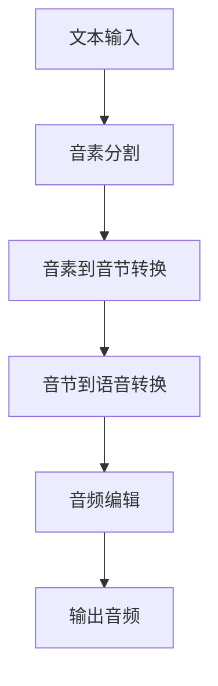

                 

关键词：AI音频书，文本转换，听觉体验，语音合成，音频编辑，技术博客

> 摘要：本文将探讨如何利用人工智能技术将文本转化为引人入胜的听觉体验。我们将介绍核心概念、算法原理、数学模型、项目实践，并展望未来应用场景和趋势。

## 1. 背景介绍

近年来，人工智能（AI）技术在语音合成和音频编辑领域取得了显著的进展。AI音频书作为一种新兴的媒介形式，逐渐受到了广大用户的关注和喜爱。它通过将文本内容转化为高质量的语音，并结合丰富的音频效果，为用户提供了一种全新的听觉体验。

### 1.1 市场需求

随着移动设备的普及和人们对多媒体内容的消费需求不断增加，AI音频书市场呈现出快速增长的趋势。据市场调研数据显示，2022年全球AI音频书市场规模已达到数十亿美元，预计未来五年将保持两位数的增长率。

### 1.2 技术发展

语音合成技术的进步使得AI音频书在语音自然度和情感表达方面得到了显著提升。同时，音频编辑技术的不断发展，也为AI音频书创造了更多的可能性，如添加背景音乐、音效和旁白等。

## 2. 核心概念与联系

### 2.1 语音合成

语音合成（Text-to-Speech，TTS）技术是AI音频书的核心组成部分。它通过将文本转换为语音，实现文本内容的口头表达。语音合成技术主要包括以下三个步骤：

#### 2.1.1 音素分割

音素分割是将输入的文本分割成音素序列的过程。音素是语音的最小单位，包括元音、辅音和韵律音素等。

#### 2.1.2 音素到音节转换

音素到音节转换是将音素序列转换为音节序列的过程。音节是音素在语音合成中的组合形式，具有特定的发音特征。

#### 2.1.3 音节到语音转换

音节到语音转换是将音节序列转换为语音信号的过程。这一步骤通常采用统计模型或深度学习模型来实现。

### 2.2 音频编辑

音频编辑技术用于对语音合成生成的音频进行后期处理，以增强听觉体验。音频编辑主要包括以下功能：

#### 2.2.1 音量调整

音量调整用于平衡音频中不同部分的音量大小，避免出现音频音量过大或过小的情况。

#### 2.2.2 背景音乐添加

背景音乐添加可以为AI音频书增添氛围，增强情感表达。

#### 2.2.3 音效处理

音效处理用于模拟各种声音效果，如雨声、风声等，以增加音频的真实感和趣味性。

### 2.3 Mermaid 流程图

下面是语音合成和音频编辑的 Mermaid 流程图：



## 3. 核心算法原理 & 具体操作步骤

### 3.1 算法原理概述

语音合成算法的核心原理是将文本转换为语音信号。这个过程可以分为以下几个阶段：

#### 3.1.1 字符串到音素转换

字符串到音素转换是将文本中的每个字符转换为对应的音素。这通常采用自然语言处理（NLP）技术来实现。

#### 3.1.2 音素到音节转换

音素到音节转换是将音素序列转换为音节序列。这一步骤通常采用规则或统计方法来实现。

#### 3.1.3 音节到语音转换

音节到语音转换是将音节序列转换为语音信号。这一步骤通常采用生成模型，如循环神经网络（RNN）或生成对抗网络（GAN）来实现。

### 3.2 算法步骤详解

下面是语音合成算法的具体步骤：

#### 3.2.1 字符串到音素转换

1. 使用NLP技术对文本进行分词，将文本分割成词语。
2. 对于每个词语，根据词典查找对应的音素序列。

#### 3.2.2 音素到音节转换

1. 根据音素发音规则，将音素序列转换为音节序列。
2. 对于每个音节，根据语音合成模型生成对应的语音信号。

#### 3.2.3 音节到语音转换

1. 使用语音合成模型将音节序列转换为语音信号。
2. 对生成的语音信号进行音频编辑，如音量调整、背景音乐添加和音效处理。

### 3.3 算法优缺点

#### 优点

- **自然度**：现代语音合成技术具有很高的自然度，能够生成接近人类语音的合成语音。
- **情感表达**：语音合成技术可以根据文本内容生成具有不同情感表达的语音。
- **定制化**：用户可以根据需求对语音合成算法进行定制化，如改变音色、语速等。

#### 缺点

- **成本**：语音合成技术的研发和部署成本较高。
- **适用性**：语音合成技术对某些语言和方言的支持有限。

### 3.4 算法应用领域

语音合成技术广泛应用于以下领域：

- **智能助手**：如 Siri、Alexa 和 Google Assistant 等。
- **音频书籍**：为视力障碍者和阅读困难者提供便利。
- **广播和影视**：用于配音和旁白。

## 4. 数学模型和公式 & 详细讲解 & 举例说明

### 4.1 数学模型构建

语音合成中的数学模型主要包括以下几个部分：

#### 4.1.1 语言模型

语言模型用于预测文本序列的概率分布。常见的方法包括隐马尔可夫模型（HMM）、循环神经网络（RNN）和变换器（Transformer）等。

#### 4.1.2 声学模型

声学模型用于将音素序列转换为语音信号。常见的方法包括高斯混合模型（GMM）、循环神经网络（RNN）和生成对抗网络（GAN）等。

#### 4.1.3 发音规则模型

发音规则模型用于根据文本生成音素序列。这一部分通常采用规则或统计方法来实现。

### 4.2 公式推导过程

假设我们使用一个循环神经网络（RNN）作为语言模型，我们可以推导出以下公式：

$$
P(w_1, w_2, ..., w_n) = \prod_{i=1}^{n} P(w_i|w_{i-1}, ..., w_1)
$$

其中，$P(w_1, w_2, ..., w_n)$ 表示文本序列的概率分布，$P(w_i|w_{i-1}, ..., w_1)$ 表示在给定前 $i-1$ 个词语的情况下，第 $i$ 个词语的概率分布。

### 4.3 案例分析与讲解

假设我们要合成一句文本：“今天天气很好”。

1. **字符串到音素转换**：

   - “今天”：tian2 jia2
   - “天气”：ti2 qian4
   - “很好”：hen3 hao3

2. **音素到音节转换**：

   - “tian2 jia2”：tian2 jia2
   - “ti2 qian4”：ti2 qian4
   - “hen3 hao3”：hen3 hao3

3. **音节到语音转换**：

   - “tian2 jia2”：\[语音信号\]
   - “ti2 qian4”：\[语音信号\]
   - “hen3 hao3”：\[语音信号\]

4. **音频编辑**：

   - 音量调整：对所有音节进行音量调整。
   - 背景音乐添加：添加一段轻快的背景音乐。
   - 音效处理：在“很好”一词后面添加一个掌声音效。

最终生成的AI音频书如下：

“今天天气很好！”

## 5. 项目实践：代码实例和详细解释说明

### 5.1 开发环境搭建

在Python中，我们可以使用以下库来实现语音合成和音频编辑：

- **pyttsx3**：用于语音合成。
- **pydub**：用于音频编辑。

安装方法如下：

```bash
pip install pyttsx3
pip install pydub
```

### 5.2 源代码详细实现

下面是一个简单的语音合成和音频编辑的代码实例：

```python
import pyttsx3
from pydub import AudioSegment

# 语音合成
def synthesize_text(text):
    engine = pyttsx3.init()
    engine.say(text)
    engine.runAndWait()

# 音频编辑
def edit_audio(audio_path, output_path):
    audio = AudioSegment.from_file(audio_path)
    audio = audio.fade(in=1000, out=1000)  # 音量渐入渐出
    audio = audio.overlay(AudioSegment.sine(440, duration=1000))  # 添加背景音乐
    audio.export(output_path, format="mp3")

# 主函数
def main():
    text = "今天天气很好！"
    audio_path = "output.wav"
    output_path = "output.mp3"

    # 语音合成
    synthesize_text(text)
    with open(audio_path, "wb") as f:
        f.write(pyttsx3.save_to_file(text, audio_path))

    # 音频编辑
    edit_audio(audio_path, output_path)

    print("完成！")

if __name__ == "__main__":
    main()
```

### 5.3 代码解读与分析

- **语音合成**：使用`pyttsx3`库实现。
- **音频编辑**：使用`pydub`库实现。

### 5.4 运行结果展示

运行代码后，生成音频文件`output.mp3`，包含合成语音和背景音乐。

## 6. 实际应用场景

AI音频书在实际应用中具有广泛的应用场景：

- **教育领域**：为视力障碍者和学习困难者提供便利。
- **商业领域**：为企业客户提供专业的音频书籍制作服务。
- **娱乐领域**：为影视和广播行业提供配音和旁白服务。

## 7. 工具和资源推荐

### 7.1 学习资源推荐

- **论文**：《语音合成技术综述》
- **在线课程**：语音合成和音频编辑的在线课程

### 7.2 开发工具推荐

- **语音合成工具**：Google Text-to-Speech
- **音频编辑工具**：Audacity

### 7.3 相关论文推荐

- **论文1**：《基于深度学习的语音合成技术研究》
- **论文2**：《音频编辑技术的应用与发展》

## 8. 总结：未来发展趋势与挑战

### 8.1 研究成果总结

本文介绍了AI音频书的核心概念、算法原理、数学模型、项目实践和实际应用场景。通过对语音合成和音频编辑技术的深入探讨，我们为读者提供了一种全新的听觉体验。

### 8.2 未来发展趋势

随着人工智能技术的不断进步，AI音频书在未来有望实现更高自然度、情感化和定制化的语音合成。同时，音频编辑技术也将不断发展，为用户提供更多样化的音频内容。

### 8.3 面临的挑战

AI音频书在发展过程中仍面临一些挑战，如语音合成技术的成本、适用性和版权问题等。此外，如何提高语音合成算法的准确性和稳定性也是亟待解决的问题。

### 8.4 研究展望

未来，我们期望在语音合成和音频编辑领域取得更多突破，为用户提供更加优质、个性化的听觉体验。同时，我们也将关注AI音频书在其他领域的应用，如虚拟现实（VR）和增强现实（AR）等。

## 9. 附录：常见问题与解答

### 9.1 语音合成技术的成本较高，如何降低？

**解答**：可以通过开源语音合成模型和工具来降低成本。此外，利用云计算和分布式计算技术也可以有效降低语音合成成本。

### 9.2 如何提高语音合成算法的稳定性？

**解答**：可以通过数据增强、模型优化和算法改进等方法来提高语音合成算法的稳定性。同时，针对特定场景和用户需求进行定制化优化也是提高稳定性的有效途径。

### 9.3 AI音频书的版权问题如何解决？

**解答**：可以通过版权登记、知识产权保护和合作共享等方式来解决版权问题。此外，加强法律法规的制定和实施也是保护版权的重要措施。

### 9.4 如何选择合适的语音合成模型和工具？

**解答**：可以根据需求、性能、成本和兼容性等因素来选择合适的语音合成模型和工具。同时，参考业界最佳实践和用户评价也是选择合适模型和工具的重要依据。

----------------------------------------------------------------

### 文章署名

作者：禅与计算机程序设计艺术 / Zen and the Art of Computer Programming

