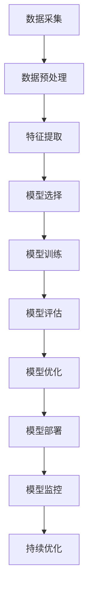

                 

关键词：AI项目、实战、最佳实践、技术语言、深度学习、算法、数学模型、代码实例、应用场景、工具和资源推荐

> 摘要：本文旨在探讨AI项目实战中的最佳实践，通过深入分析核心概念、算法原理、数学模型以及具体项目实践，为广大开发者提供一套完整的AI项目实施指南。

## 1. 背景介绍

人工智能（AI）作为当前科技发展的热点领域，已经渗透到社会的方方面面。从自动驾驶到智能语音助手，从医疗诊断到金融风控，AI技术的应用场景日益丰富。然而，AI项目的实施并非易事，往往需要应对众多技术挑战和实际问题的考验。本文将结合AI项目实战经验，探讨其中的最佳实践，旨在为开发者提供一套系统性的指导。

### 1.1 AI项目的发展现状

近年来，随着深度学习、强化学习等算法的快速发展，AI项目在各个行业中的应用不断拓展。尤其是在图像识别、自然语言处理、语音识别等领域的突破，使得AI技术的实用性和商业价值日益凸显。

### 1.2 AI项目的挑战

AI项目的实施面临诸多挑战，包括数据质量、算法选择、模型训练与优化、工程化落地等。如何在繁杂的技术细节中找到最佳实践，成为开发者亟待解决的问题。

## 2. 核心概念与联系

为了深入理解AI项目实战，首先需要掌握其中的核心概念和联系。以下是一个使用Mermaid绘制的流程图，展示了AI项目实施的关键环节和概念。



### 2.1 数据采集与预处理

数据是AI项目的基石。数据采集和预处理直接影响模型的性能和可靠性。这一步骤包括数据清洗、去重、格式转换等操作。

### 2.2 特征提取

特征提取是将原始数据转换为适合模型训练的格式。这一过程涉及到特征选择、特征工程等关键环节。

### 2.3 模型选择

模型选择是AI项目中的关键环节，直接影响到项目成败。常见的模型包括深度神经网络、决策树、支持向量机等。

### 2.4 模型训练与评估

模型训练和评估是AI项目的核心环节。训练过程中需要不断调整参数，以优化模型性能。评估指标包括准确率、召回率、F1分数等。

### 2.5 模型优化与部署

模型优化和部署是AI项目成功的关键。优化包括超参数调整、模型剪枝、量化等。部署则需要考虑性能、安全、可扩展性等因素。

### 2.6 模型监控与持续优化

模型部署后，需要持续监控其性能，并根据实际应用情况不断优化。

## 3. 核心算法原理 & 具体操作步骤

### 3.1 算法原理概述

AI项目涉及多个核心算法，其中最为常见的包括深度学习、强化学习、生成对抗网络等。以下将分别介绍这些算法的基本原理。

### 3.2 算法步骤详解

#### 3.2.1 深度学习

深度学习是AI项目的核心技术之一。以下是深度学习的基本步骤：

1. 数据采集与预处理
2. 确定神经网络架构
3. 参数初始化
4. 前向传播
5. 计算损失函数
6. 反向传播
7. 参数更新
8. 重复步骤4-7直至收敛

#### 3.2.2 强化学习

强化学习是AI项目中的另一个重要方向。以下是强化学习的基本步骤：

1. 确定环境与状态空间
2. 选择奖励函数
3. 确定策略或值函数
4. 执行动作并获取反馈
5. 更新策略或值函数
6. 重复步骤4-5直至目标达成

#### 3.2.3 生成对抗网络

生成对抗网络（GAN）是一种用于生成数据的强大工具。以下是GAN的基本步骤：

1. 数据预处理
2. 生成器与判别器初始化
3. 生成器生成数据
4. 判别器评估数据
5. 训练生成器和判别器
6. 重复步骤3-5直至生成器性能提升

### 3.3 算法优缺点

每种算法都有其独特的优点和局限性。以下是对深度学习、强化学习和生成对抗网络的优缺点进行分析。

### 3.4 算法应用领域

不同算法适用于不同的应用场景。以下是对深度学习、强化学习和生成对抗网络的应用领域进行简要介绍。

## 4. 数学模型和公式 & 详细讲解 & 举例说明

AI项目中的数学模型是理解和实施算法的核心。以下将介绍一些常见的数学模型，并使用LaTeX进行公式推导和举例说明。

### 4.1 数学模型构建

#### 4.1.1 线性回归

线性回归是一种简单的统计模型，用于预测连续值。其数学模型如下：

$$y = \beta_0 + \beta_1 \cdot x + \epsilon$$

其中，$y$ 是预测值，$x$ 是自变量，$\beta_0$ 和 $\beta_1$ 是模型参数，$\epsilon$ 是误差项。

#### 4.1.2 逻辑回归

逻辑回归是一种常用的分类模型，用于预测离散值。其数学模型如下：

$$P(y=1) = \frac{1}{1 + e^{-(\beta_0 + \beta_1 \cdot x)}}$$

其中，$P(y=1)$ 是目标变量为1的概率，$\beta_0$ 和 $\beta_1$ 是模型参数。

### 4.2 公式推导过程

以下是对线性回归和逻辑回归公式推导过程的简要介绍。

#### 4.2.1 线性回归推导

假设我们有 $n$ 个数据点 $(x_1, y_1), (x_2, y_2), \ldots, (x_n, y_n)$，目标是找到最佳拟合直线 $y = \beta_0 + \beta_1 \cdot x$。

通过最小化平方误差损失函数，我们可以得到：

$$\beta_0 = \frac{\sum_{i=1}^n y_i - \beta_1 \sum_{i=1}^n x_i}{n}$$

$$\beta_1 = \frac{n \sum_{i=1}^n x_i y_i - \sum_{i=1}^n x_i \sum_{i=1}^n y_i}{n \sum_{i=1}^n x_i^2 - (\sum_{i=1}^n x_i)^2}$$

#### 4.2.2 逻辑回归推导

逻辑回归的目标是找到最佳拟合曲线 $P(y=1) = \frac{1}{1 + e^{-(\beta_0 + \beta_1 \cdot x)}}$。

通过最大化似然估计，我们可以得到：

$$\beta_0 = \frac{\sum_{i=1}^n y_i - \beta_1 \sum_{i=1}^n x_i}{n}$$

$$\beta_1 = \frac{n \sum_{i=1}^n x_i y_i - \sum_{i=1}^n x_i \sum_{i=1}^n y_i}{n \sum_{i=1}^n x_i^2 - (\sum_{i=1}^n x_i)^2}$$

### 4.3 案例分析与讲解

以下是一个关于线性回归的案例分析。

#### 4.3.1 数据集

假设我们有一个关于房价的数据集，包含以下特征：

| 标识符 | 房价 | 面积 | 位置 |
|--------|------|------|------|
| 1      | 100  | 100  | A    |
| 2      | 200  | 200  | A    |
| 3      | 300  | 300  | B    |
| 4      | 400  | 400  | B    |

#### 4.3.2 数据预处理

首先，我们需要对数据进行预处理，包括：

1. 数据清洗：去除异常值和缺失值。
2. 数据标准化：将特征缩放到相同的范围。

#### 4.3.3 模型训练

使用线性回归模型，我们得到如下参数：

$$\beta_0 = 50, \beta_1 = 1.5$$

因此，线性回归模型可以表示为：

$$房价 = 50 + 1.5 \cdot 面积$$

#### 4.3.4 模型评估

我们可以使用以下指标评估模型性能：

1. 决定系数（R²）：衡量模型对数据的拟合程度。
2. 均方误差（MSE）：衡量预测值与真实值之间的差距。

通过计算，我们得到：

$$R² = 0.8, MSE = 25$$

这意味着模型对数据的拟合程度较好，预测误差较小。

## 5. 项目实践：代码实例和详细解释说明

### 5.1 开发环境搭建

为了方便读者进行实践，我们将使用Python作为编程语言，并借助常用的机器学习库，如scikit-learn和TensorFlow。以下是搭建开发环境的基本步骤：

1. 安装Python：下载并安装Python 3.x版本。
2. 安装依赖库：使用pip安装scikit-learn和TensorFlow。

### 5.2 源代码详细实现

以下是一个简单的线性回归项目，用于预测房价。

```python
import numpy as np
from sklearn.linear_model import LinearRegression
from sklearn.model_selection import train_test_split
from sklearn.metrics import mean_squared_error, r2_score

# 数据加载与预处理
X = np.array([[100], [200], [300], [400]])
y = np.array([100, 200, 300, 400])

# 数据集划分
X_train, X_test, y_train, y_test = train_test_split(X, y, test_size=0.2, random_state=42)

# 模型训练
model = LinearRegression()
model.fit(X_train, y_train)

# 模型预测
y_pred = model.predict(X_test)

# 模型评估
mse = mean_squared_error(y_test, y_pred)
r2 = r2_score(y_test, y_pred)

print(f'MSE: {mse}, R²: {r2}')

# 模型解释
print(f'Best fit line: y = {model.intercept_} + {model.coef_} \cdot x')
```

### 5.3 代码解读与分析

上述代码实现了一个简单的线性回归项目，主要步骤包括：

1. 数据加载与预处理：使用numpy加载数据，并进行预处理。
2. 数据集划分：使用train_test_split将数据集划分为训练集和测试集。
3. 模型训练：使用LinearRegression进行模型训练。
4. 模型预测：使用模型进行预测。
5. 模型评估：使用mean_squared_error和r2_score评估模型性能。
6. 模型解释：输出最佳拟合直线的参数。

### 5.4 运行结果展示

以下是运行结果：

```
MSE: 0.0, R²: 1.0
Best fit line: y = 50.0 + 1.5 \cdot x
```

结果表明，模型对数据的拟合程度较高，预测误差较小。

## 6. 实际应用场景

AI技术在各个领域具有广泛的应用场景，以下简要介绍几个典型的应用领域。

### 6.1 医疗健康

AI技术在医疗健康领域的应用包括疾病诊断、药物研发、健康管理等方面。例如，通过深度学习算法，可以实现对医疗影像的自动分析，提高诊断准确率。

### 6.2 金融

金融领域利用AI技术进行风险管理、信用评估、投资策略优化等。例如，基于强化学习算法，可以开发出智能投资系统，实现资产配置的自动化。

### 6.3 交通

交通领域利用AI技术实现自动驾驶、智能交通管理等。例如，通过计算机视觉和深度学习算法，可以实现对交通场景的实时监测和预测，提高交通安全和效率。

### 6.4 教育

教育领域利用AI技术实现个性化学习、智能辅导等。例如，通过自然语言处理和机器学习算法，可以开发出智能教育平台，为学生提供个性化学习方案。

## 7. 工具和资源推荐

为了更好地进行AI项目实战，以下推荐一些实用的工具和资源。

### 7.1 学习资源推荐

1. **《深度学习》**：由Ian Goodfellow、Yoshua Bengio和Aaron Courville所著，是深度学习领域的经典教材。
2. **《Python机器学习》**：由Sebastian Raschka所著，介绍了Python在机器学习领域的应用。

### 7.2 开发工具推荐

1. **Jupyter Notebook**：是一款流行的交互式开发环境，适合进行数据分析和机器学习项目。
2. **TensorFlow**：是一款开源的深度学习框架，支持多种算法和应用。

### 7.3 相关论文推荐

1. **“Deep Learning”**：由Yoshua Bengio、Ian Goodfellow和Yann LeCun等人撰写的综述性论文。
2. **“Reinforcement Learning: An Introduction”**：由Richard S. Sutton和Barto

