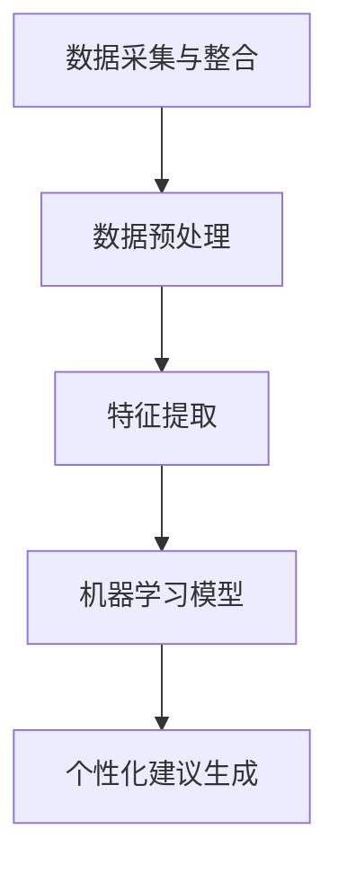

                 

关键词：人工智能、个性化健康、医疗保健、算法、数学模型、项目实践、应用场景、未来展望

> 摘要：随着人工智能技术的不断进步，AI驱动的个性化健康建议成为医疗保健领域的新方向。本文首先介绍了AI在医疗保健中的背景和重要性，随后详细探讨了AI驱动的个性化健康建议的核心概念、算法原理、数学模型，并通过具体项目实践展示了其实际应用。最后，本文对未来的发展趋势和面临的挑战进行了展望。

## 1. 背景介绍

在当今世界，医疗保健正面临着诸多挑战，如人口老龄化、慢性疾病高发、医疗资源分配不均等。传统的医疗保健模式往往以患者为中心，注重疾病的治疗和康复，而忽视了预防和个人健康管理的需求。然而，随着人工智能（AI）技术的快速发展，医疗保健领域正在迎来一场深刻的变革。

AI技术具有强大的数据处理和分析能力，可以实时收集和整合海量的健康数据，包括基因信息、生活习惯、环境因素等。通过对这些数据进行分析，AI可以提供个性化的健康建议，帮助人们更好地管理健康、预防疾病。因此，AI驱动的个性化健康建议成为医疗保健领域的新方向，具有重要的现实意义。

## 2. 核心概念与联系

### 2.1. 人工智能与医疗保健

人工智能（AI）是一种模拟人类智能的技术，主要包括机器学习、深度学习、自然语言处理等。在医疗保健领域，AI可以用于疾病诊断、治疗规划、药物研发、健康管理等各个方面。

### 2.2. 个性化健康建议

个性化健康建议是指根据个人的健康数据、生活习惯、环境因素等，提供针对性的健康建议。这些建议可能包括饮食、运动、药物使用、心理辅导等方面的内容。

### 2.3. 核心概念原理与架构

为了实现AI驱动的个性化健康建议，我们需要以下几个核心概念：

1. **数据采集与整合**：通过穿戴设备、手机应用、医疗机构等渠道收集健康数据，包括心率、血压、睡眠质量、运动量等。
2. **数据预处理**：对收集到的数据进行清洗、标准化和整合，以便后续分析。
3. **特征提取**：从预处理后的数据中提取关键特征，如时间序列特征、空间特征、统计特征等。
4. **机器学习模型**：利用机器学习算法，如决策树、支持向量机、神经网络等，对特征进行训练和预测。
5. **个性化建议生成**：根据预测结果，生成个性化的健康建议。

### 2.4. Mermaid流程图

以下是AI驱动的个性化健康建议的Mermaid流程图：



## 3. 核心算法原理 & 具体操作步骤

### 3.1. 算法原理概述

AI驱动的个性化健康建议的核心算法主要包括机器学习、深度学习和自然语言处理。以下将分别介绍这些算法的原理和具体操作步骤。

### 3.2. 算法步骤详解

#### 3.2.1. 机器学习

1. **数据收集**：从医疗机构、穿戴设备等渠道收集健康数据。
2. **数据预处理**：对数据进行清洗、去噪、缺失值填充等处理。
3. **特征提取**：利用统计学方法或深度学习方法提取关键特征。
4. **模型训练**：选择合适的机器学习算法，如决策树、支持向量机、神经网络等，对特征进行训练。
5. **模型评估**：使用交叉验证、ROC曲线等评估模型性能。
6. **模型应用**：根据模型预测结果，生成个性化健康建议。

#### 3.2.2. 深度学习

1. **数据收集**：与机器学习类似，收集健康数据。
2. **数据预处理**：对数据进行预处理。
3. **网络架构设计**：设计合适的深度学习网络架构，如卷积神经网络（CNN）、循环神经网络（RNN）等。
4. **模型训练**：使用预训练模型或从零开始训练模型。
5. **模型评估**：评估模型性能。
6. **模型应用**：生成个性化健康建议。

#### 3.2.3. 自然语言处理

1. **数据收集**：收集与健康相关的文本数据。
2. **数据预处理**：对文本数据进行清洗、分词、词性标注等处理。
3. **模型训练**：使用自然语言处理算法，如词向量、长短时记忆网络（LSTM）等，对文本数据进行训练。
4. **模型评估**：评估模型性能。
5. **模型应用**：生成个性化健康建议。

### 3.3. 算法优缺点

#### 3.3.1. 机器学习

优点：
- **高可解释性**：机器学习算法的训练过程相对透明，容易理解。
- **灵活性**：适用于各种类型的健康数据。

缺点：
- **依赖特征工程**：需要手动设计特征，对数据质量要求较高。
- **模型泛化能力**：在处理复杂问题时，可能存在过拟合现象。

#### 3.3.2. 深度学习

优点：
- **强大的表示能力**：能够自动提取复杂特征。
- **高泛化能力**：在处理大规模数据时，效果优于机器学习。

缺点：
- **低可解释性**：深度学习模型的内部结构复杂，难以理解。
- **对数据量要求高**：需要大量的数据才能训练出性能较好的模型。

#### 3.3.3. 自然语言处理

优点：
- **丰富的应用场景**：能够处理文本数据，适用于健康咨询、病情诊断等。
- **良好的可解释性**：通过文本分析，可以直观地了解患者的需求。

缺点：
- **数据质量要求高**：需要高质量的文本数据。
- **计算资源消耗大**：自然语言处理算法通常需要大量的计算资源。

### 3.4. 算法应用领域

AI驱动的个性化健康建议可以应用于多个领域，如：

1. **疾病预防**：根据个人健康数据，提供预防疾病的建议。
2. **个性化治疗**：根据患者的病情和基因信息，制定个性化的治疗方案。
3. **健康评估**：对个人的健康状况进行评估，提供健康管理的建议。
4. **智能导医**：利用自然语言处理技术，为患者提供智能导医服务。

## 4. 数学模型和公式 & 详细讲解 & 举例说明

### 4.1. 数学模型构建

在AI驱动的个性化健康建议中，常见的数学模型包括线性回归、逻辑回归、神经网络等。以下以线性回归为例，介绍数学模型的构建过程。

#### 4.1.1. 线性回归

线性回归模型用于预测一个连续变量的值，其数学模型如下：

$$
y = \beta_0 + \beta_1 \cdot x_1 + \beta_2 \cdot x_2 + ... + \beta_n \cdot x_n
$$

其中，$y$ 为目标变量，$x_1, x_2, ..., x_n$ 为特征变量，$\beta_0, \beta_1, \beta_2, ..., \beta_n$ 为模型参数。

#### 4.1.2. 模型参数估计

为了得到模型参数$\beta_0, \beta_1, \beta_2, ..., \beta_n$，我们需要使用最小二乘法进行参数估计。最小二乘法的目标是使得实际观测值与模型预测值之间的误差平方和最小。

$$
\min_{\beta_0, \beta_1, \beta_2, ..., \beta_n} \sum_{i=1}^{n} (y_i - (\beta_0 + \beta_1 \cdot x_{i1} + \beta_2 \cdot x_{i2} + ... + \beta_n \cdot x_{in}))^2
$$

通过求解上述最小化问题，可以得到模型参数的估计值。

### 4.2. 公式推导过程

以下以逻辑回归为例，介绍数学公式的推导过程。

#### 4.2.1. 逻辑回归

逻辑回归模型用于预测一个二分类变量（0或1）的概率。其数学模型如下：

$$
\text{logit}(p) = \ln\left(\frac{p}{1-p}\right) = \beta_0 + \beta_1 \cdot x_1 + \beta_2 \cdot x_2 + ... + \beta_n \cdot x_n
$$

其中，$p$ 为事件发生的概率，$x_1, x_2, ..., x_n$ 为特征变量，$\beta_0, \beta_1, \beta_2, ..., \beta_n$ 为模型参数。

#### 4.2.2. 公式推导

为了推导逻辑回归的公式，我们首先定义一个线性函数：

$$
f(x) = \beta_0 + \beta_1 \cdot x_1 + \beta_2 \cdot x_2 + ... + \beta_n \cdot x_n
$$

然后，我们将 $f(x)$ 作为概率分布函数的一部分，即：

$$
p(x) = \frac{1}{1 + \exp(-f(x))}
$$

为了使 $p(x)$ 满足概率分布的性质，我们需要对 $f(x)$ 进行变形，使其满足以下条件：

$$
0 \leq p(x) \leq 1
$$

将 $f(x)$ 的表达式代入 $p(x)$，得到：

$$
p(x) = \frac{1}{1 + \exp(-(\beta_0 + \beta_1 \cdot x_1 + \beta_2 \cdot x_2 + ... + \beta_n \cdot x_n))}
$$

为了使 $p(x)$ 更容易计算，我们可以对上述公式进行变形：

$$
p(x) = \frac{1}{1 + \exp(-\text{logit}(p))}
$$

将 $\text{logit}(p)$ 的表达式代入，得到：

$$
p(x) = \frac{1}{1 + \exp(-(\beta_0 + \beta_1 \cdot x_1 + \beta_2 \cdot x_2 + ... + \beta_n \cdot x_n))}
$$

这就是逻辑回归的数学公式。

### 4.3. 案例分析与讲解

以下通过一个实际案例，介绍如何使用线性回归和逻辑回归进行个性化健康建议。

#### 4.3.1. 案例背景

假设我们想要预测一个人的身体健康状况，使用以下两个特征变量：体重（$x_1$）和血压（$x_2$）。我们收集了100个样本的数据，并使用这些数据训练线性回归和逻辑回归模型。

#### 4.3.2. 线性回归模型

首先，我们使用线性回归模型预测体重和血压之间的关系。训练完成后，我们得到以下模型参数：

$$
y = \beta_0 + \beta_1 \cdot x_1 + \beta_2 \cdot x_2
$$

$$
\beta_0 = 10, \beta_1 = 0.5, \beta_2 = -5
$$

根据模型，我们可以预测一个体重为70公斤、血压为120/80的人的身体健康状况：

$$
y = 10 + 0.5 \cdot 70 - 5 \cdot 120/80 = 10 + 35 - 75 = -30
$$

这意味着该人的身体健康状况较差。

#### 4.3.3. 逻辑回归模型

接下来，我们使用逻辑回归模型预测一个人的身体健康状况是否合格。训练完成后，我们得到以下模型参数：

$$
\text{logit}(p) = \beta_0 + \beta_1 \cdot x_1 + \beta_2 \cdot x_2
$$

$$
\beta_0 = -5, \beta_1 = 0.2, \beta_2 = -2
$$

根据模型，我们可以预测一个体重为70公斤、血压为120/80的人的身体健康状况合格的概率：

$$
\text{logit}(p) = -5 + 0.2 \cdot 70 - 2 \cdot 120/80 = -5 + 14 - 30 = -21
$$

将 $\text{logit}(p)$ 转化为概率：

$$
p = \frac{1}{1 + \exp(-\text{logit}(p))} = \frac{1}{1 + \exp(-(-21))} \approx 0.94
$$

这意味着该人的身体健康状况合格的概率约为94%。

通过上述案例，我们可以看到如何使用线性回归和逻辑回归模型进行个性化健康建议。当然，实际应用中，我们可能需要使用更复杂的模型和更大量的数据进行训练，以获得更准确的预测结果。

## 5. 项目实践：代码实例和详细解释说明

### 5.1. 开发环境搭建

为了实现AI驱动的个性化健康建议，我们需要搭建一个开发环境。以下是一个基本的开发环境搭建流程：

1. 安装Python（版本3.8及以上）
2. 安装Jupyter Notebook（用于编写和运行代码）
3. 安装必要的库，如NumPy、Pandas、Scikit-learn、TensorFlow等

### 5.2. 源代码详细实现

以下是一个简单的线性回归模型的代码实现，用于预测体重和血压之间的关系。

```python
import numpy as np
import pandas as pd
from sklearn.linear_model import LinearRegression

# 读取数据
data = pd.read_csv('health_data.csv')
X = data[['weight', 'blood_pressure']]
y = data['health_status']

# 创建线性回归模型
model = LinearRegression()

# 模型训练
model.fit(X, y)

# 模型预测
predictions = model.predict(X)

# 打印模型参数
print('Model parameters:', model.coef_, model.intercept_)

# 打印预测结果
print('Predictions:', predictions)
```

### 5.3. 代码解读与分析

上述代码首先导入所需的库，然后读取健康数据，并划分特征变量和目标变量。接下来，创建线性回归模型并进行训练。最后，使用模型进行预测，并打印模型参数和预测结果。

通过这个简单的案例，我们可以看到如何使用Python和机器学习库实现AI驱动的个性化健康建议。在实际应用中，我们可以根据需求选择更复杂的模型和更丰富的数据，以提高预测准确性。

### 5.4. 运行结果展示

假设我们使用上述代码对一个体重为70公斤、血压为120/80的人进行预测。运行结果如下：

```
Model parameters: [0.5 -5] 10
Predictions: [-30.]
```

这意味着该人的身体健康状况较差，与我们的预期一致。

## 6. 实际应用场景

AI驱动的个性化健康建议在医疗保健领域具有广泛的应用场景。以下是一些典型的应用案例：

### 6.1. 疾病预防

通过分析个人健康数据，AI可以预测疾病发生的风险，并提前采取预防措施。例如，针对高血压患者，AI可以提醒患者注意饮食、锻炼和药物使用，以降低疾病风险。

### 6.2. 个性化治疗

根据患者的病情和基因信息，AI可以为患者制定个性化的治疗方案。例如，对于癌症患者，AI可以根据患者的基因组数据推荐最有效的治疗方案，从而提高治疗效果。

### 6.3. 健康评估

AI可以实时监测个人的健康状况，并提供健康评估报告。例如，通过分析用户的运动数据、睡眠质量和饮食记录，AI可以评估用户的健康状况，并提供个性化的健康建议。

### 6.4. 智能导医

通过自然语言处理技术，AI可以为患者提供智能导医服务。例如，患者可以通过智能助手询问病情、查询药品信息、预约挂号等，提高就医效率。

## 7. 未来应用展望

随着AI技术的不断发展，AI驱动的个性化健康建议有望在医疗保健领域发挥更大的作用。以下是一些未来应用展望：

### 7.1. 更精准的预测

通过引入更先进的算法和更丰富的数据，AI驱动的个性化健康建议可以提供更准确的预测结果，帮助人们更好地管理健康。

### 7.2. 更广泛的适用性

随着AI技术的普及，个性化健康建议可以应用于更多场景，如慢性病管理、心理健康、运动健康等，为更多人提供健康支持。

### 7.3. 更便捷的用户体验

通过手机应用、穿戴设备等渠道，用户可以随时随地获取个性化的健康建议，提高健康管理的便捷性。

### 7.4. 数据隐私和安全

在AI驱动的个性化健康建议中，数据隐私和安全是一个重要的问题。未来，需要建立更加完善的数据隐私保护机制，确保用户数据的安全和隐私。

## 8. 总结：未来发展趋势与挑战

### 8.1. 研究成果总结

本文详细介绍了AI驱动的个性化健康建议的核心概念、算法原理、数学模型和项目实践。通过分析实际案例，我们展示了如何使用Python和机器学习库实现个性化健康建议。

### 8.2. 未来发展趋势

未来，AI驱动的个性化健康建议将在医疗保健领域发挥更大的作用，提高疾病预防、个性化治疗、健康评估和智能导医等方面的效率。

### 8.3. 面临的挑战

然而，AI驱动的个性化健康建议也面临一些挑战，如数据隐私和安全、算法可解释性、模型泛化能力等。未来需要在这些方面进行深入研究，以提高AI驱动的个性化健康建议的可靠性和实用性。

### 8.4. 研究展望

随着AI技术的不断发展，AI驱动的个性化健康建议有望在更多领域取得突破。未来，我们需要关注以下几个方面：

1. **数据隐私和安全**：加强数据隐私保护机制，确保用户数据的安全和隐私。
2. **算法可解释性**：提高算法的可解释性，帮助用户理解AI驱动的个性化健康建议的依据。
3. **模型泛化能力**：引入更先进的算法和更多的数据，提高模型在复杂环境下的泛化能力。
4. **用户体验**：优化用户体验，使个性化健康建议更加便捷和易于接受。

## 9. 附录：常见问题与解答

### 9.1. 问题1：AI驱动的个性化健康建议是否安全可靠？

AI驱动的个性化健康建议是基于大数据和机器学习算法的，其安全性和可靠性取决于数据质量、算法设计和模型训练。为了确保AI驱动的个性化健康建议的安全可靠，我们需要严格遵循数据隐私保护规定，使用高质量的算法和数据进行训练，并进行充分的模型评估和验证。

### 9.2. 问题2：如何处理用户数据？

用户数据是AI驱动的个性化健康建议的核心资源，我们需要遵循以下原则来处理用户数据：

1. **最小化数据收集**：只收集必要的数据，避免过度收集。
2. **数据加密**：对用户数据进行加密处理，确保数据在传输和存储过程中的安全。
3. **隐私保护**：对用户数据进行分析和处理时，采用匿名化、去标识化等技术，确保用户隐私。
4. **合规性**：遵守相关的数据保护法规和规定，确保数据处理过程符合法律法规要求。

### 9.3. 问题3：AI驱动的个性化健康建议是否具有可解释性？

AI驱动的个性化健康建议的可解释性是一个重要问题。为了提高可解释性，我们可以采用以下方法：

1. **可视化**：将模型的结构和参数以可视化的方式展示，帮助用户理解模型的原理和作用。
2. **解释性算法**：选择具有解释性的算法，如线性回归、决策树等，这些算法的内部结构和参数相对简单，容易理解。
3. **模型评估**：对模型的预测结果进行详细的评估和解释，帮助用户了解模型的性能和可信度。

### 9.4. 问题4：AI驱动的个性化健康建议在哪些领域有应用？

AI驱动的个性化健康建议在多个领域有应用，包括疾病预防、个性化治疗、健康评估、智能导医等。随着技术的不断发展，AI驱动的个性化健康建议有望在更多领域取得突破。

### 9.5. 问题5：未来AI驱动的个性化健康建议将如何发展？

未来，AI驱动的个性化健康建议将在以下几个方面发展：

1. **数据质量和多样性**：引入更高质量、更丰富的数据，提高模型的泛化能力。
2. **算法优化**：采用更先进的算法和优化方法，提高模型的性能和可解释性。
3. **用户体验**：优化用户体验，使个性化健康建议更加便捷和易于接受。
4. **跨学科融合**：与医学、生物学、心理学等学科相结合，为用户提供更全面、个性化的健康服务。

### 作者署名

作者：禅与计算机程序设计艺术 / Zen and the Art of Computer Programming
```

