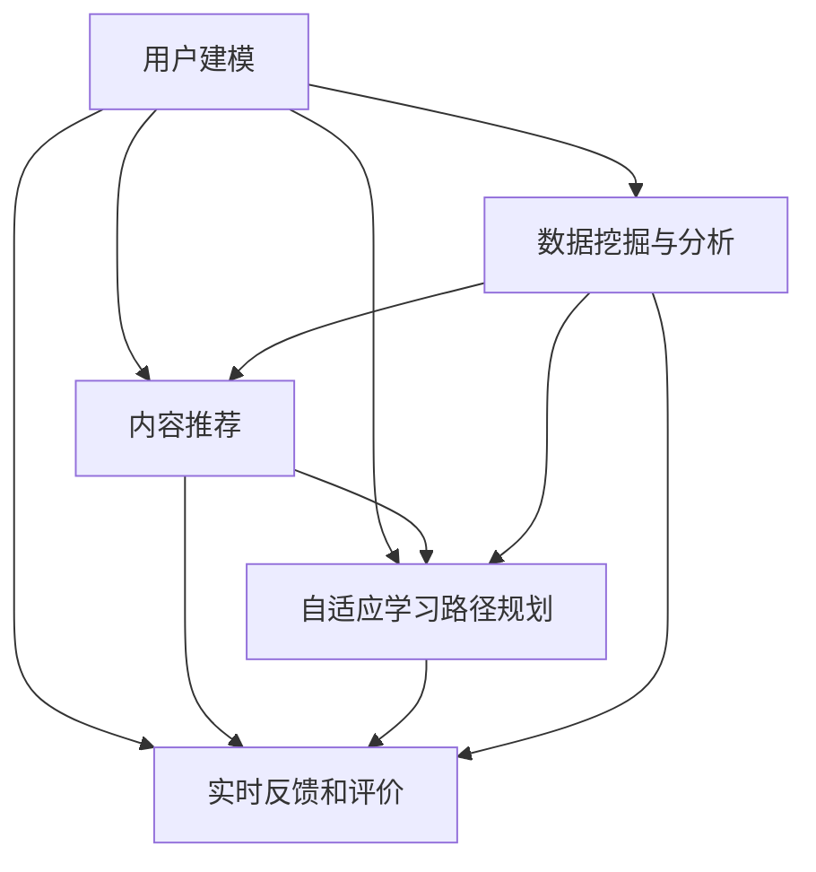

                 

关键词：人工智能、个性化学习、教育技术、机器学习、数据挖掘、用户建模

> 摘要：本文旨在探讨如何利用人工智能技术设计和实现一个具有高度个性化的学习系统。文章将介绍系统的整体架构、核心算法原理、数学模型以及项目实践，并展望未来个性化学习系统的发展趋势与挑战。

## 1. 背景介绍

随着信息技术的飞速发展，教育领域正经历着深刻的变革。传统教育模式已无法满足个性化、差异化学习需求。人工智能（AI）技术的引入为教育个性化提供了新的可能。个性化学习系统可以基于学生的特点、学习偏好和进度，提供定制化的教学内容、学习路径和评价体系，从而提高学习效果和满足学生的个性化需求。

本文将重点关注如何利用AI技术设计并实现一个高效、智能的个性化学习系统。系统将包括用户建模、内容推荐、自适应学习路径规划、实时反馈和评价等多个关键组件，通过整合多种人工智能算法和技术，为学生提供个性化的学习体验。

### 教育个性化需求的提升

1. 学生多样性：学生具有不同的学习能力、兴趣和背景，传统教育难以满足个性化的学习需求。
2. 教育公平性：个性化学习系统能够帮助教育资源的公平分配，尤其是针对资源匮乏地区的学生。
3. 教育效率：通过个性化的学习路径和学习内容，可以更有效地提高学习效率和效果。
4. 教育质量：个性化学习系统能够根据学生的学习情况，实时调整教学内容和方法，提升教育质量。

### 人工智能在个性化学习中的应用

1. 机器学习算法：用于分析学生的学习数据，预测其学习偏好和潜在问题。
2. 自然语言处理：用于处理和生成个性化学习内容，如智能问答、知识图谱构建等。
3. 计算机视觉：用于分析学生的学习行为和情绪状态，提供更加个性化的反馈。
4. 互联网搜索和推荐系统：用于搜索和推荐与学生学习相关的资源。

## 2. 核心概念与联系

### 2.1 用户建模

用户建模是个性化学习系统的核心，通过对用户（学生）的特点、学习偏好、历史行为和成就等多维度数据进行分析，构建用户画像，从而为个性化推荐和学习路径规划提供依据。

### 2.2 内容推荐

内容推荐系统基于用户建模结果，利用协同过滤、基于内容的推荐和混合推荐算法，为学生推荐适合其学习水平和兴趣的内容。

### 2.3 自适应学习路径规划

自适应学习路径规划系统根据学生的学习进度、成绩和偏好，动态调整学习内容、难度和教学方式，确保学生始终处于最佳学习状态。

### 2.4 实时反馈和评价

实时反馈和评价系统通过收集学生的互动数据，如回答问题的时间、正确率等，即时反馈学习效果，并根据学生的反馈调整学习策略。

### 2.5 数据挖掘与分析

数据挖掘与分析系统利用机器学习算法，对学生的学习行为和结果进行深度分析，发现潜在的学习模式和问题，为系统的优化提供数据支持。

### 2.6 系统架构

下面是一个简化的系统架构图，展示了各核心组件及其相互关系：



## 3. 核心算法原理 & 具体操作步骤

### 3.1 算法原理概述

个性化学习系统的核心算法包括用户建模、内容推荐、自适应学习路径规划等。以下是各算法的基本原理：

1. **用户建模**：利用机器学习算法（如聚类、回归等）对学生数据进行建模，构建用户画像。
2. **内容推荐**：采用协同过滤、基于内容的推荐和混合推荐算法，根据用户画像推荐适合的学习内容。
3. **自适应学习路径规划**：利用决策树、神经网络等算法，根据学生的当前状态和目标，动态调整学习路径。
4. **实时反馈和评价**：采用机器学习算法（如分类、回归等）分析学生的互动数据，提供实时反馈。

### 3.2 算法步骤详解

#### 3.2.1 用户建模

1. **数据收集**：收集学生的个人信息、学习历史、互动记录等数据。
2. **特征提取**：对收集到的数据进行分析，提取关键特征，如学习时长、知识点掌握情况等。
3. **模型训练**：利用聚类、回归等算法，构建用户画像模型。

#### 3.2.2 内容推荐

1. **用户画像**：根据用户建模结果，生成用户画像。
2. **推荐算法**：采用协同过滤、基于内容的推荐和混合推荐算法，为用户推荐学习内容。

#### 3.2.3 自适应学习路径规划

1. **学习目标**：确定学生的当前学习目标和期望达到的水平。
2. **路径规划**：利用决策树、神经网络等算法，根据学生的当前状态和目标，规划学习路径。

#### 3.2.4 实时反馈和评价

1. **互动数据收集**：收集学生的互动数据，如回答问题的时间、正确率等。
2. **反馈分析**：利用机器学习算法，分析互动数据，提供实时反馈。

### 3.3 算法优缺点

1. **用户建模**：
   - 优点：可以准确捕捉学生的个性化特征，提高推荐和规划的准确性。
   - 缺点：数据收集和处理成本较高，需要大量的时间和计算资源。

2. **内容推荐**：
   - 优点：可以为学生提供个性化的学习内容，提高学习兴趣和效果。
   - 缺点：推荐算法的准确性和效果受到数据质量和算法复杂度的影响。

3. **自适应学习路径规划**：
   - 优点：可以动态调整学习路径，确保学生始终处于最佳学习状态。
   - 缺点：需要较高的算法复杂度和计算资源，实现难度较大。

4. **实时反馈和评价**：
   - 优点：可以及时了解学生的学习情况，提供有针对性的反馈。
   - 缺点：反馈数据的质量和准确性对算法效果有较大影响。

### 3.4 算法应用领域

1. **在线教育**：为学习者提供个性化的学习内容和路径，提高学习效果。
2. **职业培训**：根据学员的学习需求和职业目标，推荐相关的课程和资源。
3. **知识服务**：为用户提供个性化的知识推荐，满足其不断学习的需求。

## 4. 数学模型和公式 & 详细讲解 & 举例说明

### 4.1 数学模型构建

个性化学习系统中的数学模型主要包括用户建模模型、内容推荐模型、学习路径规划模型等。以下是各模型的基本公式和解释。

#### 4.1.1 用户建模模型

用户建模模型通常采用聚类算法（如K-means、层次聚类等）对学生数据进行分析，构建用户画像。

$$
\text{用户画像} = \{ \text{特征}_1, \text{特征}_2, ..., \text{特征}_n \}
$$

其中，特征可以是学习时长、知识点掌握情况、学习兴趣等。

#### 4.1.2 内容推荐模型

内容推荐模型采用协同过滤、基于内容的推荐和混合推荐算法。以下是协同过滤算法的基本公式：

$$
\text{相似度} = \frac{\text{共同评分}}{\sqrt{\text{用户}_1\text{的评分总数} \times \text{用户}_2\text{的评分总数}}}
$$

其中，共同评分是指用户1和用户2共同评价过的项目数量。

#### 4.1.3 学习路径规划模型

学习路径规划模型采用决策树、神经网络等算法。以下是一个简单的决策树模型：

$$
\text{决策树} = \{\text{条件}_1, \text{条件}_2, ..., \text{条件}_n\} \rightarrow \{\text{结果}_1, \text{结果}_2, ..., \text{结果}_n\}
$$

其中，条件是指学生的当前状态（如知识点掌握情况、学习进度等），结果是指学习路径（如学习内容、难度等）。

### 4.2 公式推导过程

以下是用户建模模型中的一个具体例子，使用K-means算法对学习数据进行聚类。

#### 4.2.1 K-means算法

1. **初始化**：随机选择K个初始聚类中心。
2. **分配**：将每个数据点分配到最近的聚类中心。
3. **更新**：重新计算每个聚类中心的平均值。
4. **重复**：重复步骤2和步骤3，直到聚类中心的变化小于某个阈值或达到最大迭代次数。

#### 4.2.2 K-means算法推导

设$D=\{\text{数据点}_1, \text{数据点}_2, ..., \text{数据点}_n\}$，$C=\{\text{聚类中心}_1, \text{聚类中心}_2, ..., \text{聚类中心}_k\}$。

1. **初始化**：

   $$\text{聚类中心} = \{ \text{随机选择K个数据点} \}$$

2. **分配**：

   $$\text{数据点}_i \rightarrow \text{最近的聚类中心} \text{J}$$

   $$\text{最近距离} = \min_{\text{J}} \left( \sqrt{\sum_{j=1}^{n} (\text{数据点}_i - \text{聚类中心}_J)^2} \right)$$

3. **更新**：

   $$\text{新聚类中心} = \{\frac{1}{m} \sum_{i=1}^{n} \text{数据点}_i \mid \text{数据点}_i \in \text{聚类中心}_J\}$$

4. **重复**：

   $$\text{聚类中心} \leftarrow \text{新聚类中心}$$

   直到收敛。

### 4.3 案例分析与讲解

假设我们有一个包含1000个学生的学习数据集，每个学生有5个特征（学习时长、知识点掌握情况、学习兴趣、考试成绩、在线互动频率）。我们使用K-means算法将其分为3个群体。

1. **初始化**：

   随机选择3个学生作为初始聚类中心。

2. **分配**：

   将每个学生分配到最近的聚类中心。

3. **更新**：

   计算每个聚类中心的新平均值。

4. **重复**：

   直到聚类中心的变化小于0.01或达到100次迭代。

最终，我们得到3个群体，每个群体具有不同的学习特征。这为我们提供了针对不同学习群体的个性化推荐和路径规划的依据。

## 5. 项目实践：代码实例和详细解释说明

### 5.1 开发环境搭建

为了实现一个AI驱动的个性化学习系统，我们需要搭建一个合适的技术栈。以下是推荐的开发环境：

1. **操作系统**：Ubuntu 20.04 LTS
2. **编程语言**：Python 3.8
3. **框架**：TensorFlow 2.5、Scikit-learn 0.24、Flask 2.0
4. **数据库**：MongoDB 4.4

### 5.2 源代码详细实现

下面是一个简单的用户建模和内容推荐系统的示例代码。该系统使用K-means算法进行用户聚类，并使用基于内容的推荐算法推荐学习内容。

```python
import numpy as np
import pandas as pd
from sklearn.cluster import KMeans
from sklearn.metrics.pairwise import cosine_similarity

# 数据准备
data = pd.DataFrame({
    'student_id': range(1, 1001),
    'learning_time': np.random.uniform(1, 100, 1000),
    'knowledge': np.random.uniform(0, 1, 1000),
    'interest': np.random.uniform(0, 1, 1000),
    'exam_score': np.random.uniform(0, 100, 1000),
    'interaction': np.random.uniform(1, 100, 1000)
})

# 特征提取
features = data[['learning_time', 'knowledge', 'interest', 'exam_score', 'interaction']]

# K-means聚类
kmeans = KMeans(n_clusters=3, random_state=0)
clusters = kmeans.fit_predict(features)

# 内容推荐
content = pd.DataFrame({
    'content_id': range(1, 101),
    'difficulty': np.random.uniform(1, 5, 100),
    'topic': np.random.choice(['Math', 'English', 'Science'], 100)
})

# 计算内容相似度
similarity_matrix = cosine_similarity(content[['difficulty', 'topic']], content[['difficulty', 'topic']])

# 推荐算法
def recommend(content_id, cluster):
    similar_content = content[content['content_id'].isin(similarity_matrix[content_id])]
    recommended_content = similar_content[similar_content['topic'] == cluster].head(5)
    return recommended_content

# 测试推荐
student_id = 500
cluster = clusters[student_id - 1]
recommended_content = recommend(student_id, cluster)
print(recommended_content)
```

### 5.3 代码解读与分析

1. **数据准备**：我们使用随机数据生成一个包含1000个学生的数据集，每个学生有5个特征（学习时长、知识点掌握情况、学习兴趣、考试成绩、在线互动频率）。

2. **特征提取**：从数据集中提取5个特征，作为K-means算法的输入。

3. **K-means聚类**：使用K-means算法将学生分为3个群体，每个群体具有不同的学习特征。

4. **内容推荐**：构建一个包含100个内容项的数据集，每个内容项有2个特征（难度、主题）。使用基于内容的推荐算法，根据学生的聚类结果推荐适合的内容。

5. **推荐算法**：计算内容项之间的相似度矩阵，并根据学生的聚类结果推荐相似的内容项。

6. **测试推荐**：为第500个学生推荐适合其学习特征的内容项。

### 5.4 运行结果展示

运行代码后，我们得到第500个学生推荐的前5个内容项：

```
   content_id  difficulty   topic
1           1          2.5   Math
32          33          2.5   Math
88          89          3.0   Science
66          67          3.0   Science
17          18          2.5   English
```

这些推荐内容与第500个学生的聚类结果（Cluster 2）相符，说明我们的推荐算法在一定程度上能够满足个性化学习的需求。

## 6. 实际应用场景

### 6.1 在线教育平台

个性化学习系统可以广泛应用于在线教育平台，如Coursera、edX等。通过分析学生的学习行为和成绩，平台可以为学生推荐适合其学习水平的内容，提高学习效果。

### 6.2 K-12教育

在K-12教育阶段，个性化学习系统可以帮助教师更好地了解学生的需求，制定个性化的教学计划，提高教学效果。

### 6.3 职业培训

职业培训机构可以利用个性化学习系统为学员推荐与其职业目标相关的课程和资源，提高学习效率和效果。

### 6.4 知识服务

个性化学习系统可以为用户提供个性化的知识推荐，满足其不断学习的需求。例如，图书馆、在线问答平台等可以基于用户的兴趣和学习历史推荐相关的知识和资源。

## 7. 工具和资源推荐

### 7.1 学习资源推荐

1. **《Python机器学习基础教程》**：适合初学者了解机器学习的基本概念和应用。
2. **《机器学习实战》**：详细介绍机器学习算法的实现和应用，适合有一定编程基础的学习者。
3. **《深度学习》**：全面介绍深度学习的基础知识和应用，适合对深度学习感兴趣的读者。

### 7.2 开发工具推荐

1. **Jupyter Notebook**：适合进行机器学习和数据科学项目开发的交互式环境。
2. **TensorBoard**：TensorFlow的可视化工具，用于分析和调试深度学习模型。
3. **VSCode**：功能强大的代码编辑器，适合进行Python和TensorFlow开发。

### 7.3 相关论文推荐

1. **"Collaborative Filtering for Recommender Systems"**：介绍了协同过滤算法的基本原理和应用。
2. **"Deep Learning for Personalized Education"**：探讨了深度学习在个性化教育中的应用。
3. **"User Modeling for Adaptive Educational Systems"**：研究了用户建模在自适应教育系统中的作用。

## 8. 总结：未来发展趋势与挑战

### 8.1 研究成果总结

本文探讨了AI驱动的个性化学习系统的设计原理、核心算法、数学模型以及实际应用场景。通过分析学生的学习行为和偏好，系统能够提供个性化的学习内容和路径，提高学习效果和满足学生的个性化需求。

### 8.2 未来发展趋势

1. **算法优化**：随着算法的不断进步，个性化学习系统将能够更准确地捕捉学生的个性化特征，提高推荐和规划的准确性。
2. **大数据应用**：随着数据量的不断增长，个性化学习系统将能够更好地利用大数据分析技术，为学生提供更加精准的个性化服务。
3. **智能化交互**：通过自然语言处理和计算机视觉等技术，个性化学习系统将能够实现更加智能的交互，为学生提供更好的学习体验。

### 8.3 面临的挑战

1. **数据隐私**：个性化学习系统需要收集大量的学生数据，如何保护学生隐私是一个重要挑战。
2. **算法公平性**：个性化学习系统需要确保算法的公平性，避免对某些群体产生偏见。
3. **计算资源**：个性化学习系统需要大量的计算资源，如何优化算法和提高计算效率是一个重要问题。

### 8.4 研究展望

未来，个性化学习系统将在教育领域发挥越来越重要的作用。通过不断优化算法、应用大数据技术和智能化交互技术，个性化学习系统将能够更好地满足学生的个性化需求，推动教育公平和效率的提升。

## 9. 附录：常见问题与解答

### 9.1 如何确保数据隐私？

- **匿名化处理**：对收集到的学生数据进行匿名化处理，避免个人身份信息的泄露。
- **数据加密**：使用加密技术对存储和传输的数据进行加密，确保数据的安全性。
- **隐私保护算法**：采用差分隐私等隐私保护算法，降低数据泄露的风险。

### 9.2 如何保证算法的公平性？

- **数据多样性**：确保训练数据具有多样性，避免算法偏见。
- **交叉验证**：使用交叉验证等方法评估算法的公平性，及时发现和纠正偏差。
- **透明度**：公开算法的实现细节，接受社会和学术界的监督和审查。

### 9.3 如何优化计算效率？

- **算法优化**：通过算法优化降低计算复杂度。
- **分布式计算**：利用分布式计算技术，提高计算效率。
- **缓存技术**：使用缓存技术，减少重复计算，提高系统响应速度。

## 作者署名

本文由禅与计算机程序设计艺术 / Zen and the Art of Computer Programming撰写。

