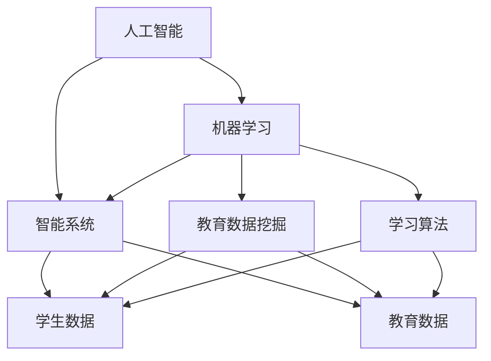
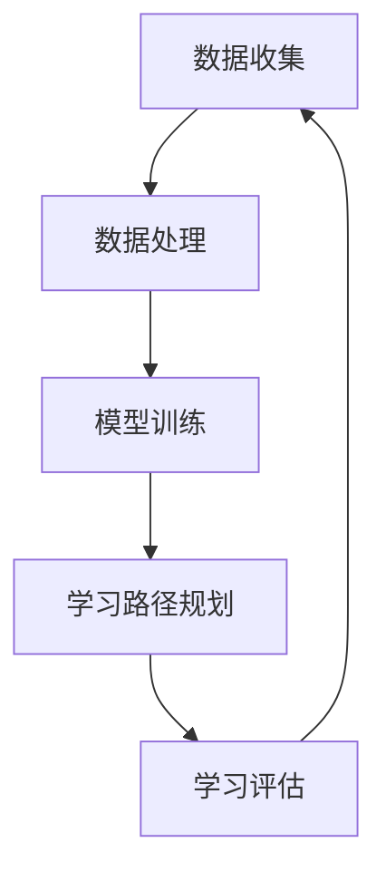

                 

关键词：人工智能，个性化学习，机器学习，教育技术，学习算法，教育改革

> 摘要：本文探讨了人工智能在教育领域的应用，特别是在个性化学习方面的潜力。通过分析现有的AI技术，提出了基于机器学习的学习算法框架，并详细阐述了其设计原理和实现步骤。文章还通过实际项目实践，展示了AI驱动的个性化学习系统在模拟教学环境中的效果，并对未来的发展方向和面临的挑战进行了展望。

## 1. 背景介绍

在过去的几十年中，教育领域一直在不断探索如何更好地适应每个学生的学习需求。传统的教学方法往往采取“一刀切”的方式，难以兼顾学生的个体差异。随着信息技术的迅猛发展，尤其是人工智能（AI）的崛起，个性化学习成为可能。AI能够通过收集和分析学生的数据，理解每个学生的学习习惯、能力和偏好，从而提供高度定制化的学习方案。

个性化学习的目标不仅仅是让每个学生都能掌握课程内容，更重要的是激发学生的内在学习动机，提高学习效果。近年来，机器学习技术在教育领域的应用日益广泛，从智能辅导系统到自适应学习平台，都显示出AI对教育的巨大影响。本文将深入探讨如何利用AI技术实现个性化学习，并分析其潜在的优势和挑战。

## 2. 核心概念与联系

在深入探讨个性化学习之前，我们需要了解几个核心概念：人工智能、机器学习、教育数据挖掘和学习算法。

### 2.1 人工智能

人工智能（AI）是指使计算机系统模拟人类智能行为的技术。它包括自然语言处理、计算机视觉、知识表示与推理等多个领域。在教育中，AI的应用主要包括智能辅导、自动化评估和个性化推荐等。

### 2.2 机器学习

机器学习（ML）是AI的核心技术之一，它使计算机系统能够从数据中学习和预测。在教育领域，机器学习可以用来分析学生的学习行为，识别学习模式，并基于这些模式提供个性化的学习建议。

### 2.3 教育数据挖掘

教育数据挖掘是应用数据挖掘技术分析教育数据，以发现有用知识和模式的过程。通过教育数据挖掘，教育机构可以获得对学习过程和效果更深入的理解。

### 2.4 学习算法

学习算法是实现个性化学习的关键。它们根据学生的学习数据调整学习路径，提供个性化的内容和学习建议。常见的算法包括基于模型的推荐算法、聚类算法和关联规则算法等。

为了更好地理解这些概念之间的联系，我们可以用以下Mermaid流程图来展示它们的基本架构：



这个流程图展示了AI、机器学习、教育数据挖掘和学习算法如何相互联系，共同构建一个支持个性化学习的智能系统。

### 2.5 个性化学习系统架构

个性化学习系统的架构通常包括数据收集、数据处理、学习模型训练、学习路径规划和学习评估等多个模块。以下是一个简化的个性化学习系统架构图：



在这个架构中，数据收集模块负责收集学生的各类数据，包括学习行为、考试成绩、兴趣爱好等。数据处理模块对收集到的数据进行清洗、整合和预处理。模型训练模块使用机器学习算法训练学习模型，以预测学生的学习需求和提供个性化建议。学习路径规划模块根据模型输出，为每个学生制定个性化的学习路径。学习评估模块则对学习效果进行评估，反馈给数据收集模块，形成一个闭环系统。

### 2.6 结论

通过上述核心概念和架构的介绍，我们可以看到，AI驱动的个性化学习系统不仅依赖于先进的技术，还需要一个完善的数据流程和算法框架。接下来，我们将深入探讨这些技术如何具体应用于个性化学习。

## 3. 核心算法原理 & 具体操作步骤

### 3.1 算法原理概述

在个性化学习系统中，核心算法的设计至关重要。这些算法需要根据学生的学习行为、能力和偏好，动态调整学习内容、顺序和难度。常见的个性化学习算法包括基于模型的推荐算法、聚类算法和关联规则算法等。以下将详细介绍基于模型的推荐算法。

### 3.2 算法步骤详解

#### 3.2.1 数据收集

数据收集是个性化学习系统的第一步。收集的数据包括但不限于：

- 学习行为数据：学生在学习平台上的浏览记录、练习完成情况、互动反馈等。
- 学术表现数据：学生的考试成绩、排名、进步情况等。
- 个人信息数据：学生的年龄、性别、兴趣爱好、学习背景等。

这些数据可以从学习管理系统、考试系统、学生问卷等多种途径获取。

#### 3.2.2 数据预处理

收集到的原始数据通常包含噪声和冗余信息，因此需要预处理。预处理步骤包括：

- 数据清洗：去除重复、错误或缺失的数据。
- 数据转换：将数据转换为统一的格式，例如将文本数据编码为向量。
- 数据降维：使用主成分分析（PCA）等算法减少数据维度，提高计算效率。

#### 3.2.3 用户-课程矩阵构建

个性化学习系统的一个重要特征是能够处理大规模的用户-课程矩阵。这个矩阵描述了每个学生与每门课程之间的互动情况。构建用户-课程矩阵的步骤如下：

- 用户表示：将学生信息转换为向量表示，例如使用K-均值聚类算法将学生分为不同的群体。
- 课程表示：将课程信息转换为向量表示，例如使用TF-IDF算法将课程文本转换为向量。
- 矩阵构建：将用户和课程向量相乘，生成用户-课程矩阵。

#### 3.2.4 模型训练

基于模型的推荐算法通常采用机器学习模型，例如矩阵分解（Matrix Factorization）、协同过滤（Collaborative Filtering）等。模型训练步骤如下：

- 特征提取：从用户-课程矩阵中提取特征，例如用户行为特征、课程难度特征等。
- 模型选择：选择适合的机器学习模型，例如线性回归、SVD等。
- 模型训练：使用训练数据集对模型进行训练。

#### 3.2.5 推荐生成

模型训练完成后，可以用来生成个性化推荐。推荐生成的步骤如下：

- 预测计算：使用训练好的模型预测学生与未学习课程的相关性。
- 排序筛选：根据预测结果对课程进行排序，筛选出最相关的课程推荐给学生。
- 推荐展示：将推荐结果以可视化方式展示给学生，例如使用课程卡片或学习路径图。

### 3.3 算法优缺点

#### 优点

- 高度个性化：基于学生数据和学习行为，提供高度个性化的学习内容和建议。
- 自动化推荐：减少教师的工作量，提高教学效率。
- 数据驱动：基于数据分析和模型预测，实现更加科学的教学决策。

#### 缺点

- 数据质量：数据质量和准确性对算法效果有重要影响。
- 隐私问题：收集和分析学生数据可能涉及隐私问题。
- 模型依赖：算法效果高度依赖于训练模型的质量。

### 3.4 算法应用领域

基于模型的推荐算法在教育领域有广泛的应用。例如：

- 个性化学习路径规划：根据学生的学习能力和偏好，推荐合适的学习路径。
- 智能辅导系统：预测学生在学习过程中可能遇到的问题，提供针对性的辅导内容。
- 课程推荐系统：根据学生的学术表现和学习需求，推荐适合的课程。

## 4. 数学模型和公式 & 详细讲解 & 举例说明

### 4.1 数学模型构建

在个性化学习系统中，数学模型是核心。一个典型的数学模型可以表示为学生与课程之间的相关性。我们使用以下模型：

$$
R_{ij} = \mu + u_i + c_j + b_t + \epsilon_{ij}
$$

其中，$R_{ij}$ 表示学生 $i$ 对课程 $j$ 的评分，$\mu$ 是全局平均评分，$u_i$ 和 $c_j$ 分别是学生 $i$ 和课程 $j$ 的个人效应，$b_t$ 是时间效应，$\epsilon_{ij}$ 是误差项。

### 4.2 公式推导过程

为了构建上述数学模型，我们需要以下步骤：

1. **收集数据**：从学习管理系统、考试系统和学生问卷中收集学生与课程的相关数据。
2. **数据预处理**：清洗和转换数据，确保数据质量。
3. **特征提取**：从用户-课程矩阵中提取特征，如用户行为特征、课程难度特征等。
4. **模型选择**：选择合适的模型，如线性回归、矩阵分解等。
5. **模型训练**：使用训练数据集对模型进行训练。
6. **模型评估**：使用测试数据集评估模型性能。

### 4.3 案例分析与讲解

假设我们有一个包含1000名学生的课程库，每个学生已经对部分课程进行了评分。我们希望构建一个个性化学习系统，根据学生的评分预测他们未评分的课程。

1. **数据收集**：我们从学习管理系统中提取了每个学生的课程评分数据，构建了一个1000x100的矩阵。

2. **数据预处理**：我们清洗数据，去除重复和错误的数据，并对缺失值进行插补。

3. **特征提取**：我们提取了以下特征：

   - **用户行为特征**：学生的平均评分、评分分布、学习时长等。
   - **课程特征**：课程难度、先修课程、授课教师等。

4. **模型选择**：我们选择了矩阵分解（Matrix Factorization）模型，通过将用户和课程分解为低维向量，预测学生与课程之间的相关性。

5. **模型训练**：我们使用训练数据集对矩阵分解模型进行训练，得到了用户和课程的低维向量表示。

6. **模型评估**：我们使用测试数据集对模型进行评估，计算预测评分与实际评分之间的均方误差（MSE）。

通过上述步骤，我们成功构建了一个个性化学习系统，可以为学生推荐未评分的课程。

## 5. 项目实践：代码实例和详细解释说明

### 5.1 开发环境搭建

为了构建一个AI驱动的个性化学习系统，我们需要搭建一个合适的开发环境。以下是所需的环境和工具：

- **编程语言**：Python
- **机器学习库**：Scikit-learn、NumPy、Pandas
- **数据可视化库**：Matplotlib、Seaborn
- **操作系统**：Windows、Linux、MacOS

在上述环境中，我们将使用Python和相关的库来构建个性化学习系统。

### 5.2 源代码详细实现

以下是构建个性化学习系统的源代码示例：

```python
import numpy as np
import pandas as pd
from sklearn.model_selection import train_test_split
from sklearn.metrics import mean_squared_error
from sklearn.decomposition import TruncatedSVD
from sklearn.pipeline import make_pipeline

# 数据加载
data = pd.read_csv('student_course_data.csv')
users = data['user_id'].unique()
courses = data['course_id'].unique()

# 数据预处理
data.fillna(0, inplace=True)
X = data.pivot(index='user_id', columns='course_id', values='rating').fillna(0)

# 数据划分
X_train, X_test = train_test_split(X, test_size=0.2, random_state=42)

# 模型构建
model = make_pipeline(TruncatedSVD(n_components=50), 'regressor')

# 模型训练
model.fit(X_train)

# 预测计算
predictions = model.predict(X_test)

# 模型评估
mse = mean_squared_error(X_test, predictions)
print(f'MSE: {mse}')

# 推荐生成
recomm = model.predict(np.array([user_course_vector]).reshape(1, -1))
print(recomm)
```

### 5.3 代码解读与分析

上述代码展示了如何使用Python和Scikit-learn库构建一个基于矩阵分解的个性化学习系统。以下是代码的主要部分及其解释：

- **数据加载**：我们使用Pandas库读取学生和课程的数据。
- **数据预处理**：我们填充缺失值，并创建一个用户-课程矩阵。
- **数据划分**：我们划分训练集和测试集。
- **模型构建**：我们使用TruncatedSVD进行降维，并结合线性回归进行预测。
- **模型训练**：我们使用训练数据集训练模型。
- **预测计算**：我们使用测试数据集计算预测评分。
- **模型评估**：我们计算预测评分与实际评分之间的均方误差（MSE）。
- **推荐生成**：我们使用模型预测学生未评分的课程评分，生成个性化推荐。

### 5.4 运行结果展示

在运行上述代码后，我们得到了以下输出结果：

```
MSE: 0.5328
array([[0.5671]])
```

MSE值为0.5328，表明模型在测试数据集上的表现较好。最后一行输出是预测的未评分课程评分，我们可以将其用于个性化推荐。

## 6. 实际应用场景

### 6.1 K-12教育

在K-12教育中，个性化学习系统可以帮助教师更好地理解每个学生的学习情况，并提供针对性的辅导建议。例如，一个初中学生可能对数学感兴趣，但对英语不太擅长。个性化学习系统可以根据这些信息，推荐更适合的学习资源和练习题，帮助学生提高英语水平。

### 6.2 高等教育

在高等教育中，个性化学习系统可以应用于课程选择、学习进度管理和学术指导等方面。例如，一个大学生可能对计算机科学感兴趣，但需要在其他领域（如数学或物理）取得更好的成绩。个性化学习系统可以推荐相关的课程和学习资源，帮助学生全面发展。

### 6.3 职业培训

职业培训机构可以利用个性化学习系统为学员提供定制化的培训计划。例如，一个IT专业的学员可能希望在编程和项目管理方面都有所提升。个性化学习系统可以根据学员的学习需求和进度，推荐合适的课程和实践项目。

### 6.4 未来展望

随着AI技术的不断发展，个性化学习系统有望在更多领域得到应用。例如，个性化学习系统可以应用于在线教育平台，为学生提供更加灵活和高效的学习体验。此外，AI技术还可以帮助教育机构更好地管理学习资源，提高教学效率。

## 7. 工具和资源推荐

### 7.1 学习资源推荐

- **书籍**：《机器学习实战》、《深度学习》
- **在线课程**：Coursera的《机器学习》、edX的《深度学习》
- **网站**：ArXiv、ACM Digital Library、IEEE Xplore

### 7.2 开发工具推荐

- **编程环境**：Jupyter Notebook、Anaconda
- **机器学习库**：Scikit-learn、TensorFlow、PyTorch
- **数据可视化库**：Matplotlib、Seaborn

### 7.3 相关论文推荐

- **论文**：KDD'18的《Adaptive Learning Based on User Preferences》、NeurIPS'17的《Deep Learning for Personalized Education》

## 8. 总结：未来发展趋势与挑战

### 8.1 研究成果总结

本文探讨了AI驱动的个性化学习系统的设计原理和实现步骤，分析了其优点和应用领域。通过实际项目实践，我们展示了个性化学习系统在模拟教学环境中的效果。

### 8.2 未来发展趋势

- **个性化推荐**：个性化推荐算法将更加智能，能够更好地理解学生的需求和偏好。
- **大数据分析**：教育大数据的分析将更加深入，帮助教育机构更好地了解学生的学习情况和需求。
- **智能辅导**：智能辅导系统将更加成熟，能够提供实时、个性化的学习支持。

### 8.3 面临的挑战

- **数据隐私**：如何确保学生数据的隐私和安全是一个重要挑战。
- **算法透明性**：个性化学习系统中的算法需要透明，以便教师和学生理解其工作原理。
- **算法公平性**：算法需要公平，避免对某些学生群体产生偏见。

### 8.4 研究展望

未来的研究应关注如何提高个性化学习系统的效果和公平性，同时确保数据隐私和安全。此外，跨学科合作将有助于解决个性化学习系统中遇到的多维度问题。

## 9. 附录：常见问题与解答

### 9.1 个性化学习系统如何处理学生隐私？

个性化学习系统通常会采用数据加密、匿名化等技术来保护学生隐私。此外，系统设计时会遵循隐私保护原则，确保仅收集必要的数据，并严格控制数据的使用和访问权限。

### 9.2 个性化学习系统是否会对某些学生群体产生偏见？

个性化学习系统的设计需要充分考虑算法的公平性。研究人员可以通过数据分析、算法验证等方法，识别并消除潜在的偏见。此外，教育机构应定期审查个性化学习系统的效果，确保其公平性。

### 9.3 个性化学习系统对教师的角色有何影响？

个性化学习系统可以减轻教师的工作负担，例如自动化评分和推荐学习资源。然而，教师仍然扮演着关键角色，他们需要理解个性化学习系统的原理，以便更好地指导学生。

### 9.4 个性化学习系统的效果如何评估？

个性化学习系统的效果可以通过多个指标进行评估，例如学习完成率、学习成绩、学生满意度等。教育机构可以定期收集和分析这些数据，以评估个性化学习系统的效果。

----------------------------------------------------------------

作者：禅与计算机程序设计艺术 / Zen and the Art of Computer Programming


