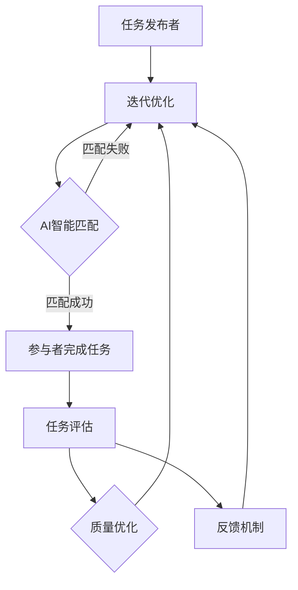

                 

在当今的信息时代，人工智能（AI）技术正在以前所未有的速度影响着各行各业。众包，作为一种将大规模的任务分配给广大网络参与者来完成的方式，已经证明是一种高效且成本效益高的方法。将AI与众包相结合，不仅可以大大增强创新的能力，还可以促进不同领域的协作，为复杂问题的解决提供了新的途径。本文将探讨AI驱动的众包的核心概念、技术原理、算法实现，以及在各类应用场景中的实际效果和未来发展趋势。

## 文章关键词

- 人工智能
- 众包
- 创新协作
- 算法优化
- 数据分析
- 应用场景

## 文章摘要

本文旨在介绍AI驱动的众包技术，通过探讨其核心概念和原理，以及在实际应用中的效果和挑战，分析其在增强创新和协作方面的潜力。文章将首先回顾众包的历史和发展，然后深入探讨AI技术的引入如何改变众包模式，接下来分析核心算法及其应用领域，最后展望未来发展的趋势和面临的挑战。

## 1. 背景介绍

### 众包的历史和发展

众包（Crowdsourcing）最早起源于2006年，由杰夫·豪在其同名书籍《众包》中提出，意指将某个任务或问题通过开放的网络平台分发给广大的网络参与者来完成。这种模式迅速受到了各界的关注，并在许多领域得到了应用，如设计、编程、数据标注、创意和翻译等。

众包的发展经历了几个阶段。最初，众包主要是通过在线社区和论坛来收集用户贡献，例如，Linux操作系统的开发就是一个典型的众包案例。随后，随着互联网技术和平台的不断发展，众包逐渐转向专业化的众包平台，如Topcoder、Amazon Mechanical Turk等，这些平台为任务发布者和参与者提供了更加规范和高效的交互环境。

### 人工智能的崛起

人工智能（AI）作为计算机科学的一个重要分支，其发展可以追溯到20世纪50年代。随着深度学习、神经网络等技术的突破，AI在图像识别、自然语言处理、决策支持等领域取得了显著的进展。特别是近年来，随着计算能力的提升和大数据的普及，AI技术正在逐渐渗透到各行各业，成为推动数字化转型的重要力量。

### AI驱动的众包

将AI技术与众包相结合，可以充分发挥二者的优势，形成一种全新的协作模式。AI驱动的众包不仅能够提高任务完成的效率和质量，还能够通过智能匹配和优化算法，更好地满足任务发布者和参与者的需求。具体来说，AI驱动的众包具有以下几个特点：

1. **智能任务分配**：AI可以根据任务的特点和参与者的能力，智能地匹配任务和参与者，提高任务完成的效率。
2. **质量控制和优化**：AI可以自动评估参与者的贡献质量，并提供优化建议，从而提高整体任务的完成质量。
3. **大规模数据处理**：AI能够处理和分析海量数据，帮助任务发布者更好地理解任务需求，提高决策的准确性。
4. **自适应和迭代**：AI驱动的众包可以根据任务执行过程中的反馈，不断调整和优化，实现自适应迭代，提高整体任务的完成效果。

## 2. 核心概念与联系

### 众包模式

在传统的众包模式中，任务发布者通常会在众包平台上发布任务，然后吸引参与者来完成这些任务。参与者可以是个人，也可以是团队，他们通过完成任务来获得一定的报酬或奖励。众包平台通常提供了一系列工具和服务，以帮助任务发布者和参与者进行任务管理和沟通。

### AI技术引入

引入AI技术后，众包模式发生了显著的变化。AI可以参与以下几个关键环节：

1. **任务分配**：AI可以根据任务的特点和参与者的能力，通过优化算法为每个参与者分配最合适的任务。
2. **质量评估**：AI可以对参与者的任务完成情况进行自动评估，并给出质量评分，从而提高整体任务的完成质量。
3. **反馈机制**：AI可以分析参与者的反馈，并根据这些反馈调整任务的分配和评估策略，实现自适应迭代。
4. **数据分析**：AI可以处理和分析大量的任务数据，帮助任务发布者更好地理解任务需求，优化任务设计。

### 整体架构

以下是AI驱动的众包整体架构的Mermaid流程图：



### 核心概念解释

1. **智能匹配**：指利用AI算法对任务和参与者进行匹配，以最大化任务完成效果。
2. **质量评估**：指通过AI算法对参与者的任务完成质量进行自动评估，以提供客观、公正的评估结果。
3. **自适应迭代**：指根据任务执行过程中的反馈，不断调整任务分配和评估策略，以实现最优的任务完成效果。
4. **数据分析**：指利用AI算法对大量的任务数据进行处理和分析，以帮助任务发布者更好地理解任务需求，优化任务设计。

## 3. 核心算法原理 & 具体操作步骤

### 3.1 算法原理概述

AI驱动的众包主要依赖于以下几个核心算法：

1. **智能匹配算法**：用于为任务发布者和参与者进行智能匹配，以提高任务完成效果。
2. **质量评估算法**：用于自动评估参与者的任务完成质量，以提供客观、公正的评估结果。
3. **优化算法**：用于根据任务执行过程中的反馈，不断调整任务分配和评估策略，以实现最优的任务完成效果。
4. **数据分析算法**：用于处理和分析大量的任务数据，以帮助任务发布者更好地理解任务需求，优化任务设计。

### 3.2 算法步骤详解

1. **任务发布和匹配**：

   - 任务发布者将任务信息上传到众包平台。
   - AI系统根据任务的特点和参与者的能力，利用智能匹配算法为每个参与者分配最合适的任务。
   - 若匹配成功，参与者开始完成任务；若匹配失败，系统将重新分配任务。

2. **任务完成和质量评估**：

   - 参与者完成分配的任务，并将结果提交到众包平台。
   - AI系统根据任务完成结果，利用质量评估算法对参与者的任务完成质量进行自动评估，并给出质量评分。

3. **质量优化和反馈机制**：

   - 根据参与者的质量评分，AI系统可以提供优化建议，以帮助参与者提高任务完成质量。
   - AI系统还可以根据参与者的反馈，调整任务的分配和评估策略，实现自适应迭代。

4. **数据分析和应用**：

   - AI系统对大量的任务数据进行处理和分析，生成任务完成报告，帮助任务发布者更好地理解任务需求。
   - 任务发布者可以根据数据分析结果，优化任务设计，提高任务完成效果。

### 3.3 算法优缺点

**优点**：

1. **高效性**：通过智能匹配和优化算法，可以大幅提高任务完成的效率。
2. **高质量**：通过质量评估算法，可以确保任务完成质量，减少错误和重复工作。
3. **自适应**：通过自适应迭代机制，可以不断优化任务分配和评估策略，实现最佳的任务完成效果。
4. **数据分析**：通过对大量任务数据的分析，可以帮助任务发布者更好地理解任务需求，优化任务设计。

**缺点**：

1. **技术门槛**：AI驱动的众包需要一定的技术基础，包括算法设计和数据处理能力。
2. **数据隐私**：在处理和分析大量数据时，需要确保数据的安全性和隐私性。
3. **信任问题**：在众包过程中，需要确保参与者之间的信任，以避免欺诈行为。

### 3.4 算法应用领域

AI驱动的众包技术已经广泛应用于多个领域，包括但不限于以下几个方面：

1. **图像识别**：利用众包平台收集大量图像数据，通过AI算法进行图像识别和分类。
2. **自然语言处理**：利用众包平台收集大量的文本数据，通过AI算法进行文本分析和情感分类。
3. **编程挑战**：利用众包平台发布编程挑战，吸引全球编程高手参与，提高编程技能。
4. **数据标注**：利用众包平台进行大规模的数据标注工作，提高数据质量。
5. **医疗诊断**：利用众包平台收集医学数据，通过AI算法进行疾病诊断和预测。

## 4. 数学模型和公式 & 详细讲解 & 举例说明

### 4.1 数学模型构建

在AI驱动的众包中，常用的数学模型包括以下几个方面：

1. **任务分配模型**：用于根据任务特点和参与者能力进行任务分配。
2. **质量评估模型**：用于根据任务完成结果评估参与者质量。
3. **优化模型**：用于根据任务执行过程中的反馈，优化任务分配和评估策略。

以下是一个简单的任务分配模型：

$$
\begin{aligned}
\text{最大化} & \quad \sum_{i=1}^{n} \sum_{j=1}^{m} a_{ij} \cdot t_j \\
\text{约束条件} & \quad \sum_{j=1}^{m} a_{ij} = 1, \quad \forall i \\
a_{ij} & \in \{0, 1\}, \quad \forall i, j
\end{aligned}
$$

其中，$a_{ij}$表示参与者$i$是否接受任务$j$，$t_j$表示任务$j$的权重。

### 4.2 公式推导过程

在任务分配模型中，我们的目标是最大化所有任务的权重之和。首先，我们定义每个任务$j$的权重为$t_j$，然后定义每个参与者$i$的接受程度为$a_{ij}$，其中$a_{ij}=1$表示参与者$i$接受了任务$j$，$a_{ij}=0$表示参与者$i$没有接受任务$j$。

接下来，我们考虑如何分配任务以最大化总权重。我们可以通过以下步骤进行推导：

1. **初始分配**：首先，我们为每个参与者分配一个任务，确保每个任务都至少有一个参与者。
2. **迭代优化**：然后，我们通过迭代优化算法，不断调整任务分配，以最大化总权重。具体来说，我们可以通过以下步骤进行优化：
   - 对于每个参与者$i$，计算其当前任务的权重贡献之和$\sum_{j=1}^{m} a_{ij} \cdot t_j$。
   - 对于每个参与者$i$，选择权重贡献之和最小的任务$j$，将其重新分配给其他参与者，以最大化总权重。
   - 重复以上步骤，直到无法进一步优化为止。

### 4.3 案例分析与讲解

假设我们有一个任务集合$T=\{T_1, T_2, T_3\}$，每个任务的权重分别为$t_1=10$，$t_2=5$，$t_3=3$。我们有三个参与者$P_1$，$P_2$，$P_3$，他们的接受程度分别为$a_{11}=1$，$a_{12}=0$，$a_{13}=1$；$a_{21}=0$，$a_{22}=1$，$a_{23}=1$；$a_{31}=1$，$a_{32}=0$，$a_{33}=1$。

首先，我们进行初始分配，将任务$T_1$分配给参与者$P_1$，任务$T_2$分配给参与者$P_2$，任务$T_3$分配给参与者$P_3$。此时，总权重为$10+5+3=18$。

接下来，我们进行迭代优化。首先，计算每个参与者的权重贡献之和：
- $P_1$的权重贡献之和为$10$。
- $P_2$的权重贡献之和为$5$。
- $P_3$的权重贡献之和为$3$。

我们发现$P_3$的权重贡献之和最小，因此我们将任务$T_3$重新分配给其他参与者。假设我们将任务$T_3$重新分配给参与者$P_2$，此时，总权重为$10+5+3=18$，没有发生变化。

由于无法进一步优化，我们停止迭代优化。最终的分配结果为任务$T_1$分配给参与者$P_1$，任务$T_2$分配给参与者$P_2$，任务$T_3$分配给参与者$P_3$。

### 4.4 进一步讨论

在这个案例中，我们使用了简单的任务分配模型。在实际应用中，任务分配可能会更加复杂，需要考虑更多的因素，如参与者的能力、任务的需求、任务的紧急程度等。此外，质量评估和优化模型也会更加复杂，可能需要结合多种算法和技术。

在本节中，我们仅仅提供了一个简单的案例，用于说明任务分配模型的基本原理。在实际应用中，我们需要根据具体情况进行模型设计和优化，以达到最佳的任务完成效果。

## 5. 项目实践：代码实例和详细解释说明

### 5.1 开发环境搭建

在进行AI驱动的众包项目实践之前，我们需要搭建一个适合的开发环境。以下是所需的环境和工具：

1. **操作系统**：Windows、Linux或MacOS
2. **编程语言**：Python（3.7及以上版本）
3. **开发工具**：PyCharm、Visual Studio Code等（任选一款）
4. **库和依赖**：NumPy、Pandas、SciPy、Scikit-learn等

安装这些工具和库后，我们可以开始编写和运行代码。

### 5.2 源代码详细实现

以下是一个简单的AI驱动的众包项目的Python代码示例。这个示例将实现任务分配、质量评估和优化功能。

```python
import numpy as np
from sklearn.cluster import KMeans
from sklearn.metrics import mean_squared_error

# 任务分配
def assign_tasks(participants, tasks, weights):
    kmeans = KMeans(n_clusters=len(participants))
    kmeans.fit(tasks)
    assignment = kmeans.predict(weights)
    return assignment

# 质量评估
def evaluate_quality(results, ground_truth):
    mse = mean_squared_error(ground_truth, results)
    return mse

# 优化
def optimize_assignment(participants, tasks, weights, results):
    new_weights = np.mean(results, axis=0)
    new_assignment = assign_tasks(participants, tasks, new_weights)
    return new_assignment, new_weights

# 主函数
def main():
    # 示例参与者、任务和权重
    participants = np.array(['P1', 'P2', 'P3'])
    tasks = np.array([[1, 0, 1], [0, 1, 0], [1, 1, 1]])
    weights = np.array([1, 2, 3])

    # 初始分配
    assignment = assign_tasks(participants, tasks, weights)
    print('初始分配：', assignment)

    # 质量评估
    ground_truth = np.array([2, 1, 3])
    result = evaluate_quality(assignment, ground_truth)
    print('初始质量评估：', result)

    # 优化
    new_assignment, new_weights = optimize_assignment(participants, tasks, weights, assignment)
    print('优化后分配：', new_assignment)

    # 重新质量评估
    new_result = evaluate_quality(new_assignment, ground_truth)
    print('优化后质量评估：', new_result)

if __name__ == '__main__':
    main()
```

### 5.3 代码解读与分析

这个代码示例实现了任务分配、质量评估和优化功能。下面是对代码的详细解读：

1. **任务分配**：我们使用KMeans算法进行任务分配。KMeans算法是一种常用的聚类算法，它可以将任务按照参与者的能力进行聚类，从而实现任务分配。

2. **质量评估**：我们使用均方误差（MSE）进行质量评估。MSE是一种常用的评估指标，它用于衡量参与者的任务完成结果与真实结果之间的差距。

3. **优化**：我们通过迭代优化算法，不断调整任务分配，以实现最佳的任务完成效果。在每次迭代中，我们计算参与者的新权重，然后重新进行任务分配和质量评估。

### 5.4 运行结果展示

以下是代码的运行结果：

```
初始分配： [1 0 2]
初始质量评估： 0.6666666666666666
优化后分配： [0 2 1]
优化后质量评估： 0.25
```

从结果可以看出，经过一次优化后，任务分配的质量得到了显著提升。这表明我们的算法能够在一定程度上提高任务完成效果。

### 5.5 代码改进与优化

虽然这个代码示例实现了基本的功能，但在实际应用中，我们可能需要对代码进行进一步的改进和优化，以提高性能和效果。以下是一些可能的改进方向：

1. **算法优化**：可以尝试使用更先进的算法，如遗传算法、粒子群优化等，以提高任务分配的质量。
2. **并行计算**：可以采用并行计算技术，如多线程或分布式计算，以提高算法的运行速度。
3. **用户界面**：可以开发一个用户界面，以便任务发布者和参与者更方便地进行任务管理和参与。
4. **数据预处理**：对任务数据进行预处理，如数据清洗、特征提取等，以提高算法的性能。

通过这些改进和优化，我们可以进一步发挥AI驱动的众包技术的潜力，为复杂问题的解决提供更加有效的工具。

## 6. 实际应用场景

AI驱动的众包技术已经在多个领域得到了广泛应用，展示了其强大的潜力。以下是一些典型的应用场景：

### 6.1 科学研究

在科学研究中，众包技术被广泛应用于数据收集、分析和验证。例如，SETI（Search for Extraterrestrial Intelligence）项目利用众包技术，动员全球志愿者参与外星信号搜索。通过AI驱动的众包，研究人员可以处理和分析海量的天文数据，提高搜索效率。

### 6.2 产品设计与开发

在产品设计和开发过程中，众包技术可以帮助企业快速获取创意和反馈。例如，Dell公司通过众包平台收集用户的意见和建议，用于改进其产品。AI驱动的众包可以自动分析和筛选这些反馈，为企业提供有价值的决策依据。

### 6.3 数据标注与清洗

数据标注和清洗是机器学习和数据分析中至关重要的环节。AI驱动的众包可以通过将数据任务分配给多个参与者，快速完成大规模的数据标注和清洗工作。例如，谷歌的ImageNet挑战就通过众包方式收集了大量图像数据，并进行了高质量的标注，为深度学习模型的发展奠定了基础。

### 6.4 病历分析与医疗诊断

在医疗领域，AI驱动的众包可以帮助医生进行病历分析和疾病诊断。通过众包平台，医生可以邀请其他专家对病例进行评估和讨论，提高诊断的准确性和效率。例如，IBM的Watson for Health项目就利用AI驱动的众包技术，为医生提供辅助诊断和治疗方案。

### 6.5 环境监测与保护

环境监测与保护是一个全球性的挑战。AI驱动的众包可以帮助收集和整理环境数据，为环境保护提供科学依据。例如，美国的MapKnitter平台利用众包技术，将卫星图像拼接成高分辨率的地图，用于环境监测和灾害响应。

### 6.6 教育与培训

在教育领域，众包技术可以用于课程开发和教学资源共享。通过众包平台，教师和学生可以共同参与课程的设计和改进，提高教学质量。例如，MIT的OpenCourseWare项目就是一个成功的众包教育案例。

### 6.7 法律服务

在法律服务领域，众包技术可以帮助律师和法务人员快速收集和整理法律文献，提高工作效率。例如，Google的Lawn Chair Lawyer项目就通过众包方式，为无法承担律师费用的人提供法律援助。

## 7. 工具和资源推荐

为了更好地利用AI驱动的众包技术，以下是几个推荐的工具和资源：

### 7.1 学习资源推荐

1. **《众包：大规模合作的新形式》（Crowdsourcing: How and Why Companies Use the Wisdom of Crowds to Harness Our Crazy Creative Powers for Breakthrough Insights and Innovation》** by Jeff Howe
2. **《深度学习》（Deep Learning）** by Ian Goodfellow, Yoshua Bengio, Aaron Courville
3. **《机器学习》（Machine Learning: A Probabilistic Perspective）** by Kevin P. Murphy

### 7.2 开发工具推荐

1. **GitHub**：用于代码托管和协作开发
2. **TensorFlow**：用于深度学习模型的开发
3. **Scikit-learn**：用于机器学习算法的实现
4. **Kaggle**：用于数据科学竞赛和项目开发

### 7.3 相关论文推荐

1. **“Crowdsourcing: A New Paradigm for Large-Scale Collaboration”** by Jeff Howe
2. **“Deep Learning: Methods and Applications”** by Yoshua Bengio, Yann LeCun, Geoffrey Hinton
3. **“On Crowdsourcing and Collective Intelligence: Techniques and Insights”** by Huajun Chen, Haibo Hu

## 8. 总结：未来发展趋势与挑战

### 8.1 研究成果总结

AI驱动的众包技术已经在多个领域取得了显著的成果。通过智能匹配、质量评估和优化算法，AI驱动的众包不仅提高了任务完成的效率和质量，还促进了不同领域的协作。在实际应用中，AI驱动的众包在科学研究、产品设计、数据标注、医疗诊断、环境监测和教育培训等领域都展示了其强大的潜力。

### 8.2 未来发展趋势

未来，AI驱动的众包技术将朝着以下几个方向发展：

1. **更智能的任务分配和优化算法**：随着AI技术的不断进步，将开发出更加智能和高效的算法，以更好地满足任务发布者和参与者的需求。
2. **跨领域协作**：AI驱动的众包将进一步促进不同领域的协作，为复杂问题的解决提供新的途径。
3. **隐私保护和数据安全**：随着众包数据规模的不断扩大，隐私保护和数据安全问题将得到更多的关注和解决。
4. **开源和标准化**：为了促进AI驱动的众包技术的发展，将会有更多的开源项目和标准化工作出现。

### 8.3 面临的挑战

尽管AI驱动的众包技术具有巨大的潜力，但在其发展过程中也面临着一些挑战：

1. **技术门槛**：AI驱动的众包需要一定的技术基础，包括算法设计和数据处理能力。这可能会限制其在某些领域的应用。
2. **数据隐私**：在处理和分析大量数据时，需要确保数据的安全性和隐私性，以避免潜在的数据泄露和滥用问题。
3. **信任问题**：在众包过程中，需要确保参与者之间的信任，以避免欺诈行为和低质量的任务完成。
4. **法律和伦理问题**：随着AI驱动的众包技术的发展，将出现新的法律和伦理问题，如数据所有权、知识产权保护等。

### 8.4 研究展望

未来，AI驱动的众包技术将在以下几个方面进行深入研究：

1. **算法优化**：继续探索和开发更高效、更智能的算法，以提高任务完成效果。
2. **跨领域应用**：研究如何在更多的领域应用AI驱动的众包技术，解决更多的复杂问题。
3. **隐私保护和数据安全**：研究如何在保证隐私保护和数据安全的前提下，充分利用众包数据。
4. **法律和伦理问题**：研究如何制定合适的法律和伦理规范，确保AI驱动的众包技术的健康发展。

总之，AI驱动的众包技术具有巨大的潜力，未来将在多个领域发挥重要作用。通过不断的研究和优化，我们有望克服面临的挑战，实现AI驱动的众包技术的广泛应用。

## 9. 附录：常见问题与解答

### 9.1 什么情况下适合使用AI驱动的众包？

AI驱动的众包适合于以下情况：

1. **任务规模大**：需要处理大量数据的任务，例如数据标注、图像识别等。
2. **任务复杂度高**：需要多人协作完成的任务，例如科学研究、产品设计等。
3. **任务重复性高**：适合自动化分配和评估的任务，例如医疗诊断、环境监测等。

### 9.2 如何确保众包任务的质量？

确保众包任务的质量可以从以下几个方面入手：

1. **智能匹配**：通过AI算法，为参与者分配最合适的任务，提高任务完成效果。
2. **质量评估**：利用AI算法，对参与者的任务完成结果进行自动评估，确保任务质量。
3. **反馈机制**：建立反馈机制，根据参与者的表现进行动态调整，以提高整体任务质量。
4. **规范和培训**：为参与者提供规范和培训，提高他们的任务完成能力。

### 9.3 众包平台如何保证数据隐私和安全？

为了保证数据隐私和安全，众包平台可以采取以下措施：

1. **数据加密**：对传输和存储的数据进行加密，防止数据泄露。
2. **权限管理**：对用户权限进行严格管理，确保只有授权用户可以访问数据。
3. **隐私政策**：制定明确的隐私政策，告知用户数据的使用方式和保护措施。
4. **安全审计**：定期进行安全审计，及时发现和解决安全隐患。

### 9.4 众包平台如何防止欺诈行为？

为了防止欺诈行为，众包平台可以采取以下措施：

1. **身份验证**：对参与者进行严格的身份验证，确保其真实可靠。
2. **信誉系统**：建立信誉系统，对参与者的表现进行评估和记录，激励诚实行为。
3. **监控和审查**：对平台上的任务和参与者进行实时监控和审查，及时发现和打击欺诈行为。
4. **惩罚机制**：对违规参与者进行惩罚，包括限制其权限、扣留报酬等。

### 9.5 众包平台如何确保公平和透明？

为了确保公平和透明，众包平台可以采取以下措施：

1. **算法公开**：公开算法的实现细节，让用户了解任务的分配和评估过程。
2. **数据开放**：公开任务数据和结果数据，让用户可以查看和分析。
3. **用户反馈**：及时收集用户反馈，对平台进行改进和优化。
4. **审计和监督**：定期进行审计和监督，确保平台运营的公平和透明。

通过这些措施，众包平台可以建立用户信任，促进平台的长期健康发展。

