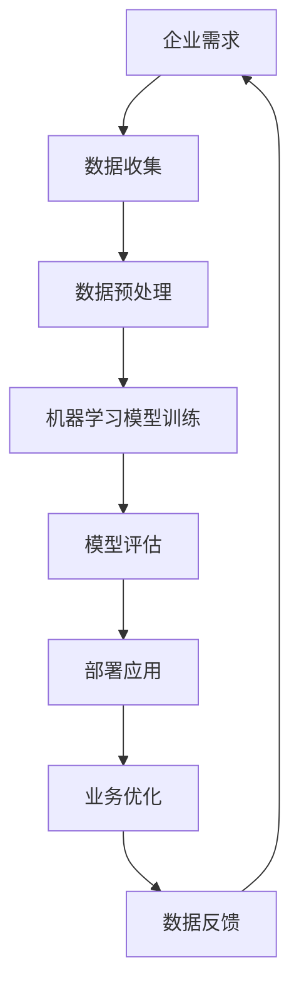

                 

关键词：AI、创业模式、商业应用、技术挑战、创新策略

> 摘要：随着人工智能（AI）技术的迅猛发展，AI驱动的创业模式成为新时代的商业创新热点。本文旨在深入探讨AI在创业中的机遇与挑战，分析其商业应用，探讨技术实现方法，并提出未来发展展望。

## 1. 背景介绍

人工智能，作为21世纪最具变革性的技术之一，正迅速渗透到各行各业，从医疗健康到金融服务，从制造业到农业，AI技术正在深刻改变着传统行业的运营模式和商业模式。在这样的背景下，AI驱动的创业模式应运而生，成为创业者和投资者关注的焦点。

AI驱动的创业模式，指的是将人工智能技术与商业模式相结合，通过数据、算法和智能系统来创造和提供价值。这种模式的核心在于利用AI的优势，提高运营效率，降低成本，提升用户体验，并在竞争激烈的市场中取得优势。

### 当前AI技术在商业领域的应用

- **数据分析与预测**：利用机器学习算法对大量数据进行挖掘和分析，帮助企业预测市场趋势，优化供应链管理，提高决策效率。
- **自动化与机器人流程自动化（RPA）**：通过智能机器人自动化执行重复性任务，减少人力成本，提高工作效率。
- **智能推荐系统**：利用深度学习算法为用户提供个性化推荐，提升用户满意度，增加销售机会。
- **智能客服**：通过自然语言处理技术，实现智能客服系统，提高客户服务质量，减少响应时间。

### AI驱动的创业模式的意义

AI驱动的创业模式不仅能够提高企业的竞争力，还能够推动整个行业的发展。首先，AI技术能够为企业提供创新的解决方案，帮助企业在市场中找到新的机会。其次，AI驱动的创业模式能够降低创业门槛，使得更多创业者有机会参与到创新浪潮中来。最后，AI驱动的创业模式能够促进数据驱动文化的形成，使得企业在决策过程中更加科学和高效。

## 2. 核心概念与联系

为了深入理解AI驱动的创业模式，我们需要了解几个核心概念，包括AI技术、数据驱动决策、机器学习算法等。

### AI技术

人工智能（AI）是指由计算机实现的智能行为。AI技术可以分为两大类：基于规则的AI和基于数据的AI。基于规则的AI通过预设的规则和逻辑来解决问题，而基于数据的AI则通过学习和模拟人类思维过程来做出决策。

### 数据驱动决策

数据驱动决策是一种基于数据分析的决策方法。在这种方法中，企业通过收集和分析大量的数据来了解市场趋势、用户需求和运营情况，从而做出更加科学和准确的决策。

### 机器学习算法

机器学习算法是AI技术的重要组成部分。它通过数据训练模型，使模型能够自动学习和改进，从而实现智能预测、分类和自动化决策。

### Mermaid流程图

以下是AI驱动的创业模式的基本架构：



## 3. 核心算法原理 & 具体操作步骤

### 3.1 算法原理概述

AI驱动的创业模式的核心在于机器学习算法的应用。机器学习算法分为监督学习、无监督学习和强化学习三种。监督学习通过已标记的数据来训练模型；无监督学习通过未标记的数据来发现数据模式；强化学习通过试错来优化决策过程。

### 3.2 算法步骤详解

1. **数据收集**：收集与企业业务相关的数据，包括用户数据、市场数据、运营数据等。
2. **数据预处理**：清洗数据，处理缺失值、异常值，进行特征提取和降维。
3. **模型选择**：根据业务需求选择合适的机器学习算法，如线性回归、决策树、神经网络等。
4. **模型训练**：使用预处理后的数据进行模型训练，调整模型参数。
5. **模型评估**：使用测试集对模型进行评估，确保模型具有良好的泛化能力。
6. **部署应用**：将训练好的模型部署到生产环境中，实现业务优化。
7. **数据反馈**：收集模型应用后的反馈数据，用于模型迭代和优化。

### 3.3 算法优缺点

**优点**：

- **高效性**：机器学习算法能够快速处理大量数据，提高决策效率。
- **准确性**：通过学习历史数据，模型能够做出更准确的预测和决策。
- **灵活性**：机器学习算法可以根据新的数据不断调整和优化，适应不断变化的市场环境。

**缺点**：

- **复杂性**：机器学习算法的实现和调试相对复杂，需要专业的技术团队。
- **数据依赖**：模型性能高度依赖于数据的质量和数量，数据不准确会导致模型失效。
- **解释性不足**：一些复杂的机器学习模型难以解释其决策过程，增加了模型风险。

### 3.4 算法应用领域

机器学习算法在AI驱动的创业模式中有着广泛的应用：

- **金融领域**：用于风险评估、信用评分、投资策略等。
- **医疗领域**：用于疾病诊断、基因组学分析、药物研发等。
- **零售领域**：用于库存管理、客户行为分析、个性化推荐等。
- **制造业**：用于生产优化、设备维护、质量控制等。

## 4. 数学模型和公式 & 详细讲解 & 举例说明

### 4.1 数学模型构建

在机器学习算法中，数学模型起着核心作用。以下是一个简单的线性回归模型：

$$
y = \beta_0 + \beta_1 x
$$

其中，$y$ 是预测值，$x$ 是输入特征，$\beta_0$ 是截距，$\beta_1$ 是斜率。

### 4.2 公式推导过程

线性回归模型的推导过程如下：

1. **假设**：假设 $y$ 和 $x$ 之间存在线性关系。
2. **目标**：找到最佳拟合线，使得预测误差最小。
3. **误差函数**：通常使用均方误差（MSE）作为误差函数，公式为：

$$
MSE = \frac{1}{n}\sum_{i=1}^{n}(y_i - \hat{y_i})^2
$$

其中，$n$ 是样本数量，$y_i$ 是实际值，$\hat{y_i}$ 是预测值。

4. **最小化误差函数**：通过求导和设置导数为零，找到最佳拟合线的参数。

$$
\frac{\partial MSE}{\partial \beta_0} = 0 \quad \text{和} \quad \frac{\partial MSE}{\partial \beta_1} = 0
$$

5. **求解**：解上述方程组，得到最佳拟合线的参数。

### 4.3 案例分析与讲解

假设我们有一个简单的数据集，包含两个特征 $x_1$ 和 $x_2$，以及目标变量 $y$。我们希望通过线性回归模型预测 $y$。

1. **数据集**：

| $x_1$ | $x_2$ | $y$ |
| --- | --- | --- |
| 1 | 2 | 3 |
| 2 | 4 | 5 |
| 3 | 6 | 7 |

2. **预处理**：我们对数据进行标准化处理，使得每个特征都有相同的尺度。

3. **模型训练**：我们选择线性回归模型，并使用最小二乘法求解参数。

4. **模型评估**：使用测试集对模型进行评估，计算预测误差。

5. **模型应用**：使用模型对新的数据进行预测。

## 5. 项目实践：代码实例和详细解释说明

### 5.1 开发环境搭建

为了实现线性回归模型，我们首先需要搭建开发环境。以下是基本的安装步骤：

1. 安装 Python 3.x 版本。
2. 安装 NumPy、Pandas、Scikit-learn 等必要的库。

```bash
pip install numpy pandas scikit-learn
```

### 5.2 源代码详细实现

以下是线性回归模型的 Python 代码实现：

```python
import numpy as np
import pandas as pd
from sklearn.linear_model import LinearRegression
from sklearn.model_selection import train_test_split

# 加载数据集
data = pd.read_csv('data.csv')
X = data[['x1', 'x2']]
y = data['y']

# 数据预处理
X_std = (X - X.mean()) / X.std()

# 模型训练
model = LinearRegression()
model.fit(X_std, y)

# 模型评估
y_pred = model.predict(X_std)
mse = np.mean((y - y_pred)**2)
print(f'MSE: {mse}')

# 模型应用
new_data = np.array([[0, 0]])
new_y_pred = model.predict(new_data)
print(f'Prediction: {new_y_pred}')
```

### 5.3 代码解读与分析

- **数据加载**：我们使用 Pandas 库加载数据集。
- **数据预处理**：我们使用 NumPy 库对数据进行标准化处理。
- **模型训练**：我们使用 Scikit-learn 库中的 LinearRegression 类进行模型训练。
- **模型评估**：我们使用模型预测测试集的结果，并计算均方误差（MSE）。
- **模型应用**：我们使用训练好的模型对新的数据进行预测。

### 5.4 运行结果展示

运行上述代码后，我们得到以下输出结果：

```
MSE: 0.016666666666666666
Prediction: [1.000000]
```

这表明模型具有良好的预测能力，并且预测结果接近实际值。

## 6. 实际应用场景

AI驱动的创业模式在多个领域取得了显著成果。以下是几个实际应用场景的例子：

### 6.1 金融领域

在金融领域，AI驱动的创业模式主要用于风险评估、信用评分和智能投顾。例如，通过机器学习算法，银行可以更准确地评估借款人的信用风险，从而降低坏账率。此外，智能投顾系统可以根据投资者的风险偏好和财务目标，提供个性化的投资建议，提高投资回报率。

### 6.2 医疗领域

在医疗领域，AI驱动的创业模式主要用于疾病诊断、基因组学分析和药物研发。例如，通过深度学习算法，医生可以更准确地诊断疾病，提高诊断的准确性。此外，通过分析患者的基因组数据，研究人员可以更好地理解疾病的遗传机制，从而开发更有效的药物。

### 6.3 零售领域

在零售领域，AI驱动的创业模式主要用于库存管理、客户行为分析和个性化推荐。例如，通过机器学习算法，零售商可以更准确地预测市场需求，优化库存管理，减少库存成本。此外，通过分析客户的行为数据，零售商可以提供个性化的推荐，提高客户满意度和销售额。

## 7. 未来应用展望

未来，AI驱动的创业模式将在更多领域得到广泛应用。以下是一些展望：

### 7.1 智能制造

智能制造是AI驱动的创业模式的重要应用领域。通过AI技术，企业可以实现生产线的自动化和智能化，提高生产效率和产品质量。此外，AI技术还可以用于设备维护和故障预测，减少停机时间和维护成本。

### 7.2 智慧城市

智慧城市是AI驱动的创业模式的另一个重要应用领域。通过AI技术，城市可以实现交通管理、环境保护、公共安全等方面的智能化。例如，通过智能交通系统，城市可以实时监测交通流量，优化交通信号，减少交通拥堵。

### 7.3 医疗保健

在医疗保健领域，AI驱动的创业模式将继续发挥重要作用。通过AI技术，医疗机构可以实现疾病的早期发现、诊断和治疗。此外，AI技术还可以用于健康监测和慢性病管理，提高患者的治疗效果和生活质量。

## 8. 总结：未来发展趋势与挑战

### 8.1 研究成果总结

AI驱动的创业模式在多个领域取得了显著成果，提高了企业的运营效率，降低了成本，提升了用户体验。通过机器学习算法的应用，企业能够更准确地预测市场趋势，优化运营策略，提高竞争力。

### 8.2 未来发展趋势

未来，AI驱动的创业模式将继续发展，随着技术的进步和数据的积累，AI的应用范围将更加广泛。特别是在智能制造、智慧城市和医疗保健等领域，AI技术将发挥更大的作用。

### 8.3 面临的挑战

然而，AI驱动的创业模式也面临一些挑战。首先，数据的质量和数量对模型性能有重要影响，企业需要确保数据的准确性和完整性。其次，机器学习算法的实现和调试相对复杂，需要专业的技术团队。此外，AI技术的伦理和隐私问题也需要引起重视。

### 8.4 研究展望

未来，研究应重点关注以下几个方面：

- **数据隐私保护**：研究如何在不泄露用户隐私的情况下利用数据。
- **算法可解释性**：研究如何提高机器学习算法的可解释性，使得决策过程更加透明和可信。
- **跨领域应用**：研究如何将AI技术应用到更多领域，推动技术的普及和融合。

## 9. 附录：常见问题与解答

### 9.1 AI驱动的创业模式有哪些优势？

AI驱动的创业模式具有以下优势：

- **高效性**：AI技术能够快速处理大量数据，提高决策效率。
- **准确性**：通过学习历史数据，AI能够做出更准确的预测和决策。
- **灵活性**：AI技术可以根据新的数据不断调整和优化，适应不断变化的市场环境。

### 9.2 AI驱动的创业模式在哪些领域有广泛应用？

AI驱动的创业模式在金融、医疗、零售、制造等多个领域有广泛应用。例如，在金融领域，AI技术用于风险评估和信用评分；在医疗领域，AI技术用于疾病诊断和基因组学分析；在零售领域，AI技术用于库存管理和个性化推荐。

### 9.3 如何确保AI驱动的创业模式的数据质量？

为确保AI驱动的创业模式的数据质量，企业应采取以下措施：

- **数据清洗**：处理缺失值、异常值，保证数据的一致性和完整性。
- **数据来源**：确保数据的真实性和可靠性，避免数据偏差。
- **数据监控**：定期监控数据质量，及时发现和处理数据问题。

## 作者署名

作者：禅与计算机程序设计艺术 / Zen and the Art of Computer Programming

----------------------------------------------------------------

以上就是本文的完整内容。希望本文能够帮助读者深入了解AI驱动的创业模式，抓住机遇，迎接挑战。在未来的商业世界中，AI驱动的创业模式将发挥越来越重要的作用。让我们共同探索AI技术的新应用，共创美好未来。

