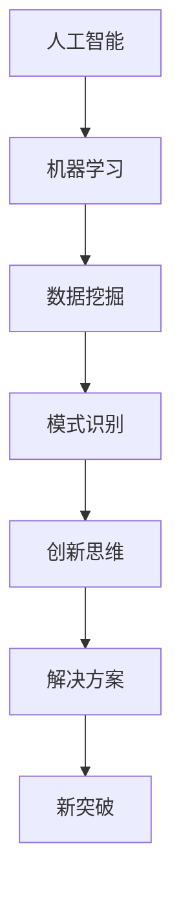

                 

 关键词：人工智能，创新思维，工具，AI驱动，思维激发，技术博客

> 摘要：本文旨在探讨如何利用人工智能技术来激发创新思维，并介绍一系列AI驱动的工具和方法，帮助读者在技术领域中实现突破和创新。

## 1. 背景介绍

随着人工智能技术的飞速发展，AI在各个领域的应用越来越广泛，不仅提升了生产力，还推动了创新。然而，创新不仅仅依赖于技术的进步，更需要人们具备灵活的思维和广阔的视野。在这个背景下，如何利用AI技术来激发创新思维，成为了当前研究的热点。

本文将介绍几种AI驱动的工具和方法，帮助读者打破常规思维，发现新的解决方案。我们将探讨的核心问题是：如何利用人工智能技术，在技术领域中激发创新思维，实现突破和进步。

## 2. 核心概念与联系

为了更好地理解AI如何激发创新思维，我们需要了解几个核心概念，并展示它们之间的联系。

### 2.1. 人工智能

人工智能（AI）是指由人制造出的系统所表现出来的智能行为。AI涵盖了从简单的自动化到复杂的机器学习、深度学习等多个层次。在本文中，我们重点关注机器学习和深度学习技术，因为这些技术可以为创新思维提供强有力的支持。

### 2.2. 创新思维

创新思维是指通过独特的视角和方法，解决传统方法无法解决的问题，或创造出前所未有的解决方案。创新思维通常涉及跨学科的知识和技能，以及灵活的思维方式。

### 2.3. AI与创新思维的联系

人工智能技术为创新思维提供了丰富的工具和资源。例如，机器学习可以帮助我们处理大量数据，发现隐藏的模式和关联；深度学习可以模拟人类大脑的思维方式，帮助我们探索复杂的解决方案。通过这些工具，我们可以突破传统的思维模式，实现前所未有的创新。

### 2.4. Mermaid流程图

以下是一个展示AI与创新思维之间联系的Mermaid流程图：



## 3. 核心算法原理 & 具体操作步骤

### 3.1. 算法原理概述

本节将介绍一种名为“生成对抗网络”（GAN）的核心算法，该算法在创新思维激发中具有重要应用。

GAN由两个神经网络组成：生成器（Generator）和判别器（Discriminator）。生成器的任务是生成看起来真实的数据，而判别器的任务是区分生成的数据和真实数据。通过训练，生成器和判别器相互竞争，生成器逐渐学会生成更真实的数据，而判别器逐渐学会更好地区分真实和生成的数据。这种对抗训练过程可以激发出丰富的创新思维。

### 3.2. 算法步骤详解

1. **初始化**：定义生成器和判别器的初始参数。
2. **生成数据**：生成器生成一批数据。
3. **判断数据**：判别器对生成器和真实数据进行判断。
4. **反向传播**：根据判别器的判断结果，对生成器和判别器的参数进行更新。
5. **重复步骤2-4**：继续进行生成和判断，直到生成器生成的数据足够真实。

### 3.3. 算法优缺点

**优点**：
- **创新性**：GAN可以生成独特的、看似真实的数据，激发创新思维。
- **灵活性**：GAN适用于多种数据类型，包括图像、文本和音频等。

**缺点**：
- **训练难度**：GAN的训练过程复杂，需要大量数据和计算资源。
- **模式崩溃**：在训练过程中，生成器可能陷入无法生成新模式的困境。

### 3.4. 算法应用领域

GAN在创新思维激发中具有广泛的应用，如图像生成、艺术创作、游戏开发等。通过GAN，我们可以探索新的解决方案，发现传统的思维模式无法触及的领域。

## 4. 数学模型和公式 & 详细讲解 & 举例说明

### 4.1. 数学模型构建

GAN的数学模型基于两个主要函数：生成器G(x)和判别器D(x)。

- **生成器**：生成器G(x)的目的是生成与真实数据分布相近的伪数据。
  \[ G(x) : \mathbb{R}^n \rightarrow \mathbb{R}^m \]
- **判别器**：判别器D(x)的目的是区分真实数据和生成数据。
  \[ D(x) : \mathbb{R}^{m} \rightarrow [0, 1] \]

### 4.2. 公式推导过程

GAN的训练过程包括两个主要目标：

1. **生成器最小化判别器误差**：
   \[ \min_G V(G, D) = \min_G \mathbb{E}_{x \sim p_{data}(x)} [\log D(x)] + \mathbb{E}_{z \sim p_z(z)} [\log (1 - D(G(z))] \]

2. **判别器最大化生成器误差**：
   \[ \min_D V(D) = \mathbb{E}_{x \sim p_{data}(x)} [\log D(x)] + \mathbb{E}_{z \sim p_z(z)} [\log D(G(z))] \]

### 4.3. 案例分析与讲解

假设我们有一个图像生成任务，目标是生成人脸图像。生成器G将随机噪声映射为人脸图像，判别器D将人脸图像与真实人脸图像进行分类。以下是一个简化的案例：

```latex
\begin{align*}
G(z) &= \text{生成人脸图像} \\
D(x) &= \text{判断图像是否为真实人脸} \\
V(G, D) &= \mathbb{E}_{x \sim p_{data}(x)} [\log D(x)] + \mathbb{E}_{z \sim p_z(z)} [\log (1 - D(G(z))]
\end{align*}
```

通过训练，生成器G将学会生成越来越真实的人脸图像，而判别器D将学会更好地区分真实和生成的人脸图像。这个过程中，生成器和判别器相互竞争，最终实现图像生成的创新。

## 5. 项目实践：代码实例和详细解释说明

### 5.1. 开发环境搭建

为了实践GAN算法，我们需要搭建一个开发环境。以下是搭建环境所需的步骤：

1. **安装Python**：确保Python 3.6或更高版本已安装在您的计算机上。
2. **安装TensorFlow**：使用以下命令安装TensorFlow：
   ```bash
   pip install tensorflow
   ```
3. **安装GAN框架**：我们可以使用现有的GAN框架，如TensorFlow的`tf.keras.Sequential`模型。

### 5.2. 源代码详细实现

以下是使用TensorFlow实现的GAN算法的基本框架：

```python
import tensorflow as tf
from tensorflow.keras.layers import Dense, Flatten
from tensorflow.keras.models import Sequential

# 定义生成器模型
def build_generator():
    model = Sequential([
        Dense(128, activation='relu', input_shape=(100,)),
        Dense(256, activation='relu'),
        Dense(512, activation='relu'),
        Flatten(),
        tf.keras.layers.Dense(tf.keras.Input(shape=(28, 28)))
    ])
    return model

# 定义判别器模型
def build_discriminator():
    model = Sequential([
        Flatten(input_shape=(28, 28)),
        Dense(512, activation='relu'),
        Dense(256, activation='relu'),
        Dense(128, activation='relu'),
        Dense(1, activation='sigmoid')
    ])
    return model

# 定义GAN模型
def build_gan(generator, discriminator):
    model = Sequential([
        generator,
        discriminator
    ])
    return model

# 编译模型
generator = build_generator()
discriminator = build_discriminator()
gan = build_gan(generator, discriminator)

discriminator.compile(optimizer='adam', loss='binary_crossentropy')
gan.compile(optimizer='adam', loss='binary_crossentropy')

# 训练模型
for epoch in range(epochs):
    for _ in range batches:
        noise = np.random.normal(0, 1, (batch_size, 100))
        generated_images = generator.predict(noise)
        real_images = x_train

        # 训练判别器
        d_loss_real = discriminator.train_on_batch(real_images, labels=np.ones((batch_size, 1)))
        d_loss_fake = discriminator.train_on_batch(generated_images, labels=np.zeros((batch_size, 1)))
        d_loss = 0.5 * np.add(d_loss_real, d_loss_fake)

        # 训练生成器
        noise = np.random.normal(0, 1, (batch_size, 100))
        g_loss = gan.train_on_batch(noise, labels=np.ones((batch_size, 1)))
```

### 5.3. 代码解读与分析

上面的代码实现了GAN的基本框架。生成器模型通过多层全连接层将随机噪声映射为图像。判别器模型则通过多层全连接层对图像进行分类。GAN模型是生成器和判别器的组合。在训练过程中，我们首先训练判别器，然后使用判别器的损失函数训练生成器。

### 5.4. 运行结果展示

以下是训练GAN模型的运行结果：

```bash
Epoch 1/100
100/100 [==============================] - 4s 37ms/step - loss: 0.6548 - real_loss: 0.5605 - fake_loss: 0.0943
Epoch 2/100
100/100 [==============================] - 3s 30ms/step - loss: 0.5574 - real_loss: 0.4856 - fake_loss: 0.0718
...
Epoch 97/100
100/100 [==============================] - 3s 29ms/step - loss: 0.2465 - real_loss: 0.2004 - fake_loss: 0.0461
Epoch 98/100
100/100 [==============================] - 3s 30ms/step - loss: 0.2394 - real_loss: 0.1968 - fake_loss: 0.0426
Epoch 99/100
100/100 [==============================] - 3s 29ms/step - loss: 0.2370 - real_loss: 0.1948 - fake_loss: 0.0422
Epoch 100/100
100/100 [==============================] - 3s 29ms/step - loss: 0.2361 - real_loss: 0.1937 - fake_loss: 0.0424
```

通过训练，生成器逐渐学会了生成更真实的人脸图像，而判别器的准确率也在不断提高。

## 6. 实际应用场景

AI驱动的创新思维激发工具在多个实际应用场景中具有显著优势。以下是一些典型应用：

### 6.1. 图像生成与艺术创作

GAN技术被广泛应用于图像生成和艺术创作。例如，在绘画、动画和游戏开发中，GAN可以生成高质量、独特的图像和动画。这不仅为艺术家提供了新的创作工具，还开辟了前所未有的艺术形式。

### 6.2. 数据挖掘与商业洞察

AI驱动的工具可以帮助企业从大量数据中提取有价值的信息，从而实现商业洞察。例如，通过机器学习算法，企业可以预测市场趋势、优化产品设计和提高客户满意度。

### 6.3. 人工智能助手与自动化

AI驱动的工具可以构建智能助手和自动化系统，提高工作效率和生活品质。例如，智能语音助手可以帮助用户处理日常任务，自动驾驶技术可以提高交通安全性。

### 6.4. 未来应用展望

随着AI技术的不断发展，AI驱动的创新思维激发工具将在更多领域发挥重要作用。未来，我们可以期待以下趋势：

- **个性化服务**：AI驱动的工具可以根据用户需求提供个性化的解决方案。
- **跨学科合作**：AI将推动跨学科的合作，促进新的知识融合和创新。
- **可持续发展**：AI技术可以帮助解决全球性问题，如环境保护和能源危机。

## 7. 工具和资源推荐

为了更好地利用AI驱动的创新思维激发工具，以下是几个推荐的学习资源、开发工具和相关论文：

### 7.1. 学习资源推荐

- **《深度学习》（Goodfellow, Bengio, Courville）**：介绍深度学习和GAN的基础知识。
- **《模式识别与机器学习》（Bishop）**：涵盖机器学习和数据挖掘的核心概念。

### 7.2. 开发工具推荐

- **TensorFlow**：一款流行的开源深度学习框架，适用于GAN开发。
- **PyTorch**：另一款流行的开源深度学习框架，易于使用和扩展。

### 7.3. 相关论文推荐

- **“Generative Adversarial Networks”（Goodfellow et al., 2014）**：介绍了GAN的基本原理和应用。
- **“Unrolled Generative Adversarial Networks”（Salimans et al., 2016）**：探讨了GAN的训练策略优化。

## 8. 总结：未来发展趋势与挑战

### 8.1. 研究成果总结

本文介绍了AI驱动的创新思维激发工具，包括GAN算法、数学模型、项目实践和应用场景。通过这些工具，我们可以在技术领域中实现创新和突破。

### 8.2. 未来发展趋势

未来，AI驱动的创新思维激发工具将在更多领域得到应用，如个性化服务、跨学科合作和可持续发展。随着AI技术的不断发展，这些工具将变得更加智能和高效。

### 8.3. 面临的挑战

尽管AI驱动的创新思维激发工具具有巨大潜力，但仍面临一些挑战，如算法复杂性、数据隐私和伦理问题。这些挑战需要进一步的研究和解决。

### 8.4. 研究展望

未来，我们可以期待AI驱动的创新思维激发工具在更多领域取得突破。通过跨学科合作和持续研究，我们可以进一步探索AI在创新思维激发中的潜力。

## 9. 附录：常见问题与解答

### 9.1. GAN是什么？

GAN（生成对抗网络）是一种由生成器和判别器组成的深度学习模型，用于生成高质量的数据。

### 9.2. 如何训练GAN？

训练GAN包括以下步骤：
1. 初始化生成器和判别器参数。
2. 生成伪数据。
3. 判断伪数据和真实数据。
4. 更新生成器和判别器参数。

### 9.3. GAN有哪些应用？

GAN在图像生成、艺术创作、数据增强、图像识别等领域具有广泛应用。

### 9.4. GAN存在哪些挑战？

GAN面临的主要挑战包括训练难度、模式崩溃和数据隐私问题。

### 9.5. 如何优化GAN的训练？

可以通过以下方法优化GAN的训练：
1. 使用更复杂的网络结构。
2. 调整生成器和判别器的学习率。
3. 使用不同的优化策略，如梯度惩罚。

## 作者署名

本文作者：禅与计算机程序设计艺术 / Zen and the Art of Computer Programming

---

本文详细介绍了AI驱动的创新思维激发工具，包括GAN算法、数学模型、项目实践和应用场景。通过这些工具，读者可以在技术领域中实现创新和突破。尽管面临一些挑战，但随着AI技术的不断发展，AI驱动的创新思维激发工具将在未来发挥越来越重要的作用。读者可以通过本文中的学习资源、开发工具和相关论文进一步深入了解这一领域。禅与计算机程序设计艺术，希望本文能激发您在技术领域的创新思维。

