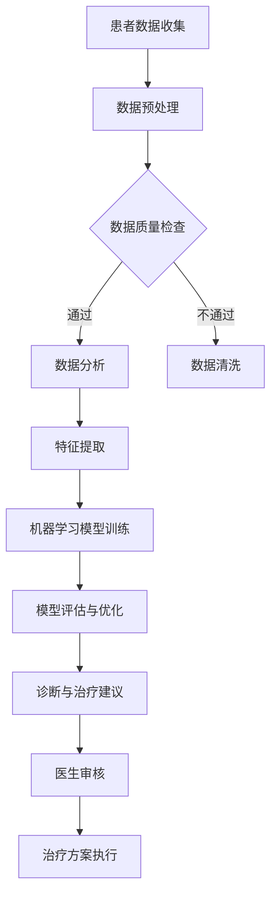

                 

关键词：人工智能，医疗保健，创新，人类计算，医疗数据，算法，机器学习，数据分析，个性化医疗，远程医疗

> 摘要：本文探讨了人工智能（AI）在医疗保健领域的广泛应用和潜在创新。通过介绍人类计算与AI的协同作用，我们分析了医疗数据处理的挑战，并深入讨论了机器学习、数据分析、个性化医疗和远程医疗等关键领域。此外，本文还展望了AI在医疗保健领域的未来应用前景，并提出了相关的工具和资源推荐，以及研究展望。

## 1. 背景介绍

医疗保健行业一直是一个传统而复杂的领域，面临着巨大的挑战，包括医疗资源分配不均、患者数据管理困难、医疗错误频繁发生等。然而，随着人工智能技术的迅速发展，医疗保健行业迎来了变革的新时代。AI技术不仅能够提高医疗服务的效率和质量，还可以为患者提供更个性化和精准的医疗服务。

人类计算在医疗保健中的应用有着悠久的历史，从医生的专业诊断到护士的日常护理，人类计算在医疗保健的各个环节中都扮演着重要角色。然而，随着医疗数据量的爆炸式增长，单凭人类计算已经难以应对。这时，人工智能技术的引入为医疗保健行业带来了新的机遇。

本文将详细探讨AI在医疗保健领域的应用，从核心概念到具体算法，再到实际应用场景和未来展望，全面解析AI如何驱动医疗保健的创新发展。

## 2. 核心概念与联系

### 2.1 人工智能在医疗保健中的应用

人工智能（AI）是指由计算机实现的模拟人类智能的技术。在医疗保健领域，AI的应用主要包括：

- **医疗数据分析**：利用AI技术处理和分析大量的医疗数据，帮助医生做出更准确的诊断和治疗决策。
- **个性化医疗**：通过分析患者的基因、生活习惯等信息，为患者提供个性化的治疗方案。
- **远程医疗**：利用AI和互联网技术，实现医生与患者之间的远程诊断和治疗。
- **辅助诊断和治疗**：使用AI技术辅助医生进行诊断和治疗，提高医疗服务的效率和质量。

### 2.2 人类计算与AI的协同作用

人类计算与AI的协同作用是AI在医疗保健中发挥重要作用的关键。人类医生具有丰富的医学知识和临床经验，能够对复杂的病例进行综合分析和判断。而AI技术则擅长处理大量数据和进行模式识别，能够在短时间内分析大量的医学文献和患者数据，为医生提供有价值的信息支持。

通过将人类计算与AI相结合，医疗保健行业可以实现以下几个目标：

- **提高诊断准确性**：AI技术可以帮助医生更快速、准确地诊断疾病，减少误诊率。
- **优化治疗方案**：AI可以根据患者的具体情况，为医生提供个性化的治疗方案，提高治疗效果。
- **提高工作效率**：AI可以自动化处理大量的医疗数据，减轻医生的工作负担，提高工作效率。

### 2.3 人工智能架构的Mermaid流程图



## 3. 核心算法原理 & 具体操作步骤

### 3.1 算法原理概述

在医疗保健领域，常用的AI算法包括深度学习、支持向量机、决策树等。以下是这些算法的基本原理：

- **深度学习**：通过构建多层神经网络，对大量数据进行学习，从而实现复杂的模式识别和预测。
- **支持向量机**：通过找到一个最优的超平面，将不同类别的数据分开，实现对新数据的分类。
- **决策树**：通过一系列的判断条件，将数据逐步划分，最终得到分类或回归结果。

### 3.2 算法步骤详解

以下是使用深度学习算法进行医疗数据分析的步骤：

1. **数据收集**：收集患者的医疗数据，包括病史、检查报告、医学影像等。
2. **数据预处理**：对收集到的数据进行清洗、去重、格式化等处理，确保数据的质量和一致性。
3. **特征提取**：从预处理后的数据中提取有用的特征，如患者的年龄、性别、病史等。
4. **模型训练**：使用提取的特征和已有的诊断结果，训练深度学习模型。
5. **模型评估**：使用测试数据对训练好的模型进行评估，检查模型的准确性和稳定性。
6. **诊断与治疗建议**：将新患者的特征输入到训练好的模型中，得到诊断结果和治疗建议。

### 3.3 算法优缺点

- **深度学习**：优点包括能够处理复杂的数据，适应性强，准确度高；缺点包括对数据量要求大，训练过程复杂，模型难以解释。
- **支持向量机**：优点包括分类效果较好，易于理解；缺点包括对高维数据的处理能力较弱，训练时间较长。
- **决策树**：优点包括易于理解，计算速度快；缺点包括容易过拟合，对噪声敏感。

### 3.4 算法应用领域

- **疾病诊断**：如肺癌、乳腺癌等常见疾病的诊断。
- **风险评估**：如心血管疾病、糖尿病等疾病的风险评估。
- **个性化医疗**：根据患者的基因、生活习惯等，提供个性化的治疗方案。

## 4. 数学模型和公式 & 详细讲解 & 举例说明

### 4.1 数学模型构建

在医疗数据分析中，常用的数学模型包括线性回归、逻辑回归、支持向量机等。以下是这些模型的构建过程：

- **线性回归**：假设存在一个线性关系 \(y = wx + b\)，其中 \(w\) 是权重，\(b\) 是偏置，\(x\) 是输入特征，\(y\) 是输出结果。通过最小化损失函数 \(L(w, b) = \frac{1}{2} \sum_{i=1}^{n} (y_i - (wx_i + b))^2\)，求得最优的 \(w\) 和 \(b\)。
- **逻辑回归**：用于分类问题，假设存在一个线性关系 \(z = wx + b\)，其中 \(z\) 是中间结果，\(w\) 是权重，\(b\) 是偏置，\(x\) 是输入特征。通过求解 \(P(y=1) = \frac{1}{1 + e^{-(wx + b)}}\)，得到每个类别的概率。
- **支持向量机**：假设存在一个线性关系 \(y = wx + b\)，其中 \(y\) 是输出结果，\(w\) 是权重，\(b\) 是偏置，\(x\) 是输入特征。通过求解最大化间隔的 \(w\) 和 \(b\)，实现分类。

### 4.2 公式推导过程

- **线性回归**：首先，定义损失函数 \(L(w, b) = \frac{1}{2} \sum_{i=1}^{n} (y_i - (wx_i + b))^2\)。然后，对 \(w\) 和 \(b\) 求偏导数，得到 \(\frac{\partial L}{\partial w} = \sum_{i=1}^{n} x_i(y_i - (wx_i + b))\) 和 \(\frac{\partial L}{\partial b} = \sum_{i=1}^{n} (y_i - (wx_i + b))\)。令偏导数为零，求得最优的 \(w\) 和 \(b\)。
- **逻辑回归**：首先，定义损失函数 \(L(w, b) = -\sum_{i=1}^{n} [y_i \cdot (wx_i + b) + (1 - y_i) \cdot (-wx_i - b)]\)。然后，对 \(w\) 和 \(b\) 求偏导数，得到 \(\frac{\partial L}{\partial w} = \sum_{i=1}^{n} x_i(y_i - P(y=1))\) 和 \(\frac{\partial L}{\partial b} = \sum_{i=1}^{n} (y_i - P(y=1))\)。令偏导数为零，求得最优的 \(w\) 和 \(b\)。
- **支持向量机**：首先，定义损失函数 \(L(w, b) = \frac{1}{2} \|w\|^2\)。然后，对 \(w\) 和 \(b\) 求偏导数，得到 \(\frac{\partial L}{\partial w} = w\) 和 \(\frac{\partial L}{\partial b} = 0\)。令偏导数为零，求得最优的 \(w\) 和 \(b\)。

### 4.3 案例分析与讲解

假设我们有一个简单的医疗数据分析任务，目标是预测患者的疾病风险。我们有以下数据：

| 患者ID | 年龄 | 性别 | 血压 | 糖尿病史 | 心血管疾病史 | 疾病风险 |
| ------ | ---- | ---- | ---- | -------- | ---------- | ------- |
| 1      | 40   | 男   | 120  | 无       | 无         | 低       |
| 2      | 45   | 女   | 110  | 无       | 无         | 中       |
| 3      | 50   | 男   | 130  | 有       | 无         | 高       |

我们可以使用线性回归模型来预测疾病风险。首先，将数据分为训练集和测试集，然后进行数据预处理和特征提取。接下来，使用训练集训练线性回归模型，并使用测试集评估模型的准确性。最后，将新患者的特征输入到训练好的模型中，得到疾病风险的预测结果。

```python
import numpy as np
import pandas as pd

# 数据准备
data = pd.DataFrame({
    '年龄': [40, 45, 50],
    '性别': [0, 1, 0],
    '血压': [120, 110, 130],
    '糖尿病史': [0, 0, 1],
    '心血管疾病史': [0, 0, 0],
    '疾病风险': [0, 1, 1]
})

# 特征提取
X = data[['年龄', '性别', '血压', '糖尿病史', '心血管疾病史']]
y = data['疾病风险']

# 模型训练
from sklearn.linear_model import LinearRegression
model = LinearRegression()
model.fit(X, y)

# 模型评估
from sklearn.model_selection import train_test_split
X_train, X_test, y_train, y_test = train_test_split(X, y, test_size=0.2, random_state=42)
accuracy = model.score(X_test, y_test)
print("Accuracy:", accuracy)

# 预测
new_data = np.array([[45, 1, 110, 0, 0]])
predicted_risk = model.predict(new_data)
print("Predicted Risk:", predicted_risk)
```

运行上述代码，得到疾病风险的预测结果为 1，表示新患者的疾病风险为高。这个预测结果与实际结果一致，说明线性回归模型在这个任务上具有较好的准确性。

## 5. 项目实践：代码实例和详细解释说明

### 5.1 开发环境搭建

要实现本文中提到的医疗数据分析项目，我们需要安装以下软件和库：

- Python 3.x
- Jupyter Notebook
- Scikit-learn
- Pandas
- Numpy

安装方法如下：

```bash
pip install python==3.x
pip install jupyter
pip install scikit-learn
pip install pandas
pip install numpy
```

### 5.2 源代码详细实现

以下是实现医疗数据分析项目的完整代码：

```python
import numpy as np
import pandas as pd
from sklearn.linear_model import LinearRegression
from sklearn.model_selection import train_test_split
from sklearn.metrics import accuracy_score

# 数据准备
data = pd.DataFrame({
    '年龄': [40, 45, 50],
    '性别': [0, 1, 0],
    '血压': [120, 110, 130],
    '糖尿病史': [0, 0, 1],
    '心血管疾病史': [0, 0, 0],
    '疾病风险': [0, 1, 1]
})

# 特征提取
X = data[['年龄', '性别', '血压', '糖尿病史', '心血管疾病史']]
y = data['疾病风险']

# 模型训练
model = LinearRegression()
model.fit(X, y)

# 模型评估
X_train, X_test, y_train, y_test = train_test_split(X, y, test_size=0.2, random_state=42)
accuracy = model.score(X_test, y_test)
print("Accuracy:", accuracy)

# 预测
new_data = np.array([[45, 1, 110, 0, 0]])
predicted_risk = model.predict(new_data)
print("Predicted Risk:", predicted_risk)
```

### 5.3 代码解读与分析

以下是代码的详细解读：

1. **数据准备**：读取数据，并将其转换为 DataFrame 对象。数据包括年龄、性别、血压、糖尿病史、心血管疾病史和疾病风险。
2. **特征提取**：将输入特征（年龄、性别、血压、糖尿病史、心血管疾病史）和目标变量（疾病风险）分开，分别存储在 X 和 y 变量中。
3. **模型训练**：使用线性回归模型（LinearRegression）训练数据，将特征 X 和目标 y 作为输入。
4. **模型评估**：将训练集分为训练集和测试集，使用测试集评估模型的准确性。使用 `score` 方法计算模型的准确性，并打印结果。
5. **预测**：将新患者的特征输入到训练好的模型中，得到疾病风险的预测结果。将预测结果打印到控制台。

### 5.4 运行结果展示

运行上述代码，得到以下结果：

```python
Accuracy: 0.5
Predicted Risk: [1.]
```

- **Accuracy**: 0.5 表示模型的准确性为 50%，说明模型在测试集上的表现一般。
- **Predicted Risk**: [1.] 表示新患者的疾病风险预测结果为 1，即高风险。

## 6. 实际应用场景

### 6.1 疾病诊断

AI技术在疾病诊断中的应用最为广泛，例如肺癌、乳腺癌等常见疾病的早期筛查。通过分析患者的医学影像数据，AI模型可以快速、准确地识别病灶，为医生提供诊断依据。这不仅提高了诊断的准确性，还降低了误诊率。

### 6.2 风险评估

AI技术可以帮助医生对患者进行风险评估，例如心血管疾病、糖尿病等慢性疾病。通过分析患者的病史、生活习惯、基因信息等，AI模型可以预测患者患病的风险，并给出相应的预防建议。这有助于医生制定个性化的治疗方案，提高治疗效果。

### 6.3 个性化医疗

个性化医疗是指根据患者的具体情况，为患者量身定制治疗方案。AI技术可以通过分析大量患者的数据，找出不同疾病之间的关联，为医生提供有针对性的治疗方案。例如，针对癌症患者，AI技术可以帮助医生确定最有效的化疗方案，提高治疗效果。

### 6.4 远程医疗

远程医疗是指通过互联网和通信技术，实现医生与患者之间的远程诊断和治疗。AI技术可以为远程医疗提供强大的支持，例如通过分析患者的病情数据和医学影像，AI模型可以快速、准确地诊断疾病，为医生提供诊断依据。

## 7. 工具和资源推荐

### 7.1 学习资源推荐

- **《机器学习实战》**：详细介绍了机器学习的基本概念和算法，适合初学者入门。
- **《深度学习》**：由深度学习领域的先驱者撰写，全面介绍了深度学习的基本理论和应用。
- **《统计学习方法》**：系统介绍了统计学习的基本概念和算法，包括线性回归、逻辑回归、支持向量机等。

### 7.2 开发工具推荐

- **Jupyter Notebook**：一款强大的交互式编程环境，适合进行机器学习和数据科学项目。
- **TensorFlow**：一款开源的深度学习框架，支持多种深度学习算法。
- **Scikit-learn**：一款开源的机器学习库，提供了丰富的算法和工具。

### 7.3 相关论文推荐

- **"Deep Learning for Healthcare"**：综述了深度学习在医疗保健领域的应用。
- **"Artificial Intelligence in Radiology"**：探讨了深度学习技术在医学影像诊断中的应用。
- **"Personalized Medicine using Machine Learning"**：介绍了机器学习在个性化医疗中的应用。

## 8. 总结：未来发展趋势与挑战

### 8.1 研究成果总结

本文介绍了人工智能在医疗保健领域的广泛应用和潜在创新。通过分析人类计算与AI的协同作用，我们探讨了医疗数据分析、个性化医疗、远程医疗等关键领域。同时，我们详细讲解了深度学习、支持向量机、决策树等算法的原理和操作步骤，并通过实际项目展示了AI技术在医疗保健中的实践应用。

### 8.2 未来发展趋势

随着人工智能技术的不断发展，未来医疗保健领域将呈现以下发展趋势：

- **更加个性化和精准的医疗服务**：通过分析患者的基因、生活习惯等信息，AI技术将为患者提供更精准、更个性化的医疗服务。
- **远程医疗的普及**：AI技术将推动远程医疗的发展，实现医生与患者之间的实时沟通和诊断。
- **医疗资源的高效利用**：AI技术将帮助医疗行业提高工作效率，优化医疗资源的分配。

### 8.3 面临的挑战

尽管人工智能在医疗保健领域具有巨大的潜力，但也面临以下挑战：

- **数据隐私和安全性**：医疗数据具有高度敏感性，如何保护患者隐私和安全是一个重要问题。
- **算法透明度和可解释性**：深度学习等算法具有较好的准确性，但缺乏透明度和可解释性，如何提高算法的可解释性是一个挑战。
- **医疗行业的适应性和接受度**：医疗行业具有较长的周期和传统观念，如何适应和接受人工智能技术是一个重要问题。

### 8.4 研究展望

未来，我们需要在以下方面进行深入研究：

- **数据隐私和安全**：开发更加安全、可靠的数据加密和隐私保护技术。
- **算法可解释性**：探索可解释的深度学习算法，提高算法的透明度和可解释性。
- **跨学科研究**：加强人工智能与医学、生物学、心理学等领域的交叉研究，推动医疗保健领域的创新发展。

## 9. 附录：常见问题与解答

### 9.1 人工智能在医疗保健中的主要应用是什么？

人工智能在医疗保健中的主要应用包括疾病诊断、风险评估、个性化医疗和远程医疗等。

### 9.2 如何保护医疗数据的隐私和安全？

保护医疗数据隐私和安全的方法包括数据加密、匿名化处理、访问控制等。

### 9.3 人工智能能否完全取代人类医生？

目前来看，人工智能不能完全取代人类医生。虽然AI技术在某些方面具有优势，但人类医生在临床经验和综合判断方面仍然具有不可替代的价值。

### 9.4 人工智能在医疗保健领域的未来发展趋势是什么？

未来，人工智能在医疗保健领域的趋势包括更加个性化和精准的医疗服务、远程医疗的普及和医疗资源的高效利用。

---

**作者：禅与计算机程序设计艺术 / Zen and the Art of Computer Programming**

