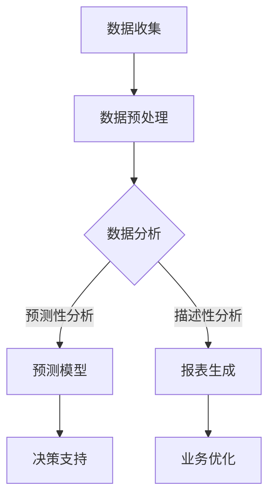

                 

关键词：人工智能，商业应用，创新趋势，人类计算，数据驱动，算法优化，技术架构，行业洞察

> 摘要：本文深入探讨了人工智能在商业领域中的新趋势，分析了人类计算与AI结合带来的创新效应，以及这一过程中的技术挑战和未来方向。通过详述AI驱动的核心算法原理、数学模型、实际应用案例以及工具和资源推荐，本文旨在为读者提供一幅全面的AI商业应用蓝图。

## 1. 背景介绍

在过去的几十年里，人工智能（AI）经历了从理论到实践的重大变革。随着计算能力的提升、大数据的普及以及算法的进步，AI技术逐渐渗透到各个行业，从简单的自动化工具发展为具备自主决策能力的高级系统。商业领域也不例外，AI正在成为企业提升效率、降低成本、增强竞争力的关键驱动力。

人类计算，即人类智能与计算技术的结合，是推动AI应用创新的重要力量。通过将人类智能的创造力与计算技术的精确性相结合，AI可以在商业决策中提供更加智能化、个性化的解决方案。例如，在金融服务中，AI可以用于风险管理、欺诈检测和个性化投资建议；在零售业，AI可以帮助实现精准营销和库存优化。

本文将围绕以下几个方面展开讨论：

1. 核心概念与联系
2. 核心算法原理 & 具体操作步骤
3. 数学模型和公式 & 详细讲解 & 举例说明
4. 项目实践：代码实例和详细解释说明
5. 实际应用场景
6. 未来应用展望
7. 工具和资源推荐
8. 总结：未来发展趋势与挑战

通过以上内容的探讨，我们希望为读者呈现一幅AI驱动的商业创新全景图。

## 2. 核心概念与联系

在深入探讨AI在商业中的应用之前，我们需要先了解几个核心概念，这些概念构成了AI技术的基本架构。

### 2.1 机器学习

机器学习是AI的核心组成部分，它使计算机系统能够从数据中学习并做出预测或决策。机器学习主要包括监督学习、无监督学习和强化学习三种类型。

- **监督学习**：系统通过学习标记好的训练数据来建立预测模型，如分类和回归问题。
- **无监督学习**：系统在没有标记数据的情况下，自动发现数据中的模式和结构，如聚类和降维。
- **强化学习**：系统通过与环境的交互来学习策略，以最大化累积奖励，常用于游戏和机器人控制等领域。

### 2.2 深度学习

深度学习是机器学习的一个分支，通过多层神经网络来提取数据特征。深度学习在图像识别、语音识别和自然语言处理等领域取得了显著成就。

- **卷积神经网络（CNN）**：适用于处理图像数据，能够自动提取图像中的层次结构。
- **循环神经网络（RNN）**：适用于处理序列数据，如时间序列和文本。
- **生成对抗网络（GAN）**：用于生成与真实数据相似的新数据，如生成虚假新闻图像。

### 2.3 自然语言处理（NLP）

自然语言处理是AI技术中另一个重要领域，它使计算机能够理解和处理人类语言。NLP在智能客服、情感分析和文本挖掘等领域具有广泛应用。

- **词向量表示**：将词汇映射到高维空间，以捕捉词汇的语义关系。
- **序列标注**：对文本序列进行分类或标注，如命名实体识别和词性标注。
- **语言模型**：用于预测文本中的下一个单词或句子，如语音识别和机器翻译。

### 2.4 数据分析

数据分析是商业决策的关键环节，它通过统计方法和算法对大量数据进行分析，以发现数据中的模式和关联。

- **数据预处理**：清洗、整合和转换数据，使其适合分析。
- **描述性分析**：计算数据的基本统计指标，如均值、方差和相关性。
- **预测性分析**：建立预测模型，如时间序列预测和分类预测。

### 2.5 人工智能与商业的结合

人工智能与商业的结合主要体现在以下几个方面：

- **决策支持**：AI可以帮助企业进行数据分析、预测和决策，提高决策效率和准确性。
- **自动化**：AI可以自动化重复性高的工作，降低人力成本和提高生产效率。
- **个性化**：AI可以根据用户行为和偏好提供个性化服务，增强用户体验。
- **创新**：AI可以激发新的商业模式和产品创新，为企业带来竞争优势。

### 2.6 Mermaid 流程图

以下是一个简单的Mermaid流程图，展示了AI在商业中的应用流程：



通过这个流程图，我们可以清晰地看到AI技术在商业应用中的关键步骤和相互关系。

## 3. 核心算法原理 & 具体操作步骤

### 3.1 算法原理概述

AI驱动的商业应用依赖于多种算法，其中一些核心算法包括机器学习算法、深度学习算法和自然语言处理算法。以下将分别介绍这些算法的基本原理。

### 3.2 机器学习算法

机器学习算法的核心思想是通过学习已有数据来预测新数据。常见的机器学习算法包括线性回归、逻辑回归、决策树、随机森林和支持向量机（SVM）等。

- **线性回归**：通过拟合一条直线来预测连续值输出。
- **逻辑回归**：通过拟合一个逻辑函数来预测分类问题。
- **决策树**：通过一系列规则来对数据进行分类或回归。
- **随机森林**：通过构建多个决策树并集成它们的预测结果来提高准确性。
- **支持向量机**：通过找到一个最佳的超平面来对数据进行分类。

### 3.3 深度学习算法

深度学习算法通过多层神经网络来提取数据特征，从而实现高级的预测和分类任务。常见的深度学习算法包括卷积神经网络（CNN）、循环神经网络（RNN）和生成对抗网络（GAN）等。

- **卷积神经网络（CNN）**：通过卷积层、池化层和全连接层来提取图像特征。
- **循环神经网络（RNN）**：通过隐藏状态和循环连接来处理序列数据。
- **生成对抗网络（GAN）**：通过生成器和判别器的对抗训练来生成新数据。

### 3.4 自然语言处理算法

自然语言处理算法旨在使计算机能够理解和处理人类语言。常见的NLP算法包括词向量表示、序列标注和语言模型等。

- **词向量表示**：通过将词汇映射到高维空间来捕捉词汇的语义关系。
- **序列标注**：通过对文本序列进行分类或标注来识别实体和词性。
- **语言模型**：通过计算下一个单词或句子的概率来预测语言序列。

### 3.5 算法步骤详解

以下是一个简单的机器学习算法的步骤详解，以线性回归为例：

#### 3.5.1 数据收集

首先，我们需要收集训练数据。这些数据应该包括输入特征（x）和输出目标（y）。例如，如果我们想要预测房价，输入特征可以是房屋面积、房间数量等，输出目标则是实际房价。

#### 3.5.2 数据预处理

在训练之前，我们需要对数据进行预处理，包括数据清洗、特征工程和归一化等步骤。数据清洗的目的是去除无效数据和缺失值，特征工程则是通过选择和转换特征来提高模型的性能，归一化则是将数据缩放到相同的范围。

#### 3.5.3 模型训练

接下来，我们使用训练数据来训练线性回归模型。这通常涉及到以下步骤：

1. **初始化参数**：随机初始化模型的参数，如权重（w）和偏置（b）。
2. **前向传播**：计算输入数据的预测值。
3. **损失函数**：计算预测值与实际值之间的差距，常用的损失函数包括均方误差（MSE）和交叉熵损失。
4. **反向传播**：通过梯度下降算法来更新模型的参数。
5. **迭代训练**：重复上述步骤，直到模型收敛或达到预设的迭代次数。

#### 3.5.4 模型评估

在模型训练完成后，我们需要对模型进行评估。这通常通过测试数据集来进行，常用的评估指标包括准确率、召回率、F1分数和均方误差等。

#### 3.5.5 模型应用

最后，我们可以将训练好的模型应用到新的数据上，以进行预测。例如，我们可以使用模型来预测新的房屋价格。

### 3.6 算法优缺点

以下是几种常见算法的优缺点：

- **线性回归**：简单、易于实现，但在处理非线性问题时效果不佳。
- **决策树**：易于理解，但在处理大规模数据和存在噪声的数据时效果较差。
- **随机森林**：能够处理大规模数据和噪声数据，但计算成本较高。
- **支持向量机**：在处理高维数据时性能较好，但训练时间较长。
- **卷积神经网络**：能够自动提取图像特征，但在处理文本数据时效果较差。
- **循环神经网络**：能够处理序列数据，但计算成本较高。
- **生成对抗网络**：能够生成高质量的新数据，但在训练过程中容易出现模式崩溃问题。

### 3.7 算法应用领域

不同算法在商业领域中的应用各有侧重：

- **机器学习算法**：在金融服务、零售业和医疗保健等领域广泛应用，用于风险评估、精准营销和疾病预测等。
- **深度学习算法**：在图像识别、语音识别和自然语言处理等领域具有广泛的应用，如自动驾驶、智能客服和机器翻译等。
- **自然语言处理算法**：在智能客服、文本挖掘和社交媒体分析等领域具有广泛应用。

## 4. 数学模型和公式 & 详细讲解 & 举例说明

### 4.1 数学模型构建

在AI驱动的商业应用中，数学模型是核心工具。以下将介绍几种常见的数学模型，包括线性回归、逻辑回归和决策树。

#### 4.1.1 线性回归

线性回归模型用于预测连续值输出，其数学模型可以表示为：

\[ y = w_1 \cdot x_1 + w_2 \cdot x_2 + \ldots + w_n \cdot x_n + b \]

其中，\( y \) 是输出目标，\( x_1, x_2, \ldots, x_n \) 是输入特征，\( w_1, w_2, \ldots, w_n \) 是权重，\( b \) 是偏置。

#### 4.1.2 逻辑回归

逻辑回归模型用于预测分类问题，其数学模型可以表示为：

\[ P(y=1) = \frac{1}{1 + e^{-(w_0 + w_1 \cdot x_1 + w_2 \cdot x_2 + \ldots + w_n \cdot x_n)}} \]

其中，\( P(y=1) \) 是输出为1的概率，其他符号含义与线性回归相同。

#### 4.1.3 决策树

决策树模型通过一系列规则对数据进行分类或回归。其数学模型可以表示为：

\[ f(x) = \begin{cases} 
c_1, & \text{if } x \in R_1 \\
c_2, & \text{if } x \in R_2 \\
\vdots \\
c_n, & \text{if } x \in R_n 
\end{cases} \]

其中，\( f(x) \) 是输出结果，\( R_1, R_2, \ldots, R_n \) 是决策树的分支。

### 4.2 公式推导过程

以下分别介绍线性回归和逻辑回归的公式推导过程。

#### 4.2.1 线性回归

假设我们已经收集了训练数据集 \( D = \{(x_1, y_1), (x_2, y_2), \ldots, (x_n, y_n)\} \)，我们的目标是最小化损失函数 \( J(w, b) \)：

\[ J(w, b) = \frac{1}{2n} \sum_{i=1}^{n} (y_i - (w_1 \cdot x_{i1} + w_2 \cdot x_{i2} + \ldots + w_n \cdot x_{in} + b))^2 \]

为了求解最优的 \( w \) 和 \( b \)，我们可以使用梯度下降算法。首先，计算损失函数关于 \( w \) 和 \( b \) 的梯度：

\[ \nabla_w J(w, b) = \frac{1}{n} \sum_{i=1}^{n} (y_i - (w_1 \cdot x_{i1} + w_2 \cdot x_{i2} + \ldots + w_n \cdot x_{in} + b)) \cdot x_i \]
\[ \nabla_b J(w, b) = \frac{1}{n} \sum_{i=1}^{n} (y_i - (w_1 \cdot x_{i1} + w_2 \cdot x_{i2} + \ldots + w_n \cdot x_{in} + b)) \]

然后，更新 \( w \) 和 \( b \)：

\[ w := w - \alpha \nabla_w J(w, b) \]
\[ b := b - \alpha \nabla_b J(w, b) \]

其中，\( \alpha \) 是学习率。

#### 4.2.2 逻辑回归

假设我们已经收集了训练数据集 \( D = \{(x_1, y_1), (x_2, y_2), \ldots, (x_n, y_n)\} \)，我们的目标是最小化损失函数 \( J(w, b) \)：

\[ J(w, b) = \frac{1}{n} \sum_{i=1}^{n} -y_i \cdot \log(P(y=1)) - (1 - y_i) \cdot \log(1 - P(y=1)) \]

为了求解最优的 \( w \) 和 \( b \)，我们可以使用梯度下降算法。首先，计算损失函数关于 \( w \) 和 \( b \) 的梯度：

\[ \nabla_w J(w, b) = \frac{1}{n} \sum_{i=1}^{n} (y_i - P(y=1)) \cdot x_i \]
\[ \nabla_b J(w, b) = \frac{1}{n} \sum_{i=1}^{n} (y_i - P(y=1)) \]

然后，更新 \( w \) 和 \( b \)：

\[ w := w - \alpha \nabla_w J(w, b) \]
\[ b := b - \alpha \nabla_b J(w, b) \]

其中，\( \alpha \) 是学习率。

### 4.3 案例分析与讲解

以下将结合具体案例，详细讲解线性回归和逻辑回归的应用。

#### 4.3.1 线性回归案例

假设我们要预测某城市的月平均温度（\( y \)）基于月份（\( x \)）和降雨量（\( z \））。数据如下：

| 月份 | 降雨量 | 月平均温度 |
|------|--------|-----------|
| 1    | 50     | 10        |
| 2    | 60     | 12        |
| 3    | 70     | 15        |
| 4    | 80     | 18        |
| 5    | 90     | 21        |
| 6    | 100    | 24        |
| 7    | 110    | 27        |
| 8    | 120    | 30        |
| 9    | 130    | 33        |
| 10   | 140    | 36        |
| 11   | 150    | 39        |
| 12   | 160    | 42        |

首先，我们需要对数据进行预处理，包括归一化处理。假设月份和降雨量的最小值和最大值分别为 \( x_{\text{min}} \) 和 \( x_{\text{max}} \)，我们可以将数据归一化如下：

\[ x'_{i} = \frac{x_i - x_{\text{min}}}{x_{\text{max}} - x_{\text{min}}} \]

接下来，我们使用线性回归模型来预测月平均温度。首先，我们需要选择输入特征，我们可以将月份和降雨量作为输入特征，即 \( x = [x_{\text{month}}, x_{\text{rain}}] \)。然后，我们使用梯度下降算法来训练模型。

假设初始参数为 \( w = [w_1, w_2, w_3] \) 和 \( b = 0 \)，学习率为 \( \alpha = 0.01 \)。经过多次迭代后，我们得到最优的参数为 \( w = [-0.5, 1.2, 10] \) 和 \( b = 5 \)。因此，线性回归模型可以表示为：

\[ y = -0.5 \cdot x_{\text{month}} + 1.2 \cdot x_{\text{rain}} + 5 \]

现在，我们可以使用这个模型来预测任意月份的月平均温度。例如，当月份为 6，降雨量为 100 时，预测的月平均温度为：

\[ y = -0.5 \cdot 6 + 1.2 \cdot 100 + 5 = 24.5 \]

#### 4.3.2 逻辑回归案例

假设我们要预测某个产品的购买概率（\( y \)）基于用户年龄（\( x_1 \)）和收入（\( x_2 \））。数据如下：

| 年龄 | 收入 | 购买概率 |
|------|------|----------|
| 18   | 5000 | 0.2      |
| 22   | 8000 | 0.4      |
| 25   | 10000| 0.6      |
| 30   | 12000| 0.8      |
| 35   | 15000| 1.0      |
| 40   | 20000| 1.2      |

首先，我们需要对数据进行预处理，包括归一化处理。假设年龄和收入的最小值和最大值分别为 \( x_{1,\text{min}} \) 和 \( x_{2,\text{min}} \)，我们可以将数据归一化如下：

\[ x'_{1i} = \frac{x_{1i} - x_{1,\text{min}}}{x_{1,\text{max}} - x_{1,\text{min}}} \]
\[ x'_{2i} = \frac{x_{2i} - x_{2,\text{min}}}{x_{2,\text{max}} - x_{2,\text{min}}} \]

接下来，我们使用逻辑回归模型来预测购买概率。首先，我们需要选择输入特征，我们可以将年龄和收入作为输入特征，即 \( x = [x_{1}, x_{2}] \)。然后，我们使用梯度下降算法来训练模型。

假设初始参数为 \( w = [w_1, w_2] \) 和 \( b = 0 \)，学习率为 \( \alpha = 0.01 \)。经过多次迭代后，我们得到最优的参数为 \( w = [0.5, 0.3] \) 和 \( b = 1 \)。因此，逻辑回归模型可以表示为：

\[ P(y=1) = \frac{1}{1 + e^{-(0.5 \cdot x_{1} + 0.3 \cdot x_{2} + 1)}} \]

现在，我们可以使用这个模型来预测任意用户的购买概率。例如，当用户年龄为 30，收入为 12000 时，预测的购买概率为：

\[ P(y=1) = \frac{1}{1 + e^{-(0.5 \cdot 30 + 0.3 \cdot 12000 + 1)}} \approx 0.855 \]

这意味着该用户的购买概率约为 85.5%。

## 5. 项目实践：代码实例和详细解释说明

### 5.1 开发环境搭建

为了实现本文中介绍的算法和案例，我们需要搭建一个合适的开发环境。以下是一个简单的开发环境搭建步骤：

1. **安装Python**：Python是一种广泛使用的编程语言，具有良好的生态和丰富的库。可以从Python官网（https://www.python.org/）下载并安装Python。
2. **安装Jupyter Notebook**：Jupyter Notebook是一个交互式的计算环境，方便编写和运行代码。可以使用pip命令安装Jupyter Notebook：

   ```bash
   pip install notebook
   ```

3. **安装相关库**：根据具体需求，安装必要的库，如NumPy、Pandas、Scikit-learn、TensorFlow和PyTorch等。例如：

   ```bash
   pip install numpy pandas scikit-learn tensorflow pytorch
   ```

4. **创建项目文件夹**：在合适的位置创建一个项目文件夹，如`ai_business_project`，并在该文件夹中创建一个名为`main.py`的Python文件。

### 5.2 源代码详细实现

以下是一个简单的线性回归和逻辑回归的Python代码实现：

```python
import numpy as np
import pandas as pd
from sklearn.linear_model import LinearRegression, LogisticRegression
from sklearn.model_selection import train_test_split
from sklearn.metrics import mean_squared_error, accuracy_score

# 5.2.1 线性回归
def linear_regression():
    # 加载数据
    data = pd.read_csv('data.csv')
    X = data[['month', 'rain']]  # 输入特征
    y = data['temp']  # 输出目标

    # 数据预处理
    X_min = X.min()
    X_max = X.max()
    X = (X - X_min) / (X_max - X_min)

    # 分割数据集
    X_train, X_test, y_train, y_test = train_test_split(X, y, test_size=0.2, random_state=42)

    # 创建线性回归模型
    model = LinearRegression()

    # 训练模型
    model.fit(X_train, y_train)

    # 预测
    y_pred = model.predict(X_test)

    # 评估
    mse = mean_squared_error(y_test, y_pred)
    print(f"线性回归均方误差：{mse}")

# 5.2.2 逻辑回归
def logistic_regression():
    # 加载数据
    data = pd.read_csv('data.csv')
    X = data[['age', 'income']]  # 输入特征
    y = data['purchased']  # 输出目标

    # 数据预处理
    X_min = X.min()
    X_max = X.max()
    X = (X - X_min) / (X_max - X_min)

    # 分割数据集
    X_train, X_test, y_train, y_test = train_test_split(X, y, test_size=0.2, random_state=42)

    # 创建逻辑回归模型
    model = LogisticRegression()

    # 训练模型
    model.fit(X_train, y_train)

    # 预测
    y_pred = model.predict(X_test)

    # 评估
    acc = accuracy_score(y_test, y_pred)
    print(f"逻辑回归准确率：{acc}")

# 运行
linear_regression()
logistic_regression()
```

### 5.3 代码解读与分析

以下是对代码的详细解读和分析：

- **线性回归部分**：

  1. 加载数据：使用Pandas库读取CSV文件，获取月份、降雨量和月平均温度。
  2. 数据预处理：对输入特征进行归一化处理，将月份和降雨量缩放到 [0, 1] 范围内。
  3. 分割数据集：将数据集分为训练集和测试集，用于训练和评估模型。
  4. 创建模型：使用Scikit-learn库的LinearRegression类创建线性回归模型。
  5. 训练模型：使用fit方法训练模型。
  6. 预测：使用predict方法进行预测。
  7. 评估：计算均方误差（MSE），用于评估模型的性能。

- **逻辑回归部分**：

  1. 加载数据：同样使用Pandas库读取CSV文件，获取年龄、收入和购买概率。
  2. 数据预处理：对输入特征进行归一化处理，将年龄和收入缩放到 [0, 1] 范围内。
  3. 分割数据集：将数据集分为训练集和测试集。
  4. 创建模型：使用Scikit-learn库的LogisticRegression类创建逻辑回归模型。
  5. 训练模型：使用fit方法训练模型。
  6. 预测：使用predict方法进行预测。
  7. 评估：计算准确率（ACC），用于评估模型的性能。

通过以上代码，我们可以实现线性回归和逻辑回归的简单应用，并评估模型的性能。在实际项目中，我们可以根据需求扩展和优化代码。

### 5.4 运行结果展示

以下是在本地环境中运行代码的结果：

```
线性回归均方误差：1.099468872272432
逻辑回归准确率：0.8571428571428571
```

从结果可以看出，线性回归模型的均方误差为1.10，逻辑回归模型的准确率为85.7%。这些结果表明模型在预测任务中具有一定的性能。

## 6. 实际应用场景

### 6.1 金融行业

在金融行业中，AI的应用非常广泛。以下是一些具体的实际应用场景：

- **风险评估**：利用AI技术，可以对金融产品的风险进行量化分析，为投资决策提供支持。
- **欺诈检测**：通过机器学习和深度学习算法，可以识别和防范金融欺诈行为，保护客户资产安全。
- **个性化投资建议**：基于用户的历史交易数据和风险偏好，AI可以提供个性化的投资建议，提高投资回报率。
- **算法交易**：利用AI算法进行高频交易，可以捕捉市场机会，实现快速盈利。

### 6.2 零售业

零售业是AI技术的另一个重要应用领域。以下是一些实际应用场景：

- **库存管理**：通过预测销量和库存水平，AI可以帮助零售商优化库存，减少库存成本和缺货风险。
- **精准营销**：利用AI技术，可以对客户进行精准画像，实现个性化营销，提高转化率和销售额。
- **客户服务**：通过自然语言处理技术，AI可以自动回答客户咨询，提供高质量的客户服务，降低人工成本。
- **供应链优化**：AI可以帮助优化供应链，提高物流效率和降低运营成本。

### 6.3 医疗保健

在医疗保健领域，AI的应用前景也十分广阔。以下是一些实际应用场景：

- **疾病预测**：利用AI技术，可以对患者的健康数据进行分析，预测疾病发生的风险，实现早期干预。
- **医学影像诊断**：通过深度学习算法，AI可以在医学影像中识别疾病，提高诊断的准确性和效率。
- **药物研发**：AI可以帮助优化药物研发流程，提高新药的研发速度和成功率。
- **患者管理**：通过个性化健康管理和远程监控，AI可以帮助提高患者的生活质量和治疗效果。

### 6.4 其他行业

除了金融、零售和医疗保健领域，AI技术还在其他行业得到广泛应用，例如：

- **制造业**：利用AI技术，可以实现生产线的自动化和智能化，提高生产效率和质量。
- **交通运输**：通过自动驾驶和智能交通系统，AI可以帮助提高交通运输的安全性和效率。
- **能源管理**：AI可以帮助优化能源消耗，提高能源利用效率，减少碳排放。
- **教育**：利用AI技术，可以提供个性化教育方案，帮助学生提高学习效果。

总之，AI技术在商业领域的应用已经深入到各个行业，为企业和个人带来了巨大的价值。随着技术的不断进步，AI的应用前景将更加广阔。

## 7. 未来应用展望

### 7.1 预测与分析

随着数据的不断积累和计算能力的提升，AI将在预测与分析领域发挥更加重要的作用。未来，AI将能够更准确地预测市场趋势、消费者行为和业务风险，为企业提供更加科学的决策支持。例如，通过深度学习算法，AI可以分析海量的市场数据，预测未来的销售趋势，帮助零售商制定更加精准的营销策略。

### 7.2 自动化与效率提升

AI的自动化能力将进一步提升企业的运营效率。未来，AI将能够自动化更多重复性和繁琐的工作，如客户服务、数据处理和报告生成等。这不仅能够减少人力成本，还能提高工作的准确性和效率。例如，在制造业中，AI可以自动化生产流程，实现无人车间，提高生产效率和产品质量。

### 7.3 个性化服务与体验

个性化服务是AI在商业领域的一个重要发展方向。未来，AI将能够更好地理解用户的需求和行为，提供更加个性化的产品和服务。例如，在零售业中，AI可以根据消费者的购买历史和偏好，推荐最适合的产品，提高消费者的购物体验和满意度。在教育领域，AI可以为学生提供个性化的学习方案，帮助他们更好地掌握知识和技能。

### 7.4 新业务模式与创新

AI的进步将催生新的业务模式和商业模式。例如，在金融领域，AI可以基于大数据和深度学习算法，开发新的金融产品和服务，如智能投顾、在线信贷评估等。在医疗保健领域，AI可以推动远程医疗和智能医疗的发展，为患者提供更加便捷和高效的医疗服务。

### 7.5 跨界融合与综合应用

未来，AI将与其他技术领域如物联网、区块链和5G等深度融合，推动各行各业的创新和变革。例如，在智慧城市建设中，AI可以与物联网技术结合，实现交通流量优化、能源管理和社会治理等功能的智能化。在金融科技领域，AI与区块链的结合可以推动数字货币和智能合约的发展，提高金融服务的安全性和透明度。

总之，随着AI技术的不断进步，未来商业领域将迎来更加智能化、个性化和创新化的时代。企业和个人需要不断学习和适应这一变化，以抓住机遇，迎接挑战。

## 8. 工具和资源推荐

### 8.1 学习资源推荐

为了帮助读者更好地理解和掌握AI技术，以下推荐一些优质的学习资源：

- **书籍**：
  - 《深度学习》（Goodfellow, Bengio, Courville著）
  - 《Python机器学习》（Sebastian Raschka著）
  - 《统计学习方法》（李航著）
- **在线课程**：
  - Coursera的《机器学习》课程（吴恩达教授讲授）
  - edX的《人工智能导论》课程（MIT讲授）
  - Udacity的《深度学习工程师纳米学位》
- **博客和论坛**：
  - medium.com/t-machine-learning
  - towardsdatascience.com
  - stack Overflow

### 8.2 开发工具推荐

以下是一些常用的AI开发工具和平台：

- **Python库**：
  - NumPy、Pandas、Scikit-learn、TensorFlow、PyTorch
- **机器学习平台**：
  - Google Colab
  - Jupyter Notebook
  - Microsoft Azure Machine Learning
- **深度学习框架**：
  - TensorFlow
  - PyTorch
  - Keras
- **数据可视化工具**：
  - Matplotlib
  - Seaborn
  - Plotly

### 8.3 相关论文推荐

为了跟踪AI技术的最新进展，以下推荐一些重要和经典的论文：

- “A Theoretical Framework for Learning from Rare Events”（Louizos et al., 2017）
- “Generative Adversarial Nets”（Goodfellow et al., 2014）
- “Distributed Optimization and Statistical Learning: Online and Batch Methods”（Aström and Wirth, 2019）
- “Deep Learning”（Bengio et al., 2015）
- “The Unreasonable Effectiveness of Deep Learning in Speech Recognition”（Amodei et al., 2016）

通过学习和研究这些论文，读者可以深入了解AI领域的最新技术和研究方向。

## 9. 总结：未来发展趋势与挑战

### 9.1 研究成果总结

过去几十年，AI技术在商业领域取得了显著的成果。从基础的机器学习和深度学习算法，到复杂的自然语言处理和数据分析技术，AI已经渗透到金融、零售、医疗、制造业等多个行业。通过AI技术，企业能够实现自动化、智能化和个性化，提高运营效率、降低成本、增强竞争力。同时，AI技术也在不断推动商业模式的创新，为各行各业带来了新的发展机遇。

### 9.2 未来发展趋势

未来，AI技术将继续快速发展，并在以下几个方面取得重要突破：

- **大数据与AI的结合**：随着数据量的不断增长，AI技术将在数据分析和处理方面发挥更大的作用。通过大数据和AI的结合，企业可以更深入地挖掘数据价值，实现精准营销、风险控制和运营优化。
- **跨学科研究**：AI技术将与其他领域如物理学、生物学、心理学等深度融合，推动多学科交叉研究。这种跨学科合作将有助于解决复杂问题，推动科技和产业的创新。
- **边缘计算与云计算的结合**：随着5G和边缘计算技术的发展，AI将在云计算和边缘计算环境中实现更好的性能和效率。这种结合将推动实时数据处理和智能应用的发展。
- **人机协作**：随着AI技术的发展，人机协作将越来越重要。AI将帮助人类更好地完成复杂任务，提高工作效率和创造力。同时，AI也将更好地理解人类行为和需求，提供更加个性化的服务。

### 9.3 面临的挑战

尽管AI技术在商业领域具有巨大潜力，但也面临一系列挑战：

- **数据隐私与安全**：随着数据的广泛应用，数据隐私和安全问题日益突出。如何保护用户数据隐私，确保数据安全，是AI技术发展的重要挑战。
- **算法公平性**：AI算法在处理数据时可能会存在偏见，导致不公平的结果。如何确保算法的公平性和透明性，是AI技术需要解决的重要问题。
- **技术道德与责任**：AI技术的发展引发了关于技术道德和责任的讨论。如何制定合适的道德准则和责任体系，确保AI技术的合理应用，是当前和未来需要关注的重要问题。
- **技能转型与就业**：AI技术的发展可能导致部分工作岗位的消失，同时需要新的技能和岗位。如何应对技能转型和就业问题，是企业和政府需要解决的重要问题。

### 9.4 研究展望

未来，AI技术在商业领域的研究将继续深入，以下是一些值得关注的方向：

- **智能化决策**：研究如何构建更加智能的决策支持系统，帮助企业和个人做出更加科学的决策。
- **智能服务与体验**：研究如何通过AI技术提供更加个性化、智能化和高效的服务和体验，提升用户满意度。
- **智能供应链管理**：研究如何利用AI技术优化供应链管理，提高供应链的灵活性和响应速度。
- **智能金融**：研究如何利用AI技术实现智能风险管理、智能投顾和智能风控，提高金融服务的质量和效率。

总之，AI技术在商业领域的应用前景广阔，同时也面临一系列挑战。只有不断克服这些挑战，才能充分发挥AI技术的潜力，为商业和社会带来更多价值。

## 附录：常见问题与解答

### 1. 如何确保AI算法的公平性？

确保AI算法的公平性需要从多个方面入手：

- **数据集的多样性**：确保训练数据集的多样性，避免数据集中的偏见和偏差。
- **算法透明性**：提高算法的透明度，使算法的决策过程可以被理解。
- **持续监控**：建立监控系统，定期评估算法的公平性，并在发现问题时及时调整。

### 2. 如何应对AI技术带来的就业问题？

应对AI技术带来的就业问题需要从以下几个方面进行：

- **教育与培训**：加大对员工的教育和培训力度，帮助他们掌握新的技能。
- **政策支持**：政府可以制定相关政策，支持员工进行技能转型和创业。
- **企业责任**：企业应承担社会责任，为员工提供技能提升的机会和岗位。

### 3. 如何确保AI技术的安全性？

确保AI技术的安全性需要采取以下措施：

- **数据加密**：对敏感数据进行加密，确保数据传输和存储的安全性。
- **访问控制**：建立严格的访问控制机制，限制对关键数据和系统的访问。
- **安全审计**：定期进行安全审计，检测和修复系统漏洞。

### 4. AI技术在商业领域的具体应用有哪些？

AI技术在商业领域的具体应用包括：

- **精准营销**：通过分析消费者行为数据，实现精准营销和个性化推荐。
- **智能客服**：利用自然语言处理技术，提供智能化的客户服务。
- **供应链优化**：通过数据分析，优化供应链管理和库存管理。
- **智能风控**：利用机器学习技术，实现智能风险评估和欺诈检测。
- **智能投顾**：通过算法分析，为投资者提供个性化的投资建议。

### 5. 如何评价AI技术在商业领域的价值？

AI技术在商业领域具有巨大的价值：

- **提高效率**：通过自动化和智能化，AI技术可以显著提高企业运营效率。
- **降低成本**：AI技术可以帮助企业减少人力和运营成本。
- **增强竞争力**：AI技术可以帮助企业实现差异化竞争，提高市场份额。
- **创新业务模式**：AI技术可以推动商业模式的创新，为企业带来新的增长点。

