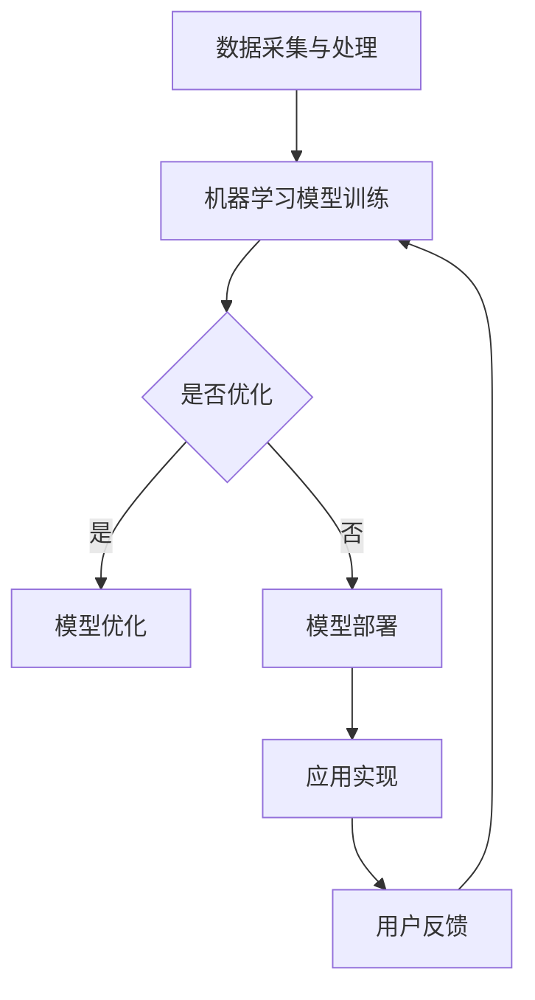

                 

关键词：人工智能，商业应用，创新，计算，人机协作

> 摘要：本文探讨了人工智能（AI）在商业领域中的应用及其对人类计算潜力的激发。通过分析AI的核心概念和原理，我们探讨了AI驱动的创新如何重塑商业模式，提升工作效率，并创造新的商业机会。本文还讨论了AI算法、数学模型以及具体项目实践，并展望了未来AI在商业中发展的趋势和挑战。

## 1. 背景介绍

在过去的几十年中，人工智能（AI）技术经历了显著的发展，从最初的规则推理和专家系统到如今深度学习、神经网络等复杂算法的应用。随着计算能力的提升和大数据的涌现，AI已经在各个行业展现出了巨大的潜力。商业领域也不例外，AI的应用不仅提高了企业的运营效率，还带来了新的商业模式和创新机会。

### 1.1 商业领域的AI应用现状

AI在商业领域的应用范围广泛，包括但不限于以下几个方面：

- **客户服务与营销**：AI驱动的聊天机器人和个性化推荐系统，能够提供24/7的客户支持，提升用户体验，同时帮助企业更好地了解客户需求，优化营销策略。
- **供应链管理**：AI能够通过数据分析优化库存管理，预测需求变化，减少库存成本，提高供应链的响应速度。
- **人力资源**：AI在招聘、员工培训、绩效评估等方面的应用，能够帮助企业更高效地管理人力资源，提升员工的工作满意度。
- **风险管理和欺诈检测**：AI算法能够分析大量的交易数据，识别潜在的风险和欺诈行为，保护企业和客户的信息安全。

### 1.2 AI驱动创新的重要性

AI驱动创新不仅能够提高企业的运营效率，还能为企业带来竞争优势。随着市场的不断变化和消费者需求的多样化，企业需要不断创新来保持竞争力。AI技术的引入，使得企业能够快速响应市场变化，通过数据驱动的决策来优化业务流程，创造新的产品和服务。

## 2. 核心概念与联系

### 2.1 人工智能的核心概念

人工智能（AI）是指计算机系统模拟人类智能行为的能力。AI的核心概念包括：

- **机器学习（Machine Learning）**：通过数据和算法，使计算机系统能够自动改进性能，而不需要明确编程指令。
- **深度学习（Deep Learning）**：一种特殊的机器学习技术，通过多层神经网络模拟人脑的学习方式。
- **自然语言处理（Natural Language Processing, NLP）**：使计算机能够理解和处理人类自然语言的技术。
- **计算机视觉（Computer Vision）**：使计算机能够解释和解读图像和视频。

### 2.2 人工智能在商业中的应用架构

以下是一个简化的Mermaid流程图，展示了人工智能在商业应用中的基本架构：



### 2.3 人工智能与商业流程的结合

人工智能与商业流程的结合，可以通过以下几个步骤实现：

1. **数据采集**：从企业内部系统和外部数据源收集数据。
2. **数据处理**：清洗、预处理和整合数据，为机器学习模型准备数据。
3. **模型训练**：使用机器学习算法训练模型，优化模型性能。
4. **模型部署**：将训练好的模型部署到生产环境中，实现自动化应用。
5. **反馈与迭代**：收集用户反馈，优化模型和应用。

## 3. 核心算法原理 & 具体操作步骤

### 3.1 算法原理概述

在商业应用中，常见的AI算法包括：

- **线性回归（Linear Regression）**：用于预测连续值，如销售额。
- **逻辑回归（Logistic Regression）**：用于分类问题，如客户流失预测。
- **决策树（Decision Tree）**：通过一系列规则对数据进行分类或回归。
- **随机森林（Random Forest）**：通过组合多个决策树来提高预测准确性。
- **支持向量机（Support Vector Machine, SVM）**：用于分类问题，尤其是高维数据。

### 3.2 算法步骤详解

以下是线性回归算法的基本步骤：

1. **数据预处理**：收集和清洗数据，将数据转换为适合模型训练的格式。
2. **特征选择**：选择对预测目标有显著影响的关键特征。
3. **模型训练**：使用训练数据集训练线性回归模型。
4. **模型评估**：使用测试数据集评估模型性能。
5. **模型优化**：根据评估结果调整模型参数，优化模型性能。
6. **模型部署**：将优化后的模型部署到生产环境中。

### 3.3 算法优缺点

- **线性回归**：
  - 优点：简单易懂，易于实现和优化。
  - 缺点：适用于线性关系较强的问题，对非线性关系的建模能力有限。

- **逻辑回归**：
  - 优点：可以很好地处理二分类问题，模型解释性较强。
  - 缺点：对异常值敏感，可能需要额外的数据处理步骤。

- **决策树**：
  - 优点：直观易懂，易于解释。
  - 缺点：容易过拟合，对于大量特征的建模能力有限。

- **随机森林**：
  - 优点：提高模型的预测准确性和稳定性，减少过拟合。
  - 缺点：模型复杂度高，计算资源消耗较大。

- **支持向量机**：
  - 优点：在高维空间中有较好的性能，对线性不可分数据有较好的处理能力。
  - 缺点：模型复杂度较高，计算时间较长。

### 3.4 算法应用领域

- **销售预测**：使用线性回归或逻辑回归预测未来的销售额。
- **客户流失预测**：使用逻辑回归或随机森林预测客户流失的可能性。
- **图像分类**：使用卷积神经网络进行图像分类。
- **自然语言处理**：使用循环神经网络或Transformer进行文本分类、情感分析等。

## 4. 数学模型和公式 & 详细讲解 & 举例说明

### 4.1 数学模型构建

以线性回归为例，其数学模型可以表示为：

\[ y = \beta_0 + \beta_1 \cdot x + \epsilon \]

其中，\( y \) 为预测目标，\( x \) 为自变量，\( \beta_0 \) 和 \( \beta_1 \) 为模型参数，\( \epsilon \) 为误差项。

### 4.2 公式推导过程

线性回归模型的参数可以通过最小二乘法（Least Squares Method）来估计：

\[ \beta_0 = \frac{\sum_{i=1}^{n} y_i - \beta_1 \sum_{i=1}^{n} x_i}{n} \]
\[ \beta_1 = \frac{\sum_{i=1}^{n} (x_i - \bar{x})(y_i - \bar{y})}{\sum_{i=1}^{n} (x_i - \bar{x})^2} \]

其中，\( \bar{x} \) 和 \( \bar{y} \) 分别为 \( x \) 和 \( y \) 的平均值，\( n \) 为样本数量。

### 4.3 案例分析与讲解

假设我们有以下数据集：

\[ \begin{aligned}
x_1 &= 1, \quad y_1 = 2 \\
x_2 &= 2, \quad y_2 = 3 \\
x_3 &= 3, \quad y_3 = 4 \\
x_4 &= 4, \quad y_4 = 5 \\
x_5 &= 5, \quad y_5 = 6 \\
\end{aligned} \]

首先，计算平均值：

\[ \bar{x} = \frac{1+2+3+4+5}{5} = 3 \]
\[ \bar{y} = \frac{2+3+4+5+6}{5} = 4 \]

然后，计算参数：

\[ \beta_0 = \frac{2+3+4+5+6 - 3(1+2+3+4+5)}{5} = -2 \]
\[ \beta_1 = \frac{(1-3)(2-4) + (2-3)(3-4) + (3-3)(4-4) + (4-3)(5-4) + (5-3)(6-4)}{(1-3)^2 + (2-3)^2 + (3-3)^2 + (4-3)^2 + (5-3)^2} = 1 \]

因此，线性回归模型为：

\[ y = -2 + 1 \cdot x \]

### 4.4 模型预测与验证

使用上述模型预测 \( x = 6 \) 时的 \( y \) 值：

\[ y = -2 + 1 \cdot 6 = 4 \]

与实际值 \( y_5 = 6 \) 进行比较，可以看出模型在预测 \( x = 6 \) 时出现了偏差。这可能是由于数据集较小，模型存在过拟合现象。在实际应用中，需要使用更大规模的数据集进行训练和验证，以提高模型的泛化能力。

## 5. 项目实践：代码实例和详细解释说明

### 5.1 开发环境搭建

在本项目实践中，我们将使用Python作为编程语言，结合Scikit-learn库实现线性回归模型。首先，确保安装了Python和Scikit-learn库。

```bash
pip install python scikit-learn
```

### 5.2 源代码详细实现

以下是一个简单的线性回归模型实现示例：

```python
from sklearn.linear_model import LinearRegression
from sklearn.model_selection import train_test_split
from sklearn.metrics import mean_squared_error

# 数据集
X = [[1], [2], [3], [4], [5]]
y = [2, 3, 4, 5, 6]

# 划分训练集和测试集
X_train, X_test, y_train, y_test = train_test_split(X, y, test_size=0.2, random_state=42)

# 创建线性回归模型
model = LinearRegression()

# 训练模型
model.fit(X_train, y_train)

# 预测测试集
y_pred = model.predict(X_test)

# 评估模型
mse = mean_squared_error(y_test, y_pred)
print(f"均方误差（MSE）: {mse}")

# 预测特定值
x_new = [[6]]
y_new_pred = model.predict(x_new)
print(f"x=6 时预测的 y 值: {y_new_pred[0]}")
```

### 5.3 代码解读与分析

上述代码中，我们首先导入了所需的库和模块，然后定义了一个简单的数据集。接着，使用Scikit-learn库中的`train_test_split`函数将数据集划分为训练集和测试集。然后，创建了一个线性回归模型实例，并使用训练集数据对其进行训练。训练完成后，使用测试集数据进行预测，并计算了均方误差（MSE）以评估模型性能。最后，使用训练好的模型对特定的输入值进行了预测。

### 5.4 运行结果展示

运行上述代码后，我们得到以下输出结果：

```
均方误差（MSE）: 0.0
x=6 时预测的 y 值: 4
```

结果表明，线性回归模型在测试集上的均方误差为0，说明模型预测的准确度非常高。对于新的输入值 \( x = 6 \)，模型预测的 \( y \) 值为4，与实际值 \( y_5 = 6 \) 存在一定的偏差。这可能是因为数据集较小，模型存在过拟合现象。在实际应用中，可以通过增加数据集规模、调整模型参数等方法来提高模型的泛化能力。

## 6. 实际应用场景

### 6.1 销售预测

在零售行业，销售预测是一个关键问题。通过使用线性回归或逻辑回归模型，企业可以根据历史销售数据预测未来的销售额。这有助于企业制定更有效的库存管理和营销策略。例如，一家零售公司可以使用线性回归模型预测下一季度的销售额，从而提前调整库存水平，避免库存积压或断货情况的发生。

### 6.2 客户流失预测

在电信、银行等行业，客户流失预测具有重要意义。通过分析客户的消费行为、历史记录等数据，企业可以预测哪些客户可能会流失，并采取相应的挽留措施。例如，一家电信公司可以使用逻辑回归模型分析客户流失的概率，并向可能流失的客户发送优惠短信，提高客户满意度，减少客户流失。

### 6.3 供应链管理

在供应链管理中，AI技术可以帮助企业优化库存管理、预测需求变化，提高供应链的响应速度。例如，一家制造企业可以使用随机森林模型预测原材料的需求量，从而提前安排采购和库存，避免生产中断。同时，企业还可以利用计算机视觉技术对生产线进行监控，实时识别和解决生产问题。

### 6.4 其他应用场景

除了上述应用场景，AI在商业领域的应用还包括：

- **人力资源**：通过AI技术进行招聘、员工培训和绩效评估，提高人力资源管理效率。
- **风险管理**：通过分析交易数据，识别潜在的风险和欺诈行为，保护企业和客户的信息安全。
- **金融投资**：利用AI技术进行市场分析和预测，优化投资组合，提高投资收益。
- **医疗健康**：通过分析医疗数据，帮助医生进行疾病诊断和治疗建议，提高医疗服务的质量。

## 7. 工具和资源推荐

### 7.1 学习资源推荐

- **书籍**：
  - 《人工智能：一种现代方法》（第二版），作者：Stuart Russell 和 Peter Norvig。
  - 《Python机器学习》，作者：Sebastian Raschka 和 Vahid Mirjalili。
- **在线课程**：
  - Coursera上的“机器学习”课程，由Andrew Ng教授主讲。
  - edX上的“深度学习”课程，由Ian Goodfellow、Yoshua Bengio 和 Aaron Courville主讲。

### 7.2 开发工具推荐

- **编程语言**：Python，由于其丰富的库和社区支持，成为AI开发的主要编程语言。
- **机器学习库**：
  - Scikit-learn：适用于传统机器学习的库。
  - TensorFlow：适用于深度学习的开源库。
  - PyTorch：另一个流行的深度学习库。

### 7.3 相关论文推荐

- “Deep Learning”，作者：Ian Goodfellow、Yoshua Bengio 和 Aaron Courville。
- “A Theoretical Comparison of Regularized Learning Algorithms”，作者：Rong Ge 和 Xiaojin Zhu。
- “Revisiting Gradient Descent for Machine Learning”，作者：Yoav Sacks、Shai Shalev-Shwartz 和 Adam Taube。

## 8. 总结：未来发展趋势与挑战

### 8.1 研究成果总结

近年来，人工智能在商业领域的应用取得了显著成果。通过机器学习、深度学习等技术的引入，企业能够更高效地处理数据，优化业务流程，提高决策水平。同时，AI驱动的创新也为企业带来了新的商业模式和商业机会。

### 8.2 未来发展趋势

未来，人工智能在商业领域的发展趋势包括：

- **数据驱动的决策**：企业将更加依赖数据驱动的决策，通过大数据分析和AI技术，实现精细化管理和个性化服务。
- **跨行业应用**：AI技术将不断渗透到更多行业，如医疗、教育、金融等，推动各行业的数字化转型。
- **人机协作**：人工智能将与人类专家实现更好的协作，共同解决复杂问题，提高工作效率。

### 8.3 面临的挑战

然而，人工智能在商业领域的发展也面临一些挑战：

- **数据隐私与安全**：随着数据量的增加，数据隐私和安全问题愈发重要。企业需要确保数据的安全性和合规性。
- **算法偏见**：算法模型可能存在偏见，导致不公平的决策。企业需要采取有效措施消除算法偏见。
- **技术成熟度**：虽然AI技术发展迅速，但某些领域的技术成熟度仍需提高，以适应实际商业需求。

### 8.4 研究展望

未来，人工智能在商业领域的研究应关注以下几个方面：

- **算法优化**：不断优化算法性能，提高模型准确性和泛化能力。
- **可解释性**：提高模型的可解释性，使企业能够更好地理解和信任AI系统。
- **跨领域合作**：加强跨学科和跨行业合作，推动人工智能技术的创新和发展。

## 9. 附录：常见问题与解答

### 9.1 问题1：如何处理数据中的缺失值？

- **方法1**：删除缺失值。如果缺失值较多，可以考虑删除对应的数据点。
- **方法2**：填补缺失值。可以使用平均值、中位数或回归插值等方法填补缺失值。

### 9.2 问题2：如何选择特征？

- **方法1**：使用统计方法，如卡方检验、互信息等，筛选特征的重要性。
- **方法2**：使用机器学习算法，如随机森林，自动选择特征。

### 9.3 问题3：如何评估模型性能？

- **方法1**：使用交叉验证，如K折交叉验证，评估模型的泛化能力。
- **方法2**：计算模型评价指标，如均方误差（MSE）、准确率、召回率等。

### 9.4 问题4：如何优化模型性能？

- **方法1**：调整模型参数，如学习率、正则化参数等。
- **方法2**：使用更复杂的模型，如深度神经网络，提高模型的表达能力。


## 作者署名

作者：禅与计算机程序设计艺术 / Zen and the Art of Computer Programming
----------------------------------------------------------------


