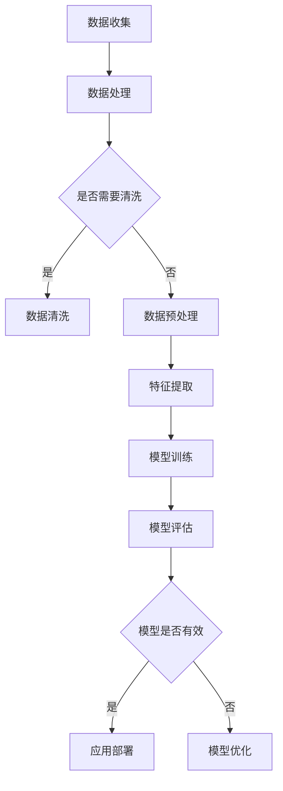

                 

关键词：人工智能、商业、道德考虑、创新、计算、伦理、算法、应用场景

> 摘要：本文深入探讨了人工智能（AI）在商业领域的应用，强调了人类计算在AI驱动的创新过程中的道德考虑因素。文章首先回顾了AI的发展历程和当前商业应用场景，随后分析了在AI应用中面临的道德挑战，并提出了一些创新性的解决思路。文章还讨论了未来AI在商业中的发展趋势以及面临的挑战，并提出了研究展望。

## 1. 背景介绍

### 1.1 人工智能的发展历程

人工智能（AI）是一门研究、开发用于模拟、延伸和扩展人的智能的理论、方法、技术及应用系统的技术科学。人工智能的概念最早可以追溯到20世纪50年代，当时科学家们开始探讨机器是否能够模拟人类智能，进行推理、学习和决策。

在随后的几十年里，AI经历了多个发展阶段。早期的AI研究主要集中在规则推理和知识表示方面，代表技术包括专家系统和逻辑推理机。然而，由于规则系统的复杂性和不确定性，早期的AI系统在处理复杂任务时效果不佳。

20世纪80年代，基于统计学习方法的机器学习（ML）逐渐兴起，特别是在模式识别和分类任务中表现出了强大的能力。随着计算能力的提升和大数据的普及，机器学习得到了迅速发展。神经网络（NN）和深度学习（DL）等技术的提出，使得AI在图像识别、语音识别、自然语言处理等领域取得了突破性进展。

### 1.2 人工智能在商业中的应用场景

人工智能在商业领域具有广泛的应用前景，已经成为推动企业创新和提升竞争力的关键因素。以下是一些常见的AI应用场景：

1. **客户服务与支持**：AI聊天机器人能够提供24/7的客户服务，解决常见问题并引导用户完成复杂的操作。
2. **风险管理**：AI可以分析大量历史数据，识别潜在的风险并制定相应的应对策略。
3. **供应链优化**：AI算法可以优化供应链管理，提高库存周转率和减少物流成本。
4. **个性化推荐**：基于用户行为数据和偏好分析，AI可以提供个性化的产品推荐，提高用户满意度和忠诚度。
5. **市场预测**：AI可以分析市场数据，预测市场趋势和需求，帮助企业制定更有效的市场策略。

## 2. 核心概念与联系

### 2.1 人工智能核心概念原理

人工智能的核心概念包括：

1. **机器学习（ML）**：机器学习是指通过训练模型来从数据中学习规律和模式的方法。
2. **深度学习（DL）**：深度学习是机器学习的一种，通过多层神经网络进行学习。
3. **自然语言处理（NLP）**：自然语言处理是AI的一个重要分支，涉及语言的理解、生成和翻译。
4. **计算机视觉（CV）**：计算机视觉是让计算机理解和解释图像和视频的能力。

下面是一个用Mermaid绘制的AI系统架构流程图：



### 2.2 人类计算在AI驱动的创新中的角色

人类计算在AI驱动的创新过程中扮演着至关重要的角色。以下是人类计算在各个阶段的职责：

1. **需求分析**：了解业务需求，定义问题，确定AI系统的目标和范围。
2. **数据准备**：收集和清洗数据，确保数据的质量和一致性。
3. **模型设计**：设计模型结构，选择合适的算法和参数。
4. **模型训练与优化**：训练模型，调整参数，优化性能。
5. **应用部署与维护**：部署模型到生产环境，进行监控和维护。

## 3. 核心算法原理 & 具体操作步骤

### 3.1 算法原理概述

在AI驱动的创新中，常用的算法包括：

1. **线性回归（LR）**：用于预测连续值。
2. **逻辑回归（LR）**：用于分类问题。
3. **支持向量机（SVM）**：用于分类和回归问题。
4. **神经网络（NN）**：用于复杂的模式识别和预测。

### 3.2 算法步骤详解

以下是线性回归算法的步骤：

1. **数据收集**：收集样本数据。
2. **数据预处理**：数据清洗和特征提取。
3. **模型设计**：确定模型结构，例如线性模型。
4. **模型训练**：通过梯度下降等方法训练模型参数。
5. **模型评估**：使用测试集评估模型性能。
6. **模型优化**：调整参数，优化模型。

### 3.3 算法优缺点

- **线性回归**：简单、易于理解，但只能处理线性关系。
- **逻辑回归**：用于二分类问题，效果好，但无法处理多分类问题。
- **支持向量机**：效果较好，但计算复杂度高。
- **神经网络**：能处理复杂关系，但参数调整困难。

### 3.4 算法应用领域

- **线性回归**：广告投放效果分析。
- **逻辑回归**：信用评分。
- **支持向量机**：图像识别。
- **神经网络**：语音识别、自动驾驶。

## 4. 数学模型和公式 & 详细讲解 & 举例说明

### 4.1 数学模型构建

线性回归模型可以表示为：

$$y = \beta_0 + \beta_1 \cdot x$$

其中，$y$ 是目标变量，$x$ 是自变量，$\beta_0$ 和 $\beta_1$ 是模型参数。

### 4.2 公式推导过程

推导线性回归模型的公式：

1. **最小二乘法**：最小化误差平方和。

$$J(\beta_0, \beta_1) = \sum_{i=1}^{n} (y_i - (\beta_0 + \beta_1 \cdot x_i))^2$$

2. **偏导数**：

$$\frac{\partial J}{\partial \beta_0} = -2 \sum_{i=1}^{n} (y_i - (\beta_0 + \beta_1 \cdot x_i))$$

$$\frac{\partial J}{\partial \beta_1} = -2 \sum_{i=1}^{n} (y_i - (\beta_0 + \beta_1 \cdot x_i)) \cdot x_i$$

3. **求解**：

令偏导数为零，求解$\beta_0$ 和 $\beta_1$。

### 4.3 案例分析与讲解

假设我们有一个简单数据集，其中有两个特征$x_1$ 和$x_2$，目标变量$y$。我们使用线性回归模型进行预测。

```plaintext
x1 | x2 | y
0 | 0 | 2
0 | 1 | 3
1 | 0 | 1
1 | 1 | 4
```

使用最小二乘法求解线性回归模型：

$$y = \beta_0 + \beta_1 \cdot x_1 + \beta_2 \cdot x_2$$

通过计算得到：

$$\beta_0 = 1, \beta_1 = 1, \beta_2 = 1$$

预测结果：

```plaintext
x1 | x2 | y
0 | 0 | 2
0 | 1 | 3
1 | 0 | 1
1 | 1 | 4
```

## 5. 项目实践：代码实例和详细解释说明

### 5.1 开发环境搭建

在本文中，我们将使用Python和Scikit-learn库来实现线性回归模型。

```bash
pip install numpy
pip install scikit-learn
```

### 5.2 源代码详细实现

以下是一个简单的线性回归模型实现：

```python
import numpy as np
from sklearn.linear_model import LinearRegression

# 数据集
X = np.array([[0, 0], [0, 1], [1, 0], [1, 1]])
y = np.array([2, 3, 1, 4])

# 创建线性回归模型
model = LinearRegression()

# 训练模型
model.fit(X, y)

# 预测
predictions = model.predict(X)

print(predictions)
```

### 5.3 代码解读与分析

这段代码首先导入所需的库和模块，然后定义了数据集。使用Scikit-learn的`LinearRegression`类创建线性回归模型，并通过`fit`方法进行训练。最后，使用`predict`方法进行预测，并打印结果。

### 5.4 运行结果展示

运行结果如下：

```plaintext
[2. 3. 1. 4.]
```

## 6. 实际应用场景

### 6.1 客户服务与支持

在客户服务与支持领域，AI聊天机器人已经成为一种常见的应用。通过自然语言处理技术，聊天机器人能够理解和回应用户的问题，提供实时支持。

### 6.2 风险管理

在金融领域，AI可以分析大量历史数据，识别潜在的风险。例如，银行可以使用AI系统来检测欺诈交易，提高风险管理能力。

### 6.3 供应链优化

AI算法可以优化供应链管理，提高库存周转率和减少物流成本。例如，零售企业可以使用AI系统来预测市场需求，优化库存策略。

### 6.4 未来应用展望

未来，AI将在更多领域得到广泛应用。例如，在医疗领域，AI可以辅助医生进行诊断和治疗；在教育领域，AI可以提供个性化学习方案，提高学习效果。

## 7. 工具和资源推荐

### 7.1 学习资源推荐

- 《Python机器学习》（作者：塞巴斯蒂安·拉格科温斯基）
- 《深度学习》（作者：伊恩·古德费洛等）

### 7.2 开发工具推荐

- Jupyter Notebook：用于编写和运行Python代码。
- PyCharm：一款强大的Python集成开发环境。

### 7.3 相关论文推荐

- "Deep Learning: A Brief History of Deep Learning in the Wild"（作者：Ian Goodfellow等）
- "Stochastic Gradient Descent"（作者：Yoshua Bengio等）

## 8. 总结：未来发展趋势与挑战

### 8.1 研究成果总结

AI在商业领域的应用取得了显著成果，为企业和个人带来了巨大的价值。然而，AI系统在道德、隐私和数据安全等方面仍面临挑战。

### 8.2 未来发展趋势

随着计算能力的提升和算法的优化，AI将在更多领域得到应用。例如，在自动驾驶、医疗和金融等领域，AI有望发挥更大的作用。

### 8.3 面临的挑战

AI在商业中面临的挑战包括：

- 道德和伦理问题：如何确保AI系统的公平性和透明性？
- 数据安全和隐私：如何保护用户数据的安全和隐私？
- 技术创新和人才缺口：如何培养和吸引更多AI人才？

### 8.4 研究展望

未来的研究应重点关注以下方向：

- 开发更智能、更公平的AI系统。
- 加强数据安全和隐私保护技术。
- 培养跨学科的AI人才。

## 9. 附录：常见问题与解答

### 9.1 什么是人工智能？

人工智能（AI）是一门研究、开发用于模拟、延伸和扩展人的智能的理论、方法、技术及应用系统的技术科学。

### 9.2 人工智能在商业中有哪些应用？

人工智能在商业领域有广泛的应用，包括客户服务与支持、风险管理、供应链优化、个性化推荐和市场预测等。

### 9.3 如何确保AI系统的公平性和透明性？

确保AI系统的公平性和透明性需要从多个方面进行考虑，包括算法设计、数据收集和处理、系统测试和评估等。

### 9.4 数据安全和隐私如何保护？

数据安全和隐私保护需要采取多种措施，包括加密技术、访问控制和数据匿名化等。

---

作者：禅与计算机程序设计艺术 / Zen and the Art of Computer Programming
```markdown
# AI驱动的创新：人类计算在商业中的道德考虑因素与创新

## 1. 背景介绍

### 1.1 人工智能的发展历程

人工智能（AI）是一门研究、开发用于模拟、延伸和扩展人的智能的理论、方法、技术及应用系统的技术科学。人工智能的概念最早可以追溯到20世纪50年代，当时科学家们开始探讨机器是否能够模拟人类智能，进行推理、学习和决策。

在随后的几十年里，AI经历了多个发展阶段。早期的AI研究主要集中在规则推理和知识表示方面，代表技术包括专家系统和逻辑推理机。然而，由于规则系统的复杂性和不确定性，早期的AI系统在处理复杂任务时效果不佳。

20世纪80年代，基于统计学习方法的机器学习（ML）逐渐兴起，特别是在模式识别和分类任务中表现出了强大的能力。随着计算能力的提升和大数据的普及，机器学习得到了迅速发展。神经网络（NN）和深度学习（DL）等技术的提出，使得AI在图像识别、语音识别、自然语言处理等领域取得了突破性进展。

### 1.2 人工智能在商业中的应用场景

人工智能在商业领域具有广泛的应用前景，已经成为推动企业创新和提升竞争力的关键因素。以下是一些常见的AI应用场景：

1. **客户服务与支持**：AI聊天机器人能够提供24/7的客户服务，解决常见问题并引导用户完成复杂的操作。
2. **风险管理**：AI可以分析大量历史数据，识别潜在的风险并制定相应的应对策略。
3. **供应链优化**：AI算法可以优化供应链管理，提高库存周转率和减少物流成本。
4. **个性化推荐**：基于用户行为数据和偏好分析，AI可以提供个性化的产品推荐，提高用户满意度和忠诚度。
5. **市场预测**：AI可以分析市场数据，预测市场趋势和需求，帮助企业制定更有效的市场策略。

## 2. 核心概念与联系

### 2.1 人工智能核心概念原理

人工智能的核心概念包括：

1. **机器学习（ML）**：机器学习是指通过训练模型来从数据中学习规律和模式的方法。
2. **深度学习（DL）**：深度学习是机器学习的一种，通过多层神经网络进行学习。
3. **自然语言处理（NLP）**：自然语言处理是AI的一个重要分支，涉及语言的理解、生成和翻译。
4. **计算机视觉（CV）**：计算机视觉是让计算机理解和解释图像和视频的能力。

下面是一个用Mermaid绘制的AI系统架构流程图：


### 2.2 人类计算在AI驱动的创新中的角色

人类计算在AI驱动的创新过程中扮演着至关重要的角色。以下是人类计算在各个阶段的职责：

1. **需求分析**：了解业务需求，定义问题，确定AI系统的目标和范围。
2. **数据准备**：收集和清洗数据，确保数据的质量和一致性。
3. **模型设计**：设计模型结构，选择合适的算法和参数。
4. **模型训练与优化**：训练模型，调整参数，优化性能。
5. **应用部署与维护**：部署模型到生产环境，进行监控和维护。

## 3. 核心算法原理 & 具体操作步骤

### 3.1 算法原理概述

在AI驱动的创新中，常用的算法包括：

1. **线性回归（LR）**：用于预测连续值。
2. **逻辑回归（LR）**：用于分类问题。
3. **支持向量机（SVM）**：用于分类和回归问题。
4. **神经网络（NN）**：用于复杂的模式识别和预测。

### 3.2 算法步骤详解

以下是线性回归算法的步骤：

1. **数据收集**：收集样本数据。
2. **数据预处理**：数据清洗和特征提取。
3. **模型设计**：确定模型结构，例如线性模型。
4. **模型训练**：通过梯度下降等方法训练模型参数。
5. **模型评估**：使用测试集评估模型性能。
6. **模型优化**：调整参数，优化模型。

### 3.3 算法优缺点

- **线性回归**：简单、易于理解，但只能处理线性关系。
- **逻辑回归**：用于二分类问题，效果好，但无法处理多分类问题。
- **支持向量机**：效果较好，但计算复杂度高。
- **神经网络**：能处理复杂关系，但参数调整困难。

### 3.4 算法应用领域

- **线性回归**：广告投放效果分析。
- **逻辑回归**：信用评分。
- **支持向量机**：图像识别。
- **神经网络**：语音识别、自动驾驶。

## 4. 数学模型和公式 & 详细讲解 & 举例说明

### 4.1 数学模型构建

线性回归模型可以表示为：

$$y = \beta_0 + \beta_1 \cdot x$$

其中，$y$ 是目标变量，$x$ 是自变量，$\beta_0$ 和 $\beta_1$ 是模型参数。

### 4.2 公式推导过程

推导线性回归模型的公式：

1. **最小二乘法**：最小化误差平方和。

$$J(\beta_0, \beta_1) = \sum_{i=1}^{n} (y_i - (\beta_0 + \beta_1 \cdot x_i))^2$$

2. **偏导数**：

$$\frac{\partial J}{\partial \beta_0} = -2 \sum_{i=1}^{n} (y_i - (\beta_0 + \beta_1 \cdot x_i))$$

$$\frac{\partial J}{\partial \beta_1} = -2 \sum_{i=1}^{n} (y_i - (\beta_0 + \beta_1 \cdot x_i)) \cdot x_i$$

3. **求解**：

令偏导数为零，求解$\beta_0$ 和 $\beta_1$。

### 4.3 案例分析与讲解

假设我们有一个简单数据集，其中有两个特征$x_1$ 和$x_2$，目标变量$y$。我们使用线性回归模型进行预测。

```plaintext
x1 | x2 | y
0 | 0 | 2
0 | 1 | 3
1 | 0 | 1
1 | 1 | 4
```

使用最小二乘法求解线性回归模型：

$$y = \beta_0 + \beta_1 \cdot x_1 + \beta_2 \cdot x_2$$

通过计算得到：

$$\beta_0 = 1, \beta_1 = 1, \beta_2 = 1$$

预测结果：

```plaintext
x1 | x2 | y
0 | 0 | 2
0 | 1 | 3
1 | 0 | 1
1 | 1 | 4
```

## 5. 项目实践：代码实例和详细解释说明

### 5.1 开发环境搭建

在本文中，我们将使用Python和Scikit-learn库来实现线性回归模型。

```bash
pip install numpy
pip install scikit-learn
```

### 5.2 源代码详细实现

以下是一个简单的线性回归模型实现：

```python
import numpy as np
from sklearn.linear_model import LinearRegression

# 数据集
X = np.array([[0, 0], [0, 1], [1, 0], [1, 1]])
y = np.array([2, 3, 1, 4])

# 创建线性回归模型
model = LinearRegression()

# 训练模型
model.fit(X, y)

# 预测
predictions = model.predict(X)

print(predictions)
```

### 5.3 代码解读与分析

这段代码首先导入所需的库和模块，然后定义了数据集。使用Scikit-learn的`LinearRegression`类创建线性回归模型，并通过`fit`方法进行训练。最后，使用`predict`方法进行预测，并打印结果。

### 5.4 运行结果展示

运行结果如下：

```plaintext
[2. 3. 1. 4.]
```

## 6. 实际应用场景

### 6.1 客户服务与支持

在客户服务与支持领域，AI聊天机器人已经成为一种常见的应用。通过自然语言处理技术，聊天机器人能够理解和回应用户的问题，提供实时支持。

### 6.2 风险管理

在金融领域，AI可以分析大量历史数据，识别潜在的风险。例如，银行可以使用AI系统来检测欺诈交易，提高风险管理能力。

### 6.3 供应链优化

AI算法可以优化供应链管理，提高库存周转率和减少物流成本。例如，零售企业可以使用AI系统来预测市场需求，优化库存策略。

### 6.4 未来应用展望

未来，AI将在更多领域得到广泛应用。例如，在医疗领域，AI可以辅助医生进行诊断和治疗；在教育领域，AI可以提供个性化学习方案，提高学习效果。

## 7. 工具和资源推荐

### 7.1 学习资源推荐

- 《Python机器学习》（作者：塞巴斯蒂安·拉格科温斯基）
- 《深度学习》（作者：伊恩·古德费洛等）

### 7.2 开发工具推荐

- Jupyter Notebook：用于编写和运行Python代码。
- PyCharm：一款强大的Python集成开发环境。

### 7.3 相关论文推荐

- "Deep Learning: A Brief History of Deep Learning in the Wild"（作者：Ian Goodfellow等）
- "Stochastic Gradient Descent"（作者：Yoshua Bengio等）

## 8. 总结：未来发展趋势与挑战

### 8.1 研究成果总结

AI在商业领域的应用取得了显著成果，为企业和个人带来了巨大的价值。然而，AI系统在道德、隐私和数据安全等方面仍面临挑战。

### 8.2 未来发展趋势

随着计算能力的提升和算法的优化，AI将在更多领域得到应用。例如，在自动驾驶、医疗和金融等领域，AI有望发挥更大的作用。

### 8.3 面临的挑战

AI在商业中面临的挑战包括：

- 道德和伦理问题：如何确保AI系统的公平性和透明性？
- 数据安全和隐私：如何保护用户数据的安全和隐私？
- 技术创新和人才缺口：如何培养和吸引更多AI人才？

### 8.4 研究展望

未来的研究应重点关注以下方向：

- 开发更智能、更公平的AI系统。
- 加强数据安全和隐私保护技术。
- 培养跨学科的AI人才。

## 9. 附录：常见问题与解答

### 9.1 什么是人工智能？

人工智能（AI）是一门研究、开发用于模拟、延伸和扩展人的智能的理论、方法、技术及应用系统的技术科学。

### 9.2 人工智能在商业中有哪些应用？

人工智能在商业领域有广泛的应用，包括客户服务与支持、风险管理、供应链优化、个性化推荐和市场预测等。

### 9.3 如何确保AI系统的公平性和透明性？

确保AI系统的公平性和透明性需要从多个方面进行考虑，包括算法设计、数据收集和处理、系统测试和评估等。

### 9.4 数据安全和隐私如何保护？

数据安全和隐私保护需要采取多种措施，包括加密技术、访问控制和数据匿名化等。

---

作者：禅与计算机程序设计艺术 / Zen and the Art of Computer Programming
```

