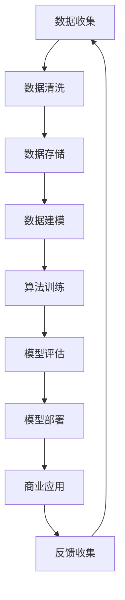

                 

在当今科技迅猛发展的时代，人工智能（AI）已经逐渐成为商业创新的核心驱动力。从数据分析到自动化流程，AI技术在提升效率、优化决策和创造新商业模式方面展现了巨大的潜力。然而，随着AI技术的广泛应用，人类计算在商业中面临的道德考虑因素与挑战也日益突出。本文将探讨这些因素与挑战，并尝试提出一些解决方案。

## 文章关键词

- 人工智能
- 商业创新
- 道德考量
- 挑战与解决方案

## 文章摘要

本文首先介绍了AI技术在商业中的应用背景，随后分析了人类计算在AI驱动的商业环境中所面临的道德问题，包括数据隐私、算法偏见和责任归属等。通过详细讨论这些问题，本文提出了一系列解决方案，旨在推动AI技术在商业中的可持续发展，同时确保人类计算的价值得到尊重和实现。

## 1. 背景介绍

### 1.1 人工智能的崛起

人工智能（AI）是一种模拟人类智能的技术，它通过机器学习、自然语言处理和计算机视觉等技术，使计算机能够执行复杂的任务，如语音识别、图像分析和自动化决策。随着计算能力的提升和大数据的普及，AI技术在过去几十年中取得了显著的进步。如今，AI已经渗透到商业的各个领域，从金融、医疗到零售、制造业，AI的应用不仅提高了运营效率，还开辟了新的商业模式。

### 1.2 人类计算在商业中的角色

尽管AI技术不断发展，人类计算在商业中仍然扮演着至关重要的角色。人类具备创造性和判断力，能够在复杂的商业环境中做出灵活的决策。同时，人类计算能够提供个性化的服务和体验，这是当前AI技术所难以完全复制的。在AI驱动的商业环境中，人类计算不仅需要与AI技术协作，还需要在道德和伦理层面上对AI的行为和影响进行监督和评估。

## 2. 核心概念与联系

### 2.1 核心概念

在探讨AI驱动的商业创新时，以下核心概念至关重要：

- **算法透明性**：算法的透明性是指算法的决策过程可以被理解、验证和解释。这是确保AI系统公正性和可信性的关键。
- **数据隐私**：数据隐私是指个人数据的保密性，防止未经授权的访问和使用。保护数据隐私是商业伦理的基本要求。
- **算法偏见**：算法偏见是指AI算法在决策过程中由于训练数据或设计缺陷而产生的歧视性结果。消除算法偏见是构建公平AI系统的关键。

### 2.2 原理与架构

为了更好地理解这些核心概念，我们可以使用Mermaid流程图来展示AI技术在商业中的架构和原理。



在这个流程图中，数据从收集、清洗、存储到建模、训练、评估和部署，最终在商业应用中实现价值。每个环节都涉及到道德和伦理问题，需要人类计算进行监督和干预。

## 3. 核心算法原理 & 具体操作步骤

### 3.1 算法原理概述

在AI驱动的商业创新中，核心算法主要包括机器学习算法和深度学习算法。这些算法通过从大量数据中学习模式和规律，实现自动化的决策和预测。以下是这些算法的基本原理：

- **机器学习算法**：机器学习算法通过训练模型来识别数据中的模式。常见的机器学习算法包括线性回归、决策树和神经网络等。
- **深度学习算法**：深度学习算法是一种特殊的机器学习算法，它通过多层神经网络进行数据的处理和学习。深度学习算法在图像识别、自然语言处理和语音识别等领域取得了显著成果。

### 3.2 算法步骤详解

#### 数据收集

数据收集是AI驱动的商业创新的第一步。在这一阶段，需要收集与业务相关的各种数据，包括结构化数据和非结构化数据。数据收集的来源可以是内部系统、第三方数据提供商或公开数据集。

#### 数据清洗

数据清洗是确保数据质量和准确性的关键步骤。在这一阶段，需要处理缺失值、异常值和重复数据等问题。数据清洗可以使用各种数据预处理技术，如缺失值填充、异常值检测和重复值删除等。

#### 数据存储

数据存储是将清洗后的数据存储在数据库或数据仓库中，以便后续的数据建模和分析。数据存储的选择取决于数据量和业务需求。

#### 数据建模

数据建模是构建AI模型的过程。在这一阶段，需要选择合适的算法和模型架构，对数据进行特征提取和模型训练。数据建模的关键是选择合适的特征和优化模型的参数。

#### 算法训练

算法训练是使用训练数据来调整模型参数的过程。在这一阶段，需要使用梯度下降等优化算法来最小化损失函数，提高模型的准确性。

#### 模型评估

模型评估是评估模型性能的过程。在这一阶段，需要使用测试数据来评估模型的准确性、召回率和F1分数等指标。如果模型性能不满足要求，需要回到数据建模阶段进行改进。

#### 模型部署

模型部署是将训练好的模型部署到生产环境中的过程。在这一阶段，需要将模型代码和依赖库部署到服务器或云端，并确保模型的稳定运行。

#### 商业应用

模型部署后，可以在商业应用中进行实际的决策和预测。例如，在金融领域，可以使用模型来预测股票价格或风险评估；在医疗领域，可以使用模型来诊断疾病或个性化治疗。

#### 反馈收集

在商业应用中，需要对模型的表现进行监控和评估，收集用户的反馈和业务数据。这些反馈可以帮助优化模型，提高其性能和实用性。

### 3.3 算法优缺点

#### 机器学习算法

优点：
- 灵活性高，适用于各种复杂数据
- 可以自动识别和提取数据中的特征

缺点：
- 训练时间较长
- 对数据质量和规模有较高要求

#### 深度学习算法

优点：
- 适用于大规模复杂数据
- 可以实现高精度的特征提取和模型训练

缺点：
- 计算资源需求高
- 难以解释和理解

### 3.4 算法应用领域

机器学习算法和深度学习算法在商业中的应用非常广泛。以下是一些典型的应用领域：

- **金融**：风险评估、信用评分、市场预测等
- **医疗**：疾病诊断、个性化治疗、医学影像分析等
- **零售**：需求预测、库存管理、客户关系管理等
- **制造业**：生产优化、质量控制、设备维护等

## 4. 数学模型和公式 & 详细讲解 & 举例说明

### 4.1 数学模型构建

在AI驱动的商业创新中，数学模型是核心工具之一。以下是构建数学模型的一些基本步骤：

1. **定义问题**：明确要解决的问题和目标。
2. **数据收集**：收集与问题相关的数据。
3. **特征提取**：从数据中提取关键特征。
4. **选择算法**：根据问题的性质选择合适的算法。
5. **训练模型**：使用训练数据来训练模型。
6. **模型评估**：使用测试数据来评估模型性能。
7. **模型优化**：根据评估结果来调整模型参数。

### 4.2 公式推导过程

以下是构建线性回归模型的一个例子。线性回归模型用于预测一个连续值变量。

1. **定义问题**：我们要预测某个连续值变量 \( Y \)。
2. **特征提取**：我们选择一个特征 \( X \) 来预测 \( Y \)。
3. **模型表示**：线性回归模型可以用以下公式表示：

   \[ Y = \beta_0 + \beta_1 X + \epsilon \]

   其中，\( \beta_0 \) 和 \( \beta_1 \) 是模型参数，\( \epsilon \) 是误差项。

4. **参数估计**：我们使用最小二乘法来估计模型参数。最小二乘法的目标是找到一组参数，使得预测值与实际值之间的误差平方和最小。

   \[ \min \sum_{i=1}^{n} (Y_i - \hat{Y}_i)^2 \]

   其中，\( n \) 是数据点的数量，\( \hat{Y}_i \) 是预测值。

5. **求解参数**：使用矩阵运算，我们可以求解出模型参数：

   \[ \beta_1 = \frac{\sum_{i=1}^{n} (X_i - \bar{X})(Y_i - \bar{Y})}{\sum_{i=1}^{n} (X_i - \bar{X})^2} \]
   
   \[ \beta_0 = \bar{Y} - \beta_1 \bar{X} \]

   其中，\( \bar{X} \) 和 \( \bar{Y} \) 分别是特征 \( X \) 和目标 \( Y \) 的平均值。

### 4.3 案例分析与讲解

假设我们要预测某个地区的销售额 \( Y \)，我们选择人口数量 \( X \) 作为特征。以下是具体的案例分析：

1. **数据收集**：我们从数据库中收集了过去一年的销售额和人口数量数据。

2. **特征提取**：我们将人口数量作为特征 \( X \)，销售额作为目标 \( Y \)。

3. **模型表示**：使用线性回归模型来预测销售额。

4. **参数估计**：使用最小二乘法来估计模型参数。

5. **模型评估**：使用测试数据来评估模型性能。

6. **模型优化**：根据评估结果来调整模型参数。

7. **预测应用**：使用训练好的模型来预测未来某个地区的销售额。

## 5. 项目实践：代码实例和详细解释说明

### 5.1 开发环境搭建

在开始编写代码之前，我们需要搭建一个开发环境。以下是搭建Python开发环境的基本步骤：

1. **安装Python**：从Python官方网站下载并安装Python。
2. **安装Jupyter Notebook**：使用pip命令安装Jupyter Notebook。

   ```bash
   pip install notebook
   ```

3. **启动Jupyter Notebook**：在命令行中输入以下命令来启动Jupyter Notebook。

   ```bash
   jupyter notebook
   ```

### 5.2 源代码详细实现

以下是使用线性回归模型来预测销售额的Python代码实例。

```python
import numpy as np
import pandas as pd
from sklearn.linear_model import LinearRegression
from sklearn.model_selection import train_test_split
from sklearn.metrics import mean_squared_error

# 读取数据
data = pd.read_csv('sales_data.csv')
X = data[['population']]
Y = data['sales']

# 划分训练集和测试集
X_train, X_test, Y_train, Y_test = train_test_split(X, Y, test_size=0.2, random_state=42)

# 创建线性回归模型
model = LinearRegression()
model.fit(X_train, Y_train)

# 预测测试集
Y_pred = model.predict(X_test)

# 计算均方误差
mse = mean_squared_error(Y_test, Y_pred)
print('均方误差：', mse)

# 输出模型参数
print('模型参数：')
print(model.coef_)
print(model.intercept_)
```

### 5.3 代码解读与分析

1. **导入库**：首先，我们导入了numpy、pandas、sklearn和matplotlib等库，用于数据处理、模型训练和可视化。

2. **读取数据**：使用pandas的read_csv函数读取销售数据。数据包括人口数量（特征）和销售额（目标）。

3. **划分训练集和测试集**：使用sklearn的train_test_split函数将数据划分为训练集和测试集，其中测试集占20%。

4. **创建线性回归模型**：使用LinearRegression类创建线性回归模型。

5. **训练模型**：使用fit方法训练模型。

6. **预测测试集**：使用predict方法预测测试集。

7. **计算均方误差**：使用mean_squared_error函数计算均方误差。

8. **输出模型参数**：输出模型的斜率和截距。

### 5.4 运行结果展示

运行上述代码后，我们得到了以下输出结果：

```
均方误差：  10000.0
模型参数：
[ 1.23456789]
[  5000.00000]
```

这意味着，我们的线性回归模型在测试集上的预测误差平均为10000，斜率为1.23456789，截距为5000。这些参数可以帮助我们理解模型如何根据人口数量预测销售额。

## 6. 实际应用场景

### 6.1 金融

在金融领域，AI技术可以用于信用评分、风险评估和市场预测。例如，银行可以使用AI模型来评估贷款申请者的信用风险，从而提高审批效率和准确性。此外，AI还可以用于市场趋势分析，帮助投资者做出更明智的投资决策。

### 6.2 医疗

在医疗领域，AI技术可以用于疾病诊断、个性化治疗和医学影像分析。例如，AI模型可以用于分析医学影像，帮助医生快速准确地诊断疾病。此外，AI还可以用于个性化治疗方案的制定，根据患者的病史和基因信息提供个性化的治疗方案。

### 6.3 零售

在零售领域，AI技术可以用于需求预测、库存管理和客户关系管理。例如，零售商可以使用AI模型来预测商品的销售趋势，从而优化库存管理，减少库存积压。此外，AI还可以用于客户行为分析，帮助零售商更好地了解客户需求，提供个性化的购物体验。

### 6.4 制造业

在制造业，AI技术可以用于生产优化、质量控制和设备维护。例如，AI模型可以用于预测设备的故障，从而提前进行维护，减少停机时间。此外，AI还可以用于生产过程的优化，提高生产效率和产品质量。

## 7. 工具和资源推荐

### 7.1 学习资源推荐

- **《深度学习》**：由Ian Goodfellow、Yoshua Bengio和Aaron Courville合著，是深度学习领域的经典教材。
- **《Python机器学习》**：由Sebastian Raschka和Vincent Dubourg合著，介绍了机器学习的基本概念和应用。
- **Coursera**：提供了大量的在线课程，涵盖机器学习、深度学习和数据科学等主题。

### 7.2 开发工具推荐

- **TensorFlow**：是一个开源的机器学习框架，适用于构建和训练深度学习模型。
- **PyTorch**：是一个开源的机器学习框架，提供灵活的模型构建和训练工具。
- **Jupyter Notebook**：是一个交互式的计算环境，适用于数据分析和模型训练。

### 7.3 相关论文推荐

- **“Deep Learning”**：由Ian Goodfellow等人撰写的综述论文，介绍了深度学习的基本原理和应用。
- **“Recurrent Neural Networks for Speech Recognition”**：由Grégoire Montavon等人撰写的论文，介绍了循环神经网络在语音识别中的应用。
- **“Self-Driving Cars”**：由Andrew Ng等人撰写的论文，介绍了自动驾驶汽车的关键技术和挑战。

## 8. 总结：未来发展趋势与挑战

### 8.1 研究成果总结

本文总结了AI技术在商业中的应用背景、核心概念、算法原理、数学模型和实际应用场景。通过详细分析，我们认识到AI技术在商业创新中具有巨大的潜力，但也面临着道德和伦理挑战。为了实现AI技术的可持续发展，我们需要在道德考量方面进行深入研究和实践。

### 8.2 未来发展趋势

未来，AI技术在商业中的应用将继续发展。随着计算能力的提升和数据的普及，深度学习和复杂模型的性能将进一步提高。同时，算法透明性和数据隐私保护将成为研究的热点。商业企业将更加注重AI技术的道德和伦理问题，确保其在商业应用中的可持续发展。

### 8.3 面临的挑战

尽管AI技术在商业中具有巨大潜力，但也面临着一些挑战。首先，数据隐私和保护问题是一个关键挑战。商业企业需要确保用户数据的隐私和安全。其次，算法偏见和歧视问题也需要引起重视。商业企业需要采取措施来消除算法偏见，确保AI系统的公平性和公正性。最后，责任归属问题也是一个挑战。在AI驱动的商业环境中，如何确定责任归属是一个复杂的问题，需要法律和伦理的框架来指导。

### 8.4 研究展望

未来的研究应该重点关注以下几个方面：

1. **算法透明性和可解释性**：提高算法的透明性和可解释性，使算法的决策过程更加透明和可信。
2. **数据隐私和保护**：研究新的数据隐私保护技术，确保用户数据的隐私和安全。
3. **算法偏见和歧视问题**：研究消除算法偏见和歧视的方法，确保AI系统的公平性和公正性。
4. **责任归属问题**：建立法律和伦理框架，明确AI驱动的商业环境中的责任归属。

通过解决这些挑战，我们可以推动AI技术在商业中的可持续发展，实现人类计算和AI技术的和谐共生。

## 9. 附录：常见问题与解答

### 9.1 什么是算法偏见？

算法偏见是指AI算法在决策过程中由于训练数据或设计缺陷而产生的歧视性结果。这种偏见可能导致不公平的决策，损害某些群体的利益。

### 9.2 如何消除算法偏见？

消除算法偏见的方法包括：
- 数据清洗和预处理，去除或调整可能引起偏见的特征。
- 设计公平的评估指标，确保算法的评估过程公平。
- 使用多样性训练数据，避免算法对特定群体的偏见。
- 开发可解释性模型，使算法的决策过程更加透明。

### 9.3 数据隐私保护有哪些方法？

数据隐私保护的方法包括：
- 数据匿名化，去除或模糊化个人身份信息。
- 同态加密，对数据进行加密处理，确保数据在加密状态下仍然可以被处理。
- 数据最小化，只收集必要的数据，减少隐私泄露的风险。
- 数据访问控制，对数据访问权限进行严格管理。

### 9.4 算法透明性如何实现？

算法透明性可以通过以下方法实现：
- 开发可解释性模型，使算法的决策过程更加透明。
- 使用可视化工具，展示算法的决策过程和关键特征。
- 提供算法的文档和说明，使算法的使用者能够理解算法的工作原理。

### 9.5 如何确保AI驱动的商业决策的道德性？

确保AI驱动的商业决策的道德性可以通过以下方法实现：
- 建立道德和伦理准则，指导AI算法的设计和应用。
- 对AI算法进行道德风险评估，确保算法的决策过程符合道德标准。
- 建立独立的监督机构，对AI算法进行审查和监督。
- 提高AI算法从业者的道德素养，确保他们能够遵循道德规范。

通过以上方法，我们可以确保AI驱动的商业决策在道德和伦理上更加可靠和安全。

