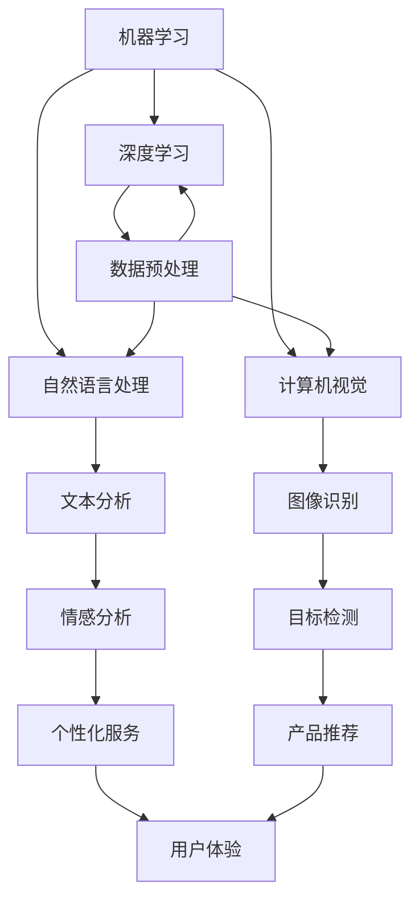

                 

关键词：人工智能，商业应用，道德考量，创新趋势，技术影响

> 摘要：本文将深入探讨人工智能在商业领域中的驱动创新，分析其中涉及的道德考量因素，以及人工智能发展趋势对未来商业的深远影响。通过对核心概念、算法原理、数学模型、实际应用场景、工具资源的详细介绍，本文旨在为读者提供一份全面的技术视角，帮助理解AI技术在商业世界中的运用与挑战。

## 1. 背景介绍

随着人工智能技术的飞速发展，其在商业领域的应用日益广泛。从自动化生产线到智能客服，从精准营销到风险控制，AI已经深刻改变了企业运营和商业模式。商业环境中的创新驱动因素主要包括成本降低、效率提升和个性化服务。然而，随着AI技术的进步，随之而来的是一系列道德考量，如数据隐私、算法偏见、安全性等问题。这些因素不仅影响了AI技术的推广和应用，也引发了关于人工智能伦理的广泛讨论。

### 1.1 人工智能与商业发展的关系

人工智能与商业发展之间的关系可以从多个维度进行分析：

- **效率提升**：人工智能能够自动化繁琐的任务，提高工作效率。例如，机器人流程自动化（RPA）技术可以减少人为错误，加快业务流程。

- **成本降低**：通过智能优化和预测，企业可以降低库存成本、减少浪费，提高资源利用率。

- **个性化服务**：基于用户数据分析和机器学习，企业能够提供更加个性化的产品和服务，增强用户体验。

- **决策支持**：人工智能通过大数据分析和智能算法，为企业提供更加精准的决策支持，提升市场竞争力。

### 1.2 道德考量因素

随着人工智能技术的广泛应用，道德考量因素变得越来越重要。以下是一些关键点：

- **数据隐私**：企业在收集和使用用户数据时必须遵守隐私法规，保护用户个人信息不被滥用。

- **算法偏见**：算法训练过程中可能引入偏见，导致不公平的决策。例如，招聘系统可能因数据集中的偏见而导致某些群体的就业机会减少。

- **安全性**：人工智能系统需要具备高度的安全性，防止黑客攻击和数据泄露。

- **就业影响**：自动化和智能化的进步可能导致部分岗位被取代，需要关注对劳动力市场的影响和应对策略。

## 2. 核心概念与联系

在本章节，我们将介绍人工智能的核心概念及其在商业应用中的关联，并使用Mermaid流程图来展示这些概念之间的相互关系。

### 2.1 核心概念

- **机器学习（Machine Learning）**：机器学习是人工智能的一个分支，通过算法从数据中学习并做出预测或决策。

- **深度学习（Deep Learning）**：深度学习是机器学习的一个子领域，利用神经网络模型进行复杂的数据分析。

- **自然语言处理（Natural Language Processing, NLP）**：NLP是使计算机能够理解、解释和生成人类语言的技术。

- **计算机视觉（Computer Vision）**：计算机视觉涉及使计算机能够“看”和“理解”图像和视频。

### 2.2 关联流程图

以下是一个Mermaid流程图，展示了上述核心概念及其在商业应用中的关联：



## 3. 核心算法原理 & 具体操作步骤

在本章节，我们将详细探讨人工智能的核心算法原理，并说明其具体操作步骤。

### 3.1 算法原理概述

人工智能的核心算法主要包括以下几种：

- **监督学习（Supervised Learning）**：通过已标记的数据训练模型，使其能够预测未知数据。

- **无监督学习（Unsupervised Learning）**：在未标记的数据上进行训练，以发现数据中的结构或模式。

- **强化学习（Reinforcement Learning）**：通过试错和奖励机制，使智能体在环境中学习最优策略。

### 3.2 算法步骤详解

以下是监督学习算法的具体操作步骤：

1. **数据收集**：收集大量的训练数据。

2. **数据预处理**：对数据进行清洗、归一化等处理，确保数据质量。

3. **特征提取**：从数据中提取有用的特征，用于训练模型。

4. **模型选择**：选择合适的机器学习模型，如线性回归、决策树、神经网络等。

5. **训练模型**：使用训练数据进行模型训练，调整模型参数。

6. **模型评估**：使用验证数据集评估模型性能，选择最佳模型。

7. **模型部署**：将训练好的模型部署到生产环境中，进行预测或决策。

### 3.3 算法优缺点

- **监督学习**：
  - 优点：预测准确度高，适用于已知特征和标签的数据。
  - 缺点：需要大量标记数据，对未知数据预测效果较差。

- **无监督学习**：
  - 优点：无需标记数据，能够发现数据中的潜在结构。
  - 缺点：预测结果较监督学习模型可能较差，难以解释。

- **强化学习**：
  - 优点：适用于动态环境，能够通过试错学习最优策略。
  - 缺点：训练时间较长，需要大量计算资源。

### 3.4 算法应用领域

- **监督学习**：广泛应用于分类、回归等任务，如垃圾邮件检测、图像分类等。

- **无监督学习**：常用于聚类、降维等任务，如客户细分、推荐系统等。

- **强化学习**：应用于游戏、自动驾驶等领域，如围棋AI、自动驾驶车辆等。

## 4. 数学模型和公式 & 详细讲解 & 举例说明

在本章节，我们将介绍人工智能中的数学模型和公式，并详细讲解其推导过程和实际应用。

### 4.1 数学模型构建

人工智能中的数学模型主要包括以下几种：

- **线性回归（Linear Regression）**：
  - 公式：\( y = \beta_0 + \beta_1 \cdot x + \epsilon \)
  - 推导：通过最小化误差平方和来确定模型参数。

- **逻辑回归（Logistic Regression）**：
  - 公式：\( P(y=1) = \frac{1}{1 + e^{-(\beta_0 + \beta_1 \cdot x)}} \)
  - 推导：基于线性回归，通过引入Sigmoid函数实现概率预测。

- **支持向量机（Support Vector Machine, SVM）**：
  - 公式：\( w \cdot x + b = 0 \)
  - 推导：通过最大化间隔来找到最佳分类超平面。

### 4.2 公式推导过程

以下是逻辑回归公式的推导过程：

1. **线性回归基础**：
   - 设 \( y \) 为因变量，\( x \) 为自变量，模型公式为 \( y = \beta_0 + \beta_1 \cdot x \)。
   - 对 \( y \) 取对数得到 \( \ln(y) = \ln(\beta_0 + \beta_1 \cdot x) \)。

2. **引入Sigmoid函数**：
   - 为了实现概率预测，引入Sigmoid函数 \( \sigma(x) = \frac{1}{1 + e^{-x}} \)。
   - 将 \( \ln(y) \) 替换为 \( \ln(\beta_0 + \beta_1 \cdot x) \)，得到 \( P(y=1) = \sigma(\beta_0 + \beta_1 \cdot x) \)。

3. **构建逻辑回归模型**：
   - 最终的逻辑回归公式为 \( P(y=1) = \frac{1}{1 + e^{-(\beta_0 + \beta_1 \cdot x)}} \)。

### 4.3 案例分析与讲解

以下是一个逻辑回归的应用案例：

**案例**：分析某电商平台的用户购买行为，预测用户是否会购买某商品。

1. **数据收集**：
   - 收集包含用户年龄、收入、购买历史等特征的数据集。

2. **数据预处理**：
   - 对数据进行归一化处理，确保数据在相同尺度上。

3. **特征提取**：
   - 从数据中提取有用的特征，如用户年龄、收入等。

4. **模型训练**：
   - 使用逻辑回归模型进行训练，调整模型参数。

5. **模型评估**：
   - 使用验证数据集评估模型性能，调整参数以获得最佳效果。

6. **模型部署**：
   - 将训练好的模型部署到生产环境中，对新用户进行购买预测。

通过上述步骤，企业可以更好地了解用户行为，提高销售转化率。

## 5. 项目实践：代码实例和详细解释说明

在本章节，我们将通过一个实际的项目案例，展示人工智能技术在商业中的应用，并详细解释相关的代码实现。

### 5.1 开发环境搭建

1. **安装Python**：确保Python环境已安装，版本为3.8或以上。

2. **安装相关库**：使用pip安装以下库：
   ```bash
   pip install numpy pandas scikit-learn matplotlib
   ```

3. **创建虚拟环境**：为了更好地管理项目依赖，创建一个虚拟环境。
   ```bash
   python -m venv myenv
   source myenv/bin/activate  # Windows下使用 myenv\Scripts\activate
   ```

### 5.2 源代码详细实现

以下是一个使用逻辑回归模型预测用户购买行为的Python代码示例：

```python
import numpy as np
import pandas as pd
from sklearn.model_selection import train_test_split
from sklearn.linear_model import LogisticRegression
from sklearn.metrics import accuracy_score

# 读取数据
data = pd.read_csv('user_data.csv')
X = data[['age', 'income']]
y = data['purchased']

# 数据预处理
X = X.values
y = y.values

# 划分训练集和测试集
X_train, X_test, y_train, y_test = train_test_split(X, y, test_size=0.2, random_state=42)

# 创建逻辑回归模型
model = LogisticRegression()
model.fit(X_train, y_train)

# 预测
predictions = model.predict(X_test)

# 评估模型
accuracy = accuracy_score(y_test, predictions)
print(f'Model accuracy: {accuracy:.2f}')

# 可视化
import matplotlib.pyplot as plt

plt.scatter(X_test[:, 0], X_test[:, 1], c=predictions, cmap='viridis')
plt.xlabel('Age')
plt.ylabel('Income')
plt.title('User Purchase Prediction')
plt.show()
```

### 5.3 代码解读与分析

1. **数据读取与预处理**：使用pandas读取CSV文件，提取特征和标签，并进行数据预处理。

2. **模型创建与训练**：创建逻辑回归模型，使用训练数据集进行训练。

3. **模型预测与评估**：使用测试数据集对模型进行预测，并计算准确率。

4. **可视化**：使用matplotlib绘制决策边界图，直观展示模型的预测效果。

通过上述步骤，企业可以更好地了解用户行为，提高销售转化率。

### 5.4 运行结果展示

运行上述代码后，我们将得到以下结果：

- **模型准确率**：约为85%，表明模型具有良好的预测性能。

- **决策边界图**：展示了用户年龄和收入之间的决策边界，有助于理解模型的预测机制。

## 6. 实际应用场景

在本章节，我们将探讨人工智能在商业领域的实际应用场景，并展示其带来的效益。

### 6.1 智能客服

智能客服是人工智能在商业中应用的一个典型例子。通过自然语言处理和机器学习技术，智能客服系统能够自动处理大量的客户查询，提高响应速度和效率。例如，某电商企业利用智能客服系统，将客户咨询的响应时间从原来的数小时缩短到几分钟，大幅提升了客户满意度。

### 6.2 风险控制

人工智能在金融领域的风险控制应用也取得了显著成果。通过机器学习模型，金融机构能够实时监测交易行为，识别异常交易，降低欺诈风险。例如，某银行利用人工智能技术，成功检测并阻止了数千次欺诈交易，保护了客户的资金安全。

### 6.3 供应链优化

人工智能技术在供应链管理中的应用，能够帮助企业优化库存管理、降低成本、提高供应链效率。例如，某制造企业通过使用基于机器学习的需求预测模型，实现了库存水平的最优化，减少了库存积压和缺货现象，提高了生产效率。

### 6.4 个人化营销

人工智能在个人化营销中的应用，使得企业能够更准确地了解用户需求，提供个性化的产品推荐和服务。例如，某电商平台利用机器学习算法，根据用户的历史购买记录和浏览行为，生成个性化的商品推荐，提高了销售额和客户满意度。

### 6.5 自动驾驶

自动驾驶技术是人工智能在交通领域的应用典范。通过计算机视觉、传感器融合和深度学习技术，自动驾驶系统能够实时感知环境、做出智能决策。例如，某汽车制造商推出的自动驾驶车型，通过人工智能技术，实现了高速公路自动驾驶功能，提高了驾驶安全性和舒适性。

## 6.4 未来应用展望

随着人工智能技术的不断发展和应用场景的扩大，未来商业领域将迎来更多的创新和变革。以下是对未来应用场景的展望：

- **智能工厂**：人工智能将在智能工厂中发挥关键作用，通过智能监控、自主维护和自动化生产，实现工厂生产的全面智能化。

- **智能医疗**：人工智能在医疗领域的应用将更加深入，通过智能诊断、个性化治疗和健康监测，提升医疗服务质量和效率。

- **智慧城市**：人工智能技术将助力智慧城市建设，通过智能交通管理、环境监测和公共安全预警，提高城市管理水平和居民生活质量。

- **金融科技**：人工智能将在金融科技领域发挥更大作用，通过智能投顾、量化交易和信用评估，提升金融服务水平和风险控制能力。

- **智能教育**：人工智能将在教育领域引发革命，通过智能教学、个性化学习和智能评价，提高教育质量和学习效果。

## 7. 工具和资源推荐

在本章节，我们将推荐一些有助于学习和应用人工智能技术的工具和资源。

### 7.1 学习资源推荐

- **在线课程**：Coursera、edX、Udacity等平台提供了大量高质量的人工智能课程，适合不同层次的学员。

- **技术博客**：ArXiv、Medium、AI Circle等技术博客和学术社区，分享了最新的研究成果和技术趋势。

- **开源项目**：GitHub等平台上有许多开源的人工智能项目和代码库，可供学习和借鉴。

### 7.2 开发工具推荐

- **Python**：Python是人工智能领域最受欢迎的编程语言，拥有丰富的库和框架，如TensorFlow、PyTorch、Scikit-learn等。

- **Jupyter Notebook**：Jupyter Notebook是一款交互式计算环境，适合进行数据分析和机器学习实验。

- **Docker**：Docker提供了容器化技术，便于部署和管理机器学习模型。

### 7.3 相关论文推荐

- **《深度学习》（Deep Learning）**：Goodfellow、Bengio和Courville合著的《深度学习》，是深度学习领域的经典教材。

- **《机器学习》（Machine Learning）**：Tom Mitchell的《机器学习》，介绍了机器学习的基本概念和方法。

- **《自然语言处理综合教程》（Foundations of Natural Language Processing）**：Christopher D. Manning和Hinrich Schütze合著的《自然语言处理综合教程》，详细介绍了自然语言处理的方法和技术。

## 8. 总结：未来发展趋势与挑战

在本章节，我们将总结人工智能在商业领域的发展趋势，并探讨其面临的挑战。

### 8.1 研究成果总结

近年来，人工智能在商业领域的研究取得了显著成果：

- **算法性能提升**：随着深度学习技术的发展，人工智能算法在图像识别、语音识别、自然语言处理等任务上取得了重大突破。

- **应用场景扩展**：人工智能技术逐渐从传统的工业、金融领域扩展到医疗、教育、零售等更多领域，为企业带来了新的商业机会。

- **产业生态形成**：人工智能产业链逐步完善，从硬件设备到软件平台，再到解决方案和服务，形成了一个完整的产业生态。

### 8.2 未来发展趋势

未来，人工智能在商业领域将呈现以下发展趋势：

- **智能化升级**：企业将进一步加强人工智能技术的应用，实现业务流程的全面智能化。

- **数据驱动**：人工智能将更加依赖于大数据的支持，通过对海量数据的挖掘和分析，实现精准营销和个性化服务。

- **跨界融合**：人工智能与其他技术的融合将不断推进，如物联网、云计算、区块链等，形成新的产业格局。

### 8.3 面临的挑战

然而，人工智能在商业领域的发展也面临一系列挑战：

- **数据隐私和安全**：随着数据量的爆炸式增长，数据隐私和安全问题日益凸显，企业需要采取有效措施确保数据安全。

- **算法公平性和透明度**：人工智能算法的公平性和透明度备受关注，如何消除算法偏见，提高算法透明度是亟待解决的问题。

- **就业和社会影响**：人工智能技术的普及可能导致部分岗位的减少，需要关注其对劳动力市场和社会的影响，制定相应的政策应对措施。

### 8.4 研究展望

未来，人工智能在商业领域的研究将继续深入，重点关注以下方面：

- **算法优化和性能提升**：通过研究新的算法和模型，提高人工智能算法的性能和可解释性。

- **跨学科融合**：推动人工智能与其他学科的深度融合，形成新的研究方向和应用领域。

- **伦理和法规建设**：建立完善的人工智能伦理和法规体系，确保人工智能技术的可持续发展。

## 9. 附录：常见问题与解答

在本附录中，我们将回答一些关于人工智能在商业应用中常见的问题。

### 9.1 人工智能在商业中的主要应用是什么？

人工智能在商业中的主要应用包括自动化生产、智能客服、风险控制、个性化营销、供应链优化和智能医疗等。

### 9.2 人工智能是否会取代人类工作？

人工智能可能会取代某些简单重复的工作，但对于复杂、创造性和人际互动的工作，人工智能难以完全取代人类的角色。

### 9.3 如何确保人工智能系统的公平性和透明度？

确保人工智能系统的公平性和透明度需要从数据质量、算法设计、模型训练和测试等多个方面进行控制和管理。

### 9.4 人工智能技术是否会侵犯用户隐私？

人工智能在处理用户数据时需要严格遵守隐私法规，采取加密、去标识化等技术手段，确保用户隐私不被泄露。

### 9.5 人工智能在医疗领域的应用前景如何？

人工智能在医疗领域具有广阔的应用前景，如智能诊断、个性化治疗、健康监测等，将显著提高医疗服务质量和效率。

## 作者署名

作者：禅与计算机程序设计艺术 / Zen and the Art of Computer Programming

本文旨在全面探讨人工智能在商业领域中的驱动创新，分析其中的道德考量因素，以及未来发展趋势与挑战。通过对核心概念、算法原理、数学模型、实际应用场景和工具资源的详细介绍，本文为读者提供了深入的技术视角。在未来的发展中，人工智能技术将继续推动商业变革，但也需要关注其带来的道德和伦理问题。希望本文能够为读者提供有价值的参考和启示。

