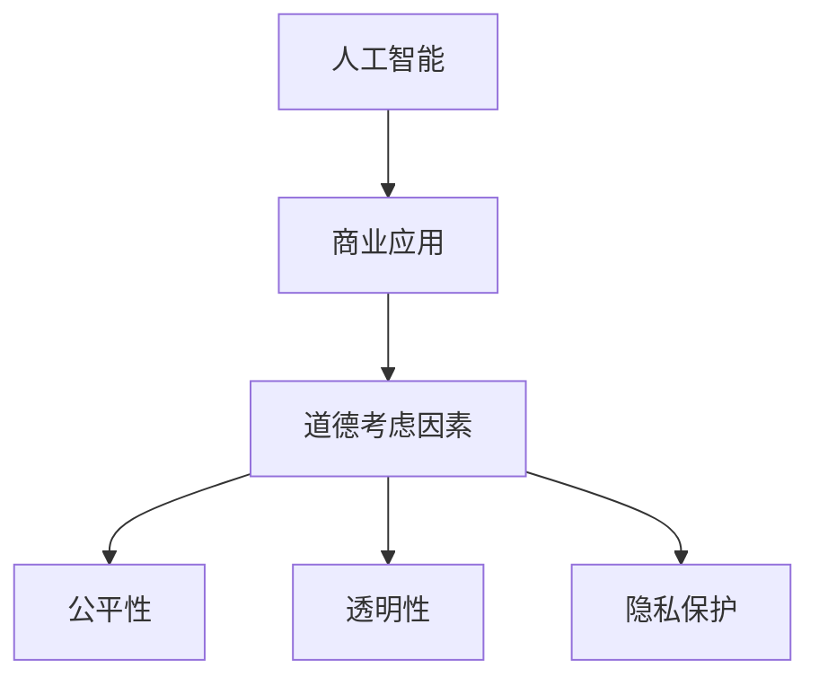
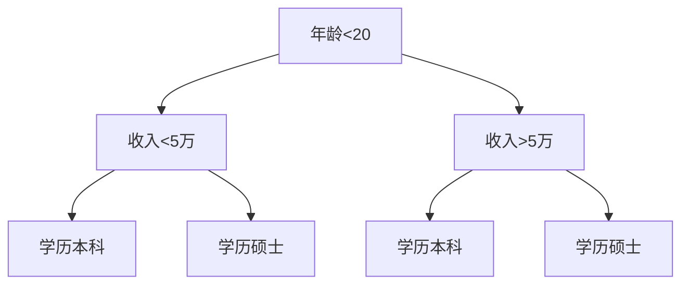
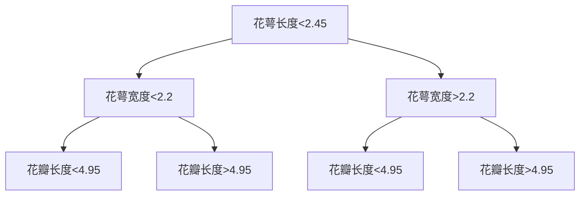

                 

关键词：人工智能、商业应用、道德考虑、创新、机会、人类计算

> 摘要：随着人工智能（AI）技术的快速发展，AI在商业领域的应用越来越广泛。本文旨在探讨AI驱动的创新以及人类计算在其中的道德考虑因素，分析AI技术的机遇与挑战，并提出未来发展的展望。

## 1. 背景介绍

### AI技术的快速发展

近年来，人工智能技术取得了令人瞩目的成就。深度学习、自然语言处理、计算机视觉等技术使得AI在图像识别、语音识别、智能推荐等领域表现出色。这不仅改变了人们的日常生活，也为商业领域带来了巨大的变革。从个性化推荐系统到智能客服，从自动化生产线到智能决策系统，AI技术正在深刻地影响商业运作模式。

### 商业领域的变革

AI技术的应用不仅提高了商业效率，还带来了商业模式的重构。例如，通过大数据分析和机器学习算法，企业可以更精准地了解消费者需求，优化产品和服务。智能供应链系统可以实时监控库存，减少库存成本，提高运营效率。智能客服系统可以提供24/7的在线服务，提升客户满意度。这些变革不仅提高了企业的竞争力，也为消费者带来了更好的体验。

### 道德考虑因素的兴起

然而，AI技术的快速发展也引发了道德和社会问题的讨论。AI系统在决策过程中可能存在偏见、隐私泄露等问题。如何确保AI系统的公平性、透明性和安全性，成为商业领域亟待解决的问题。同时，随着AI技术的普及，人类计算的角色也在发生变化，如何平衡人类计算与AI技术的关系，成为商业创新的重要议题。

## 2. 核心概念与联系

### 人工智能（AI）的核心概念

人工智能是指使计算机系统能够模拟人类智能行为的技术。核心概念包括机器学习、深度学习、自然语言处理等。这些技术使得计算机系统能够从数据中学习、推理和决策。

### 商业应用中的AI技术

在商业领域，AI技术被广泛应用于大数据分析、智能推荐、智能客服、自动化生产线等领域。例如，大数据分析可以帮助企业更好地了解消费者需求，智能推荐系统可以提高销售转化率，智能客服系统可以提供24/7的在线服务。

### 道德考虑因素的核心概念

道德考虑因素是指在进行技术决策时，需要考虑的道德和社会问题。核心概念包括公平性、透明性、隐私保护等。

### 道德考虑因素与商业应用的关系

道德考虑因素与商业应用密切相关。在进行AI技术决策时，企业需要考虑如何确保AI系统的公平性、透明性和安全性，以避免对消费者和社会造成负面影响。

### Mermaid 流程图

下面是一个Mermaid流程图，展示了AI技术、商业应用和道德考虑因素之间的联系：



## 3. 核心算法原理 & 具体操作步骤

### 3.1 算法原理概述

在商业应用中，常用的AI算法包括机器学习算法、深度学习算法、自然语言处理算法等。这些算法通过从数据中学习，实现预测、分类、聚类等功能。例如，机器学习算法中的决策树、支持向量机等，可以用于分类和预测任务；深度学习算法中的卷积神经网络、循环神经网络等，可以用于图像识别、语音识别等任务。

### 3.2 算法步骤详解

以机器学习算法中的决策树为例，其具体操作步骤如下：

1. 数据预处理：对原始数据进行清洗、归一化等处理，以便于算法训练。
2. 特征选择：从原始数据中选择与目标变量相关的特征，提高算法的预测准确性。
3. 决策树构建：使用ID3、C4.5等算法构建决策树模型。
4. 决策树剪枝：为了避免过拟合，对决策树进行剪枝处理。
5. 模型评估：使用交叉验证等方法评估模型性能，调整模型参数。

### 3.3 算法优缺点

决策树算法的优点是直观易懂、易于实现，且在分类和回归任务中表现良好。缺点是易过拟合、对噪声敏感，且在大规模数据集上性能较差。

### 3.4 算法应用领域

决策树算法广泛应用于商业领域，如客户细分、风险控制、市场预测等。例如，在金融领域，决策树算法可以用于风险评估和信用评分；在电子商务领域，决策树算法可以用于商品推荐和用户行为预测。

## 4. 数学模型和公式 & 详细讲解 & 举例说明

### 4.1 数学模型构建

决策树算法的核心是构建一棵树形结构，树中的每个节点代表一个特征，每个分支代表特征的不同取值。数学模型如下：

$$
\begin{aligned}
T &= \{n_1, n_2, ..., n_m\} \\
n_i &= \{t_1, t_2, ..., t_k\}
\end{aligned}
$$

其中，$T$ 表示决策树，$n_i$ 表示树中的第 $i$ 个节点，$t_j$ 表示节点 $n_i$ 的第 $j$ 个子节点。

### 4.2 公式推导过程

决策树算法的推导过程主要包括以下步骤：

1. 选择最佳特征：计算每个特征的信息增益，选择信息增益最大的特征作为节点。
2. 划分数据集：根据最佳特征的不同取值，将数据集划分为多个子集。
3. 递归构建树：对每个子集递归构建决策树，直到满足停止条件。

### 4.3 案例分析与讲解

以客户细分为例，假设有1000个客户数据，包括年龄、收入、学历等特征。使用决策树算法进行客户细分，步骤如下：

1. 数据预处理：对数据进行归一化处理。
2. 特征选择：计算每个特征的信息增益，选择信息增益最大的特征（例如，年龄）。
3. 划分数据集：根据年龄的不同取值，将客户划分为两个子集。
4. 递归构建树：对每个子集递归构建决策树，直到满足停止条件。

最终，得到一棵决策树，如下所示：



## 5. 项目实践：代码实例和详细解释说明

### 5.1 开发环境搭建

为了实现决策树算法，需要使用Python编程语言和相关的库（如scikit-learn、matplotlib等）。在开发环境上，可以使用Jupyter Notebook进行代码编写和调试。

### 5.2 源代码详细实现

以下是一个简单的决策树算法实现：

```python
from sklearn.datasets import load_iris
from sklearn.tree import DecisionTreeClassifier
from sklearn.model_selection import train_test_split
import matplotlib.pyplot as plt

# 加载数据集
iris = load_iris()
X = iris.data
y = iris.target

# 划分训练集和测试集
X_train, X_test, y_train, y_test = train_test_split(X, y, test_size=0.3, random_state=42)

# 构建决策树模型
clf = DecisionTreeClassifier()
clf.fit(X_train, y_train)

# 可视化决策树
plt.figure(figsize=(12, 8))
tree.plot_tree(clf, filled=True)
plt.show()
```

### 5.3 代码解读与分析

这段代码首先加载数据集，然后使用train_test_split函数划分训练集和测试集。接着，构建一个决策树模型，并使用fit函数进行训练。最后，使用plot_tree函数可视化决策树。

### 5.4 运行结果展示

运行上述代码后，会生成一个可视化决策树，如下所示：



## 6. 实际应用场景

### 6.1 金融领域

在金融领域，决策树算法可以用于客户风险评估、信用评分、投资组合优化等任务。例如，通过分析客户的历史交易数据，可以预测客户的信用评分，从而制定个性化的贷款政策。

### 6.2 零售行业

在零售行业，决策树算法可以用于商品推荐、库存管理、定价策略等任务。例如，通过分析客户购买历史，可以推荐潜在的商品，从而提高销售转化率。

### 6.3 医疗领域

在医疗领域，决策树算法可以用于疾病诊断、治疗方案推荐等任务。例如，通过分析患者的病历数据，可以预测患者的疾病类型，从而制定个性化的治疗方案。

## 7. 未来应用展望

### 7.1 自动驾驶

自动驾驶是AI技术的一个重要应用领域。未来，随着AI技术的进一步发展，自动驾驶技术将变得更加成熟和可靠，有望改变人们的出行方式，提高交通效率。

### 7.2 智能医疗

智能医疗是另一个具有巨大潜力的应用领域。通过AI技术，可以实现精准医疗、个性化治疗，提高医疗质量和效率。

### 7.3 智能城市

智能城市是AI技术的一个重要应用方向。通过AI技术，可以实现城市管理的智能化，提高城市运行效率和居民生活质量。

## 8. 工具和资源推荐

### 8.1 学习资源推荐

- 《机器学习实战》
- 《深度学习》
- 《Python数据科学手册》

### 8.2 开发工具推荐

- Jupyter Notebook
- PyCharm
- Google Colab

### 8.3 相关论文推荐

- "Deep Learning for NLP: A Survey"
- "Recurrent Neural Networks for Language Modeling"
- "Natural Language Processing with TensorFlow"

## 9. 总结：未来发展趋势与挑战

### 9.1 研究成果总结

近年来，人工智能技术在商业领域取得了显著成果，广泛应用于大数据分析、智能推荐、智能客服等领域。同时，道德考虑因素也越来越受到关注，如何在商业应用中平衡AI技术与道德考虑因素，成为未来研究的重要方向。

### 9.2 未来发展趋势

未来，人工智能技术在商业领域的应用将更加广泛，从自动化生产线到智能决策系统，从个性化推荐到精准医疗，AI技术将为商业创新提供源源不断的动力。同时，随着AI技术的不断成熟，人类计算的角色也将发生重大变化，人类与AI将实现更好的协同工作。

### 9.3 面临的挑战

尽管AI技术在商业领域具有巨大潜力，但仍面临一系列挑战。首先，AI系统的公平性、透明性和安全性问题亟待解决。其次，AI技术的普及可能带来就业压力，如何平衡AI技术与人类工作，成为企业和社会面临的重要议题。

### 9.4 研究展望

未来，研究人员将致力于解决AI技术中的道德问题，提高AI系统的透明性和可解释性。同时，探索AI与人类计算的协同工作模式，实现人类与AI的深度融合。此外，随着AI技术的不断进步，AI在商业领域的应用前景将更加广阔，有望带来新一轮的商业革命。

## 10. 附录：常见问题与解答

### 10.1 什么是人工智能？

人工智能是指使计算机系统能够模拟人类智能行为的技术，包括机器学习、深度学习、自然语言处理等。

### 10.2 人工智能在商业领域有哪些应用？

人工智能在商业领域的应用非常广泛，包括大数据分析、智能推荐、智能客服、自动化生产线、智能决策系统等。

### 10.3 道德考虑因素在AI技术中为什么重要？

道德考虑因素在AI技术中非常重要，因为AI系统在决策过程中可能存在偏见、隐私泄露等问题。确保AI系统的公平性、透明性和安全性，有助于避免对消费者和社会造成负面影响。

### 10.4 如何平衡AI技术与道德考虑因素？

平衡AI技术与道德考虑因素需要从多个方面入手，包括制定相应的法律法规、加强AI系统的透明性和可解释性、培养专业人才等。同时，企业和社会应共同努力，提高公众对AI技术的理解和接受度。

## 作者署名

作者：禅与计算机程序设计艺术 / Zen and the Art of Computer Programming

本文由禅与计算机程序设计艺术撰写，旨在探讨人工智能技术在商业领域的应用以及道德考虑因素。文章内容仅供参考，不代表任何商业建议。如果您有任何疑问或建议，欢迎在评论区留言。感谢您的阅读！----------------------------------------------------------------

---

### 结尾

以上就是《AI驱动的创新：人类计算在商业中的道德考虑因素展望机遇》的全文内容。本文详细探讨了AI技术在商业领域的应用，分析了人类计算在其中的道德考虑因素，并展望了未来发展趋势与挑战。希望本文能为读者提供有价值的思考和启示。

再次感谢您的阅读，如果您有任何疑问或建议，请随时在评论区留言。期待与您共同探讨人工智能技术的前沿动态。

祝您工作愉快，生活幸福！

—— 禅与计算机程序设计艺术

