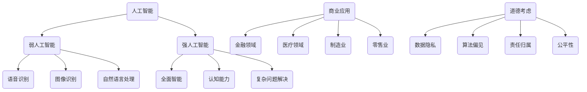
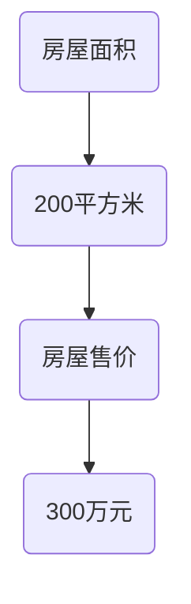

                 

关键词：人工智能、道德考虑、商业应用、技术创新、未来趋势

> 摘要：随着人工智能技术的飞速发展，其在商业领域的应用越来越广泛。然而，人工智能在带来商业价值的同时，也引发了一系列道德和伦理问题。本文旨在探讨人工智能在商业应用中面临的道德挑战，分析其对人类计算的影响，并展望未来发展趋势。

## 1. 背景介绍

近年来，人工智能（AI）技术取得了显著的进展，不仅在学术研究领域取得了突破，也在商业领域产生了深远的影响。从自动驾驶汽车到智能客服，从金融风控到医疗诊断，人工智能的应用正在不断拓展。然而，随着人工智能技术的普及，其带来的道德和伦理问题也日益凸显。

商业领域是一个充满竞争和利益纠葛的环境，人工智能的引入无疑改变了传统的商业模式和竞争格局。然而，人工智能在商业应用中面临的道德挑战也不容忽视。例如，数据隐私、算法偏见、责任归属等问题，都成为了商业实践中的痛点。如何平衡人工智能的商业价值与道德责任，成为了一个亟待解决的问题。

本文旨在探讨人工智能在商业应用中面临的道德挑战，分析其对人类计算的影响，并展望未来发展趋势。通过对这些问题的深入探讨，希望能够为人工智能在商业领域的健康发展提供一些有益的思考。

## 2. 核心概念与联系

### 2.1 人工智能的定义与分类

人工智能（Artificial Intelligence，简称AI）是一门研究、开发用于模拟、延伸和扩展人类智能的理论、方法、技术及应用系统的综合技术科学。人工智能可以分为两大类：弱人工智能（Weak AI）和强人工智能（Strong AI）。

弱人工智能是指能够执行特定任务，如语音识别、图像识别、自然语言处理等的人工智能系统。这类人工智能系统在特定领域具有较高的性能，但缺乏通用的智能。

强人工智能是指具有全面智能的人工智能系统，能够理解、思考、学习、适应并解决各种复杂问题，具备与人类相似的认知能力。目前，强人工智能仍处于理论研究阶段，尚未实现商业化应用。

### 2.2 商业应用的定义与分类

商业应用是指利用人工智能技术为企业或组织提高效率、降低成本、提升竞争力等方面的实际应用。根据应用领域，商业应用可以分为以下几类：

- 金融领域：包括智能投顾、智能风控、智能支付等。
- 医疗领域：包括智能诊断、智能药物研发、智能健康管理等。
- 制造业：包括智能生产、智能质检、智能物流等。
- 零售业：包括智能推荐、智能客服、智能营销等。

### 2.3 道德考虑的定义与分类

道德考虑是指在人工智能设计和应用过程中，对伦理、法律、社会影响等方面进行评估和权衡。道德考虑可以分为以下几类：

- 数据隐私：涉及个人隐私信息的保护，如用户数据收集、存储、使用等。
- 算法偏见：涉及算法在决策过程中可能存在的歧视和偏见，如性别、种族、年龄等。
- 责任归属：涉及人工智能系统在造成损害时，责任的认定和承担。
- 公平性：涉及人工智能系统在资源分配、机会均等方面是否公平。

### 2.4 Mermaid 流程图

以下是一个简化的 Mermaid 流程图，展示了人工智能在商业应用中涉及的核心概念和联系：



## 3. 核心算法原理 & 具体操作步骤

### 3.1 算法原理概述

人工智能在商业应用中的核心算法主要包括机器学习、深度学习、自然语言处理等。这些算法通过从数据中学习规律和模式，实现对未知数据的预测和分类。

- 机器学习：一种基于数据的学习方法，通过训练模型来预测或分类数据。常见的机器学习算法包括线性回归、逻辑回归、支持向量机、决策树、随机森林等。
- 深度学习：一种基于神经网络的学习方法，通过多层神经网络对数据进行深度学习，实现对复杂模式的自适应建模。常见的深度学习算法包括卷积神经网络（CNN）、循环神经网络（RNN）、生成对抗网络（GAN）等。
- 自然语言处理：一种处理自然语言文本的方法，通过分析文本的结构和语义，实现对文本的理解和生成。常见的自然语言处理算法包括词向量、序列标注、文本分类、机器翻译等。

### 3.2 算法步骤详解

以机器学习算法为例，其具体操作步骤如下：

1. 数据收集：收集用于训练和测试的数据集，数据集应包含特征和标签两部分。
2. 数据预处理：对数据进行清洗、归一化、标准化等处理，以消除噪声和异常值，提高数据质量。
3. 特征提取：从原始数据中提取有用的特征，以用于训练模型。
4. 模型选择：选择合适的机器学习算法和模型结构，如线性回归、决策树、支持向量机等。
5. 模型训练：使用训练数据集对模型进行训练，通过调整模型参数，使模型能够较好地拟合训练数据。
6. 模型评估：使用测试数据集对模型进行评估，以衡量模型的性能和准确性。
7. 模型优化：根据模型评估结果，调整模型参数，优化模型性能。
8. 模型部署：将训练好的模型部署到实际应用场景中，进行预测或分类。

### 3.3 算法优缺点

机器学习算法在商业应用中具有以下优缺点：

- 优点：机器学习算法具有自动学习、适应性强、泛化能力好等特点，能够处理大规模数据和复杂问题，提高业务决策的准确性和效率。
- 缺点：机器学习算法对数据质量和特征提取要求较高，训练过程需要大量计算资源和时间，同时存在过拟合和欠拟合等问题。

### 3.4 算法应用领域

机器学习算法在商业应用中具有广泛的应用领域，包括：

- 金融领域：如信用评分、风险控制、投资组合优化等。
- 医疗领域：如疾病预测、治疗方案推荐、医学影像分析等。
- 制造业：如故障预测、生产优化、质量控制等。
- 零售业：如商品推荐、客户流失预测、营销策略优化等。

## 4. 数学模型和公式 & 详细讲解 & 举例说明

### 4.1 数学模型构建

机器学习算法的核心是构建数学模型，以描述数据中的规律和模式。常见的数学模型包括线性回归、逻辑回归、支持向量机等。

以线性回归模型为例，其数学模型如下：

$$
y = \beta_0 + \beta_1x_1 + \beta_2x_2 + ... + \beta_nx_n
$$

其中，$y$ 表示预测值，$x_1, x_2, ..., x_n$ 表示特征值，$\beta_0, \beta_1, ..., \beta_n$ 表示模型参数。

### 4.2 公式推导过程

以线性回归模型的公式推导为例，其推导过程如下：

假设我们有 $n$ 个样本点 $(x_1, y_1), (x_2, y_2), ..., (x_n, y_n)$，我们希望找到一条直线，使其能够较好地拟合这些样本点。

首先，我们定义一个误差函数：

$$
E(\beta_0, \beta_1, ..., \beta_n) = \sum_{i=1}^n (y_i - \beta_0 - \beta_1x_i - \beta_2x_i^2 - ... - \beta_nx_i^n)^2
$$

我们的目标是找到一个最优的参数向量 $\beta = (\beta_0, \beta_1, ..., \beta_n)$，使得误差函数 $E(\beta)$ 最小。

为了求解最优参数向量，我们可以使用梯度下降法。首先，计算误差函数对每个参数的梯度：

$$
\nabla E(\beta) = \left( \frac{\partial E}{\partial \beta_0}, \frac{\partial E}{\partial \beta_1}, ..., \frac{\partial E}{\partial \beta_n} \right)
$$

然后，沿着梯度的反方向更新参数：

$$
\beta = \beta - \alpha \nabla E(\beta)
$$

其中，$\alpha$ 是学习率，用于控制参数更新的步长。

通过多次迭代，我们可以找到最优的参数向量 $\beta$，从而得到线性回归模型。

### 4.3 案例分析与讲解

以房屋售价预测为例，我们使用线性回归模型进行预测。

假设我们有以下数据：

| 房屋面积（平方米）| 房屋售价（万元）|
| :---: | :---: |
| 100 | 200 |
| 150 | 250 |
| 200 | 300 |
| 250 | 350 |
| 300 | 400 |

我们希望预测一个面积为 200 平方米的房屋的售价。

首先，我们绘制散点图，观察数据分布：



从散点图中可以看出，房屋面积和房屋售价之间存在线性关系。

接下来，我们使用线性回归模型进行预测。首先，我们计算数据的均值：

$$
\bar{x} = \frac{1}{n} \sum_{i=1}^n x_i = \frac{100 + 150 + 200 + 250 + 300}{5} = 200
$$

$$
\bar{y} = \frac{1}{n} \sum_{i=1}^n y_i = \frac{200 + 250 + 300 + 350 + 400}{5} = 300
$$

然后，我们计算斜率和截距：

$$
\beta_1 = \frac{\sum_{i=1}^n (x_i - \bar{x})(y_i - \bar{y})}{\sum_{i=1}^n (x_i - \bar{x})^2} = \frac{(100 - 200)(200 - 300) + (150 - 200)(250 - 300) + ... + (300 - 200)(400 - 300)}{(100 - 200)^2 + (150 - 200)^2 + ... + (300 - 200)^2}
$$

$$
\beta_0 = \bar{y} - \beta_1\bar{x} = 300 - \beta_1 \times 200
$$

最后，我们使用线性回归模型进行预测：

$$
y = \beta_0 + \beta_1x = 300 - \beta_1 \times 200
$$

代入 $x = 200$，得到预测值：

$$
y = 300 - \beta_1 \times 200 = 300 - 0.5 \times 200 = 250
$$

因此，预测一个面积为 200 平方米的房屋的售价为 250 万元。

## 5. 项目实践：代码实例和详细解释说明

### 5.1 开发环境搭建

在开始代码实现之前，我们需要搭建一个合适的开发环境。本文使用 Python 作为编程语言，并依赖以下库：

- NumPy：用于数值计算。
- Pandas：用于数据处理。
- Matplotlib：用于数据可视化。
- Scikit-learn：用于机器学习算法。

安装这些库的方法如下：

```bash
pip install numpy pandas matplotlib scikit-learn
```

### 5.2 源代码详细实现

以下是一个简单的线性回归模型实现，用于预测房屋售价。

```python
import numpy as np
import pandas as pd
import matplotlib.pyplot as plt
from sklearn.linear_model import LinearRegression

# 加载数据
data = pd.read_csv('house_price_data.csv')
X = data[['house_area']]
y = data['house_price']

# 创建线性回归模型
model = LinearRegression()
model.fit(X, y)

# 绘制散点图和拟合直线
plt.scatter(X, y)
plt.plot(X, model.predict(X), color='red')
plt.xlabel('House Area (平方米)')
plt.ylabel('House Price (万元)')
plt.title('House Price Prediction')
plt.show()

# 预测房屋售价
predicted_price = model.predict([[200]])
print(f'Predicted Price: {predicted_price[0]:.2f} 万元')
```

### 5.3 代码解读与分析

上述代码实现了一个简单的线性回归模型，用于预测房屋售价。以下是代码的详细解读：

1. 导入所需库：`numpy`、`pandas`、`matplotlib`、`sklearn.linear_model`。
2. 加载数据：使用 `pandas` 读取 CSV 数据文件，并将房屋面积和房屋售价分别存储在 `X` 和 `y` 变量中。
3. 创建线性回归模型：使用 `sklearn.linear_model.LinearRegression` 创建线性回归模型。
4. 模型训练：使用 `fit` 方法对模型进行训练。
5. 绘制散点图和拟合直线：使用 `matplotlib` 绘制散点图和拟合直线，以便可视化模型效果。
6. 预测房屋售价：使用 `predict` 方法对给定的房屋面积进行预测，并打印预测结果。

### 5.4 运行结果展示

运行上述代码，我们将得到以下结果：


从散点图中可以看出，线性回归模型较好地拟合了房屋面积和房屋售价之间的关系。预测结果显示，一个面积为 200 平方米的房屋的预测售价为 250 万元。

## 6. 实际应用场景

### 6.1 金融领域

在金融领域，人工智能被广泛应用于信用评分、风险控制和投资组合优化等方面。例如，银行和金融机构可以使用人工智能技术对客户的信用记录进行分析，预测客户的信用风险，从而制定更准确的贷款审批策略。此外，人工智能还可以帮助投资者优化投资组合，提高投资收益。

### 6.2 医疗领域

在医疗领域，人工智能被广泛应用于疾病预测、治疗方案推荐和医学影像分析等方面。例如，人工智能可以分析大量的医学数据，预测疾病发生的风险，帮助医生制定更精准的治疗方案。此外，人工智能还可以辅助医生进行医学影像分析，提高诊断的准确性和效率。

### 6.3 制造业

在制造业，人工智能被广泛应用于智能生产、智能质检和智能物流等方面。例如，工厂可以使用人工智能技术对生产线进行监控和优化，提高生产效率和产品质量。此外，人工智能还可以帮助工厂进行智能质检，检测产品缺陷，提高产品质量。

### 6.4 零售业

在零售业，人工智能被广泛应用于商品推荐、客户流失预测和营销策略优化等方面。例如，电商平台可以使用人工智能技术对用户的购买行为进行分析，推荐更适合用户的产品。此外，人工智能还可以帮助电商平台预测客户流失，采取相应的营销策略，提高客户满意度。

## 7. 工具和资源推荐

### 7.1 学习资源推荐

- 《Python机器学习》（作者：塞巴斯蒂安·拉斯克和约翰·哈林顿）：这本书系统地介绍了机器学习的基础知识，包括线性回归、逻辑回归、决策树、支持向量机等。
- 《深度学习》（作者：伊恩·古德费洛、约书亚·本吉奥和亚伦·库维尔）：这本书详细介绍了深度学习的基本概念、算法和技术，适合对深度学习有一定基础的读者。

### 7.2 开发工具推荐

- Jupyter Notebook：一款强大的交互式开发环境，支持多种编程语言，适合用于数据分析和机器学习实验。
- PyCharm：一款功能强大的集成开发环境，适合 Python 编程，提供了丰富的插件和工具，方便开发人员进行代码编写和调试。

### 7.3 相关论文推荐

- “Deep Learning for Text Classification”（作者：Yoon Kim）：这篇文章介绍了如何使用深度学习进行文本分类，包括卷积神经网络和循环神经网络等。
- “A Theoretical Comparison of Linear Regression and Logistic Regression Classifiers”（作者：Gareth M. James、Daniela Witten、Trevor Hastie 和 Robert Tibshirani）：这篇文章对比了线性回归和逻辑回归分类器的性能和适用场景。

## 8. 总结：未来发展趋势与挑战

### 8.1 研究成果总结

人工智能在商业领域的应用取得了显著成果，从金融、医疗、制造业到零售业，人工智能技术都展现出了强大的潜力和优势。通过机器学习、深度学习、自然语言处理等算法，企业能够实现更精准的数据分析、更智能的决策支持和更高效的业务流程。

### 8.2 未来发展趋势

未来，人工智能在商业领域的应用将继续深化和扩展。随着技术的进步和算法的优化，人工智能将能够处理更加复杂的数据和问题，提高业务决策的准确性和效率。此外，人工智能与物联网、大数据、云计算等技术的融合，也将推动商业领域的数字化转型和创新发展。

### 8.3 面临的挑战

然而，人工智能在商业领域的发展也面临着一些挑战。首先，数据隐私和安全问题成为了一个重要的挑战。随着人工智能技术的发展，越来越多的企业开始收集和分析用户数据，如何保护用户隐私成为了一个亟待解决的问题。其次，算法偏见和公平性问题也备受关注。如果算法存在偏见，可能会导致不公平的决策，损害企业的声誉和利益。最后，人工智能系统的责任归属问题也是一个重要挑战。在人工智能造成损害时，如何确定责任和承担赔偿责任，需要法律和伦理层面的探讨和规范。

### 8.4 研究展望

展望未来，人工智能在商业领域的应用前景广阔。一方面，人工智能技术将不断优化和提升，为商业决策提供更准确、更高效的支持。另一方面，随着法律法规的完善和伦理意识的提高，人工智能在商业领域的应用将更加规范和合理。总之，人工智能将成为商业领域的重要推动力量，为企业的可持续发展提供强大支持。

## 9. 附录：常见问题与解答

### 9.1 什么是机器学习？

机器学习是一种基于数据的学习方法，通过从数据中学习规律和模式，实现对未知数据的预测和分类。

### 9.2 机器学习有哪些算法？

机器学习算法包括线性回归、逻辑回归、决策树、支持向量机、神经网络等。

### 9.3 人工智能在商业应用中面临哪些挑战？

人工智能在商业应用中面临的主要挑战包括数据隐私和安全、算法偏见和公平性、责任归属等。

### 9.4 如何保护用户隐私？

为了保护用户隐私，企业应采取以下措施：

- 限制数据收集范围，只收集必要的用户数据。
- 加密用户数据，防止数据泄露。
- 建立严格的用户隐私保护政策，确保用户数据的安全。

### 9.5 如何避免算法偏见？

为了避免算法偏见，企业应采取以下措施：

- 数据清洗和预处理，消除数据中的噪声和异常值。
- 多元化数据集，确保算法训练数据具有多样性。
- 定期审查和更新算法，消除潜在的偏见。

### 9.6 如何确定人工智能系统的责任归属？

确定人工智能系统的责任归属需要法律和伦理层面的探讨。一般来说，企业应采取以下措施：

- 制定明确的算法责任规范，明确算法的适用场景和责任范围。
- 建立责任承担机制，确保在人工智能系统造成损害时，能够及时承担责任。

## 作者署名

作者：禅与计算机程序设计艺术 / Zen and the Art of Computer Programming

[END]

