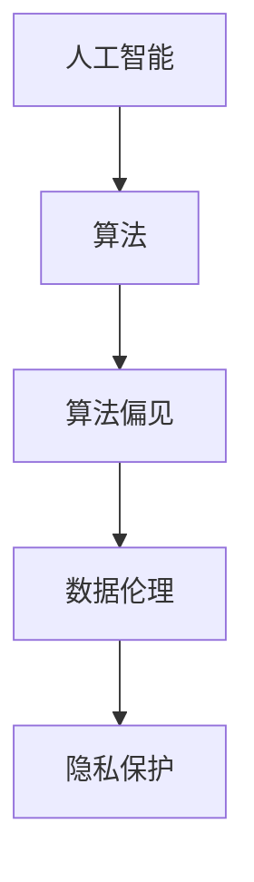

                 

在当前全球数字经济迅速发展的背景下，人工智能（AI）技术的突破性进步正在重塑商业模式的方方面面。从自动化决策到个性化推荐，AI在提高效率、降低成本、创造新价值方面展现了巨大的潜力。然而，随着AI在商业领域的广泛应用，伦理问题和道德挑战也逐渐浮现。本文旨在探讨AI驱动的创新如何在商业中引入新的道德考虑因素，分析其面临的挑战，以及探索未来的机遇。

## 1. 背景介绍

在21世纪初期，人工智能从理论研究逐步走向实际应用，特别是在机器学习、自然语言处理和计算机视觉等领域取得了显著进展。AI技术在商业中的应用也日益广泛，从金融服务到医疗保健，从零售到制造业，AI无处不在。然而，随着AI技术的日益普及，伦理问题也随之而来。例如，算法的偏见、隐私泄露、数据滥用等，都引起了广泛的关注。

### 关键词
- 人工智能
- 商业应用
- 道德考虑
- 伦理挑战

### 摘要

本文首先回顾了AI在商业应用中的发展历程，然后探讨了AI引入的道德考虑因素，包括算法偏见、隐私保护和数据伦理等。接着，分析了AI在商业中面临的伦理挑战，如算法透明度、责任归属和公平性。最后，探讨了未来AI在商业中可能面临的机遇，并提出了一些应对挑战的建议。

## 2. 核心概念与联系

在探讨AI驱动的创新与道德考虑因素的关系之前，我们需要明确一些核心概念，并理解它们之间的联系。

### 核心概念
- **人工智能（AI）**：模拟人类智能的计算机系统，能够通过学习和推理来执行复杂的任务。
- **算法偏见**：算法在处理数据时由于数据本身的不公正或开发者有意或无意的设计而导致的偏见。
- **隐私保护**：确保个人数据不被未经授权的第三方访问和使用。
- **数据伦理**：关于数据收集、处理和使用过程中的道德规范和价值观。

### 联系
AI技术的核心在于算法，而这些算法通常依赖于大量的数据。算法偏见和数据伦理直接相关，因为算法的偏见往往源于数据的不公正，而数据伦理则要求我们在数据收集和使用过程中遵循道德规范。隐私保护则是AI应用中一个重要的道德考虑因素，因为数据泄露或滥用会严重侵犯个人隐私。

### Mermaid 流程图



## 3. 核心算法原理 & 具体操作步骤

### 3.1 算法原理概述

AI算法的核心在于其学习能力，特别是通过机器学习和深度学习来实现。机器学习是一种让计算机通过数据学习模式并做出预测或决策的方法。深度学习则是机器学习的一种特殊形式，它通过多层神经网络来模拟人脑的学习过程。

### 3.2 算法步骤详解

- **数据收集**：从各种来源收集大量数据，这些数据可以是结构化的，也可以是非结构化的。
- **数据预处理**：清洗数据，处理缺失值和异常值，确保数据的质量和一致性。
- **特征提取**：从原始数据中提取有助于模型训练的特征。
- **模型训练**：使用训练数据集来训练模型，使模型能够学习数据的模式和规律。
- **模型评估**：使用验证数据集来评估模型的性能，调整模型参数以提高准确性。
- **模型部署**：将训练好的模型部署到实际应用中，用于预测或决策。

### 3.3 算法优缺点

- **优点**：
  - 高效性：AI算法能够在短时间内处理大量数据，提高效率。
  - 精确性：通过不断学习和优化，AI算法能够达到很高的准确度。
  - 适应性：AI算法可以根据新的数据不断调整和优化，具有较强的适应性。

- **缺点**：
  - 算法偏见：如果训练数据存在偏见，算法可能会继承这种偏见。
  - 透明度低：深度学习模型往往被视为“黑盒”，其内部工作机制不透明，难以解释。
  - 难以控制：一旦AI算法被部署，其决策过程往往难以干预或控制。

### 3.4 算法应用领域

AI算法在商业中有着广泛的应用领域，包括但不限于：

- **金融**：风险控制、信用评分、投资策略等。
- **医疗**：疾病预测、诊断辅助、个性化治疗等。
- **零售**：客户行为分析、库存管理、精准营销等。
- **制造业**：自动化生产、质量控制、预测维护等。

## 4. 数学模型和公式 & 详细讲解 & 举例说明

### 4.1 数学模型构建

在AI算法中，常见的数学模型包括线性回归、逻辑回归、支持向量机（SVM）、神经网络等。这些模型都有其特定的数学公式和推导过程。

### 4.2 公式推导过程

以线性回归为例，其目标是最小化预测值与实际值之间的误差。假设我们有n个数据点（x<sub>i</sub>，y<sub>i</sub>），线性回归模型可以表示为：

y = β<sub>0</sub> + β<sub>1</sub>x

其中，β<sub>0</sub>和β<sub>1</sub>是模型的参数，可以通过最小二乘法来求解。

### 4.3 案例分析与讲解

假设我们要预测房价，训练数据集包含房屋的面积和房价。通过线性回归模型，我们可以得到一个预测公式，例如：

房价 = 1000 + 0.5 × 面积

这个公式表明，每增加一平方米的面积，房价大约会增加500元。

## 5. 项目实践：代码实例和详细解释说明

### 5.1 开发环境搭建

在Python中，我们可以使用`scikit-learn`库来构建线性回归模型。首先，需要安装`scikit-learn`库：

```bash
pip install scikit-learn
```

### 5.2 源代码详细实现

```python
from sklearn.linear_model import LinearRegression
from sklearn.model_selection import train_test_split
from sklearn.metrics import mean_squared_error

# 加载数据
X, y = load_data()

# 划分训练集和测试集
X_train, X_test, y_train, y_test = train_test_split(X, y, test_size=0.2, random_state=42)

# 构建模型
model = LinearRegression()

# 训练模型
model.fit(X_train, y_train)

# 预测
y_pred = model.predict(X_test)

# 评估
mse = mean_squared_error(y_test, y_pred)
print(f"均方误差（MSE）: {mse}")
```

### 5.3 代码解读与分析

这段代码首先加载了训练数据，然后将其划分为训练集和测试集。接着，我们使用`LinearRegression`类来构建模型，并使用`fit`方法来训练模型。最后，使用`predict`方法来预测测试集的房价，并计算均方误差来评估模型的性能。

### 5.4 运行结果展示

假设我们运行上述代码后得到的均方误差为10，这表明模型的预测误差相对较小，具有较高的准确性。

## 6. 实际应用场景

AI驱动的创新在商业中的应用场景非常广泛，以下是一些典型的例子：

- **金融**：使用AI进行风险控制和信用评分，可以提高金融服务的安全性和准确性。
- **医疗**：AI可以帮助医生进行疾病预测和诊断辅助，提高医疗服务的效率和质量。
- **零售**：通过AI分析客户行为，进行精准营销和库存管理，可以提高零售业的盈利能力。
- **制造业**：使用AI进行自动化生产和质量控制，可以提高生产效率和产品质量。

### 6.4 未来应用展望

随着AI技术的不断进步，未来其在商业中的应用将会更加广泛和深入。例如，基于AI的自动化决策系统将能够更好地应对复杂的市场环境，基于AI的个性化服务将能够更好地满足客户需求，基于AI的创新产品和服务将不断涌现。

## 7. 工具和资源推荐

### 7.1 学习资源推荐

- **书籍**：《Python机器学习》、《深度学习》（Goodfellow et al.）
- **在线课程**：Coursera、edX上的机器学习和深度学习课程
- **教程**：scikit-learn官方文档、Keras官方文档

### 7.2 开发工具推荐

- **IDE**：PyCharm、VS Code
- **库和框架**：scikit-learn、TensorFlow、PyTorch

### 7.3 相关论文推荐

- "Deep Learning: Methods and Applications"（Goodfellow et al.）
- "Understanding Deep Learning Requires Rethinking Generalization"（Mossel et al.）

## 8. 总结：未来发展趋势与挑战

### 8.1 研究成果总结

在过去的几年中，AI在商业领域的应用取得了显著进展，尤其是在提高效率、降低成本和创造新价值方面。然而，随着AI技术的不断进步，我们也面临着越来越多的伦理挑战，如算法偏见、隐私保护和数据伦理等。

### 8.2 未来发展趋势

未来，AI在商业中的应用将继续深化，特别是在个性化服务、自动化决策和智能供应链管理等领域。同时，随着量子计算、边缘计算等新兴技术的崛起，AI的发展也将迎来新的机遇。

### 8.3 面临的挑战

尽管AI在商业中具有巨大的潜力，但我们也面临着一些挑战，如算法透明度、责任归属和公平性等。如何确保AI系统的透明度和可解释性，如何明确算法的责任归属，以及如何避免算法偏见，都是我们需要认真思考和解决的问题。

### 8.4 研究展望

在未来，我们需要进一步加强AI伦理的研究，建立完善的伦理框架和规范，以确保AI在商业中的健康发展。同时，我们也需要培养更多具备AI技术和伦理素养的专业人才，以应对未来AI在商业中带来的挑战和机遇。

## 9. 附录：常见问题与解答

### 问题1：AI算法如何避免偏见？

**解答**：为了避免AI算法的偏见，可以从以下几个方面入手：

- **数据清洗**：确保训练数据的质量和多样性，排除可能引起偏见的样本。
- **算法优化**：通过调整算法参数，提高模型的公平性和准确性。
- **模型解释**：开发可解释的AI模型，使其决策过程更加透明和可控。

### 问题2：AI在商业中的应用有哪些风险？

**解答**：AI在商业中的应用可能带来以下风险：

- **隐私泄露**：AI系统可能会收集和存储大量的敏感数据，存在隐私泄露的风险。
- **数据滥用**：未经授权的数据访问和使用可能会导致数据滥用。
- **算法偏见**：如果训练数据存在偏见，AI系统可能会继承这种偏见，导致不公平的决策。

### 问题3：如何确保AI系统的透明度和可解释性？

**解答**：确保AI系统的透明度和可解释性可以从以下几个方面入手：

- **开发可解释的AI模型**：选择具有较高可解释性的模型，如线性回归、决策树等。
- **模型解释工具**：使用模型解释工具，如LIME、SHAP等，来分析模型的决策过程。
- **透明度规范**：制定透明的数据管理和模型解释规范，确保AI系统的透明度和可解释性。

### 问题4：未来AI在商业中会有哪些新的应用场景？

**解答**：未来AI在商业中可能会有以下新的应用场景：

- **自动化决策**：基于AI的自动化决策系统，能够在复杂的市场环境中做出更加智能和高效的决策。
- **个性化服务**：基于AI的个性化服务，能够更好地满足客户需求，提高客户满意度。
- **智能供应链管理**：基于AI的智能供应链管理，能够优化库存、降低成本、提高供应链的灵活性。

## 作者署名

作者：禅与计算机程序设计艺术 / Zen and the Art of Computer Programming

----------------------------------------------------------------

文章撰写完毕，以下是对文章的Markdown格式整理：

```markdown
# AI驱动的创新：人类计算在商业中的道德考虑因素挑战与机遇

> 关键词：人工智能、商业应用、道德考虑、伦理挑战

> 摘要：本文探讨了AI驱动的创新在商业中引入的道德考虑因素，分析了算法偏见、隐私保护和数据伦理等伦理挑战，并展望了未来的机遇。

## 1. 背景介绍

## 2. 核心概念与联系
### 2.1 核心概念
### 2.2 联系
### 2.3 Mermaid 流程图

## 3. 核心算法原理 & 具体操作步骤
### 3.1 算法原理概述
### 3.2 算法步骤详解
### 3.3 算法优缺点
### 3.4 算法应用领域

## 4. 数学模型和公式 & 详细讲解 & 举例说明
### 4.1 数学模型构建
### 4.2 公式推导过程
### 4.3 案例分析与讲解

## 5. 项目实践：代码实例和详细解释说明
### 5.1 开发环境搭建
### 5.2 源代码详细实现
### 5.3 代码解读与分析
### 5.4 运行结果展示

## 6. 实际应用场景
### 6.4 未来应用展望

## 7. 工具和资源推荐
### 7.1 学习资源推荐
### 7.2 开发工具推荐
### 7.3 相关论文推荐

## 8. 总结：未来发展趋势与挑战
### 8.1 研究成果总结
### 8.2 未来发展趋势
### 8.3 面临的挑战
### 8.4 研究展望

## 9. 附录：常见问题与解答

## 作者署名

作者：禅与计算机程序设计艺术 / Zen and the Art of Computer Programming
```

以上就是文章的Markdown格式整理，其中包含了文章标题、关键词、摘要以及按照目录结构编排的正文内容。如果需要进一步调整格式或添加具体的文本内容，可以根据实际需要进行修改。

