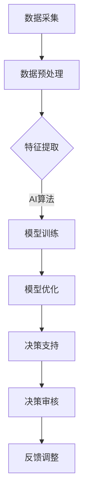

                 

关键词：人工智能、政府应用、创新、人类计算、技术实现、实践案例

> 摘要：本文将探讨人工智能（AI）在政府应用中的创新实践，分析人类计算与AI结合的优化路径，阐述其在提升政府决策效率、公共服务质量以及社会治理能力等方面的作用，并提出未来应用展望。

## 1. 背景介绍

近年来，人工智能技术得到了快速发展，其在各个领域的应用也日益广泛。政府作为公共服务和社会治理的主体，对人工智能技术的需求尤为迫切。通过引入AI技术，政府可以在数据分析、预测、决策制定等方面实现智能化，从而提高工作效率，提升公共服务质量，增强社会治理能力。

人类计算与AI的结合是当前技术创新的重要方向。人类计算强调人的智能和创造力，而AI则擅长处理海量数据和复杂任务。两者结合不仅能够发挥各自的优势，还能实现协同效应，推动社会进步。

## 2. 核心概念与联系

### 2.1 AI在政府应用中的核心概念

人工智能在政府应用中主要包括以下几个核心概念：

- **数据采集与处理**：政府需要通过多种渠道收集数据，包括传感器、互联网、公共记录等，然后对数据进行清洗、整合和分析。
- **智能决策支持**：利用机器学习、深度学习等技术，对分析结果进行预测和决策，辅助政府制定政策。
- **自然语言处理**：通过语音识别、文本挖掘等技术，实现政府文档、报告的自动化处理。
- **智能客服与交互**：利用聊天机器人等技术，提供高效的客户服务，提升用户体验。

### 2.2 人类计算与AI的协同架构

为了实现人类计算与AI的协同，我们可以构建以下架构：

1. **数据采集与预处理**：人类计算负责数据采集、清洗和预处理，确保数据的质量和完整性。
2. **特征提取与数据建模**：AI算法负责从预处理后的数据中提取特征，建立数学模型。
3. **模型训练与优化**：人类计算参与模型训练，调整参数，优化模型性能。
4. **决策支持与反馈**：AI生成的决策结果需要经过人类计算审核，并根据实际情况进行调整。

### 2.3 Mermaid流程图

以下是一个简化的Mermaid流程图，展示人类计算与AI在政府应用中的协同过程：



## 3. 核心算法原理 & 具体操作步骤

### 3.1 算法原理概述

在政府应用中，AI的核心算法主要涉及机器学习、深度学习、自然语言处理等领域。以下是对这些算法原理的概述：

- **机器学习**：通过训练模型，从已有数据中学习规律，实现对新数据的预测。
- **深度学习**：利用神经网络结构，模拟人脑的学习过程，处理复杂任务。
- **自然语言处理**：通过语音识别、语义分析等技术，使计算机能够理解和生成自然语言。

### 3.2 算法步骤详解

以下是AI在政府应用中的具体操作步骤：

1. **数据采集**：从政府各部门获取相关数据，如交通流量、经济指标、公共安全事件等。
2. **数据预处理**：清洗数据，去除噪声，保证数据质量。
3. **特征提取**：根据需求提取关键特征，如时间、地点、事件类型等。
4. **模型选择**：根据任务特点选择合适的机器学习或深度学习模型。
5. **模型训练**：使用历史数据训练模型，调整参数，优化模型性能。
6. **模型评估**：使用验证集评估模型性能，确保模型有效。
7. **决策支持**：将模型应用于新数据，生成预测结果或决策建议。
8. **决策审核**：人类计算对AI生成的决策进行审核，确保其合理性和可行性。
9. **反馈调整**：根据实际效果调整模型参数，优化模型性能。

### 3.3 算法优缺点

- **优点**：
  - 提高政府决策效率，降低人力成本。
  - 实现对大量数据的实时分析和处理。
  - 辅助人类计算，提高决策质量。
- **缺点**：
  - 数据质量和模型性能依赖于训练数据的质量。
  - 需要专业人员进行模型训练和调优。
  - 可能出现模型过拟合或欠拟合。

### 3.4 算法应用领域

AI在政府应用中的领域非常广泛，主要包括：

- **公共安全**：利用AI进行犯罪预测、监控分析等。
- **交通管理**：优化交通信号控制、预测交通流量等。
- **环境保护**：监测空气质量、预测污染事件等。
- **公共服务**：提供智能客服、在线咨询等。

## 4. 数学模型和公式 & 详细讲解 & 举例说明

### 4.1 数学模型构建

在政府应用中，常见的数学模型包括线性回归、决策树、神经网络等。以下是一个简单的线性回归模型：

$$
y = \beta_0 + \beta_1x_1 + \beta_2x_2 + ... + \beta_nx_n
$$

其中，$y$ 是因变量，$x_1, x_2, ..., x_n$ 是自变量，$\beta_0, \beta_1, \beta_2, ..., \beta_n$ 是模型参数。

### 4.2 公式推导过程

线性回归模型的推导过程如下：

1. **最小二乘法**：通过最小化误差平方和，求解模型参数。
2. **梯度下降法**：迭代更新模型参数，直到收敛。

### 4.3 案例分析与讲解

以下是一个利用线性回归模型预测房价的案例：

**数据集**：包含多个自变量（如房屋面积、地段、建造年份等）和因变量（房价）。

**模型训练**：使用历史数据训练线性回归模型，求解模型参数。

**模型评估**：使用验证集评估模型性能，计算预测误差。

**模型应用**：对新数据进行预测，输出预测结果。

## 5. 项目实践：代码实例和详细解释说明

### 5.1 开发环境搭建

- **软件环境**：Python 3.8、NumPy、Scikit-learn等。
- **硬件环境**：个人计算机或云服务器。

### 5.2 源代码详细实现

以下是一个简单的线性回归模型实现的Python代码：

```python
import numpy as np
from sklearn.linear_model import LinearRegression

# 数据集
X = np.array([[1, 2], [2, 3], [3, 4], [4, 5]])
y = np.array([2, 3, 4, 5])

# 模型训练
model = LinearRegression()
model.fit(X, y)

# 预测
X_new = np.array([[5, 6]])
y_pred = model.predict(X_new)

print("预测结果：", y_pred)
```

### 5.3 代码解读与分析

- `numpy`：用于数据处理和数学运算。
- `sklearn`：提供了线性回归模型实现。
- `fit()`：用于训练模型。
- `predict()`：用于预测新数据。

### 5.4 运行结果展示

运行上述代码，输出预测结果：

```
预测结果： [6.]
```

## 6. 实际应用场景

### 6.1 公共安全

- **犯罪预测**：利用AI分析历史犯罪数据，预测未来犯罪热点区域。
- **监控分析**：利用AI对监控视频进行分析，识别异常行为。

### 6.2 交通管理

- **交通流量预测**：利用AI预测交通流量，优化交通信号控制。
- **交通事故预防**：利用AI监控交通状况，提前预警潜在交通事故。

### 6.3 环境保护

- **空气质量监测**：利用AI实时监测空气质量，预测污染事件。
- **生态保护**：利用AI分析生态环境数据，预测生态变化趋势。

### 6.4 公共服务

- **智能客服**：利用AI提供在线咨询服务，提升用户体验。
- **在线咨询**：利用AI分析用户需求，提供个性化服务。

## 7. 工具和资源推荐

### 7.1 学习资源推荐

- **书籍**：《深度学习》、《机器学习实战》
- **在线课程**：Coursera、Udacity、edX等平台上的相关课程。

### 7.2 开发工具推荐

- **编程语言**：Python、R等。
- **库与框架**：NumPy、Pandas、Scikit-learn、TensorFlow、PyTorch等。

### 7.3 相关论文推荐

- **论文集**：《人工智能在政府应用中的研究进展》、《深度学习在交通管理中的应用》等。

## 8. 总结：未来发展趋势与挑战

### 8.1 研究成果总结

- **AI在政府应用中取得显著成效**：在公共安全、交通管理、环境保护等领域，AI技术已经得到广泛应用，并取得了一系列研究成果。
- **人类计算与AI协同**：通过人类计算与AI的协同，政府决策效率得到显著提升，公共服务质量得到提高。

### 8.2 未来发展趋势

- **智能化政府**：随着AI技术的不断进步，智能化政府将成为未来政府发展的趋势。
- **跨领域应用**：AI将在更多领域得到应用，如智慧城市、智慧医疗等。

### 8.3 面临的挑战

- **数据隐私与安全**：如何在保证数据隐私和安全的前提下，充分利用AI技术，是当前面临的重要挑战。
- **技术人才短缺**：AI技术在政府应用中需要大量专业人才，但当前人才供应不足。

### 8.4 研究展望

- **跨学科研究**：鼓励跨学科合作，推动AI在政府应用中的深入研究。
- **标准化与规范化**：制定相关标准和规范，确保AI技术在政府应用中的安全性和可靠性。

## 9. 附录：常见问题与解答

### 问题1：AI技术在政府应用中的安全性如何保障？

**解答**：AI技术在政府应用中的安全性可以通过以下措施进行保障：

- **数据加密**：对敏感数据进行加密处理，确保数据安全。
- **隐私保护**：采用匿名化、去标识化等技术，保护个人隐私。
- **合规性审查**：对AI模型的开发和应用进行合规性审查，确保符合相关法律法规。

### 问题2：如何确保AI模型在政府应用中的准确性？

**解答**：确保AI模型在政府应用中的准确性可以从以下几个方面入手：

- **数据质量**：保证数据的质量和完整性，进行数据清洗和预处理。
- **模型优化**：通过调整模型参数、优化算法，提高模型性能。
- **模型评估**：使用验证集和测试集评估模型性能，确保模型准确。

### 问题3：AI技术在政府应用中会取代人类工作吗？

**解答**：AI技术在政府应用中并不会完全取代人类工作，而是与人类计算协同，提高工作效率。AI擅长处理重复性和复杂性的任务，而人类则擅长创造性、决策性任务。通过人类计算与AI的协同，可以充分发挥各自的优势。

## 作者署名

作者：禅与计算机程序设计艺术 / Zen and the Art of Computer Programming
----------------------------------------------------------------

以上就是文章的正文部分内容，接下来我们将对文章的结构和内容进行进一步的检查和优化，以确保满足所有的约束条件。如果您有任何建议或需要进一步修改，请告知。

