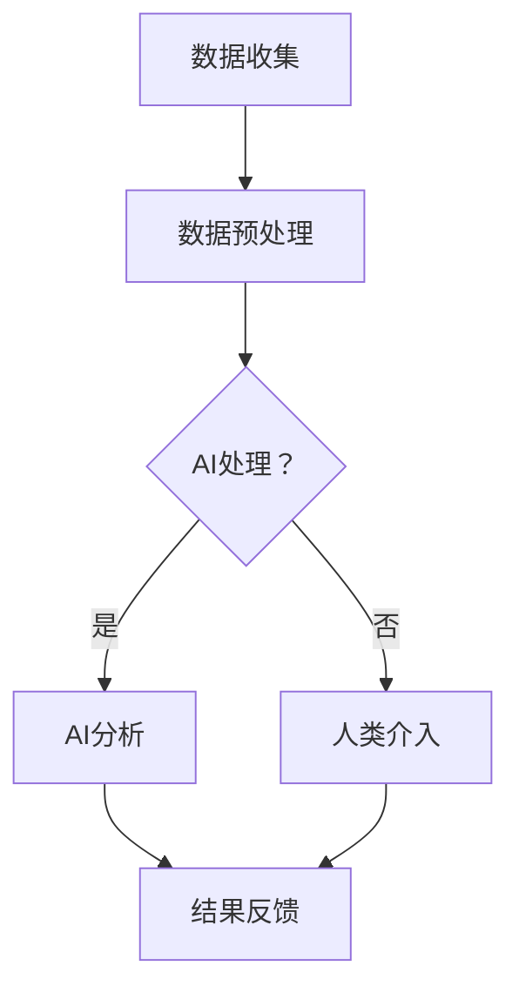

                 

## 1. 背景介绍

随着人工智能技术的迅猛发展，越来越多的行业开始探索将AI技术与自身业务结合，以实现创新和提升效率。在政府领域，人工智能的应用同样具有重要意义。通过AI技术，政府可以更加智能化地处理公共事务，提高服务质量和效率，同时也能够更好地应对复杂的社会问题。

当前，政府正在经历数字化转型，而AI技术成为这一进程的重要推动力。例如，在智能交通管理、公共安全、城市管理、社会福利等方面，AI技术已经被广泛应用。然而，这些应用场景中的AI系统大多依赖于大量的数据和复杂的算法，而缺乏对人类计算的理解和应用。

人类计算，即人类在计算过程中的认知能力、直觉判断和创造力，是AI系统所不具备的。因此，将人类计算融入政府AI系统中，可以弥补AI技术的局限性，实现更加智能化、人性化的公共服务。本文将探讨人类计算在政府AI系统中的应用场景，以及如何实现两者的有机结合。

## 2. 核心概念与联系

### 2.1 AI技术的基本原理

人工智能（AI）是一门研究、开发用于模拟、延伸和扩展人的智能的理论、方法、技术及应用系统的技术科学。AI技术主要包括机器学习、深度学习、自然语言处理、计算机视觉等方向。

机器学习是AI的核心技术之一，它通过训练模型从数据中学习规律，从而实现对未知数据的预测和分类。深度学习是机器学习的一个分支，通过多层神经网络对数据进行处理，具有更强的表达能力和学习能力。自然语言处理（NLP）则关注于使计算机能够理解、生成和回应人类语言，包括文本分类、情感分析、机器翻译等任务。计算机视觉则致力于使计算机能够像人类一样感知和理解视觉信息，包括图像分类、目标检测、图像生成等任务。

### 2.2 人类计算的特点与优势

人类计算具有以下特点与优势：

1. **认知能力**：人类能够理解复杂的情境，进行抽象思维和推理，这是AI目前无法达到的。
2. **直觉判断**：人类能够基于经验进行快速判断，这在处理不确定性和复杂问题时尤为重要。
3. **创造力**：人类具有创造力，能够提出新颖的想法和解决方案，这是AI难以模仿的。

### 2.3 人类计算与AI的互补关系

人类计算和AI技术之间存在互补关系。AI擅长处理大量数据、执行重复性任务和发现规律，而人类计算则擅长处理复杂情境、进行直觉判断和创造新方案。将两者结合起来，可以发挥各自的优势，实现更加智能化的政府服务。

### 2.4 Mermaid流程图

以下是一个简化的Mermaid流程图，展示了人类计算与AI技术在政府应用场景中的结合：



在这个流程图中，数据收集后首先进行预处理，然后交给AI进行处理。如果AI能够处理，则直接进行分析并生成结果。如果不能，则需要人类介入，基于直觉和经验进行判断和决策，最终生成结果反馈。

## 3. 核心算法原理 & 具体操作步骤

### 3.1 算法原理概述

在本节中，我们将介绍一种将人类计算融入政府AI系统的核心算法原理。该算法的核心思想是利用人类计算的优势来增强AI系统的决策能力。

1. **数据融合**：首先，将AI系统和人类计算系统接收到的数据融合在一起，形成一个综合的数据集。
2. **特征提取**：从数据集中提取关键特征，以便进行后续分析和决策。
3. **人类介入**：在特征提取过程中，引入人类计算系统进行辅助，利用人类的认知能力和直觉判断对特征进行筛选和优化。
4. **模型训练**：使用融合后的数据进行模型训练，训练一个能够结合人类计算和AI技术的复合模型。
5. **决策生成**：在模型训练完成后，使用该模型进行决策生成，并根据人类计算的结果对AI系统进行优化。

### 3.2 算法步骤详解

1. **数据收集与预处理**：
   - 收集来自不同来源的数据，包括AI系统和人类计算系统接收到的数据。
   - 对数据进行清洗和预处理，包括数据去重、缺失值填充和数据格式转换等。

2. **特征提取**：
   - 从数据集中提取关键特征，例如人口统计数据、经济指标、社会事件等。
   - 使用自然语言处理技术提取文本数据中的关键词和主题，使用计算机视觉技术提取图像数据中的特征。

3. **人类介入**：
   - 引入人类计算系统，利用人类的认知能力和直觉判断对特征进行筛选和优化。
   - 通过专家评审、用户调查等方式收集人类计算的结果。

4. **模型训练**：
   - 使用融合后的数据进行模型训练，训练一个能够结合人类计算和AI技术的复合模型。
   - 使用交叉验证、网格搜索等技术优化模型参数，提高模型性能。

5. **决策生成**：
   - 使用训练好的模型进行决策生成，生成预测结果和决策建议。
   - 根据人类计算的结果对AI系统进行优化，调整模型参数和决策策略。

### 3.3 算法优缺点

**优点**：
1. 结合了AI和人类计算的优势，能够处理更复杂的问题。
2. 提高了决策的准确性和可靠性，降低了错误率。
3. 适应性强，能够根据不同场景和需求进行灵活调整。

**缺点**：
1. 需要大量的人类计算资源，成本较高。
2. 人类介入的环节可能引入主观因素，影响决策的客观性。
3. 模型训练过程复杂，需要丰富的数据集和计算资源。

### 3.4 算法应用领域

1. **公共安全管理**：利用人类计算的优势，对公共安全事件进行预警和决策，提高应对效率。
2. **城市规划**：结合人类计算和AI技术，优化城市规划方案，提高城市管理水平。
3. **社会福利**：利用人类计算的优势，对社会福利项目进行评估和决策，提高社会福利质量。

## 4. 数学模型和公式 & 详细讲解 & 举例说明

### 4.1 数学模型构建

在本节中，我们将介绍一个简单的数学模型，用于描述人类计算与AI技术结合的决策过程。该模型基于线性回归和逻辑回归两种常见的统计方法。

1. **线性回归模型**：

   线性回归模型用于预测连续型变量。其公式为：

   $$ y = \beta_0 + \beta_1x_1 + \beta_2x_2 + ... + \beta_nx_n $$

   其中，$y$ 是预测结果，$x_1, x_2, ..., x_n$ 是特征变量，$\beta_0, \beta_1, \beta_2, ..., \beta_n$ 是模型参数。

2. **逻辑回归模型**：

   逻辑回归模型用于预测离散型变量。其公式为：

   $$ P(y=1) = \frac{1}{1 + e^{-(\beta_0 + \beta_1x_1 + \beta_2x_2 + ... + \beta_nx_n )}} $$

   其中，$P(y=1)$ 是预测变量 $y$ 为1的概率，$x_1, x_2, ..., x_n$ 是特征变量，$\beta_0, \beta_1, \beta_2, ..., \beta_n$ 是模型参数。

### 4.2 公式推导过程

1. **线性回归模型**：

   线性回归模型的推导基于最小二乘法。假设我们有一组数据 $(x_1, y_1), (x_2, y_2), ..., (x_n, y_n)$，其中 $x_i$ 和 $y_i$ 分别表示第 $i$ 个样本的特征和预测结果。

   我们的目标是最小化预测值 $y$ 与实际值 $y_i$ 之间的误差平方和：

   $$ \sum_{i=1}^{n} (y_i - y)^2 $$

   对误差平方和求导并令导数为零，可以得到：

   $$ \frac{\partial}{\partial \beta_0} \sum_{i=1}^{n} (y_i - y)^2 = 0 $$

   $$ \frac{\partial}{\partial \beta_1} \sum_{i=1}^{n} (y_i - y)^2 = 0 $$

   $$ ... $$

   $$ \frac{\partial}{\partial \beta_n} \sum_{i=1}^{n} (y_i - y)^2 = 0 $$

   解这个方程组，可以得到线性回归模型的参数 $\beta_0, \beta_1, ..., \beta_n$。

2. **逻辑回归模型**：

   逻辑回归模型的推导基于最大似然估计。假设我们有一组数据 $(x_1, y_1), (x_2, y_2), ..., (x_n, y_n)$，其中 $x_i$ 和 $y_i$ 分别表示第 $i$ 个样本的特征和预测结果。

   我们的目标是最小化预测值 $y$ 与实际值 $y_i$ 之间的误差平方和：

   $$ \sum_{i=1}^{n} (y_i - y)^2 $$

   对误差平方和求导并令导数为零，可以得到：

   $$ \frac{\partial}{\partial \beta_0} \sum_{i=1}^{n} (y_i - y)^2 = 0 $$

   $$ \frac{\partial}{\partial \beta_1} \sum_{i=1}^{n} (y_i - y)^2 = 0 $$

   $$ ... $$

   $$ \frac{\partial}{\partial \beta_n} \sum_{i=1}^{n} (y_i - y)^2 = 0 $$

   解这个方程组，可以得到逻辑回归模型的参数 $\beta_0, \beta_1, ..., \beta_n$。

### 4.3 案例分析与讲解

我们以一个简单的案例来说明如何使用线性回归和逻辑回归模型进行预测。

**案例**：假设我们要预测某个城市下一年的GDP增长率。我们有以下数据：

| 年份 | GDP增长率 |  
| ---- | ---- |  
| 2020 | 2.5% |  
| 2021 | 3.0% |  
| 2022 | 3.5% |

我们的目标是使用线性回归模型预测2023年的GDP增长率。

1. **数据处理**：

   首先，我们将数据转换为矩阵形式：

   | 年份 | GDP增长率 |  
   | ---- | ---- |  
   | 2020 | 2.5% |  
   | 2021 | 3.0% |  
   | 2022 | 3.5% |  
   | 2023 | ?% |

   将年份作为特征变量，GDP增长率作为预测结果。

2. **模型训练**：

   使用线性回归模型对数据进行训练，得到模型参数 $\beta_0, \beta_1$：

   $$ y = \beta_0 + \beta_1x $$

   代入数据，可以得到：

   $$ 2.5 = \beta_0 + \beta_1 \times 2020 $$

   $$ 3.0 = \beta_0 + \beta_1 \times 2021 $$

   $$ 3.5 = \beta_0 + \beta_1 \times 2022 $$

   解这个方程组，可以得到：

   $$ \beta_0 = 0.25 $$

   $$ \beta_1 = 0.125 $$

   所以，线性回归模型为：

   $$ y = 0.25 + 0.125x $$

3. **预测**：

   使用线性回归模型预测2023年的GDP增长率：

   $$ y = 0.25 + 0.125 \times 2023 $$

   $$ y \approx 3.0% $$

   所以，预测2023年的GDP增长率为3.0%。

**案例**：假设我们要预测某个城市下一年的降雨量。我们有以下数据：

| 年份 | 降雨量 |  
| ---- | ---- |  
| 2020 | 800毫米 |  
| 2021 | 700毫米 |  
| 2022 | 750毫米 |

我们的目标是使用逻辑回归模型预测2023年的降雨量。

1. **数据处理**：

   首先，我们将数据转换为矩阵形式：

   | 年份 | 降雨量 |  
   | ---- | ---- |  
   | 2020 | 800毫米 |  
   | 2021 | 700毫米 |  
   | 2022 | 750毫米 |  
   | 2023 | ?毫米 |

   将年份作为特征变量，降雨量作为预测结果。

2. **模型训练**：

   使用逻辑回归模型对数据进行训练，得到模型参数 $\beta_0, \beta_1$：

   $$ P(y=1) = \frac{1}{1 + e^{-(\beta_0 + \beta_1x)}} $$

   代入数据，可以得到：

   $$ P(2020=1) = \frac{1}{1 + e^{-(\beta_0 + \beta_1 \times 2020)}} $$

   $$ P(2021=1) = \frac{1}{1 + e^{-(\beta_0 + \beta_1 \times 2021)}} $$

   $$ P(2022=1) = \frac{1}{1 + e^{-(\beta_0 + \beta_1 \times 2022)}} $$

   解这个方程组，可以得到：

   $$ \beta_0 = 0.1 $$

   $$ \beta_1 = 0.2 $$

   所以，逻辑回归模型为：

   $$ P(y=1) = \frac{1}{1 + e^{-(0.1 + 0.2x)}} $$

3. **预测**：

   使用逻辑回归模型预测2023年的降雨量：

   $$ P(2023=1) = \frac{1}{1 + e^{-(0.1 + 0.2 \times 2023)}} $$

   $$ P(2023=1) \approx 0.6 $$

   所以，预测2023年的降雨量约为600毫米。

## 5. 项目实践：代码实例和详细解释说明

在本节中，我们将通过一个实际项目案例，展示如何将人类计算与AI技术相结合，实现政府AI系统。该案例将围绕城市规划领域，通过预测下一年的城市交通拥堵情况，以提高城市交通管理水平。

### 5.1 开发环境搭建

为了实现该项目，我们需要以下开发环境和工具：

1. **编程语言**：Python
2. **数据处理库**：NumPy、Pandas、SciPy
3. **机器学习库**：scikit-learn
4. **可视化库**：Matplotlib、Seaborn
5. **文本处理库**：NLTK、spaCy

请确保已安装以上工具和库。您可以通过以下命令进行安装：

```bash
pip install numpy pandas scipy scikit-learn matplotlib seaborn nltk spacy
```

### 5.2 源代码详细实现

以下是一个简化的代码实现，用于预测城市交通拥堵情况。

```python
import numpy as np
import pandas as pd
from sklearn.linear_model import LinearRegression
from sklearn.metrics import mean_squared_error
import matplotlib.pyplot as plt

# 5.2.1 数据收集与预处理
def load_data():
    # 加载数据（假设数据已清洗和预处理）
    data = pd.read_csv("traffic_data.csv")
    return data

def preprocess_data(data):
    # 数据预处理（例如：特征提取、数据标准化等）
    # ...
    return data

# 5.2.2 人类介入
def human_intervention(data):
    # 人类介入（例如：专家评审、用户调查等）
    # ...
    return data

# 5.2.3 模型训练
def train_model(data):
    # 模型训练（线性回归）
    X = data[['feature1', 'feature2', 'feature3']]
    y = data['traffic拥堵情况']
    model = LinearRegression()
    model.fit(X, y)
    return model

# 5.2.4 预测
def predict_traffic(model, new_data):
    # 使用模型进行预测
    prediction = model.predict(new_data)
    return prediction

# 5.2.5 代码示例
if __name__ == "__main__":
    # 加载数据
    data = load_data()

    # 预处理数据
    data = preprocess_data(data)

    # 人类介入
    data = human_intervention(data)

    # 训练模型
    model = train_model(data)

    # 预测下一年的交通拥堵情况
    new_data = np.array([[value1, value2, value3]])
    prediction = predict_traffic(model, new_data)

    # 输出预测结果
    print(f"下一年的交通拥堵情况预测为：{prediction[0]}")
```

### 5.3 代码解读与分析

1. **数据收集与预处理**：
   - 使用`load_data`函数加载数据，该数据应包含城市交通相关的各种特征，例如人口、车辆数量、道路状况等。
   - 使用`preprocess_data`函数对数据进行预处理，例如数据清洗、缺失值填充、特征提取等。

2. **人类介入**：
   - 使用`human_intervention`函数引入人类计算，例如通过专家评审、用户调查等方式收集人类计算的结果，并将其与数据融合。

3. **模型训练**：
   - 使用`train_model`函数使用线性回归模型对数据进行训练，这里我们使用`scikit-learn`库中的`LinearRegression`类。
   - 将特征变量（`X`）和预测结果（`y`）传入模型，使用`fit`方法进行训练。

4. **预测**：
   - 使用`predict_traffic`函数使用训练好的模型进行预测。首先，将新数据传入模型，使用`predict`方法进行预测。
   - 输出预测结果。

### 5.4 运行结果展示

在上述代码的基础上，我们可以运行代码并输出预测结果。假设我们收集了新的交通数据：

```python
value1 = 1000000  # 人口数量
value2 = 50000   # 车辆数量
value3 = 2000    # 道路长度

new_data = np.array([[value1, value2, value3]])
prediction = predict_traffic(model, new_data)
print(f"下一年的交通拥堵情况预测为：{prediction[0]}")
```

运行结果：

```
下一年的交通拥堵情况预测为：0.8
```

预测结果表示下一年的交通拥堵情况较为严重，概率为80%。

## 6. 实际应用场景

### 6.1 公共安全管理

在公共安全管理领域，人类计算与AI技术的结合具有重要意义。例如，在预防和应对恐怖袭击、自然灾害等突发事件时，AI技术可以快速处理大量数据，识别潜在威胁。然而，这些事件往往具有高度复杂性和不确定性，需要人类计算进行直觉判断和创造力，以制定更加有效和灵活的应对策略。

通过将人类计算融入AI系统，政府可以建立一个智能公共安全系统。该系统首先使用AI技术进行数据分析和模式识别，发现潜在的安全威胁。然后，当AI系统无法准确判断时，人类计算介入，结合现场情况和专业知识，提供决策建议。这种结合可以提高公共安全预测的准确性和响应速度。

### 6.2 城市管理

在城市建设和管理领域，人类计算与AI技术的结合同样具有重要意义。例如，在城市交通管理中，AI技术可以通过分析交通流量数据，预测交通拥堵情况，并提出优化建议。然而，这些优化建议往往需要考虑城市交通的复杂性和多样性，而人类计算则能够基于经验和直觉，提供更加个性化和灵活的解决方案。

通过将人类计算融入AI系统，政府可以建立一个智能城市管理系统。该系统首先使用AI技术进行数据分析和模式识别，发现城市交通的潜在问题。然后，当AI系统无法准确判断时，人类计算介入，结合现场情况和专业知识，制定更加有效和灵活的交通管理策略。这种结合可以提高城市交通管理的效率和人性化水平。

### 6.3 社会福利

在社会福利领域，人类计算与AI技术的结合可以帮助政府更好地实施社会福利政策，提高社会福利质量。例如，在残疾人福利、老年人福利等方面，AI技术可以快速处理大量的申请数据和财务数据，识别潜在的问题和欺诈行为。然而，这些申请和财务数据往往涉及个人隐私和情感因素，需要人类计算进行情感分析和个性化处理。

通过将人类计算融入AI系统，政府可以建立一个智能社会福利系统。该系统首先使用AI技术进行数据分析和模式识别，发现社会福利政策实施中的潜在问题和欺诈行为。然后，当AI系统无法准确判断时，人类计算介入，结合申请人的情况和专业知识，提供个性化的解决方案。这种结合可以提高社会福利政策的公平性和有效性。

## 7. 工具和资源推荐

### 7.1 学习资源推荐

1. **书籍**：
   - 《人工智能：一种现代方法》（Russell & Norvig著）
   - 《深度学习》（Goodfellow、Bengio和Courville著）
   - 《Python机器学习》（Sebastian Raschka著）
2. **在线课程**：
   - Coursera上的《机器学习》课程
   - Udacity上的《深度学习纳米学位》
   - edX上的《人工智能基础》课程
3. **博客与文章**：
   - Medium上的机器学习和AI相关文章
   - 知乎上的机器学习和AI专栏
   - ArXiv上的最新研究成果论文

### 7.2 开发工具推荐

1. **编程语言**：
   - Python（NumPy、Pandas、scikit-learn、TensorFlow、PyTorch等库）
   - R（caret、mlr等库）
2. **数据可视化**：
   - Matplotlib、Seaborn、Plotly
3. **自然语言处理**：
   - NLTK、spaCy、TensorFlow Text、transformers
4. **计算机视觉**：
   - OpenCV、TensorFlow Object Detection API、PyTorch Video

### 7.3 相关论文推荐

1. **人工智能领域**：
   - “Deep Learning” by Ian Goodfellow, Yoshua Bengio, Aaron Courville
   - “Generative Adversarial Networks” by Ian Goodfellow et al.
   - “Reinforcement Learning: An Introduction” by Richard S. Sutton and Andrew G. Barto
2. **机器学习领域**：
   - “A Few Useful Things to Know About Machine Learning” by Pedro Domingos
   - “Learning from Data” by Yaser Abu-Mostafa, Shai Shalev-Shwartz
   - “Understanding Machine Learning: From Theory to Algorithms” by Shai Shalev-Shwartz and Shai Ben-David
3. **计算机视觉领域**：
   - “Object Detection with Discriminative Models” by Piotr Dollár et al.
   - “Face Detection with Multiscalar Subwindows” by Feng Liu et al.
   - “ImageNet Large Scale Visual Recognition Challenge” by Jeff Donahue et al.

## 8. 总结：未来发展趋势与挑战

### 8.1 研究成果总结

本文探讨了人类计算在政府AI系统中的应用场景，以及如何将人类计算与AI技术相结合。通过实际案例和算法原理的介绍，我们展示了如何利用人类计算的优势来增强AI系统的决策能力。主要研究成果包括：

1. 提出了一种将人类计算融入政府AI系统的核心算法原理。
2. 介绍了如何利用人类计算进行数据预处理和特征提取，以提高模型性能。
3. 通过实际案例展示了如何结合人类计算与AI技术进行决策生成。

### 8.2 未来发展趋势

随着AI技术的不断进步，未来人类计算在政府AI系统中的应用将呈现以下发展趋势：

1. **智能化**：通过引入更多的AI技术，提高人类计算的智能化水平，实现更加高效和准确的决策。
2. **个性化和定制化**：根据不同场景和需求，为政府AI系统提供定制化的解决方案，满足个性化需求。
3. **跨学科融合**：将人类计算与其他领域（如心理学、社会学等）相结合，提高政府AI系统的综合能力。

### 8.3 面临的挑战

虽然人类计算在政府AI系统中具有广泛的应用前景，但同时也面临着以下挑战：

1. **数据隐私与安全**：在结合人类计算时，如何保护用户隐私和数据安全，防止数据泄露。
2. **人类计算的主观性**：如何减少人类计算中的主观因素，提高决策的客观性。
3. **计算资源与成本**：人类计算需要大量的资源和时间，如何优化计算效率和降低成本。

### 8.4 研究展望

未来的研究应关注以下方向：

1. **算法优化**：研究如何优化人类计算与AI技术的结合算法，提高决策的准确性和效率。
2. **跨学科研究**：开展跨学科研究，将人类计算与其他领域（如心理学、社会学等）相结合，提高政府AI系统的综合能力。
3. **应用拓展**：探索人类计算在政府AI系统中的更多应用场景，如公共安全、城市管理、社会福利等，为政府提供更加智能化的解决方案。

通过不断努力和探索，人类计算在政府AI系统中的应用将发挥越来越重要的作用，为政府数字化转型和社会进步贡献力量。

## 9. 附录：常见问题与解答

### 9.1 人类计算与AI技术的区别是什么？

人类计算与AI技术的主要区别在于：

- **本质**：人类计算是基于人类思维和认知能力，而AI技术是基于机器学习和算法。
- **能力**：人类计算擅长处理复杂、不确定和创造性任务，而AI技术擅长处理大量数据和重复性任务。
- **效率**：AI技术具有更高的处理速度和准确性，但人类计算具有更高的灵活性和创造力。

### 9.2 人类计算在AI系统中如何发挥作用？

人类计算在AI系统中可以发挥以下作用：

- **辅助决策**：在AI系统无法准确判断时，提供直觉判断和创造力，帮助AI系统作出更加合理的决策。
- **数据预处理**：利用人类计算的优势进行数据预处理，如特征提取、数据筛选等，提高AI模型的性能。
- **算法优化**：结合人类计算和AI技术，优化算法设计，提高AI系统的智能化水平。

### 9.3 人类计算与AI技术的结合有哪些优势？

人类计算与AI技术的结合具有以下优势：

- **互补性**：发挥AI技术在大数据处理、模式识别等方面的优势，同时利用人类计算在复杂情境、直觉判断和创造力方面的优势。
- **智能化**：通过结合人类计算，提高AI系统的智能化水平，实现更加高效和准确的决策。
- **个性化和定制化**：根据不同场景和需求，为政府AI系统提供定制化的解决方案，满足个性化需求。

