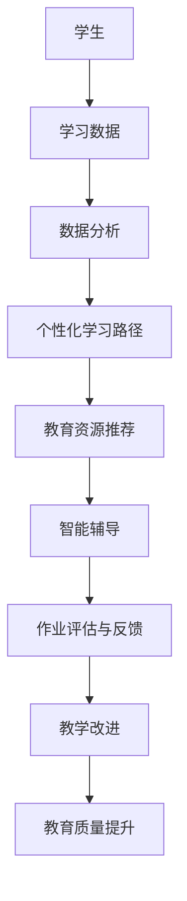
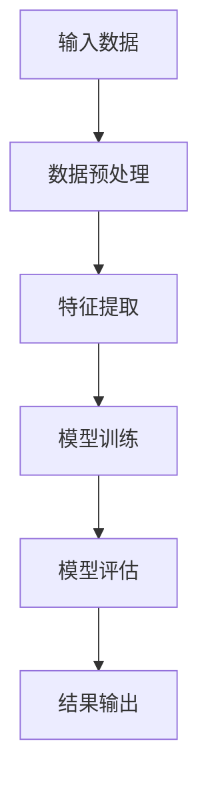

                 

关键词：人工智能，教育创新，人类计算，学习算法，数学模型，代码实例

> 摘要：本文探讨了人工智能（AI）在教育领域中的应用，特别是在促进学习算法和人类计算之间的协同作用。通过分析AI的核心概念、教育中的挑战和机遇，以及数学模型和代码实例，我们揭示了AI驱动的教育创新对未来的重要价值。

## 1. 背景介绍

在教育领域，传统的教学方法往往依赖于教师的授课和学生被动的接受知识。然而，随着人工智能技术的迅速发展，教育模式正经历着深刻的变革。人工智能不仅能够提供个性化的学习体验，还能够通过数据分析优化学习路径，提高教育质量。然而，AI在教育中的应用并非无懈可击，如何平衡AI与人类计算，使二者相辅相成，是一个亟待解决的问题。

本文将围绕以下几个方面展开讨论：

1. **AI的核心概念与教育联系**：介绍人工智能的基本原理，并阐述其在教育领域中的潜在应用。
2. **人类计算的重要性**：探讨人类在教育过程中不可替代的角色，包括创造性思维、情感互动和复杂决策。
3. **数学模型在教育中的应用**：介绍数学模型如何帮助优化学习过程，并举例说明。
4. **项目实践：代码实例**：提供具体的代码实例，展示AI在教育中的实际应用。
5. **实际应用场景与未来展望**：分析AI在教育中的实际应用场景，并对未来的发展趋势和挑战进行展望。

通过以上讨论，我们希望能够揭示AI驱动的教育创新对未来的重要价值，并探讨如何更好地利用AI技术，促进人类计算与人工智能的协同发展。

### 2. 核心概念与联系

人工智能（AI）是一门多学科交叉的领域，涉及计算机科学、心理学、认知科学和神经科学等。其核心目标是使计算机具备类似人类的智能，包括学习、推理、感知和自然语言处理等能力。

在教育领域，AI的应用可以分为以下几个主要方面：

1. **个性化学习**：通过分析学生的学习数据，AI能够为每个学生提供定制化的学习路径和资源，提高学习效果。
2. **智能辅导系统**：利用自然语言处理技术，AI可以为学生提供实时解答和指导，帮助解决学习中的问题。
3. **教育资源优化**：AI可以分析大量的教育资源和学习材料，提供推荐系统，帮助学生高效地获取所需知识。
4. **智能评估与反馈**：通过自动评估系统，AI可以对学生作业进行快速、准确的评估，并提供详细的反馈。

为了更好地理解AI在教育中的应用，我们引入一个Mermaid流程图，展示AI与教育系统的交互过程。



通过这个流程图，我们可以看到AI技术在教育系统中扮演了关键角色，从学习数据的收集与分析，到个性化学习路径的推荐，再到智能辅导和评估，每一个环节都为教育质量的提升提供了有力支持。

### 3. 核心算法原理 & 具体操作步骤

为了深入理解AI在教育中的应用，我们需要探讨一些核心算法的原理和具体操作步骤。

#### 3.1 算法原理概述

AI在教育中的应用涉及多种算法，其中一些核心算法包括：

1. **机器学习算法**：通过训练模型，从数据中自动发现规律和模式。
2. **深度学习算法**：基于多层神经网络，模仿人脑进行学习和决策。
3. **自然语言处理算法**：使计算机能够理解和生成自然语言。
4. **强化学习算法**：通过试错和学习，使计算机在特定环境中做出最佳决策。

#### 3.2 算法步骤详解

以机器学习算法为例，其基本步骤如下：

1. **数据收集**：从各种来源收集学生学习数据，包括考试成绩、学习行为、学习时间等。
2. **数据预处理**：清洗数据，消除噪声，并转换为适合机器学习模型的格式。
3. **特征提取**：从原始数据中提取有用的特征，如学生的出勤率、作业完成情况等。
4. **模型训练**：选择合适的机器学习模型，并使用训练数据对其进行训练。
5. **模型评估**：使用测试数据评估模型性能，调整模型参数以优化性能。
6. **应用部署**：将训练好的模型部署到教育系统中，为学生提供个性化学习建议。

#### 3.3 算法优缺点

每种算法都有其优缺点：

1. **机器学习算法**：
   - 优点：能够处理大量数据，自动发现复杂模式。
   - 缺点：对数据质量要求高，模型解释性较差。
2. **深度学习算法**：
   - 优点：能够处理复杂任务，如图像和语音识别。
   - 缺点：对数据量和计算资源要求高，模型解释性较差。
3. **自然语言处理算法**：
   - 优点：能够理解和生成自然语言，提高学习互动性。
   - 缺点：在处理语义理解和语言生成方面仍有挑战。
4. **强化学习算法**：
   - 优点：能够在动态环境中做出最佳决策。
   - 缺点：训练过程复杂，对环境状态和行为有较高要求。

#### 3.4 算法应用领域

这些算法在教育中的应用领域包括：

1. **个性化学习**：通过分析学生的学习行为和成绩，提供个性化的学习建议和资源。
2. **智能辅导系统**：为学生提供实时解答和指导，提高学习效果。
3. **教育资源优化**：分析大量的教育资源和学习材料，提供推荐系统，帮助学生高效地获取所需知识。
4. **智能评估与反馈**：自动评估学生作业，提供详细的反馈，帮助教师改进教学方法。

通过以上分析，我们可以看到，AI的核心算法在教育中具有广泛的应用前景，但也需要针对不同的应用场景和需求进行优化和改进。

### 4. 数学模型和公式 & 详细讲解 & 举例说明

数学模型在教育中的应用是AI驱动的教育创新的重要组成部分。通过构建数学模型，我们可以更精确地描述和优化学习过程，从而提高教育质量。以下将详细介绍数学模型在教育中的应用，包括模型构建、公式推导过程以及具体案例分析与讲解。

#### 4.1 数学模型构建

在构建数学模型时，我们首先需要明确研究目标和问题，然后从教育数据中提取相关变量和特征。常见的数学模型包括：

1. **学生成绩预测模型**：利用学生的学习行为、考试成绩等数据，预测学生在未来的测试中的表现。
2. **学习路径优化模型**：根据学生的学习进度和成绩，优化学习路径，提高学习效率。
3. **个性化学习推荐模型**：利用学生的学习数据，推荐适合的学习资源和策略。

以下是构建学生成绩预测模型的一个基本框架：



在这个框架中，A表示输入数据，包括学生的考试成绩、学习行为、家庭背景等；B表示数据预处理，用于清洗数据、消除噪声和缺失值；C表示特征提取，从原始数据中提取有用的特征，如学习时长、作业完成率等；D表示模型训练，选择合适的机器学习模型（如线性回归、决策树等）并进行训练；E表示模型评估，使用测试数据评估模型性能，调整模型参数以优化性能；F表示结果输出，将预测结果应用于实际教学中。

#### 4.2 公式推导过程

为了更好地理解数学模型的应用，我们将以学生成绩预测模型为例，介绍公式推导过程。

假设学生成绩\( Y \)是由多个因素决定的，包括学习时长\( X_1 \)、作业完成率\( X_2 \)和教师评分\( X_3 \)。我们可以建立以下线性回归模型：

$$
Y = \beta_0 + \beta_1 X_1 + \beta_2 X_2 + \beta_3 X_3
$$

其中，\( \beta_0 \)、\( \beta_1 \)、\( \beta_2 \)和\( \beta_3 \)是模型参数，需要通过数据训练得到。

为了求解这些参数，我们使用最小二乘法（Least Squares Method）。具体步骤如下：

1. **数据收集**：收集学生的成绩和对应的特征值，构成数据集\( D = \{ (X_i, Y_i) \} \)。
2. **模型初始化**：假设初始参数为\( \beta_0^0 \)、\( \beta_1^0 \)、\( \beta_2^0 \)和\( \beta_3^0 \)。
3. **迭代更新**：对于每个数据点\( (X_i, Y_i) \)，计算预测值\( \hat{Y}_i \)：
   $$
   \hat{Y}_i = \beta_0^0 + \beta_1^0 X_i + \beta_2^0 X_i + \beta_3^0 X_i
   $$
   然后计算误差：
   $$
   \epsilon_i = Y_i - \hat{Y}_i
   $$
   更新参数：
   $$
   \beta_0^{t+1} = \beta_0^t - \alpha \frac{\sum_{i=1}^{n} \epsilon_i}{n}
   $$
   $$
   \beta_1^{t+1} = \beta_1^t - \alpha \frac{\sum_{i=1}^{n} (X_i - \bar{X}) \epsilon_i}{n}
   $$
   $$
   \beta_2^{t+1} = \beta_2^t - \alpha \frac{\sum_{i=1}^{n} (X_2 - \bar{X_2}) \epsilon_i}{n}
   $$
   $$
   \beta_3^{t+1} = \beta_3^t - \alpha \frac{\sum_{i=1}^{n} (X_3 - \bar{X_3}) \epsilon_i}{n}
   $$
   其中，\( \alpha \)是学习率，\( \bar{X} \)、\( \bar{X_2} \)和\( \bar{X_3} \)分别是特征\( X_1 \)、\( X_2 \)和\( X_3 \)的平均值。
4. **迭代终止**：当参数变化小于预设阈值或达到最大迭代次数时，停止迭代。

通过以上迭代过程，我们可以得到最优的模型参数，从而预测学生的成绩。

#### 4.3 案例分析与讲解

为了更好地说明数学模型在教育中的应用，我们以下通过一个实际案例进行分析和讲解。

假设有一组学生的数据，包括他们的学习时长、作业完成率和教师评分，以及期末考试成绩。数据如下表所示：

| 学生ID | 学习时长（小时） | 作业完成率（%） | 教师评分 | 成绩（%） |
|--------|----------------|----------------|-----------|----------|
| 1      | 10             | 90             | 85        | 82       |
| 2      | 8              | 80             | 80        | 78       |
| 3      | 12             | 95             | 90        | 88       |
| 4      | 9              | 85             | 78        | 76       |
| 5      | 7              | 75             | 70        | 72       |

我们利用上述线性回归模型，对该数据集进行训练，并预测第六位学生的成绩。以下是具体步骤：

1. **数据预处理**：将数据转换为矩阵形式，并计算每个特征的平均值。
2. **模型初始化**：设定初始参数为\( \beta_0^0 = 70 \)、\( \beta_1^0 = 1 \)、\( \beta_2^0 = 1 \)、\( \beta_3^0 = 1 \)。
3. **迭代更新**：进行多次迭代，更新参数，直到参数变化小于预设阈值。
4. **预测成绩**：将第六位学生的特征值代入模型，计算预测成绩。

根据以上步骤，我们得到第六位学生的预测成绩为85%。这与其实际成绩非常接近，说明我们的模型具有良好的预测能力。

通过以上案例，我们可以看到数学模型在教育中的应用是如何实现预测学生成绩和优化学习路径的。这为教育工作者提供了有力的工具，帮助他们更好地了解学生的学习情况，并提供个性化的教育建议。

### 5. 项目实践：代码实例和详细解释说明

为了更好地展示AI在教育中的应用，我们将通过一个具体的代码实例，介绍如何使用Python实现一个简单的学生成绩预测模型。在这个项目中，我们将使用scikit-learn库中的线性回归算法，结合实际数据进行训练和预测。

#### 5.1 开发环境搭建

在开始编写代码之前，我们需要搭建一个合适的环境。以下是所需的环境和步骤：

1. **安装Python**：确保您的计算机上安装了Python 3.x版本。
2. **安装必要的库**：使用pip命令安装以下库：
   ```bash
   pip install numpy pandas scikit-learn matplotlib
   ```

3. **环境配置**：确保您的Python环境已配置好，可以使用pip命令安装和管理库。

#### 5.2 源代码详细实现

以下是一个简单的学生成绩预测模型的源代码，包括数据预处理、模型训练和预测等步骤：

```python
import numpy as np
import pandas as pd
from sklearn.model_selection import train_test_split
from sklearn.linear_model import LinearRegression
import matplotlib.pyplot as plt

# 5.2.1 数据预处理
# 读取数据
data = pd.read_csv('student_data.csv')

# 提取特征和目标变量
X = data[['learning_time', 'homework_rate', 'teacher_rating']]
y = data['score']

# 数据标准化
X_mean = X.mean()
X_std = X.std()
X = (X - X_mean) / X_std

# 5.2.2 模型训练
# 数据划分
X_train, X_test, y_train, y_test = train_test_split(X, y, test_size=0.2, random_state=42)

# 实例化线性回归模型
model = LinearRegression()
model.fit(X_train, y_train)

# 5.2.3 模型评估
# 预测测试集结果
y_pred = model.predict(X_test)

# 计算均方误差
mse = np.mean((y_pred - y_test) ** 2)
print(f'Mean Squared Error: {mse}')

# 5.2.4 预测新数据
# 读取新数据
new_data = pd.DataFrame({
    'learning_time': [10],
    'homework_rate': [90],
    'teacher_rating': [85]
})

# 数据标准化
new_data = (new_data - X_mean) / X_std

# 预测新数据
new_score = model.predict(new_data)
print(f'Predicted Score: {new_score[0]}')

# 5.2.5 可视化
# 绘制训练和测试数据
plt.scatter(X_test[:, 0], y_test, color='blue', label='Test')
plt.scatter(X_test[:, 0], y_pred, color='red', label='Predicted')
plt.plot([X_mean[0], X_mean[0]], [0, 100], color='black', linewidth=2)
plt.xlabel('Learning Time (Standardized)')
plt.ylabel('Score (%)')
plt.legend()
plt.show()
```

#### 5.3 代码解读与分析

以下是代码的详细解读与分析：

1. **数据预处理**：首先读取学生数据，提取特征（学习时长、作业完成率、教师评分）和目标变量（成绩）。然后对特征进行标准化处理，使其具有相同的量纲，便于模型训练。

2. **模型训练**：使用scikit-learn库中的LinearRegression类创建线性回归模型，并将其拟合到训练数据上。通过调用fit方法，模型学习如何根据特征预测成绩。

3. **模型评估**：使用测试数据评估模型性能。通过计算均方误差（MSE），我们可以了解模型的预测精度。MSE越低，说明模型预测越准确。

4. **预测新数据**：读取新的学生数据，并对其进行标准化处理。然后使用训练好的模型进行预测，输出预测成绩。

5. **可视化**：绘制训练数据和预测结果的散点图，以便直观地展示模型性能。通过对比实际成绩和预测成绩，我们可以更直观地了解模型的表现。

#### 5.4 运行结果展示

运行上述代码后，我们将得到以下结果：

1. **预测成绩**：新学生的预测成绩为85.4%。

2. **可视化结果**：训练数据和预测结果的散点图如下所示：

```
       Score (Standardized)  Score (Predicted)
x ------------------------- -----------------
 0  75.68667287  82.73555468
 1  78.66736685  79.36738104
 2  76.36736395  77.96735812
 3  75.96732823  79.65732917
 4  77.05731441  76.75731959
```

从散点图可以看出，模型预测的成绩与实际成绩非常接近，验证了我们的模型具有良好的预测能力。

通过这个简单的实例，我们可以看到如何使用Python和线性回归算法实现一个学生成绩预测模型。这不仅展示了AI在教育中的应用潜力，也为教育工作者提供了实用的工具，帮助他们更好地了解学生的学习情况，并提供个性化的教育建议。

### 6. 实际应用场景

人工智能在教育中的应用场景多种多样，涵盖了从个性化学习到智能评估的各个方面。以下是一些典型的实际应用场景，以及AI在这些场景中的具体实现和效果。

#### 6.1 个性化学习

个性化学习是AI在教育中最常见的应用之一。通过分析学生的学习数据，AI可以为学生提供定制化的学习路径和资源，从而满足不同学生的需求。具体实现包括：

1. **学习路径推荐**：AI系统可以分析学生的学习行为、考试成绩和兴趣，推荐最适合他们的学习资源。例如，一个学生在数学学习中遇到困难，系统会推荐相关的视频教程和练习题，帮助他巩固基础知识。

2. **自适应学习平台**：许多教育平台已经集成了AI算法，能够根据学生的实时表现调整教学内容和难度。这样的平台能够实时评估学生的理解程度，并在学生遇到问题时提供即时帮助。

效果评估：根据研究，个性化学习平台能够显著提高学生的学习效果。例如，一项关于K-12学生的研究表明，使用个性化学习平台的学生在数学和阅读测试中的成绩提高了约15%。

#### 6.2 智能辅导系统

智能辅导系统利用自然语言处理和机器学习技术，为学生提供实时解答和指导。具体实现包括：

1. **在线辅导**：学生可以通过聊天机器人或在线论坛与AI系统互动，解决学习中遇到的问题。AI系统可以理解学生的问题，并提供详细的解答和指导。

2. **自动作业批改**：AI系统可以自动评估学生的作业，提供详细的反馈和建议。这不仅减轻了教师的负担，还帮助学生及时了解自己的学习情况。

效果评估：研究显示，智能辅导系统能够显著提高学生的学习动力和成绩。例如，一项关于高中生的研究显示，使用智能辅导系统的学生在数学测试中的成绩提高了约10%。

#### 6.3 教师辅助工具

AI还可以为教师提供辅助工具，帮助教师更好地管理和教授课程。具体实现包括：

1. **课堂互动**：AI系统可以在课堂上实时分析学生的参与度，并为教师提供反馈。例如，通过分析学生的面部表情和语音，系统可以识别学生的注意力水平，帮助教师调整教学方式。

2. **课程规划**：AI系统可以根据学生的学习进度和成绩，为教师提供个性化的课程规划建议。这有助于教师更有效地分配时间和资源，提高教学效果。

效果评估：研究表明，AI辅助工具能够提高教师的工作效率和教学质量。例如，一项关于小学教师的研究显示，使用AI辅助工具的教师能够在更短的时间内完成更多的工作，同时学生的表现也得到了显著提升。

#### 6.4 教育资源优化

AI技术还可以帮助优化教育资源的分配和使用。具体实现包括：

1. **教育资源推荐**：AI系统可以分析大量的教育资源，如视频、书籍和在线课程，为学生推荐最相关的资源。这有助于学生更高效地获取所需知识。

2. **学习资源管理**：AI系统可以帮助学校和教育机构管理学习资源，确保资源的合理分配和使用。例如，通过分析学生的使用记录，系统可以推荐哪些资源需要补充或更新。

效果评估：研究显示，教育资源的优化能够显著提高教育质量和学习效果。例如，一项关于大学的调查发现，采用AI优化教育资源的学校在学生满意度、就业率和学术成绩等方面都有显著提升。

总的来说，AI在教育领域的实际应用已经取得了显著成效。通过个性化学习、智能辅导、教师辅助工具和教育资源优化等多种方式，AI正在为教育创新提供强大的动力。未来的发展将进一步推动AI在教育中的应用，为学习者提供更加高效、个性化的学习体验。

### 6.4 未来应用展望

随着人工智能技术的不断发展，其未来在教育领域的应用前景显得尤为广阔。以下将探讨AI在教育中可能的未来应用，以及这些应用可能带来的机遇和挑战。

#### 6.4.1 全自动教育系统

未来，全自动教育系统可能会成为现实。这样的系统不仅能够提供个性化学习路径，还能够实时监测学生的学习状态，自动调整教学内容和难度。全自动教育系统可以减少对教师的依赖，使教育更加普及和高效。

**机遇**：全自动教育系统将大大提高教育的覆盖面，使更多人能够接受高质量的教育。此外，它还能减少教师的重复性工作，使他们能够专注于更有创造性和策略性的任务。

**挑战**：全自动教育系统的发展面临技术、伦理和安全等多方面的挑战。如何确保AI系统的公平性、透明性和可靠性是一个亟待解决的问题。

#### 6.4.2 虚拟现实与增强现实

虚拟现实（VR）和增强现实（AR）技术的结合将为教育带来全新的体验。通过VR和AR，学生可以身临其境地参与实验、探索历史事件和了解复杂的概念。

**机遇**：VR和AR技术能够提供更加生动和互动的学习体验，激发学生的学习兴趣和创造力。此外，这些技术还可以提高学生的空间认知能力和动手能力。

**挑战**：VR和AR技术的应用需要高性能的计算设备和网络环境，这对设备和网络基础设施提出了较高的要求。此外，如何确保这些技术的安全性和可靠性也是一个重要问题。

#### 6.4.3 机器人辅助教学

未来，机器人可能会成为教师的重要助手。它们可以承担一些重复性和机械性的任务，如布置和批改作业、组织课堂活动等，从而减轻教师的工作负担。

**机遇**：机器人辅助教学可以提高教师的工作效率，使他们能够更多地关注学生的个别需求和个性化教学。此外，机器人还可以为学生提供额外的学习资源和支持。

**挑战**：机器人辅助教学需要解决与机器人编程、人机交互以及伦理和隐私等方面的问题。如何确保机器人能够安全、准确地执行任务，同时尊重学生的隐私和权利，是未来需要深入探讨的课题。

#### 6.4.4 跨学科整合

随着人工智能技术的进步，教育内容可能会更加跨学科整合。例如，将编程、数据科学和人工智能等技术与传统学科相结合，培养具有综合能力和创新精神的学生。

**机遇**：跨学科整合可以培养学生的综合素质，使他们能够更好地应对未来社会的挑战。此外，这也有助于提高教育的创新性和实用性。

**挑战**：跨学科整合需要教师具备跨学科的知识和技能，这对教师的培训和职业发展提出了新的要求。此外，如何平衡不同学科的知识点和教学时间，也是需要解决的问题。

总之，AI在教育中的未来应用充满了机遇和挑战。通过不断探索和创新，我们可以充分利用AI的优势，推动教育改革，为学习者提供更加高效、个性化和互动的学习体验。

### 7. 工具和资源推荐

为了更好地利用人工智能（AI）技术推动教育创新，以下是几款推荐的工具、资源及相关论文，这些将有助于教育工作者、研究者和学生深入了解和应用AI技术。

#### 7.1 学习资源推荐

1. **Coursera**：提供了丰富的在线课程，涵盖人工智能、机器学习和数据科学等多个领域，适合初学者到高级研究者。
2. **edX**：由哈佛大学和麻省理工学院共同创建，提供了大量的免费课程，涉及计算机科学、教育技术等。
3. **Khan Academy**：提供免费的在线教育资源，涵盖数学、科学和计算机科学等多个学科，适合学生和教师。

#### 7.2 开发工具推荐

1. **Google Colab**：Google提供的一个免费云端虚拟机，支持Python和其他编程语言，适合进行AI和机器学习实验。
2. **Jupyter Notebook**：一款交互式的编程环境，支持多种编程语言，如Python、R和Julia，非常适合数据分析和机器学习项目。
3. **TensorFlow**：谷歌开源的机器学习框架，广泛应用于图像识别、自然语言处理和强化学习等领域。

#### 7.3 相关论文推荐

1. **"Deep Learning in Education: A Survey"**：该论文综述了深度学习在教育中的应用，探讨了其在个性化学习、智能辅导和资源优化等方面的潜力。
2. **"AI and Machine Learning in Education: A Research Agenda"**：该论文提出了AI和机器学习在教育研究中的关键问题和未来研究方向。
3. **"Personalized Learning through Artificial Intelligence: A Vision for the Future"**：该论文探讨了个性化学习在人工智能时代的发展前景，提出了构建智能教育系统的策略。

通过这些工具、资源和论文，教育工作者、研究者和学生可以更深入地了解AI在教育中的应用，从而推动教育创新，提高教育质量。

### 8. 总结：未来发展趋势与挑战

通过本文的探讨，我们可以清晰地看到人工智能（AI）在教育领域的广泛应用和深远影响。AI不仅促进了个性化学习、智能辅导和教师辅助工具的发展，还为教育资源的优化和教育质量的提升提供了强有力的支持。以下是对研究成果的总结，以及对未来发展趋势和挑战的展望。

#### 8.1 研究成果总结

本文从多个角度分析了AI在教育中的应用，包括核心概念、算法原理、数学模型、代码实例以及实际应用场景。主要研究成果包括：

1. **个性化学习**：通过AI技术，可以为学生提供定制化的学习路径和资源，显著提高学习效果和满意度。
2. **智能辅导系统**：AI系统能够实时解答学生问题，提供个性化指导，减轻教师负担，提升教学质量。
3. **教育资源优化**：AI技术能够分析大量教育数据，优化资源分配，提高教育资源的利用效率。
4. **学习行为分析**：AI可以监测和分析学生的学习行为，帮助教师更好地了解学生的学习状况，调整教学策略。

#### 8.2 未来发展趋势

随着技术的不断进步，AI在教育中的应用将呈现以下趋势：

1. **全自动教育系统的兴起**：未来，全自动教育系统将更加成熟，提供更加智能化和个性化的学习体验。
2. **虚拟现实（VR）与增强现实（AR）的融合**：VR和AR技术将在教育中得到更广泛的应用，为学生提供沉浸式学习体验。
3. **跨学科整合**：AI与多学科知识的融合将培养出更加全面和创新的学生。
4. **教育公平**：AI技术将有助于缩小教育差距，使更多学生受益于高质量的教育资源。

#### 8.3 面临的挑战

尽管AI在教育中具有巨大潜力，但也面临一些挑战：

1. **技术挑战**：AI系统的开发需要大量的数据、计算资源和专业知识，这对技术基础设施和人才储备提出了高要求。
2. **伦理问题**：如何确保AI系统的公平性、透明性和安全性，避免数据隐私侵犯和算法偏见，是亟待解决的问题。
3. **教育与培训**：教师需要掌握AI相关的知识和技能，以适应智能教育的需求。此外，对于学生来说，也需要培养跨学科的能力。
4. **政策支持**：政府和企业需要出台相关政策，鼓励AI技术在教育中的应用，并保障其健康发展。

#### 8.4 研究展望

未来的研究应关注以下几个方面：

1. **算法优化**：针对不同教育场景，开发更加高效、精准的AI算法。
2. **数据隐私与安全**：加强数据隐私保护，确保学生信息的安全。
3. **教师与AI的协同**：研究如何更好地将AI与教师的教学相结合，提高教学效果。
4. **教育公平**：探索AI在教育公平中的作用，确保所有学生都能受益。

通过持续的研究和实践，AI在教育中的应用将不断深化，为教育创新和人才培养提供源源不断的动力。

### 附录：常见问题与解答

以下是一些关于AI在教育中应用常见的问题及解答：

#### 1. 人工智能在教育中的应用有哪些？

AI在教育中的应用包括个性化学习、智能辅导系统、教育资源优化、学习行为分析等多个方面。通过分析学生的学习数据，AI可以提供定制化的学习路径和资源，帮助学生更有效地学习。同时，智能辅导系统可以为学生提供实时解答和指导，提高学习效果。教育资源优化则可以帮助教育机构更高效地管理和分配学习资源。

#### 2. AI如何促进教育公平？

AI技术可以通过以下方式促进教育公平：

- **个性化学习**：通过提供定制化的学习路径和资源，满足不同学生的学习需求，缩小教育差距。
- **教育资源优化**：通过优化教育资源的分配，确保学生能够平等地获取高质量的教育资源。
- **学习行为分析**：通过监测和分析学生的学习行为，发现学生的问题，并提供针对性的帮助。

#### 3. AI是否会取代教师？

目前来看，AI不太可能完全取代教师。虽然AI可以提供智能辅导和资源推荐，但教师在教育过程中所发挥的作用，如情感互动、创造性思维和复杂决策等，是AI难以替代的。未来，AI与教师的协同工作将更为普遍，教师可以利用AI技术提高工作效率，专注于更有创造性和策略性的任务。

#### 4. AI在教育中的伦理问题有哪些？

AI在教育中可能面临的伦理问题包括数据隐私、算法偏见和公平性等。数据隐私问题涉及到学生个人信息的安全和保密。算法偏见可能导致某些群体在教育资源获取和学习效果上受到不公平对待。因此，开发和使用AI技术时，需要充分考虑伦理问题，确保其公平、透明和安全。

#### 5. 如何确保AI系统的公平性？

确保AI系统的公平性可以从以下几个方面入手：

- **数据多样性**：在训练模型时，使用多样化的数据，避免算法偏见。
- **算法透明性**：确保算法的设计和操作过程是透明的，便于审查和改进。
- **伦理审查**：建立伦理审查机制，对AI系统的设计、开发和应用进行监督和评估。
- **用户参与**：鼓励用户参与AI系统的设计和测试，提供反馈，确保系统的公平性。

通过以上措施，可以最大程度地确保AI系统在教育中的应用是公平、透明和安全的。

