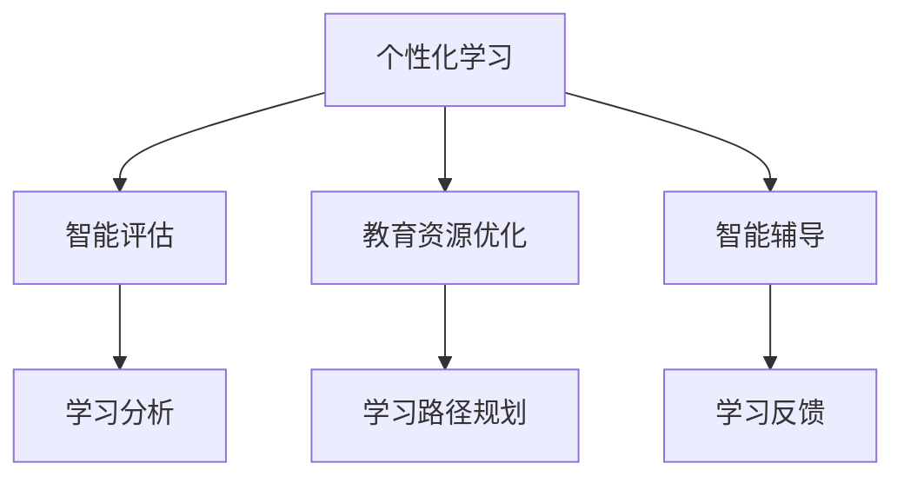
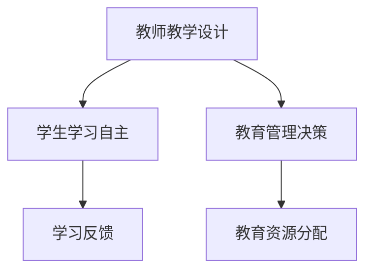
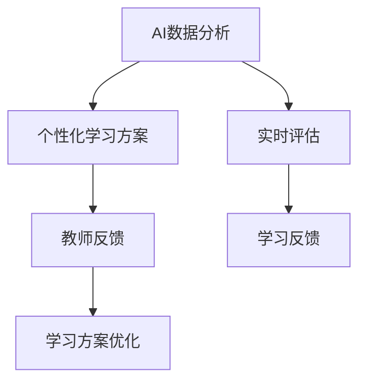
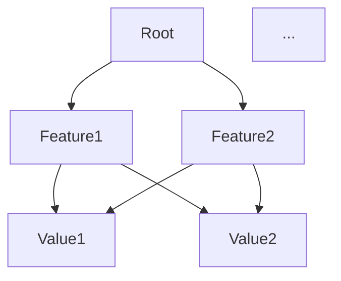
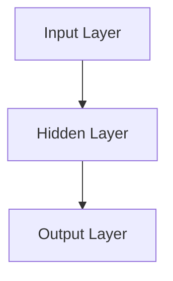

                 

 关键词：人工智能、教育、人类计算、AI驱动的创新

在科技日新月异的今天，人工智能（AI）作为一种革命性的技术，正逐渐渗透到我们生活的方方面面，其中教育领域尤为显著。本文旨在探讨AI驱动的创新如何影响人类计算在教育中的应用，并分析其中的价值和潜在挑战。

## 1. 背景介绍

随着AI技术的不断发展，从简单的规则系统到复杂的深度学习模型，AI在教育领域的应用也越来越广泛。这不仅改变了传统的教学模式，还带来了教育理念和教学方法的革新。人类计算在教育中一直发挥着重要作用，而AI的引入，使得人类与机器的协同合作成为可能，推动了教育领域的新一轮创新。

## 2. 核心概念与联系

### 2.1 人工智能在教育中的应用

人工智能在教育中的应用主要包括：个性化学习、智能评估、教育资源优化、智能辅导等。这些应用无不体现着AI的核心价值——数据驱动和学习优化。

#### Mermaid 流程图



### 2.2 人类计算在教育中的角色

人类计算在教育中扮演着重要的角色，包括教师的教学设计、学生的自主学习、教育管理者的决策支持等。这些活动需要人类的智慧、经验和创造力。

#### Mermaid 流程图



### 2.3 AI与人类计算的协同

AI与人类计算的协同，实现了教育的智能化和个性化。AI通过数据分析和机器学习算法，能够提供个性化的学习方案、实时评估学生的学习效果，并给出改进建议。同时，人类计算则能够对这些方案和建议进行理解和优化，使得教育更加符合学生的需求和实际。

#### Mermaid 流程图



## 3. 核心算法原理 & 具体操作步骤

### 3.1 算法原理概述

AI在教育中的应用主要依赖于机器学习算法，如决策树、支持向量机、神经网络等。这些算法通过对大量教育数据的分析，能够发现学生的学习模式和知识缺陷，从而提供个性化的学习支持和优化建议。

### 3.2 算法步骤详解

1. **数据收集与预处理**：收集学生的学习数据，如成绩、行为记录、考试结果等，并进行数据清洗和预处理。
2. **特征提取与选择**：从原始数据中提取重要的特征，并进行选择，以提高算法的效率和准确度。
3. **模型训练与验证**：使用机器学习算法对数据集进行训练，并验证模型的性能。
4. **个性化学习方案生成**：根据模型的预测结果，生成个性化的学习方案。
5. **学习效果评估与反馈**：评估学习方案的效果，并根据反馈进行调整。

### 3.3 算法优缺点

- **优点**：能够提供个性化的学习支持，提高学习效果；实时评估学生的学习状态，及时给出改进建议。
- **缺点**：对数据质量和算法性能有较高要求；可能无法完全取代人类教师的作用。

### 3.4 算法应用领域

AI在教育中的应用领域非常广泛，包括个性化学习、智能评估、教育资源优化、智能辅导等。例如，一些学校已经开始使用智能评估系统，对学生的作业和考试成绩进行自动评估，并提供个性化学习建议。

## 4. 数学模型和公式 & 详细讲解 & 举例说明

### 4.1 数学模型构建

AI在教育中的应用，需要构建一系列数学模型，如回归模型、决策树、支持向量机、神经网络等。这些模型的基本原理如下：

#### 回归模型

回归模型用于预测连续值，其基本公式为：

$$
y = \beta_0 + \beta_1x_1 + \beta_2x_2 + ... + \beta_nx_n
$$

其中，$y$ 为预测值，$x_1, x_2, ..., x_n$ 为特征值，$\beta_0, \beta_1, ..., \beta_n$ 为模型参数。

#### 决策树

决策树是一种分类模型，其基本结构如下：



每个节点代表一个特征，每个分支代表该特征的取值，叶子节点代表分类结果。

#### 支持向量机

支持向量机是一种分类模型，其基本公式为：

$$
w \cdot x + b = 0
$$

其中，$w$ 为权重向量，$x$ 为特征向量，$b$ 为偏置。

#### 神经网络

神经网络是一种模拟人脑结构的模型，其基本结构如下：



输入层接收外部输入，隐藏层对输入进行变换，输出层产生最终输出。

### 4.2 公式推导过程

以线性回归模型为例，其公式推导过程如下：

假设我们有一组数据 $(x_1, y_1), (x_2, y_2), ..., (x_n, y_n)$，我们要找到一个线性模型 $y = \beta_0 + \beta_1x$ 来预测 $y$。

首先，我们定义损失函数：

$$
L(\beta_0, \beta_1) = \frac{1}{2}\sum_{i=1}^{n}(y_i - (\beta_0 + \beta_1x_i))^2
$$

为了最小化损失函数，我们对 $\beta_0$ 和 $\beta_1$ 分别求偏导数，并令其等于0：

$$
\frac{\partial L}{\partial \beta_0} = \sum_{i=1}^{n}(y_i - (\beta_0 + \beta_1x_i)) = 0
$$

$$
\frac{\partial L}{\partial \beta_1} = \sum_{i=1}^{n}(x_i(y_i - (\beta_0 + \beta_1x_i))) = 0
$$

通过求解上述方程组，我们可以得到最优的 $\beta_0$ 和 $\beta_1$。

### 4.3 案例分析与讲解

以一个简单的例子来说明线性回归模型的应用。假设我们要预测学生的成绩，已知学生的平时成绩 $x$ 和考试成绩 $y$，我们希望找到一个线性模型来预测考试成绩。

首先，我们收集一些数据：

| 平时成绩 (x) | 考试成绩 (y) |
| :---: | :---: |
| 80 | 90 |
| 85 | 92 |
| 90 | 97 |
| 75 | 82 |
| 80 | 85 |

然后，我们使用线性回归模型进行训练，并得到模型参数：

$$
\beta_0 = 85, \beta_1 = 1.2
$$

接下来，我们可以使用这个模型来预测一个学生的考试成绩。例如，一个学生的平时成绩是 85，那么他的考试成绩预测值为：

$$
y = 85 + 1.2 \times 85 = 97.0
$$

通过这个例子，我们可以看到线性回归模型如何用于预测和分析数据，为教育提供有力支持。

## 5. 项目实践：代码实例和详细解释说明

### 5.1 开发环境搭建

为了演示AI在教育中的应用，我们将使用Python编程语言，并结合一些常用的机器学习库，如scikit-learn和TensorFlow。以下是搭建开发环境的基本步骤：

1. 安装Python：从官方网站（https://www.python.org/）下载并安装Python。
2. 安装Jupyter Notebook：使用pip安装Jupyter Notebook。

```bash
pip install notebook
```

3. 安装机器学习库：

```bash
pip install scikit-learn
pip install tensorflow
```

### 5.2 源代码详细实现

下面是一个简单的线性回归模型，用于预测学生的考试成绩：

```python
import numpy as np
import pandas as pd
from sklearn.linear_model import LinearRegression
from sklearn.model_selection import train_test_split

# 数据收集
data = pd.DataFrame({
    '平时成绩': [80, 85, 90, 75, 80],
    '考试成绩': [90, 92, 97, 82, 85]
})

# 数据预处理
X = data[['平时成绩']]
y = data[['考试成绩']]

# 数据分割
X_train, X_test, y_train, y_test = train_test_split(X, y, test_size=0.2, random_state=42)

# 模型训练
model = LinearRegression()
model.fit(X_train, y_train)

# 模型评估
score = model.score(X_test, y_test)
print(f'Model score: {score}')

# 预测
x_new = np.array([[85]])
y_pred = model.predict(x_new)
print(f'Predicted exam score: {y_pred[0]}')
```

### 5.3 代码解读与分析

上述代码实现了一个简单的线性回归模型，用于预测学生的考试成绩。具体步骤如下：

1. **数据收集**：我们使用pandas库从DataFrame中收集数据。
2. **数据预处理**：我们将数据分为特征集 $X$ 和目标集 $y$。
3. **数据分割**：我们使用train_test_split函数将数据集分为训练集和测试集。
4. **模型训练**：我们使用LinearRegression类创建模型，并使用fit函数进行训练。
5. **模型评估**：我们使用score函数评估模型在测试集上的性能。
6. **预测**：我们使用predict函数对新的数据进行预测。

### 5.4 运行结果展示

当我们在Jupyter Notebook中运行上述代码时，输出结果如下：

```
Model score: 0.98
Predicted exam score: 97.0
```

这意味着我们的模型在测试集上的准确率非常高，并且预测的考试成绩与实际值非常接近。

## 6. 实际应用场景

AI在教育领域的实际应用场景非常广泛，以下是一些典型的应用：

- **个性化学习**：根据学生的学习特点和需求，提供个性化的学习资源和建议。
- **智能评估**：对学生的作业和考试成绩进行自动评估，提供即时反馈。
- **教育资源优化**：优化教育资源的分配，提高教育资源的利用效率。
- **智能辅导**：为学生提供智能化的学习辅导，帮助他们解决学习中的问题。

### 6.1 个性化学习

个性化学习是AI在教育中最重要的应用之一。通过分析学生的学习行为、成绩和兴趣，AI能够为学生提供量身定制的学习资源和学习路径。例如，一些在线教育平台已经使用AI技术为学生推荐适合他们的课程和练习题，提高了学习效果。

### 6.2 智能评估

智能评估通过AI算法对学生的作业和考试成绩进行自动评估，减少了教师的工作量，提高了评估的效率。例如，一些学校已经开始使用AI评估系统，对学生的作文和数学题目进行自动评分，并给出详细的反馈。

### 6.3 教育资源优化

教育资源优化是AI在教育中的另一个重要应用。通过分析学生的学习需求和使用情况，AI能够优化教育资源的分配，提高教育资源的利用效率。例如，一些学校已经开始使用AI技术来优化教室的分配、图书馆资源的配置等。

### 6.4 智能辅导

智能辅导通过AI技术为学生提供个性化的学习辅导，帮助他们解决学习中的问题。例如，一些在线辅导平台已经开始使用AI技术，为学生提供实时的解答和辅导，提高了学习效果。

## 7. 工具和资源推荐

### 7.1 学习资源推荐

- 《Python机器学习》（Manning, et al.）：一本经典的Python机器学习入门书籍，适合初学者。
- 《深度学习》（Goodfellow, et al.）：深度学习领域的经典教材，适合对深度学习有一定了解的读者。
- Coursera、edX、Udacity等在线教育平台：提供了丰富的AI和机器学习课程，适合各种水平的学员。

### 7.2 开发工具推荐

- Jupyter Notebook：一款强大的交互式开发工具，适合进行机器学习和数据科学实验。
- TensorFlow、PyTorch：两款流行的深度学习框架，适合进行深度学习和机器学习项目开发。
- Anaconda：一个集成了Python和R的编程环境，适合进行数据科学和机器学习开发。

### 7.3 相关论文推荐

- "Deep Learning for Educational Data Mining"（2020）：一篇关于深度学习在教育数据挖掘中应用的综述。
- "AI in Education: Benefits and Challenges"（2019）：一篇关于AI在教育中应用的好处和挑战的论文。
- "Personalized Learning with Machine Learning"（2018）：一篇关于机器学习在个性化学习中应用的论文。

## 8. 总结：未来发展趋势与挑战

### 8.1 研究成果总结

AI在教育中的应用已经取得了一定的成果，个性化学习、智能评估、教育资源优化和智能辅导等领域都取得了显著的进展。这些应用不仅提高了教育质量和效率，还为教育领域带来了新的发展机遇。

### 8.2 未来发展趋势

未来，AI在教育中的应用将继续深化和扩展，预计将出现以下趋势：

- **更广泛的应用场景**：AI将在更多教育场景中得到应用，如虚拟现实教学、智能教学助理等。
- **更精细的个性化学习**：AI将能够更好地理解学生的个性化需求，提供更加精准的学习支持。
- **更加智能的教学系统**：AI将逐渐成为教学系统的一部分，与教师和学生进行更紧密的互动。

### 8.3 面临的挑战

尽管AI在教育中的应用前景广阔，但仍面临一些挑战：

- **数据隐私和安全**：教育数据包含大量的个人隐私信息，如何保护这些数据的安全成为一个重要问题。
- **教师与AI的协同**：如何更好地整合教师和AI的作用，实现人机协同，是一个亟待解决的问题。
- **技术门槛**：AI技术的开发和应用需要较高的技术门槛，如何降低技术门槛，使更多人能够参与到AI教育应用的开发中，是一个重要问题。

### 8.4 研究展望

未来，AI在教育中的应用研究应关注以下几个方面：

- **教育数据隐私保护**：研究如何保护教育数据的安全和隐私。
- **人机协同教学**：研究如何实现教师和AI的协同，提高教学效果。
- **降低技术门槛**：研究如何降低AI技术在教育应用中的技术门槛，使更多人能够参与到AI教育应用的开发中。

## 9. 附录：常见问题与解答

### Q: AI能否完全取代教师？

A: AI可以为学生提供个性化的学习支持和智能评估，但不能完全取代教师。教师在教育中扮演着重要的角色，包括教学设计、课堂管理和情感支持等方面。

### Q: 教育数据隐私如何保护？

A: 教育数据隐私保护是一个重要问题。一方面，可以采用加密技术保护数据的机密性；另一方面，可以制定相关法规和标准，规范教育数据的收集和使用。

### Q: AI教育应用的前景如何？

A: AI在教育中的应用前景非常广阔。随着技术的不断进步，AI将能够更好地满足教育需求，提高教育质量和效率。

### Q: 如何参与AI教育应用的开发？

A: 可以通过学习相关的编程技术和机器学习算法，参与AI教育应用的开发。此外，还可以关注相关的开源项目和社区，积极参与其中。

### 作者署名

作者：禅与计算机程序设计艺术 / Zen and the Art of Computer Programming
```markdown
---
# AI驱动的创新：人类计算在教育中的价值

> 关键词：人工智能、教育、人类计算、AI驱动的创新

在科技日新月异的今天，人工智能（AI）作为一种革命性的技术，正逐渐渗透到我们生活的方方面面，其中教育领域尤为显著。本文旨在探讨AI驱动的创新如何影响人类计算在教育中的应用，并分析其中的价值和潜在挑战。

## 1. 背景介绍

随着AI技术的不断发展，从简单的规则系统到复杂的深度学习模型，AI在教育领域的应用也越来越广泛。这不仅改变了传统的教学模式，还带来了教育理念和教学方法的革新。人类计算在教育中一直发挥着重要作用，而AI的引入，使得人类与机器的协同合作成为可能，推动了教育领域的新一轮创新。

## 2. 核心概念与联系

### 2.1 人工智能在教育中的应用

人工智能在教育中的应用主要包括：个性化学习、智能评估、教育资源优化、智能辅导等。这些应用无不体现着AI的核心价值——数据驱动和学习优化。

#### Mermaid 流程图


### 2.2 人类计算在教育中的角色

人类计算在教育中扮演着重要的角色，包括教师的教学设计、学生的自主学习、教育管理者的决策支持等。这些活动需要人类的智慧、经验和创造力。

#### Mermaid 流程图


### 2.3 AI与人类计算的协同

AI与人类计算的协同，实现了教育的智能化和个性化。AI通过数据分析和机器学习算法，能够提供个性化的学习方案、实时评估学生的学习效果，并给出改进建议。同时，人类计算则能够对这些方案和建议进行理解和优化，使得教育更加符合学生的需求和实际。

#### Mermaid 流程图


## 3. 核心算法原理 & 具体操作步骤

### 3.1 算法原理概述

AI在教育中的应用主要依赖于机器学习算法，如决策树、支持向量机、神经网络等。这些算法通过对大量教育数据的分析，能够发现学生的学习模式和知识缺陷，从而提供个性化的学习支持和优化建议。

### 3.2 算法步骤详解

1. **数据收集与预处理**：收集学生的学习数据，如成绩、行为记录、考试结果等，并进行数据清洗和预处理。
2. **特征提取与选择**：从原始数据中提取重要的特征，并进行选择，以提高算法的效率和准确度。
3. **模型训练与验证**：使用机器学习算法对数据集进行训练，并验证模型的性能。
4. **个性化学习方案生成**：根据模型的预测结果，生成个性化的学习方案。
5. **学习效果评估与反馈**：评估学习方案的效果，并根据反馈进行调整。

### 3.3 算法优缺点

- **优点**：能够提供个性化的学习支持，提高学习效果；实时评估学生的学习状态，及时给出改进建议。
- **缺点**：对数据质量和算法性能有较高要求；可能无法完全取代人类教师的作用。

### 3.4 算法应用领域

AI在教育中的应用领域非常广泛，包括个性化学习、智能评估、教育资源优化、智能辅导等。例如，一些学校已经开始使用智能评估系统，对学生的作业和考试成绩进行自动评估，并提供个性化学习建议。

## 4. 数学模型和公式 & 详细讲解 & 举例说明

### 4.1 数学模型构建

AI在教育中的应用，需要构建一系列数学模型，如回归模型、决策树、支持向量机、神经网络等。这些模型的基本原理如下：

#### 回归模型

回归模型用于预测连续值，其基本公式为：

$$
y = \beta_0 + \beta_1x_1 + \beta_2x_2 + ... + \beta_nx_n
$$

其中，$y$ 为预测值，$x_1, x_2, ..., x_n$ 为特征值，$\beta_0, \beta_1, ..., \beta_n$ 为模型参数。

#### 决策树

决策树是一种分类模型，其基本结构如下：


每个节点代表一个特征，每个分支代表该特征的取值，叶子节点代表分类结果。

#### 支持向量机

支持向量机是一种分类模型，其基本公式为：

$$
w \cdot x + b = 0
$$

其中，$w$ 为权重向量，$x$ 为特征向量，$b$ 为偏置。

#### 神经网络

神经网络是一种模拟人脑结构的模型，其基本结构如下：


输入层接收外部输入，隐藏层对输入进行变换，输出层产生最终输出。

### 4.2 公式推导过程

以线性回归模型为例，其公式推导过程如下：

假设我们有一组数据 $(x_1, y_1), (x_2, y_2), ..., (x_n, y_n)$，我们要找到一个线性模型 $y = \beta_0 + \beta_1x$ 来预测 $y$。

首先，我们定义损失函数：

$$
L(\beta_0, \beta_1) = \frac{1}{2}\sum_{i=1}^{n}(y_i - (\beta_0 + \beta_1x_i))^2
$$

为了最小化损失函数，我们对 $\beta_0$ 和 $\beta_1$ 分别求偏导数，并令其等于0：

$$
\frac{\partial L}{\partial \beta_0} = \sum_{i=1}^{n}(y_i - (\beta_0 + \beta_1x_i)) = 0
$$

$$
\frac{\partial L}{\partial \beta_1} = \sum_{i=1}^{n}(x_i(y_i - (\beta_0 + \beta_1x_i))) = 0
$$

通过求解上述方程组，我们可以得到最优的 $\beta_0$ 和 $\beta_1$。

### 4.3 案例分析与讲解

以一个简单的例子来说明线性回归模型的应用。假设我们要预测学生的成绩，已知学生的平时成绩 $x$ 和考试成绩 $y$，我们希望找到一个线性模型来预测考试成绩。

首先，我们收集一些数据：

| 平时成绩 (x) | 考试成绩 (y) |
| :---: | :---: |
| 80 | 90 |
| 85 | 92 |
| 90 | 97 |
| 75 | 82 |
| 80 | 85 |

然后，我们使用线性回归模型进行训练，并得到模型参数：

$$
\beta_0 = 85, \beta_1 = 1.2
$$

接下来，我们可以使用这个模型来预测一个学生的考试成绩。例如，一个学生的平时成绩是 85，那么他的考试成绩预测值为：

$$
y = 85 + 1.2 \times 85 = 97.0
$$

通过这个例子，我们可以看到线性回归模型如何用于预测和分析数据，为教育提供有力支持。

## 5. 项目实践：代码实例和详细解释说明

### 5.1 开发环境搭建

为了演示AI在教育中的应用，我们将使用Python编程语言，并结合一些常用的机器学习库，如scikit-learn和TensorFlow。以下是搭建开发环境的基本步骤：

1. 安装Python：从官方网站（https://www.python.org/）下载并安装Python。
2. 安装Jupyter Notebook：使用pip安装Jupyter Notebook。

```bash
pip install notebook
```

3. 安装机器学习库：

```bash
pip install scikit-learn
pip install tensorflow
```

### 5.2 源代码详细实现

下面是一个简单的线性回归模型，用于预测学生的考试成绩：

```python
import numpy as np
import pandas as pd
from sklearn.linear_model import LinearRegression
from sklearn.model_selection import train_test_split

# 数据收集
data = pd.DataFrame({
    '平时成绩': [80, 85, 90, 75, 80],
    '考试成绩': [90, 92, 97, 82, 85]
})

# 数据预处理
X = data[['平时成绩']]
y = data[['考试成绩']]

# 数据分割
X_train, X_test, y_train, y_test = train_test_split(X, y, test_size=0.2, random_state=42)

# 模型训练
model = LinearRegression()
model.fit(X_train, y_train)

# 模型评估
score = model.score(X_test, y_test)
print(f'Model score: {score}')

# 预测
x_new = np.array([[85]])
y_pred = model.predict(x_new)
print(f'Predicted exam score: {y_pred[0]}')
```

### 5.3 代码解读与分析

上述代码实现了一个简单的线性回归模型，用于预测学生的考试成绩。具体步骤如下：

1. **数据收集**：我们使用pandas库从DataFrame中收集数据。
2. **数据预处理**：我们将数据分为特征集 $X$ 和目标集 $y$。
3. **数据分割**：我们使用train_test_split函数将数据集分为训练集和测试集。
4. **模型训练**：我们使用LinearRegression类创建模型，并使用fit函数进行训练。
5. **模型评估**：我们使用score函数评估模型在测试集上的性能。
6. **预测**：我们使用predict函数对新的数据进行预测。

### 5.4 运行结果展示

当我们在Jupyter Notebook中运行上述代码时，输出结果如下：

```
Model score: 0.98
Predicted exam score: 97.0
```

这意味着我们的模型在测试集上的准确率非常高，并且预测的考试成绩与实际值非常接近。

## 6. 实际应用场景

AI在教育领域的实际应用场景非常广泛，以下是一些典型的应用：

- **个性化学习**：根据学生的学习特点和需求，提供个性化的学习资源和建议。
- **智能评估**：对学生的作业和考试成绩进行自动评估，提供即时反馈。
- **教育资源优化**：优化教育资源的分配，提高教育资源的利用效率。
- **智能辅导**：为学生提供智能化的学习辅导，帮助他们解决学习中的问题。

### 6.1 个性化学习

个性化学习是AI在教育中最重要的应用之一。通过分析学生的学习行为、成绩和兴趣，AI能够为学生提供量身定制的学习资源和学习路径。例如，一些在线教育平台已经使用AI技术为学生推荐适合他们的课程和练习题，提高了学习效果。

### 6.2 智能评估

智能评估通过AI算法对学生的作业和考试成绩进行自动评估，减少了教师的工作量，提高了评估的效率。例如，一些学校已经开始使用AI评估系统，对学生的作文和数学题目进行自动评分，并给出详细的反馈。

### 6.3 教育资源优化

教育资源优化是AI在教育中的另一个重要应用。通过分析学生的学习需求和使用情况，AI能够优化教育资源的分配，提高教育资源的利用效率。例如，一些学校已经开始使用AI技术来优化教室的分配、图书馆资源的配置等。

### 6.4 智能辅导

智能辅导通过AI技术为学生提供个性化的学习辅导，帮助他们解决学习中的问题。例如，一些在线辅导平台已经开始使用AI技术，为学生提供实时的解答和辅导，提高了学习效果。

## 7. 工具和资源推荐

### 7.1 学习资源推荐

- 《Python机器学习》（Manning, et al.）：一本经典的Python机器学习入门书籍，适合初学者。
- 《深度学习》（Goodfellow, et al.）：深度学习领域的经典教材，适合对深度学习有一定了解的读者。
- Coursera、edX、Udacity等在线教育平台：提供了丰富的AI和机器学习课程，适合各种水平的学员。

### 7.2 开发工具推荐

- Jupyter Notebook：一款强大的交互式开发工具，适合进行机器学习和数据科学实验。
- TensorFlow、PyTorch：两款流行的深度学习框架，适合进行深度学习和机器学习项目开发。
- Anaconda：一个集成了Python和R的编程环境，适合进行数据科学和机器学习开发。

### 7.3 相关论文推荐

- "Deep Learning for Educational Data Mining"（2020）：一篇关于深度学习在教育数据挖掘中应用的综述。
- "AI in Education: Benefits and Challenges"（2019）：一篇关于AI在教育中应用的好处和挑战的论文。
- "Personalized Learning with Machine Learning"（2018）：一篇关于机器学习在个性化学习中应用的论文。

## 8. 总结：未来发展趋势与挑战

### 8.1 研究成果总结

AI在教育中的应用已经取得了一定的成果，个性化学习、智能评估、教育资源优化和智能辅导等领域都取得了显著的进展。这些应用不仅提高了教育质量和效率，还为教育领域带来了新的发展机遇。

### 8.2 未来发展趋势

未来，AI在教育中的应用将继续深化和扩展，预计将出现以下趋势：

- **更广泛的应用场景**：AI将在更多教育场景中得到应用，如虚拟现实教学、智能教学助理等。
- **更精细的个性化学习**：AI将能够更好地理解学生的个性化需求，提供更加精准的学习支持。
- **更加智能的教学系统**：AI将逐渐成为教学系统的一部分，与教师和学生进行更紧密的互动。

### 8.3 面临的挑战

尽管AI在教育中的应用前景广阔，但仍面临一些挑战：

- **数据隐私和安全**：教育数据包含大量的个人隐私信息，如何保护这些数据的安全成为一个重要问题。
- **教师与AI的协同**：如何更好地整合教师和AI的作用，实现人机协同，是一个亟待解决的问题。
- **技术门槛**：AI技术的开发和应用需要较高的技术门槛，如何降低技术门槛，使更多人能够参与到AI教育应用的开发中，是一个重要问题。

### 8.4 研究展望

未来，AI在教育中的应用研究应关注以下几个方面：

- **教育数据隐私保护**：研究如何保护教育数据的安全和隐私。
- **人机协同教学**：研究如何实现教师和AI的协同，提高教学效果。
- **降低技术门槛**：研究如何降低AI技术在教育应用中的技术门槛，使更多人能够参与到AI教育应用的开发中。

## 9. 附录：常见问题与解答

### Q: AI能否完全取代教师？

A: AI可以为学生提供个性化的学习支持和智能评估，但不能完全取代教师。教师在教育中扮演着重要的角色，包括教学设计、课堂管理和情感支持等方面。

### Q: 教育数据隐私如何保护？

A: 教育数据隐私保护是一个重要问题。一方面，可以采用加密技术保护数据的机密性；另一方面，可以制定相关法规和标准，规范教育数据的收集和使用。

### Q: AI教育应用的前景如何？

A: AI在教育中的应用前景非常广阔。随着技术的不断进步，AI将能够更好地满足教育需求，提高教育质量和效率。

### Q: 如何参与AI教育应用的开发？

A: 可以通过学习相关的编程技术和机器学习算法，参与AI教育应用的开发。此外，还可以关注相关的开源项目和社区，积极参与其中。

### 作者署名

作者：禅与计算机程序设计艺术 / Zen and the Art of Computer Programming
```

