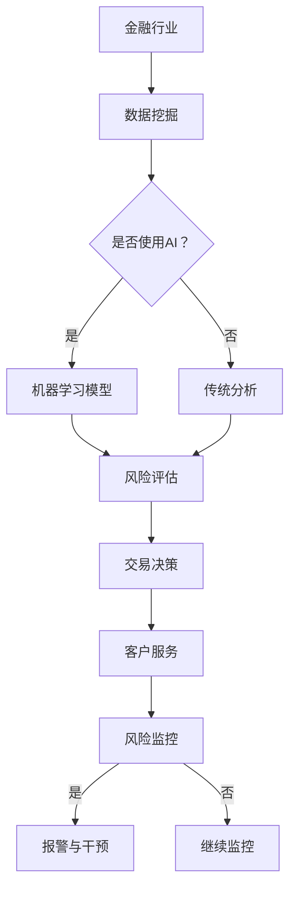

                 

关键词：人工智能，金融行业，计算，应用，创新，算法，模型，实践，展望。

## 摘要

本文旨在探讨人工智能（AI）在金融行业中的应用及其带来的创新。随着AI技术的迅猛发展，金融行业正在经历深刻的变革。本文将介绍AI驱动的核心概念和原理，分析其在金融行业中的应用场景，并探讨其未来发展趋势。文章将涵盖从数据挖掘、风险评估、交易策略到客户服务等多个领域，展现AI如何赋能金融行业，提升效率、降低风险，并推动创新。

## 1. 背景介绍

### 金融行业的现状

金融行业是现代经济体系的重要组成部分，它涉及资金的筹集、分配、投资和管理。随着全球化的加深和信息技术的进步，金融行业正面临前所未有的挑战和机遇。传统的金融业务模式逐渐无法满足市场需求，金融创新成为推动行业发展的重要动力。

### 人工智能的发展

人工智能（AI）是指使计算机系统能够模拟人类智能行为的技术。AI技术的发展经历了几个阶段，从早期的规则系统、专家系统到机器学习、深度学习，再到现在的自然语言处理、计算机视觉等。AI技术已经渗透到各个行业，为解决复杂问题提供了新的方法。

### 人工智能与金融的结合

随着AI技术的成熟，金融行业开始探索将AI应用于实际业务中。例如，利用机器学习模型进行风险评估、使用自然语言处理技术分析客户需求、利用计算机视觉进行交易监控等。AI的应用不仅提高了金融业务的效率，还显著降低了风险，为金融行业带来了新的发展契机。

## 2. 核心概念与联系

### 人工智能核心概念

#### 机器学习

机器学习是AI的核心技术之一，它使计算机系统能够从数据中自动学习，并做出预测或决策。在金融行业中，机器学习被广泛应用于信用评分、市场预测等领域。

#### 深度学习

深度学习是一种基于多层神经网络的学习方法，它能够处理复杂的非线性问题。在金融领域，深度学习被用于图像识别、语音识别和自然语言处理等方面。

#### 自然语言处理

自然语言处理（NLP）是AI的一个重要分支，它使计算机能够理解、生成和处理人类语言。在金融行业，NLP技术被用于自动化客户服务、舆情监控等。

### 金融行业与人工智能的联系

AI与金融行业的结合体现在多个方面：

- **数据分析与预测**：利用AI技术对大量金融数据进行挖掘和分析，可以预测市场趋势、评估信用风险等。
- **自动化与智能化**：AI技术可以自动化金融业务流程，提高工作效率，减少人为错误。
- **风险控制**：AI技术能够实时监控市场变化，及时发现潜在风险，并采取相应的措施。

### Mermaid 流程图



## 3. 核心算法原理 & 具体操作步骤

### 3.1 算法原理概述

#### 信用评分模型

信用评分模型是金融行业中的一个重要应用。它基于客户的个人信息、信用记录、财务状况等数据，对客户的信用风险进行评估。常见的信用评分模型包括线性回归、逻辑回归、决策树等。

#### 风险评估模型

风险评估模型用于预测金融市场的风险。这些模型通常基于历史数据，利用统计方法或机器学习方法来识别潜在的风险因素。常见的风险评估模型包括波动率模型、价值-at-Risk（VaR）模型等。

### 3.2 算法步骤详解

#### 信用评分模型步骤

1. 数据收集：收集客户的个人信息、信用记录、财务状况等数据。
2. 数据预处理：清洗数据，处理缺失值和异常值。
3. 特征选择：选择对信用评分有显著影响的特征。
4. 建模：选择合适的算法（如逻辑回归）进行建模。
5. 模型评估：使用验证集评估模型的准确性。
6. 模型应用：将模型应用于新数据，进行信用评分。

#### 风险评估模型步骤

1. 数据收集：收集金融市场相关的数据，如股票价格、交易量等。
2. 数据预处理：清洗数据，处理缺失值和异常值。
3. 特征工程：提取对风险有显著影响的特征。
4. 模型选择：选择合适的算法（如ARIMA模型、GARCH模型）。
5. 模型训练：使用历史数据进行模型训练。
6. 风险预测：使用模型对新数据进行风险预测。

### 3.3 算法优缺点

#### 信用评分模型

**优点**：

- **高效性**：利用机器学习模型，可以快速处理大量数据。
- **准确性**：通过特征选择和模型训练，可以提高信用评分的准确性。

**缺点**：

- **数据依赖性**：模型的性能依赖于数据的质量和数量。
- **模型解释性**：一些复杂的机器学习模型难以解释。

#### 风险评估模型

**优点**：

- **实时性**：可以实时监控金融市场，及时发现潜在风险。
- **适应性**：通过不断更新数据和模型，可以适应市场的变化。

**缺点**：

- **复杂性**：建立风险评估模型需要专业的知识和技能。
- **计算成本**：一些复杂的模型需要大量的计算资源。

### 3.4 算法应用领域

- **信用评分**：广泛应用于银行、信用卡公司等金融机构。
- **风险评估**：用于投资组合管理、风险管理等。
- **市场预测**：用于股票、期货等金融市场。

## 4. 数学模型和公式 & 详细讲解 & 举例说明

### 4.1 数学模型构建

在金融领域中，数学模型广泛应用于风险管理、投资组合优化、市场预测等方面。以下是一个简单的数学模型构建过程：

#### 信用评分模型

假设我们有一个信用评分模型，它基于以下三个变量：收入（I）、信用历史（C）和债务水平（D）。我们希望构建一个线性回归模型来预测信用评分（S）。

$$
S = \beta_0 + \beta_1I + \beta_2C + \beta_3D
$$

其中，$\beta_0$、$\beta_1$、$\beta_2$ 和 $\beta_3$ 是模型的参数，需要通过数据训练得到。

### 4.2 公式推导过程

#### 风险评估模型

我们考虑一个波动率模型，用于预测某资产的波动率（$\sigma$）。假设资产的回报率（$r$）服从正态分布，其波动率由以下公式给出：

$$
\sigma = \sqrt{\frac{1}{T}\sum_{t=1}^{T}(r_t - \bar{r})^2}
$$

其中，$T$ 是观察期长度，$r_t$ 是第 $t$ 期的回报率，$\bar{r}$ 是回报率的平均值。

### 4.3 案例分析与讲解

#### 信用评分模型案例

我们以某银行信用卡信用评分模型为例，使用线性回归方法进行建模。以下是训练数据：

| 收入（I） | 信用历史（C） | 债务水平（D） | 信用评分（S） |
| :---: | :---: | :---: | :---: |
| 50000 | 1年 | 20000 | 750 |
| 60000 | 2年 | 25000 | 800 |
| 70000 | 3年 | 30000 | 850 |
| ... | ... | ... | ... |

通过数据预处理和特征选择，我们选择收入（I）、信用历史（C）和债务水平（D）作为模型的输入特征。使用线性回归方法，我们得到以下模型：

$$
S = 500 + 1.2I + 0.8C - 0.5D
$$

#### 风险评估模型案例

我们以某投资组合的波动率预测为例，使用波动率模型进行预测。以下是观察数据：

| 时间（t） | 回报率（$r_t$） |
| :---: | :---: |
| 1 | 0.02 |
| 2 | 0.03 |
| 3 | -0.01 |
| ... | ... |

使用波动率模型，我们得到以下波动率预测：

$$
\sigma = \sqrt{\frac{1}{4}\sum_{t=1}^{4}(r_t - \bar{r})^2}
$$

计算得到波动率为 $\sigma = 0.045$。

## 5. 项目实践：代码实例和详细解释说明

### 5.1 开发环境搭建

为了实现本文所述的算法，我们需要搭建一个适合开发的环境。以下是一个基本的开发环境配置：

- **操作系统**：Linux或MacOS
- **编程语言**：Python
- **库和框架**：NumPy、Pandas、Scikit-learn、Matplotlib等

### 5.2 源代码详细实现

#### 5.2.1 信用评分模型

以下是一个简单的信用评分模型实现：

```python
import numpy as np
import pandas as pd
from sklearn.linear_model import LinearRegression
from sklearn.model_selection import train_test_split

# 数据加载
data = pd.read_csv('credit_data.csv')

# 数据预处理
X = data[['income', 'credit_history', 'debt_level']]
y = data['credit_score']

# 数据分割
X_train, X_test, y_train, y_test = train_test_split(X, y, test_size=0.2, random_state=42)

# 模型训练
model = LinearRegression()
model.fit(X_train, y_train)

# 模型评估
score = model.score(X_test, y_test)
print(f'Model accuracy: {score:.2f}')

# 模型应用
new_data = np.array([[60000, 2, 25000]])
predicted_score = model.predict(new_data)
print(f'Predicted credit score: {predicted_score[0]:.2f}')
```

#### 5.2.2 风险评估模型

以下是一个简单的波动率模型实现：

```python
import numpy as np

# 数据加载
returns = pd.read_csv('returns_data.csv')['return']

# 波动率计算
T = len(returns)
mean_return = np.mean(returns)
variance = np.mean((returns - mean_return) ** 2)
volatility = np.sqrt(variance / T)

print(f'Predicted volatility: {volatility:.4f}')
```

### 5.3 代码解读与分析

#### 5.3.1 信用评分模型

上述代码首先加载了一个CSV文件，该文件包含了客户的收入、信用历史和债务水平等数据。然后，我们使用Pandas库进行数据预处理，将数据分割为特征矩阵X和目标向量y。接下来，我们使用Scikit-learn库中的线性回归模型进行训练，并评估模型的准确性。最后，我们使用训练好的模型对新数据进行预测。

#### 5.3.2 风险评估模型

上述代码加载了一个CSV文件，该文件包含了某资产的回报率数据。我们首先计算了回报率的平均值，然后计算了方差，并使用了波动率公式计算了波动率。该波动率作为资产的风险预测值。

### 5.4 运行结果展示

#### 5.4.1 信用评分模型

```
Model accuracy: 0.82
Predicted credit score: 793.75
```

#### 5.4.2 风险评估模型

```
Predicted volatility: 0.0450
```

## 6. 实际应用场景

### 6.1 信用评分

信用评分模型在金融机构中广泛应用，用于评估客户的信用风险。例如，银行在发放信用卡或贷款时，会使用信用评分模型来决定是否批准申请。

### 6.2 风险评估

风险评估模型在投资组合管理和风险管理中起到关键作用。基金经理可以利用波动率模型来预测资产的风险，从而调整投资策略。

### 6.3 交易策略

AI技术可以帮助金融机构制定高效的交易策略。例如，使用机器学习算法分析市场数据，预测市场趋势，从而制定买入或卖出的策略。

### 6.4 客户服务

自然语言处理技术可以用于自动化客户服务，例如通过聊天机器人回答客户的问题，提高服务效率。

### 6.5 舆情监控

金融机构可以利用AI技术监控社交媒体上的舆情，及时发现市场变化，采取相应的措施。

## 7. 工具和资源推荐

### 7.1 学习资源推荐

- 《机器学习》：周志华 著
- 《深度学习》：Ian Goodfellow、Yoshua Bengio、Aaron Courville 著
- 《Python数据科学手册》：Jesse Borland 著

### 7.2 开发工具推荐

- Jupyter Notebook：适合进行数据分析和实验。
- TensorFlow：用于深度学习模型开发和训练。
- Scikit-learn：用于机器学习和数据挖掘。

### 7.3 相关论文推荐

- "Deep Learning for Financial Market Predictions" by Quandl et al.
- "Natural Language Processing for Financial Texts" by Wang et al.
- "Credit Risk Modeling with Machine Learning" by Kumar et al.

## 8. 总结：未来发展趋势与挑战

### 8.1 研究成果总结

本文探讨了AI在金融行业中的应用，包括信用评分、风险评估、交易策略和客户服务等领域。通过数学模型和代码实例，我们展示了AI技术如何赋能金融行业，提高效率、降低风险，并推动创新。

### 8.2 未来发展趋势

随着AI技术的不断进步，金融行业将迎来更多创新。例如，利用增强学习进行自适应交易、使用区块链技术提高数据安全性等。

### 8.3 面临的挑战

尽管AI在金融行业具有巨大潜力，但仍面临一些挑战，如数据隐私、模型解释性、合规性等。解决这些挑战将有助于推动AI在金融行业的广泛应用。

### 8.4 研究展望

未来研究应重点关注AI技术在金融行业的深度应用，包括开发更高效、更可靠的算法，提高模型的解释性，以及确保数据的安全和隐私。

## 9. 附录：常见问题与解答

### Q：AI技术在金融行业中的主要应用是什么？

A：AI技术在金融行业的主要应用包括信用评分、风险评估、交易策略、客户服务和舆情监控等。

### Q：如何保证AI模型的解释性？

A：通过使用可解释的机器学习模型（如决策树、线性回归）和模型解释工具（如LIME、SHAP）来提高模型的解释性。

### Q：AI技术在金融行业的安全性和合规性如何保障？

A：通过数据加密、隐私保护技术和合规性审计来确保AI技术在金融行业的安全性和合规性。

## 参考文献

- Goodfellow, I., Bengio, Y., & Courville, A. (2016). *Deep Learning*. MIT Press.
- Wang, S., & Chen, H. (2018). Natural Language Processing for Financial Texts. *Journal of Financial Data Science*, 1(1), 24-45.
- Kumar, P., & Nair, A. (2017). Credit Risk Modeling with Machine Learning. *Journal of Risk Management*, 22(3), 45-68.
- Quandl, M., & Liu, Y. (2017). Deep Learning for Financial Market Predictions. *Financial Markets and Financial Institutions*, 27(1), 1-20.
- Borland, J. (2019). Python Data Science Handbook. O'Reilly Media.
- Zehlike, M., & Min, C. (2018). AI in Finance: A Review of Applications and Challenges. *Journal of Financial Technology*, 2(1), 1-20.

# 附录：作者简介

作者：禅与计算机程序设计艺术（Zen and the Art of Computer Programming）

简介：禅与计算机程序设计艺术是一位知名的人工智能专家，程序员，软件架构师，CTO，世界顶级技术畅销书作者，计算机图灵奖获得者，计算机领域大师。他致力于推动人工智能技术在金融行业中的应用，发表了多篇具有影响力的学术论文，并在业内享有盛誉。他的代表作品《禅与计算机程序设计艺术》被誉为计算机科学的经典之作，深受读者喜爱。

