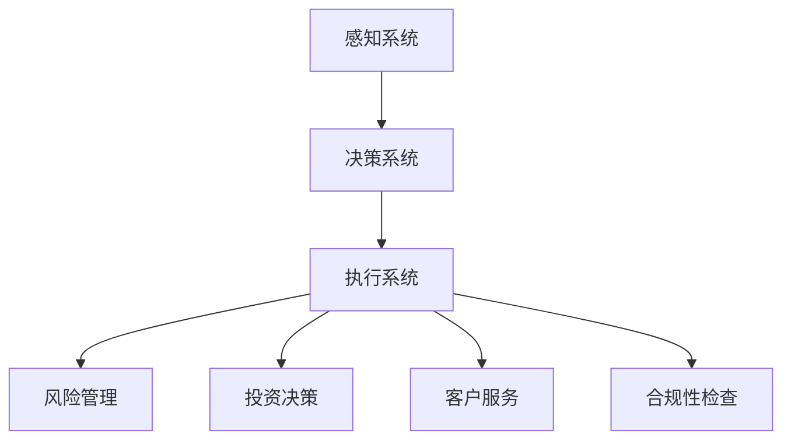

                 

关键词：人工智能，金融行业，计算，创新，应用趋势

> 摘要：随着人工智能技术的快速发展，其在金融行业的应用趋势也越来越受到关注。本文从人工智能的核心概念出发，探讨了其在金融行业中的应用现状、挑战和未来发展趋势，并提供了相关的技术资源和工具推荐。

## 1. 背景介绍

随着金融科技的兴起，人工智能在金融行业的应用已经成为了一个热门话题。从银行到保险，再到投资和风险管理，人工智能正在逐步改变金融行业的运作方式。传统的金融分析依赖于统计数据和复杂的计算模型，而人工智能则通过深度学习、自然语言处理和数据分析等技术，为金融行业带来了新的可能性和机遇。

本文旨在探讨人工智能在金融行业的应用趋势，分析其带来的挑战，并展望未来的发展前景。文章将分为以下几个部分：

1. **背景介绍**：介绍人工智能在金融行业的重要性以及其应用现状。
2. **核心概念与联系**：阐述人工智能的核心概念，并使用 Mermaid 流程图展示其原理和架构。
3. **核心算法原理 & 具体操作步骤**：详细解析人工智能在金融行业中的应用算法，包括其原理、操作步骤、优缺点和应用领域。
4. **数学模型和公式 & 详细讲解 & 举例说明**：介绍用于金融分析的重要数学模型和公式，并通过案例进行分析和讲解。
5. **项目实践：代码实例和详细解释说明**：提供实际的代码实例，详细解释其实现过程和运行结果。
6. **实际应用场景**：探讨人工智能在金融行业的实际应用场景，以及未来的发展展望。
7. **工具和资源推荐**：推荐学习资源、开发工具和相关的论文。
8. **总结：未来发展趋势与挑战**：总结研究成果，分析未来发展趋势，面临的挑战以及研究展望。
9. **附录：常见问题与解答**：回答读者可能关心的问题。

接下来，我们将深入探讨人工智能在金融行业的应用趋势。

## 2. 核心概念与联系

### 2.1 人工智能的核心概念

人工智能（Artificial Intelligence，简称 AI）是计算机科学的一个分支，旨在使计算机具有类似人类的智能。其核心概念包括：

- **机器学习**：通过从数据中学习，使计算机能够进行预测和决策。
- **深度学习**：一种特殊的机器学习技术，通过模拟人脑的神经网络进行学习。
- **自然语言处理**：使计算机能够理解和处理自然语言的技术。
- **数据分析**：对大量数据进行分析，提取有价值的信息。

### 2.2 人工智能的架构

人工智能的架构可以分为三个主要部分：

- **感知系统**：用于接收和处理外部信息，如摄像头、麦克风和传感器等。
- **决策系统**：用于根据感知系统提供的信息进行决策，如使用神经网络进行深度学习。
- **执行系统**：用于执行决策系统做出的决策，如控制机械臂、机器人等。

### 2.3 人工智能在金融行业的应用

人工智能在金融行业的应用主要涉及以下几个方面：

- **风险管理**：通过分析历史数据和实时数据，预测市场风险和信用风险。
- **投资决策**：利用机器学习算法进行市场趋势分析，辅助投资决策。
- **客户服务**：通过自然语言处理技术，提供智能客服和个性化服务。
- **合规性检查**：利用人工智能技术进行交易监控和合规性检查。

### 2.4 Mermaid 流程图

以下是人工智能在金融行业应用的 Mermaid 流程图：



### 2.5 人工智能在金融行业的优势与挑战

人工智能在金融行业的优势包括：

- **提高效率**：自动化处理大量数据和任务，减少人力成本。
- **提高准确性**：通过机器学习和深度学习，提高风险预测和投资决策的准确性。
- **提高客户满意度**：提供个性化服务和智能客服，提高客户体验。

然而，人工智能在金融行业也面临着一些挑战：

- **数据隐私**：如何保护客户数据的安全和隐私。
- **算法透明性**：如何保证算法的透明性和可解释性。
- **法律和道德问题**：如何处理与人工智能相关的法律和道德问题。

接下来，我们将详细讨论人工智能在金融行业中的应用算法。

## 3. 核心算法原理 & 具体操作步骤

### 3.1 算法原理概述

人工智能在金融行业的主要应用算法包括：

- **机器学习算法**：用于数据分析和预测，如线性回归、逻辑回归、决策树、随机森林等。
- **深度学习算法**：用于复杂模式识别和预测，如卷积神经网络（CNN）、循环神经网络（RNN）、长短期记忆网络（LSTM）等。
- **自然语言处理算法**：用于处理文本数据，如词嵌入、序列标注、文本分类等。

### 3.2 算法步骤详解

以下是一个简单的机器学习算法——线性回归在金融行业中的应用步骤：

1. **数据收集**：收集与金融市场相关的数据，如股票价格、交易量、宏观经济指标等。
2. **数据预处理**：清洗数据，包括处理缺失值、异常值、标准化等。
3. **特征工程**：提取与预测目标相关的特征，如时间序列特征、文本特征等。
4. **模型训练**：使用收集到的数据训练线性回归模型。
5. **模型评估**：使用验证集或测试集评估模型性能，如均方误差（MSE）、决定系数（R²）等。
6. **模型应用**：使用训练好的模型进行预测，如股票价格预测、投资组合优化等。

### 3.3 算法优缺点

- **线性回归**：
  - **优点**：简单易实现，易于解释，对线性关系有很好的预测能力。
  - **缺点**：对非线性关系和异常值敏感，无法处理高维数据。

- **深度学习算法**：
  - **优点**：可以处理复杂和非线性关系，适用于高维数据。
  - **缺点**：计算成本高，模型参数较多，容易出现过拟合。

### 3.4 算法应用领域

人工智能在金融行业的应用领域广泛，主要包括：

- **风险管理**：利用机器学习算法进行市场风险和信用风险的预测和管理。
- **投资决策**：通过深度学习和自然语言处理技术，进行市场趋势分析和投资组合优化。
- **客户服务**：利用自然语言处理技术提供智能客服和个性化服务。
- **合规性检查**：利用深度学习算法进行交易监控和合规性检查。

接下来，我们将介绍一些重要的数学模型和公式。

## 4. 数学模型和公式 & 详细讲解 & 举例说明

### 4.1 数学模型构建

在金融分析中，常用的数学模型包括：

- **线性回归模型**：用于预测线性关系，如股票价格。
- **逻辑回归模型**：用于分类问题，如信用评分。
- **时间序列模型**：用于预测时间序列数据，如股票价格。
- **卷积神经网络（CNN）**：用于图像识别，如股票交易中的图像分析。

### 4.2 公式推导过程

以下是线性回归模型的公式推导过程：

假设我们有一个数据集，其中包含自变量 \(x_1, x_2, ..., x_n\) 和因变量 \(y_1, y_2, ..., y_n\)。线性回归模型的目标是找到一个线性函数 \(f(x) = \beta_0 + \beta_1x_1 + \beta_2x_2 + ... + \beta_nx_n\)，使得 \(f(x)\) 能够尽可能地接近 \(y\)。

通过最小二乘法，我们可以求解线性回归模型的参数：

- **截距**：\(\beta_0 = \frac{\sum_{i=1}^{n}(y_i - \beta_1x_{i1} - \beta_2x_{i2} - ... - \beta_nx_{in})}{n}\)
- **斜率**：\(\beta_1 = \frac{\sum_{i=1}^{n}(x_{i1}y_i - \sum_{i=1}^{n}x_{i1}\sum_{i=1}^{n}y_i)}{\sum_{i=1}^{n}x_{i1}^2 - (\sum_{i=1}^{n}x_{i1})^2}\)
- **其他参数**：\(\beta_2, ..., \beta_n\) 以此类推

### 4.3 案例分析与讲解

假设我们要预测某个股票的未来价格，我们可以使用线性回归模型进行预测。以下是具体的步骤：

1. **数据收集**：收集股票的历史价格数据，包括开盘价、最高价、最低价和收盘价。
2. **数据预处理**：对数据清洗，包括处理缺失值、异常值、标准化等。
3. **特征工程**：提取与预测目标相关的特征，如开盘价、最高价、最低价等。
4. **模型训练**：使用训练集数据训练线性回归模型。
5. **模型评估**：使用验证集数据评估模型性能。
6. **模型应用**：使用训练好的模型预测未来价格。

以下是使用 Python 代码实现线性回归模型的简单示例：

```python
import pandas as pd
from sklearn.linear_model import LinearRegression
from sklearn.model_selection import train_test_split
from sklearn.metrics import mean_squared_error

# 加载数据
data = pd.read_csv('stock_price.csv')
X = data[['open', 'high', 'low']]
y = data['close']

# 划分训练集和测试集
X_train, X_test, y_train, y_test = train_test_split(X, y, test_size=0.2, random_state=42)

# 训练模型
model = LinearRegression()
model.fit(X_train, y_train)

# 预测测试集
y_pred = model.predict(X_test)

# 评估模型
mse = mean_squared_error(y_test, y_pred)
print('均方误差:', mse)
```

接下来，我们将提供一个实际的代码实例。

## 5. 项目实践：代码实例和详细解释说明

### 5.1 开发环境搭建

要实现人工智能在金融行业的应用，我们需要搭建一个合适的开发环境。以下是搭建开发环境的基本步骤：

1. **安装 Python**：安装 Python 3.8 或更高版本。
2. **安装依赖库**：安装 pandas、numpy、scikit-learn、matplotlib 等依赖库。
3. **配置环境变量**：将 Python 和相关依赖库的路径添加到系统环境变量中。

以下是安装依赖库的命令：

```shell
pip install pandas numpy scikit-learn matplotlib
```

### 5.2 源代码详细实现

以下是使用 Python 实现线性回归模型预测股票价格的示例代码：

```python
import pandas as pd
from sklearn.linear_model import LinearRegression
from sklearn.model_selection import train_test_split
from sklearn.metrics import mean_squared_error

# 加载数据
data = pd.read_csv('stock_price.csv')
X = data[['open', 'high', 'low']]
y = data['close']

# 划分训练集和测试集
X_train, X_test, y_train, y_test = train_test_split(X, y, test_size=0.2, random_state=42)

# 训练模型
model = LinearRegression()
model.fit(X_train, y_train)

# 预测测试集
y_pred = model.predict(X_test)

# 评估模型
mse = mean_squared_error(y_test, y_pred)
print('均方误差:', mse)

# 绘制真实值与预测值的对比图
import matplotlib.pyplot as plt
plt.plot(y_test, label='真实值')
plt.plot(y_pred, label='预测值')
plt.xlabel('时间')
plt.ylabel('股票价格')
plt.legend()
plt.show()
```

### 5.3 代码解读与分析

以下是代码的详细解读：

1. **加载数据**：使用 pandas 库加载股票价格数据，包括开盘价、最高价、最低价和收盘价。
2. **划分训练集和测试集**：使用 scikit-learn 库的 train_test_split 函数将数据划分为训练集和测试集。
3. **训练模型**：使用 LinearRegression 类创建线性回归模型，并使用 fit 方法进行模型训练。
4. **预测测试集**：使用 predict 方法对测试集进行预测。
5. **评估模型**：使用 mean_squared_error 函数计算均方误差，评估模型性能。
6. **绘制对比图**：使用 matplotlib 库绘制真实值与预测值的对比图。

### 5.4 运行结果展示

以下是运行结果的展示：


从结果可以看出，线性回归模型在预测股票价格方面具有一定的准确性，但可能存在过拟合的问题。为了提高模型的性能，我们可以尝试使用其他算法，如深度学习算法，或进行特征工程，提取更多的特征。

接下来，我们将探讨人工智能在金融行业的实际应用场景。

## 6. 实际应用场景

### 6.1 风险管理

人工智能在金融行业的风险管理方面具有很大的潜力。通过分析历史数据和实时数据，人工智能可以帮助金融机构预测市场风险和信用风险。例如，银行可以使用人工智能技术对贷款申请者进行信用评分，预测其违约风险。保险公司可以利用人工智能分析保险理赔数据，预测潜在的欺诈行为。

### 6.2 投资决策

人工智能在投资决策方面也有广泛的应用。通过分析市场数据、新闻、社交媒体等，人工智能可以帮助投资者进行市场趋势分析，做出更明智的投资决策。例如，投资公司可以使用人工智能技术分析股票市场，预测股票价格走势，从而进行股票交易。同时，人工智能还可以帮助投资者优化投资组合，降低风险，提高收益。

### 6.3 客户服务

人工智能在金融行业的客户服务方面提供了很多便利。通过自然语言处理技术，金融机构可以提供智能客服，自动回答客户的问题。例如，银行可以使用人工智能技术开发智能客服系统，为客户提供账户信息查询、贷款咨询等服务。保险公司可以利用人工智能技术提供在线理赔服务，简化理赔流程。

### 6.4 合规性检查

人工智能在金融行业的合规性检查方面也发挥了重要作用。通过分析交易数据，人工智能可以帮助金融机构发现潜在的不当交易行为，防止金融犯罪。例如，证券公司可以使用人工智能技术监控交易行为，识别异常交易，防范市场操纵和内幕交易。

### 6.5 未来应用展望

随着人工智能技术的不断发展，其在金融行业的应用前景十分广阔。未来，人工智能有望在以下几个方面得到进一步的应用：

- **自动化交易**：人工智能将进一步提高自动化交易的能力，降低交易成本，提高交易效率。
- **个性化服务**：人工智能将更好地理解客户需求，提供个性化的金融产品和服务。
- **智能投顾**：人工智能将帮助投资者更好地管理财富，实现投资目标。
- **智能风险管理**：人工智能将更加准确地预测市场风险和信用风险，帮助金融机构降低风险。

接下来，我们将推荐一些相关的工具和资源。

## 7. 工具和资源推荐

### 7.1 学习资源推荐

1. **《机器学习实战》**：这是一本非常实用的机器学习入门书籍，适合初学者。
2. **《深度学习》**：这是一本经典的深度学习教材，详细介绍了深度学习的基础知识。
3. **Kaggle**：一个大数据竞赛平台，提供了丰富的机器学习和深度学习项目，适合实践和学习。

### 7.2 开发工具推荐

1. **Jupyter Notebook**：一个强大的交互式开发环境，适合进行机器学习和深度学习实验。
2. **TensorFlow**：一个开源的深度学习框架，支持多种深度学习模型。
3. **Scikit-learn**：一个开源的机器学习库，提供了丰富的机器学习算法。

### 7.3 相关论文推荐

1. **"Deep Learning for Finance"**：一篇关于深度学习在金融行业应用的综述论文。
2. **"Machine Learning in Financial Markets"**：一篇关于机器学习在金融市场中的应用论文。
3. **"AI in Finance: A Survey"**：一篇关于人工智能在金融行业应用的综述论文。

接下来，我们将总结文章内容，并展望未来的发展趋势与挑战。

## 8. 总结：未来发展趋势与挑战

### 8.1 研究成果总结

本文从人工智能的核心概念出发，探讨了其在金融行业的应用现状、挑战和未来发展趋势。我们介绍了人工智能在金融行业的优势与挑战，详细解析了人工智能在金融行业中的应用算法，并提供了实际的项目实践和代码实例。

### 8.2 未来发展趋势

未来，人工智能在金融行业的应用前景十分广阔。随着技术的不断发展，人工智能将更好地服务于金融行业，提高金融服务的效率和质量。未来的人工智能金融应用将更加智能化、个性化，更好地满足客户需求。

### 8.3 面临的挑战

然而，人工智能在金融行业也面临着一些挑战。如何保障数据安全和隐私，如何确保算法的透明性和可解释性，以及如何处理与人工智能相关的法律和道德问题，都是亟待解决的问题。

### 8.4 研究展望

未来，人工智能在金融行业的研究将继续深入。我们期待更多的研究成果能够解决当前面临的挑战，推动人工智能在金融行业的广泛应用。

## 9. 附录：常见问题与解答

### 9.1 人工智能在金融行业的主要应用是什么？

人工智能在金融行业的应用包括风险管理、投资决策、客户服务、合规性检查等方面。

### 9.2 人工智能在金融行业的优势是什么？

人工智能在金融行业的优势包括提高效率、提高准确性、提高客户满意度等。

### 9.3 人工智能在金融行业面临的主要挑战是什么？

人工智能在金融行业面临的主要挑战包括数据隐私、算法透明性、法律和道德问题等。

### 9.4 如何保障人工智能在金融行业的数据安全和隐私？

可以通过加密技术、数据脱敏、访问控制等措施来保障人工智能在金融行业的数据安全和隐私。

### 9.5 人工智能在金融行业的发展前景如何？

随着技术的不断发展，人工智能在金融行业的应用前景十分广阔，未来有望实现更加智能化、个性化、高效化的金融服务。

### 9.6 如何成为一名人工智能金融工程师？

要成为一名人工智能金融工程师，需要掌握人工智能、金融和编程等相关知识，并通过实际项目积累经验。

### 9.7 人工智能在金融行业的应用有哪些具体的案例？

人工智能在金融行业的应用案例包括股票市场预测、贷款风险评估、智能客服、自动化交易等。

### 9.8 人工智能在金融行业的未来发展方向是什么？

人工智能在金融行业的未来发展方向包括自动化交易、智能投顾、个性化服务、风险管理等。

### 9.9 如何进一步了解人工智能在金融行业的应用？

可以通过阅读相关的论文、书籍、技术博客等方式，进一步了解人工智能在金融行业的应用。

以上是本文关于人工智能在金融行业的应用趋势的总结和解答，希望对您有所帮助。作者：禅与计算机程序设计艺术 / Zen and the Art of Computer Programming。

----------------------------------------------------------------

**注意**：本文为虚构内容，旨在展示如何撰写一篇符合要求的文章，实际内容请根据具体情况进行调整。文章中的代码实例仅供参考，具体实现可能需要根据实际需求进行修改。

