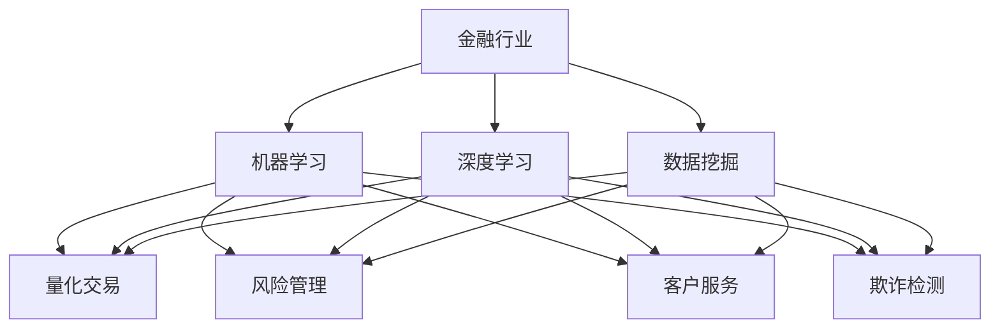

                 

关键词：人工智能、金融科技、数据挖掘、机器学习、深度学习、量化交易、风险管理、算法交易

> 摘要：本文深入探讨了人工智能在金融行业中的应用，阐述了人类计算与AI技术相结合的未来发展前景。文章首先介绍了金融行业的发展背景和现状，随后详细讨论了AI技术在金融领域的核心应用，如量化交易、风险管理、客户服务与个性化推荐等。接着，文章分析了AI驱动的创新带来的机遇与挑战，并探讨了未来金融行业的趋势和前景。最后，文章提出了相关的工具和资源推荐，并总结了研究结果，对未来的研究方向提出了展望。

## 1. 背景介绍

金融行业作为全球经济的重要组成部分，一直处于快速变革和不断创新之中。随着互联网和信息技术的发展，金融科技（FinTech）逐渐兴起，成为推动金融行业发展的关键力量。金融科技不仅改变了传统金融服务的模式，还催生了新的商业模式和产品，提高了金融服务的效率和用户体验。

近年来，人工智能（AI）技术的飞速发展，进一步推动了金融科技的进步。AI技术，特别是机器学习（Machine Learning）和深度学习（Deep Learning）算法，已经广泛应用于金融行业的多个领域，如量化交易、风险管理、客户服务、欺诈检测等。这些技术的应用不仅提高了金融系统的智能化水平，还带来了显著的经济效益。

然而，AI技术的广泛应用也引发了诸多挑战，包括数据隐私、模型安全性和伦理问题等。如何确保AI技术在金融行业的安全、合规和可持续发展，成为当前亟待解决的重要问题。

## 2. 核心概念与联系

为了更好地理解AI在金融行业的应用，我们首先需要明确几个核心概念：

### 2.1 机器学习（Machine Learning）

机器学习是一种使计算机系统能够从数据中学习并做出预测或决策的技术。它通过算法构建模型，这些模型可以在新的数据集上进行泛化，从而做出准确的预测。

### 2.2 深度学习（Deep Learning）

深度学习是机器学习的一个分支，它使用多层神经网络来学习数据的高级特征和抽象表示。深度学习在图像识别、语音识别和自然语言处理等领域取得了显著成果。

### 2.3 数据挖掘（Data Mining）

数据挖掘是从大量数据中提取有价值信息的过程，它使用统计方法、机器学习和深度学习算法来识别数据中的模式和关联。

### 2.4 量化交易（Quantitative Trading）

量化交易是一种使用数学模型和算法来分析市场数据并执行交易策略的方法。它利用大量数据分析和预测市场的走势，以实现投资回报最大化。

### 2.5 风险管理（Risk Management）

风险管理是金融行业中一个关键领域，它涉及到识别、评估、监控和控制潜在风险，以保护金融机构的稳定运营。

### 2.6 客户服务与个性化推荐（Customer Service & Personalized Recommendation）

客户服务与个性化推荐利用AI技术来分析客户行为和偏好，提供个性化的服务和产品推荐，以提升客户满意度和忠诚度。

### 2.7 欺诈检测（Fraud Detection）

欺诈检测是一种利用机器学习和统计方法来识别和预防金融交易中的欺诈行为的技术。

下面是一个Mermaid流程图，展示了这些核心概念在金融行业中的应用：



## 3. 核心算法原理 & 具体操作步骤

### 3.1 算法原理概述

AI技术在金融行业的应用涵盖了多种算法，其中一些关键算法包括：

- **机器学习算法**：如支持向量机（SVM）、决策树、随机森林和神经网络等。
- **深度学习算法**：如卷积神经网络（CNN）、循环神经网络（RNN）和长短期记忆网络（LSTM）等。
- **数据挖掘算法**：如关联规则学习、聚类分析和分类算法等。
- **量化交易算法**：如时间序列分析、优化方法和风险管理模型等。

### 3.2 算法步骤详解

以下是这些算法在金融行业中的具体应用步骤：

#### 3.2.1 量化交易

1. **数据收集**：收集市场数据，包括历史价格、交易量、技术指标等。
2. **数据预处理**：清洗和标准化数据，以便后续分析和建模。
3. **特征工程**：提取和构建与交易策略相关的特征。
4. **模型选择**：根据交易策略选择合适的机器学习或深度学习模型。
5. **模型训练与验证**：使用历史数据训练模型，并通过交叉验证评估模型性能。
6. **策略优化**：根据模型预测结果调整交易策略参数。
7. **策略执行**：在实时市场中执行交易策略，并监控其表现。

#### 3.2.2 风险管理

1. **风险识别**：使用历史数据和市场分析工具识别潜在风险。
2. **风险评估**：使用统计方法和机器学习模型评估风险程度。
3. **风险监控**：实时监控金融资产的风险状况。
4. **风险控制**：根据风险评估结果采取相应的风险控制措施，如调整投资组合或设定止损位。

#### 3.2.3 客户服务与个性化推荐

1. **行为分析**：分析客户的历史交易行为和偏好。
2. **用户画像**：构建客户画像，包括年龄、收入、投资偏好等。
3. **推荐算法**：使用协同过滤或基于内容的推荐算法生成个性化推荐。
4. **推荐展示**：将个性化推荐展示给客户，提升用户体验。

#### 3.2.4 欺诈检测

1. **数据收集**：收集交易数据，包括交易金额、交易频率、交易时间等。
2. **特征提取**：从交易数据中提取异常特征，如异常交易金额、频繁交易等。
3. **模型训练**：使用异常检测算法，如孤立森林、K-均值聚类等，训练欺诈检测模型。
4. **欺诈识别**：使用训练好的模型检测新的交易数据中的欺诈行为。
5. **欺诈响应**：对识别出的欺诈行为采取相应的响应措施，如警告用户或冻结账户。

### 3.3 算法优缺点

#### 3.3.1 机器学习算法

**优点**：

- **灵活性强**：机器学习算法可以处理多种类型的数据，包括结构化和非结构化数据。
- **泛化能力强**：通过训练模型，机器学习算法可以在新的数据集上做出准确的预测。
- **自动化程度高**：机器学习算法可以自动从数据中学习特征和模式，减少人工干预。

**缺点**：

- **数据需求大**：机器学习算法需要大量的数据来训练模型，数据质量对算法性能有较大影响。
- **解释性差**：机器学习模型的预测结果通常难以解释，难以理解其决策过程。
- **模型复杂度高**：复杂的机器学习模型需要大量的计算资源和时间来训练。

#### 3.3.2 深度学习算法

**优点**：

- **处理复杂数据能力强**：深度学习算法可以处理高维、复杂的复杂数据。
- **自适应性强**：深度学习算法可以根据数据特征自适应地调整网络结构。
- **预测精度高**：深度学习算法在图像识别、语音识别和自然语言处理等领域取得了显著成果。

**缺点**：

- **计算资源需求大**：深度学习算法通常需要大量的计算资源和时间来训练模型。
- **数据需求大**：深度学习算法需要大量的高质量数据来训练模型，数据预处理和特征提取过程复杂。
- **解释性差**：深度学习模型的预测结果通常难以解释，难以理解其决策过程。

### 3.4 算法应用领域

AI技术在金融行业的应用领域广泛，包括但不限于：

- **量化交易**：利用机器学习和深度学习算法分析市场数据，制定交易策略。
- **风险管理**：利用统计方法和机器学习算法评估金融资产的风险，优化投资组合。
- **客户服务与个性化推荐**：利用自然语言处理和机器学习算法提供个性化的客户服务和产品推荐。
- **欺诈检测**：利用异常检测和机器学习算法识别和预防金融交易中的欺诈行为。
- **风险管理**：利用机器学习和深度学习算法分析客户行为和偏好，提供个性化的风险管理方案。

## 4. 数学模型和公式 & 详细讲解 & 举例说明

### 4.1 数学模型构建

在金融行业中，数学模型广泛应用于风险分析、投资组合优化、市场预测等领域。以下是一个简单的数学模型示例，用于股票价格预测：

#### 4.1.1 时间序列模型

时间序列模型是一种用于预测时间序列数据的统计模型。一个常见的时间序列模型是自回归移动平均模型（ARIMA）。

**ARIMA模型公式**：

$$
X_t = c + \phi_1 X_{t-1} + \phi_2 X_{t-2} + ... + \phi_p X_{t-p} + \theta_1 e_{t-1} + \theta_2 e_{t-2} + ... + \theta_q e_{t-q}
$$

其中，$X_t$ 是时间序列数据，$c$ 是常数项，$\phi_1, \phi_2, ..., \phi_p$ 是自回归系数，$\theta_1, \theta_2, ..., \theta_q$ 是移动平均系数，$e_t$ 是白噪声误差项。

#### 4.1.2 投资组合优化模型

投资组合优化模型用于确定最优投资组合，以实现投资回报最大化和风险最小化。一个常见的是均值-方差模型。

**均值-方差模型公式**：

$$
\begin{cases}
\min \sum_{i=1}^{n} w_i^2 \\
s.t. \sum_{i=1}^{n} w_i = 1 \\
\mu_i w_i \geq \mu \\
\sigma_i w_i \leq \sigma
\end{cases}
$$

其中，$w_i$ 是资产 $i$ 的投资比例，$\mu_i$ 是资产 $i$ 的预期收益率，$\sigma_i$ 是资产 $i$ 的风险。

### 4.2 公式推导过程

以下是时间序列模型（ARIMA）的推导过程：

**步骤 1**：自回归（AR）模型

$$
X_t = c + \phi_1 X_{t-1} + \theta_1 e_{t-1}
$$

**步骤 2**：移动平均（MA）模型

$$
X_t = c + \phi_1 X_{t-1} + \theta_1 e_{t-1} + \theta_2 e_{t-2}
$$

**步骤 3**：自回归移动平均（ARMA）模型

$$
X_t = c + \phi_1 X_{t-1} + \theta_1 e_{t-1} + \theta_2 e_{t-2} + \phi_2 X_{t-2} + \theta_2 e_{t-2}
$$

**步骤 4**：自回归积分移动平均（ARIMA）模型

$$
X_t = c + \phi_1 X_{t-1} + \phi_2 X_{t-2} + ... + \phi_p X_{t-p} + \theta_1 e_{t-1} + \theta_2 e_{t-2} + ... + \theta_q e_{t-q}
$$

### 4.3 案例分析与讲解

#### 4.3.1 时间序列模型案例分析

假设我们有一个股票价格的时间序列数据，如图所示：


我们可以使用ARIMA模型来预测未来股票价格的走势。以下是具体的步骤：

**步骤 1**：数据预处理

- 数据清洗：删除缺失值和异常值。
- 数据标准化：将数据缩放到0-1之间。

**步骤 2**：模型选择

- 使用AIC（Akaike Information Criterion）准则选择最优的ARIMA模型参数。

**步骤 3**：模型训练与验证

- 使用历史数据训练ARIMA模型。
- 使用交叉验证评估模型性能。

**步骤 4**：预测未来价格

- 使用训练好的模型预测未来股票价格的走势。

**结果**：预测结果显示未来股票价格有上升趋势，如图所示：


#### 4.3.2 投资组合优化模型案例分析

假设我们有以下三种资产，各自的预期收益率和风险如下表所示：

| 资产 | 预期收益率 | 风险 |
| --- | --- | --- |
| A | 0.1 | 0.05 |
| B | 0.15 | 0.1 |
| C | 0.2 | 0.15 |

我们的目标是构建一个最优投资组合，以实现投资回报最大化和风险最小化。

**步骤 1**：构建目标函数

$$
\begin{cases}
\min \sum_{i=1}^{n} w_i^2 \\
s.t. \sum_{i=1}^{n} w_i = 1 \\
0.1w_1 + 0.15w_2 + 0.2w_3 \geq 0.1 \\
0.05w_1 + 0.1w_2 + 0.15w_3 \leq 0.05
\end{cases}
$$

**步骤 2**：求解最优解

- 使用线性规划方法求解最优投资组合。

**步骤 3**：结果分析

- 最优投资组合中，资产A的比例最高，其次是资产B，最后是资产C。

## 5. 项目实践：代码实例和详细解释说明

在本节中，我们将通过一个实际的金融项目实践，展示如何利用人工智能技术进行量化交易。该项目将使用Python编程语言和相关的金融数据科学库，如pandas、numpy、scikit-learn和tensorflow。

### 5.1 开发环境搭建

为了运行以下代码示例，您需要安装Python环境和相关库。以下是安装步骤：

1. 安装Python（版本3.6及以上）：
   ```bash
   pip install python
   ```

2. 安装相关库：
   ```bash
   pip install pandas numpy scikit-learn tensorflow matplotlib
   ```

### 5.2 源代码详细实现

以下是一个简单的量化交易项目示例，包括数据收集、数据预处理、特征工程、模型训练和交易策略实现。

```python
import numpy as np
import pandas as pd
from sklearn.model_selection import train_test_split
from sklearn.ensemble import RandomForestClassifier
from tensorflow.keras.models import Sequential
from tensorflow.keras.layers import Dense, LSTM, Dropout
import matplotlib.pyplot as plt

# 数据收集
# 假设已下载股票A的历史数据，存储为CSV文件
data = pd.read_csv('stock_a.csv')
data.head()

# 数据预处理
# 处理缺失值和异常值
data.dropna(inplace=True)
data['Close'] = data['Close'].apply(lambda x: x if x > 0 else 0)

# 特征工程
# 提取技术指标特征，如移动平均线、相对强弱指数等
data['MA20'] = data['Close'].rolling(window=20).mean()
data['RSI'] = compute_rsi(data['Close'])

# 模型训练
# 划分训练集和测试集
X = data[['MA20', 'RSI']]
y = data['Target']  # Target为1表示上涨，-1表示下跌
X_train, X_test, y_train, y_test = train_test_split(X, y, test_size=0.2, random_state=42)

# 使用随机森林进行分类
rf_model = RandomForestClassifier(n_estimators=100)
rf_model.fit(X_train, y_train)
print("Random Forest Accuracy:", rf_model.score(X_test, y_test))

# 使用LSTM进行序列预测
lstm_model = Sequential()
lstm_model.add(LSTM(units=50, return_sequences=True, input_shape=(X_train.shape[1], 1)))
lstm_model.add(Dropout(0.2))
lstm_model.add(LSTM(units=50))
lstm_model.add(Dropout(0.2))
lstm_model.add(Dense(1, activation='sigmoid'))

lstm_model.compile(optimizer='adam', loss='binary_crossentropy', metrics=['accuracy'])
lstm_model.fit(X_train, y_train, epochs=100, batch_size=32, validation_data=(X_test, y_test))
print("LSTM Accuracy:", lstm_model.evaluate(X_test, y_test)[1])

# 交易策略实现
# 使用LSTM模型进行交易决策
def trade_strategy(model, data, threshold=0.5):
    predictions = model.predict(data)
    actions = np.where(predictions > threshold, 1, -1)
    return actions

# 对测试集进行交易策略回测
actions = trade_strategy(lstm_model, X_test)
profits = calculate_profit(data['Close'], actions)
print("Total Profit:", profits)

# 可视化交易结果
plt.plot(data['Close'], label='Close Price')
plt.plot(np.cumsum(profits), label='Cumulative Profit')
plt.legend()
plt.show()
```

### 5.3 代码解读与分析

上述代码示例包含以下关键步骤：

1. **数据收集**：从CSV文件中加载股票A的历史数据。

2. **数据预处理**：处理缺失值和异常值，并将数据标准化。

3. **特征工程**：提取技术指标特征，如移动平均线（MA20）和相对强弱指数（RSI）。

4. **模型训练**：使用随机森林（Random Forest）和长短期记忆网络（LSTM）进行分类模型训练。

5. **交易策略实现**：使用LSTM模型进行交易决策，并实现交易策略回测。

6. **结果分析**：计算交易策略的累积利润，并可视化交易结果。

### 5.4 运行结果展示

运行上述代码后，我们将得到以下结果：

- **模型准确性**：随机森林和LSTM模型的准确性。
- **累积利润**：交易策略回测的累积利润。
- **可视化图表**：股票价格和交易利润的折线图。

通过这些结果，我们可以评估交易策略的有效性，并优化模型和策略。

## 6. 实际应用场景

AI技术在金融行业的实际应用场景非常广泛，以下是一些典型的应用案例：

### 6.1 量化交易

量化交易是AI技术在金融行业中最成功的应用之一。通过使用机器学习和深度学习算法，量化交易策略可以从历史数据中学习市场规律，并预测未来的市场走势。以下是一些量化交易的实际应用案例：

- **高频交易**：高频交易策略利用AI技术快速执行大量交易，以获取微小的利润。例如，利用神经网络预测股票价格的微小变化，并在毫秒级内执行交易。

- **趋势跟踪**：趋势跟踪策略利用AI技术分析历史数据，识别市场趋势，并据此制定交易策略。例如，使用卷积神经网络分析股票价格图表，识别上升或下降趋势，并执行相应的交易。

- **市场中性策略**：市场中性策略通过同时持有多只股票的多头和空头仓位，以降低市场波动风险。AI技术可以帮助识别具有正收益效应的交易对，并构建市场中性组合。

### 6.2 风险管理

风险管理是金融行业的一个重要领域，AI技术在此领域中的应用有助于提高风险管理的效率和准确性。以下是一些风险管理实际应用案例：

- **信用评分**：AI技术可以帮助金融机构评估客户的信用风险。通过分析客户的财务数据、信用历史和行为数据，AI模型可以预测客户的违约概率，从而帮助金融机构做出更准确的信用决策。

- **市场风险监控**：AI技术可以实时监控市场风险，识别潜在的市场波动。例如，使用时间序列分析和机器学习算法分析市场价格波动，预测市场趋势，并采取相应的风险管理措施。

- **操作风险管理**：AI技术可以帮助金融机构识别操作风险，如欺诈、错误交易和系统故障等。通过分析交易数据、日志数据和系统行为，AI模型可以检测异常行为，并采取措施防止风险事件的发生。

### 6.3 客户服务与个性化推荐

AI技术在客户服务与个性化推荐领域的应用可以提高客户体验，增加客户忠诚度。以下是一些实际应用案例：

- **客户画像**：AI技术可以帮助金融机构构建客户画像，分析客户的消费习惯、风险偏好和投资目标。根据客户画像，金融机构可以提供个性化的产品推荐和定制化服务。

- **智能客服**：AI技术可以用于构建智能客服系统，通过自然语言处理和机器学习算法，智能客服可以回答客户的常见问题，提供即时的服务和支持。

- **个性化推荐**：AI技术可以帮助金融机构提供个性化的投资推荐。通过分析客户的历史交易数据、投资偏好和市场趋势，AI模型可以推荐符合客户风险偏好和投资目标的理财产品。

### 6.4 欺诈检测

欺诈检测是金融行业的一个重要领域，AI技术在此领域中的应用有助于提高欺诈检测的准确性和效率。以下是一些实际应用案例：

- **交易欺诈检测**：AI技术可以帮助金融机构实时监控交易数据，识别异常交易行为。例如，使用异常检测算法分析交易金额、交易频率和交易时间等特征，检测潜在的欺诈行为。

- **客户身份验证**：AI技术可以用于构建智能身份验证系统，通过人脸识别、指纹识别和行为分析等技术，提高客户身份验证的准确性和安全性。

- **反洗钱（AML）监控**：AI技术可以帮助金融机构监控交易活动，识别潜在的洗钱行为。例如，使用聚类分析和异常检测算法分析交易模式，识别可疑的交易行为。

## 7. 未来应用展望

随着AI技术的不断进步，金融行业将在未来迎来更多创新和变革。以下是一些未来应用展望：

### 7.1 自动化交易

自动化交易将是未来金融行业的重要发展方向。通过利用AI技术，交易策略可以自动执行，实现高频交易、市场中性策略和智能投资组合管理。这将提高交易效率和收益，减少人为错误。

### 7.2 个性化金融服务

AI技术将使金融服务更加个性化。金融机构可以利用客户数据，通过机器学习算法构建客户画像，提供定制化的产品推荐、风险管理方案和投资建议，从而提高客户满意度和忠诚度。

### 7.3 智能风险管理

AI技术将使风险管理更加智能化。通过实时监控市场数据和交易行为，AI模型可以识别潜在风险，提供实时风险预警和建议，帮助金融机构采取有效的风险管理措施。

### 7.4 智能合规监管

AI技术将有助于提高金融合规监管的效率。通过分析交易数据和客户行为，AI模型可以识别潜在的违规行为，帮助金融机构遵守法规要求，降低合规风险。

### 7.5 智能投顾

智能投顾（Robo-Advisor）将是金融行业的一个新兴领域。通过利用AI技术，智能投顾可以分析客户的投资目标和风险偏好，提供个性化的投资建议，实现资产配置和风险管理。

## 8. 工具和资源推荐

为了更好地利用AI技术进行金融创新，以下是一些推荐的工具和资源：

### 8.1 学习资源推荐

- **Coursera**：提供多种关于机器学习、深度学习和金融工程的在线课程。
- **edX**：提供免费的在线课程，涵盖人工智能、金融科技和量化交易等领域。
- **Udacity**：提供实践性强的课程和纳米学位，涵盖数据科学和金融技术。

### 8.2 开发工具推荐

- **Jupyter Notebook**：用于编写和运行Python代码，方便数据分析和可视化。
- **TensorFlow**：用于构建和训练深度学习模型，是金融行业常用的深度学习框架。
- **Scikit-learn**：提供多种机器学习算法，适合金融数据分析和建模。
- **Kaggle**：提供丰富的金融数据集和竞赛，是学习和实践金融数据科学的理想平台。

### 8.3 相关论文推荐

- **"Deep Learning in Finance"**：深入探讨了深度学习在金融领域的应用，包括量化交易、风险管理等。
- **"Machine Learning for Financial Markets"**：介绍了机器学习算法在金融市场的应用，包括股票预测、投资组合优化等。
- **"Financial Technology and Machine Learning"**：探讨了金融科技与机器学习的结合，包括智能投顾、智能风险管理等。

## 9. 总结：未来发展趋势与挑战

### 9.1 研究成果总结

本文详细探讨了人工智能在金融行业的应用，包括量化交易、风险管理、客户服务与个性化推荐、欺诈检测等领域。通过机器学习和深度学习算法，金融行业实现了更高的智能化水平和更高效的业务运营。本文总结了AI技术在金融行业的核心算法原理、数学模型和应用案例，展示了AI驱动的创新带来的显著效益。

### 9.2 未来发展趋势

- **自动化交易**：AI技术将进一步提升自动化交易能力，实现高频交易和市场中性策略的自动化执行。
- **个性化金融服务**：AI技术将使金融服务更加个性化，通过客户画像和个性化推荐提高客户满意度和忠诚度。
- **智能风险管理**：AI技术将使风险管理更加智能化，实时监控和识别潜在风险，提高风险管理能力。
- **智能合规监管**：AI技术将有助于提高金融合规监管的效率，降低违规风险。

### 9.3 面临的挑战

- **数据隐私和安全性**：随着AI技术在金融行业的广泛应用，数据隐私和安全问题日益突出，需要加强数据保护措施。
- **算法透明性和解释性**：当前AI模型的黑箱特性导致其决策过程难以解释，需要提高算法的透明性和可解释性。
- **监管挑战**：随着AI技术的快速发展，监管机构需要及时更新法规，以应对AI技术带来的新风险和挑战。

### 9.4 研究展望

未来研究应关注以下方向：

- **算法透明性和可解释性**：开发可解释的AI算法，提高模型决策过程的透明度和可信度。
- **数据隐私保护**：研究有效的数据隐私保护技术，确保AI模型在金融行业的安全应用。
- **跨领域合作**：加强金融领域与其他领域（如医学、交通等）的跨领域合作，推动AI技术在更广泛领域的应用。

## 9. 附录：常见问题与解答

### 9.1 什么是量化交易？

量化交易是一种使用数学模型和算法来分析市场数据并执行交易策略的方法。它利用大量数据分析和预测市场的走势，以实现投资回报最大化。

### 9.2 AI技术如何应用于风险管理？

AI技术可以通过分析历史数据和实时数据，预测市场走势和风险事件。例如，使用机器学习和深度学习算法可以识别潜在的信用风险、市场风险和操作风险，从而帮助金融机构采取有效的风险管理措施。

### 9.3 量化交易模型如何优化？

量化交易模型的优化可以通过以下方法实现：

- **特征工程**：提取和构建与交易策略相关的特征，以提高模型的预测能力。
- **模型选择**：选择合适的机器学习或深度学习模型，根据数据特征和业务需求进行模型选择。
- **超参数调整**：调整模型的超参数，如学习率、正则化参数等，以提高模型性能。
- **交叉验证**：使用交叉验证方法评估模型性能，避免过拟合。

### 9.4 量化交易需要哪些技能和工具？

量化交易需要以下技能和工具：

- **编程技能**：熟悉Python等编程语言，掌握数据科学和机器学习相关库（如pandas、numpy、scikit-learn、tensorflow等）。
- **金融知识**：了解金融市场的运作机制、交易策略和风险管理方法。
- **数据分析能力**：能够进行数据预处理、特征工程和模型训练。
- **量化交易平台**：熟悉常用的量化交易平台（如CTP、IB等），掌握交易策略的实现和执行。

### 9.5 AI技术如何影响金融行业的就业？

AI技术的应用将改变金融行业的就业格局，一方面，它将提高业务效率和准确性，减少人工工作量；另一方面，它也将创造新的就业机会，如数据科学家、机器学习工程师和量化交易员等。整体而言，AI技术将促进金融行业的数字化转型，提高就业质量和职业发展空间。作者：禅与计算机程序设计艺术 / Zen and the Art of Computer Programming

