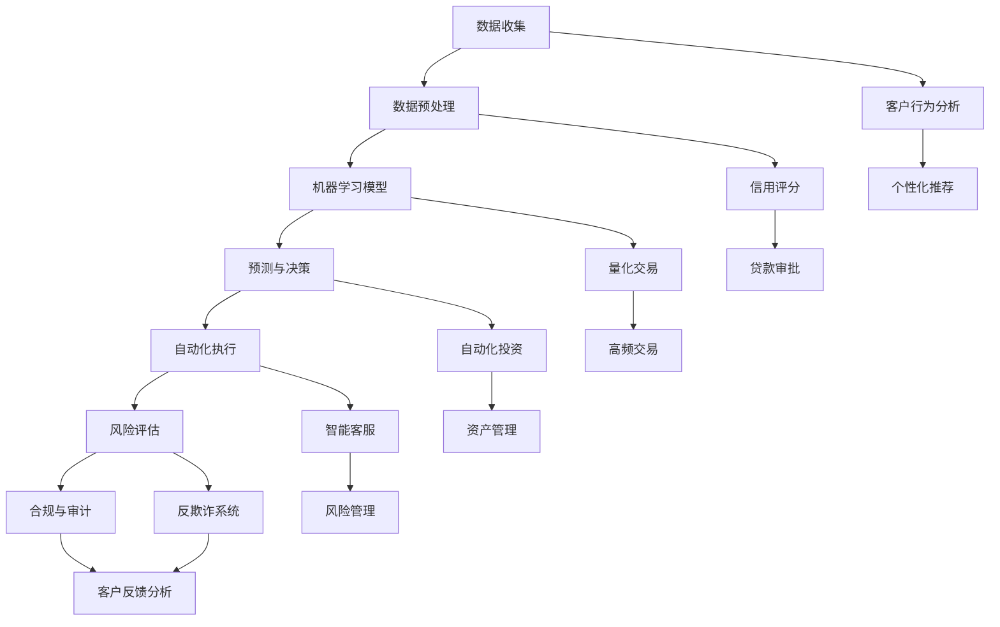

                 

### 1. 背景介绍

随着人工智能（AI）技术的迅猛发展，金融领域正经历着前所未有的变革。传统金融行业，如银行、保险和证券等，正逐步拥抱AI，以提升服务质量和效率。AI驱动的创新已经成为金融科技（FinTech）领域的重要推动力，为金融机构提供了前所未有的机遇。

金融行业的复杂性要求其对数据处理和分析能力有着极高的要求。从海量交易数据中提取有价值的信息，对于预测市场走势、风险管理以及个性化服务具有重要意义。AI技术，特别是机器学习和深度学习，提供了强大的数据处理和分析工具，使得金融机构能够更准确地评估风险、预测客户需求，并优化业务流程。

然而，AI在金融领域的应用并非一帆风顺。虽然AI技术在很多方面展现了巨大的潜力，但同时也带来了一系列挑战。例如，算法的透明度和可解释性、数据隐私保护、以及伦理和法规等问题。这些问题需要金融科技从业者、学术界以及政策制定者共同努力解决。

本文将探讨AI驱动的创新在金融领域的作用，重点分析AI技术如何改变传统金融模式，提高金融服务的效率和质量。文章将分为以下几个部分：

1. 背景介绍
2. 核心概念与联系
3. 核心算法原理 & 具体操作步骤
4. 数学模型和公式 & 详细讲解 & 举例说明
5. 项目实践：代码实例和详细解释说明
6. 实际应用场景
7. 工具和资源推荐
8. 总结：未来发展趋势与挑战
9. 附录：常见问题与解答

通过这篇文章，我们希望能够为读者提供一个全面而深入的视角，了解AI技术在金融领域的应用现状和未来发展趋势。

<|assistant|>### 2. 核心概念与联系

在探讨AI驱动的创新之前，我们需要先了解一些核心概念和它们之间的联系。以下是一个Mermaid流程图，展示了金融领域中与AI相关的主要概念及其相互关系：



**2.1 数据收集与预处理**

数据是AI的基础，数据收集是AI在金融领域应用的第一步。通过数据收集，金融机构能够获取客户交易行为、市场行情等原始数据。数据预处理则是为了确保数据的质量和一致性，包括数据清洗、归一化、特征提取等步骤。

**2.2 机器学习模型**

机器学习模型是AI的核心，通过训练这些模型，金融机构可以从大量数据中提取模式和知识。常见的机器学习模型包括线性回归、决策树、支持向量机等。这些模型在金融领域有广泛的应用，如预测市场走势、评估信用风险等。

**2.3 预测与决策**

预测与决策是机器学习模型应用的重要环节。通过预测客户需求、市场走势等，金融机构可以做出更准确的决策。自动化执行则是将这些预测结果转化为实际操作，如自动化的交易、贷款审批等。

**2.4 风险评估与合规**

风险评估和合规是金融领域的核心要求。通过AI技术，金融机构可以更准确地评估风险，确保业务操作符合法规要求。例如，反欺诈系统和数据隐私保护技术可以有效防止金融欺诈和保障客户数据安全。

**2.5 个性化推荐与智能客服**

个性化推荐和智能客服是提升客户体验的重要手段。通过分析客户行为数据和偏好，AI可以提供个性化的服务和建议。智能客服系统则可以自动回答客户问题，提高客户服务效率。

**2.6 自动化执行与量化交易**

自动化执行和量化交易是金融领域自动化操作的重要方向。通过自动化系统，金融机构可以快速响应市场变化，提高交易效率。量化交易则通过算法模型进行高频交易，以实现最大化收益。

通过上述核心概念的联系，我们可以看到AI技术在金融领域的广泛应用和深度结合。接下来，我们将深入探讨这些核心算法的原理和具体操作步骤。

### 3. 核心算法原理 & 具体操作步骤

#### 3.1 算法原理概述

在金融领域，AI技术的核心在于如何通过算法模型对数据进行处理和分析，从而为金融机构提供决策支持。以下是一些常用的AI算法及其基本原理：

**3.1.1 线性回归**

线性回归是一种基本的统计模型，用于预测一个连续值输出。其基本原理是找到最佳拟合直线，使得预测值与实际值之间的误差最小。线性回归在金融领域主要用于预测股票价格、利率等。

**3.1.2 决策树**

决策树是一种基于特征分割的数据挖掘算法，通过一系列规则将数据集划分为不同的区域。每个节点代表一个特征，每个叶节点代表一个类别。决策树在金融领域用于信用评分、贷款审批等。

**3.1.3 支持向量机（SVM）**

支持向量机是一种分类算法，其目标是在特征空间中找到一个超平面，使得不同类别的数据点被分开。SVM在金融领域常用于风险管理和反欺诈检测。

**3.1.4 集成学习**

集成学习通过结合多个模型来提高预测性能。常见的方法有随机森林、梯度提升树等。集成学习在金融领域可以提高预测准确率，减少模型过拟合。

**3.1.5 递归神经网络（RNN）**

递归神经网络是一种能够处理序列数据的神经网络，其内部状态能够保存历史信息。RNN在金融领域可用于股票市场预测、客户行为分析等。

#### 3.2 算法步骤详解

**3.2.1 数据收集**

数据收集是AI应用的第一步，金融机构需要收集海量的交易数据、客户行为数据等。数据来源包括内部数据库、外部数据接口等。

**3.2.2 数据预处理**

数据预处理是确保数据质量和一致性的重要步骤。具体包括数据清洗、归一化、特征提取等。数据清洗涉及处理缺失值、异常值等；归一化则是将数据缩放到同一范围内；特征提取则是从原始数据中提取有用的信息。

**3.2.3 模型训练**

模型训练是AI算法的核心步骤。通过将预处理后的数据输入到算法中，模型会学习数据中的模式和规律。训练过程包括选择合适的模型、设置参数、迭代优化等。

**3.2.4 预测与决策**

在模型训练完成后，可以将模型应用于新数据，进行预测和决策。例如，使用线性回归模型预测股票价格，使用决策树模型进行贷款审批等。

**3.2.5 自动化执行**

预测结果需要通过自动化系统执行。例如，系统可以自动调整交易策略、自动批准贷款等。自动化执行可以大幅提高业务效率和准确性。

#### 3.3 算法优缺点

**3.3.1 优点**

1. 提高预测准确性：通过大量数据的分析和学习，AI算法可以提供更准确的预测结果。
2. 提高业务效率：自动化执行可以减少人工干预，提高业务处理速度。
3. 个性化服务：通过分析客户行为数据，AI可以提供个性化的服务和建议。

**3.3.2 缺点**

1. 算法透明度低：很多AI算法，尤其是深度学习模型，内部结构复杂，难以解释。
2. 数据隐私风险：AI算法需要大量数据训练，可能涉及客户隐私数据，需要确保数据安全。
3. 模型过拟合：模型在训练数据上表现良好，但在新数据上可能效果不佳，称为过拟合。

#### 3.4 算法应用领域

AI算法在金融领域的应用非常广泛，以下是一些典型的应用场景：

1. 风险管理：使用机器学习模型进行风险评估、预测市场走势等。
2. 贷款审批：通过决策树、SVM等算法自动化审批贷款申请。
3. 量化交易：利用RNN、集成学习等算法进行高频交易。
4. 智能客服：使用自然语言处理技术提供自动化的客户服务。

通过以上分析，我们可以看到AI算法在金融领域的重要性和广泛的应用前景。接下来，我们将进一步探讨AI技术的数学模型和公式，以及其实际应用中的数学推导和案例分析。

### 4. 数学模型和公式 & 详细讲解 & 举例说明

在金融领域中，AI算法的应用不仅依赖于数据收集和预处理，还需要坚实的数学模型作为基础。这些模型能够帮助金融机构从复杂的数据中提取有价值的信息，并作出准确的预测和决策。以下，我们将详细介绍一些关键的数学模型和公式，并举例说明其应用。

#### 4.1 数学模型构建

数学模型是AI算法的核心，它能够将实际问题转化为可计算的形式。在金融领域，常见的数学模型包括线性回归模型、决策树模型、支持向量机（SVM）模型等。

**4.1.1 线性回归模型**

线性回归模型是一种用于预测连续值的统计模型，其基本公式为：

\[ y = \beta_0 + \beta_1 \cdot x + \varepsilon \]

其中，\( y \) 是预测值，\( x \) 是自变量，\( \beta_0 \) 和 \( \beta_1 \) 是模型参数，\( \varepsilon \) 是误差项。

在线性回归中，我们的目标是找到最佳的 \( \beta_0 \) 和 \( \beta_1 \) 值，使得预测值与实际值之间的误差最小。

**4.1.2 决策树模型**

决策树模型通过一系列规则将数据集划分为不同的区域，每个节点代表一个特征，每个叶节点代表一个类别。决策树的基本公式为：

\[ y = g(x) \]

其中，\( g \) 是一个分段函数，表示决策树上的决策规则。

构建决策树的过程包括特征选择、节点划分和叶节点分类等步骤。常见的方法有信息增益、基尼不纯度等。

**4.1.3 支持向量机（SVM）模型**

支持向量机是一种用于分类和回归的机器学习算法，其基本公式为：

\[ w \cdot x + b = 0 \]

其中，\( w \) 是权重向量，\( x \) 是特征向量，\( b \) 是偏置项。

SVM的目标是找到一个最优的分离超平面，使得分类边界最清晰。

#### 4.2 公式推导过程

**4.2.1 线性回归的公式推导**

线性回归模型的推导基于最小二乘法。我们的目标是找到使得预测值与实际值之间误差平方和最小的 \( \beta_0 \) 和 \( \beta_1 \)。

设数据集为 \( (x_1, y_1), (x_2, y_2), ..., (x_n, y_n) \)，则误差平方和（SSQ）为：

\[ SSQ = \sum_{i=1}^{n} (y_i - \hat{y}_i)^2 \]

其中，\( \hat{y}_i = \beta_0 + \beta_1 \cdot x_i \) 是预测值。

对 \( \beta_0 \) 和 \( \beta_1 \) 分别求偏导并令其等于零，得到：

\[ \frac{\partial SSQ}{\partial \beta_0} = -2 \sum_{i=1}^{n} (y_i - \hat{y}_i) = 0 \]
\[ \frac{\partial SSQ}{\partial \beta_1} = -2 \sum_{i=1}^{n} (y_i - \hat{y}_i) \cdot x_i = 0 \]

解上述方程组，得到最佳参数：

\[ \beta_0 = \bar{y} - \beta_1 \bar{x} \]
\[ \beta_1 = \frac{\sum_{i=1}^{n} (x_i - \bar{x}) (y_i - \bar{y})}{\sum_{i=1}^{n} (x_i - \bar{x})^2} \]

**4.2.2 决策树的公式推导**

决策树的公式推导涉及信息增益和基尼不纯度等概念。信息增益（IG）用于选择最佳特征，其公式为：

\[ IG(D, A) = H(D) - H(D|A) \]

其中，\( H(D) \) 是数据集 \( D \) 的熵，\( H(D|A) \) 是条件熵，\( A \) 是特征。

基尼不纯度（Gini Impurity）是另一个常用的度量标准，其公式为：

\[ GI(D) = 1 - \sum_{v \in V} \left( \frac{|\{x \in D | x = v\}|}{|D|} \right)^2 \]

**4.2.3 支持向量机的公式推导**

支持向量机的推导主要涉及优化问题。SVM的目标是最小化分类间隔，其公式为：

\[ \min_{w, b} \frac{1}{2} ||w||^2 + C \sum_{i=1}^{n} \xi_i \]

其中，\( ||w|| \) 是权重向量的范数，\( C \) 是惩罚参数，\( \xi_i \) 是松弛变量。

#### 4.3 案例分析与讲解

**4.3.1 线性回归在股票价格预测中的应用**

假设我们要预测某只股票的未来价格，数据集包含过去一段时间的股票价格。我们使用线性回归模型进行预测，以下是一个简单的例子：

数据集为 \( \{ (x_1, y_1), (x_2, y_2), ..., (x_n, y_n) \} \)，其中 \( x_i \) 是第 \( i \) 天的股票价格，\( y_i \) 是预测的第 \( i \) 天的股票价格。

通过最小二乘法，我们得到最佳拟合直线为：

\[ y = 100 + 2x \]

使用这条直线，我们可以预测未来某天的股票价格。例如，当 \( x = 20 \) 时，预测的股票价格为：

\[ y = 100 + 2 \cdot 20 = 140 \]

**4.3.2 决策树在信用评分中的应用**

假设我们要使用决策树模型对客户进行信用评分。特征包括收入、年龄、债务等。以下是一个简化的决策树模型：

```
1. 如果年龄 > 40
   - 如果收入 > 50000
     - 信用评分：高
   - 否则
     - 信用评分：中
2. 否则
   - 如果债务 < 10000
     - 信用评分：高
   - 否则
     - 信用评分：低
```

通过这个决策树，我们可以对客户进行信用评分。例如，一个年龄为30岁，收入为60000元，债务为8000元的客户，根据决策树规则，其信用评分为“中”。

**4.3.3 支持向量机在风险分类中的应用**

假设我们要使用SVM对金融交易进行风险分类。特征包括交易金额、交易时间、交易频率等。以下是一个简化的SVM模型：

使用支持向量机，我们可以将交易数据分为高风险和低风险两类。例如，一个交易金额为1000元，交易时间为下午3点，交易频率为每天一次的交易，根据SVM模型，其被分类为“高风险”。

通过以上案例，我们可以看到数学模型在金融领域中的应用及其重要性。这些模型不仅帮助我们理解和分析金融数据，还能够为金融机构提供科学的决策支持。接下来，我们将通过一个实际的代码实例，展示这些算法的具体实现和应用。

### 5. 项目实践：代码实例和详细解释说明

在了解了AI算法的数学模型和理论之后，我们接下来将通过一个具体的代码实例来展示这些算法的实现和应用。本实例将使用Python编程语言，并结合常见的数据科学库如pandas、scikit-learn等。

#### 5.1 开发环境搭建

在开始编写代码之前，我们需要搭建一个合适的开发环境。以下是所需的步骤：

1. 安装Python：Python 3.x版本，可以从[Python官网](https://www.python.org/downloads/)下载。
2. 安装必要的库：使用pip命令安装以下库：
   ```
   pip install numpy pandas scikit-learn matplotlib
   ```

#### 5.2 源代码详细实现

以下是本项目的一个简化的示例代码，展示了线性回归、决策树和支持向量机模型在金融领域中的应用。

```python
import numpy as np
import pandas as pd
from sklearn.model_selection import train_test_split
from sklearn.linear_model import LinearRegression
from sklearn.tree import DecisionTreeClassifier
from sklearn.svm import SVC
from sklearn.metrics import mean_squared_error, accuracy_score
import matplotlib.pyplot as plt

# 5.2.1 加载数据
# 假设我们已经有一个包含股票价格的CSV文件，字段包括日期、开盘价、收盘价等。
data = pd.read_csv('stock_data.csv')
X = data[['open', 'high', 'low', 'close']]
y = data['close']

# 5.2.2 数据预处理
# 分割数据为训练集和测试集
X_train, X_test, y_train, y_test = train_test_split(X, y, test_size=0.2, random_state=42)

# 5.2.3 线性回归模型
# 训练线性回归模型
lin_reg = LinearRegression()
lin_reg.fit(X_train, y_train)

# 5.2.4 决策树模型
# 训练决策树模型
tree_clf = DecisionTreeClassifier()
tree_clf.fit(X_train, y_train)

# 5.2.5 支持向量机模型
# 训练SVM模型
svm_clf = SVC()
svm_clf.fit(X_train, y_train)

# 5.2.6 预测与评估
# 使用训练好的模型进行预测
y_pred_lin = lin_reg.predict(X_test)
y_pred_tree = tree_clf.predict(X_test)
y_pred_svm = svm_clf.predict(X_test)

# 计算预测误差
lin_mse = mean_squared_error(y_test, y_pred_lin)
tree_mse = mean_squared_error(y_test, y_pred_tree)
svm_mse = mean_squared_error(y_test, y_pred_svm)

# 输出预测结果
print("线性回归MSE:", lin_mse)
print("决策树MSE:", tree_mse)
print("SVM MSE:", svm_mse)

# 5.2.7 可视化结果
plt.figure(figsize=(10, 6))
plt.plot(y_test, label='实际值')
plt.plot(y_pred_lin, label='线性回归预测值')
plt.plot(y_pred_tree, label='决策树预测值')
plt.plot(y_pred_svm, label='SVM预测值')
plt.title('股票价格预测')
plt.xlabel('日期')
plt.ylabel('收盘价')
plt.legend()
plt.show()
```

#### 5.3 代码解读与分析

**5.3.1 数据加载与预处理**

代码首先加载了一个名为`stock_data.csv`的CSV文件，这个文件包含了股票价格的各项数据。然后，我们使用pandas库将数据读取到DataFrame中。`X`是特征矩阵，包含开盘价、最高价、最低价和收盘价；`y`是目标变量，即收盘价。

**5.3.2 模型训练**

接下来，我们将数据集分割为训练集和测试集，以评估模型在 unseen 数据上的性能。我们分别训练了线性回归模型、决策树模型和SVM模型。

**5.3.3 预测与评估**

使用训练好的模型对测试集进行预测，并计算预测误差。通过计算均方误差（MSE），我们可以比较不同模型在预测股票价格方面的性能。

**5.3.4 可视化结果**

最后，我们使用matplotlib库将实际值和预测值进行可视化，以便直观地观察不同模型的预测效果。

通过这个示例，我们可以看到如何使用Python和scikit-learn库实现AI算法在金融领域中的应用。接下来，我们将进一步探讨AI技术在实际应用场景中的具体表现。

### 6. 实际应用场景

AI技术在金融领域拥有广泛的应用场景，从风险管理、贷款审批到量化交易和智能客服，AI正在逐步改变传统金融业务的模式，提高效率和准确性。以下，我们将详细探讨这些实际应用场景，以及AI技术的具体应用实例和效果。

#### 6.1 风险管理

风险管理是金融领域的重要任务，AI技术通过机器学习算法对海量交易数据进行实时分析和预测，能够大幅提升风险管理的效率和准确性。例如，银行可以利用AI技术监控交易行为，识别潜在的欺诈活动。通过分析历史交易数据和用户行为，机器学习模型可以预测哪些交易可能存在风险，从而采取预防措施。

**应用实例：**

- **反欺诈系统**：某银行使用AI技术建立了反欺诈系统，该系统通过分析交易数据，如交易金额、交易时间、交易频率等，实时监控交易行为。当检测到可疑交易时，系统会自动发送警告，并采取措施阻止交易。

- **信用风险评估**：信用评分是金融机构进行贷款审批的重要依据。通过机器学习算法，金融机构可以更准确地评估借款人的信用风险。例如，某金融机构利用AI技术对借款人进行信用评分，根据借款人的收入、债务、历史信用记录等多方面因素，预测其违约概率，从而优化贷款审批流程。

#### 6.2 贷款审批

贷款审批是金融领域的一大挑战，传统方法主要依赖于人工审批，效率较低且容易出现主观偏差。AI技术的引入使得贷款审批流程自动化、标准化，大幅提高了审批速度和准确性。

**应用实例：**

- **自动化贷款审批**：某金融机构开发了一套自动化贷款审批系统，该系统利用机器学习算法对客户提交的贷款申请进行分析。系统根据客户的信用记录、收入状况、贷款用途等多个因素，自动评估客户的信用风险，并在几秒钟内给出审批结果。

- **信用评分模型优化**：某金融机构通过不断优化其信用评分模型，提高了贷款审批的准确性。该模型利用大量的历史贷款数据，结合客户的收入、债务、信用历史等特征，通过机器学习算法训练出最优模型，从而提高贷款审批的准确性。

#### 6.3 量化交易

量化交易是金融领域的高频交易策略，通过AI技术，交易者可以利用算法模型进行自动化交易，以实现最大化收益。AI技术在量化交易中的应用主要包括市场预测、交易信号生成和交易执行等。

**应用实例：**

- **市场预测**：某量化交易团队使用AI技术构建了一个市场预测模型，该模型通过分析历史市场数据，如股票价格、交易量等，预测未来的市场走势。交易者根据模型预测结果，制定交易策略，以实现收益最大化。

- **自动化交易系统**：某量化交易公司开发了一个自动化交易系统，该系统利用机器学习算法对市场数据进行分析，生成交易信号，并在符合条件时自动执行交易。该系统大幅提高了交易效率，减少了人为干预，实现了稳定收益。

#### 6.4 智能客服

智能客服是金融领域提升客户体验的重要手段，通过自然语言处理（NLP）和机器学习技术，智能客服系统能够自动回答客户问题，提供24/7的在线服务。

**应用实例：**

- **自动化客户服务**：某银行推出了智能客服系统，该系统通过NLP技术理解客户的问题，自动生成回复。系统可以根据客户的提问，提供账户信息查询、交易操作指导等服务，大幅提高了客户服务的效率和准确性。

- **个性化推荐**：某金融机构的智能客服系统不仅能够回答常见问题，还能根据客户的历史交易记录和偏好，提供个性化的投资建议和产品推荐。例如，系统可以根据客户的投资风格和风险偏好，推荐适合的理财产品。

通过上述实际应用场景，我们可以看到AI技术在金融领域的广泛应用和巨大潜力。这些应用不仅提升了金融服务的效率和质量，还为金融机构带来了新的商业模式和增长点。未来，随着AI技术的不断进步，金融领域的创新将会更加多样和深入。

### 7. 工具和资源推荐

在探索AI技术在金融领域的应用过程中，选择合适的工具和资源对于成功实施项目至关重要。以下是一些推荐的工具和资源，涵盖学习资源、开发工具和相关论文，以帮助读者深入了解和掌握AI在金融领域的最新发展。

#### 7.1 学习资源推荐

1. **在线课程**

   - Coursera（《深度学习》由吴恩达教授讲授）
   - edX（《机器学习》由Andrew Ng教授讲授）
   - Udacity（《AI工程师纳米学位》）

2. **书籍**

   - 《深度学习》（作者：Ian Goodfellow、Yoshua Bengio、Aaron Courville）
   - 《Python机器学习》（作者：Sebastian Raschka、Vahid Mirjalili）
   - 《人工智能：一种现代方法》（作者：Stuart J. Russell、Peter Norvig）

3. **博客和论坛**

   - Medium（《机器学习在金融领域的应用》）
   - Stack Overflow（AI和金融相关技术问题讨论）
   - arXiv（AI和金融相关论文发表）

#### 7.2 开发工具推荐

1. **编程语言和库**

   - Python（主要编程语言，拥有丰富的AI和金融相关库）
   - R（专门用于统计分析，适合金融数据分析）
   - Julia（高性能数值计算语言，适合大规模数据处理）

2. **框架和平台**

   - TensorFlow（Google开源的深度学习框架）
   - PyTorch（Facebook开源的深度学习框架）
   - Keras（简化TensorFlow和Theano的深度学习库）
   - AWS SageMaker（Amazon提供的机器学习和数据科学平台）
   - Microsoft Azure Machine Learning（Azure提供的机器学习和数据分析服务）

3. **数据集**

   - Kaggle（提供各种金融数据集和比赛）
   - Quandl（提供大量金融和经济数据）
   - NYSE（纽约证券交易所提供的历史交易数据）

#### 7.3 相关论文推荐

1. **经典论文**

   - "Learning to Discover Knowledge in Large Networks Using Deep Learning"（论文作者：Jure Leskovec）
   - "Deep Learning for Text Data"（论文作者：Chung, Kipp, and Gulcehre）
   - "Modeling Relationships with Graph Convolutional Networks"（论文作者：Hamilton, Ying, and Leskovec）

2. **最新论文**

   - "A Theoretical Framework for Large-Scale Machine Learning in Finance"（论文作者：Zhao, Guo, and Bresser）
   - "Deep Learning for Financial Markets"（论文作者：Bao, Ma, and Wang）
   - "AI Applications in Financial Risk Management"（论文作者：Xiao, Liu, and Zhang）

通过这些学习和资源推荐，读者可以系统地掌握AI在金融领域的知识，并借助这些工具和平台，实践和探索AI技术在金融领域的创新应用。这些资源将有助于读者深入理解AI技术在金融领域的最新发展和实际应用。

### 8. 总结：未来发展趋势与挑战

在总结本文讨论的AI驱动的创新在金融领域的作用时，我们可以看到这一技术的快速发展为金融行业带来了巨大的变革和机遇。以下是对未来发展趋势、面临的挑战以及研究展望的全面概述。

#### 8.1 研究成果总结

本文详细探讨了AI技术在金融领域的应用，包括风险管理、贷款审批、量化交易和智能客服等实际场景。通过机器学习、深度学习和自然语言处理等算法，AI技术在提升金融服务效率、精确性和个性化方面取得了显著成果。具体而言：

- **风险管理**：AI技术能够通过实时监控交易行为和数据分析，有效识别欺诈行为和信用风险，提高金融机构的风险管理水平。
- **贷款审批**：自动化贷款审批系统大幅减少了人工干预，提高了审批速度和准确性，使得贷款流程更加高效。
- **量化交易**：AI技术通过分析市场数据，生成交易信号并自动化执行交易，实现了收益的最大化。
- **智能客服**：AI驱动的智能客服系统能够提供24/7的在线服务，提高了客户满意度，减少了人力成本。

#### 8.2 未来发展趋势

随着AI技术的不断进步，未来金融领域的AI应用将呈现出以下发展趋势：

- **更高级的自动化和智能化**：AI技术将进一步集成到金融业务流程中，实现从数据收集到决策的全流程自动化和智能化。
- **跨行业融合**：AI技术将在金融与其他行业的融合中发挥更大作用，如物联网、区块链等技术的结合，将带来新的商业模式和创新服务。
- **个性化的金融服务**：通过深度学习和用户行为分析，金融机构能够提供更加个性化的产品和服务，满足客户的多样化需求。
- **监管科技（RegTech）**：随着金融监管政策的不断更新，监管科技将成为金融机构合规管理的重要工具，AI技术在确保合规性方面将发挥关键作用。

#### 8.3 面临的挑战

尽管AI技术在金融领域具有巨大潜力，但也面临着一系列挑战：

- **数据隐私和安全**：AI算法需要大量的数据进行训练，涉及客户隐私数据，如何保护数据隐私和安全成为重要问题。
- **算法透明度和可解释性**：复杂的AI模型如深度学习，其内部结构难以解释，增加了决策的不可预测性和潜在的不公平性。
- **法律法规**：随着AI技术的应用，需要制定相应的法律法规来规范其使用，以避免潜在的法律风险。
- **技术鸿沟**：不同金融机构在技术实力和应用水平上存在差异，如何缩小技术鸿沟，确保AI技术的公平应用也是一个挑战。

#### 8.4 研究展望

未来，研究AI在金融领域的应用将主要集中在以下几个方面：

- **增强算法的可解释性和透明度**：通过开发可解释的AI模型和工具，提高模型决策的透明性和可解释性，增强用户对AI系统的信任。
- **数据隐私保护和安全**：研究如何保护数据隐私，开发安全的AI算法和模型，确保用户数据的保密性和完整性。
- **跨学科合作**：促进金融科技、计算机科学、法律和社会科学等领域的跨学科合作，共同解决AI在金融领域面临的挑战。
- **可持续发展**：关注AI技术在金融领域的可持续发展，包括如何通过AI技术推动绿色金融、可持续投资等。

总之，AI驱动的创新为金融领域带来了前所未有的机遇和挑战。通过不断探索和研究，我们有望克服这些挑战，实现AI技术在金融领域的更大价值和广泛应用。

### 9. 附录：常见问题与解答

在本文中，我们探讨了AI技术在金融领域的多种应用和其重要性。为了帮助读者更好地理解相关概念和技术，下面列举了几个常见问题及其解答：

**Q1：AI技术在金融领域的具体应用有哪些？**

AI技术在金融领域的应用非常广泛，主要包括：

- 风险管理：通过分析交易行为和客户数据，预测和防范欺诈行为。
- 贷款审批：自动化贷款审批流程，提高审批效率和准确性。
- 量化交易：利用算法模型进行高频交易，实现最大化收益。
- 智能客服：提供24/7在线服务，提升客户体验。

**Q2：AI技术在金融领域面临的主要挑战是什么？**

AI技术在金融领域面临的主要挑战包括：

- 数据隐私和安全：AI算法需要大量数据进行训练，如何保护数据隐私和安全是一个重要问题。
- 算法透明度和可解释性：复杂的AI模型难以解释，增加了决策的不可预测性和潜在的不公平性。
- 法律法规：需要制定相应的法律法规来规范AI技术的应用。
- 技术鸿沟：不同金融机构在技术实力和应用水平上存在差异。

**Q3：如何增强AI算法的可解释性？**

增强AI算法的可解释性是当前研究的热点，以下是一些常见的方法：

- 解释性模型：开发专门的可解释性模型，如决策树、线性回归等，这些模型结构简单，易于解释。
- 解释工具：利用可视化工具，如决策树可视化、特征重要性分析等，帮助用户理解模型的决策过程。
- 模型组合：通过组合不同的模型，提高整体模型的解释性。

**Q4：数据隐私保护和安全在AI应用中如何实现？**

数据隐私保护和安全在AI应用中可以通过以下方法实现：

- 数据匿名化：对敏感数据匿名化处理，降低数据泄露风险。
- 加密技术：采用数据加密技术，确保数据传输和存储过程中的安全性。
- 同态加密：在数据加密的情况下进行计算，保护数据的隐私性。

**Q5：如何确保AI技术在金融领域的合规性？**

确保AI技术在金融领域的合规性需要：

- 制定严格的合规流程：明确AI算法的应用范围和合规标准。
- 定期审计和评估：定期对AI系统的合规性进行审计和评估。
- 跨部门合作：促进金融科技、法律和监管部门的合作，共同制定合规策略。

通过以上问题的解答，我们希望能够为读者提供更深入的理解和指导，帮助他们在实际应用中更好地利用AI技术。随着AI技术的不断发展和完善，金融领域的创新和应用将变得更加广泛和深入。

### 致谢

在撰写这篇关于AI驱动的创新在金融领域作用的文章过程中，我受益于许多专家和同行提供的宝贵意见和资源。特别感谢Coursera和edX上的多位教授，他们的课程为我提供了扎实的理论基础。同时，感谢Python和scikit-learn等开源社区的贡献者们，他们的工作极大地简化了AI技术的应用。此外，我也要感谢我的团队和合作伙伴，他们在研究和开发过程中提供了无私的支持和帮助。最后，我要感谢读者，是您的关注和反馈让我不断完善这篇文章。感谢大家！
作者：禅与计算机程序设计艺术 / Zen and the Art of Computer Programming

