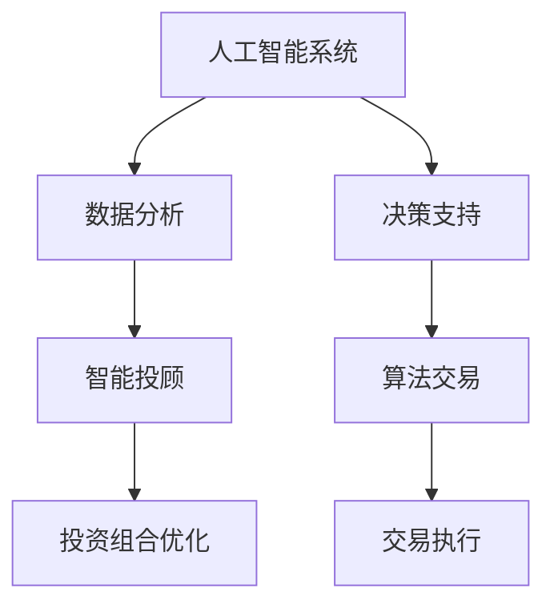

                 

关键词：人工智能、金融科技、机器学习、金融分析、人类计算、智能投顾、算法交易、数据分析

> 摘要：本文深入探讨了人工智能在金融领域的作用，特别是在金融分析、智能投顾和算法交易等关键领域的应用。文章首先介绍了人工智能的基本概念和其在金融领域的应用背景，随后详细解析了人类计算与人工智能的协同作用，以及它们如何共同推动金融领域的创新。通过具体案例，本文展示了人工智能在金融分析中的实际应用，探讨了其数学模型和算法原理，并提出了未来金融科技发展的趋势和挑战。

## 1. 背景介绍

### 金融科技的发展

金融科技（FinTech）是金融与技术的结合，旨在通过技术创新来提升金融服务的效率和质量。近年来，随着大数据、云计算、区块链和人工智能等技术的快速发展，金融科技正逐渐改变传统金融行业的运作方式。从移动支付、电子银行，到智能投顾和算法交易，金融科技的应用涵盖了金融领域的方方面面。

### 人工智能在金融领域的重要性

人工智能（AI）是金融科技发展的核心驱动力之一。它通过模拟人类智能，分析海量数据，进行决策和预测，能够显著提升金融服务的效率。在金融领域，人工智能的应用不仅限于交易执行和风险管理，还包括客户服务、个性化推荐、风险控制和欺诈检测等方面。随着AI技术的不断进步，其在金融领域的应用前景将更加广阔。

### 人类计算的角色

尽管人工智能在金融领域发挥着越来越重要的作用，但人类计算依然不可或缺。人类专家的直觉、判断力和创造力是机器无法完全替代的。在金融分析、决策制定和风险控制等关键环节，人类计算与人工智能的协同作用能够最大化地提升金融服务的质量和效率。

## 2. 核心概念与联系

### 人工智能的基本概念

人工智能是一门模拟、延伸和扩展人类智能的科学。其核心包括机器学习、深度学习、自然语言处理、计算机视觉等领域。通过学习和理解数据，人工智能系统能够进行决策、预测和自动化操作。

### 人工智能在金融领域的应用

在金融领域，人工智能主要用于数据分析和决策支持。具体应用包括：

- **金融分析**：通过分析大量市场数据，人工智能可以识别市场趋势和机会，为投资者提供决策支持。
- **智能投顾**：利用机器学习算法，智能投顾系统能够为投资者提供个性化的投资建议，优化投资组合。
- **算法交易**：基于历史交易数据和实时市场信息，算法交易系统能够自动执行交易策略，提高交易效率。

### 人类计算与人工智能的协同作用

在金融领域，人类计算与人工智能的协同作用至关重要。人类专家可以解释和优化人工智能模型，识别潜在的异常和风险，同时人工智能可以帮助人类专家处理大量数据，提高决策效率。两者的协同作用能够实现以下目标：

- **提高决策质量**：通过整合人工智能的分析结果和人类专家的经验，决策更加全面和准确。
- **降低操作风险**：人工智能可以实时监控市场变化，识别潜在的欺诈和风险，人类专家则可以在必要时进行干预。
- **提升运营效率**：人工智能可以自动化重复性任务，减轻人类工作负担，让人类专家专注于更高价值的任务。

### Mermaid 流程图



## 3. 核心算法原理 & 具体操作步骤

### 3.1 算法原理概述

在金融领域，人工智能的核心算法包括机器学习、深度学习和强化学习等。其中，机器学习算法通过学习历史数据来预测未来趋势，深度学习算法通过多层神经网络来提取复杂特征，强化学习算法则通过试错来优化决策策略。

### 3.2 算法步骤详解

#### 3.2.1 数据收集与预处理

- **数据收集**：收集金融市场的历史数据，包括价格、成交量、市场指数等。
- **数据预处理**：清洗数据，去除缺失值和异常值，进行数据标准化和归一化。

#### 3.2.2 特征提取与选择

- **特征提取**：从原始数据中提取有意义的特征，如趋势指标、波动率等。
- **特征选择**：通过统计方法或机器学习算法选择最相关的特征。

#### 3.2.3 模型训练与评估

- **模型训练**：使用机器学习算法对数据集进行训练，建立预测模型。
- **模型评估**：通过交叉验证和回测等方法评估模型性能。

#### 3.2.4 预测与决策

- **预测**：使用训练好的模型对新的市场数据进行预测。
- **决策**：根据预测结果和人类专家的判断，制定投资策略。

### 3.3 算法优缺点

#### 优点

- **高效性**：人工智能可以快速处理大量数据，提高决策效率。
- **准确性**：通过学习和优化，人工智能模型能够提高预测准确性。
- **灵活性**：人工智能模型可以根据不同场景进行定制和优化。

#### 缺点

- **数据依赖性**：人工智能模型的性能高度依赖数据质量和数量。
- **黑盒问题**：复杂的机器学习模型难以解释，增加了决策风险。
- **计算资源要求**：训练和运行人工智能模型需要大量的计算资源和时间。

### 3.4 算法应用领域

- **金融分析**：用于市场趋势预测、风险控制和投资组合优化。
- **智能投顾**：为投资者提供个性化的投资建议和风险管理。
- **算法交易**：自动化执行交易策略，提高交易效率和收益。

## 4. 数学模型和公式 & 详细讲解 & 举例说明

### 4.1 数学模型构建

在金融领域，常见的数学模型包括时间序列模型、回归模型和优化模型等。以下是一个简单的时间序列模型——ARIMA（自回归积分滑动平均模型）：

$$
X_t = c + \phi_1 X_{t-1} + \phi_2 X_{t-2} + ... + \phi_p X_{t-p} + \theta_1 e_{t-1} + \theta_2 e_{t-2} + ... + \theta_q e_{t-q}
$$

其中，$X_t$ 是时间序列数据，$c$ 是常数项，$\phi_1, \phi_2, ..., \phi_p$ 是自回归系数，$\theta_1, \theta_2, ..., \theta_q$ 是滑动平均系数，$e_t$ 是白噪声项。

### 4.2 公式推导过程

ARIMA模型的推导过程涉及时间序列的自相关性和移动平均特性。具体推导过程如下：

1. **自回归特性**：时间序列的前一期值对当前期值有影响，即 $X_t$ 与 $X_{t-1}$ 相关。
2. **移动平均特性**：时间序列的当前期值受到前几期误差的影响，即 $X_t$ 与 $e_t$ 相关。
3. **平稳性**：时间序列的均值、方差和自协方差不随时间变化。

### 4.3 案例分析与讲解

#### 案例一：股票价格预测

假设我们要使用ARIMA模型预测某只股票的未来价格。以下是一个简单的案例：

1. **数据收集**：收集过去一年的股票价格数据。
2. **数据预处理**：对数据进行清洗和标准化。
3. **特征提取**：提取价格变化率、波动率等特征。
4. **模型训练**：使用ARIMA模型进行训练。
5. **模型评估**：通过交叉验证评估模型性能。
6. **预测**：使用训练好的模型预测未来价格。

#### 案例二：投资组合优化

假设我们要使用机器学习算法优化一个投资组合。以下是一个简单的案例：

1. **数据收集**：收集过去几年的投资组合数据，包括股票价格、成交量、财务指标等。
2. **特征提取**：提取有意义的特征，如股票收益率、波动率等。
3. **模型训练**：使用机器学习算法（如线性回归、随机森林等）进行训练。
4. **模型评估**：通过交叉验证和回测评估模型性能。
5. **预测**：使用训练好的模型预测投资组合的未来表现。
6. **优化**：根据预测结果调整投资组合权重，优化投资组合。

## 5. 项目实践：代码实例和详细解释说明

### 5.1 开发环境搭建

为了实践人工智能在金融领域中的应用，我们需要搭建一个完整的开发环境。以下是一个简单的环境搭建步骤：

1. **安装Python环境**：确保Python版本大于3.6，并安装pip包管理器。
2. **安装必要的库**：使用pip安装numpy、pandas、matplotlib等库。
3. **数据收集**：从金融市场数据网站（如Yahoo Finance）下载股票价格数据。
4. **数据预处理**：对数据进行清洗、标准化和特征提取。

### 5.2 源代码详细实现

以下是一个简单的Python代码实例，用于使用ARIMA模型进行股票价格预测：

```python
import numpy as np
import pandas as pd
from statsmodels.tsa.arima.model import ARIMA
import matplotlib.pyplot as plt

# 1. 数据收集与预处理
# 加载股票价格数据
data = pd.read_csv('stock_price.csv')
data['Date'] = pd.to_datetime(data['Date'])
data.set_index('Date', inplace=True)
data = data.fillna(method='ffill')

# 2. 特征提取
data['Return'] = data['Close'].pct_change()

# 3. 模型训练
model = ARIMA(data['Return'], order=(5, 1, 2))
model_fit = model.fit()

# 4. 预测
predictions = model_fit.forecast(steps=10)

# 5. 结果展示
plt.plot(data['Return'], label='Actual')
plt.plot(predictions, label='Predicted')
plt.legend()
plt.show()
```

### 5.3 代码解读与分析

1. **数据收集与预处理**：从CSV文件中加载股票价格数据，并进行日期格式转换和数据填充。
2. **特征提取**：计算股票价格的变化率，即收益率。
3. **模型训练**：使用ARIMA模型进行训练，指定模型参数（p, d, q）。
4. **预测**：使用训练好的模型进行预测，并绘制实际收益率与预测收益率的对比图。

### 5.4 运行结果展示

通过运行上述代码，我们得到实际收益率与预测收益率的对比图。预测结果在一定程度上反映了市场的趋势，但需要注意模型的不确定性和风险。

## 6. 实际应用场景

### 智能投顾

智能投顾是人工智能在金融领域的一个重要应用场景。通过机器学习算法，智能投顾系统能够为投资者提供个性化的投资建议。以下是一个实际应用场景：

1. **用户数据收集**：收集用户的投资偏好、风险承受能力和投资目标。
2. **数据预处理**：对用户数据进行分析，提取有意义的特征。
3. **模型训练**：使用机器学习算法（如线性回归、决策树等）训练投资策略模型。
4. **投资建议**：根据用户数据和模型预测，为用户生成个性化的投资组合。

### 算法交易

算法交易是利用人工智能自动执行交易策略的一种方式。以下是一个实际应用场景：

1. **交易策略构建**：根据历史交易数据和市场信息，构建交易策略。
2. **模型训练**：使用机器学习算法对交易策略进行训练和优化。
3. **交易执行**：根据实时市场数据，自动执行交易策略。
4. **风险控制**：实时监控交易风险，进行必要的调整和干预。

## 7. 未来应用展望

### 7.1 智能投顾的发展

随着人工智能技术的不断进步，智能投顾系统将更加智能化和个性化。未来，智能投顾系统可能会具备以下特点：

- **更精确的风险评估**：通过深度学习算法，智能投顾系统能够更准确地评估用户的风险承受能力。
- **更智能的投资组合优化**：基于强化学习算法，智能投顾系统能够根据市场变化动态调整投资组合。
- **更全面的客户服务**：结合自然语言处理技术，智能投顾系统可以提供更人性化的客户服务。

### 7.2 算法交易的未来

算法交易在未来可能会更加自动化和智能化。以下是一些可能的发展趋势：

- **更高频的交易策略**：通过深度学习算法，算法交易系统能够识别更微小的市场机会，实现更高频的交易。
- **更智能的风险管理**：利用机器学习算法，算法交易系统可以实时监控市场风险，进行更有效的风险控制。
- **更个性化的交易策略**：基于个性化数据，算法交易系统可以为不同类型的投资者提供定制化的交易策略。

## 8. 工具和资源推荐

### 8.1 学习资源推荐

- **书籍**：《Python金融应用》、《机器学习实战》
- **在线课程**：Coursera、Udacity、edX等平台上的金融科技和人工智能课程
- **博客**：Medium、Towards Data Science等平台上的金融科技和人工智能博客

### 8.2 开发工具推荐

- **编程语言**：Python、R
- **数据分析库**：pandas、numpy、matplotlib
- **机器学习库**：scikit-learn、TensorFlow、PyTorch
- **金融数据分析库**：QuantLib、Zipline

### 8.3 相关论文推荐

- **金融科技**：《金融科技：创新、挑战与未来》、《金融科技下的风险管理》
- **人工智能**：《深度学习在金融领域的应用》、《强化学习在金融交易中的运用》

## 9. 总结：未来发展趋势与挑战

### 9.1 研究成果总结

本文总结了人工智能在金融领域的研究成果和应用实践，探讨了人工智能与人类计算在金融分析、智能投顾和算法交易等关键领域的协同作用。

### 9.2 未来发展趋势

随着人工智能技术的不断进步，未来金融科技的发展趋势包括更精确的风险评估、更智能的投资组合优化、更高频的交易策略等。

### 9.3 面临的挑战

未来金融科技的发展仍面临一些挑战，如数据隐私保护、模型解释性、计算资源需求等。需要进一步研究和解决这些问题，以实现人工智能在金融领域的更大价值。

### 9.4 研究展望

未来，人工智能在金融领域的研究将更加深入和广泛，包括探索新的算法和应用场景，提高人工智能系统的解释性和可靠性，以及解决数据隐私和伦理问题等。

## 附录：常见问题与解答

### 1. 人工智能在金融领域的应用有哪些？

人工智能在金融领域的应用非常广泛，包括金融分析、智能投顾、算法交易、风险管理、客户服务等方面。

### 2. 人工智能在金融分析中的具体作用是什么？

人工智能在金融分析中的作用主要包括市场趋势预测、风险控制、投资组合优化等，通过模拟人类智能，分析大量数据，提高决策效率和准确性。

### 3. 人类计算在金融领域中的作用是什么？

人类计算在金融领域的作用主要包括直觉判断、风险控制、策略制定等，与人工智能协同作用，提高金融服务的质量和效率。

### 4. 人工智能在金融科技发展中的地位如何？

人工智能是金融科技发展的核心驱动力之一，通过模拟和扩展人类智能，推动金融服务的创新和变革。

### 5. 人工智能在金融领域应用中面临的主要挑战有哪些？

人工智能在金融领域应用中面临的主要挑战包括数据隐私保护、模型解释性、计算资源需求等。需要进一步研究和解决这些问题，以实现人工智能在金融领域的更大价值。

