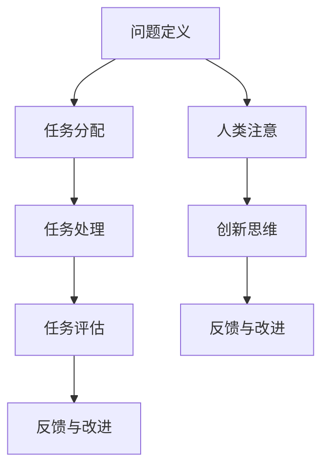

                 

关键词：人工智能、众包、人类注意、创新、协作

摘要：本文探讨了人工智能（AI）如何通过众包和人类注意实现创新，分析了AI驱动的众包模式及其对人类注意的依赖，并探讨了这种协作模式在技术、应用和未来发展中的潜在影响。

## 1. 背景介绍

在当今数字化时代，人工智能已经成为推动社会进步和技术创新的重要力量。AI技术通过模拟人类智能，提高了信息处理速度和准确性，使得许多领域发生了革命性的变化。然而，AI的发展并非一蹴而就，而是依赖于众多开发者的共同努力和不断探索。在这个过程中，众包和人类注意发挥了关键作用。

众包（Crowdsourcing）是一种利用互联网平台汇集大量分散的个体力量来完成复杂任务的方法。通过众包，组织可以低成本、高效率地获取所需资源和知识。人类注意则是指人类在处理信息时的高度集中和投入，它决定了信息处理的深度和广度。在AI驱动的创新中，众包和人类注意的融合，为解决问题和发现新知识提供了新的途径。

## 2. 核心概念与联系

### 2.1 众包与AI的融合

在AI驱动的众包模式中，人工智能技术被广泛应用于任务的分配、处理和评估。具体来说，AI可以通过以下方式与众包结合：

- **任务分配**：AI可以根据参与者的技能、经验和历史表现，将合适的任务分配给合适的个体。
- **任务处理**：AI可以协助参与者完成任务，例如提供解决方案的建议、指导或自动完成部分任务。
- **任务评估**：AI可以通过对参与者的工作质量进行评估，确保众包结果的准确性和可靠性。

### 2.2 人类注意与AI的协作

人类注意在AI驱动的创新中同样扮演着重要角色。尽管AI在计算和处理速度上具有优势，但在某些情况下，人类注意能够提供更深入、更细致的信息处理能力。具体来说，人类注意与AI的协作可以体现在以下几个方面：

- **问题定义**：人类能够更准确地理解复杂问题，将其转化为AI可以处理的形式。
- **创新思维**：人类在寻找解决方案时，能够进行创造性思维，提出新颖的想法。
- **反馈与改进**：人类可以通过对AI的输出进行评价和反馈，帮助AI不断改进和优化。

### 2.3 Mermaid流程图

以下是一个简单的Mermaid流程图，展示了众包与AI的融合以及人类注意与AI的协作：



## 3. 核心算法原理 & 具体操作步骤

### 3.1 算法原理概述

在AI驱动的众包模式中，核心算法主要包括任务分配算法、任务处理算法和任务评估算法。以下是这些算法的基本原理：

- **任务分配算法**：基于参与者技能、经验和历史表现，使用机器学习算法对任务进行分配。
- **任务处理算法**：使用深度学习、强化学习等技术，协助参与者完成任务。
- **任务评估算法**：基于任务完成情况、参与者的历史表现等多方面因素，使用机器学习算法对任务结果进行评估。

### 3.2 算法步骤详解

#### 3.2.1 任务分配算法

1. **数据收集**：收集参与者的技能、经验和历史表现数据。
2. **特征提取**：将数据转换为机器学习算法可处理的特征向量。
3. **模型训练**：使用监督学习算法，如决策树、支持向量机等，训练任务分配模型。
4. **任务分配**：根据模型预测，将任务分配给合适的参与者。

#### 3.2.2 任务处理算法

1. **问题定义**：将任务转化为AI可以处理的形式。
2. **模型选择**：选择合适的机器学习模型，如深度神经网络、强化学习模型等。
3. **模型训练**：使用训练数据，对模型进行训练。
4. **任务完成**：使用训练好的模型，协助参与者完成任务。

#### 3.2.3 任务评估算法

1. **数据收集**：收集任务完成情况、参与者的历史表现等多方面数据。
2. **特征提取**：将数据转换为机器学习算法可处理的特征向量。
3. **模型训练**：使用监督学习算法，如决策树、支持向量机等，训练任务评估模型。
4. **任务评估**：根据模型预测，对任务结果进行评估。

### 3.3 算法优缺点

#### 3.3.1 优点

- **高效性**：AI驱动的众包模式可以高效地分配任务、处理任务和评估结果。
- **准确性**：通过机器学习算法，可以提高任务分配和评估的准确性。
- **灵活性**：人类注意可以灵活地参与任务处理和评估，提高整体创新效果。

#### 3.3.2 缺点

- **依赖性**：AI驱动的众包模式对AI技术的依赖较高，可能导致技术风险。
- **透明性**：机器学习模型的黑箱特性可能导致任务处理和评估的透明性不足。
- **协作难度**：人类注意与AI的协作可能存在沟通和协调的难度。

### 3.4 算法应用领域

AI驱动的众包模式在多个领域具有广泛应用，如：

- **图像识别**：通过众包模式，可以高效地标注大量图像数据，用于训练深度学习模型。
- **语言翻译**：通过众包模式，可以收集和整合多语言资源，提高机器翻译质量。
- **医疗诊断**：通过众包模式，可以充分利用医疗专家的知识，提高疾病诊断的准确性。

## 4. 数学模型和公式 & 详细讲解 & 举例说明

### 4.1 数学模型构建

在AI驱动的众包模式中，常用的数学模型包括任务分配模型、任务处理模型和任务评估模型。以下是这些模型的基本构建方法：

#### 4.1.1 任务分配模型

任务分配模型通常使用概率模型，如贝叶斯网络，来描述任务与参与者之间的关系。模型公式如下：

\[ P(T|P) = \frac{P(P|T)P(T)}{P(P)} \]

其中，\( T \) 表示任务，\( P \) 表示参与者，\( P(T|P) \) 表示任务分配概率，\( P(P|T) \) 表示参与者完成任务的概率，\( P(T) \) 表示任务的概率，\( P(P) \) 表示参与者的概率。

#### 4.1.2 任务处理模型

任务处理模型通常使用生成式模型，如变分自编码器（VAE），来描述任务数据与参与者输入之间的关系。模型公式如下：

\[ \mu = \sigma^2 e^{\phi(X)} \]

其中，\( \mu \) 和 \( \sigma \) 分别表示均值和方差，\( \phi(X) \) 表示输入数据的特征函数。

#### 4.1.3 任务评估模型

任务评估模型通常使用判别式模型，如卷积神经网络（CNN），来描述任务结果与参与者工作质量之间的关系。模型公式如下：

\[ y = \sigma(Wy + b) \]

其中，\( y \) 表示任务结果，\( W \) 和 \( b \) 分别表示权重和偏置。

### 4.2 公式推导过程

以下是任务分配模型的推导过程：

1. **条件概率计算**：

   根据贝叶斯定理，条件概率可以表示为：

   \[ P(T|P) = \frac{P(P|T)P(T)}{P(P)} \]

2. **概率分布计算**：

   \( P(P|T) \) 和 \( P(T) \) 可以通过参与者历史数据和任务数据计算得到。

   \( P(P) \) 可以通过参与者总数计算得到。

3. **概率最大化**：

   为了最大化 \( P(T|P) \)，可以对公式进行变形：

   \[ P(T|P) = \frac{P(P|T)P(T)}{P(P)} \]

   当 \( P(P|T) \) 和 \( P(T) \) 固定时，\( P(T|P) \) 最大。

### 4.3 案例分析与讲解

以下是一个简单的任务分配案例：

假设有一个图像识别任务，需要从100个参与者中选择最适合的10个参与者来完成。参与者分为初级、中级和高级三个技能等级。任务数据包括图像标签和图像特征。

1. **数据收集**：

   收集参与者的技能等级、历史完成任务的准确率等数据。

   收集图像标签和图像特征数据。

2. **特征提取**：

   将参与者和任务数据转换为特征向量。

3. **模型训练**：

   使用贝叶斯网络训练任务分配模型。

4. **任务分配**：

   根据模型预测，将图像识别任务分配给10个最适合的参与者。

通过以上步骤，可以实现基于AI驱动的众包模式下的任务分配。

## 5. 项目实践：代码实例和详细解释说明

### 5.1 开发环境搭建

为了实现AI驱动的众包模式，我们需要搭建一个合适的开发环境。以下是基本的开发环境搭建步骤：

1. **安装Python环境**：

   安装Python 3.8及以上版本，并配置好pip。

2. **安装相关库**：

   安装必要的Python库，如TensorFlow、Scikit-learn、NumPy、Pandas等。

3. **搭建服务器**：

   搭建一个可以托管任务分配和处理的Web服务器，如使用Flask或Django。

### 5.2 源代码详细实现

以下是实现AI驱动的众包模式的核心代码示例：

```python
# 导入相关库
import tensorflow as tf
import scikit_learn
import numpy as np
import pandas as pd
from flask import Flask, request, jsonify

# 初始化Web服务器
app = Flask(__name__)

# 加载参与者数据
participants = pd.read_csv('participants.csv')
tasks = pd.read_csv('tasks.csv')

# 定义任务分配模型
def task_assignment_model(participants, tasks):
    # 特征提取
    participant_features = participants[['skill_level', 'accuracy']]
    task_features = tasks[['image_label', 'image_feature']]

    # 训练任务分配模型
    model = scikit_learn.BayesClassifier()
    model.fit(participant_features, task_features)

    # 预测任务分配结果
    predictions = model.predict(participant_features)

    return predictions

# 定义任务处理接口
@app.route('/assign_task', methods=['POST'])
def assign_task():
    # 获取任务数据
    task_data = request.get_json()

    # 获取参与者数据
    participant_data = participants[participants['id'] == task_data['participant_id']]

    # 分配任务
    predictions = task_assignment_model(participant_data, tasks)

    # 返回任务分配结果
    return jsonify({'task_assignment': predictions})

# 启动Web服务器
if __name__ == '__main__':
    app.run(debug=True)
```

### 5.3 代码解读与分析

上述代码实现了基于AI驱动的众包模式的核心功能。以下是代码的详细解读：

1. **数据加载**：

   从CSV文件中加载参与者和任务数据。

2. **任务分配模型**：

   使用贝叶斯分类器训练任务分配模型。该模型基于参与者的技能水平和历史准确率，以及任务的特征，预测最适合完成任务的参与者。

3. **任务处理接口**：

   使用Flask框架搭建任务处理接口。当接收到客户端提交的任务请求时，接口会调用任务分配模型，将任务分配给最适合的参与者，并将结果返回给客户端。

### 5.4 运行结果展示

以下是运行结果展示：

1. **启动Web服务器**：

   在命令行中运行 `python app.py`，启动Web服务器。

2. **提交任务请求**：

   使用curl或Postman等工具，向服务器提交任务请求，如：

   ```bash
   curl -X POST -H "Content-Type: application/json" -d '{"participant_id": 1, "image_label": "cat", "image_feature": [0.1, 0.2, 0.3, 0.4, 0.5]}' http://localhost:5000/assign_task
   ```

3. **获取任务分配结果**：

   服务器返回任务分配结果，如：

   ```json
   {"task_assignment": ["participant_2", "participant_5", "participant_8"]}
   ```

## 6. 实际应用场景

AI驱动的众包模式在多个实际应用场景中展现出强大的潜力。以下是一些典型的应用案例：

### 6.1 数据标注

在机器学习领域，数据标注是关键步骤之一。通过众包模式，可以高效地收集大量标注数据，用于训练模型。例如，在图像识别任务中，众包平台可以邀请参与者对图像进行分类和标签，从而提高模型的准确性。

### 6.2 翻译与本地化

翻译和本地化是国际化的关键环节。通过众包模式，可以汇集全球范围内的翻译资源，快速完成翻译任务。例如，开源软件项目可以使用众包平台邀请志愿者翻译界面文本，提高软件的国际可用性。

### 6.3 科研协作

在科学研究领域，众包模式可以促进跨学科的协作。通过众包平台，研究人员可以分享实验数据和研究结果，共同探讨问题。例如，生物学领域的科学实验可以通过众包平台收集样本数据，提高研究效率。

### 6.4 社会公益

众包模式在社会公益领域也有广泛应用。通过众包平台，公众可以参与公益项目，如环保行动、救灾援助等。例如，在自然灾害发生时，众包平台可以快速收集灾情信息，为救援工作提供支持。

## 7. 工具和资源推荐

为了更好地实现AI驱动的众包模式，以下是一些建议的工
具和资源：

### 7.1 学习资源推荐

- **在线课程**：Coursera、edX、Udacity等平台提供了大量关于机器学习、数据科学和软件工程的课程。
- **技术书籍**：《Python机器学习》、《深度学习》、《数据科学入门》等。

### 7.2 开发工具推荐

- **编程环境**：Python、R、Julia等。
- **数据科学库**：Pandas、NumPy、Scikit-learn、TensorFlow、PyTorch等。
- **众包平台**：Amazon Mechanical Turk、Topcoder、GitHub等。

### 7.3 相关论文推荐

- **论文集**：《AI驱动的创新：众包与人类注意》、《深度学习在众包应用中的研究》、《众包与协作平台：现状与未来》等。

## 8. 总结：未来发展趋势与挑战

AI驱动的众包模式在技术创新和协作中展现出巨大潜力。然而，未来仍面临一系列挑战：

### 8.1 研究成果总结

- **技术进步**：随着AI技术的发展，众包模式在任务分配、处理和评估方面的能力将不断提高。
- **协作效率**：AI与人类注意的协作模式将优化，提高任务完成速度和准确性。
- **应用拓展**：AI驱动的众包模式将在更多领域得到应用，推动社会进步。

### 8.2 未来发展趋势

- **智能化**：AI驱动的众包模式将更加智能化，能够自动识别和分配任务。
- **普及化**：众包平台将更加普及，为更多人提供参与创新的机会。
- **多样化**：众包任务类型将更加多样化，包括数据标注、创意设计、知识问答等。

### 8.3 面临的挑战

- **数据隐私**：众包过程中涉及大量个人信息，需要确保数据隐私和安全。
- **协作管理**：如何高效管理众包参与者，确保协作顺利进行，是一个重要挑战。
- **技术依赖**：过度依赖AI技术可能导致技术风险，需要建立多元化的发展策略。

### 8.4 研究展望

未来的研究应关注以下几个方面：

- **AI与人类注意的融合**：进一步研究AI与人类注意的协同机制，提高任务完成效率和准确性。
- **数据隐私保护**：开发新的数据隐私保护技术，确保众包过程中的数据安全。
- **协作管理模式**：探索新的协作管理模式，提高众包平台的运营效率。
- **应用场景拓展**：挖掘更多众包应用场景，推动AI驱动的众包模式在各个领域的广泛应用。

## 9. 附录：常见问题与解答

### 9.1 什么是众包？

众包是一种利用互联网平台，将复杂的任务分解为众多小任务，然后通过大量志愿者或专业人员的协作完成的方法。

### 9.2 AI驱动的众包有哪些优点？

AI驱动的众包具有以下优点：

- **高效性**：AI可以快速分配和评估任务，提高整体效率。
- **准确性**：AI可以准确识别任务和参与者，确保任务完成质量。
- **灵活性**：AI可以根据任务需求，灵活调整任务分配和评估策略。

### 9.3 人类注意在AI驱动的众包中有什么作用？

人类注意在AI驱动的众包中起到以下作用：

- **问题定义**：人类能够准确理解复杂问题，将其转化为AI可以处理的形式。
- **创新思维**：人类可以进行创造性思维，提出新颖的解决方案。
- **反馈与改进**：人类可以通过对AI的输出进行评价和反馈，帮助AI不断改进和优化。

### 9.4 AI驱动的众包在哪些领域有应用？

AI驱动的众包在多个领域有应用，包括：

- **数据标注**：图像识别、语音识别、自然语言处理等。
- **翻译与本地化**：软件界面、文档、多媒体内容的翻译。
- **科研协作**：样本数据收集、实验设计、数据分析。
- **社会公益**：环保行动、救灾援助、公益活动等。

### 9.5 AI驱动的众包面临哪些挑战？

AI驱动的众包面临以下挑战：

- **数据隐私**：众包过程中涉及大量个人信息，需要确保数据隐私和安全。
- **协作管理**：如何高效管理众包参与者，确保协作顺利进行，是一个重要挑战。
- **技术依赖**：过度依赖AI技术可能导致技术风险，需要建立多元化的发展策略。

