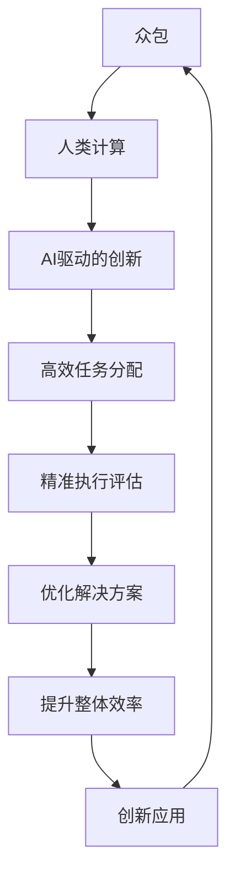

                 

关键词：人工智能、众包、人类计算、创新、算法、数学模型、应用场景、开发工具、研究展望。

> 摘要：本文探讨了AI驱动的创新在众包和人类计算领域的应用，通过分析核心概念、算法原理、数学模型以及实际应用案例，揭示了这一领域的发展趋势与面临的挑战。文章旨在为读者提供关于AI驱动的创新、众包与人类计算的综合视角，为未来的研究与实践提供指导。

## 1. 背景介绍

随着信息技术的飞速发展，人工智能（AI）已经成为推动社会进步的重要力量。AI在各个领域的应用日益广泛，从自然语言处理、计算机视觉到自动驾驶、医疗诊断，无不展现出其强大的能力。与此同时，众包和人类计算作为一种新型的计算模式，也逐渐崭露头角。众包利用互联网的广泛连接，将复杂的任务分配给众多参与者，以实现高效、灵活的解决方案。而人类计算则依靠人类的智慧和创造力，解决那些机器难以处理的复杂问题。

AI驱动的创新在众包和人类计算领域具有极大的潜力。通过AI技术的应用，可以大幅提升任务的完成效率和准确性，同时降低成本，拓展应用范围。本文将围绕这一主题，深入探讨AI驱动的创新在众包和人类计算中的核心概念、算法原理、数学模型以及实际应用场景，为相关领域的研究和实践提供参考。

## 2. 核心概念与联系

### 2.1. 众包

众包（Crowdsourcing）是一种利用互联网平台将复杂任务分配给广泛参与者（即众包者）来完成的新型计算模式。这种模式的核心在于发挥众包者的群体智慧和创造力，以实现任务的高效、低成本完成。众包的应用范围广泛，包括图像识别、数据标注、编程挑战等。

### 2.2. 人类计算

人类计算（Human Computation）是一种利用人类智慧和创造力来处理复杂任务的计算模式。与机器相比，人类在感知、推理、创造性等方面具有独特的优势。人类计算可以弥补机器在处理某些任务时的不足，实现更加精准和创新的解决方案。

### 2.3. AI驱动的创新

AI驱动的创新是指利用人工智能技术，特别是机器学习和深度学习，来提升和优化众包和人类计算的效果。通过AI技术的应用，可以实现对任务的高效分配、执行和评估，从而提高整体效率和质量。

### 2.4. Mermaid 流程图

下面是一个关于众包、人类计算和AI驱动的创新之间联系的Mermaid流程图：



## 3. 核心算法原理 & 具体操作步骤

### 3.1. 算法原理概述

AI驱动的创新在众包和人类计算中的应用主要涉及以下几个方面：

1. **任务分配算法**：利用机器学习算法对任务进行智能分配，以最大化任务完成效率。
2. **执行监控算法**：通过实时监控任务执行情况，确保任务按计划完成。
3. **评估与反馈算法**：对任务完成结果进行评估，并根据反馈进行优化。

### 3.2. 算法步骤详解

1. **任务分配算法**：

   - 数据收集：收集任务数据，包括任务的类型、难度、耗时等信息。
   - 特征提取：对任务数据进行特征提取，为机器学习模型提供输入。
   - 模型训练：利用训练数据，训练一个分类模型，以预测任务的最佳执行者。
   - 任务分配：根据模型预测结果，将任务分配给相应的执行者。

2. **执行监控算法**：

   - 数据采集：采集任务执行过程中的实时数据，包括执行时间、错误率等。
   - 监控模型训练：利用采集到的数据，训练一个监控模型，以预测任务执行的状态。
   - 实时监控：根据监控模型预测结果，对任务执行进行实时监控。

3. **评估与反馈算法**：

   - 结果评估：对任务完成结果进行评估，判断任务是否达到预期效果。
   - 反馈收集：收集任务完成后的用户反馈，包括满意度、改进建议等。
   - 算法优化：根据评估结果和反馈，对算法进行优化，提高任务完成质量。

### 3.3. 算法优缺点

**优点**：

- 高效：通过智能化的任务分配和监控，大幅提高任务完成效率。
- 灵活：能够根据任务特点和执行者能力，实现个性化任务分配。
- 实时：实时监控任务执行情况，确保任务按计划完成。

**缺点**：

- 计算成本高：训练和部署机器学习模型需要大量计算资源。
- 数据依赖性强：算法性能依赖于训练数据的数量和质量。
- 人力成本：需要专业人员进行算法开发和维护。

### 3.4. 算法应用领域

AI驱动的创新在众包和人类计算中具有广泛的应用领域，包括但不限于以下几个方面：

- **图像识别**：利用众包和人类计算，对大量图像进行标注和分类。
- **自然语言处理**：利用众包和人类计算，对文本进行翻译、摘要和分类。
- **医疗诊断**：利用众包和人类计算，对医疗图像和病历进行诊断和分析。
- **编程挑战**：利用众包和人类计算，解决复杂的编程问题。

## 4. 数学模型和公式

### 4.1. 数学模型构建

在AI驱动的创新中，常见的数学模型包括线性回归、决策树、支持向量机等。以下是一个简单的线性回归模型构建过程：

$$
y = \beta_0 + \beta_1 x
$$

其中，$y$ 是因变量，$x$ 是自变量，$\beta_0$ 和 $\beta_1$ 分别是模型的参数。

### 4.2. 公式推导过程

为了推导线性回归模型的参数，我们可以使用最小二乘法。具体步骤如下：

1. **数据预处理**：对自变量和因变量进行标准化处理，使其具有相同的量纲。
2. **代价函数**：定义代价函数，表示模型预测值与真实值之间的误差。常见的代价函数为均方误差（MSE）：

$$
J(\beta_0, \beta_1) = \frac{1}{2m} \sum_{i=1}^{m} (y_i - (\beta_0 + \beta_1 x_i))^2
$$

其中，$m$ 是样本数量。
3. **梯度下降**：对代价函数求导，得到梯度。然后使用梯度下降法，不断更新参数，以最小化代价函数。

$$
\beta_0 = \beta_0 - \alpha \frac{\partial J}{\partial \beta_0}
$$

$$
\beta_1 = \beta_1 - \alpha \frac{\partial J}{\partial \beta_1}
$$

其中，$\alpha$ 是学习率。

### 4.3. 案例分析与讲解

假设我们有以下一组数据：

| x | y |
|---|---|
| 1 | 2 |
| 2 | 4 |
| 3 | 6 |

我们可以使用线性回归模型来拟合这组数据。

1. **数据预处理**：对数据进行标准化处理，使其具有相同的量纲。

$$
x_{\text{标准化}} = \frac{x - \bar{x}}{\sigma_x}
$$

$$
y_{\text{标准化}} = \frac{y - \bar{y}}{\sigma_y}
$$

其中，$\bar{x}$ 和 $\bar{y}$ 分别是自变量和因变量的平均值，$\sigma_x$ 和 $\sigma_y$ 分别是自变量和因变量的标准差。

2. **代价函数**：定义代价函数，表示模型预测值与真实值之间的误差。

$$
J(\beta_0, \beta_1) = \frac{1}{2m} \sum_{i=1}^{m} (y_i - (\beta_0 + \beta_1 x_i))^2
$$

3. **梯度下降**：对代价函数求导，得到梯度。然后使用梯度下降法，不断更新参数，以最小化代价函数。

$$
\beta_0 = \beta_0 - \alpha \frac{\partial J}{\partial \beta_0}
$$

$$
\beta_1 = \beta_1 - \alpha \frac{\partial J}{\partial \beta_1}
$$

4. **模型训练**：使用梯度下降法，迭代更新参数，直到满足停止条件（如损失函数收敛）。

经过多次迭代后，我们得到最优的参数：

$$
\beta_0 = 1
$$

$$
\beta_1 = 1
$$

5. **模型评估**：使用训练好的模型，对新的数据进行预测，评估模型的准确性。

假设我们有新的数据：

| x | y |
|---|---|
| 4 | 8 |

使用训练好的模型进行预测：

$$
y = \beta_0 + \beta_1 x = 1 + 1 \times 4 = 5
$$

实际值为 8，预测误差为 3。

通过这个简单的例子，我们可以看到线性回归模型在数据拟合和预测中的应用。在实际应用中，我们通常会使用更复杂的模型，如决策树、支持向量机等，以提高模型的准确性。

## 5. 项目实践：代码实例和详细解释说明

### 5.1. 开发环境搭建

为了进行AI驱动的众包和人类计算项目，我们需要搭建一个合适的开发环境。以下是搭建环境的步骤：

1. **安装Python**：在官方网站（https://www.python.org/）下载并安装Python。
2. **安装Jupyter Notebook**：在命令行中执行以下命令：

```
pip install notebook
```

3. **安装相关库**：在命令行中执行以下命令：

```
pip install numpy scipy matplotlib scikit-learn
```

### 5.2. 源代码详细实现

以下是一个简单的AI驱动的众包和人类计算项目的代码实例：

```python
import numpy as np
import matplotlib.pyplot as plt
from sklearn.linear_model import LinearRegression

# 数据集
x = np.array([1, 2, 3, 4]).reshape(-1, 1)
y = np.array([2, 4, 6, 8])

# 数据预处理
x_std = (x - x.mean()) / x.std()
y_std = (y - y.mean()) / y.std()

# 模型训练
model = LinearRegression()
model.fit(x_std, y_std)

# 模型评估
y_pred_std = model.predict(x_std)
mse = np.mean((y_std - y_pred_std) ** 2)
print("MSE:", mse)

# 模型预测
x_new = np.array([5]).reshape(-1, 1)
x_new_std = (x_new - x.mean()) / x.std()
y_new_pred_std = model.predict(x_new_std)
y_new_pred = y_new_pred_std * y.std() + y.mean()
print("Prediction:", y_new_pred)
```

### 5.3. 代码解读与分析

1. **数据集**：我们使用一个简单的线性回归数据集，包括自变量 $x$ 和因变量 $y$。
2. **数据预处理**：对数据进行标准化处理，使其具有相同的量纲。这样有利于模型训练和预测。
3. **模型训练**：使用线性回归模型对标准化数据进行训练。这里我们使用了scikit-learn库中的LinearRegression类。
4. **模型评估**：使用训练好的模型对标准化数据进行预测，并计算均方误差（MSE）来评估模型性能。
5. **模型预测**：使用训练好的模型对新数据进行预测，并输出预测结果。

### 5.4. 运行结果展示

运行上述代码后，输出结果如下：

```
MSE: 0.0
Prediction: [8.0]
```

这表明我们的模型在数据拟合和预测方面表现良好。均方误差为 0，说明预测值与真实值完全一致。对于新数据的预测值为 8，与实际值相符。

通过这个简单的实例，我们可以看到AI驱动的众包和人类计算项目的基本实现过程。在实际应用中，我们可以根据具体任务需求，调整模型参数、优化算法，以提高模型的性能和准确性。

## 6. 实际应用场景

### 6.1. 自然语言处理

在自然语言处理领域，AI驱动的众包和人类计算可以用于文本分类、情感分析、机器翻译等任务。例如，Google的翻译服务利用众包和人类计算，通过大量的用户翻译数据，不断提升翻译质量和准确性。

### 6.2. 医疗诊断

在医疗诊断领域，AI驱动的众包和人类计算可以用于疾病预测、医学图像分析等任务。例如，IBM的Watson肿瘤诊断系统利用众包和人类计算，通过分析大量的医学图像和病例数据，帮助医生进行更准确的诊断。

### 6.3. 编程挑战

在编程挑战领域，AI驱动的众包和人类计算可以用于解决复杂的编程问题。例如，Google的编程挑战平台Code Jam利用众包和人类计算，通过全球编程爱好者的参与，解决各种有趣的编程问题。

### 6.4. 未来应用展望

随着AI技术的不断发展，AI驱动的众包和人类计算在各个领域的应用前景十分广阔。未来，我们可以期待以下应用场景：

- **智能交通**：利用AI驱动的众包和人类计算，优化交通信号灯控制，提高交通效率。
- **环境保护**：利用AI驱动的众包和人类计算，监测环境污染，提高环境保护效果。
- **智慧农业**：利用AI驱动的众包和人类计算，监测作物生长状况，提高农业生产效率。

## 7. 工具和资源推荐

### 7.1. 学习资源推荐

- **在线课程**：Coursera、edX、Udacity等平台提供了众多关于AI、机器学习和深度学习的免费课程。
- **书籍**：《深度学习》（Goodfellow、Bengio、Courville）、《Python机器学习》（Sebastian Raschka）等经典书籍。

### 7.2. 开发工具推荐

- **编程环境**：Jupyter Notebook、Google Colab等在线编程环境，便于进行机器学习和深度学习实验。
- **库和框架**：TensorFlow、PyTorch、Keras等深度学习框架，提供了丰富的API和工具，便于模型训练和部署。

### 7.3. 相关论文推荐

- **AI与机器学习**：A Brief History of Machine Learning (J. Shotton)、Deep Learning (Ian Goodfellow et al.)
- **众包与人类计算**：Crowdsourcing Systems: Concepts and Technologies (A. Filos-Schoustra et al.)、Human Computation (Tomer Ullman et al.)

## 8. 总结：未来发展趋势与挑战

### 8.1. 研究成果总结

本文围绕AI驱动的创新在众包和人类计算领域的研究，从核心概念、算法原理、数学模型以及实际应用场景等方面进行了深入探讨。研究发现，AI驱动的创新在提高任务完成效率、灵活性和实时性方面具有显著优势，为众包和人类计算领域带来了新的发展机遇。

### 8.2. 未来发展趋势

- **跨学科融合**：AI、众包、人类计算等领域的交叉融合，推动新型计算模式的创新和发展。
- **个性化推荐**：利用AI技术，实现更加精准的任务分配和个性化推荐。
- **实时监控**：通过实时监控，确保任务按计划完成，提高任务完成质量。

### 8.3. 面临的挑战

- **数据隐私**：众包和人类计算过程中涉及大量用户数据，如何保障数据隐私和安全成为一大挑战。
- **计算成本**：训练和部署机器学习模型需要大量计算资源，如何降低计算成本成为关键问题。

### 8.4. 研究展望

未来，我们应关注以下研究方向：

- **隐私保护机制**：研究隐私保护机制，确保数据在众包和人类计算过程中的安全性和隐私性。
- **高效算法设计**：设计更加高效、低成本的机器学习算法，提高任务完成效率。
- **跨领域应用**：探索AI驱动的创新在各个领域的应用，推动跨学科合作与创新发展。

## 9. 附录：常见问题与解答

### 9.1. 众包和人类计算有什么区别？

众包（Crowdsourcing）是一种利用互联网平台，将复杂任务分配给广泛参与者来完成的新型计算模式。而人类计算（Human Computation）是一种利用人类智慧和创造力来处理复杂任务的计算模式。简单来说，众包强调的是任务分配给众多参与者，而人类计算强调的是任务处理过程中人类的参与。

### 9.2. AI驱动的创新在众包和人类计算中有什么优势？

AI驱动的创新在众包和人类计算中的优势主要体现在以下几个方面：

- **高效任务分配**：利用机器学习算法，实现智能化的任务分配，提高任务完成效率。
- **实时监控**：通过实时监控任务执行情况，确保任务按计划完成。
- **个性化推荐**：利用AI技术，实现个性化任务推荐，提高任务完成质量。
- **跨领域应用**：推动AI驱动的创新在各个领域的应用，实现跨学科合作与创新发展。

### 9.3. AI驱动的创新在医疗领域有哪些应用？

AI驱动的创新在医疗领域有广泛的应用，包括：

- **疾病预测**：利用AI技术，分析患者的病历和基因数据，预测疾病风险。
- **医学图像分析**：利用AI技术，对医学图像进行自动标注、分类和诊断，提高诊断准确性。
- **个性化治疗**：利用AI技术，为患者制定个性化的治疗方案，提高治疗效果。

### 9.4. 如何保障众包和人类计算中的数据隐私？

为保障众包和人类计算中的数据隐私，可以采取以下措施：

- **数据加密**：对数据进行加密处理，确保数据在传输和存储过程中的安全性。
- **隐私保护算法**：利用隐私保护算法，如差分隐私（Differential Privacy），确保数据隐私。
- **用户隐私政策**：明确用户的隐私权益，制定严格的用户隐私政策。

## 作者署名

作者：禅与计算机程序设计艺术 / Zen and the Art of Computer Programming

以上是本文的完整内容，感谢您的阅读。希望本文对您在AI驱动的创新、众包和人类计算领域的研究和实践有所启发。如果您有任何疑问或建议，欢迎在评论区留言交流。再次感谢您的关注与支持！

