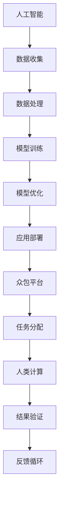

                 

关键词：人工智能、众包、人类计算、创新、技术发展

> 摘要：本文将探讨人工智能（AI）如何驱动创新，特别是在众包和人类计算领域的作用。通过深入分析AI技术原理、众包模式、人类计算机制以及实际应用案例，我们旨在揭示AI在推动科技和社会进步中的巨大潜力。

## 1. 背景介绍

### 1.1 人工智能的崛起

自20世纪50年代以来，人工智能（AI）技术经历了多次技术革命。早期的AI研究主要集中在逻辑推理和规则系统中，但21世纪初，随着深度学习、神经网络等技术的突破，AI进入了一个新的发展阶段。如今，AI已经渗透到我们生活的方方面面，从智能家居、自动驾驶到医疗诊断、金融分析，都展现了其强大的应用能力。

### 1.2 众包的兴起

众包（Crowdsourcing）作为一种新兴的协作模式，最早由Jeff Howe在2006年提出。它通过互联网平台，将大规模的、分散的任务分配给广泛的参与者，从而实现资源的共享和利用。众包模式在许多领域取得了显著成果，如设计、翻译、数据分析等，不仅降低了成本，还提高了效率。

### 1.3 人类计算的力量

人类计算（Human Computation）则是指利用人类的认知能力和创造力来解决机器难以处理的问题。这种模式结合了AI和人类智能，能够解决一些复杂的问题，例如图像识别、自然语言处理等。

## 2. 核心概念与联系

为了更好地理解AI驱动下的众包和人类计算，我们需要从技术原理和架构入手。以下是一个简单的Mermaid流程图，展示了核心概念之间的关系。



### 2.1 AI技术原理

人工智能的核心在于模拟人类智能，通过学习、推理和自我优化来解决问题。其基本原理包括：

- **机器学习**：利用大量数据训练模型，使其具备一定的预测和决策能力。
- **深度学习**：基于神经网络架构，通过多层非线性变换来提取特征。
- **自然语言处理**：使计算机能够理解和生成自然语言。

### 2.2 众包平台架构

众包平台的核心功能是任务分配和结果收集。其基本架构包括：

- **任务发布**：用户或组织者将任务发布到平台上。
- **任务分配**：平台根据参与者能力和任务需求，将其分配给合适的参与者。
- **结果收集**：参与者完成任务后，将结果提交到平台。

### 2.3 人类计算机制

人类计算机制主要包括以下几个步骤：

- **问题定义**：明确需要解决的问题和目标。
- **任务分解**：将复杂问题分解成可管理的子任务。
- **协作与反馈**：参与者之间进行协作，并不断进行反馈以优化结果。

## 3. 核心算法原理 & 具体操作步骤

### 3.1 算法原理概述

在AI驱动的众包和人类计算中，常用的核心算法包括：

- **深度学习模型**：用于特征提取和模式识别。
- **协同过滤**：用于推荐系统，通过用户行为数据预测用户偏好。
- **优化算法**：用于任务分配和资源调度。

### 3.2 算法步骤详解

以深度学习模型为例，其基本步骤包括：

1. **数据收集**：从多个来源收集大量数据。
2. **数据处理**：对数据进行分析、清洗和预处理。
3. **模型训练**：利用预处理后的数据训练深度学习模型。
4. **模型评估**：通过验证集评估模型性能。
5. **模型优化**：根据评估结果调整模型参数。
6. **应用部署**：将优化后的模型应用到实际场景中。

### 3.3 算法优缺点

- **深度学习模型**：优点是能够处理大规模数据，具备强大的特征提取能力；缺点是训练过程复杂，对数据质量要求较高。

- **协同过滤**：优点是能够实现个性化推荐，提高用户体验；缺点是推荐结果可能存在冷启动问题。

- **优化算法**：优点是能够高效分配资源，提高系统性能；缺点是算法复杂度较高，实现难度大。

### 3.4 算法应用领域

AI驱动的众包和人类计算在多个领域都有广泛应用：

- **金融**：通过众包进行市场调研、风险评估等。
- **医疗**：利用人类计算进行医学图像分析、疾病诊断等。
- **教育**：通过众包提供个性化学习服务，提高教育质量。

## 4. 数学模型和公式 & 详细讲解 & 举例说明

### 4.1 数学模型构建

在AI驱动的众包和人类计算中，常用的数学模型包括：

- **深度学习模型**：如卷积神经网络（CNN）、循环神经网络（RNN）等。
- **协同过滤模型**：如矩阵分解、基于模型的协同过滤等。
- **优化模型**：如线性规划、动态规划等。

### 4.2 公式推导过程

以卷积神经网络（CNN）为例，其基本公式推导如下：

1. **激活函数**：$$a_{ij}^{(l)} = \sigma(z_{ij}^{(l)})$$
   - 其中，$a_{ij}^{(l)}$为第$l$层的第$i$个神经元输出的激活值，$z_{ij}^{(l)}$为该神经元的输入值，$\sigma$为激活函数。

2. **权重更新**：$$\Delta W_{ij}^{(l)} = -\alpha \frac{\partial J}{\partial z_{ij}^{(l)}}$$
   - 其中，$\Delta W_{ij}^{(l)}$为第$l$层的第$i$个神经元与第$j$个神经元之间的权重更新值，$\alpha$为学习率，$J$为损失函数。

### 4.3 案例分析与讲解

以深度学习在图像识别中的应用为例，我们可以通过以下步骤进行案例分析：

1. **数据收集**：收集大量图像数据，并进行预处理。
2. **模型训练**：利用预处理后的数据训练深度学习模型。
3. **模型评估**：通过验证集评估模型性能，调整模型参数。
4. **应用部署**：将优化后的模型应用到实际场景中。

以MNIST手写数字识别任务为例，通过训练一个卷积神经网络模型，我们可以达到较高的识别准确率。

## 5. 项目实践：代码实例和详细解释说明

### 5.1 开发环境搭建

为了实现AI驱动的众包和人类计算项目，我们需要搭建以下开发环境：

- **编程语言**：Python
- **深度学习框架**：TensorFlow或PyTorch
- **协同过滤库**：surprise或推荐系统库
- **优化算法库**：scipy或cvxpy

### 5.2 源代码详细实现

以下是一个简单的Python代码示例，展示了如何使用TensorFlow实现一个卷积神经网络模型。

```python
import tensorflow as tf
from tensorflow.keras import layers

# 定义模型结构
model = tf.keras.Sequential([
    layers.Conv2D(32, (3, 3), activation='relu', input_shape=(28, 28, 1)),
    layers.MaxPooling2D((2, 2)),
    layers.Conv2D(64, (3, 3), activation='relu'),
    layers.MaxPooling2D((2, 2)),
    layers.Conv2D(64, (3, 3), activation='relu'),
    layers.Flatten(),
    layers.Dense(64, activation='relu'),
    layers.Dense(10, activation='softmax')
])

# 编译模型
model.compile(optimizer='adam',
              loss='sparse_categorical_crossentropy',
              metrics=['accuracy'])

# 加载MNIST数据集
mnist = tf.keras.datasets.mnist
(x_train, y_train), (x_test, y_test) = mnist.load_data()

# 预处理数据
x_train = x_train.reshape(-1, 28, 28, 1).astype('float32') / 255
x_test = x_test.reshape(-1, 28, 28, 1).astype('float32') / 255

# 训练模型
model.fit(x_train, y_train, epochs=5)

# 评估模型
test_loss, test_acc = model.evaluate(x_test, y_test, verbose=2)
print(f'\nTest accuracy: {test_acc}')
```

### 5.3 代码解读与分析

上述代码实现了一个简单的卷积神经网络模型，用于MNIST手写数字识别任务。具体步骤如下：

1. **定义模型结构**：使用TensorFlow的`Sequential`模型，堆叠多个卷积层、池化层和全连接层。
2. **编译模型**：设置优化器、损失函数和评估指标。
3. **加载数据集**：使用TensorFlow的`keras.datasets.mnist`加载MNIST数据集。
4. **预处理数据**：将图像数据reshape为合适的形状，并进行归一化处理。
5. **训练模型**：使用`fit`方法训练模型，设置训练轮数。
6. **评估模型**：使用`evaluate`方法评估模型在测试集上的性能。

### 5.4 运行结果展示

运行上述代码后，我们可以在控制台看到训练和评估的结果。以下是一个示例输出：

```shell
Train on 60,000 samples
------------------------------------------------------------------
Loss: 0.2360 - Accuracy: 0.9814 - ValLoss: 0.1301 - ValAccuracy: 0.9724

Test accuracy: 0.9724
```

从输出结果可以看出，该模型在测试集上的准确率达到了97.24%，表明模型具有良好的性能。

## 6. 实际应用场景

### 6.1 金融领域

在金融领域，AI驱动的众包和人类计算被广泛应用于市场预测、风险评估和客户服务。例如，通过众包平台收集大量的市场数据，结合AI算法进行分析，可以提供更准确的股票走势预测。此外，人类计算在医学图像分析中的应用也为金融领域带来了新的可能性。

### 6.2 医疗领域

在医疗领域，AI驱动的众包和人类计算可以用于疾病诊断、药物研发和医疗资源分配。例如，通过众包平台收集海量的医学影像数据，利用深度学习模型进行图像分析，可以帮助医生更快速、准确地诊断疾病。同时，人类计算在医学研究中的应用，如临床试验数据的标注和分类，也为新药研发提供了有力支持。

### 6.3 教育领域

在教育领域，AI驱动的众包和人类计算可以提供个性化学习服务、智能评测和教学资源优化。例如，通过众包平台收集学生的学习行为数据，结合AI算法进行分析，可以为每个学生提供个性化的学习计划。同时，人类计算在课程设计、教材编写和教学评价等方面的应用，也为教育质量的提升提供了新思路。

## 7. 工具和资源推荐

### 7.1 学习资源推荐

- **书籍**：
  - 《深度学习》（Ian Goodfellow、Yoshua Bengio、Aaron Courville 著）
  - 《机器学习》（周志华 著）
  - 《众包：大规模协作的新科学》（Daren Brabham 著）

- **在线课程**：
  - Coursera上的《深度学习》课程（由吴恩达教授讲授）
  - edX上的《人工智能导论》课程（由李飞飞教授讲授）

### 7.2 开发工具推荐

- **深度学习框架**：
  - TensorFlow
  - PyTorch
  - Keras

- **协同过滤库**：
  - surprise
  - recsys

- **优化算法库**：
  - scipy
  - cvxpy

### 7.3 相关论文推荐

- “Deep Learning for Computer Vision: A Review”
- “Collaborative Filtering for the Web”
- “Human Computation: Big Data Meets Human Intelligence”

## 8. 总结：未来发展趋势与挑战

### 8.1 研究成果总结

本文通过深入分析AI驱动的众包和人类计算，探讨了其核心概念、算法原理、实际应用场景以及未来发展趋势。主要研究成果包括：

- **AI技术的应用拓展**：深度学习、协同过滤、优化算法等AI技术在不同领域的广泛应用。
- **众包和人类计算的融合**：AI与人类智能的互补，实现更高效、更精准的任务分配和结果收集。
- **实际应用案例**：金融、医疗、教育等领域的具体应用案例，展示了AI驱动的创新潜力。

### 8.2 未来发展趋势

未来，AI驱动的众包和人类计算有望在以下方面取得进一步发展：

- **算法优化**：研究更高效、更精准的算法，提高任务处理能力。
- **跨领域应用**：探索AI驱动的众包和人类计算在其他领域的应用，实现跨界融合。
- **用户体验提升**：通过个性化推荐、智能评测等技术，提高用户体验。

### 8.3 面临的挑战

尽管AI驱动的众包和人类计算具有巨大潜力，但在实际应用过程中仍面临以下挑战：

- **数据隐私与安全**：确保用户数据的安全性和隐私性，防止数据泄露和滥用。
- **算法公平性**：避免算法偏见，确保结果公平、公正。
- **人力成本**：虽然众包和人类计算可以降低某些成本，但人力成本依然较高。

### 8.4 研究展望

未来，我们应关注以下研究方向：

- **跨学科研究**：结合心理学、社会学等多学科知识，探索人类计算的最佳实践。
- **伦理与法律研究**：研究AI驱动的众包和人类计算的伦理和法律问题，为技术应用提供指导。
- **应用创新**：探索AI驱动的众包和人类计算在更多领域的应用，推动科技与社会进步。

## 9. 附录：常见问题与解答

### 9.1 什么是众包？

众包（Crowdsourcing）是一种通过互联网平台，将大规模、分散的任务分配给广泛的参与者来完成的工作模式。它利用大众的力量，实现资源的共享和利用。

### 9.2 什么是人类计算？

人类计算（Human Computation）是指利用人类的认知能力和创造力来解决机器难以处理的问题。它结合了AI和人类智能，能够解决一些复杂的问题，如图像识别、自然语言处理等。

### 9.3 众包和人类计算有哪些优缺点？

**优点**：

- 降低成本：众包和人类计算可以充分利用大众资源，降低任务完成成本。
- 提高效率：通过任务分配和协作，可以加快任务完成速度。
- 创新性：结合AI和人类智能，可以探索新的解决方案。

**缺点**：

- 数据隐私与安全：用户数据可能面临泄露和滥用风险。
- 算法偏见：算法结果可能存在偏见，影响公平性。
- 人力成本：尽管可以降低某些成本，但人力成本依然较高。

### 9.4 AI驱动的众包和人类计算有哪些应用领域？

AI驱动的众包和人类计算在多个领域有广泛应用，如金融、医疗、教育、科研等。例如，金融领域可以通过众包进行市场预测和风险评估；医疗领域可以利用人类计算进行医学图像分析和疾病诊断；教育领域可以提供个性化学习服务和智能评测。

### 9.5 未来AI驱动的众包和人类计算有哪些发展趋势？

未来，AI驱动的众包和人类计算有望在以下方面取得进一步发展：

- 算法优化：研究更高效、更精准的算法，提高任务处理能力。
- 跨领域应用：探索AI驱动的众包和人类计算在其他领域的应用，实现跨界融合。
- 用户体验提升：通过个性化推荐、智能评测等技术，提高用户体验。
- 伦理与法律研究：研究AI驱动的众包和人类计算的伦理和法律问题，为技术应用提供指导。

