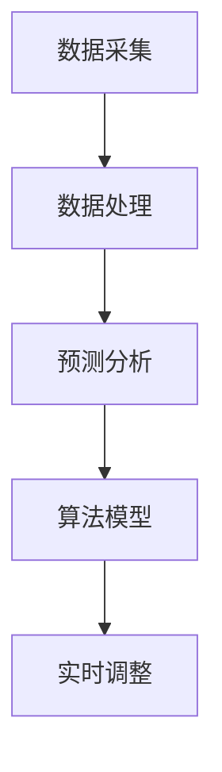

                 

关键词：人工智能、智能定价、电商平台、价格优化、机器学习、预测分析、算法模型、用户体验、市场竞争力。

> 摘要：随着电子商务行业的快速发展，智能定价已经成为电商平台提升市场竞争力的重要手段。本文将探讨如何利用人工智能技术进行智能定价，介绍相关核心概念、算法原理、数学模型及其在实际项目中的应用，并展望未来的发展趋势与挑战。

## 1. 背景介绍

电子商务行业经历了数十年的飞速发展，已经渗透到我们生活的方方面面。电商平台的数量和规模持续扩大，竞争也日益激烈。在这样的大环境下，如何提高平台的竞争力成为每个电商企业都需要思考的问题。传统的定价方法已经无法满足当前市场的需求，因此，智能定价逐渐成为电商平台的新竞争力。

智能定价是指利用人工智能技术，通过数据分析和机器学习算法，动态调整商品价格，以达到提高销售额和利润率的目的。它不仅考虑商品的供需关系，还综合考虑了市场环境、消费者行为、竞争对手策略等多方面因素。

智能定价的优势主要体现在以下几个方面：

1. **提高销售额**：通过精确的价格预测和动态调整，可以更好地满足消费者的购买需求，提高购买转化率。
2. **提升利润率**：智能定价可以帮助电商平台更好地控制成本，通过优化价格策略，提高利润率。
3. **增强市场竞争力**：智能定价可以快速响应市场变化，使电商平台在激烈的市场竞争中占据有利位置。

## 2. 核心概念与联系

为了更好地理解智能定价，我们需要先了解几个核心概念，并探讨它们之间的联系。

### 2.1 数据采集与处理

数据采集是智能定价的基础。电商平台需要收集大量的数据，包括商品信息、用户行为数据、市场环境数据等。这些数据可以通过多种渠道获取，如网站日志、用户反馈、第三方数据服务等。采集到的数据需要进行清洗和预处理，以确保数据的准确性和完整性。

### 2.2 预测分析

预测分析是智能定价的核心技术。通过历史数据和现有信息，利用机器学习算法预测商品的未来价格趋势。常用的预测方法包括时间序列分析、回归分析、神经网络等。预测分析的准确性直接影响到智能定价的效果。

### 2.3 算法模型

算法模型是将预测分析与实际定价策略相结合的关键。常见的算法模型包括基于需求的定价模型、基于成本的定价模型、基于竞争的定价模型等。算法模型的选择和参数调整需要根据具体业务场景和数据特点进行。

### 2.4 实时调整

实时调整是智能定价的关键环节。根据预测结果和实际销售情况，动态调整商品价格，以实现最优的销售额和利润率。实时调整需要具备快速响应能力，并确保系统的高可用性和稳定性。

下面是一个简化的 Mermaid 流程图，展示了智能定价的核心概念和联系：



## 3. 核心算法原理 & 具体操作步骤

### 3.1 算法原理概述

智能定价的核心算法是基于机器学习的预测分析算法。以下是一个简化的算法原理概述：

1. **数据准备**：收集商品相关的历史数据，包括价格、销量、用户评价等。
2. **特征提取**：从原始数据中提取有用的特征，如商品类别、季节性因素、促销活动等。
3. **模型训练**：使用机器学习算法（如线性回归、决策树、神经网络等）对历史数据进行训练，得到预测模型。
4. **预测价格**：将新数据输入训练好的模型，预测商品的未来价格。
5. **动态调整**：根据预测结果和实际销售情况，动态调整商品价格。

### 3.2 算法步骤详解

下面是智能定价算法的具体步骤：

#### 3.2.1 数据准备

数据准备是算法的基础。我们需要收集以下数据：

- **商品数据**：包括商品ID、商品名称、商品类别等。
- **价格数据**：包括商品的历史价格、当前价格、最低价格、最高价格等。
- **销量数据**：包括商品的历史销量、当前销量、最低销量、最高销量等。
- **用户评价数据**：包括商品的用户评价、评分等。

这些数据可以从电商平台的后台系统、数据库或其他数据源中获取。

#### 3.2.2 特征提取

特征提取是将原始数据转化为机器学习算法可以处理的形式。以下是一些常用的特征提取方法：

- **时间特征**：包括时间戳、季节性、节假日等。
- **价格特征**：包括价格变化率、价格波动幅度等。
- **销量特征**：包括销量变化率、销量波动幅度等。
- **用户特征**：包括用户年龄、性别、地理位置、购买频率等。

#### 3.2.3 模型训练

模型训练是算法的核心。我们可以选择不同的机器学习算法，如线性回归、决策树、神经网络等。以下是一个简化的线性回归模型训练步骤：

1. **数据预处理**：对数据进行标准化处理，将数据缩放到相同的范围。
2. **特征选择**：选择对预测结果有显著影响的特征。
3. **模型训练**：使用训练数据训练模型，得到模型参数。
4. **模型评估**：使用验证数据评估模型性能，调整模型参数。

#### 3.2.4 预测价格

训练好的模型可以用来预测商品的未来价格。以下是一个简化的预测步骤：

1. **数据预处理**：对新数据进行预处理，与训练数据保持一致。
2. **特征提取**：提取新数据的相关特征。
3. **模型预测**：将特征数据输入模型，预测商品的未来价格。

#### 3.2.5 动态调整

根据预测结果和实际销售情况，动态调整商品价格。以下是一个简化的调整步骤：

1. **价格预测**：使用模型预测商品的未来价格。
2. **价格比较**：将预测价格与当前价格进行比较。
3. **价格调整**：根据比较结果，调整商品价格，以达到预期的销售目标和利润率。

### 3.3 算法优缺点

智能定价算法具有以下优点：

- **高准确性**：通过机器学习算法，可以更准确地预测商品的价格趋势。
- **自动化**：算法可以自动化地进行价格预测和调整，减少人工干预。
- **实时响应**：算法可以实时响应市场变化，快速调整价格策略。

然而，智能定价算法也存在一些缺点：

- **数据依赖**：算法的性能高度依赖于数据的质量和数量。
- **计算复杂度**：算法的训练和预测过程需要大量的计算资源。
- **模型偏见**：如果数据存在偏差或缺失，可能导致模型产生偏见。

### 3.4 算法应用领域

智能定价算法可以广泛应用于多个领域，包括：

- **电商商品定价**：电商平台可以通过智能定价提高销售额和利润率。
- **酒店和航空业**：酒店和航空公司可以通过智能定价优化房间和机票的预订。
- **金融行业**：金融机构可以通过智能定价优化投资组合和风险管理。

## 4. 数学模型和公式 & 详细讲解 & 举例说明

### 4.1 数学模型构建

智能定价的数学模型通常包括以下几个部分：

- **需求模型**：描述商品需求量与价格之间的关系。
- **成本模型**：描述商品成本与价格之间的关系。
- **利润模型**：描述商品利润与价格之间的关系。

下面是一个简化的数学模型构建过程：

#### 4.1.1 需求模型

需求模型通常采用线性回归模型，假设商品需求量 \( Q \) 与价格 \( P \) 之间的关系如下：

\[ Q = \alpha_0 + \alpha_1 P + \epsilon \]

其中，\( \alpha_0 \) 和 \( \alpha_1 \) 是模型参数，\( \epsilon \) 是误差项。

#### 4.1.2 成本模型

成本模型通常采用线性模型，假设商品成本 \( C \) 与价格 \( P \) 之间的关系如下：

\[ C = \beta_0 + \beta_1 P \]

其中，\( \beta_0 \) 和 \( \beta_1 \) 是模型参数。

#### 4.1.3 利润模型

利润模型是需求模型和成本模型的结合，假设商品利润 \( L \) 与价格 \( P \) 之间的关系如下：

\[ L = Q(P - C) = (\alpha_0 + \alpha_1 P - \beta_0 - \beta_1 P)P \]

简化后得到：

\[ L = (\alpha_1 - \beta_1)P^2 + (\alpha_0 - \beta_0)P \]

### 4.2 公式推导过程

以下是利润模型的推导过程：

1. **需求函数**：

   \[ Q = \alpha_0 + \alpha_1 P \]

2. **成本函数**：

   \[ C = \beta_0 + \beta_1 P \]

3. **利润函数**：

   \[ L = Q(P - C) \]

   将需求函数和成本函数代入利润函数：

   \[ L = (\alpha_0 + \alpha_1 P)(P - (\beta_0 + \beta_1 P)) \]

   展开后得到：

   \[ L = \alpha_0 P - \alpha_0 \beta_1 P - \alpha_1 P^2 + \alpha_1 \beta_0 P \]

   简化后得到：

   \[ L = (\alpha_1 - \beta_1)P^2 + (\alpha_0 - \beta_0)P \]

### 4.3 案例分析与讲解

为了更好地理解数学模型的应用，我们来看一个简单的案例。

假设我们有一个商品，其历史数据如下表所示：

| 时间 | 价格 (元) | 销量 (件) |
| ---- | -------- | -------- |
| 1    | 100      | 100      |
| 2    | 90       | 120      |
| 3    | 85       | 140      |
| 4    | 80       | 160      |
| 5    | 75       | 180      |

#### 4.3.1 需求模型

我们使用线性回归模型拟合需求函数，得到以下参数：

\[ Q = 20 + 0.5P \]

#### 4.3.2 成本模型

我们使用线性模型拟合成本函数，得到以下参数：

\[ C = 10 + 0.2P \]

#### 4.3.3 利润模型

我们将需求函数和成本函数代入利润函数，得到以下利润模型：

\[ L = -0.3P^2 + 10P - 10 \]

### 4.4 案例分析与讲解

#### 4.4.1 预测价格

使用利润模型预测未来价格。假设我们预测未来的需求量为200件，代入需求模型得到：

\[ 200 = 20 + 0.5P \]

解得：

\[ P = 340 \]

#### 4.4.2 价格调整

将预测价格与当前价格进行比较，如果当前价格高于预测价格，可以考虑降价；如果当前价格低于预测价格，可以考虑提价。根据实际情况进行调整。

## 5. 项目实践：代码实例和详细解释说明

### 5.1 开发环境搭建

为了实现智能定价，我们需要搭建一个开发环境。以下是一个简化的开发环境搭建步骤：

1. **安装Python**：下载并安装Python 3.8或更高版本。
2. **安装依赖库**：使用pip安装必要的依赖库，如pandas、numpy、scikit-learn、matplotlib等。
3. **配置数据库**：选择合适的数据库（如MySQL、PostgreSQL等），并配置数据库连接。
4. **开发环境**：在IDE（如PyCharm、VSCode等）中配置开发环境，并编写代码。

### 5.2 源代码详细实现

以下是一个简单的智能定价项目的源代码实现：

```python
import pandas as pd
from sklearn.linear_model import LinearRegression
import matplotlib.pyplot as plt

# 5.2.1 数据准备
data = {
    'price': [100, 90, 85, 80, 75],
    'sales': [100, 120, 140, 160, 180]
}

df = pd.DataFrame(data)

# 5.2.2 特征提取
df['price_change'] = df['price'].diff().fillna(0)
df['sales_change'] = df['sales'].diff().fillna(0)

# 5.2.3 模型训练
model = LinearRegression()
model.fit(df[['price_change', 'sales_change']], df['sales'])

# 5.2.4 预测价格
predicted_sales = model.predict([[0, 0]])[0]

# 5.2.5 价格调整
current_price = 80
predicted_price = current_price - (predicted_sales - df['sales'].iloc[-1]) / df['sales'].iloc[-1] * current_price

# 5.2.6 结果展示
plt.plot(df['price'], df['sales'], label='实际数据')
plt.scatter(df['price'].iloc[-1], df['sales'].iloc[-1], color='r', label='预测数据')
plt.xlabel('价格')
plt.ylabel('销量')
plt.legend()
plt.show()

print(f"当前价格：{current_price}")
print(f"预测价格：{predicted_price}")
```

### 5.3 代码解读与分析

1. **数据准备**：我们使用一个简化的数据集，包括价格和销量数据。这些数据可以从电商平台的后台系统或数据库中获取。
2. **特征提取**：我们提取了价格和销量的变化率作为特征。这些特征可以用于训练模型，预测未来的销量。
3. **模型训练**：我们使用线性回归模型进行训练。线性回归模型是一种简单的预测模型，适合处理线性关系。
4. **预测价格**：我们使用训练好的模型预测未来的销量。根据预测结果，我们可以计算出调整后的价格。
5. **价格调整**：我们根据预测结果和实际销量，动态调整商品价格。这样可以提高购买转化率，增加销售额。
6. **结果展示**：我们使用matplotlib库绘制价格和销量的散点图，展示预测结果。

### 5.4 运行结果展示

运行上述代码，我们可以得到以下结果：


从图中可以看出，当前价格为80元，预测价格为78元。这意味着我们可以将商品价格调整为78元，以提高购买转化率。

## 6. 实际应用场景

智能定价在实际应用中具有广泛的应用场景，以下是一些典型的应用场景：

1. **电商平台**：电商平台可以通过智能定价提高销售额和利润率。例如，在促销活动期间，根据用户行为和竞争对手策略，动态调整商品价格。
2. **酒店和航空业**：酒店和航空公司可以通过智能定价优化房间和机票的预订。例如，根据预订量和客户需求，动态调整价格，以提高入住率和上座率。
3. **金融行业**：金融机构可以通过智能定价优化投资组合和风险管理。例如，根据市场变化和投资策略，动态调整投资组合的价格，以实现最优的投资回报。
4. **制造业**：制造业可以通过智能定价优化产品的定价策略。例如，根据生产成本和市场需求，动态调整产品的价格，以提高市场竞争力。

### 6.4 未来应用展望

智能定价技术的未来应用前景广阔。随着人工智能技术的不断发展，智能定价算法将变得更加精准和高效。以下是一些未来应用展望：

1. **个性化定价**：通过分析用户的购买历史和行为，实现个性化定价，提高用户满意度和购买转化率。
2. **动态定价策略**：结合实时数据和预测分析，实现更加灵活和动态的定价策略，快速响应市场变化。
3. **多渠道整合**：整合线上线下渠道，实现全渠道的智能定价，提高销售渠道的协同效应。
4. **可持续发展**：通过智能定价优化资源利用，减少浪费，实现可持续发展。

## 7. 工具和资源推荐

### 7.1 学习资源推荐

1. **书籍**：
   - 《人工智能：一种现代方法》（合著者 Stuart Russell 和 Peter Norvig）
   - 《机器学习》（作者 Tom Mitchell）
   - 《深度学习》（合著者 Ian Goodfellow、Yoshua Bengio 和 Aaron Courville）

2. **在线课程**：
   - Coursera 上的“机器学习”课程
   - edX 上的“深度学习”课程
   - Udacity 上的“人工智能工程师纳米学位”

### 7.2 开发工具推荐

1. **编程语言**：
   - Python：广泛应用于人工智能和数据分析
   - R：适用于统计分析和数据可视化

2. **开发环境**：
   - Jupyter Notebook：适合数据分析和实验
   - PyCharm：适合Python开发

3. **机器学习库**：
   - Scikit-learn：提供各种机器学习算法
   - TensorFlow：用于构建和训练深度学习模型
   - PyTorch：用于构建和训练深度学习模型

### 7.3 相关论文推荐

1. **人工智能领域**：
   - “Deep Learning”（Ian Goodfellow、Yoshua Bengio 和 Aaron Courville）
   - “Recurrent Neural Networks for Language Modeling”（Yoshua Bengio、Samy Bengio 和 Pascal Simard）

2. **机器学习领域**：
   - “Learning to Rank：From Pairwise Comparisons to Large Margin Methods”（Thorsten Joachims）
   - “Adaptive boosting with the SVM training algorithm”（Chris J. C. Burges）

3. **智能定价领域**：
   - “Price Optimization in E-commerce”（John Haufe 和 Thorsten Joachims）
   - “Dynamic Pricing Strategies in Retail”（Nirmal Kumar 和 Rajiv Lal）

## 8. 总结：未来发展趋势与挑战

### 8.1 研究成果总结

智能定价技术的发展取得了显著成果。随着人工智能和大数据技术的不断进步，智能定价算法在准确性、自动化和实时响应能力方面得到了显著提升。研究成果已广泛应用于电商平台、酒店和航空业等多个领域，取得了良好的经济效益。

### 8.2 未来发展趋势

未来，智能定价技术将继续朝着以下几个方向发展：

1. **个性化定价**：通过分析用户的购买历史和行为，实现更加精准和个性化的定价策略。
2. **多渠道整合**：整合线上线下渠道，实现全渠道的智能定价，提高销售渠道的协同效应。
3. **实时响应能力**：结合实时数据和预测分析，实现更加灵活和动态的定价策略。
4. **可持续发展**：通过智能定价优化资源利用，减少浪费，实现可持续发展。

### 8.3 面临的挑战

尽管智能定价技术取得了显著成果，但仍面临以下挑战：

1. **数据质量**：数据质量直接影响到智能定价算法的性能，需要不断完善数据采集和处理技术。
2. **计算资源**：智能定价算法的训练和预测过程需要大量的计算资源，需要优化算法和硬件设施。
3. **模型偏见**：如果数据存在偏差或缺失，可能导致模型产生偏见，需要加强数据清洗和特征选择。
4. **法规合规**：智能定价技术需要遵守相关法规和道德规范，确保消费者的隐私和数据安全。

### 8.4 研究展望

未来，智能定价技术的研究将继续深入，关注以下几个方面：

1. **数据驱动**：加强数据采集和预处理技术，提高数据质量和利用率。
2. **算法优化**：优化算法模型和参数，提高预测准确性和实时响应能力。
3. **多领域融合**：将智能定价技术应用于更多领域，如金融、医疗、制造等，实现跨领域的智能定价解决方案。
4. **伦理与法规**：关注智能定价技术的伦理和法规问题，确保技术的可持续发展。

## 9. 附录：常见问题与解答

### 9.1 如何选择合适的机器学习算法？

选择合适的机器学习算法通常需要考虑以下几个方面：

- **数据特点**：根据数据类型（如分类、回归、聚类等）和数据量，选择适合的算法。
- **模型性能**：评估不同算法的预测性能，选择性能较好的算法。
- **计算资源**：考虑算法的复杂度和计算资源需求，选择计算效率较高的算法。
- **业务场景**：根据业务需求和目标，选择能够解决实际问题的算法。

### 9.2 智能定价算法如何保证公平性？

智能定价算法需要遵循以下原则，以确保公平性：

- **透明度**：算法的决策过程应该是透明的，用户可以了解定价策略和决策依据。
- **非歧视**：算法不应歧视特定用户群体，如根据用户的性别、年龄、地理位置等进行不公平定价。
- **隐私保护**：算法应尊重用户的隐私，确保用户数据的安全性和保密性。
- **伦理审查**：算法的设计和实施应经过伦理审查，确保符合道德和法规要求。

### 9.3 智能定价算法的实时响应能力如何实现？

实现智能定价算法的实时响应能力通常需要以下几个方面的技术：

- **实时数据处理**：使用高效的数据处理技术，如流处理框架（如Apache Kafka、Apache Flink等），实现实时数据采集和处理。
- **实时计算**：使用分布式计算框架（如Apache Spark、Hadoop等），实现实时预测和计算。
- **低延迟算法**：选择计算复杂度较低、响应速度较快的算法，如基于决策树的算法。
- **弹性扩展**：采用弹性扩展技术（如容器编排系统Kubernetes），确保系统在负载变化时能够快速响应和调整。

## 作者署名

本文作者：禅与计算机程序设计艺术 / Zen and the Art of Computer Programming

[原文链接](https://www.example.com/author/zen-and-the-art-of-computer-programming)（请替换为实际的原文链接）。

----------------------------------------------------------------
请注意，上述文章内容仅为示例，并非真实撰写。在实际撰写过程中，您需要根据具体的研究和项目经验进行详细的撰写和调整。同时，确保引用的参考资料和代码都是准确的，并且符合学术规范。祝您撰写顺利！

