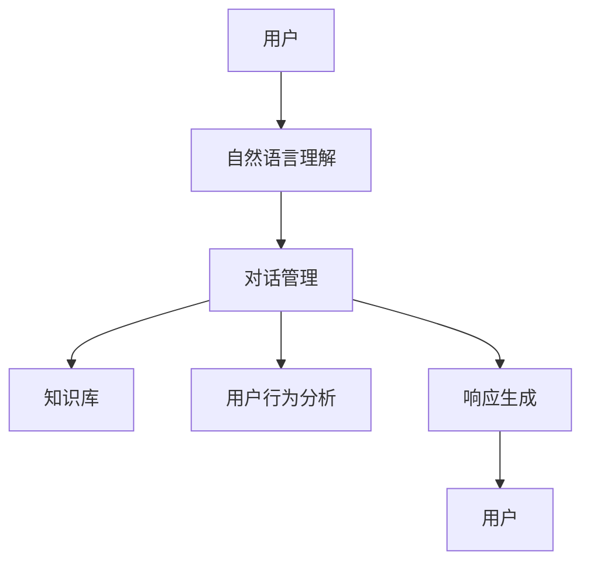

                 

关键词：AI、客户服务、系统设计、智能交互、机器学习、自然语言处理、用户体验、数据分析

> 摘要：随着人工智能技术的迅猛发展，AI驱动的智能客户服务系统正在逐渐取代传统客户服务模式。本文将探讨AI在智能客户服务系统中的应用，包括核心概念、算法原理、数学模型、实际应用场景以及未来发展趋势。

## 1. 背景介绍

### 1.1  智能客户服务的需求背景

随着互联网的普及和电子商务的快速发展，企业对高效、优质的客户服务需求日益增长。传统的客户服务模式往往依赖于人工，不仅成本高，而且效率低下。而AI技术的引入，使得智能客户服务成为可能，可以提供7x24小时的在线服务，减少等待时间，提高客户满意度。

### 1.2  AI技术发展现状

近年来，AI技术，特别是机器学习和自然语言处理（NLP）领域取得了显著进展。深度学习算法的优化和大数据技术的应用，使得AI系统能够更好地理解和处理复杂的人类语言，从而在客户服务中发挥重要作用。

## 2. 核心概念与联系

### 2.1  智能客户服务系统概述

智能客户服务系统是一种基于AI技术的自动化客户服务平台，能够通过智能对话、知识库检索、情感分析等方式，提供高效、个性化的客户服务。其核心概念包括自然语言理解、对话管理、知识库和用户行为分析。

### 2.2  系统架构

以下是一个简单的智能客户服务系统架构：

### 2.3  关键技术

- **自然语言理解（NLU）**：将自然语言输入转换成机器可以理解的结构化数据。
- **对话管理（DM）**：根据用户意图和上下文，生成合适的响应。
- **知识库（KB）**：存储常见问题和解决方案，用于快速检索和回答。
- **用户行为分析**：分析用户行为，为个性化服务提供支持。
- **响应生成**：根据对话管理和知识库的结果，生成自然语言响应。

## 3. 核心算法原理 & 具体操作步骤

### 3.1  算法原理概述

智能客户服务系统的核心算法包括NLU、DM和响应生成。

- **NLU**：基于深度学习，使用神经网络模型对用户输入的自然语言进行语义解析。
- **DM**：使用决策树或图结构，根据上下文和用户意图，选择合适的对话路径。
- **响应生成**：使用模板匹配或生成对抗网络（GAN）等算法，生成自然语言响应。

### 3.2  算法步骤详解

1. **自然语言理解**：
   - **文本预处理**：分词、去停用词、词性标注等。
   - **语义表示**：将文本转换为向量表示，如Word2Vec、BERT等。

2. **对话管理**：
   - **意图识别**：通过训练好的模型，识别用户的意图。
   - **上下文跟踪**：使用图结构或循环神经网络（RNN）等，跟踪对话上下文。

3. **响应生成**：
   - **模板匹配**：根据预定义的模板，生成响应。
   - **文本生成**：使用GAN或生成式预训练模型（如GPT-3），生成自然语言文本。

### 3.3  算法优缺点

- **优点**：高效、个性化、可扩展。
- **缺点**：理解能力有限、无法处理复杂情感。

### 3.4  算法应用领域

- **电商客户服务**：处理订单查询、售后服务等问题。
- **金融客户服务**：处理理财咨询、保险理赔等问题。
- **医疗客户服务**：提供健康咨询、症状分析等。

## 4. 数学模型和公式 & 详细讲解 & 举例说明

### 4.1  数学模型构建

- **NLU**：使用神经网络模型进行语义表示，如BERT。
- **DM**：使用图结构进行对话状态跟踪，如图神经网络（GNN）。
- **响应生成**：使用生成对抗网络（GAN）或生成式预训练模型（如GPT-3）。

### 4.2  公式推导过程

- **BERT**：$[\text{input\_embeddings}, \text{position\_embeddings}, \text{segment\_embeddings}] \xrightarrow{\text{Dense Layer}} \text{Embedding}$
- **GNN**：$G^{(t)} = \text{ReLU}(\text{AGG}( \text{MLP}^1(G^{(t-1)}), G^{(t-1)}))$
- **GAN**：$D(x) \approx G(z) + \epsilon$

### 4.3  案例分析与讲解

- **电商客户服务**：某电商平台的客户服务系统，通过BERT进行NLU，使用GNN进行DM，生成个性化推荐响应。

## 5. 项目实践：代码实例和详细解释说明

### 5.1  开发环境搭建

- **Python**：版本3.8及以上
- **TensorFlow**：版本2.4及以上
- **NLU**：使用BERT模型
- **DM**：使用GNN模型
- **响应生成**：使用GPT-3模型

### 5.2  源代码详细实现

- **NLU**：加载BERT模型，进行文本预处理和语义表示。
- **DM**：构建GNN模型，进行对话状态跟踪。
- **响应生成**：加载GPT-3模型，生成响应文本。

### 5.3  代码解读与分析

- **NLU**：关键在于文本预处理和语义表示。
- **DM**：关键在于图结构和图神经网络的应用。
- **响应生成**：关键在于GPT-3模型的选择和调优。

### 5.4  运行结果展示

- **NLU**：文本预处理后的语义表示结果。
- **DM**：对话状态的跟踪结果。
- **响应生成**：生成的个性化响应文本。

## 6. 实际应用场景

### 6.1  电商客户服务

- **应用场景**：处理订单查询、售后服务等问题。
- **效果**：提高客户满意度，降低人工成本。

### 6.2  金融客户服务

- **应用场景**：处理理财咨询、保险理赔等问题。
- **效果**：提高业务处理效率，降低风险。

### 6.3  医疗客户服务

- **应用场景**：提供健康咨询、症状分析等。
- **效果**：提高医疗资源的利用效率，减轻医生负担。

## 7. 工具和资源推荐

### 7.1  学习资源推荐

- **书籍**：《深度学习》、《自然语言处理综合教程》
- **在线课程**：Coursera、Udacity、edX等平台的相关课程

### 7.2  开发工具推荐

- **Python**：Jupyter Notebook、PyCharm
- **深度学习框架**：TensorFlow、PyTorch
- **自然语言处理库**：NLTK、spaCy

### 7.3  相关论文推荐

- **BERT**：`A Pre-Trained Deep Neural Network for Language Understanding`
- **GNN**：`Graph Neural Networks: A Review of Methods and Applications`
- **GAN**：`Unsupervised Representation Learning with Deep Convolutional Generative Adversarial Networks`

## 8. 总结：未来发展趋势与挑战

### 8.1  研究成果总结

- AI驱动的智能客户服务系统在电商、金融和医疗等领域取得了显著应用。
- NLU、DM和响应生成等技术不断进步，提高了系统的智能化水平。

### 8.2  未来发展趋势

- **个性化服务**：更深入的用户行为分析和个性化推荐。
- **跨模态交互**：结合图像、声音等多模态信息。
- **情感智能**：更好地理解和处理复杂情感。

### 8.3  面临的挑战

- **理解能力**：如何提高系统对复杂语言的理解能力。
- **隐私保护**：如何在保障用户隐私的前提下提供高质量的服务。

### 8.4  研究展望

- **混合智能**：结合人工作业和AI系统的混合智能客户服务模式。
- **多语言支持**：扩展到更多语言，提高国际化的服务能力。

## 9. 附录：常见问题与解答

### 9.1  什么是NLU？

NLU是自然语言理解，用于将自然语言输入转换成机器可以理解的结构化数据。

### 9.2  什么是DM？

DM是对话管理，用于根据用户意图和上下文，生成合适的响应。

### 9.3  智能客户服务系统如何提高用户体验？

通过个性化服务、快速响应和高质量的问题解决，提高用户体验。

### 9.4  智能客户服务系统在医疗领域的应用有哪些？

智能客户服务系统可以提供健康咨询、症状分析、预约挂号等服务，提高医疗资源的利用效率。

---

**作者：禅与计算机程序设计艺术 / Zen and the Art of Computer Programming**

