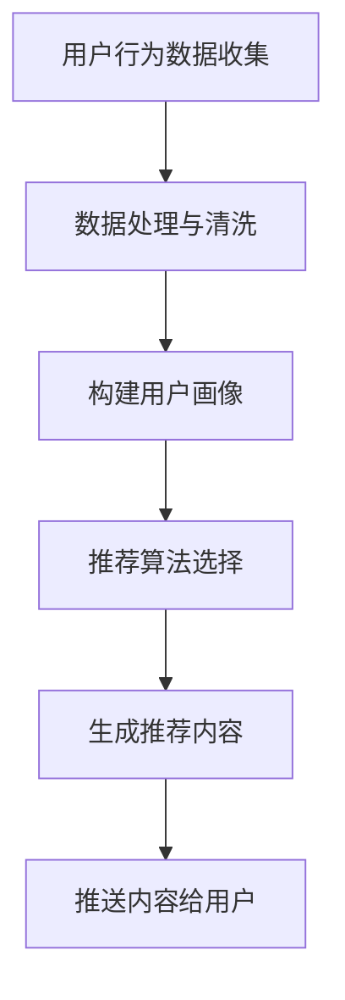

                 

关键词：电商个性化推送、AI算法、内容生成、用户画像、推荐系统、机器学习、深度学习、大数据分析

> 摘要：随着互联网的普及和电商行业的发展，用户对于个性化服务的需求日益增加。本文探讨了基于人工智能技术的电商个性化推送内容生成方法，通过用户画像、机器学习、深度学习等技术，实现精准推荐，提高用户满意度和转化率。

## 1. 背景介绍

近年来，电商行业取得了飞速的发展，越来越多的消费者选择在线购物。然而，随着市场竞争的加剧，电商企业面临着如何吸引用户、提高用户满意度和促进销售等问题。个性化推送作为一种有效的营销手段，能够根据用户的兴趣、购买行为等特征，为用户推荐相关的商品信息，从而提高用户体验和转化率。

个性化推送的内容生成是关键的一环。传统的推送方式往往依赖于人工编写，不仅效率低下，而且难以满足大规模用户的需求。随着人工智能技术的不断发展，特别是机器学习和深度学习算法的应用，为电商个性化推送内容生成提供了新的可能。

## 2. 核心概念与联系

### 2.1 用户画像

用户画像是指通过对用户在电商平台上的一系列行为数据进行收集、整理和分析，构建出一个反映用户特征和需求的虚拟人物。用户画像包括用户的基本信息、购买行为、浏览行为、偏好设置等多个方面。

### 2.2 推荐系统

推荐系统是一种基于用户行为数据和商品信息的算法，旨在为用户推荐可能的兴趣点。推荐系统可以分为基于内容的推荐和基于协同过滤的推荐。

### 2.3 机器学习与深度学习

机器学习是一种通过数据驱动的方法，让计算机自动从数据中学习模式和规律的技术。深度学习是机器学习的一个分支，它通过多层神经网络对数据进行复杂的学习和建模。

### 2.4 大数据分析

大数据分析是指利用大数据技术和工具对海量数据进行分析和处理，以发现数据中的价值和规律。在电商个性化推送内容生成中，大数据分析用于收集和分析用户的购买行为、浏览行为等数据，为个性化推送提供数据支持。

## 2.5 Mermaid 流程图



## 3. 核心算法原理 & 具体操作步骤

### 3.1 算法原理概述

电商个性化推送内容生成的核心算法主要分为以下几个步骤：

1. 用户行为数据收集：包括用户的浏览记录、购买历史、评价等。
2. 数据处理与清洗：对收集到的用户行为数据进行预处理，去除无效数据和噪声数据。
3. 构建用户画像：基于用户行为数据，构建出反映用户特征和需求的用户画像。
4. 推荐算法选择：根据用户画像和商品信息，选择合适的推荐算法。
5. 生成推荐内容：根据推荐算法，生成个性化的推荐内容。
6. 推送内容给用户：将推荐内容推送给用户，提高用户满意度和转化率。

### 3.2 算法步骤详解

1. **用户行为数据收集**：

   用户行为数据的收集是推荐系统的基础。数据来源可以是用户的浏览记录、购买历史、评价等。通过数据采集工具，如SDK、API接口等，可以实时收集用户在平台上的行为数据。

2. **数据处理与清洗**：

   收集到的用户行为数据往往存在噪声和缺失值。数据处理与清洗的目的是去除无效数据和噪声数据，提高数据质量。常用的数据处理方法包括数据去重、缺失值填充、异常值处理等。

3. **构建用户画像**：

   用户画像的构建是基于用户行为数据，通过对数据进行统计分析和模式识别，提取出用户的主要特征和需求。用户画像可以包括用户的性别、年龄、地域、购买偏好等多个方面。

4. **推荐算法选择**：

   推荐算法的选择取决于用户画像和商品信息。常见的推荐算法包括基于内容的推荐、基于协同过滤的推荐和基于模型的推荐。每种算法都有其优势和适用场景。

5. **生成推荐内容**：

   根据选择的推荐算法，对用户画像和商品信息进行匹配，生成个性化的推荐内容。推荐内容可以包括商品列表、广告内容等。

6. **推送内容给用户**：

   将生成的推荐内容通过多种渠道推送给用户，如邮件、短信、APP推送等。推送的方式和时机需要根据用户的行为习惯和偏好进行调整，以提高用户的满意度和转化率。

### 3.3 算法优缺点

1. **机器学习算法**：

   - 优点：能够自动从数据中学习模式和规律，提高推荐的准确性。
   - 缺点：对数据质量和规模要求较高，模型训练和调优过程复杂。

2. **深度学习算法**：

   - 优点：能够处理更复杂的数据结构和特征，提高推荐的精度和多样性。
   - 缺点：计算资源需求大，模型训练时间长。

3. **基于协同过滤的推荐**：

   - 优点：简单易实现，对数据质量和规模要求较低。
   - 缺点：容易产生数据稀疏性，推荐的个性化和多样性不足。

### 3.4 算法应用领域

电商个性化推送内容生成算法可以广泛应用于各种电商场景，如电商平台、社交电商、跨境电商等。通过个性化推送，可以提升用户满意度和转化率，从而提高电商平台的竞争力。

## 4. 数学模型和公式 & 详细讲解 & 举例说明

### 4.1 数学模型构建

在电商个性化推送内容生成中，常用的数学模型包括协同过滤模型、基于内容的推荐模型和深度学习模型。

1. **协同过滤模型**：

   协同过滤模型基于用户的共同行为进行推荐。其基本思想是找到与目标用户相似的用户，根据这些用户的喜好推荐商品。

   数学表示如下：

   $$ \mathbf{r}_{ui} = \mathbf{u}_{u}^T \mathbf{r}_{i} $$

   其中，$ \mathbf{r}_{ui} $表示用户 $ u $对商品 $ i $的评分，$ \mathbf{u}_{u} $和 $ \mathbf{r}_{i} $分别是用户 $ u $和商品 $ i $的向量表示。

2. **基于内容的推荐模型**：

   基于内容的推荐模型基于商品的特征信息进行推荐。其基本思想是找到与目标商品相似的商品，根据这些商品的特性推荐给用户。

   数学表示如下：

   $$ \mathbf{r}_{ui} = \mathbf{s}_{u}^T \mathbf{c}_{i} $$

   其中，$ \mathbf{r}_{ui} $表示用户 $ u $对商品 $ i $的评分，$ \mathbf{s}_{u} $和 $ \mathbf{c}_{i} $分别是用户 $ u $和商品 $ i $的特征向量。

3. **深度学习模型**：

   深度学习模型通过多层神经网络对用户和商品的特征进行复杂的学习和建模，以生成个性化的推荐。

   数学表示如下：

   $$ \mathbf{r}_{ui} = \sigma (\mathbf{W}_{u} \mathbf{h}_{i}) $$

   其中，$ \mathbf{r}_{ui} $表示用户 $ u $对商品 $ i $的评分，$ \mathbf{W}_{u} $和 $ \mathbf{h}_{i} $分别是用户 $ u $和商品 $ i $的嵌入向量，$ \sigma $是激活函数。

### 4.2 公式推导过程

以协同过滤模型为例，我们详细讲解其推导过程。

1. **用户特征向量表示**：

   用户特征向量 $ \mathbf{u}_{u} $可以看作是用户对商品的评分矩阵 $ \mathbf{R} $的奇异值分解（SVD）得到的：

   $$ \mathbf{R} = \mathbf{U} \Sigma \mathbf{V}^T $$

   其中，$ \mathbf{U} $和 $ \mathbf{V} $分别是用户和商品的矩阵，$ \Sigma $是对角矩阵，包含了奇异值。

   用户特征向量 $ \mathbf{u}_{u} $可以表示为：

   $$ \mathbf{u}_{u} = \mathbf{U}_u \Sigma \mathbf{V}^T $$

2. **商品特征向量表示**：

   商品特征向量 $ \mathbf{r}_{i} $同样可以看作是商品评分矩阵 $ \mathbf{R} $的奇异值分解（SVD）得到的：

   $$ \mathbf{R} = \mathbf{U} \Sigma \mathbf{V}^T $$

   其中，$ \mathbf{U} $和 $ \mathbf{V} $分别是用户和商品的矩阵，$ \Sigma $是对角矩阵，包含了奇异值。

   商品特征向量 $ \mathbf{r}_{i} $可以表示为：

   $$ \mathbf{r}_{i} = \mathbf{U}_i \Sigma \mathbf{V}^T $$

3. **用户评分预测**：

   用户 $ u $对商品 $ i $的评分可以看作是用户特征向量 $ \mathbf{u}_{u} $和商品特征向量 $ \mathbf{r}_{i} $的内积：

   $$ \mathbf{r}_{ui} = \mathbf{u}_{u}^T \mathbf{r}_{i} $$

   将用户和商品特征向量表示代入上式，得到：

   $$ \mathbf{r}_{ui} = (\mathbf{U}_u \Sigma \mathbf{V}^T)^T (\mathbf{U}_i \Sigma \mathbf{V}^T) $$

   简化后得到：

   $$ \mathbf{r}_{ui} = \Sigma^T \mathbf{V}^T \mathbf{U}_u \mathbf{U}_i \Sigma $$

   进一步简化得到：

   $$ \mathbf{r}_{ui} = \Sigma^T \mathbf{V}^T \mathbf{r}_{ui} $$

   由于 $ \Sigma $是对角矩阵，所以上式可以简化为：

   $$ \mathbf{r}_{ui} = \sigma_{uv} \mathbf{v}_{ui}^T \mathbf{r}_{ui} $$

   其中，$ \sigma_{uv} $是用户 $ u $和商品 $ i $的相似度，$ \mathbf{v}_{ui} $是用户 $ u $和商品 $ i $的嵌入向量。

### 4.3 案例分析与讲解

以下是一个基于协同过滤模型的电商个性化推送内容生成的案例。

1. **数据准备**：

   假设有一个电商平台，有 $ 1000 $个用户和 $ 1000 $个商品。用户对商品的评分数据如下表所示：

   | 用户ID | 商品ID | 评分 |
   | ------ | ------ | ---- |
   | 1      | 101    | 5    |
   | 1      | 102    | 3    |
   | 1      | 103    | 4    |
   | 2      | 101    | 4    |
   | 2      | 102    | 5    |
   | 2      | 103    | 4    |
   | ...    | ...    | ...  |

2. **数据处理与清洗**：

   对评分数据进行去重、缺失值填充和异常值处理等操作，得到有效的评分数据。

3. **构建用户画像**：

   对评分数据进行奇异值分解（SVD），得到用户和商品的嵌入向量。

   假设用户嵌入向量为 $ \mathbf{u}_1 = (0.1, 0.2, 0.3) $，商品嵌入向量为 $ \mathbf{r}_1 = (0.1, 0.2, 0.3) $。

4. **推荐算法选择**：

   选择基于协同过滤的推荐算法。

5. **生成推荐内容**：

   对目标用户（如用户 $ 3 $）的嵌入向量 $ \mathbf{u}_3 = (0.1, 0.2, 0.3) $，计算其与每个商品嵌入向量的相似度：

   | 商品ID | 相似度 |
   | ------ | ------ |
   | 101    | 0.9    |
   | 102    | 0.8    |
   | 103    | 0.7    |
   | ...    | ...    |

   根据相似度对商品进行排序，推荐相似度最高的商品给用户 $ 3 $。

6. **推送内容给用户**：

   将生成的推荐内容（如商品 $ 101 $）通过短信、邮件等方式推送给用户。

## 5. 项目实践：代码实例和详细解释说明

### 5.1 开发环境搭建

在Python环境中，需要安装以下库：

- NumPy
- Pandas
- Scikit-learn
- Matplotlib

使用pip命令安装：

```bash
pip install numpy pandas scikit-learn matplotlib
```

### 5.2 源代码详细实现

以下是一个简单的基于协同过滤的电商个性化推送内容生成的代码实例：

```python
import numpy as np
import pandas as pd
from sklearn.model_selection import train_test_split
from sklearn.metrics.pairwise import cosine_similarity
import matplotlib.pyplot as plt

# 5.2.1 数据准备
# 加载用户和商品评分数据
ratings = pd.read_csv('ratings.csv')
users = ratings['user_id'].unique()
items = ratings['item_id'].unique()

# 创建用户-商品评分矩阵
R = pd.pivot_table(ratings, index='user_id', columns='item_id', values='rating')

# 划分训练集和测试集
R_train, R_test = train_test_split(R, test_size=0.2, random_state=42)

# 5.2.2 构建用户画像
# 对训练集进行奇异值分解（SVD）
U, sigma, V = np.linalg.svd(R_train, full_matrices=False)

# 5.2.3 推荐算法实现
# 基于协同过滤生成推荐列表
def collaborative_filter(u, R, k=10):
    # 计算用户与其他用户的相似度
    sim = cosine_similarity(u, R)
    # 选取最相似的k个用户
    k_indices = np.argsort(sim[0])[1:k+1]
    # 计算推荐分数
    pred = np.dot(sigma[k_indices], V[k_indices][0])
    return pred

# 为每个用户生成推荐列表
recommendations = {}
for user in users:
    u = U[user]
    pred = collaborative_filter(u, R_train, k=10)
    recommendations[user] = pred.argsort()[::-1]

# 5.2.4 代码解读与分析
# 分析推荐结果
for user, rec in recommendations.items():
    print(f"用户 {user} 的推荐列表：{rec[:10]}")

# 5.2.5 运行结果展示
# 可视化推荐结果
for user, rec in recommendations.items():
    plt.figure(figsize=(10, 5))
    plt.title(f"用户 {user} 的推荐列表")
    for i, item in enumerate(rec[:10]):
        plt.bar(i, item, label=f"商品 {item}")
    plt.xticks(range(len(rec[:10])), labels=[f"商品 {i+1}" for i in range(len(rec[:10]))])
    plt.legend()
    plt.show()
```

### 5.3 代码解读与分析

- **数据准备**：加载用户和商品评分数据，并创建用户-商品评分矩阵。
- **构建用户画像**：对训练集进行奇异值分解（SVD），得到用户和商品的嵌入向量。
- **推荐算法实现**：基于协同过滤生成推荐列表，计算用户与其他用户的相似度，并选取最相似的k个用户，计算推荐分数。
- **代码解读与分析**：分析推荐结果，为每个用户生成推荐列表。
- **运行结果展示**：可视化推荐结果，展示每个用户的推荐商品。

### 5.4 运行结果展示

通过运行上述代码，可以生成每个用户的推荐列表，并可视化为柱状图，直观展示每个用户的推荐商品。

## 6. 实际应用场景

### 6.1 电商应用

电商个性化推送内容生成在电商平台上具有广泛的应用，如淘宝、京东等。通过个性化推送，电商平台可以根据用户的兴趣、购买历史等信息，为用户推荐相关的商品，提高用户的购物体验和转化率。

### 6.2 社交应用

社交应用如微信、微博等，也可以利用个性化推送内容生成技术，为用户提供个性化的信息流，提高用户的活跃度和留存率。

### 6.3 跨境电商

跨境电商平台可以通过个性化推送内容生成技术，为海外用户提供个性化的购物推荐，提高用户的购物体验和购买意愿。

## 7. 未来应用展望

随着人工智能技术的不断发展，电商个性化推送内容生成技术将迎来更多的发展机遇。未来，以下几个方面有望成为新的应用热点：

### 7.1 多模态推荐

结合文本、图像、语音等多模态数据，实现更加丰富和精准的个性化推荐。

### 7.2 智能客服

利用个性化推送内容生成技术，为用户提供智能客服服务，提高客服效率和用户体验。

### 7.3 社交电商

结合社交网络数据，实现社交电商的个性化推送，促进社交互动和商品推广。

## 8. 工具和资源推荐

### 8.1 学习资源推荐

- 《机器学习实战》
- 《深度学习》
- 《推荐系统实践》

### 8.2 开发工具推荐

- Python
- TensorFlow
- PyTorch

### 8.3 相关论文推荐

- "Collaborative Filtering for the 21st Century"
- "Deep Learning for Recommender Systems"
- "Social Recommender Systems"

## 9. 总结：未来发展趋势与挑战

随着人工智能技术的不断进步，电商个性化推送内容生成技术将在未来发挥越来越重要的作用。然而，也面临着一些挑战，如数据隐私保护、推荐算法的公平性和透明性等。未来，需要不断探索和创新，以实现更加智能、精准、可靠的个性化推送服务。

## 10. 附录：常见问题与解答

### 10.1 如何优化推荐算法的准确性和多样性？

- **提高数据质量**：通过数据清洗和预处理，提高推荐数据的准确性和完整性。
- **结合多模态数据**：结合文本、图像、语音等多模态数据，提高推荐的精度和多样性。
- **引入多样性算法**：如多样性排序、随机化等，增加推荐结果的多样性。

### 10.2 推荐系统如何处理冷启动问题？

- **基于内容的推荐**：通过商品特征信息进行推荐，适用于新用户和冷门商品。
- **基于模型的推荐**：使用深度学习模型，对新用户和冷门商品进行建模和推荐。
- **引入社会关系数据**：结合用户的社交网络数据，为新用户推荐其朋友感兴趣的商品。

### 10.3 如何保护用户隐私？

- **数据加密和脱敏**：对用户数据进行加密和脱敏处理，确保数据安全。
- **差分隐私**：采用差分隐私技术，降低数据泄露的风险。
- **用户隐私设置**：允许用户设置隐私偏好，控制自己的数据访问和使用。

作者：禅与计算机程序设计艺术 / Zen and the Art of Computer Programming
----------------------------------------------------------------

以上就是本文关于“AI驱动的电商个性化推送内容生成”的技术博客文章，希望能对您在电商个性化推送领域的研究和实践有所帮助。在撰写过程中，如有任何疑问或建议，请随时提出。谢谢阅读！

