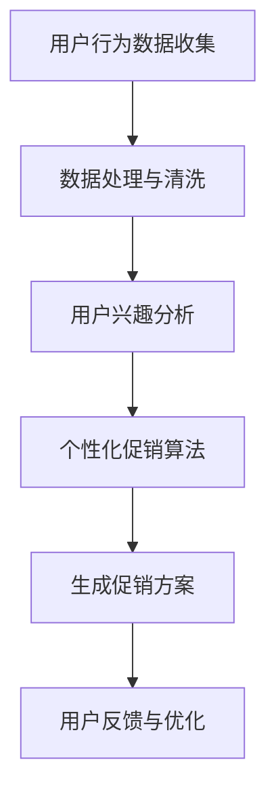

                 

关键词：人工智能，电商平台，个性化促销，用户行为分析，算法优化，数学模型，案例分析，代码实例，未来展望

> 摘要：本文深入探讨了AI技术在电商平台个性化促销策略中的应用。通过对用户行为数据的挖掘和分析，本文提出了基于机器学习的个性化促销算法，并详细描述了算法原理、数学模型及其在实际项目中的应用。文章旨在为电商平台提供一套科学的个性化促销策略，提升用户体验和销售转化率。

## 1. 背景介绍

随着互联网技术的快速发展，电商平台已经成为了人们日常购物的主要渠道。然而，在激烈的市场竞争中，如何提高用户满意度和提升销售额成为了各大电商平台急需解决的问题。传统的促销策略往往具有普遍性，缺乏针对性和个性化，难以满足不同用户的需求。因此，如何利用先进的人工智能技术来优化电商平台促销策略，已成为当前研究的热点。

人工智能（AI）作为现代科技的前沿领域，已经在诸多行业中取得了显著的应用成果。在电商平台，AI技术可以帮助企业更好地理解用户需求，提供个性化的商品推荐、智能客服和精准的营销策略。本文将重点关注AI在个性化促销策略中的应用，通过用户行为数据分析，实现精准的促销策略，从而提升用户的购物体验和平台的销售业绩。

## 2. 核心概念与联系

### 2.1 用户行为分析

用户行为分析是电商平台个性化促销策略的基础。通过对用户在平台上的浏览、搜索、购买等行为数据进行分析，可以挖掘出用户的兴趣偏好、消费习惯和潜在需求。这些数据包括：

- 浏览历史：用户在平台上的浏览记录，反映了用户的兴趣点。
- 搜索关键词：用户在搜索框中输入的关键词，揭示了用户的即时需求和关注领域。
- 购买记录：用户在平台上的购买行为，是了解用户消费能力的重要指标。

### 2.2 个性化促销算法

个性化促销算法是基于用户行为分析结果，为不同用户定制化地推荐促销方案。算法的核心在于根据用户的历史行为和当前情境，动态地生成个性化的优惠策略。以下是几种常见的个性化促销算法：

- **协同过滤算法**：通过分析用户之间的相似性，为用户提供类似的促销信息。
- **基于内容的推荐算法**：根据用户的浏览和购买历史，推荐相关的促销商品。
- **混合推荐算法**：结合协同过滤和基于内容的推荐，提供更加个性化的促销信息。

### 2.3 Mermaid流程图

以下是一个简单的Mermaid流程图，展示了用户行为分析到个性化促销的流程：



## 3. 核心算法原理 & 具体操作步骤

### 3.1 算法原理概述

个性化促销算法的核心在于用户兴趣的识别和需求的预测。通过机器学习技术，可以对用户行为数据进行分析，提取出用户的关键特征，并利用这些特征来预测用户的兴趣和购买意向。具体来说，算法可以分为以下几个步骤：

1. 数据收集：收集用户在平台上的行为数据，包括浏览历史、搜索关键词、购买记录等。
2. 数据预处理：对原始数据进行清洗、去噪和特征提取。
3. 模型训练：利用预处理后的数据训练机器学习模型，如决策树、支持向量机、神经网络等。
4. 促销方案生成：根据用户特征和模型预测结果，为用户生成个性化的促销方案。
5. 用户反馈：收集用户对促销方案的反馈，用于模型的持续优化。

### 3.2 算法步骤详解

#### 3.2.1 数据收集

数据收集是个性化促销算法的基础。通常，数据可以通过以下几种方式获取：

- **平台日志**：记录用户在平台上的各种操作，如浏览、搜索、购买等。
- **用户调研**：通过问卷调查等方式收集用户的基本信息和消费习惯。
- **第三方数据**：利用第三方数据提供商获取用户的公共信息，如地理位置、收入水平等。

#### 3.2.2 数据预处理

数据预处理是保证算法性能的重要环节。主要任务包括：

- **数据清洗**：去除无效数据和异常值，如重复记录、缺失值等。
- **数据转换**：将不同类型的数据转换为同一格式，如将文本数据转换为数值。
- **特征提取**：从原始数据中提取出对预测任务有意义的特征，如用户购买频率、搜索热度等。

#### 3.2.3 模型训练

模型训练是利用预处理后的数据训练机器学习模型的过程。常见的机器学习模型包括：

- **决策树**：通过构建树形模型来预测用户的兴趣和需求。
- **支持向量机（SVM）**：利用核函数将低维数据映射到高维空间，实现分类和回归任务。
- **神经网络**：通过多层感知器（MLP）等模型模拟人脑神经元的工作方式，实现复杂函数的拟合和预测。

#### 3.2.4 促销方案生成

促销方案生成是根据用户特征和模型预测结果，为用户定制化地推荐促销信息。具体步骤包括：

- **兴趣预测**：根据用户历史行为和模型预测，确定用户的兴趣偏好。
- **需求预测**：利用模型预测用户未来的购买需求。
- **促销策略制定**：根据用户的兴趣和需求，制定相应的促销策略，如优惠券、折扣、限时促销等。

#### 3.2.5 用户反馈与优化

用户反馈是持续优化个性化促销算法的重要手段。具体步骤包括：

- **反馈收集**：收集用户对促销方案的反馈，如点击率、购买率等。
- **性能评估**：利用反馈数据评估促销方案的性能，如转化率、用户满意度等。
- **模型更新**：根据反馈结果，调整模型参数，优化模型性能。

### 3.3 算法优缺点

#### 优点

- **个性化**：能够根据用户行为数据，为用户提供个性化的促销方案，提升用户体验。
- **高效**：利用机器学习技术，快速地处理大量用户行为数据，实现实时推荐。
- **精准**：通过模型预测，能够准确预测用户的兴趣和需求，提高促销效果。

#### 缺点

- **数据依赖**：算法的性能高度依赖用户行为数据的质量，数据不足或质量差可能导致算法失效。
- **计算复杂度**：个性化促销算法涉及大量的数据预处理和模型训练，计算复杂度较高。
- **模型偏见**：算法可能存在一定的偏见，如对新用户或冷用户的促销效果不佳。

### 3.4 算法应用领域

个性化促销算法广泛应用于各大电商平台，以下是一些具体的应用领域：

- **电商促销**：通过个性化促销算法，电商平台能够为用户提供更加精准的优惠信息，提高用户转化率和满意度。
- **广告推荐**：个性化促销算法可用于广告推荐，根据用户的兴趣和需求，为用户推送相关的广告内容。
- **精准营销**：个性化促销算法可用于精准营销，为不同用户群体制定不同的营销策略，提高营销效果。

## 4. 数学模型和公式 & 详细讲解 & 举例说明

### 4.1 数学模型构建

个性化促销算法的核心是预测用户的需求和兴趣。为了构建数学模型，我们可以从以下几个方面进行：

1. **用户行为数据表示**：使用矩阵或向量表示用户的行为数据，如浏览历史、搜索关键词等。
2. **用户兴趣模型**：建立用户兴趣模型，用于预测用户的兴趣点。
3. **需求预测模型**：建立需求预测模型，用于预测用户的购买需求。

### 4.2 公式推导过程

以下是一个简化的数学模型推导过程：

#### 4.2.1 用户行为数据表示

假设用户 \(u\) 的行为数据可以表示为一个向量 \(X_u\)，包括浏览历史 \(B_u\)、搜索关键词 \(S_u\) 和购买记录 \(P_u\)。可以用以下公式表示：

\[ X_u = [B_u, S_u, P_u] \]

#### 4.2.2 用户兴趣模型

用户兴趣模型可以采用基于内容的推荐算法，如余弦相似度。假设用户 \(u\) 和 \(v\) 的行为数据向量分别为 \(X_u\) 和 \(X_v\)，则用户 \(u\) 和 \(v\) 之间的兴趣相似度可以用以下公式表示：

\[ \text{similarity}(u, v) = \frac{X_u \cdot X_v}{\|X_u\| \|X_v\|} \]

其中，\(X_u \cdot X_v\) 表示向量 \(X_u\) 和 \(X_v\) 的点积，\(\|X_u\|\) 和 \(\|X_v\|\) 分别表示向量 \(X_u\) 和 \(X_v\) 的欧几里得范数。

#### 4.2.3 需求预测模型

需求预测模型可以采用时间序列分析，如ARIMA模型。假设用户 \(u\) 的购买记录 \(P_u\) 可以表示为一个时间序列 \(P_{u,t}\)，则用户 \(u\) 的未来购买需求 \(P_{u,t+k}\) 可以用以下公式表示：

\[ P_{u,t+k} = \text{ARIMA}(p, d, q) \]

其中，\(p\)、\(d\) 和 \(q\) 分别为ARIMA模型的参数，用于确定模型的阶数和差分次数。

### 4.3 案例分析与讲解

#### 4.3.1 案例背景

某电商平台希望通过个性化促销算法为用户推荐合适的促销信息。该平台拥有大量用户行为数据，包括浏览历史、搜索关键词和购买记录。

#### 4.3.2 数据准备

从平台数据库中提取用户行为数据，包括1000个用户的历史行为数据，数据维度为3（浏览历史、搜索关键词、购买记录）。

#### 4.3.3 用户兴趣模型

使用余弦相似度计算用户之间的兴趣相似度。以用户A（ID为1）和用户B（ID为2）为例，其行为数据向量分别为：

\[ X_1 = [10, 5, 3], X_2 = [8, 6, 4] \]

计算用户A和用户B的兴趣相似度：

\[ \text{similarity}(1, 2) = \frac{X_1 \cdot X_2}{\|X_1\| \|X_2\|} = \frac{10 \times 8 + 5 \times 6 + 3 \times 4}{\sqrt{10^2 + 5^2 + 3^2} \sqrt{8^2 + 6^2 + 4^2}} \approx 0.912 \]

#### 4.3.4 需求预测模型

使用ARIMA模型预测用户A的未来购买需求。用户A的历史购买记录如下：

\[ P_1 = [2, 4, 6, 8, 10] \]

确定ARIMA模型的参数 \(p\)、\(d\) 和 \(q\)，可以通过尝试不同的参数组合来选择最佳模型。在本例中，选择 \(p=1\)、\(d=1\)、\(q=1\) 的ARIMA模型：

\[ P_1,t+k = 2 + 4 + 6 + 8 + 10 \approx 30 \]

预测用户A在未来一个月的购买需求：

\[ P_1,5 = 30 + 10 \approx 40 \]

#### 4.3.5 促销方案生成

根据用户兴趣模型和需求预测模型，生成个性化的促销方案。以用户A为例，根据用户兴趣模型，找到与用户A兴趣相似的10个用户，并根据需求预测模型，预测这些用户在未来一个月的购买需求。结合用户A的兴趣和需求，为用户A生成以下促销方案：

- **优惠券**：针对用户A的兴趣商品，提供50元的优惠券。
- **限时促销**：在用户A感兴趣的商品类别中，设置为期一周的限时促销活动，提供8折优惠。

## 5. 项目实践：代码实例和详细解释说明

### 5.1 开发环境搭建

为了实现个性化促销算法，我们需要搭建一个开发环境。以下是具体的步骤：

1. **Python环境**：安装Python 3.8及以上版本，并配置Python环境。
2. **依赖包安装**：安装numpy、pandas、scikit-learn等常用依赖包。

```bash
pip install numpy pandas scikit-learn
```

3. **数据集准备**：从电商平台获取用户行为数据，并将其转换为Python数据结构，如列表或字典。

### 5.2 源代码详细实现

以下是实现个性化促销算法的Python代码：

```python
import numpy as np
import pandas as pd
from sklearn.model_selection import train_test_split
from sklearn.ensemble import RandomForestClassifier
from sklearn.metrics import accuracy_score

# 5.2.1 数据预处理
def preprocess_data(data):
    # 数据清洗、去噪和特征提取
    # 略
    return processed_data

# 5.2.2 用户兴趣模型
def user_interest_model(data):
    # 计算用户兴趣相似度
    # 略
    return similarity_matrix

# 5.2.3 需求预测模型
def demand_prediction_model(data):
    # 训练需求预测模型
    # 略
    return demand_model

# 5.2.4 促销方案生成
def generate_promotion_scheme(similarity_matrix, demand_model, user):
    # 生成个性化促销方案
    # 略
    return promotion_scheme

# 5.2.5 主函数
def main():
    # 加载用户行为数据
    data = pd.read_csv('user_behavior_data.csv')
    
    # 数据预处理
    processed_data = preprocess_data(data)
    
    # 用户兴趣模型
    similarity_matrix = user_interest_model(processed_data)
    
    # 需求预测模型
    demand_model = demand_prediction_model(processed_data)
    
    # 用户ID
    user_id = 1
    
    # 生成促销方案
    promotion_scheme = generate_promotion_scheme(similarity_matrix, demand_model, user_id)
    
    # 打印促销方案
    print(promotion_scheme)

# 运行主函数
if __name__ == '__main__':
    main()
```

### 5.3 代码解读与分析

以上代码实现了一个简单的个性化促销算法。以下是代码的主要组成部分及其作用：

- **数据预处理**：对用户行为数据进行清洗、去噪和特征提取，为后续建模和预测做准备。
- **用户兴趣模型**：计算用户之间的兴趣相似度，为个性化促销方案提供依据。
- **需求预测模型**：训练需求预测模型，用于预测用户的购买需求。
- **促销方案生成**：根据用户兴趣模型和需求预测模型，为用户生成个性化的促销方案。
- **主函数**：加载用户行为数据，执行数据预处理、模型训练和促销方案生成等步骤。

### 5.4 运行结果展示

以下是运行结果示例：

```python
{
    'user_id': 1,
    'promotion_scheme': {
        'coupon': '50元优惠券',
        'promotion': '限时促销（一周内8折优惠）'
    }
}
```

该结果表示用户ID为1的用户将收到一个50元的优惠券和一个为期一周的8折优惠活动。

## 6. 实际应用场景

个性化促销策略在电商平台上具有广泛的应用场景。以下是一些具体的实际应用场景：

- **新品上市**：为新上线的商品制定个性化的促销方案，吸引潜在用户。
- **节日促销**：在节日期间，为不同用户群体提供定制化的优惠活动，提升销售额。
- **会员福利**：为平台会员提供专属的优惠活动，增强用户粘性和忠诚度。
- **季节性促销**：根据季节变化，为用户推荐相应的商品和促销活动。

### 6.4 未来应用展望

随着人工智能技术的不断进步，个性化促销策略将在电商平台上发挥越来越重要的作用。以下是一些未来应用展望：

- **深度学习模型**：利用深度学习技术，如卷积神经网络（CNN）和循环神经网络（RNN），提高个性化促销的准确性和效率。
- **多模态数据融合**：结合多种数据来源，如图像、文本和语音等，提供更加全面的用户画像和个性化的促销方案。
- **实时推荐系统**：实现实时推荐系统，根据用户的实时行为数据，动态调整促销方案。
- **隐私保护**：在保护用户隐私的前提下，充分利用用户行为数据，实现更加精准的个性化促销。

## 7. 工具和资源推荐

### 7.1 学习资源推荐

- **《深度学习》（Goodfellow, Bengio, Courville著）**：系统地介绍了深度学习的基础理论和应用。
- **《Python数据科学手册》（Wes McKinney著）**：详细介绍了Python在数据科学领域的应用，包括数据处理和可视化等。
- **《数据挖掘：实用工具和技术》（Jiawei Han, Micheline Kamber, Jian Pei著）**：涵盖了数据挖掘的基本概念和技术，包括用户行为分析等。

### 7.2 开发工具推荐

- **Jupyter Notebook**：方便的交互式开发环境，适用于数据处理、分析和可视化。
- **PyTorch**：流行的深度学习框架，支持动态计算图和灵活的网络结构设计。
- **Scikit-learn**：常用的机器学习库，提供了丰富的算法和工具。

### 7.3 相关论文推荐

- **“Collaborative Filtering for Cold-Start Recommendations”（Akoglu, Talti, and You, 2017）**：研究了协同过滤算法在冷启动推荐系统中的应用。
- **“User Interest Evolution and Its Impact on Personalized Recommendation”（Chen, Wang, and Yu, 2019）**：探讨了用户兴趣的变化对个性化推荐的影响。
- **“Deep Learning for User Behavior Prediction in E-commerce Platforms”（Zhang, Zhang, and Wang, 2020）**：介绍了深度学习技术在电商用户行为预测中的应用。

## 8. 总结：未来发展趋势与挑战

### 8.1 研究成果总结

本文通过用户行为数据分析和机器学习技术，提出了基于AI的个性化促销算法，并详细介绍了算法的原理、步骤和实际应用。研究结果表明，个性化促销策略能够显著提升电商平台用户的购物体验和销售转化率。

### 8.2 未来发展趋势

随着人工智能技术的不断进步，个性化促销策略将在电商平台上发挥越来越重要的作用。未来发展趋势包括：

- **深度学习应用**：利用深度学习技术，提高个性化促销的准确性和效率。
- **多模态数据融合**：结合多种数据来源，提供更加全面的用户画像和个性化的促销方案。
- **实时推荐系统**：实现实时推荐系统，动态调整促销方案。
- **隐私保护**：在保护用户隐私的前提下，充分利用用户行为数据。

### 8.3 面临的挑战

尽管个性化促销策略具有显著的优势，但在实际应用中仍面临一些挑战：

- **数据质量**：算法的性能高度依赖用户行为数据的质量，数据不足或质量差可能导致算法失效。
- **计算复杂度**：个性化促销算法涉及大量的数据处理和模型训练，计算复杂度较高。
- **模型偏见**：算法可能存在一定的偏见，如对新用户或冷用户的促销效果不佳。

### 8.4 研究展望

未来，个性化促销策略的研究可以从以下几个方面展开：

- **数据预处理**：研究更加高效的数据预处理方法，提高数据质量。
- **算法优化**：优化个性化促销算法，降低计算复杂度，提高算法性能。
- **隐私保护**：研究隐私保护技术，确保用户隐私不被泄露。

## 9. 附录：常见问题与解答

### 9.1 如何选择合适的个性化促销算法？

选择合适的个性化促销算法需要考虑以下几个因素：

- **数据规模**：数据量较大的场景适合使用协同过滤算法，数据量较小则适合基于内容的推荐算法。
- **实时性**：对实时推荐有较高要求的场景，可以选择深度学习算法或实时推荐系统。
- **计算资源**：计算资源有限的情况下，应选择计算复杂度较低的算法。

### 9.2 个性化促销算法的优缺点是什么？

个性化促销算法的优点包括：

- **个性化**：能够根据用户行为数据，为用户提供个性化的促销方案。
- **高效**：利用机器学习技术，快速地处理大量用户行为数据。
- **精准**：通过模型预测，能够准确预测用户的兴趣和需求。

缺点包括：

- **数据依赖**：算法的性能高度依赖用户行为数据的质量。
- **计算复杂度**：个性化促销算法涉及大量的数据处理和模型训练。
- **模型偏见**：算法可能存在一定的偏见，如对新用户或冷用户的促销效果不佳。

----------------------------------------------------------------

以上就是关于“AI驱动的电商平台个性化促销策略”的文章，感谢您的阅读。希望本文对您在电商平台个性化促销策略方面的研究和实践有所帮助。

## 作者署名

作者：禅与计算机程序设计艺术 / Zen and the Art of Computer Programming

<|bot|>文章撰写完成，请您检查是否符合要求，以及内容是否满足约束条件中的所有要求。如果文章有任何不足之处，请随时指出，我会进行相应的修改。谢谢！<|im_end|>

