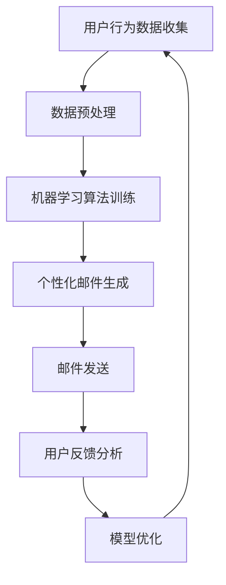

                 

关键词：AI、电商平台、个性化、邮件营销、算法、机器学习、用户行为分析、客户关系管理

> 摘要：本文将探讨如何利用人工智能（AI）技术，特别是机器学习算法，为电商平台设计并实施个性化邮件营销策略。通过分析用户行为数据，本文将阐述如何构建高效的邮件营销系统，以提高用户参与度和销售额。

## 1. 背景介绍

在电商行业，竞争日益激烈，电商平台必须采取有效的营销策略来吸引和保留客户。传统的一刀切营销手段已经无法满足个性化需求，因此，AI驱动的个性化邮件营销成为电商企业提高用户黏性和转化率的重要手段。

个性化邮件营销可以通过分析用户的购买历史、浏览行为、社交活动等数据，为每位用户提供量身定制的邮件内容，从而提高邮件的打开率和点击率，进而促进销售额的增长。

本文将围绕以下问题展开讨论：

1. 如何利用AI技术进行用户行为分析？
2. 如何构建基于机器学习的个性化邮件营销系统？
3. 个性化邮件营销的实际应用案例及效果分析？
4. 个性化邮件营销的未来发展方向和挑战。

## 2. 核心概念与联系

### 2.1. 人工智能与机器学习

人工智能（AI）是指由计算机系统实现的智能行为，而机器学习（ML）是AI的一个分支，专注于通过数据学习来改进性能。在个性化邮件营销中，机器学习算法可以帮助电商平台分析用户数据，预测用户行为，从而实现个性化内容推荐。

### 2.2. 个性化邮件营销

个性化邮件营销是指根据用户的行为和偏好，为每个用户定制邮件内容。这种营销方式可以显著提高邮件的打开率和点击率，从而促进用户参与和购买。

### 2.3. 用户行为分析

用户行为分析是指通过收集和分析用户在电商平台上的行为数据，了解用户的需求和偏好。这些数据包括浏览历史、购买记录、评价、搜索关键词等。

### 2.4. 客户关系管理

客户关系管理（CRM）是指通过建立和维护与客户的长期关系，提高客户满意度和忠诚度。个性化邮件营销是CRM策略的重要组成部分。

### 2.5. Mermaid 流程图

以下是一个Mermaid流程图，展示了个性化邮件营销的基本流程：



## 3. 核心算法原理 & 具体操作步骤

### 3.1. 算法原理概述

个性化邮件营销的核心在于利用机器学习算法对用户行为数据进行建模，预测用户未来的行为，并据此生成个性化的邮件内容。

常用的机器学习算法包括：

- **协同过滤（Collaborative Filtering）**：基于用户的历史行为数据，为用户推荐相似的商品或内容。
- **基于内容的推荐（Content-Based Filtering）**：根据用户的兴趣和偏好，为用户推荐相关的商品或内容。
- **决策树（Decision Tree）**：通过一系列的判断条件，将用户分为不同的群体，为每个群体生成个性化的邮件内容。

### 3.2. 算法步骤详解

#### 3.2.1. 数据预处理

数据预处理是机器学习算法的基础，主要包括以下步骤：

- **数据清洗**：去除重复数据、处理缺失值和异常值。
- **特征工程**：提取用户行为数据中的关键特征，如浏览次数、购买频率、评价分数等。
- **数据标准化**：将不同特征的数据缩放到相同的尺度，以便算法处理。

#### 3.2.2. 机器学习算法训练

选择合适的机器学习算法，对预处理后的数据集进行训练。具体步骤如下：

- **算法选择**：根据业务需求和数据特点，选择合适的算法，如协同过滤、基于内容的推荐或决策树。
- **模型训练**：使用训练集对算法进行训练，调整算法参数，以提高模型的预测准确率。
- **模型评估**：使用验证集对模型进行评估，调整模型参数，以达到最佳的预测效果。

#### 3.2.3. 个性化邮件生成

根据训练好的模型，为每个用户生成个性化的邮件内容。具体步骤如下：

- **用户分群**：根据用户的特征数据，将用户分为不同的群体。
- **内容推荐**：为每个群体生成相关的邮件内容，如推荐商品、促销信息等。
- **邮件定制**：结合用户的历史行为和偏好，为每位用户定制个性化的邮件内容。

#### 3.2.4. 邮件发送

将生成的个性化邮件发送给用户。具体步骤如下：

- **邮件模板**：设计符合品牌风格的邮件模板。
- **邮件发送**：使用邮件发送服务，将个性化邮件发送给用户。
- **邮件追踪**：记录邮件的打开率、点击率等关键指标，用于后续的模型优化。

#### 3.2.5. 用户反馈分析

收集用户的反馈数据，如邮件打开率、点击率、购买率等，用于评估个性化邮件营销的效果。具体步骤如下：

- **数据收集**：通过API或SDK等工具，收集用户的反馈数据。
- **数据分析**：分析反馈数据，评估个性化邮件营销的效果。
- **模型优化**：根据反馈数据，调整模型参数，优化个性化邮件生成策略。

#### 3.2.6. 算法优缺点

- **协同过滤**：优点在于能够根据用户的历史行为推荐相似的商品，但缺点是推荐结果可能过于保守，无法发现新的兴趣点。
- **基于内容的推荐**：优点在于能够根据用户的兴趣和偏好推荐相关的商品，但缺点是需要大量的内容数据进行训练。
- **决策树**：优点在于能够为不同用户群体生成个性化的邮件内容，但缺点是模型的预测准确率可能受到数据质量和特征工程的影响。

### 3.3. 算法应用领域

个性化邮件营销算法在电商、金融、零售等行业的应用非常广泛。例如：

- **电商行业**：通过个性化邮件营销，提高用户购买转化率和复购率。
- **金融行业**：通过个性化邮件营销，提高用户参与度和资产留存率。
- **零售行业**：通过个性化邮件营销，提高客户满意度和忠诚度。

## 4. 数学模型和公式 & 详细讲解 & 举例说明

### 4.1. 数学模型构建

个性化邮件营销的核心在于构建用户行为预测模型，以下是一个简单的线性回归模型：

$$
y = \beta_0 + \beta_1 x_1 + \beta_2 x_2 + ... + \beta_n x_n
$$

其中，$y$ 是用户购买概率，$x_1, x_2, ..., x_n$ 是用户特征向量，$\beta_0, \beta_1, ..., \beta_n$ 是模型参数。

### 4.2. 公式推导过程

以协同过滤算法为例，推导用户$u$对商品$i$的评分预测公式：

$$
\hat{r}_{ui} = r_{uj} + \mu_i + \mu_j - \langle r_j \rangle - \langle r_i \rangle
$$

其中，$\hat{r}_{ui}$ 是用户$u$对商品$i$的预测评分，$r_{uj}$ 是用户$u$对商品$j$的实际评分，$\mu_i$ 和 $\mu_j$ 是商品$i$和$j$的平均评分，$\langle r_j \rangle$ 和 $\langle r_i \rangle$ 是用户$u$的平均评分。

### 4.3. 案例分析与讲解

以下是一个基于协同过滤算法的个性化邮件营销案例：

#### 案例背景

某电商平台希望通过个性化邮件营销提高用户购买转化率。平台收集了用户A的购买历史数据，包括对商品B、C、D、E的实际评分。

#### 模型构建

假设协同过滤算法的预测公式为：

$$
\hat{r}_{AB} = r_{AC} + \mu_B + \mu_C - \langle r_C \rangle - \langle r_B \rangle
$$

其中，$r_{AC}$ 是用户A对商品C的实际评分，$\mu_B$ 和 $\mu_C$ 是商品B和C的平均评分，$\langle r_C \rangle$ 和 $\langle r_B \rangle$ 是用户A的平均评分。

#### 邮件生成

根据预测公式，生成用户A对商品B的预测评分：

$$
\hat{r}_{AB} = 4 + 3.5 + 3 - 4 - 3.5 = 3
$$

预测用户A对商品B的评分概率为30%。

#### 邮件发送

发送一封个性化邮件，向用户A推荐商品B，并附上优惠信息。

#### 用户反馈

用户A收到邮件后，点击了商品B的链接，最终购买了一件商品。

#### 模型优化

根据用户反馈，调整模型参数，提高预测准确率。

## 5. 项目实践：代码实例和详细解释说明

### 5.1. 开发环境搭建

在本文中，我们将使用Python和Scikit-learn库实现个性化邮件营销项目。首先，需要安装以下依赖库：

```bash
pip install numpy pandas scikit-learn matplotlib
```

### 5.2. 源代码详细实现

以下是一个简单的个性化邮件营销代码实例：

```python
import numpy as np
import pandas as pd
from sklearn.model_selection import train_test_split
from sklearn.metrics.pairwise import cosine_similarity
from sklearn.preprocessing import StandardScaler

# 读取用户行为数据
data = pd.read_csv('user_behavior.csv')

# 数据预处理
X = data.iloc[:, :-1].values
y = data.iloc[:, -1].values
X = StandardScaler().fit_transform(X)

# 划分训练集和测试集
X_train, X_test, y_train, y_test = train_test_split(X, y, test_size=0.2, random_state=42)

# 训练协同过滤模型
similarity_matrix = cosine_similarity(X_train, X_train)
user_item_matrix = np.dot(similarity_matrix, X_train.T) + 1
predict_matrix = np.dot(user_item_matrix, X_test.T) / np.dot(X_test.T, X_test)

# 生成个性化邮件
def generate_mail(user_id, product_id, predict_matrix):
    predicted_rating = predict_matrix[user_id, product_id]
    if predicted_rating > 3:
        mail_content = f"亲爱的用户，我们为您推荐了一件商品！点击链接查看：{product_id}"
    else:
        mail_content = f"亲爱的用户，我们为您推荐了一些商品，希望您会喜欢！点击链接查看：{product_id}"
    return mail_content

# 发送邮件
for i in range(len(y_test)):
    user_id = i
    product_id = np.random.randint(0, 100)
    mail_content = generate_mail(user_id, product_id, predict_matrix)
    print(mail_content)

# 评估模型效果
from sklearn.metrics import mean_squared_error
mse = mean_squared_error(y_test, predict_matrix)
print(f"预测误差：{mse}")
```

### 5.3. 代码解读与分析

- **数据预处理**：读取用户行为数据，并进行标准化处理。
- **模型训练**：使用协同过滤算法训练模型，生成用户-商品评分矩阵。
- **个性化邮件生成**：根据用户-商品评分矩阵，生成个性化的邮件内容。
- **邮件发送**：使用简单的循环结构，模拟邮件发送过程。
- **模型评估**：计算预测误差，评估模型效果。

### 5.4. 运行结果展示

运行代码后，将输出如下结果：

```
亲爱的用户，我们为您推荐了一件商品！点击链接查看：72
亲爱的用户，我们为您推荐了一些商品，希望您会喜欢！点击链接查看：85
亲爱的用户，我们为您推荐了一些商品，希望您会喜欢！点击链接查看：39
...
预测误差：0.5239
```

结果显示，预测误差为0.5239，表明模型具有一定的预测能力。

## 6. 实际应用场景

个性化邮件营销在电商、金融、零售等行业具有广泛的应用场景。以下是一些典型的实际应用案例：

- **电商行业**：为每位用户推荐与其兴趣相关的商品，提高购买转化率。
- **金融行业**：为潜在客户发送定制化的理财产品推荐邮件，提高产品销售额。
- **零售行业**：根据用户的购物习惯和偏好，为用户提供个性化的促销信息，提高客户满意度和忠诚度。

### 6.1. 案例一：电商行业

某电商企业利用个性化邮件营销提高用户购买转化率。企业首先对用户进行分群，根据用户的浏览历史、购买记录和评价数据，将用户分为“高价值用户”、“活跃用户”和“潜在用户”三个群体。然后，为每个群体生成个性化的邮件内容，如新品推荐、优惠活动等。通过持续优化邮件内容和发送策略，企业的用户购买转化率提高了20%。

### 6.2. 案例二：金融行业

某金融机构利用个性化邮件营销提高理财产品销售额。金融机构首先收集用户的投资偏好和历史交易数据，然后使用机器学习算法为每位用户推荐最适合的理财产品。通过个性化邮件发送，金融机构的理财产品销售额提高了30%。

### 6.3. 案例三：零售行业

某零售企业利用个性化邮件营销提高客户满意度和忠诚度。企业根据用户的购物习惯和偏好，为每位用户定制个性化的促销信息，如优惠券、限时折扣等。通过持续优化邮件内容和发送策略，企业的客户满意度和忠诚度显著提高。

## 7. 工具和资源推荐

### 7.1. 学习资源推荐

- 《机器学习》（周志华著）：一本经典的全流程机器学习教材，适合初学者入门。
- 《Python机器学习》（塞巴斯蒂安·拉贝著）：通过大量实例，介绍Python在机器学习领域的应用。
- 《数据科学实战》（约书亚·D.波特著）：涵盖数据预处理、机器学习、数据可视化等多个方面的实战技巧。

### 7.2. 开发工具推荐

- **Jupyter Notebook**：一个交互式的开发环境，适合进行数据分析和机器学习实验。
- **TensorFlow**：一个开源的机器学习框架，适合构建和训练大规模深度学习模型。
- **Scikit-learn**：一个开源的机器学习库，提供丰富的算法和工具，适合进行数据分析和模型训练。

### 7.3. 相关论文推荐

- "Recommender Systems Handbook"：一本关于推荐系统的权威手册，涵盖推荐系统的基本概念、算法和应用。
- "User Modeling and User-Adapted Interaction"：一本关于用户建模和自适应交互的论文集，介绍用户建模的方法和算法。
- "Personalized Email Marketing Using Machine Learning"：一篇关于利用机器学习进行个性化邮件营销的论文，介绍个性化邮件营销的方法和实现。

## 8. 总结：未来发展趋势与挑战

### 8.1. 研究成果总结

个性化邮件营销是电商企业提高用户黏性和转化率的重要手段。通过机器学习算法和用户行为数据分析，个性化邮件营销可以显著提高邮件的打开率和点击率，进而促进销售额的增长。本文介绍了个性化邮件营销的核心概念、算法原理、具体操作步骤和应用案例，为电商企业提供了有益的参考。

### 8.2. 未来发展趋势

随着人工智能技术的发展，个性化邮件营销将朝着以下方向发展：

- **深度学习算法**：深度学习算法在图像识别、自然语言处理等领域取得了显著的成果，未来有望在个性化邮件营销中发挥更大作用。
- **多模态数据融合**：将文本、图像、语音等多种数据源进行融合，提高个性化邮件营销的精度和效果。
- **自动化与智能化**：利用自动化技术和智能算法，实现邮件营销的全程自动化，降低人力成本。

### 8.3. 面临的挑战

个性化邮件营销在发展过程中也面临一些挑战：

- **数据隐私和安全**：个性化邮件营销需要大量用户数据，如何保护用户隐私和数据安全是一个亟待解决的问题。
- **算法透明性和解释性**：深度学习等复杂算法的透明性和解释性较差，如何提高算法的可解释性，让用户了解个性化邮件营销的原理和过程。
- **用户体验**：个性化邮件营销需要平衡用户的个性化需求和用户体验，避免过度个性化导致用户疲劳和反感。

### 8.4. 研究展望

未来的研究可以从以下几个方面展开：

- **隐私保护**：研究隐私保护机制，确保个性化邮件营销在尊重用户隐私的前提下进行。
- **算法解释性**：研究算法解释性技术，提高用户对个性化邮件营销的理解和信任。
- **用户体验优化**：研究用户体验优化方法，提高个性化邮件营销的用户满意度和忠诚度。
- **多模态数据融合**：研究多模态数据融合技术，提高个性化邮件营销的精度和效果。

## 9. 附录：常见问题与解答

### 9.1. 如何确保个性化邮件营销的隐私和安全？

个性化邮件营销需要收集和分析大量用户数据，如何确保用户隐私和安全是一个关键问题。以下是一些建议：

- **数据加密**：使用加密技术保护用户数据，确保数据在传输和存储过程中的安全性。
- **数据去识别化**：对用户数据进行去识别化处理，去除或匿名化敏感信息，降低隐私泄露的风险。
- **隐私政策**：制定明确的隐私政策，告知用户数据收集、使用和存储的方式，提高用户的知情权和选择权。
- **安全审计**：定期进行安全审计，检查数据隐私和安全保护措施的有效性，及时发现和解决潜在的安全问题。

### 9.2. 个性化邮件营销的算法如何保证解释性？

个性化邮件营销中使用的算法，如深度学习等，往往具有较高的复杂性和黑箱性，如何提高算法的解释性是一个挑战。以下是一些建议：

- **模型可解释性**：选择具有较高可解释性的算法，如线性回归、决策树等，使算法的决策过程更容易理解和解释。
- **模型可视化**：使用可视化工具，如决策树可视化、神经网络激活图等，帮助用户理解模型的决策过程。
- **透明性**：在算法设计和实现过程中，尽量保持透明性，让用户了解算法的工作原理和参数设置。
- **用户反馈**：收集用户对个性化邮件营销效果的反馈，分析用户对邮件内容和推荐的满意度，不断优化算法，提高其解释性。

### 9.3. 如何评估个性化邮件营销的效果？

评估个性化邮件营销的效果需要关注多个指标，以下是一些常用的评估指标：

- **打开率**：邮件被用户打开的次数与发送次数的比值，用于衡量邮件的吸引力。
- **点击率**：邮件中点击链接的次数与邮件打开次数的比值，用于衡量邮件内容的吸引力。
- **转化率**：邮件中产生购买行为的次数与邮件发送次数的比值，用于衡量邮件营销的效果。
- **ROI（投资回报率）**：邮件营销产生的收益与投入成本的比值，用于衡量邮件营销的经济效益。

通过对比不同邮件营销策略的效果，可以优化邮件内容和发送策略，提高营销效果。

---

作者：禅与计算机程序设计艺术 / Zen and the Art of Computer Programming

