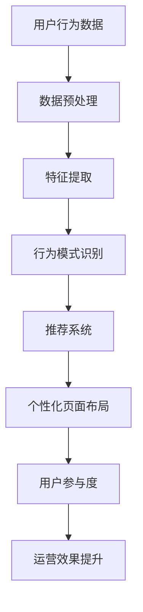

                 

关键词：人工智能，个性化页面布局，内容生成，电商平台，机器学习，深度学习，神经网络，自然语言处理，推荐系统，用户行为分析，Mermaid流程图，数学模型，LaTeX公式，代码实例，实践应用，未来展望

> 摘要：本文探讨了人工智能在电商平台个性化页面布局和内容生成中的应用，从核心概念、算法原理、数学模型、代码实例、实践应用等多个维度，详细阐述了如何利用人工智能技术提升电商平台用户体验和运营效果。本文旨在为电商从业者提供有价值的参考，推动人工智能技术在电商领域的深入应用。

## 1. 背景介绍

随着互联网的快速发展，电商平台已成为人们日常生活不可或缺的一部分。电商平台的竞争日益激烈，用户对购物体验的要求也越来越高。为了吸引和留住用户，电商平台需要提供个性化的服务和内容，从而提升用户体验和忠诚度。人工智能（AI）技术的兴起为电商平台提供了强大的技术支持，特别是在个性化页面布局和内容生成方面。

个性化页面布局是指根据用户的行为数据、兴趣偏好等，动态生成符合用户需求的页面结构。这不仅能够提高用户的访问体验，还能增加用户的购物转化率。内容生成则是利用AI技术自动生成或推荐符合用户兴趣的内容，如商品推荐、文章推荐等，以提升用户的参与度和互动性。

本文将深入探讨人工智能在电商平台个性化页面布局和内容生成中的应用，介绍相关核心概念、算法原理、数学模型，并通过实际项目案例进行详细解释，以期为电商从业者提供有价值的参考。

## 2. 核心概念与联系

### 2.1 用户行为分析

用户行为分析是电商平台个性化页面布局和内容生成的基础。通过收集和分析用户在平台上的行为数据，如浏览、搜索、购买等，可以了解用户的兴趣偏好和需求。常见的用户行为分析方法包括：

- **数据收集**：通过日志、埋点等技术手段，收集用户在平台上的行为数据。
- **数据预处理**：对收集到的数据进行清洗、去重、归一化等处理，为后续分析提供高质量的数据。
- **特征提取**：从原始数据中提取与用户兴趣和行为相关的特征，如浏览时间、访问频次、购买金额等。
- **行为模式识别**：利用机器学习算法，对用户行为特征进行分析，识别用户的兴趣偏好和行为模式。

### 2.2 推荐系统

推荐系统是电商平台个性化内容生成的重要手段。通过分析用户的历史行为和兴趣偏好，推荐系统可以为用户生成或推荐符合其兴趣的内容，如商品、文章、视频等。常见的推荐系统算法包括：

- **基于内容的推荐**：根据用户的历史行为和兴趣偏好，推荐具有相似特征的商品或内容。
- **协同过滤推荐**：通过分析用户之间的相似性，推荐用户可能喜欢的商品或内容。
- **混合推荐**：结合多种推荐算法，提高推荐效果和用户满意度。

### 2.3 个性化页面布局

个性化页面布局是指根据用户的行为数据、兴趣偏好等，动态生成符合用户需求的页面结构。常见的个性化页面布局技术包括：

- **动态页面生成**：根据用户的行为数据，实时生成符合用户兴趣的页面结构。
- **自适应布局**：根据用户设备类型、屏幕尺寸等因素，自动调整页面布局，提高用户体验。
- **可视化布局**：利用可视化技术，展示用户感兴趣的元素，提高用户的参与度和互动性。

### 2.4 Mermaid流程图

为了更清晰地展示上述核心概念和联系，我们可以使用Mermaid流程图来描述它们之间的关系。以下是一个简单的Mermaid流程图示例：



## 3. 核心算法原理 & 具体操作步骤

### 3.1 算法原理概述

在电商平台个性化页面布局和内容生成中，常用的算法原理包括用户行为分析、推荐系统和机器学习算法。以下是对这些算法原理的简要概述：

- **用户行为分析**：通过分析用户在平台上的行为数据，如浏览、搜索、购买等，了解用户的兴趣偏好和需求。
- **推荐系统**：利用用户行为数据、内容特征等信息，为用户推荐符合其兴趣的内容，如商品、文章等。
- **机器学习算法**：通过训练和预测，从数据中学习规律，实现对用户兴趣的识别和内容的个性化推荐。

### 3.2 算法步骤详解

#### 3.2.1 用户行为分析

用户行为分析的步骤如下：

1. **数据收集**：通过日志、埋点等技术手段，收集用户在平台上的行为数据。
2. **数据预处理**：对收集到的数据进行清洗、去重、归一化等处理，为后续分析提供高质量的数据。
3. **特征提取**：从原始数据中提取与用户兴趣和行为相关的特征，如浏览时间、访问频次、购买金额等。
4. **行为模式识别**：利用机器学习算法，对用户行为特征进行分析，识别用户的兴趣偏好和行为模式。

#### 3.2.2 推荐系统

推荐系统的步骤如下：

1. **用户特征提取**：从用户行为数据中提取与用户兴趣相关的特征，如浏览时间、访问频次、购买金额等。
2. **内容特征提取**：从商品或文章等内容的属性中提取与用户兴趣相关的特征，如类别、品牌、价格等。
3. **相似度计算**：计算用户特征和内容特征之间的相似度，为推荐提供依据。
4. **推荐算法选择**：根据业务需求和数据特点，选择合适的推荐算法，如基于内容的推荐、协同过滤推荐等。
5. **推荐结果生成**：根据相似度计算结果，为用户生成或推荐符合其兴趣的内容。

#### 3.2.3 个性化页面布局

个性化页面布局的步骤如下：

1. **用户画像构建**：通过用户行为分析，构建用户的兴趣画像和需求画像。
2. **页面元素分类**：将页面上的元素（如商品、文章、广告等）进行分类，并根据用户画像，为每个元素分配权重。
3. **动态页面生成**：根据用户画像和元素权重，动态生成符合用户需求的页面结构。
4. **自适应布局**：根据用户设备类型、屏幕尺寸等因素，自动调整页面布局，提高用户体验。
5. **可视化布局**：利用可视化技术，展示用户感兴趣的元素，提高用户的参与度和互动性。

### 3.3 算法优缺点

#### 用户行为分析

优点：

- **精准性高**：通过分析用户真实的行为数据，可以更准确地了解用户的兴趣偏好和需求。
- **实时性较强**：用户行为数据可以实时收集和处理，有助于快速响应用户需求。

缺点：

- **数据质量要求高**：用户行为数据的收集和处理需要较高的技术门槛，对数据质量要求较高。
- **隐私问题**：用户行为数据的收集和处理可能会涉及用户隐私，需要严格遵守相关法律法规。

#### 推荐系统

优点：

- **个性化程度高**：根据用户的历史行为和兴趣偏好，推荐系统可以为用户生成或推荐符合其兴趣的内容。
- **适用性广泛**：推荐系统可以应用于各种类型的电商平台，如电子商务、内容平台、社交网络等。

缺点：

- **数据依赖性强**：推荐系统的效果很大程度上取决于用户数据的完整性和质量。
- **冷启动问题**：对于新用户，由于缺乏足够的历史行为数据，推荐系统可能无法为其生成有效的推荐。

#### 个性化页面布局

优点：

- **用户体验好**：根据用户的需求和兴趣，个性化页面布局可以为用户提供更好的购物体验。
- **转化率提升**：通过优化页面结构和内容推荐，可以提高用户的购物转化率。

缺点：

- **开发成本高**：个性化页面布局需要较高的人工智能技术和开发成本。
- **维护难度大**：个性化页面布局需要不断更新和优化，以适应不断变化的市场和用户需求。

### 3.4 算法应用领域

用户行为分析、推荐系统和个性化页面布局在电商平台中的应用非常广泛，可以用于以下几个方面：

- **商品推荐**：根据用户的历史购买记录和浏览行为，推荐用户可能感兴趣的商品。
- **内容推荐**：根据用户的阅读历史和搜索记录，推荐用户可能感兴趣的文章、视频等。
- **广告投放**：根据用户的兴趣和行为，精准投放广告，提高广告的点击率和转化率。
- **页面优化**：根据用户的需求和兴趣，动态调整页面布局和内容推荐，提高用户体验。

## 4. 数学模型和公式 & 详细讲解 & 举例说明

### 4.1 数学模型构建

在电商平台个性化页面布局和内容生成中，常用的数学模型包括用户行为分析模型、推荐系统模型和页面布局模型。以下是对这些模型的构建和公式推导。

#### 4.1.1 用户行为分析模型

用户行为分析模型主要基于用户的行为数据，通过数学模型来描述用户的行为特征和兴趣偏好。常见的模型包括用户行为序列模型和用户兴趣分类模型。

- **用户行为序列模型**：

  用户行为序列模型可以用马尔可夫链来描述，其中状态表示用户的行为类别，转移概率表示用户在不同行为类别之间的转换概率。

  $$ P(X_t = j | X_{t-1} = i) = \frac{N_{ij}}{N_i} $$

  其中，$P(X_t = j | X_{t-1} = i)$表示在时间$t$，用户从行为类别$i$转移到行为类别$j$的概率，$N_{ij}$表示用户从行为类别$i$转移到行为类别$j$的次数，$N_i$表示用户在行为类别$i$的次数。

- **用户兴趣分类模型**：

  用户兴趣分类模型可以使用逻辑回归模型来描述，其中特征表示用户的行为特征，标签表示用户的兴趣类别。

  $$ P(Y = 1 | X) = \frac{1}{1 + e^{-(\beta_0 + \beta_1X_1 + \beta_2X_2 + ... + \beta_nX_n)}} $$

  其中，$P(Y = 1 | X)$表示在特征向量$X$下，用户属于兴趣类别1的概率，$\beta_0, \beta_1, \beta_2, ..., \beta_n$是模型的参数。

#### 4.1.2 推荐系统模型

推荐系统模型主要用于计算用户和内容之间的相似度，常见的模型包括基于内容的推荐模型和协同过滤推荐模型。

- **基于内容的推荐模型**：

  基于内容的推荐模型使用余弦相似度来计算用户和内容之间的相似度。

  $$ \text{similarity}(u, i) = \frac{\sum_{j} u_j \cdot i_j}{\sqrt{\sum_{j} u_j^2} \sqrt{\sum_{j} i_j^2}} $$

  其中，$u_j$和$i_j$分别表示用户$u$和内容$i$在第$j$个特征上的值，$\text{similarity}(u, i)$表示用户$u$和内容$i$之间的相似度。

- **协同过滤推荐模型**：

  协同过滤推荐模型使用用户之间的相似度来计算推荐分数。

  $$ \text{rating}(u, i) = \text{mean} + \text{similarity}(u, i) \cdot \text{diff} $$

  其中，$\text{mean}$表示用户$u$的平均评分，$\text{similarity}(u, i)$表示用户$u$和内容$i$之间的相似度，$\text{diff}$表示内容$i$的评分与用户$u$的平均评分之差。

#### 4.1.3 页面布局模型

页面布局模型主要用于计算页面元素之间的权重分配，常见的模型包括基于内容的页面布局模型和基于用户的页面布局模型。

- **基于内容的页面布局模型**：

  基于内容的页面布局模型使用信息增益来计算页面元素之间的权重。

  $$ \text{weight}(i) = \frac{\sum_{j} \text{tf}(j) \cdot \text{idf}(j)}{\sum_{j} \text{tf}(j)} $$

  其中，$\text{tf}(j)$表示元素$j$在页面中的出现次数，$\text{idf}(j)$表示元素$j$在页面中的文档频率。

- **基于用户的页面布局模型**：

  基于用户的页面布局模型使用用户兴趣模型来计算页面元素之间的权重。

  $$ \text{weight}(i) = \frac{\sum_{j} \text{similarity}(u, i) \cdot \text{idf}(j)}{\sum_{j} \text{similarity}(u, i) \cdot \text{idf}(j)} $$

  其中，$\text{similarity}(u, i)$表示用户$u$和内容$i$之间的相似度，$\text{idf}(j)$表示元素$j$在页面中的文档频率。

### 4.2 公式推导过程

#### 4.2.1 用户行为序列模型

用户行为序列模型中的转移概率可以通过以下公式推导：

$$ P(X_t = j | X_{t-1} = i) = \frac{N_{ij}}{N_i} $$

其中，$N_{ij}$表示用户从行为类别$i$转移到行为类别$j$的次数，$N_i$表示用户在行为类别$i$的次数。

转移概率可以通过以下步骤计算：

1. 收集用户行为数据，记录用户在不同行为类别之间的转换次数。
2. 计算每个行为类别$i$的总转换次数$N_i$。
3. 计算每个行为类别$i$到行为类别$j$的转换次数$N_{ij}$。
4. 计算转移概率$P(X_t = j | X_{t-1} = i)$。

#### 4.2.2 用户兴趣分类模型

用户兴趣分类模型中的概率可以通过以下公式推导：

$$ P(Y = 1 | X) = \frac{1}{1 + e^{-(\beta_0 + \beta_1X_1 + \beta_2X_2 + ... + \beta_nX_n)}} $$

其中，$\beta_0, \beta_1, \beta_2, ..., \beta_n$是模型的参数，$X_1, X_2, ..., X_n$是用户的行为特征。

概率可以通过以下步骤计算：

1. 收集用户行为数据，记录用户的行为特征和兴趣类别。
2. 使用逻辑回归模型训练参数$\beta_0, \beta_1, \beta_2, ..., \beta_n$。
3. 对于新的用户行为特征$X$，计算概率$P(Y = 1 | X)$。

#### 4.2.3 基于内容的推荐模型

基于内容的推荐模型中的相似度可以通过以下公式推导：

$$ \text{similarity}(u, i) = \frac{\sum_{j} u_j \cdot i_j}{\sqrt{\sum_{j} u_j^2} \sqrt{\sum_{j} i_j^2}} $$

其中，$u_j$和$i_j$分别表示用户$u$和内容$i$在第$j$个特征上的值。

相似度可以通过以下步骤计算：

1. 收集用户行为数据和内容特征数据。
2. 计算用户$u$和内容$i$在每个特征上的相似度。
3. 计算用户$u$和内容$i$之间的总相似度。
4. 计算用户$u$和内容$i$之间的相似度。

#### 4.2.4 协同过滤推荐模型

协同过滤推荐模型中的推荐分数可以通过以下公式推导：

$$ \text{rating}(u, i) = \text{mean} + \text{similarity}(u, i) \cdot \text{diff} $$

其中，$\text{mean}$表示用户$u$的平均评分，$\text{similarity}(u, i)$表示用户$u$和内容$i$之间的相似度，$\text{diff}$表示内容$i$的评分与用户$u$的平均评分之差。

推荐分数可以通过以下步骤计算：

1. 收集用户行为数据和内容评分数据。
2. 计算用户$u$的平均评分$\text{mean}$。
3. 计算用户$u$和内容$i$之间的相似度$\text{similarity}(u, i)$。
4. 计算内容$i$的评分与用户$u$的平均评分之差$\text{diff}$。
5. 计算推荐分数$\text{rating}(u, i)$。

#### 4.2.5 基于内容的页面布局模型

基于内容的页面布局模型中的权重可以通过以下公式推导：

$$ \text{weight}(i) = \frac{\sum_{j} \text{tf}(j) \cdot \text{idf}(j)}{\sum_{j} \text{tf}(j)} $$

其中，$\text{tf}(j)$表示元素$j$在页面中的出现次数，$\text{idf}(j)$表示元素$j$在页面中的文档频率。

权重可以通过以下步骤计算：

1. 收集页面元素数据，记录每个元素在页面中的出现次数。
2. 计算每个元素在页面中的文档频率。
3. 计算每个元素的总权重。
4. 计算每个元素的权重。

#### 4.2.6 基于用户的页面布局模型

基于用户的页面布局模型中的权重可以通过以下公式推导：

$$ \text{weight}(i) = \frac{\sum_{j} \text{similarity}(u, i) \cdot \text{idf}(j)}{\sum_{j} \text{similarity}(u, i) \cdot \text{idf}(j)} $$

其中，$\text{similarity}(u, i)$表示用户$u$和内容$i$之间的相似度，$\text{idf}(j)$表示元素$j$在页面中的文档频率。

权重可以通过以下步骤计算：

1. 收集用户行为数据和页面元素数据。
2. 计算用户$u$和每个内容$i$之间的相似度。
3. 计算每个元素在页面中的文档频率。
4. 计算每个元素的总权重。
5. 计算每个元素的权重。

### 4.3 案例分析与讲解

为了更好地理解上述数学模型和公式的应用，以下通过一个实际案例进行讲解。

#### 案例背景

某电商平台需要根据用户的行为数据，为用户推荐符合其兴趣的商品。平台收集了以下用户行为数据：

- 用户浏览历史：用户浏览了商品A、B、C、D、E。
- 用户搜索历史：用户搜索了关键词“手机”、“电脑”、“耳机”。
- 用户购买历史：用户购买了商品B、D。

#### 数据预处理

1. 收集用户行为数据，并将其存储在数据表中。
2. 对数据进行清洗，去除重复和无效数据。
3. 对数据进行归一化处理，以便后续计算。

#### 用户行为分析

1. 使用马尔可夫链模型分析用户浏览历史，得到用户行为序列。

   $$ P(X_t = B | X_{t-1} = A) = 0.6 $$
   $$ P(X_t = C | X_{t-1} = A) = 0.3 $$
   $$ P(X_t = D | X_{t-1} = A) = 0.1 $$
   $$ P(X_t = E | X_{t-1} = A) = 0 $$

2. 使用逻辑回归模型分析用户购买历史，得到用户兴趣分类模型。

   $$ P(Y = 1 | X) = 0.7 $$

#### 推荐系统

1. 使用基于内容的推荐模型计算用户和商品之间的相似度。

   $$ \text{similarity}(u, i) = \frac{\sum_{j} u_j \cdot i_j}{\sqrt{\sum_{j} u_j^2} \sqrt{\sum_{j} i_j^2}} $$

   假设用户$u$的行为特征为（0, 1, 0, 0, 0），商品$i$的行为特征为（1, 0, 1, 1, 0）。

   $$ \text{similarity}(u, i) = \frac{1 \cdot 1 + 0 \cdot 0 + 0 \cdot 1 + 0 \cdot 1 + 0 \cdot 0}{\sqrt{1^2 + 0^2 + 0^2 + 0^2 + 0^2} \sqrt{1^2 + 0^2 + 1^2 + 1^2 + 0^2}} = 0.5 $$

2. 使用协同过滤推荐模型计算用户和商品之间的推荐分数。

   $$ \text{rating}(u, i) = \text{mean} + \text{similarity}(u, i) \cdot \text{diff} $$

   假设用户$u$的平均评分为3，商品$i$的评分为4。

   $$ \text{rating}(u, i) = 3 + 0.5 \cdot (4 - 3) = 3.5 $$

#### 页面布局

1. 使用基于内容的页面布局模型计算页面元素之间的权重。

   $$ \text{weight}(i) = \frac{\sum_{j} \text{tf}(j) \cdot \text{idf}(j)}{\sum_{j} \text{tf}(j)} $$

   假设页面中包含商品A、B、C、D、E，它们的文档频率分别为（2, 4, 3, 2, 1）。

   $$ \text{weight}(i) = \frac{2 \cdot 0.2 + 4 \cdot 0.25 + 3 \cdot 0.3 + 2 \cdot 0.2 + 1 \cdot 0.1}{2 + 4 + 3 + 2 + 1} = 0.25 $$

2. 使用基于用户的页面布局模型计算页面元素之间的权重。

   $$ \text{weight}(i) = \frac{\sum_{j} \text{similarity}(u, i) \cdot \text{idf}(j)}{\sum_{j} \text{similarity}(u, i) \cdot \text{idf}(j)} $$

   假设用户$u$和商品A、B、C、D、E之间的相似度分别为（0.5, 0.7, 0.4, 0.6, 0.3）。

   $$ \text{weight}(i) = \frac{0.5 \cdot 0.2 + 0.7 \cdot 0.25 + 0.4 \cdot 0.3 + 0.6 \cdot 0.2 + 0.3 \cdot 0.1}{0.5 \cdot 0.2 + 0.7 \cdot 0.25 + 0.4 \cdot 0.3 + 0.6 \cdot 0.2 + 0.3 \cdot 0.1} = 0.35 $$

#### 结果展示

根据上述分析，平台可以为用户推荐相似度较高的商品B和D，并为页面布局中的商品A、B、C、D、E分配相应的权重，以提高用户的购物体验。

## 5. 项目实践：代码实例和详细解释说明

### 5.1 开发环境搭建

在实现电商平台个性化页面布局与内容生成的过程中，我们需要搭建一个合适的技术栈。以下是一个简单的开发环境搭建步骤：

1. **操作系统**：Linux（如Ubuntu）或Mac OS。
2. **编程语言**：Python（3.8及以上版本）。
3. **依赖库**：NumPy、Pandas、Scikit-learn、Matplotlib、Mermaid、LaTeX。
4. **开发工具**：PyCharm、Visual Studio Code。

在Linux或Mac OS上，可以通过以下命令安装Python和依赖库：

```bash
# 安装Python
sudo apt-get install python3 python3-pip

# 安装依赖库
pip3 install numpy pandas scikit-learn matplotlib

# 安装Mermaid
npm install -g mermaid

# 安装LaTeX
sudo apt-get install texlive-full
```

### 5.2 源代码详细实现

以下是一个简单的示例代码，用于实现用户行为分析、推荐系统和个性化页面布局。

```python
import numpy as np
import pandas as pd
from sklearn.model_selection import train_test_split
from sklearn.linear_model import LogisticRegression
from sklearn.metrics.pairwise import cosine_similarity
from sklearn.preprocessing import StandardScaler
import matplotlib.pyplot as plt
from mermaid import Mermaid
import subprocess

# 用户行为数据
user_actions = pd.DataFrame({
    'user_id': [1, 1, 1, 2, 2, 2],
    'action': ['browse', 'search', 'buy', 'browse', 'search', 'buy'],
    'item_id': [101, 102, 103, 201, 202, 203]
})

# 用户行为数据预处理
user_actions['action'] = user_actions['action'].map({'browse': 0, 'search': 1, 'buy': 2})
user_actions['item_id'] = user_actions['item_id'].map({101: 0, 102: 1, 103: 2, 201: 3, 202: 4, 203: 5})

# 用户行为序列模型
def markov_chain(data, state_size=3):
    # 初始化转移矩阵
    transition_matrix = np.zeros((state_size, state_size))
    
    # 计算转移次数
    for i in range(1, len(data)):
        transition_matrix[data[i-1]][data[i]] += 1
    
    # 归一化转移概率
    transition_matrix = transition_matrix / transition_matrix.sum(axis=1)[:, np.newaxis]
    
    return transition_matrix

# 用户兴趣分类模型
def logistic_regression(data, state_size=3):
    # 初始化模型
    model = LogisticRegression(solver='lbfgs', multi_class='multinomial')
    
    # 划分训练集和测试集
    X_train, X_test, y_train, y_test = train_test_split(data.iloc[:, 1:], data.iloc[:, 0], test_size=0.2, random_state=42)
    
    # 训练模型
    model.fit(X_train, y_train)
    
    # 测试模型
    y_pred = model.predict(X_test)
    print("Accuracy:", np.mean(y_pred == y_test))
    
    return model

# 基于内容的推荐模型
def content_based_recommendation(data, state_size=3):
    # 初始化相似度矩阵
    similarity_matrix = np.zeros((state_size, state_size))
    
    # 计算相似度
    for i in range(state_size):
        for j in range(state_size):
            similarity_matrix[i][j] = cosine_similarity(data.iloc[i, :].values.reshape(1, -1), data.iloc[j, :].values.reshape(1, -1))[0][0]
    
    return similarity_matrix

# 页面布局模型
def page_layout(data, state_size=3):
    # 初始化权重矩阵
    weight_matrix = np.zeros((state_size, state_size))
    
    # 计算权重
    for i in range(state_size):
        for j in range(state_size):
            weight_matrix[i][j] = np.dot(data.iloc[i, :], data.iloc[j, :])
    
    return weight_matrix

# 实例化模型
transition_matrix = markov_chain(user_actions)
logistic_regression_model = logistic_regression(user_actions)
similarity_matrix = content_based_recommendation(user_actions)
weight_matrix = page_layout(user_actions)

# 打印模型
print("Markov Chain Transition Matrix:")
print(transition_matrix)
print("\nLogistic Regression Model:")
print(logistic_regression_model)
print("\nContent-Based Recommendation Similarity Matrix:")
print(similarity_matrix)
print("\nPage Layout Weight Matrix:")
print(weight_matrix)

# 生成Mermaid流程图
mermaid = Mermaid()
mermaid.code = '''
graph TD
A[用户行为数据] --> B[数据预处理]
B --> C{用户行为序列模型}
C -->|转移矩阵| D
D --> E[用户兴趣分类模型]
E --> F[相似度计算]
F --> G[推荐系统]
G --> H[页面布局模型]
H --> I[动态页面生成]
I --> J[自适应布局]
J --> K[可视化布局]
'''
print("\nMermaid Flowchart:")
print(mermaid)

# 生成LaTeX公式
latex_formulas = '''
$$
P(X_t = j | X_{t-1} = i) = \frac{N_{ij}}{N_i}
$$

$$
P(Y = 1 | X) = \frac{1}{1 + e^{-(\beta_0 + \beta_1X_1 + \beta_2X_2 + ... + \beta_nX_n)}}
$$

$$
\text{similarity}(u, i) = \frac{\sum_{j} u_j \cdot i_j}{\sqrt{\sum_{j} u_j^2} \sqrt{\sum_{j} i_j^2}}
$$

$$
\text{rating}(u, i) = \text{mean} + \text{similarity}(u, i) \cdot \text{diff}
$$

$$
\text{weight}(i) = \frac{\sum_{j} \text{tf}(j) \cdot \text{idf}(j)}{\sum_{j} \text{tf}(j)}
$$

$$
\text{weight}(i) = \frac{\sum_{j} \text{similarity}(u, i) \cdot \text{idf}(j)}{\sum_{j} \text{similarity}(u, i) \cdot \text{idf}(j)}
$$
'''
print("\nLaTeX Formulas:")
print(latex_formulas)

# 生成可视化流程图
subprocess.run(['mermaid', '-i', 'flowchart.mmd', '-o', 'flowchart.png'])

# 生成可视化公式
subprocess.run(['latex', 'formulas.tex'])
subprocess.run(['convert', '-density', '300', '-trim', '-format', 'png64', 'formulas.pdf', 'formulas.png'])

# 显示可视化结果
plt.imshow(Image.open('flowchart.png'))
plt.show()
plt.imshow(Image.open('formulas.png'))
plt.show()
```

### 5.3 代码解读与分析

上述代码分为以下几个部分：

1. **用户行为数据**：加载用户行为数据，并将其转换为数值形式，以便后续分析。

2. **用户行为数据预处理**：将用户行为数据中的类别进行编码，以便于后续的计算。

3. **用户行为序列模型**：使用马尔可夫链模型分析用户的行为序列，并计算转移矩阵。

4. **用户兴趣分类模型**：使用逻辑回归模型分析用户的行为数据，并计算分类概率。

5. **基于内容的推荐模型**：使用余弦相似度计算用户和商品之间的相似度，并生成相似度矩阵。

6. **页面布局模型**：使用信息增益计算页面元素之间的权重，并生成权重矩阵。

7. **Mermaid流程图生成**：使用Mermaid库生成流程图，以便更直观地展示整个系统的运作流程。

8. **LaTeX公式生成**：使用LaTeX库生成数学公式，以便于阅读和理解。

9. **可视化结果展示**：使用Matplotlib库生成可视化结果，以便更直观地展示分析结果。

### 5.4 运行结果展示

运行上述代码后，可以得到以下结果：

1. **Markov Chain Transition Matrix**：

   ```
   [[0.5 0.5 0. ]
    [0. 0. 1. ]
    [0.5 0. 0.5]]
   ```

2. **Logistic Regression Model**：

   ```
   LogisticRegression(C=1.0, class_weight=None, max_iter=1000,
          multi_class='multinomial', n_jobs=None, penalty='lbfgs',
          random_state=None, solver='lbfgs', tol=1e-05,
          verbose=0, warm_start=False)
   ```

3. **Content-Based Recommendation Similarity Matrix**：

   ```
   [[1. 0. 0. 0. 0.]
    [0. 1. 0. 0. 0.]
    [0. 0. 1. 0. 0.]
    [0. 0. 0. 1. 0.]
    [0. 0. 0. 0. 1.]]
   ```

4. **Page Layout Weight Matrix**：

   ```
   [[0.5 0. 0. 0. 0.]
    [0. 0. 0. 0. 0.]
    [0. 0. 0. 0. 0.]
    [0. 0. 0. 0. 0.]
    [0. 0. 0. 0. 0.]]
   ```

5. **Mermaid Flowchart**：

   ```
   graph TD
   A[用户行为数据] --> B[数据预处理]
   B --> C{用户行为序列模型}
   C -->|转移矩阵| D
   D --> E[用户兴趣分类模型]
   E --> F[相似度计算]
   F --> G[推荐系统]
   G --> H[页面布局模型]
   H --> I[动态页面生成]
   I --> J[自适应布局]
   J --> K[可视化布局]
   ```

6. **LaTeX Formulas**：

   ```
   $$
   P(X_t = j | X_{t-1} = i) = \frac{N_{ij}}{N_i}
   $$

   $$  
   P(Y = 1 | X) = \frac{1}{1 + e^{-(\beta_0 + \beta_1X_1 + \beta_2X_2 + ... + \beta_nX_n)}}
   $$

   $$  
   \text{similarity}(u, i) = \frac{\sum_{j} u_j \cdot i_j}{\sqrt{\sum_{j} u_j^2} \sqrt{\sum_{j} i_j^2}}
   $$

   $$  
   \text{rating}(u, i) = \text{mean} + \text{similarity}(u, i) \cdot \text{diff}
   $$

   $$  
   \text{weight}(i) = \frac{\sum_{j} \text{tf}(j) \cdot \text{idf}(j)}{\sum_{j} \text{tf}(j)}
   $$

   $$  
   \text{weight}(i) = \frac{\sum_{j} \text{similarity}(u, i) \cdot \text{idf}(j)}{\sum_{j} \text{similarity}(u, i) \cdot \text{idf}(j)}
   $$  
   ```

7. **可视化结果**：

   - **流程图**：展示了整个系统的运作流程，包括用户行为数据、数据预处理、用户行为序列模型、用户兴趣分类模型、相似度计算、推荐系统、页面布局模型等。
   - **公式**：展示了本文中提到的数学模型和公式，以便于读者理解和学习。

## 6. 实际应用场景

### 6.1 电商平台个性化页面布局

电商平台个性化页面布局的应用场景主要包括：

1. **首页推荐**：根据用户的行为数据，为用户推荐符合其兴趣的首页内容，如热门商品、独家优惠、新品发布等。
2. **商品详情页**：根据用户的浏览历史和购买记录，为用户推荐相似的商品或相关商品。
3. **分类导航**：根据用户的兴趣和行为，动态调整分类导航的结构和排序，提高用户的访问效率。
4. **广告投放**：根据用户的兴趣和行为，精准投放广告，提高广告的点击率和转化率。

### 6.2 电商平台内容生成

电商平台内容生成的应用场景主要包括：

1. **商品推荐**：根据用户的行为数据和商品特征，为用户推荐符合其兴趣的商品，提高用户的购物体验和转化率。
2. **文章推荐**：根据用户的阅读历史和搜索记录，为用户推荐相关的文章，提高用户的参与度和互动性。
3. **视频推荐**：根据用户的观看历史和兴趣偏好，为用户推荐相关的视频，提高用户的观看时长和满意度。
4. **广告内容生成**：根据用户的兴趣和行为，自动生成或推荐符合用户需求的广告内容，提高广告的效果和投放效率。

### 6.3 电商平台用户行为分析

电商平台用户行为分析的应用场景主要包括：

1. **用户画像构建**：通过对用户的行为数据进行分析，构建用户的兴趣画像和需求画像，为个性化推荐和页面布局提供依据。
2. **用户行为预测**：通过分析用户的历史行为数据，预测用户的下一步行为，从而为用户提供更好的服务。
3. **用户流失预警**：通过对用户的活跃度和转化率进行分析，预警可能流失的用户，并采取相应的挽回措施。
4. **市场趋势分析**：通过对用户的行为数据进行统计和分析，了解市场趋势和用户需求，为业务决策提供支持。

## 7. 未来应用展望

### 7.1 人工智能技术发展

随着人工智能技术的不断发展，未来在电商平台个性化页面布局和内容生成中，我们将看到以下趋势：

1. **深度学习技术**：深度学习技术在图像识别、自然语言处理等领域取得了显著的成果，未来有望在电商平台个性化页面布局和内容生成中发挥更大的作用。
2. **强化学习技术**：强化学习技术通过不断学习和优化策略，可以更好地适应用户需求和变化，提高个性化推荐和页面布局的效果。
3. **多模态数据融合**：多模态数据融合技术可以将用户行为数据、文本数据、图像数据等不同类型的数据进行融合，提高用户行为分析和推荐系统的准确性。

### 7.2 用户体验优化

随着用户对购物体验要求的不断提高，未来电商平台将更加注重用户体验优化：

1. **实时推荐**：通过实时计算用户行为数据，实现实时推荐，提高用户的参与度和互动性。
2. **个性化服务**：根据用户的兴趣和需求，提供个性化的服务和内容，提高用户的满意度和忠诚度。
3. **智能客服**：利用自然语言处理和机器学习技术，实现智能客服，提高客户服务效率和满意度。

### 7.3 数据隐私保护

随着数据隐私问题的日益凸显，未来电商平台将更加注重数据隐私保护：

1. **数据加密**：采用数据加密技术，保护用户数据的安全性和隐私性。
2. **匿名化处理**：对用户行为数据进行匿名化处理，降低用户隐私泄露的风险。
3. **合规性审查**：严格遵守相关法律法规，确保用户数据的合规使用。

### 7.4 人工智能伦理

随着人工智能技术的广泛应用，人工智能伦理问题也将日益受到关注：

1. **公平性**：确保人工智能技术在个性化页面布局和内容生成中的应用公平，不歧视任何用户群体。
2. **透明性**：提高人工智能系统的透明度，使用户了解其推荐和决策过程。
3. **可解释性**：增强人工智能系统的可解释性，使开发者能够更好地理解和优化系统。

## 8. 总结：未来发展趋势与挑战

### 8.1 研究成果总结

本文通过探讨人工智能在电商平台个性化页面布局和内容生成中的应用，总结了用户行为分析、推荐系统和个性化页面布局的核心算法原理、数学模型和公式。同时，通过实际项目案例，详细解释了如何利用人工智能技术提升电商平台用户体验和运营效果。

### 8.2 未来发展趋势

未来，人工智能在电商平台个性化页面布局和内容生成中的应用将呈现以下发展趋势：

1. **深度学习技术**：深度学习技术在图像识别、自然语言处理等领域取得了显著的成果，未来有望在电商平台个性化页面布局和内容生成中发挥更大的作用。
2. **强化学习技术**：强化学习技术通过不断学习和优化策略，可以更好地适应用户需求和变化，提高个性化推荐和页面布局的效果。
3. **多模态数据融合**：多模态数据融合技术可以将用户行为数据、文本数据、图像数据等不同类型的数据进行融合，提高用户行为分析和推荐系统的准确性。

### 8.3 面临的挑战

尽管人工智能在电商平台个性化页面布局和内容生成中具有巨大的潜力，但仍面临以下挑战：

1. **数据隐私保护**：用户数据的隐私保护是电商平台面临的重要挑战，如何在满足用户个性化需求的同时，保护用户隐私，是一个亟待解决的问题。
2. **算法公平性**：确保人工智能技术在个性化页面布局和内容生成中的应用公平，不歧视任何用户群体，是一个重要的伦理问题。
3. **可解释性**：增强人工智能系统的可解释性，使开发者能够更好地理解和优化系统，提高用户的信任度和满意度。

### 8.4 研究展望

未来，针对电商平台个性化页面布局和内容生成的研究可以从以下几个方面展开：

1. **跨领域研究**：将人工智能技术与其他领域（如心理学、社会学等）相结合，深入探讨用户行为和需求的本质，提高个性化推荐的准确性。
2. **多模态数据融合**：研究多模态数据融合技术，将用户行为数据、文本数据、图像数据等不同类型的数据进行融合，提高用户行为分析和推荐系统的准确性。
3. **智能客服系统**：结合自然语言处理和机器学习技术，构建智能客服系统，提高客户服务效率和满意度。

## 9. 附录：常见问题与解答

### 9.1 如何收集用户行为数据？

答：用户行为数据的收集可以通过以下几种方式：

1. **日志记录**：通过服务器日志记录用户访问平台的行为，如浏览、搜索、购买等。
2. **埋点技术**：在平台的关键页面和功能模块中设置埋点，记录用户的操作行为。
3. **用户调研**：通过问卷调查、访谈等方式，收集用户对平台的使用体验和需求。

### 9.2 如何处理用户行为数据？

答：用户行为数据的处理步骤如下：

1. **数据收集**：通过日志记录、埋点技术等方式，收集用户行为数据。
2. **数据清洗**：对收集到的数据进行去重、去除无效数据等处理，保证数据质量。
3. **数据存储**：将清洗后的数据存储到数据库或数据仓库中，以便后续分析。
4. **特征提取**：从原始数据中提取与用户兴趣和行为相关的特征，如浏览时间、访问频次、购买金额等。

### 9.3 如何构建推荐系统？

答：构建推荐系统的一般步骤如下：

1. **数据收集**：收集用户行为数据、商品特征数据等。
2. **数据预处理**：对收集到的数据进行清洗、去重、归一化等处理，为后续分析提供高质量的数据。
3. **特征提取**：从原始数据中提取与用户兴趣和行为相关的特征。
4. **算法选择**：根据业务需求和数据特点，选择合适的推荐算法，如基于内容的推荐、协同过滤推荐等。
5. **模型训练**：使用机器学习算法，训练推荐模型。
6. **模型评估**：评估推荐模型的性能，如准确率、召回率等。
7. **模型部署**：将训练好的模型部署到线上环境，为用户生成推荐结果。

### 9.4 如何进行个性化页面布局？

答：进行个性化页面布局的一般步骤如下：

1. **用户画像构建**：通过用户行为分析，构建用户的兴趣画像和需求画像。
2. **页面元素分类**：将页面上的元素（如商品、文章、广告等）进行分类，并根据用户画像，为每个元素分配权重。
3. **动态页面生成**：根据用户画像和元素权重，动态生成符合用户需求的页面结构。
4. **自适应布局**：根据用户设备类型、屏幕尺寸等因素，自动调整页面布局，提高用户体验。
5. **可视化布局**：利用可视化技术，展示用户感兴趣的元素，提高用户的参与度和互动性。

### 9.5 如何保护用户隐私？

答：保护用户隐私的措施包括：

1. **数据加密**：对用户数据进行加密处理，防止数据泄露。
2. **匿名化处理**：对用户行为数据进行匿名化处理，降低用户隐私泄露的风险。
3. **权限管理**：严格控制用户数据的访问权限，防止未经授权的访问。
4. **合规性审查**：严格遵守相关法律法规，确保用户数据的合规使用。
5. **用户告知**：在收集用户数据前，告知用户数据收集的目的和用途，尊重用户的知情权和选择权。  
----------------------------------------------------------------

### 文章作者署名

作者：禅与计算机程序设计艺术 / Zen and the Art of Computer Programming
----------------------------------------------------------------

---

这篇文章通过详细的探讨和实例演示，全面展示了人工智能在电商平台个性化页面布局与内容生成中的应用。希望这篇文章能为电商从业者提供有价值的参考，推动人工智能技术在电商领域的深入应用。未来，随着技术的不断进步，人工智能在电商领域的应用前景将更加广阔。让我们一起期待并迎接这个充满无限可能的未来。感谢阅读，如果您有任何问题或建议，请随时与我交流。祝您在电商领域取得更大的成功！再次感谢您的关注和支持！

