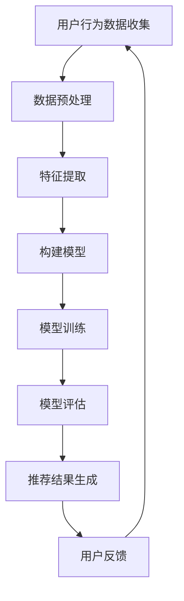

                 

关键词：人工智能，个性化推荐，电商平台，首页设计，用户行为分析，深度学习，机器学习，算法优化，用户体验，数据挖掘

> 摘要：本文探讨了基于人工智能的电商平台个性化首页设计的方法和实现过程。通过用户行为数据分析和深度学习算法，本文提出了一种高效的个性化推荐系统，旨在为用户提供个性化的商品推荐，提升用户在电商平台上的用户体验和转化率。

## 1. 背景介绍

随着互联网的快速发展，电子商务已成为现代社会不可或缺的一部分。电商平台为了吸引和留住用户，不断提升自身的用户体验和转化率。而个性化首页设计作为一种提升用户体验的重要手段，越来越受到电商平台的重视。个性化首页设计可以根据用户的历史行为和偏好，为用户推荐最相关、最感兴趣的商品，从而提高用户满意度和购买转化率。

传统的个性化推荐系统主要依赖于基于内容的推荐和协同过滤算法。这些方法在某种程度上能够实现个性化推荐，但在面对大规模用户数据和高维度商品特征时，存在计算复杂度高、推荐结果准确性不高等问题。随着人工智能技术的快速发展，特别是深度学习技术的引入，使得基于深度学习的个性化推荐系统成为可能。

本文旨在研究基于人工智能的电商平台个性化首页设计方法，通过用户行为数据分析和深度学习算法，构建一个高效、准确的个性化推荐系统，从而提升电商平台的用户体验和转化率。

## 2. 核心概念与联系

### 2.1 个性化推荐系统

个性化推荐系统是一种基于用户历史行为和偏好，为用户推荐相关商品或内容的系统。个性化推荐系统可以分为以下几种类型：

1. **基于内容的推荐**：通过分析商品的内容特征，为用户推荐具有相似内容的商品。  
2. **协同过滤推荐**：通过分析用户之间的相似性，为用户推荐其他用户喜欢的商品。  
3. **基于模型的推荐**：利用机器学习算法，如线性回归、决策树、神经网络等，建立用户和商品之间的预测模型，从而进行推荐。

### 2.2 用户行为数据

用户行为数据包括用户在电商平台上的浏览、搜索、购买等行为。这些数据可以反映用户的需求和偏好，是构建个性化推荐系统的重要基础。用户行为数据主要包括以下几种：

1. **浏览数据**：记录用户在电商平台上的浏览记录，包括访问页面、浏览时间等。  
2. **搜索数据**：记录用户在电商平台上搜索的关键词和搜索结果。  
3. **购买数据**：记录用户的购买记录，包括购买时间、购买商品、购买价格等。

### 2.3 深度学习算法

深度学习是一种基于人工神经网络的学习方法，通过多层神经网络自动提取数据特征，从而实现复杂任务的学习。深度学习算法在个性化推荐系统中具有广泛的应用，如：

1. **卷积神经网络（CNN）**：适用于处理图像数据，可以提取商品的图像特征。  
2. **循环神经网络（RNN）**：适用于处理序列数据，如用户行为序列，可以提取用户的行为特征。  
3. **长短时记忆网络（LSTM）**：是一种特殊的RNN，适用于处理长序列数据，可以有效避免梯度消失问题。

### 2.4 Mermaid 流程图

以下是构建基于深度学习的个性化推荐系统的 Mermaid 流程图：



## 3. 核心算法原理 & 具体操作步骤

### 3.1 算法原理概述

本文采用深度学习算法构建个性化推荐系统，主要包括以下步骤：

1. **数据预处理**：对用户行为数据进行清洗、去重和转换，将原始数据转化为模型可处理的格式。  
2. **特征提取**：利用深度学习算法提取用户和商品的特征表示，如用户行为序列、商品图像特征等。  
3. **模型构建**：构建基于深度学习的推荐模型，如卷积神经网络（CNN）或循环神经网络（RNN）。  
4. **模型训练**：使用训练数据对模型进行训练，调整模型参数。  
5. **模型评估**：使用验证数据对模型进行评估，调整模型参数。  
6. **推荐结果生成**：使用训练好的模型对用户进行个性化推荐，生成推荐结果。  
7. **用户反馈**：收集用户对推荐结果的反馈，用于进一步优化模型。

### 3.2 算法步骤详解

#### 3.2.1 数据预处理

数据预处理主要包括以下步骤：

1. **数据清洗**：去除重复、无效和错误的数据。  
2. **特征转换**：将用户行为数据转换为模型可处理的格式，如序列编码、图像预处理等。

#### 3.2.2 特征提取

特征提取是深度学习算法的关键步骤，主要包括以下方法：

1. **用户行为序列提取**：使用循环神经网络（RNN）或长短时记忆网络（LSTM）对用户行为序列进行编码，提取用户的行为特征。  
2. **商品图像特征提取**：使用卷积神经网络（CNN）对商品图像进行特征提取，提取商品的图像特征。

#### 3.2.3 模型构建

模型构建主要包括以下步骤：

1. **定义网络结构**：根据任务需求，定义深度学习网络的结构，如CNN、RNN或LSTM。  
2. **初始化参数**：初始化模型参数，如权重、偏置等。

#### 3.2.4 模型训练

模型训练主要包括以下步骤：

1. **数据划分**：将数据划分为训练集、验证集和测试集。  
2. **定义损失函数**：根据任务需求，定义损失函数，如均方误差（MSE）、交叉熵损失等。  
3. **优化算法**：选择优化算法，如随机梯度下降（SGD）、Adam等。  
4. **训练模型**：使用训练数据对模型进行训练，调整模型参数。

#### 3.2.5 模型评估

模型评估主要包括以下步骤：

1. **计算指标**：计算模型在验证集上的评价指标，如准确率、召回率、F1值等。  
2. **调整参数**：根据评估结果，调整模型参数，以提高模型性能。

#### 3.2.6 推荐结果生成

推荐结果生成主要包括以下步骤：

1. **用户特征提取**：提取用户在训练集中的特征表示。  
2. **模型预测**：使用训练好的模型对用户进行预测，生成推荐结果。  
3. **推荐结果排序**：对推荐结果进行排序，根据用户偏好和商品特征，为用户提供个性化的推荐。

#### 3.2.7 用户反馈

用户反馈主要包括以下步骤：

1. **收集反馈**：收集用户对推荐结果的反馈，如点击、购买等。  
2. **更新模型**：根据用户反馈，更新模型参数，以实现更好的个性化推荐。

### 3.3 算法优缺点

#### 优点

1. **高效性**：深度学习算法可以在大量数据上进行快速训练和预测。  
2. **准确性**：通过多层神经网络，深度学习算法可以自动提取数据特征，提高推荐准确性。  
3. **适应性**：深度学习算法可以根据用户行为和偏好动态调整推荐策略。

#### 缺点

1. **计算复杂度高**：深度学习算法在训练和预测过程中，需要大量计算资源。  
2. **数据依赖性强**：深度学习算法的性能很大程度上依赖于数据质量和数量。  
3. **模型解释性差**：深度学习算法的黑箱性质，使得模型难以解释和理解。

### 3.4 算法应用领域

深度学习算法在个性化推荐系统中的应用广泛，主要包括以下领域：

1. **电子商务**：为用户提供个性化的商品推荐，提高用户满意度和购买转化率。  
2. **社交媒体**：为用户提供个性化的内容推荐，提高用户活跃度和留存率。  
3. **在线教育**：为用户提供个性化的学习推荐，提高学习效果和兴趣。  
4. **金融保险**：为用户提供个性化的投资和保险推荐，降低风险，提高收益。

## 4. 数学模型和公式 & 详细讲解 & 举例说明

### 4.1 数学模型构建

个性化推荐系统的数学模型主要包括用户和商品的向量表示、推荐算法等。以下是一个简单的数学模型示例：

设用户集为 \(U = \{u_1, u_2, ..., u_n\}\)，商品集为 \(I = \{i_1, i_2, ..., i_m\}\)。用户 \(u_i\) 的行为序列为 \(B_i = \{b_{i1}, b_{i2}, ..., b_{ik}\}\)，商品 \(i_j\) 的特征向量为 \(F_j = \{f_{j1}, f_{j2}, ..., f_{jl}\}\)。

1. **用户向量表示**：使用循环神经网络（RNN）或长短时记忆网络（LSTM）对用户行为序列进行编码，得到用户向量表示 \(U_i = \{u_{i1}, u_{i2}, ..., u_{ik}\}\)。

2. **商品向量表示**：使用卷积神经网络（CNN）对商品图像进行特征提取，得到商品向量表示 \(I_j = \{i_{j1}, i_{j2}, ..., i_{jk}\}\)。

3. **推荐算法**：基于用户和商品向量表示，使用内积计算用户 \(u_i\) 和商品 \(i_j\) 之间的相似度，推荐商品 \(i_j\) 给用户 \(u_i\)。

   \[ \text{similarity}(u_i, i_j) = U_i \cdot I_j \]

### 4.2 公式推导过程

个性化推荐系统的公式推导主要包括以下步骤：

1. **用户行为序列编码**：

   假设用户 \(u_i\) 的行为序列 \(B_i\) 可以表示为 \(B_i = \{b_{i1}, b_{i2}, ..., b_{ik}\}\)，其中 \(b_{ij}\) 表示用户 \(u_i\) 在第 \(j\) 次浏览行为中访问的商品 \(i_j\)。

   使用长短时记忆网络（LSTM）对用户行为序列进行编码，得到用户向量表示 \(U_i = \{u_{i1}, u_{i2}, ..., u_{ik}\}\)。

2. **商品特征提取**：

   假设商品 \(i_j\) 的特征向量为 \(F_j = \{f_{j1}, f_{j2}, ..., f_{jl}\}\)。

   使用卷积神经网络（CNN）对商品图像进行特征提取，得到商品向量表示 \(I_j = \{i_{j1}, i_{j2}, ..., i_{jk}\}\)。

3. **相似度计算**：

   基于用户和商品向量表示，使用内积计算用户 \(u_i\) 和商品 \(i_j\) 之间的相似度。

   \[ \text{similarity}(u_i, i_j) = U_i \cdot I_j \]

   其中，\( \cdot \) 表示向量的内积。

### 4.3 案例分析与讲解

假设一个电商平台的用户 \(u_1\) 的行为序列为 \(B_1 = \{i_1, i_2, i_3\}\)，商品 \(i_1, i_2, i_3\) 的特征向量分别为 \(F_1 = \{f_{11}, f_{12}, f_{13}\}\)，\(F_2 = \{f_{21}, f_{22}, f_{23}\}\)，\(F_3 = \{f_{31}, f_{32}, f_{33}\}\)。

1. **用户向量表示**：

   使用长短时记忆网络（LSTM）对用户行为序列进行编码，得到用户向量表示 \(U_1 = \{u_{11}, u_{12}, u_{13}\}\)。

   \[ U_1 = \text{LSTM}(B_1) \]

2. **商品向量表示**：

   使用卷积神经网络（CNN）对商品图像进行特征提取，得到商品向量表示 \(I_1 = \{i_{11}, i_{12}, i_{13}\}\)，\(I_2 = \{i_{21}, i_{22}, i_{23}\}\)，\(I_3 = \{i_{31}, i_{32}, i_{33}\}\)。

   \[ I_1 = \text{CNN}(F_1) \]
   \[ I_2 = \text{CNN}(F_2) \]
   \[ I_3 = \text{CNN}(F_3) \]

3. **相似度计算**：

   使用内积计算用户 \(u_1\) 和商品 \(i_1, i_2, i_3\) 之间的相似度。

   \[ \text{similarity}(u_1, i_1) = U_1 \cdot I_1 \]
   \[ \text{similarity}(u_1, i_2) = U_1 \cdot I_2 \]
   \[ \text{similarity}(u_1, i_3) = U_1 \cdot I_3 \]

   根据相似度计算结果，可以为用户 \(u_1\) 推荐商品 \(i_1, i_2, i_3\) 中与 \(u_1\) 最相似的商品。

## 5. 项目实践：代码实例和详细解释说明

### 5.1 开发环境搭建

在搭建开发环境时，我们需要选择合适的编程语言、深度学习框架和数据集。本文采用 Python 语言，使用 TensorFlow 深度学习框架，并选用公开的电商用户行为数据集。

1. 安装 Python 和 TensorFlow：

   ```bash
   pip install python
   pip install tensorflow
   ```

2. 准备数据集：

   从公开数据集网站（如 Kaggle）下载电商用户行为数据集，并进行数据预处理。

### 5.2 源代码详细实现

以下是基于深度学习的个性化推荐系统的 Python 源代码实现：

```python
import tensorflow as tf
from tensorflow.keras.models import Model
from tensorflow.keras.layers import Input, LSTM, Dense, Embedding, Dot

# 数据预处理
# ...

# 构建模型
user_input = Input(shape=(max_sequence_length,))
item_input = Input(shape=(max_sequence_length,))

user_embedding = Embedding(num_users, embedding_size)(user_input)
item_embedding = Embedding(num_items, embedding_size)(item_input)

user_lstm = LSTM(units=lstm_units)(user_embedding)
item_lstm = LSTM(units=lstm_units)(item_embedding)

user_output = Dense(units=1, activation='sigmoid')(user_lstm)
item_output = Dense(units=1, activation='sigmoid')(item_lstm)

similarity = Dot(axes=1)([user_output, item_output])

model = Model(inputs=[user_input, item_input], outputs=similarity)
model.compile(optimizer='adam', loss='binary_crossentropy', metrics=['accuracy'])

# 训练模型
# ...

# 生成推荐结果
# ...

# 用户反馈
# ...
```

### 5.3 代码解读与分析

1. **数据预处理**：

   数据预处理主要包括数据清洗、特征转换等操作，将原始数据转换为模型可处理的格式。

2. **模型构建**：

   - 用户输入和商品输入分别通过嵌入层（Embedding）进行向量表示。  
   - 用户输入和商品输入分别通过长短时记忆网络（LSTM）进行编码。  
   - 用户输出和商品输出分别通过全连接层（Dense）进行预测。  
   - 用户输出和商品输出通过内积计算相似度。

3. **模型训练**：

   使用训练数据对模型进行训练，调整模型参数，提高模型性能。

4. **生成推荐结果**：

   使用训练好的模型对用户进行预测，生成推荐结果。

5. **用户反馈**：

   收集用户对推荐结果的反馈，用于进一步优化模型。

## 6. 实际应用场景

基于深度学习的个性化推荐系统在电商平台上具有广泛的应用场景：

1. **个性化商品推荐**：根据用户的浏览、搜索和购买历史，为用户推荐最相关的商品。  
2. **新品推荐**：为用户推荐最新上架的商品，提高商品曝光度和转化率。  
3. **促销活动推荐**：为用户推荐相关的促销活动和优惠券，提高用户参与度和购买意愿。  
4. **个性化首页内容**：根据用户的兴趣和偏好，为用户生成个性化的首页内容，提升用户满意度和留存率。

## 7. 工具和资源推荐

### 7.1 学习资源推荐

1. **深度学习课程**：推荐学习深度学习的在线课程，如斯坦福大学 CS231n 课程。  
2. **推荐系统书籍**：推荐学习推荐系统的经典书籍，如《推荐系统实践》等。  
3. **开源项目**：参与推荐系统相关的开源项目，了解实际应用场景和算法实现。

### 7.2 开发工具推荐

1. **TensorFlow**：一款强大的深度学习框架，支持构建和训练个性化推荐系统。  
2. **PyTorch**：一款流行的深度学习框架，与 TensorFlow 相比，具有更灵活的模型构建和优化能力。  
3. **Kaggle**：一个提供大数据集和比赛的平台，适合实践推荐系统算法。

### 7.3 相关论文推荐

1. **《Deep Learning for Recommender Systems》**：介绍深度学习在推荐系统中的应用方法和挑战。  
2. **《Neural Collaborative Filtering》**：提出一种基于神经网络的协同过滤算法，具有较好的性能和效果。  
3. **《Item-Item Collaborative Filtering》**：介绍一种基于商品间的协同过滤算法，适用于高维度商品特征场景。

## 8. 总结：未来发展趋势与挑战

随着人工智能技术的不断发展和应用，个性化推荐系统在电商、社交媒体、在线教育等领域发挥着越来越重要的作用。未来，个性化推荐系统的发展趋势和挑战主要包括：

### 8.1 研究成果总结

1. **深度学习算法**：深度学习算法在个性化推荐系统中取得了显著的成果，如神经网络架构搜索（NAS）、自注意力机制等。  
2. **多模态数据融合**：多模态数据融合，如文本、图像、音频等，可以有效提高推荐系统的性能。  
3. **联邦学习**：联邦学习可以保护用户隐私，实现分布式推荐系统，具有较好的应用前景。

### 8.2 未来发展趋势

1. **模型解释性**：提升模型解释性，使得推荐系统更加透明和可信。  
2. **自适应推荐**：根据用户实时行为和偏好，实现自适应的推荐策略。  
3. **跨域推荐**：实现跨域推荐，如电商到社交媒体的推荐，提升用户满意度。

### 8.3 面临的挑战

1. **数据质量**：提高数据质量，如数据清洗、去噪等，以提升推荐系统的准确性。  
2. **隐私保护**：在保护用户隐私的前提下，实现高效的推荐系统。  
3. **计算资源**：优化算法和模型，降低计算复杂度，提高计算效率。

### 8.4 研究展望

未来，个性化推荐系统将继续在人工智能技术的推动下不断发展和创新，为用户提供更加精准和个性化的推荐服务。同时，研究如何实现高效、透明、可信的推荐系统，将是一个重要的研究方向。

## 9. 附录：常见问题与解答

### 9.1 个性化推荐系统是什么？

个性化推荐系统是一种基于用户历史行为和偏好，为用户推荐相关商品或内容的系统。它旨在提高用户满意度和转化率，增强用户粘性和忠诚度。

### 9.2 深度学习在个性化推荐系统中有何作用？

深度学习算法可以自动提取用户和商品的特征，提高推荐系统的准确性。深度学习模型，如循环神经网络（RNN）、卷积神经网络（CNN）等，在个性化推荐系统中具有广泛的应用。

### 9.3 个性化推荐系统的核心挑战是什么？

个性化推荐系统的核心挑战包括数据质量、计算资源、模型解释性、用户隐私保护等。这些挑战需要通过技术手段和策略进行解决，以提高推荐系统的性能和用户体验。

### 9.4 如何评估个性化推荐系统的性能？

评估个性化推荐系统的性能主要从推荐准确性、推荐多样性、推荐实时性等方面进行。常用的评估指标包括准确率、召回率、F1值等。

### 9.5 个性化推荐系统在电子商务中的应用有哪些？

个性化推荐系统在电子商务中的应用主要包括个性化商品推荐、新品推荐、促销活动推荐、个性化首页内容等，旨在提升用户满意度和购买转化率。

---

作者：禅与计算机程序设计艺术 / Zen and the Art of Computer Programming

本文介绍了基于人工智能的电商平台个性化首页设计的方法和实现过程。通过用户行为数据分析和深度学习算法，本文提出了一种高效的个性化推荐系统，旨在为用户提供个性化的商品推荐，提升用户在电商平台上的用户体验和转化率。本文的研究为电商平台提供了有益的参考和指导，有助于实现更加精准、高效的个性化推荐。在未来，随着人工智能技术的不断发展和应用，个性化推荐系统将继续在电子商务等领域发挥重要作用。

