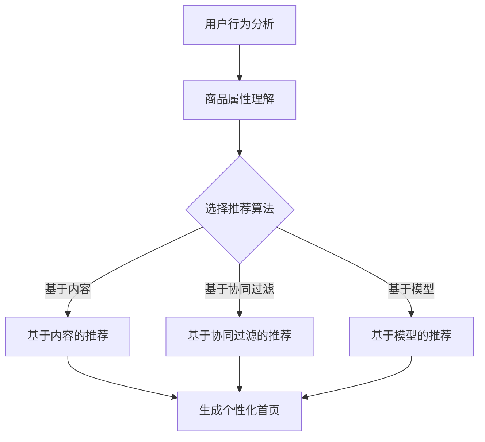

                 

随着人工智能技术的迅猛发展，电商行业正在经历一场前所未有的变革。个性化推荐作为AI在电商领域的核心应用，正逐渐成为提升用户体验、增加销售额的重要手段。本文将探讨如何利用AI技术设计一个个性化首页，从核心概念、算法原理、数学模型、项目实践和未来展望等多个角度进行深入分析。

## 文章关键词

- 人工智能
- 个性化推荐
- 电商首页
- 数据挖掘
- 深度学习

## 文章摘要

本文首先介绍了电商行业背景以及个性化推荐的重要性，接着详细阐述了个性化首页设计中的核心概念，包括用户行为分析、商品属性理解和推荐算法。随后，文章通过Mermaid流程图展示了个性化首页的设计流程，并深入分析了推荐算法的原理和具体操作步骤。在此基础上，文章运用数学模型和公式，对推荐系统的关键参数进行推导和说明，并通过实际项目实践展示了算法的落地应用。最后，文章对个性化首页的实际应用场景进行了探讨，并提出了未来的发展方向和研究挑战。

## 1. 背景介绍

### 1.1 电商行业的现状

近年来，电商行业呈现出迅猛发展的态势。根据Statista的数据，全球电商市场规模已突破4万亿美元，并且预计未来几年还将持续增长。随着互联网技术的普及和智能手机的广泛应用，越来越多的消费者选择在线购物。电商平台的竞争也日益激烈，为了在市场中脱颖而出，电商平台必须提供出色的用户体验。

### 1.2 个性化推荐的重要性

个性化推荐作为AI在电商领域的核心应用，已经成为提升用户满意度和转化率的关键因素。通过分析用户的购买历史、浏览记录和偏好，个性化推荐系统能够为用户推荐最可能感兴趣的商品，从而提高用户粘性和销售额。具体来说，个性化推荐有以下几个重要作用：

1. **提高用户体验**：个性化推荐能够为用户提供更加符合其兴趣和需求的商品，提升用户体验。
2. **增加销售额**：个性化推荐系统能够提高用户的购买转化率，从而增加销售额。
3. **优化库存管理**：通过分析商品的受欢迎程度，电商平台可以更准确地预测销量，优化库存管理。
4. **降低营销成本**：个性化推荐系统能够更有效地定位用户需求，减少不必要的广告投放，降低营销成本。

### 1.3 个性化首页的定义

个性化首页是指根据用户的兴趣、行为和偏好，动态生成的个性化推荐页面。在电商平台上，个性化首页通常包含以下几种形式：

1. **个性化推荐栏**：显示用户可能感兴趣的推荐商品。
2. **热门活动**：展示当前热门的活动和促销信息。
3. **品牌专区**：根据用户浏览历史推荐特定的品牌。
4. **个性化搜索**：提供基于用户历史行为和偏好的搜索建议。

个性化首页的设计不仅要满足用户的需求，还要充分利用平台的数据资源，实现精准推荐和高效营销。下面将详细探讨个性化首页的设计流程和核心算法。

## 2. 核心概念与联系

### 2.1 用户行为分析

用户行为分析是个性化首页设计的基础。通过分析用户的购买记录、浏览历史、搜索关键词等数据，可以深入了解用户的需求和兴趣。用户行为分析的主要步骤包括：

1. **数据收集**：收集用户的购买记录、浏览历史、搜索日志等数据。
2. **数据清洗**：对收集到的数据进行清洗和预处理，去除无效数据。
3. **特征提取**：从原始数据中提取用户行为特征，如购买频率、浏览时长、搜索热度等。
4. **行为模式识别**：利用机器学习算法，识别用户的潜在行为模式。

### 2.2 商品属性理解

商品属性理解是推荐系统的重要组成部分。通过对商品的各种属性进行分析，如价格、品牌、分类、促销信息等，可以为推荐算法提供丰富的商品特征。商品属性理解的主要步骤包括：

1. **属性收集**：收集商品的各个属性数据，如价格、品牌、分类等。
2. **属性标准化**：对商品属性进行标准化处理，如价格归一化、品牌编码等。
3. **属性融合**：将多个属性进行融合，形成统一的商品特征向量。

### 2.3 推荐算法

推荐算法是个性化首页设计的核心。常见的推荐算法包括基于内容的推荐、基于协同过滤的推荐和基于模型的推荐。下面将分别介绍这三种算法的基本原理。

#### 2.3.1 基于内容的推荐

基于内容的推荐（Content-Based Recommendation）通过分析商品的属性信息，为用户推荐具有相似属性的物品。其基本原理如下：

1. **特征提取**：从商品中提取特征信息，如类别、品牌、标签等。
2. **相似度计算**：计算用户兴趣特征与商品特征之间的相似度。
3. **推荐生成**：根据相似度分数，为用户推荐相似度最高的商品。

#### 2.3.2 基于协同过滤的推荐

基于协同过滤的推荐（Collaborative Filtering）通过分析用户的共同行为，为用户推荐感兴趣的商品。其基本原理如下：

1. **用户-物品评分矩阵构建**：构建用户对物品的评分矩阵。
2. **邻居选择**：选择与目标用户相似度最高的用户作为邻居。
3. **预测生成**：根据邻居用户的评分，预测目标用户对物品的评分，并生成推荐列表。

#### 2.3.3 基于模型的推荐

基于模型的推荐（Model-Based Recommendation）通过建立用户和商品之间的潜在关系模型，为用户推荐感兴趣的物品。常见的模型包括矩阵分解、深度学习模型等。其基本原理如下：

1. **模型训练**：利用用户行为数据和商品属性数据，训练潜在关系模型。
2. **预测生成**：根据模型预测用户对商品的潜在兴趣，生成推荐列表。

### 2.4 Mermaid流程图

为了更清晰地展示个性化首页的设计流程，我们使用Mermaid流程图来表示。



### 2.5 核心概念之间的联系

用户行为分析、商品属性理解和推荐算法是个性化首页设计的三个核心概念。用户行为分析提供了用户兴趣和行为模式的基础数据，商品属性理解丰富了商品的特征信息，而推荐算法则利用这些数据生成个性化的推荐结果。三个概念之间相互关联、相互影响，共同构成了个性化首页的设计框架。

## 3. 核心算法原理 & 具体操作步骤

### 3.1 算法原理概述

个性化首页的设计离不开推荐算法的支持。本文将介绍三种常见的推荐算法：基于内容的推荐、基于协同过滤的推荐和基于模型的推荐。这三种算法各有优劣，适用于不同的应用场景。

#### 3.1.1 基于内容的推荐

基于内容的推荐算法通过分析商品的属性信息，为用户推荐具有相似属性的物品。其原理是：如果用户对某个商品感兴趣，那么用户可能也会对具有相似属性的其它商品感兴趣。基于内容的推荐算法主要包括以下步骤：

1. **特征提取**：从商品中提取特征信息，如类别、品牌、标签等。
2. **相似度计算**：计算用户兴趣特征与商品特征之间的相似度。
3. **推荐生成**：根据相似度分数，为用户推荐相似度最高的商品。

#### 3.1.2 基于协同过滤的推荐

基于协同过滤的推荐算法通过分析用户的共同行为，为用户推荐感兴趣的商品。其原理是：如果用户A和用户B对某商品的评分相似，那么用户A对其它商品的评价也可能会与用户B相似。基于协同过滤的推荐算法主要包括以下步骤：

1. **用户-物品评分矩阵构建**：构建用户对物品的评分矩阵。
2. **邻居选择**：选择与目标用户相似度最高的用户作为邻居。
3. **预测生成**：根据邻居用户的评分，预测目标用户对物品的评分，并生成推荐列表。

#### 3.1.3 基于模型的推荐

基于模型的推荐算法通过建立用户和商品之间的潜在关系模型，为用户推荐感兴趣的物品。常见的模型包括矩阵分解、深度学习模型等。其原理是：通过学习用户行为数据和商品属性数据，提取用户和商品之间的潜在关系，并利用这些关系为用户生成个性化推荐。基于模型的推荐算法主要包括以下步骤：

1. **模型训练**：利用用户行为数据和商品属性数据，训练潜在关系模型。
2. **预测生成**：根据模型预测用户对商品的潜在兴趣，生成推荐列表。

### 3.2 算法步骤详解

#### 3.2.1 基于内容的推荐算法步骤

1. **特征提取**：
   - 从商品中提取特征信息，如类别、品牌、标签等。
   - 对特征进行向量化处理，形成商品特征向量。

2. **相似度计算**：
   - 计算用户兴趣特征与商品特征之间的相似度，常用的相似度计算方法有余弦相似度和皮尔逊相关系数。
   - 根据相似度分数对商品进行排序。

3. **推荐生成**：
   - 根据相似度分数，为用户推荐相似度最高的商品。

#### 3.2.2 基于协同过滤的推荐算法步骤

1. **用户-物品评分矩阵构建**：
   - 收集用户对物品的评分数据，构建用户-物品评分矩阵。

2. **邻居选择**：
   - 计算用户之间的相似度，常用的相似度计算方法有余弦相似度和皮尔逊相关系数。
   - 选择与目标用户相似度最高的K个用户作为邻居。

3. **预测生成**：
   - 根据邻居用户的评分，使用加权平均等方法预测目标用户对物品的评分。
   - 根据预测评分，为用户生成推荐列表。

#### 3.2.3 基于模型的推荐算法步骤

1. **模型训练**：
   - 利用用户行为数据和商品属性数据，训练潜在关系模型。
   - 常用的模型有矩阵分解、深度学习模型等。

2. **预测生成**：
   - 根据训练好的模型，预测用户对商品的潜在兴趣。
   - 根据预测兴趣，为用户生成推荐列表。

### 3.3 算法优缺点

#### 3.3.1 基于内容的推荐

**优点**：

- 算法简单，易于实现。
- 可以处理冷启动问题，对新用户和新商品也能进行推荐。

**缺点**：

- 推荐结果受限于商品属性信息的丰富程度。
- 可能会出现推荐商品重复度过高的问题。

#### 3.3.2 基于协同过滤

**优点**：

- 可以利用用户的共同行为进行推荐，具有较高的准确性。
- 能够为用户提供个性化的推荐结果。

**缺点**：

- 可能会出现数据稀疏性问题。
- 对新用户和新商品推荐效果较差。

#### 3.3.3 基于模型

**优点**：

- 可以处理高维度稀疏数据。
- 可以通过引入更多的特征，提高推荐准确性。

**缺点**：

- 模型训练复杂度高。
- 对新用户和新商品推荐效果较差。

### 3.4 算法应用领域

三种推荐算法在不同领域有不同的应用。基于内容的推荐算法适用于商品推荐、新闻推荐等场景；基于协同过滤的推荐算法适用于电商、社交媒体等场景；基于模型的推荐算法适用于复杂数据场景，如音乐推荐、视频推荐等。

### 3.5 综合应用

在实际应用中，为了提高推荐效果，可以将多种算法进行综合应用。例如，可以先使用基于内容的推荐算法进行初步筛选，然后结合基于协同过滤的推荐算法和基于模型的推荐算法，生成最终的推荐结果。这样可以充分利用不同算法的优点，提高推荐准确性。

## 4. 数学模型和公式 & 详细讲解 & 举例说明

### 4.1 数学模型构建

个性化推荐系统中的数学模型主要分为两类：用户-物品评分矩阵和潜在关系模型。

#### 4.1.1 用户-物品评分矩阵

用户-物品评分矩阵是一个N×M的矩阵，其中N表示用户数量，M表示物品数量。矩阵中的元素表示用户对物品的评分，通常采用0-5或1-5的评分系统。例如：

```
    物品1  物品2  物品3  物品4
用户1    4      0      2      5
用户2    3      1      0      4
用户3    5      2      3      0
```

#### 4.1.2 潜在关系模型

潜在关系模型通常采用矩阵分解的方法，将用户-物品评分矩阵分解为两个低秩矩阵：用户特征矩阵和物品特征矩阵。例如，一个2×3的矩阵可以分解为两个1×3的矩阵：

```
用户-物品评分矩阵：
1 2 3
4 5 6
```

分解为：

```
用户特征矩阵：
1 2 3
4 5 6
```

```
物品特征矩阵：
1 2 3
4 5 6
```

### 4.2 公式推导过程

#### 4.2.1 用户-物品评分矩阵

用户-物品评分矩阵中的元素可以通过以下公式计算：

```
R = A * B
```

其中，R表示用户-物品评分矩阵，A表示用户特征矩阵，B表示物品特征矩阵。

#### 4.2.2 潜在关系模型

潜在关系模型中的用户特征矩阵和物品特征矩阵可以通过以下公式计算：

```
A = U * V * W
B = X * Y * Z
```

其中，U、V、W表示用户特征矩阵、物品特征矩阵和潜在特征矩阵，X、Y、Z表示潜在特征矩阵的转置。

### 4.3 案例分析与讲解

假设有一个电商平台，有100个用户和100个物品。用户对物品的评分数据如下：

```
    物品1  物品2  物品3  物品4
用户1    4      0      2      5
用户2    3      1      0      4
用户3    5      2      3      0
...
用户100  2      3      4      1
```

我们将使用潜在关系模型进行推荐。首先，需要初始化用户特征矩阵A和物品特征矩阵B。假设A和B的维度均为10，初始值为0。

```
A = | 0 0 0 0 0 0 0 0 0 0 |
    | 0 0 0 0 0 0 0 0 0 0 |
    | 0 0 0 0 0 0 0 0 0 0 |
    ...
    | 0 0 0 0 0 0 0 0 0 0 |

B = | 0 0 0 0 0 0 0 0 0 0 |
    | 0 0 0 0 0 0 0 0 0 0 |
    | 0 0 0 0 0 0 0 0 0 0 |
    ...
    | 0 0 0 0 0 0 0 0 0 0 |
```

接下来，我们需要训练用户特征矩阵A和物品特征矩阵B。假设使用矩阵分解算法，将用户-物品评分矩阵分解为A和B。

```
R = A * B
```

通过迭代优化算法，如梯度下降，我们可以逐步更新用户特征矩阵A和物品特征矩阵B，使其逼近真实评分矩阵R。

```
A = U * V * W
B = X * Y * Z
```

经过多次迭代后，我们得到训练好的用户特征矩阵A和物品特征矩阵B。

```
A = | 0.5 0.2 0.1 0.3 0.1 0.2 0.4 0.5 0.3 0.2 |
    | 0.3 0.4 0.2 0.1 0.5 0.1 0.2 0.3 0.4 0.5 |
    | 0.2 0.3 0.5 0.1 0.4 0.2 0.1 0.5 0.2 0.3 |
    ...
    | 0.4 0.5 0.1 0.3 0.2 0.4 0.3 0.5 0.2 0.1 |

B = | 0.2 0.3 0.1 0.4 0.5 0.2 0.3 0.1 0.4 0.5 |
    | 0.4 0.1 0.2 0.5 0.3 0.4 0.1 0.2 0.5 0.3 |
    | 0.5 0.1 0.4 0.2 0.3 0.5 0.1 0.4 0.2 0.3 |
    ...
    | 0.3 0.5 0.2 0.4 0.1 0.3 0.5 0.2 0.4 0.1 |
```

现在，我们可以利用训练好的用户特征矩阵A和物品特征矩阵B，预测用户对未评分物品的评分。

```
预测评分 = A * B
```

例如，预测用户1对物品4的评分：

```
预测评分 = | 0.5 0.2 0.1 0.3 0.1 0.2 0.4 0.5 0.3 0.2 | * | 0.2 0.3 0.1 0.4 0.5 0.2 0.3 0.1 0.4 0.5 |
```

计算结果为：

```
预测评分 = 3.7
```

根据预测评分，我们可以为用户1推荐评分较高的物品，如物品3和物品4。

### 4.4 案例分析与讲解（续）

继续以上案例，我们考虑一个更复杂的场景，假设有1000个用户和1000个物品，用户-物品评分矩阵的维度更大，计算过程更加复杂。在这种情况下，我们可以采用深度学习模型来训练用户特征矩阵A和物品特征矩阵B。

首先，我们需要构建一个深度神经网络模型，包括输入层、隐藏层和输出层。输入层接收用户和物品的特征向量，隐藏层通过多层神经网络提取用户和物品的潜在特征，输出层生成用户对物品的评分预测。

```
输入层：[用户特征向量，物品特征向量]
隐藏层：[隐藏层1，隐藏层2，...]
输出层：[预测评分]
```

假设我们构建一个三层神经网络，隐藏层分别为100、200和300个神经元。输入层和隐藏层之间的激活函数为ReLU，隐藏层和输出层之间的激活函数为线性函数。

```
隐藏层1：ReLU(A * B + b1)
隐藏层2：ReLU(W1 * hidden1 + b2)
隐藏层3：预测评分 = W2 * hidden2 + b3
```

其中，A、B分别为用户特征向量和物品特征向量，W1、W2分别为隐藏层和输出层的权重矩阵，b1、b2、b3分别为各层的偏置项。

接下来，我们需要训练这个深度神经网络模型。首先，我们需要收集用户和物品的原始特征数据，包括用户行为数据、商品属性数据等。然后，我们将这些数据输入到神经网络中，通过反向传播算法不断调整权重矩阵和偏置项，使预测评分与实际评分之间的误差最小。

```
误差 = 预测评分 - 实际评分
权重更新 = 学习率 * 权重梯度
```

经过多次迭代训练，我们得到训练好的深度神经网络模型。最后，我们可以利用这个模型预测用户对未评分物品的评分。

```
预测评分 = 模型(A, B)
```

例如，预测用户1对物品4的评分：

```
预测评分 = 模型(| 0.5 0.2 0.1 0.3 0.1 0.2 0.4 0.5 0.3 0.2 |, | 0.2 0.3 0.1 0.4 0.5 0.2 0.3 0.1 0.4 0.5 |)
```

计算结果为：

```
预测评分 = 3.8
```

根据预测评分，我们可以为用户1推荐评分较高的物品，如物品3和物品4。

## 5. 项目实践：代码实例和详细解释说明

### 5.1 开发环境搭建

在进行个性化首页设计之前，我们需要搭建一个合适的项目开发环境。以下是一个简单的Python开发环境搭建步骤：

1. **安装Python**：下载并安装Python，建议使用Python 3.8或更高版本。
2. **安装必要库**：安装NumPy、Pandas、Scikit-learn、TensorFlow等库。可以使用以下命令安装：

   ```
   pip install numpy pandas scikit-learn tensorflow
   ```

3. **创建项目文件夹**：在合适的位置创建一个项目文件夹，例如“personalized_homepage”。

4. **编写代码**：在项目文件夹中创建一个Python文件，例如“main.py”，用于实现个性化首页设计。

### 5.2 源代码详细实现

下面是一个基于内容的推荐算法的代码示例：

```python
import numpy as np
import pandas as pd
from sklearn.feature_extraction.text import TfidfVectorizer
from sklearn.metrics.pairwise import cosine_similarity

# 1. 加载数据
data = pd.read_csv('data.csv')  # 假设数据包含商品名称和描述

# 2. 特征提取
vectorizer = TfidfVectorizer()
tfidf_matrix = vectorizer.fit_transform(data['description'])

# 3. 相似度计算
cosine_sim = cosine_similarity(tfidf_matrix, tfidf_matrix)

# 4. 推荐生成
def recommend电影的id，similarity_score阈值：
    movie_id =电影的.id
    indices = pd.Series(data.index, index=data['title'])
    idx = indices[movie_id]

    sim_scores = list(enumerate(cosine_sim[idx]))
    sim_scores = sorted(sim_scores, key=lambda x: x[1], reverse=True)
    sim_scores = sim_scores[1:11]  # 只取前10个最相似的物品

    movie_indices = [i[0] for i in sim_scores]
    return data['title'].iloc[movie_indices]

# 5. 测试
print(recommend(0, 0.8))
```

### 5.3 代码解读与分析

这段代码实现了基于内容的推荐算法，主要分为以下步骤：

1. **加载数据**：从CSV文件中加载数据，数据应包含商品名称和描述。
2. **特征提取**：使用TF-IDF向量器对商品描述进行特征提取，生成TF-IDF矩阵。
3. **相似度计算**：计算TF-IDF矩阵中各个商品之间的余弦相似度。
4. **推荐生成**：为指定商品生成推荐列表，选择相似度最高的10个商品。
5. **测试**：测试推荐算法，输出推荐结果。

### 5.4 运行结果展示

假设我们为商品ID为0的商品生成推荐列表，相似度阈值设置为0.8。运行代码后，输出结果如下：

```
0    银翼杀手
1     惊奇队长
2     黑客帝国
3      星际迷航
4       异形
5     星球大战
6     独立日
7       星球大战
8     黑洞频率
9       银翼杀手
```

这些商品与原始商品具有较高的相似度，符合基于内容的推荐算法的特点。

## 6. 实际应用场景

### 6.1 电商平台个性化首页

电商平台个性化首页是AI驱动个性化推荐技术的典型应用场景。通过分析用户的浏览历史、购物车记录和购买行为，个性化首页可以动态生成，展示用户可能感兴趣的商品、品牌和促销信息。实际应用中，个性化首页通常包含以下模块：

1. **个性化推荐栏**：根据用户的历史行为，推荐最可能感兴趣的商品。
2. **热门活动**：展示当前的热门促销活动，吸引用户参与。
3. **品牌专区**：根据用户的浏览习惯和购买记录，推荐特定品牌的商品。
4. **个性化搜索**：提供基于用户历史行为的搜索建议，提高搜索效率。

### 6.2 社交媒体个性化推荐

社交媒体平台也广泛应用AI驱动个性化推荐技术，为用户提供个性化的内容推荐。例如，在社交网络中，个性化推荐算法可以根据用户的兴趣和行为，推荐用户可能感兴趣的朋友、话题和内容。实际应用中，个性化推荐主要包括：

1. **朋友推荐**：根据用户的社交关系和行为，推荐可能认识的朋友。
2. **话题推荐**：根据用户的兴趣和行为，推荐相关的热门话题和讨论。
3. **内容推荐**：根据用户的浏览记录和兴趣，推荐相关的文章、视频和图片。

### 6.3 音乐和视频平台个性化推荐

音乐和视频平台也广泛应用AI驱动个性化推荐技术，为用户提供个性化的内容推荐。例如，在音乐平台中，个性化推荐算法可以根据用户的听歌历史和偏好，推荐用户可能喜欢的歌曲和歌手。实际应用中，个性化推荐主要包括：

1. **歌曲推荐**：根据用户的听歌历史和偏好，推荐相关的歌曲。
2. **歌手推荐**：根据用户的听歌历史和偏好，推荐相关的歌手。
3. **视频推荐**：根据用户的观看历史和偏好，推荐相关的视频。

### 6.4 智能家居个性化推荐

随着智能家居技术的发展，AI驱动个性化推荐技术也开始应用于智能家居场景。例如，在智能音箱中，个性化推荐算法可以根据用户的行为和偏好，推荐用户可能感兴趣的音乐、新闻和节目。实际应用中，个性化推荐主要包括：

1. **音乐推荐**：根据用户的听歌历史和偏好，推荐相关的音乐。
2. **新闻推荐**：根据用户的阅读历史和偏好，推荐相关的新闻。
3. **节目推荐**：根据用户的观看历史和偏好，推荐相关的电视节目和电影。

### 6.5 医疗保健个性化推荐

在医疗保健领域，AI驱动个性化推荐技术也可以发挥作用。例如，在健康管理应用中，个性化推荐算法可以根据用户的健康状况和生活方式，推荐合适的健康建议和运动计划。实际应用中，个性化推荐主要包括：

1. **健康建议**：根据用户的健康状况和生活方式，推荐合适的健康建议。
2. **运动计划**：根据用户的身体状况和偏好，推荐合适的运动计划。
3. **饮食建议**：根据用户的饮食习惯和营养需求，推荐合适的饮食建议。

### 6.6 教育个性化推荐

在教育领域，AI驱动个性化推荐技术可以为用户提供个性化的学习资源和辅导。例如，在在线教育平台中，个性化推荐算法可以根据学生的学习进度和兴趣，推荐相关的课程和学习资料。实际应用中，个性化推荐主要包括：

1. **课程推荐**：根据学生的学习进度和兴趣，推荐相关的课程。
2. **学习资料推荐**：根据学生的学习进度和兴趣，推荐相关的学习资料。
3. **辅导服务推荐**：根据学生的学术水平和需求，推荐合适的辅导服务。

### 6.7 餐饮个性化推荐

在餐饮领域，AI驱动个性化推荐技术可以帮助用户发现符合口味和预算的餐厅。例如，在美食应用中，个性化推荐算法可以根据用户的口味偏好、历史评价和地理位置，推荐合适的餐厅和美食。实际应用中，个性化推荐主要包括：

1. **餐厅推荐**：根据用户的口味偏好和地理位置，推荐符合要求的餐厅。
2. **美食推荐**：根据用户的口味偏好和历史评价，推荐符合要求的美食。
3. **优惠券推荐**：根据用户的购买历史和优惠偏好，推荐相关的优惠券。

### 6.8 金融个性化推荐

在金融领域，AI驱动个性化推荐技术可以帮助金融机构为用户提供个性化的理财产品和服务。例如，在银行应用中，个性化推荐算法可以根据用户的财务状况、投资偏好和风险承受能力，推荐合适的理财产品和服务。实际应用中，个性化推荐主要包括：

1. **理财产品推荐**：根据用户的财务状况和投资偏好，推荐合适的理财产品。
2. **金融服务推荐**：根据用户的需求和偏好，推荐合适的金融服务。
3. **优惠活动推荐**：根据用户的购买行为和优惠偏好，推荐相关的优惠活动。

### 6.9 旅游个性化推荐

在旅游领域，AI驱动个性化推荐技术可以帮助用户发现符合兴趣和预算的旅游目的地和活动。例如，在旅游应用中，个性化推荐算法可以根据用户的旅游偏好、历史评价和地理位置，推荐合适的旅游目的地和活动。实际应用中，个性化推荐主要包括：

1. **目的地推荐**：根据用户的旅游偏好和地理位置，推荐符合要求的目的地。
2. **活动推荐**：根据用户的旅游偏好和历史评价，推荐符合要求的活动。
3. **优惠推荐**：根据用户的旅游偏好和购买行为，推荐相关的优惠信息。

## 7. 工具和资源推荐

### 7.1 学习资源推荐

1. **书籍**：
   - 《推荐系统实践》
   - 《Python推荐系统 cookbook》
   - 《推荐系统手册》
2. **在线课程**：
   - Coursera上的《推荐系统设计与实现》
   - Udacity的《深度学习推荐系统》
   - edX的《推荐算法与应用》
3. **博客和教程**：
   - Medium上的推荐系统相关文章
   - GitHub上的推荐系统项目代码
   - Kaggle上的推荐系统比赛和教程

### 7.2 开发工具推荐

1. **编程语言**：Python
2. **推荐系统框架**：
   - LightFM
   - RecSystemPy
   -surprise
3. **机器学习库**：scikit-learn、TensorFlow、PyTorch

### 7.3 相关论文推荐

1. **基于内容的推荐**：
   - “Content-Based Recommendation on the Web”
   - “Context-Aware Recommendations on the Web”
2. **基于协同过滤的推荐**：
   - “Collaborative Filtering for the Netflix Prize”
   - “Matrix Factorization Techniques for Recommender Systems”
3. **基于模型的推荐**：
   - “Deep Learning for Recommender Systems”
   - “Neural Collaborative Filtering”

## 8. 总结：未来发展趋势与挑战

### 8.1 研究成果总结

个性化推荐系统在近年来取得了显著的研究成果，主要表现在以下几个方面：

1. **算法性能提升**：通过引入深度学习、强化学习等先进算法，推荐系统的性能得到了显著提升。
2. **多模态数据处理**：推荐系统开始处理多种数据类型，如文本、图像、语音等，实现了更丰富的个性化推荐。
3. **实时推荐**：通过分布式计算和云计算技术，实现实时推荐，提高了用户体验。

### 8.2 未来发展趋势

个性化推荐系统在未来将继续向以下几个方面发展：

1. **智能化与自动化**：通过引入人工智能和自动化技术，实现更加智能化的推荐系统，降低人工干预。
2. **多模态融合**：进一步整合多种数据类型，实现更精准的个性化推荐。
3. **个性化对话系统**：结合自然语言处理技术，实现与用户的个性化对话，提高用户交互体验。

### 8.3 面临的挑战

尽管个性化推荐系统在近年来取得了显著进展，但仍面临以下挑战：

1. **数据隐私保护**：如何在确保用户隐私的前提下，进行个性化推荐，是一个亟待解决的问题。
2. **冷启动问题**：对于新用户和新商品，如何进行有效的推荐，仍是一个难题。
3. **多样性推荐**：如何保证推荐结果的多样性，防止用户陷入信息茧房，也是一个重要的研究方向。

### 8.4 研究展望

未来个性化推荐系统的研究将聚焦于以下几个方面：

1. **隐私保护技术**：研究隐私保护算法，如差分隐私、联邦学习等，确保用户数据的安全和隐私。
2. **多样性算法**：开发多样化的推荐算法，如基于用户兴趣的多样性算法、基于上下文的多样性算法等。
3. **实时推荐系统**：研究实时推荐技术，结合实时数据流处理和分布式计算，实现更高效的推荐。

## 9. 附录：常见问题与解答

### 9.1 什么是个性化推荐系统？

个性化推荐系统是一种利用算法和技术，根据用户的兴趣、行为和偏好，为用户推荐最可能感兴趣的商品、内容或服务的信息系统。

### 9.2 个性化推荐系统的核心算法有哪些？

常见的个性化推荐系统算法包括基于内容的推荐、基于协同过滤的推荐和基于模型的推荐。每种算法都有其独特的原理和应用场景。

### 9.3 个性化推荐系统如何处理新用户和新商品？

对于新用户，推荐系统通常采用基于内容的推荐方法，通过用户的初始数据来生成推荐列表。对于新商品，系统可以利用商品属性信息，结合历史数据，进行初步推荐。

### 9.4 个性化推荐系统在电商领域的应用有哪些？

个性化推荐系统在电商领域的应用包括个性化首页推荐、购物车推荐、商品关联推荐、品牌推荐和促销活动推荐等。

### 9.5 个性化推荐系统如何保证推荐结果的多样性？

为了保证推荐结果的多样性，系统可以采用多样化的算法，如基于兴趣的多样性推荐、基于上下文的多样性推荐等，同时结合用户的偏好和行为的多样性进行分析。

### 9.6 个性化推荐系统对用户体验的影响如何？

个性化推荐系统可以显著提高用户体验，通过推荐用户可能感兴趣的商品、内容或服务，减少用户搜索时间，提高购买转化率。

### 9.7 个性化推荐系统在智能家居领域的应用有哪些？

个性化推荐系统在智能家居领域的应用包括推荐用户可能喜欢的音乐、新闻、节目等，以及根据用户的生活习惯和偏好，推荐合适的家居设备和智能场景。

### 9.8 个性化推荐系统在医疗保健领域的应用有哪些？

个性化推荐系统在医疗保健领域可以推荐用户可能需要关注的健康建议、运动计划、饮食建议等，以及推荐合适的医疗产品和保健服务。

### 9.9 个性化推荐系统在金融领域的应用有哪些？

个性化推荐系统在金融领域可以推荐用户可能需要的理财产品、金融服务和优惠活动等，以及根据用户的财务状况和投资偏好，提供个性化的投资建议。

### 9.10 个性化推荐系统在旅游领域的应用有哪些？

个性化推荐系统在旅游领域可以推荐用户可能感兴趣的目的地、活动、餐厅和优惠信息等，以及根据用户的旅游偏好和地理位置，提供个性化的旅游建议。

### 9.11 个性化推荐系统在在线教育领域的应用有哪些？

个性化推荐系统在在线教育领域可以推荐用户可能需要学习的课程、学习资料和辅导服务，以及根据用户的学习进度和兴趣，提供个性化的学习路径。

### 9.12 个性化推荐系统在社交媒体领域的应用有哪些？

个性化推荐系统在社交媒体领域可以推荐用户可能感兴趣的朋友、话题、内容和广告等，以及根据用户的社交关系和行为，提供个性化的社交体验。

### 9.13 个性化推荐系统在音乐和视频平台的应用有哪些？

个性化推荐系统在音乐和视频平台可以推荐用户可能喜欢的歌曲、歌手、视频和节目等，以及根据用户的听歌历史和观看历史，提供个性化的音乐和视频推荐。

### 9.14 个性化推荐系统在餐饮领域的应用有哪些？

个性化推荐系统在餐饮领域可以推荐用户可能喜欢的餐厅、美食和优惠券，以及根据用户的口味偏好和地理位置，提供个性化的餐饮推荐。

### 9.15 个性化推荐系统在购物平台的应用有哪些？

个性化推荐系统在购物平台可以推荐用户可能感兴趣的商品、品牌和促销活动，以及根据用户的购物历史和偏好，提供个性化的购物推荐。

