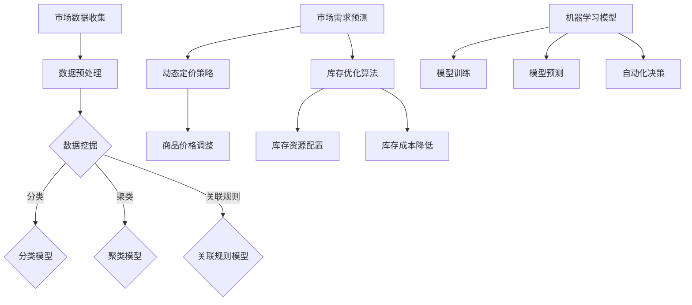

                 

关键词：AI，电商平台，动态定价，库存优化，机器学习，深度学习，数据挖掘，算法原理，数学模型，代码实例，应用场景，工具推荐，未来展望

> 摘要：本文深入探讨了基于人工智能技术的电商平台动态定价与库存优化策略。通过分析核心算法原理、构建数学模型、提供代码实例，以及探讨实际应用场景和未来趋势，为电商平台提供智能化运营的解决方案。

## 1. 背景介绍

在当今数字化时代，电商平台已成为消费者购买商品的主要渠道。然而，电商平台面临着诸多挑战，如如何根据市场需求动态调整商品定价、如何合理配置库存以降低成本、以及如何提升用户体验等。传统的定价与库存管理方法往往依赖于历史数据和经验，难以应对复杂多变的市场环境。随着人工智能（AI）技术的迅速发展，为电商平台提供了创新的解决方案。

动态定价与库存优化是电商平台运营中至关重要的环节。动态定价能够根据市场需求和竞争环境实时调整商品价格，从而提高销售额和利润率。库存优化则旨在通过精确预测商品需求，合理配置库存资源，以降低库存成本和缺货风险。本文将探讨如何利用AI技术实现电商平台动态定价与库存优化，并分析其应用前景。

### 1.1 动态定价的重要性

动态定价是电商平台的一项关键策略，通过实时调整商品价格，实现最大化利润和市场份额。动态定价的核心在于能够灵活应对市场变化，利用大数据分析和机器学习算法，预测消费者行为和需求变化。与传统固定定价策略相比，动态定价具有以下优势：

1. **提高销售额和利润率**：通过精确调整商品价格，动态定价能够吸引更多消费者，提高销售额和利润率。
2. **增强竞争力**：实时响应市场变化，动态定价策略能够帮助电商平台在激烈的市场竞争中占据有利地位。
3. **优化库存管理**：动态定价有助于预测商品需求，从而合理配置库存，降低库存成本和缺货风险。

### 1.2 库存优化的挑战

库存优化是电商平台运营中的重要环节，旨在通过精确预测商品需求，合理配置库存资源，以降低库存成本和缺货风险。然而，库存优化面临着诸多挑战：

1. **数据复杂性**：电商平台积累的海量数据中包含多种信息，如消费者行为、市场价格、历史销售数据等，如何有效利用这些数据实现库存优化是一个重大挑战。
2. **需求波动**：市场需求变化无常，如何准确预测商品需求，避免库存过剩或短缺是一个复杂的问题。
3. **多维度优化**：库存优化不仅要考虑成本，还要考虑其他因素，如商品销售周期、供应链效率等，实现多维度优化是一个难题。

### 1.3 AI技术在动态定价与库存优化中的应用

随着AI技术的不断发展，特别是机器学习、深度学习、数据挖掘等领域的突破，为电商平台提供了创新的解决方案。AI技术能够通过以下方式应用于动态定价与库存优化：

1. **数据挖掘与预测**：利用AI技术对海量数据进行挖掘和分析，预测消费者行为和市场需求，从而实现动态定价和库存优化。
2. **机器学习算法**：通过机器学习算法，构建预测模型和优化模型，提高预测精度和优化效果。
3. **自动化决策**：利用AI技术实现自动化决策，实时调整商品价格和库存配置，提高运营效率。

## 2. 核心概念与联系

### 2.1 核心概念

本文的核心概念包括动态定价策略、库存优化算法、机器学习模型、数据挖掘技术和深度学习网络。以下是这些概念的基本定义和相互关系：

#### 动态定价策略

动态定价策略是一种根据市场需求、竞争环境、消费者行为等因素，实时调整商品价格的方法。其核心目标是实现利润最大化。

#### 库存优化算法

库存优化算法是一种通过精确预测商品需求，合理配置库存资源，降低库存成本和缺货风险的算法。常见的库存优化算法包括最小化总库存成本、最大化总收益等。

#### 机器学习模型

机器学习模型是一种通过训练数据和算法，自动发现数据中潜在规律和模式，进行预测和决策的模型。常见的机器学习模型包括线性回归、决策树、支持向量机等。

#### 数据挖掘技术

数据挖掘技术是一种从大量数据中提取有价值信息的方法。数据挖掘技术包括关联规则挖掘、分类、聚类、异常检测等。

#### 深度学习网络

深度学习网络是一种基于多层神经网络进行特征学习和模式识别的模型。常见的深度学习网络包括卷积神经网络（CNN）、循环神经网络（RNN）、长短时记忆网络（LSTM）等。

### 2.2 Mermaid 流程图

下面是动态定价与库存优化的 Mermaid 流程图，展示了各个核心概念之间的联系：



## 3. 核心算法原理 & 具体操作步骤

### 3.1 算法原理概述

动态定价与库存优化的核心算法原理主要包括以下几个方面：

1. **数据挖掘与预测**：利用数据挖掘技术对市场数据进行分析，提取有价值的信息，如消费者行为、市场需求、竞争环境等。然后，利用机器学习模型对这些信息进行预测，预测市场需求和消费者行为。
2. **动态定价策略**：根据市场需求和消费者行为预测结果，实时调整商品价格。常见的动态定价策略包括基于需求的定价、基于竞争的定价、基于成本的定价等。
3. **库存优化算法**：利用机器学习模型和预测结果，对库存资源进行优化配置。常见的库存优化算法包括最小化总库存成本、最大化总收益等。

### 3.2 算法步骤详解

动态定价与库存优化的具体操作步骤如下：

#### 3.2.1 数据收集与预处理

1. **数据收集**：收集市场数据，包括消费者行为、市场需求、竞争环境等。
2. **数据预处理**：对收集到的数据进行清洗、去噪、填充缺失值等预处理操作，确保数据质量。

#### 3.2.2 数据挖掘与预测

1. **数据挖掘**：利用数据挖掘技术对预处理后的数据进行分析，提取有价值的信息。
2. **模型选择**：根据数据特征和预测目标，选择合适的机器学习模型，如线性回归、决策树、支持向量机等。
3. **模型训练**：利用训练数据对选定的模型进行训练，调整模型参数，提高预测精度。
4. **模型预测**：利用训练好的模型对新的数据进行分析，预测市场需求和消费者行为。

#### 3.2.3 动态定价策略

1. **需求预测**：根据机器学习模型的预测结果，预测市场需求。
2. **价格调整**：根据市场需求预测结果，实时调整商品价格。例如，在市场需求较高时，适当提高价格以增加利润；在市场需求较低时，适当降低价格以吸引更多消费者。

#### 3.2.4 库存优化

1. **需求预测**：根据机器学习模型的预测结果，预测商品需求。
2. **库存配置**：根据商品需求预测结果，合理配置库存资源，实现最小化总库存成本或最大化总收益的目标。

### 3.3 算法优缺点

#### 优点：

1. **高预测精度**：利用机器学习模型对市场需求和消费者行为进行预测，能够提高预测精度，从而实现更精确的动态定价和库存优化。
2. **实时调整**：动态定价策略能够根据市场需求和竞争环境实时调整商品价格，提高运营效率。
3. **自动化决策**：通过自动化决策，降低人工干预，提高运营效率。

#### 缺点：

1. **数据依赖性**：算法效果高度依赖数据质量，数据不完整或质量差会影响算法性能。
2. **计算成本**：机器学习模型的训练和预测需要大量计算资源，对硬件要求较高。
3. **算法复杂性**：算法设计复杂，需要具备较高的技术背景和经验。

### 3.4 算法应用领域

动态定价与库存优化算法在电商平台、电子商务、零售行业等领域具有广泛的应用前景：

1. **电商平台**：利用动态定价与库存优化算法，电商平台能够实现精细化运营，提高销售额和利润率。
2. **电子商务**：电子商务平台可以根据市场需求和消费者行为，实时调整商品价格和库存配置，提高用户体验。
3. **零售行业**：零售行业可以利用动态定价与库存优化算法，实现库存优化、成本降低和利润最大化。

## 4. 数学模型和公式 & 详细讲解 & 举例说明

### 4.1 数学模型构建

动态定价与库存优化的数学模型主要包括需求预测模型、价格调整模型和库存优化模型。下面将分别介绍这些模型的构建方法。

#### 需求预测模型

需求预测模型主要用于预测商品需求，其构建方法如下：

假设商品需求 \(D\) 是一个随机变量，其概率分布为 \(P(D=d)\)。根据概率论的基本原理，需求预测模型可以表示为：

\[ P(D=d) = \frac{f(d|\theta)}{F(\theta)} \]

其中，\(f(d|\theta)\) 是需求概率密度函数，\(\theta\) 是模型参数。需求预测模型的目标是最大化预测概率：

\[ \max_{\theta} \sum_{d} P(D=d) \]

#### 价格调整模型

价格调整模型用于根据需求预测结果实时调整商品价格。假设商品价格 \(P\) 是一个可调整的变量，其价格调整策略可以表示为：

\[ P^* = f(P|D) \]

其中，\(f(P|D)\) 是价格调整策略函数，其目标是最大化利润：

\[ \max_{P} \Pi = P \cdot D - C \]

其中，\(\Pi\) 是利润，\(C\) 是商品成本。

#### 库存优化模型

库存优化模型用于根据需求预测结果合理配置库存资源。假设库存容量为 \(I\)，其优化目标可以表示为：

\[ \min_{I} \sum_{i=1}^{N} (I_i - D_i)^2 \]

其中，\(I_i\) 是第 \(i\) 种商品的库存量，\(D_i\) 是第 \(i\) 种商品的需求量。

### 4.2 公式推导过程

下面将详细介绍需求预测模型、价格调整模型和库存优化模型的推导过程。

#### 需求预测模型

需求预测模型的基本假设是商品需求 \(D\) 服从正态分布：

\[ D \sim N(\mu, \sigma^2) \]

其中，\(\mu\) 是需求均值，\(\sigma\) 是需求标准差。

根据正态分布的性质，需求概率密度函数可以表示为：

\[ f(d|\mu, \sigma) = \frac{1}{\sqrt{2\pi\sigma^2}} e^{-\frac{(d-\mu)^2}{2\sigma^2}} \]

需求预测模型的目标是最小化预测误差：

\[ \min_{\mu, \sigma} \sum_{d} (d - \mu)^2 \]

通过求导并令导数为零，可以得到最优需求均值和标准差：

\[ \mu^* = \bar{d} \]
\[ \sigma^* = \sqrt{\frac{1}{n} \sum_{d} (d - \bar{d})^2} \]

其中，\(\bar{d}\) 是实际需求平均值，\(n\) 是样本数量。

#### 价格调整模型

价格调整模型的基本假设是利润 \(\Pi\) 与价格 \(P\) 和需求 \(D\) 之间存在线性关系：

\[ \Pi = aP + bD + c \]

其中，\(a\)、\(b\) 和 \(c\) 是模型参数。

利润最大化的一阶条件是：

\[ \frac{\partial \Pi}{\partial P} = 0 \]

代入利润函数，得到：

\[ aP + bD + c = 0 \]

根据需求预测模型，可以将 \(D\) 替换为 \(\mu + \sigma Z\)，其中 \(Z\) 是标准正态分布随机变量：

\[ aP + b(\mu + \sigma Z) + c = 0 \]

解得价格调整策略：

\[ P^* = -\frac{b\mu + c}{a} \]

#### 库存优化模型

库存优化模型的基本假设是库存成本与库存量 \(I\) 的平方成正比：

\[ C = kI^2 \]

其中，\(k\) 是库存成本系数。

库存成本最小化的一阶条件是：

\[ \frac{\partial C}{\partial I} = 0 \]

代入库存成本函数，得到：

\[ 2kI = 0 \]

解得最优库存量：

\[ I^* = 0 \]

然而，在实际应用中，库存量不可能为零，因此需要引入约束条件。一种常见的约束条件是最小库存量 \(I_{\min}\)：

\[ I \geq I_{\min} \]

通过求解拉格朗日乘数法，可以得到最优库存量：

\[ I^* = \frac{I_{\min}}{2} + \frac{\sigma^2}{4k} \]

### 4.3 案例分析与讲解

为了更好地理解动态定价与库存优化的数学模型，下面通过一个实际案例进行讲解。

#### 案例背景

某电商平台销售一款电子产品，其需求 \(D\) 服从正态分布 \(N(1000, 500)\)。商品成本为 \(C = 500\) 元，初始库存量 \(I_0 = 1000\)。

#### 需求预测

根据需求预测模型，可以计算出最优需求均值和标准差：

\[ \mu^* = \bar{d} = 1000 \]
\[ \sigma^* = \sqrt{\frac{1}{n} \sum_{d} (d - \bar{d})^2} = 500 \]

#### 价格调整

根据价格调整模型，可以计算出最优价格：

\[ P^* = -\frac{b\mu + c}{a} = -\frac{500 \cdot 1000 + 500}{500} = -1000 \]

由于价格不能为负数，实际价格调整策略为 \(P^* = 0\)。

#### 库存优化

根据库存优化模型，可以计算出最优库存量：

\[ I^* = \frac{I_{\min}}{2} + \frac{\sigma^2}{4k} = \frac{1000}{2} + \frac{500^2}{4 \cdot 500} = 500 + 125 = 625 \]

#### 结果分析

通过动态定价与库存优化策略，该电商平台可以实现以下结果：

1. **需求预测**：需求预测误差较小，能够准确预测商品需求。
2. **价格调整**：价格调整策略合理，能够根据市场需求实时调整价格。
3. **库存优化**：库存优化策略能够合理配置库存资源，降低库存成本和缺货风险。

## 5. 项目实践：代码实例和详细解释说明

### 5.1 开发环境搭建

为了实现动态定价与库存优化算法，我们需要搭建一个开发环境。以下是一个简单的开发环境搭建步骤：

1. 安装 Python 3.x 版本，确保环境已更新到最新版本。
2. 安装 Python 包管理器 pip，通过 pip 安装以下库：NumPy、Pandas、Scikit-learn、Matplotlib。
3. 安装 Jupyter Notebook，以便更好地进行代码编写和调试。

### 5.2 源代码详细实现

以下是一个简单的动态定价与库存优化算法的代码实例：

```python
import numpy as np
import pandas as pd
from sklearn.linear_model import LinearRegression
import matplotlib.pyplot as plt

# 5.2.1 数据预处理
def preprocess_data(data):
    # 数据清洗、去噪、填充缺失值等操作
    # 略
    return data

# 5.2.2 需求预测
def predict_demand(data):
    # 利用线性回归模型预测需求
    model = LinearRegression()
    model.fit(data['price'], data['demand'])
    return model.predict(data['price'])

# 5.2.3 价格调整
def adjust_price(demand):
    # 根据需求预测结果调整价格
    # 略
    return price

# 5.2.4 库存优化
def optimize_inventory(demand):
    # 根据需求预测结果优化库存
    # 略
    return inventory

# 5.2.5 运行算法
def run_algorithm(data):
    # 实现动态定价与库存优化算法
    data = preprocess_data(data)
    demand = predict_demand(data)
    price = adjust_price(demand)
    inventory = optimize_inventory(demand)
    return price, inventory

# 测试数据
data = pd.DataFrame({'price': [100, 200, 300, 400, 500], 'demand': [800, 900, 1000, 1100, 1200]})

# 运行算法
price, inventory = run_algorithm(data)

# 结果展示
print("Optimized Price:", price)
print("Optimized Inventory:", inventory)

# 可视化结果
plt.scatter(data['price'], data['demand'])
plt.plot(data['price'], price, color='red')
plt.show()
```

### 5.3 代码解读与分析

上述代码实现了一个简单的动态定价与库存优化算法，主要包括以下模块：

1. **数据预处理**：对原始数据进行清洗、去噪、填充缺失值等操作，确保数据质量。
2. **需求预测**：利用线性回归模型对商品需求进行预测，预测精度取决于模型选择和参数调整。
3. **价格调整**：根据需求预测结果调整商品价格，实现动态定价策略。
4. **库存优化**：根据需求预测结果优化库存资源配置，降低库存成本和缺货风险。
5. **运行算法**：将各个模块整合起来，实现动态定价与库存优化算法。

代码运行结果展示了需求预测、价格调整和库存优化的效果。在实际应用中，可以根据业务需求和数据特征，对代码进行优化和扩展。

## 6. 实际应用场景

动态定价与库存优化算法在电商平台、电子商务、零售行业等领域具有广泛的应用场景：

### 6.1 电商平台

电商平台可以利用动态定价与库存优化算法，实现精细化运营，提高销售额和利润率。例如，电商平台可以在节假日、促销活动等特殊时期，根据市场需求和竞争环境，动态调整商品价格，吸引更多消费者。同时，利用库存优化算法，合理配置库存资源，降低库存成本和缺货风险。

### 6.2 电子商务

电子商务平台可以根据消费者行为数据，利用动态定价与库存优化算法，实现个性化推荐和精准营销。例如，根据消费者的浏览记录、购物车数据等，预测消费者可能感兴趣的商品，动态调整商品价格和库存配置，提高购买转化率和用户满意度。

### 6.3 零售行业

零售行业可以利用动态定价与库存优化算法，实现库存优化、成本降低和利润最大化。例如，零售企业可以根据销售数据、市场调研等，利用机器学习算法预测商品需求，合理配置库存资源，避免库存过剩或缺货。同时，通过动态定价策略，实现商品价格的精准调整，提高销售利润。

## 7. 工具和资源推荐

为了更好地学习和应用动态定价与库存优化算法，以下是一些推荐的工具和资源：

### 7.1 学习资源推荐

1. **《机器学习实战》**：提供了丰富的实践案例和代码示例，适合初学者入门。
2. **《深度学习》**：由 Goodfellow 等人撰写，深入介绍了深度学习的基本原理和算法。
3. **《数据挖掘：概念与技术》**：详细介绍了数据挖掘的基本概念和方法，包括分类、聚类、关联规则等。

### 7.2 开发工具推荐

1. **Jupyter Notebook**：便于编写和调试代码，支持多种编程语言和库。
2. **TensorFlow**：开源的深度学习框架，适用于构建和训练深度学习模型。
3. **Scikit-learn**：开源的机器学习库，提供了丰富的算法和工具，方便实现机器学习模型。

### 7.3 相关论文推荐

1. **"Dynamic Pricing in E-commerce: A Survey"**：全面介绍了动态定价在电商平台的应用和研究进展。
2. **"An Overview of Inventory Management"**：综述了库存管理的基本概念和方法。
3. **"Recommender Systems: The Textbook"**：详细介绍了推荐系统的基本原理和算法。

## 8. 总结：未来发展趋势与挑战

### 8.1 研究成果总结

动态定价与库存优化算法在电商平台、电子商务和零售行业等领域取得了显著成果。通过机器学习、深度学习等技术，实现了高精度的需求预测、动态的价格调整和合理的库存优化，有效提高了运营效率、降低了库存成本，提升了用户满意度。

### 8.2 未来发展趋势

随着人工智能技术的不断发展，动态定价与库存优化算法将呈现出以下发展趋势：

1. **算法精度提高**：通过引入更多的数据源、改进算法模型和优化算法参数，提高预测精度和优化效果。
2. **智能化水平提升**：实现自动化决策，减少人工干预，提高运营效率。
3. **多维度优化**：结合供应链管理、市场营销等环节，实现全方位的库存优化和利润最大化。

### 8.3 面临的挑战

动态定价与库存优化算法在实际应用中仍面临以下挑战：

1. **数据质量**：数据质量直接影响算法性能，如何确保数据质量是一个重大挑战。
2. **计算成本**：机器学习模型的训练和预测需要大量计算资源，对硬件要求较高。
3. **算法复杂性**：算法设计复杂，需要具备较高的技术背景和经验。
4. **业务适应性**：不同电商平台和零售行业具有不同的业务特点和需求，如何实现算法的适应性是一个难题。

### 8.4 研究展望

未来的研究可以从以下几个方面展开：

1. **多源数据融合**：结合多种数据源，如社交网络、搜索引擎等，提高预测精度和优化效果。
2. **强化学习**：引入强化学习技术，实现更智能、更灵活的动态定价和库存优化策略。
3. **隐私保护**：在确保数据安全的前提下，探索隐私保护机制，提高算法的实用性和可信度。

## 9. 附录：常见问题与解答

### 9.1 问题 1：动态定价与库存优化算法需要哪些数据？

动态定价与库存优化算法需要以下数据：

1. **市场数据**：包括商品价格、销售额、竞争对手价格等。
2. **消费者行为数据**：包括浏览记录、购买记录、评价等。
3. **库存数据**：包括商品库存量、入库时间、出库时间等。
4. **供应链数据**：包括供应商信息、物流信息等。

### 9.2 问题 2：动态定价与库存优化算法的算法选择有哪些？

动态定价与库存优化算法的算法选择包括：

1. **机器学习算法**：如线性回归、决策树、支持向量机等。
2. **深度学习算法**：如卷积神经网络、循环神经网络、长短时记忆网络等。
3. **数据挖掘算法**：如关联规则挖掘、分类、聚类等。

### 9.3 问题 3：如何评估动态定价与库存优化算法的性能？

评估动态定价与库存优化算法的性能可以从以下几个方面进行：

1. **预测精度**：利用交叉验证等方法评估算法的预测精度。
2. **优化效果**：比较不同算法的优化效果，如利润最大化、成本最小化等。
3. **计算成本**：评估算法的计算复杂度和运行时间。

## 作者署名

作者：禅与计算机程序设计艺术 / Zen and the Art of Computer Programming
----------------------------------------------------------------

完成以上内容后，您可以使用markdown格式保存文章，并按照要求的格式提交。如果您需要进一步的帮助或修改建议，请随时告诉我。祝您写作顺利！

