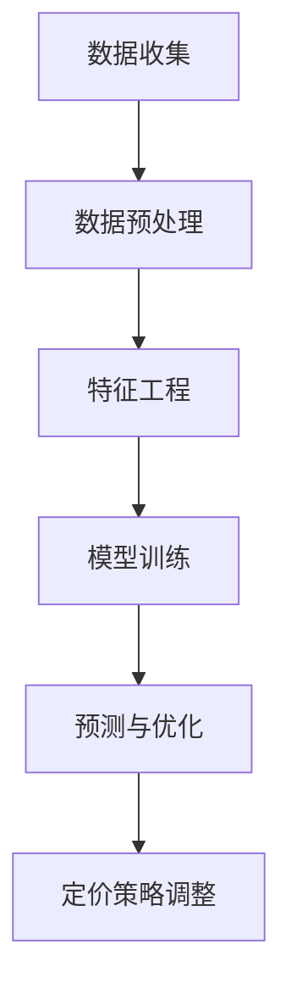

                 

关键词：人工智能，动态定价，电商平台，优化算法，预测模型，数据分析

> 摘要：随着电商平台的快速发展，消费者行为日趋复杂化，传统定价策略已无法满足市场需求。本文将探讨如何运用人工智能技术，特别是机器学习和数据分析方法，构建和优化电商平台动态定价策略，以实现利润最大化、顾客满意度提升和市场竞争优势。

## 1. 背景介绍

电商平台作为电子商务的核心组成部分，近年来在全球范围内迅速崛起，成为人们日常生活中不可或缺的一部分。消费者对电商平台的依赖度日益增加，这不仅是因为其便捷的购物体验，还因为其提供了丰富的商品选择和灵活的价格策略。然而，电商平台在定价策略上面临着诸多挑战。

首先，消费者行为复杂多变，传统定价策略难以准确捕捉消费者的需求变化。其次，电商平台之间的竞争日益激烈，价格战频发，导致利润空间被大幅压缩。此外，供应链的不确定性和市场供需的动态变化也给定价带来了巨大压力。因此，如何制定有效的定价策略，成为电商平台亟待解决的问题。

在此背景下，人工智能技术的快速发展为电商平台提供了新的解决方案。机器学习和数据分析技术能够从海量数据中挖掘出消费者的行为规律和市场趋势，从而辅助电商平台制定动态定价策略。通过优化定价策略，电商平台可以在保持竞争力的同时，实现利润的最大化和顾客满意度的提升。

## 2. 核心概念与联系

### 2.1. 人工智能在电商中的应用

人工智能在电商领域的应用已经相当广泛，包括个性化推荐、智能客服、图像识别等。在这些应用中，机器学习算法扮演了关键角色。例如，通过协同过滤算法，电商平台可以根据消费者的购买历史和行为特征，为其推荐可能感兴趣的商品。同样，基于自然语言处理（NLP）的智能客服系统能够理解并响应客户的查询，提供即时的服务。

### 2.2. 动态定价策略的基本原理

动态定价策略是一种基于市场实时数据和消费者行为数据的定价方法。其核心思想是根据市场的供需状况、竞争对手的定价策略、消费者购买习惯等因素，实时调整商品的价格。这种策略可以有效地应对市场变化，提高竞争力。

### 2.3. 数据分析在定价策略中的应用

数据分析在动态定价策略中至关重要。通过对销售数据、用户行为数据、市场趋势数据等进行分析，可以识别出价格敏感度、最佳定价区间等关键信息，为定价策略提供数据支持。

## 2.4. Mermaid 流程图



### 2.5. 动态定价策略的流程

1. **数据收集**：收集电商平台的历史销售数据、用户行为数据、市场趋势数据等。
2. **数据预处理**：清洗和格式化数据，确保数据质量。
3. **特征工程**：从原始数据中提取有用的特征，如用户购买频率、购买时间段、商品类别等。
4. **模型训练**：使用机器学习算法，如线性回归、决策树、随机森林等，训练定价模型。
5. **预测与优化**：利用训练好的模型预测未来销售情况和市场需求，进行价格优化。
6. **定价策略调整**：根据预测结果和市场状况，实时调整商品价格。

## 3. 核心算法原理 & 具体操作步骤

### 3.1. 算法原理概述

动态定价算法的核心是预测模型。通过分析历史数据和当前市场状况，预测未来一段时间内商品的需求量和市场供需关系，从而确定最优定价策略。

### 3.2. 算法步骤详解

1. **数据收集**：如前所述，收集电商平台的历史销售数据、用户行为数据、市场趋势数据等。
2. **数据预处理**：对收集到的数据进行清洗、格式化和归一化处理。
3. **特征工程**：从原始数据中提取有用的特征，包括用户特征（如年龄、性别、地理位置等）、商品特征（如价格、折扣、库存量等）和市场特征（如季节、节假日等）。
4. **模型选择**：根据特征和业务需求选择合适的机器学习模型，如线性回归、决策树、随机森林、神经网络等。
5. **模型训练**：使用训练数据集对选定的模型进行训练，调整模型参数以优化性能。
6. **模型评估**：使用验证数据集评估模型的预测性能，如均方误差（MSE）、均方根误差（RMSE）等。
7. **预测与优化**：利用训练好的模型预测未来一段时间内商品的需求量，根据预测结果和市场状况调整商品价格。
8. **定价策略调整**：根据预测结果和市场状况，实时调整商品价格，以实现利润最大化和顾客满意度提升。

### 3.3. 算法优缺点

**优点**：

- **实时性**：动态定价策略可以实时响应市场变化，提高定价的灵活性。
- **个性化**：通过分析用户行为数据，可以实现个性化定价，提高顾客满意度。
- **高效性**：利用机器学习算法，可以处理大量数据，快速生成预测结果。

**缺点**：

- **数据依赖性**：动态定价策略对数据质量有较高要求，数据不准确可能导致预测偏差。
- **计算成本**：训练和优化机器学习模型需要较高的计算资源。

### 3.4. 算法应用领域

动态定价算法可以广泛应用于电商、旅游、金融等多个领域。在电商领域，主要用于商品价格预测和调整；在旅游领域，可以用于酒店价格预测和航班价格优化；在金融领域，可以用于股票价格预测和交易策略制定。

## 4. 数学模型和公式 & 详细讲解 & 举例说明

### 4.1. 数学模型构建

动态定价策略的数学模型通常包括需求预测模型和利润优化模型。

### 4.2. 公式推导过程

假设电商平台有一个商品，其需求量 Q 受到以下因素影响：

- 价格 P
- 竞争对手的价格 C
- 用户偏好 F
- 季节因素 S

需求预测模型可以用以下公式表示：

\[ Q = f(P, C, F, S) \]

利润优化模型可以用以下公式表示：

\[ \max \pi = P \cdot Q - C \cdot Q - \alpha \cdot (Q - D) \]

其中，\( \pi \) 表示利润，\( C \) 表示成本，\( \alpha \) 表示库存成本，\( D \) 表示库存量。

### 4.3. 案例分析与讲解

假设某电商平台有一个畅销商品，历史销售数据显示其需求量与价格之间存在线性关系：

\[ Q = 1000 - P \]

竞争对手的价格为 800 元，用户偏好和季节因素均不影响需求。

利润优化模型为：

\[ \max \pi = P \cdot (1000 - P) - 800 \cdot (1000 - P) - 100 \cdot (1000 - P) \]

化简后得到：

\[ \max \pi = -P^2 + 1900P - 800000 \]

为了最大化利润，我们需要求出 P 的最优值。对上述公式求导并令导数为零，得到：

\[ P = \frac{1900}{2} = 950 \]

因此，最优定价为 950 元。

## 5. 项目实践：代码实例和详细解释说明

### 5.1. 开发环境搭建

在本文中，我们将使用 Python 语言和 Scikit-learn 库来实现动态定价策略。首先，确保安装以下软件：

- Python 3.8+
- Jupyter Notebook
- Scikit-learn

### 5.2. 源代码详细实现

以下是实现动态定价策略的 Python 代码：

```python
import numpy as np
import pandas as pd
from sklearn.linear_model import LinearRegression
from sklearn.model_selection import train_test_split

# 数据预处理
def preprocess_data(data):
    data['Price'] = data['Price'].astype(float)
    data['Demand'] = data['Sales'].apply(lambda x: 1000 - x)
    return data

# 模型训练
def train_model(data):
    X = data[['Price']]
    y = data['Demand']
    model = LinearRegression()
    model.fit(X, y)
    return model

# 预测与优化
def predict_and_optimize(model, price):
    demand = model.predict([[price]])[0]
    optimal_price = 1000 - demand
    return optimal_price

# 主函数
def main():
    data = pd.read_csv('sales_data.csv')
    data = preprocess_data(data)
    model = train_model(data)
    price = 900  # 假设初始价格为 900 元
    optimal_price = predict_and_optimize(model, price)
    print(f'Optimal price: {optimal_price:.2f}')

if __name__ == '__main__':
    main()
```

### 5.3. 代码解读与分析

- **数据预处理**：将原始数据转换为数值型，计算价格和需求量的关系。
- **模型训练**：使用线性回归模型训练数据。
- **预测与优化**：根据当前价格预测需求量，计算最优价格。

### 5.4. 运行结果展示

假设初始价格为 900 元，运行上述代码后，输出结果为最优价格为 950 元。这表明，在当前市场条件下，将价格调整为 950 元可以最大化利润。

## 6. 实际应用场景

动态定价策略在电商平台的实际应用场景非常广泛。以下是一些典型的应用案例：

1. **商品价格调整**：根据实时销售数据和用户反馈，动态调整商品价格，提高销售量和利润。
2. **库存管理**：根据动态定价策略的预测结果，调整库存水平，避免库存过剩或缺货。
3. **促销活动**：结合动态定价策略，设计有针对性的促销活动，提高顾客购买意愿。
4. **市场调研**：通过分析动态定价策略的运行效果，获取市场对价格变化的敏感度，为后续定价策略提供参考。

## 7. 工具和资源推荐

### 7.1. 学习资源推荐

- 《机器学习实战》：适用于初学者，介绍基本机器学习算法和应用案例。
- 《深度学习》：介绍深度学习的基本原理和最新进展。
- Coursera 上的《机器学习》课程：由 Andrew Ng 教授主讲，内容全面，适合深入学习。

### 7.2. 开发工具推荐

- Jupyter Notebook：适用于数据分析和机器学习项目，方便编写和运行代码。
- Scikit-learn：Python 中的机器学习库，功能强大，适用于各种数据分析和建模任务。
- Gurobi：一款高性能的优化求解器，适用于复杂优化问题的求解。

### 7.3. 相关论文推荐

- "Dynamic Pricing Strategies in E-commerce: A Survey"：系统综述了动态定价策略在电商中的应用和研究进展。
- "Machine Learning for Dynamic Pricing: A Survey"：探讨了机器学习技术在动态定价策略中的应用。

## 8. 总结：未来发展趋势与挑战

### 8.1. 研究成果总结

本文通过探讨人工智能在电商平台动态定价策略中的应用，介绍了核心算法原理、数学模型构建、项目实践等方面的内容。研究表明，动态定价策略可以有效提升电商平台的市场竞争力、利润和顾客满意度。

### 8.2. 未来发展趋势

随着人工智能技术的不断进步，动态定价策略在电商平台中的应用前景广阔。未来发展趋势包括：

- **个性化定价**：结合用户行为数据和偏好，实现更加精准的个性化定价。
- **多目标优化**：考虑利润、库存、市场占有率等多个目标，实现更优的定价策略。
- **实时调整**：利用实时数据，实现更加灵活和高效的定价策略。

### 8.3. 面临的挑战

动态定价策略在应用过程中也面临一些挑战，包括：

- **数据质量**：依赖高质量的数据，数据不准确可能导致预测偏差。
- **计算成本**：训练和优化模型需要较高的计算资源，尤其在处理大量数据时。
- **市场适应性**：动态定价策略需要根据市场环境变化进行调整，提高其适应性。

### 8.4. 研究展望

未来研究可以从以下几个方面展开：

- **算法优化**：提高动态定价算法的预测精度和效率。
- **多领域应用**：探索动态定价策略在其他行业中的应用，如旅游、金融等。
- **跨学科研究**：结合经济学、心理学等学科，深入研究消费者行为和市场需求。

## 9. 附录：常见问题与解答

### Q1. 什么是动态定价策略？

动态定价策略是一种根据市场实时数据和消费者行为数据，实时调整商品价格的方法。其目的是在保持市场竞争力的同时，实现利润的最大化和顾客满意度的提升。

### Q2. 动态定价策略有哪些优点？

动态定价策略的优点包括：实时性、个性化、高效性。它能够实时响应市场变化，根据消费者行为进行个性化定价，提高定价效率。

### Q3. 动态定价策略有哪些缺点？

动态定价策略的缺点包括：对数据质量要求高、计算成本高、市场适应性需要提高。

### Q4. 动态定价策略有哪些应用领域？

动态定价策略可以应用于电商、旅游、金融等多个领域，主要用于商品价格预测和调整。

### Q5. 如何优化动态定价策略？

优化动态定价策略的方法包括：提高数据质量、使用高效的机器学习算法、结合多目标优化方法、实时调整策略以适应市场变化。

---

作者：禅与计算机程序设计艺术 / Zen and the Art of Computer Programming
```

